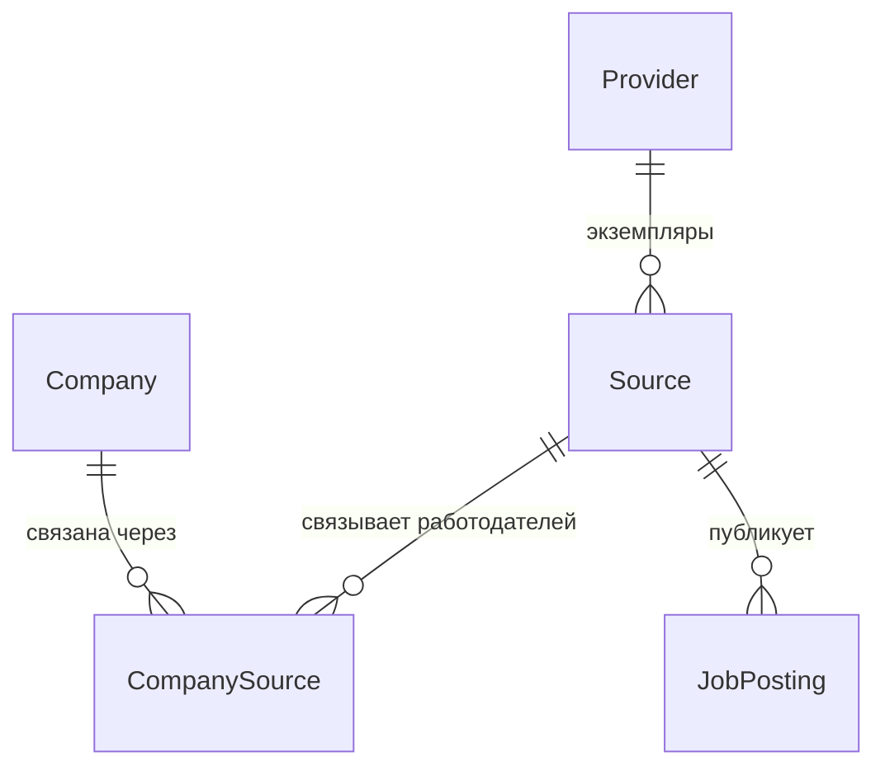
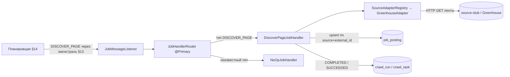
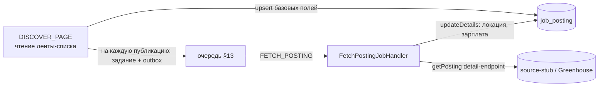

# Техническое описание проекта: файлы и конструкции

Живой документ. Объясняет **каждый файл и каждую неочевидную конструкцию** проекта
простыми словами — что это, зачем здесь и куда посмотреть в официальной
документации. Пополняется по мере роста проекта. Цель — чтобы владелец понимал
весь код и структуру (см. `working-contract.md`, раздел 0.1).

Пояснение сквозных слов, которые встречаются ниже:

- **Каркас** — базовая заготовка проекта: структура папок и минимальные
  приложения, которые собираются и запускаются, но ещё без бизнес-логики.
- **Зависимость** — сторонняя библиотека, которую использует наш код.
- **Бин** (bean) — объект-компонент, которым управляет Spring: создаёт его и
  подставляет туда, где он нужен.
- **Контекст приложения** — набор всех таких компонентов и их связей, который
  Spring создаёт при запуске.

---

## 1. Структура репозитория

```
roleorienta/
├── pom.xml                  # корневой файл сборки (объединяет модули + задаёт версии)
├── core/                    # общий модуль: классы предметной области (сущности БД)
├── job-api/                 # приложение REST API
├── job-worker/              # приложение фоновой обработки
├── docs/                    # документация (источник истины)
├── infra/source-stub/       # файлы заглушки источника (имитация внешнего сайта)
├── docker-compose.yml       # локальное окружение для запуска на своей машине
├── .github/workflows/ci.yml # автоматическая сборка при загрузке в GitHub
├── .gitignore
└── .env.example             # пример локальных переменных окружения
```

Это **монорепозиторий** — то есть несколько приложений живут в одном
Git-репозитории и собираются одним деревом сборки. `job-api` и `job-worker` —
отдельные приложения, но с общими версиями библиотек и общей базой данных.

---

## 2. Maven: проект из нескольких модулей

Maven — это система сборки: она скачивает нужные библиотеки, компилирует код,
запускает тесты и собирает готовые приложения. Каждый модуль описывается файлом
`pom.xml` (Project Object Model — «объектная модель проекта»).
Документация: https://maven.apache.org/pom.html · про несколько модулей:
https://maven.apache.org/guides/mini/guide-multiple-modules-4.html

### 2.1 Корневой `pom.xml` — две роли

**Объединяющий модуль**: секция `<modules>` перечисляет подмодули
(`core`, `job-api`, `job-worker`). Одна команда `mvn ...` в корне собирает их все
сразу.

**Родительский модуль**: подмодули в своём `pom.xml` указывают `<parent>` = наш
корневой модуль и наследуют от него общие настройки и версии библиотек.
`<packaging>pom</packaging>` означает, что сам корень ничего не компилирует — он
только объединяет модули и задаёт общие правила.

### 2.2 Наследование от `spring-boot-starter-parent`

Наш корневой `pom.xml` сам наследует от стандартного родителя Spring Boot —
`spring-boot-starter-parent:4.1.1`:

```xml
<parent>
    <groupId>org.springframework.boot</groupId>
    <artifactId>spring-boot-starter-parent</artifactId>
    <version>4.1.1</version>
</parent>
```

Он приносит **согласованный список версий** сотен библиотек (такой список
называют BOM — bill of materials, «спецификация версий»), а также разумные
настройки компилятора и вспомогательных инструментов. Именно поэтому у
большинства библиотек ниже **не указана версия** — её подставляет этот родитель,
и все библиотеки заведомо совместимы между собой.
Документация: https://docs.spring.io/spring-boot/reference/using/build-systems.html

### 2.3 Свойство `java.version`

```xml
<properties>
    <java.version>21</java.version>
</properties>
```

Родитель Spring Boot превращает это свойство в настройку компилятора
(`maven.compiler.release=21`) — то есть код компилируется под Java 21. Задаётся в
одном месте.

### 2.4 Зависимости-«стартеры»

`spring-boot-starter-web`, `-data-jpa`, `-amqp` и подобные — это **готовые
наборы**: одна зависимость подтягивает сразу связку библиотек под конкретную
задачу (например, `web` = встроенный веб-сервер Tomcat + Spring MVC +
обработка JSON). Не нужно перечислять десятки библиотек вручную.
Список стартеров: https://docs.spring.io/spring-boot/reference/using/build-systems.html#using.build-systems.starters

### 2.5 `dependencyManagement` + подключение чужого списка версий

```xml
<dependencyManagement>
    <dependencies>
        <dependency>
            <groupId>org.testcontainers</groupId>
            <artifactId>testcontainers-bom</artifactId>
            <version>${testcontainers.version}</version>
            <type>pom</type>
            <scope>import</scope>
        </dependency>
    </dependencies>
</dependencyManagement>
```

Секция `dependencyManagement` **не добавляет** библиотеки — она только заранее
задаёт их версии на случай, если библиотека понадобится. Строка
`<scope>import</scope>` вместе с `<type>pom</type>` подключает готовый список
версий из чужого файла (`testcontainers-bom`). Это понадобилось потому, что
Spring Boot 4.x **не задаёт** версии библиотеки Testcontainers (в версии 3.x
задавал) — и без этого блока сборка выдавала ошибку «version is missing» (версия
не указана).
Документация:
https://maven.apache.org/guides/introduction/introduction-to-dependency-mechanism.html#importing-dependencies

### 2.6 Плагин `spring-boot-maven-plugin` и сборка образа

Этот плагин в каждом приложении делает две вещи: `repackage` — собирает
запускаемый jar-файл, внутри которого лежат сразу все нужные библиотеки;
`build-image` — собирает Docker-образ **без написания Dockerfile** (с помощью
готового инструмента Cloud Native Buildpacks). Имя образа задано в корне:
`roleorienta/<имя-модуля>:<версия>`.
Документация: https://docs.spring.io/spring-boot/maven-plugin/build-image.html

---

## 3. Приложения Spring Boot

### 3.1 `@SpringBootApplication`

Эта аннотация стоит над главными классами `JobApiApplication` /
`JobWorkerApplication`. Она объединяет три аннотации в одной:

- `@Configuration` — класс может описывать компоненты (бины);
- `@EnableAutoConfiguration` — Spring Boot сам настраивает то, что нашёл среди
  подключённых библиотек (нашёл драйвер PostgreSQL и `spring-data-jpa` → настроил
  подключение к базе; нашёл веб-стартер → запустил веб-сервер);
- `@ComponentScan` — ищет наши компоненты в этом пакете и вложенных.

Документация: https://docs.spring.io/spring-boot/reference/using/using-the-springbootapplication-annotation.html

### 3.2 `SpringApplication.run(...)`

Точка входа приложения: создаёт контекст приложения (то есть все компоненты и их
связи), применяет автонастройку и запускает веб-сервер. Это обычный
`public static void main`.

### 3.3 `@EnableScheduling` (только в job-worker)

Включает встроенный планировщик Spring: методы, помеченные `@Scheduled`, будут
вызываться по расписанию. На первом этапе `job-worker` работает как периодический
планировщик — эта аннотация закладывает такую возможность (сами периодические
задачи добавим позже).
Документация: https://docs.spring.io/spring-framework/reference/integration/scheduling.html

---

## 4. Конфигурация `application.yml`

Внешние настройки каждого приложения. YAML — текстовый формат «ключ: значение» с
отступами.
Документация: https://docs.spring.io/spring-boot/reference/features/external-config.html

### 4.1 Подстановки вида `${ПЕРЕМЕННАЯ:значение-по-умолчанию}`

```yaml
url: ${DB_URL:jdbc:postgresql://localhost:5432/roleorienta}
```

Значение берётся из переменной окружения `DB_URL`; если её нет — используется
значение после двоеточия (удобно для запуска на своей машине). Так пароли и
адреса не «зашиты» в код и задаются снаружи (требование к облачной готовности,
раздел 3.4 технического документа).

### 4.2 JPA (работа с базой через объекты)

- `spring.jpa.hibernate.ddl-auto` — определяет, меняет ли Hibernate схему базы
  сам. `validate` (в `job-api`) = только проверить, что таблицы совпадают с
  классами; `none` (в `job-worker`) = вообще не трогать. Схему у нас ведёт
  **Flyway**, а не Hibernate.
- `open-in-view: false` — отключает режим, при котором соединение с базой
  держится открытым на всё время ответа пользователю. Этот режим приводит к
  скрытым запросам к базе, поэтому мы его явно выключаем.

Документация: https://docs.spring.io/spring-boot/reference/data/sql.html#data.sql.jpa-and-spring-data

### 4.3 Flyway

`spring.flyway.enabled: true` в `job-api` и `false` в `job-worker` — значит,
миграции (изменения схемы базы) применяет только `job-api` (он владелец схемы),
чтобы два приложения не применяли их одновременно. Подробнее про Flyway —
раздел 5.

### 4.4 Actuator: служебные проверки состояния

Библиотека `spring-boot-starter-actuator` добавляет служебные адреса, в том числе
`/actuator/health` (проверка состояния приложения).

```yaml
management:
  endpoint:
    health:
      probes:
        enabled: true
      group:
        readiness:
          include: readinessState,db
```

Различают две проверки:

- **liveness** («приложение живо?») — не должна зависеть от внешних систем; если
  она не проходит, система управления контейнерами (например, Kubernetes)
  перезапускает приложение. Поэтому базу данных в неё не включают.
- **readiness** («приложение готово принимать запросы?») — включает базу: если
  база недоступна, запросы на приложение временно не направляют, но и не
  перезапускают его.

Это общепринятый подход для Kubernetes; закладываем сразу.
Документация: https://docs.spring.io/spring-boot/reference/actuator/endpoints.html#actuator.endpoints.health.groups
и https://docs.spring.io/spring-boot/reference/deployment/cloud.html

### 4.5 RabbitMQ (в job-worker)

```yaml
rabbitmq:
  publisher-confirm-type: correlated
  publisher-returns: true
```

`publisher-confirm-type` включает подтверждения от брокера сообщений, что
сообщение принято; `publisher-returns` включает уведомление, если сообщение
некуда доставить. Оба нужны для надёжной отправки (см. раздел 7 про паттерн
outbox). Соединение с брокером «ленивое» — приложение запускается, даже если
брокер сейчас недоступен.
Документация: https://docs.spring.io/spring-boot/reference/messaging/amqp.html

---

## 5. База данных и миграции (Flyway)

Flyway — инструмент управления версиями схемы базы данных. Файлы миграций (по
одному на каждое изменение схемы) лежат в
`job-api/src/main/resources/db/migration/` и применяются по порядку при запуске
`job-api`. Flyway ведёт служебную таблицу `flyway_schema_history` и не применяет
одну и ту же миграцию дважды.
Документация: https://documentation.red-gate.com/flyway и
https://docs.spring.io/spring-boot/how-to/data-initialization.html#howto.data-initialization.migration-tool.flyway

### 5.1 Имена файлов миграций

Формат: `V` + номер версии + **два подчёркивания** + описание + `.sql`, например
`V1__baseline.sql`. Миграции применяются в порядке возрастания номера версии. Два
подчёркивания обязательны — это разделитель между номером и описанием.

### 5.2 `V1__baseline.sql`

Намеренно пустая (только комментарии): фиксирует «нулевую точку» истории
миграций. Таблицы предметной области добавляются отдельными миграциями.

### 5.3 `V2__outbox.sql` — конструкции SQL

```sql
CREATE TABLE outbox_event (
    id BIGINT GENERATED ALWAYS AS IDENTITY PRIMARY KEY,
    ...
    payload JSONB NOT NULL,
    published_at TIMESTAMPTZ,
    ...
);
CREATE INDEX idx_outbox_event_unpublished
    ON outbox_event (id) WHERE published_at IS NULL;
```

- `GENERATED ALWAYS AS IDENTITY` — современный способ автоматически выдавать
  числовой ключ (вместо устаревшего `serial`): значение `id` присваивает сама
  база. https://www.postgresql.org/docs/current/ddl-identity-columns.html
- `JSONB` — тип для хранения JSON в двоичном виде: удобно хранить тело события и
  искать по его полям. https://www.postgresql.org/docs/current/datatype-json.html
- `TIMESTAMPTZ` — момент времени с учётом часового пояса.
- **Частичный индекс** (`WHERE published_at IS NULL`) — ускоряющая структура,
  которая охватывает **только ещё не отправленные** строки. Отправитель ищет
  именно их, а такой индекс маленький и быстрый.
  https://www.postgresql.org/docs/current/indexes-partial.html

Назначение таблицы — паттерн «transactional outbox», см. раздел 7.

---

## 6. Тесты (JUnit 5 + Testcontainers)

### 6.1 `@SpringBootTest` + `contextLoads()`

`@SpringBootTest` запускает **настоящий** контекст приложения внутри теста.
Пустой тест `contextLoads()` проверяет самое важное: приложение вообще
запускается (все компоненты создались и связались, автонастройка и миграции
согласованы). Простой, но ценный тест «на дым» (быстрая проверка, что ничего не
сломано на самом базовом уровне).
Документация: https://docs.spring.io/spring-boot/reference/testing/spring-boot-applications.html

### 6.2 Testcontainers и `@ServiceConnection`

Тесту нужна настоящая база данных (и брокер), а не имитация. Библиотека
Testcontainers на время теста запускает их в Docker-контейнерах и останавливает
после.

```java
@TestConfiguration(proxyBeanMethods = false)
public class TestcontainersConfiguration {
    @Bean @ServiceConnection
    PostgreSQLContainer<?> postgresContainer() { return new PostgreSQLContainer<>("postgres:16-alpine"); }
}
```

- `@TestConfiguration` — настройка, действующая только в тестах.
- `PostgreSQLContainer` / `RabbitMQContainer` — управляемые из кода контейнеры.
- `@ServiceConnection` — Spring Boot сам берёт из контейнера адрес, логин и пароль
  и подставляет их приложению. Не нужно вручную прописывать адрес базы в тесте.
- Тест подключает эту настройку через `@Import(TestcontainersConfiguration.class)`.

Важно: для запуска таких тестов нужен **работающий Docker** (на своей машине —
Docker Desktop; при автоматической сборке в GitHub он уже есть).
Документация: https://docs.spring.io/spring-boot/reference/testing/testcontainers.html и
https://java.testcontainers.org/

---

## 7. RabbitMQ и паттерн transactional outbox

**RabbitMQ** — брокер сообщений: посредник с очередью, через который `job-worker`
надёжно получает фоновые задания. Надёжность означает доставку «хотя бы один раз»
(at-least-once), автоматические повторы при сбое и отдельную очередь для
сообщений, которые так и не удалось обработать (её называют dead-letter queue,
DLQ — «очередь мёртвых писем»).
Документация: https://www.rabbitmq.com/tutorials

**Transactional outbox** («исходящий ящик в транзакции») — приём надёжной
отправки сообщений. Проблема: нельзя одной неделимой операцией и записать в базу,
и отправить сообщение в брокер — это две разные системы, и любая из них может
сбойнуть в середине. Решение: событие сначала пишется в таблицу `outbox_event`
**в той же транзакции базы**, что и основные данные; затем отдельный отправитель
читает ещё не отправленные строки, шлёт их в брокер и помечает временем отправки
(`published_at`). Если отправка сорвётся — событие не потеряется, его отправят
снова.
Обзор паттерна: https://microservices.io/patterns/data/transactional-outbox.html

Инфраструктура (брокер, таблица outbox, настройки) и сам конвейер доставки —
публикатор, топология RabbitMQ и идемпотентный потребитель — реализованы;
подробный разбор конструкций в §13. Планировщик доменных заданий (создание
`CrawlRun`/задания в одной транзакции с outbox-событием) — следующий инкремент.

---

## 8. `docker-compose.yml` — локальный запуск

Docker Compose запускает несколько контейнеров одной командой `docker compose up`.
Наш набор: PostgreSQL, RabbitMQ, MinIO (хранилище файлов, совместимое с
Amazon S3), WireMock (заглушка внешнего источника) и два наших приложения.
Документация: https://docs.docker.com/compose/

Ключевые части файла:

- `image:` — какой образ запускать (наши приложения — образы, собранные командой
  сборки образа из раздела 2.6).
- `environment:` — переменные окружения (те самые `${DB_URL}` и подобные).
- `${ПЕРЕМЕННАЯ:-значение}` — как в командной оболочке: берётся значение из файла
  `.env`, а если его нет — подставляется значение после `:-`. Файл `.env`
  создаётся из `.env.example` и в Git не сохраняется.
- `healthcheck:` — как Compose понимает, что сервис готов (например, команда
  `pg_isready` для PostgreSQL).
- `depends_on: { condition: service_healthy }` — `job-worker` запускается только
  после того, как база и брокер стали готовы.
- `volumes:` — постоянные тома, чтобы данные базы и брокера не пропадали между
  перезапусками.
- `ports: "5432:5432"` — сделать порт контейнера доступным на вашей машине
  (по адресу localhost).

---

## 9. Автоматическая сборка — `.github/workflows/ci.yml` (GitHub Actions)

Сборка запускается автоматически при каждой загрузке кода (`push`) и каждом
запросе на слияние (`pull request`).
Документация: https://docs.github.com/actions

- `on:` — когда запускать (загрузка в ветку `main`, любые запросы на слияние).
- `jobs.build.runs-on: ubuntu-latest` — на какой машине выполнять.
- `steps:` — шаги: `checkout` (получить код), `setup-java` (установить Java 21 и
  сохранить кэш загруженных библиотек Maven), `mvn -B -ntp verify` (собрать и
  прогнать тесты).
- `-B` — неинтерактивный режим, `-ntp` — не печатать подробности загрузок.

На серверах-исполнителях GitHub есть Docker, поэтому тесты с Testcontainers там
работают.

---

## 10. `.gitignore`

Список того, что Git не сохраняет: `target/` (результаты сборки), файлы среды
разработки (`.idea/`, `.settings/`, `bin/`), `.DS_Store` (служебный файл macOS),
`.env` (локальные пароли и настройки), `.obsidian/` (настройки Obsidian, если вы
открываете папку `docs/` как хранилище заметок Obsidian).

---

## 11. Модель данных — срез 1: источники и публикации

Этот срез задаёт **вход данных**: откуда мы собираем вакансии (провайдер,
источник, компания и их связи) и какие исходные публикации получили — с ключами,
которые однозначно опознают каждую запись и не дают появиться дублям.
Объединение публикаций в единую вакансию и разбор их содержимого — в следующих
срезах.

Пять сущностей (классов, которые отображаются на таблицы) в модуле `core`
(пакет `com.roleorienta.core.domain`): `Provider`, `Company`, `Source`,
`CompanySource`, `JobPosting`. Плюс перечисления `ProviderKind`, `SourceKind`,
`SourceState`, `VerifiedBy`. Схему задаёт миграция `V3__sources_and_postings.sql`.

Связи первого среза:



### 11.1 Модуль `core`

Отдельный модуль сборки с классами предметной области, от которого зависят
приложения (сейчас — `job-api`, позже — `job-worker`). Так одни и те же классы не
дублируются. Это **библиотека**, а не приложение: у неё нет плагина сборки
образа, только зависимости `spring-boot-starter-data-jpa` (аннотации для работы с
базой) и `jackson-databind` (нужна для сохранения поля-JSON). Почему отдельный
модуль, а не пакет внутри `job-api`: `job-worker` вскоре будет записывать эти же
сущности, и общий модуль избавляет от дублирования и от болезненного переноса
классов позже.

### 11.2 Подход «сначала схема базы» (DB-first)

Схему базы описывает **Flyway** (миграция `V3`), а классы-сущности ей
**соответствуют**. При запуске `job-api` с настройкой `ddl-auto: validate`
Hibernate только проверяет, что сущности совпадают со схемой, и **сам ничего не
меняет**. Единственный источник истины по схеме — миграции. Почему так: миграции
дают управляемое, версионируемое изменение схемы, а Hibernate в роли
«генератора схемы» непредсказуем и опасен для данных.

### 11.3 Конструкции работы с базой (и почему они выбраны)

- `@Entity` + `@Table(name, uniqueConstraints)` — класс соответствует таблице;
  ограничения уникальности заданы прямо в аннотации.
- `@Id` + `@GeneratedValue(IDENTITY)` — первичный ключ выдаёт база
  (`GENERATED ALWAYS AS IDENTITY`). Почему IDENTITY: простой автоинкремент
  средствами PostgreSQL, без отдельных таблиц-последовательностей.
- `@Column(name, nullable, updatable)` — соответствие поля колонке. Перевод имён
  из `camelCase` в `snake_case` Spring делает сам (`firstSeenAt` →
  `first_seen_at`).
- `@ManyToOne(fetch = LAZY, optional = false)` + `@JoinColumn(nullable=false)` —
  связь «многие к одному» через внешний ключ. Почему LAZY («ленивая»): связанные
  строки подгружаются только при обращении к ним, а не заранее. Почему связь
  только с одной стороны (без коллекций `@OneToMany`): так меньше риск лишних
  запросов и случайной загрузки больших списков; связь всегда указывается со
  стороны «многих».
- `@Enumerated(EnumType.STRING)` — перечисление хранится в базе текстом
  (например, `"ATS"`). Почему текстом, а не числом: читаемо в базе и не ломается,
  если поменять порядок значений в перечислении.
- **Поле-JSON**: `@JdbcTypeCode(SqlTypes.JSON)` + `@Column(columnDefinition="jsonb")`
  на поле `Map<String,Object> capabilities`. Почему JSON: карточка возможностей
  провайдера — гибкая структура, её преждевременно раскладывать на отдельные
  колонки.
- `@CreationTimestamp` / `@UpdateTimestamp` — автоматически заполняют поля
  `createdAt` / `updatedAt` (тип `Instant` → колонка `timestamptz`, момент
  времени в UTC).
- Методы чтения/записи (геттеры и сеттеры) написаны вручную, **без библиотеки
  Lombok** — намеренно: никакой автоматически подставляемой «невидимой» части,
  весь код виден явно.

### 11.4 `@EntityScan` в job-api

Зачем нужен: по умолчанию Spring ищет сущности в пакете приложения
(`com.roleorienta.api`), а наши — в `com.roleorienta.core.domain` (другой модуль).
Аннотация `@EntityScan("com.roleorienta.core.domain")` указывает, где их искать;
без неё проверка `validate` не увидит сущностей. Важно: в Spring Boot 4 эта
аннотация находится в пакете `org.springframework.boot.persistence.autoconfigure`
(в версии 3.x была в `org.springframework.boot.autoconfigure.domain` — при
переносе кода легко ошибиться).
Документация: https://docs.spring.io/spring-boot/reference/data/sql.html#data.sql.jpa-and-spring-data.entity-classes

### 11.5 Правила из раздела 4 технического документа, закреплённые в схеме

(Ниже — правила, которые всегда должны соблюдаться; в базе они закреплены
ограничениями.)

- **Публикация уникальна** в паре «источник + внешний идентификатор»:
  ограничение `uq_job_posting_source_external_id (source_id, external_id)`.
- **Провайдер, источник и компания — это разные вещи** (ADR-16): работодатель
  связан с источником только через `CompanySource` (связь «многие-ко-многим»,
  ограничение `uq_company_source_source_company`).
- Источник уникален в паре «провайдер + ссылка»: `uq_source_provider_external_ref`.
- Внешние ключи (`fk_*`) обеспечивают целостность связей; индексы (`idx_*`) на
  колонках-ссылках ускоряют выборки.

### 11.6 Что НЕ вошло (следующие срезы)

`Vacancy`, `VacancyRevision`, `CoverageAssessment` (с осями зарплаты и языковыми
полями), `Requirement`, `CrawlRun` / `CrawlTask` / `SourceSnapshot`,
`EmployerCandidate`, пользовательские сущности (`Application`, `SavedVacancy` и
другие), а также методы доступа к данным (репозитории Spring Data) и бизнес-логика
— отдельными срезами.

## 12. Как запустить локально

Инфраструктура (PostgreSQL, RabbitMQ и прочее) запускается в Docker, а приложения
— из среды разработки или терминала. PostgreSQL контейнера опубликован на порт
**5433**, чтобы не конфликтовать с локально установленной на 5432. Это частый
источник ошибки `role "roleorienta" does not exist`: приложение подключается к
5432, где отвечает **другая** база (например, установленная через Homebrew), в
которой нашего пользователя нет. Разведение по портам снимает конфликт.

Скрипты в папке `scripts/`:

- `dev-up.sh` — поднимает инфраструктуру и ждёт готовности базы;
- `run-api.sh` — устанавливает модуль `core` в локальный репозиторий и запускает `job-api`;
- `run-worker.sh` — то же для `job-worker`;
- `dev-down.sh` — останавливает инфраструктуру (данные в томах сохраняются).

Обычный цикл работы:

```bash
./scripts/dev-up.sh
./scripts/run-api.sh     # http://localhost:8080/actuator/health -> {"status":"UP"}
```

Почему `run-api.sh` сначала делает `mvn -pl core install`: `job-api` зависит от
модуля `core`, и при запуске только `job-api` (`-pl job-api`) Maven берёт `core`
из локального репозитория. Флаг `-am` для `spring-boot:run` не годится — он
пытается запустить и корневой модуль-агрегатор, у которого нет класса `main`.

## 13. Магистраль доставки: outbox-публикатор, RabbitMQ и потребитель

Этот срез оживляет доставку фоновых заданий (ADR-1/ADR-10/ADR-12, §8 техдока).
Всё, кроме миграции, лежит в `job-worker`; схему по-прежнему ведёт `job-api`.

Границы среза: реализованы публикатор outbox, топология брокера, идемпотентный
потребитель и leader-lock. **Доменный планировщик** (создание `CrawlRun`/задания
в одной транзакции с outbox-событием) в этот срез не входит — он появится, когда
будет модель заданий; поэтому leader-lock сделан как готовый компонент, но к
живому тику пока не подключён.

Новые файлы:

```
job-api/.../db/migration/V4__delivery_backbone.sql   # таблица processed_message
job-worker/.../messaging/RabbitMessaging.java          # имена топологии
job-worker/.../messaging/RabbitTopologyConfig.java     # обменники, очереди, DLX/DLQ, retry
job-worker/.../messaging/JobMessageListener.java        # потребитель
job-worker/.../outbox/OutboxEvent.java                  # сущность строки outbox
job-worker/.../outbox/OutboxEventRepository.java        # захват и отметка событий
job-worker/.../outbox/OutboxPublisher.java              # публикация пачки
job-worker/.../outbox/OutboxPublisherScheduler.java     # периодический тик
job-worker/.../idempotency/ProcessedMessage.java        # сущность ключа идемпотентности
job-worker/.../idempotency/ProcessedMessageRepository.java
job-worker/.../jobs/JobHandler.java                     # абстракция обработчика
job-worker/.../jobs/NoOpJobHandler.java                 # обработчик-заглушка
job-worker/.../jobs/JobMessage.java                     # разобранное задание
```

### 13.1 Декларативная топология и dead-letter (DLX/DLQ)

`RabbitTopologyConfig` объявляет бинами обменники (`DirectExchange`), очереди
(`Queue`) и привязки (`Binding`). Spring AMQP при старте создаёт их в брокере,
если отсутствуют. Всё durable — переживает перезапуск брокера.
Рабочая очередь настроена на **dead-letter**: аргумент `x-dead-letter-exchange`
(через `QueueBuilder.deadLetterExchange(...)`) отправляет отклонённые сообщения в
отдельный обменник `job.dlx`, а он — в очередь «мёртвых писем» `job.work.dlq` для
ручного разбора. Документация:
https://docs.spring.io/spring-amqp/reference/amqp/broker-configuration.html и
https://www.rabbitmq.com/docs/dlx

### 13.2 Publisher confirms + `mandatory` (почему одного confirm мало, A15)

Publisher confirm подтверждает, что брокер **принял** сообщение, но не то, что
оно попало в очередь (например, при неверном ключе маршрутизации сообщение
некуда деть). Поэтому у `RabbitTemplate` включён `mandatory`: немаршрутизируемое
сообщение брокер **возвращает** (basic.return), а не теряет молча. Возвраты
собираются через `setReturnsCallback`, и публикатор помечает событие
опубликованным **только если оно не вернулось**. Документация:
https://docs.spring.io/spring-amqp/reference/amqp/template.html#template-confirms

### 13.3 Захват событий: `FOR UPDATE SKIP LOCKED`

`OutboxEventRepository.claimUnpublished` — нативный запрос
`SELECT ... WHERE published_at IS NULL ... FOR UPDATE SKIP LOCKED LIMIT :batch`.
`FOR UPDATE` блокирует выбранные строки на время транзакции публикатора,
`SKIP LOCKED` пропускает строки, уже захваченные другой репликой. Итог: каждое
событие публикует ровно один экземпляр worker, без координатора. Документация:
https://www.postgresql.org/docs/current/sql-select.html#SQL-FOR-UPDATE-SHARE

`OutboxPublisher.publishBatch` выполняется в одной транзакции: захват →
отправка с ожиданием подтверждений (`invoke` + `waitForConfirmsOrDie`) → отметка
`published_at` у маршрутизированных, `attempts++` у вернувшихся. Транзакция
удерживается на время ожидания подтверждений, поэтому размер пачки и тайм-аут
ограничены свойствами `app.outbox.*`.

### 13.4 Разделение публикатора и тика

Логика публикации (`OutboxPublisher`) отделена от расписания
(`OutboxPublisherScheduler` с `@Scheduled`), чтобы пачку можно было запускать
вручную из тестов. Тик выключается свойством
`app.outbox.scheduler.enabled=false` через аннотацию
`@ConditionalOnProperty` (бин планировщика в этом случае просто не создаётся).
Сам публикатор безопасен на нескольких репликах (через `SKIP LOCKED`), поэтому
под leader-lock **не** ставится — в отличие от будущего планировщика заданий.

### 13.5 Идемпотентность потребителя: `INSERT ... ON CONFLICT DO NOTHING`

Доставка — at-least-once, повтор сообщения ожидаем. Перед обработкой
`JobMessageListener` фиксирует ключ идемпотентности (это `messageId`, равный id
исходного outbox-события) в таблице `processed_message`. Запрос
`INSERT ... ON CONFLICT DO NOTHING` атомарен и безопасен при гонке: первая
вставка вернёт 1 (обрабатываем), повторная — 0 (уже обработано, пропускаем).
Метод потребителя транзакционный: при ошибке обработчика откатывается и фиксация
ключа, поэтому повтор корректен. Документация:
https://www.postgresql.org/docs/current/sql-insert.html#SQL-ON-CONFLICT

### 13.6 Абстракция обработчика (`JobHandler`)

Слушатель зависит от интерфейса `JobHandler`, а не от конкретной логики (принцип
инверсии зависимостей, §3.2 контракта): приём, идемпотентность и повторы отделены
от бизнес-обработки. Пока есть только `NoOpJobHandler` (подтверждает получение,
без доменной логики); реальные обработчики (сбор, обнаружение, агрегация)
добавятся отдельными реализациями. Это же разделение позволяет в тесте подменить
обработчик на падающий и проверить путь «повторы → DLQ».

### 13.7 Повторы с backoff, затем DLQ

Spring Boot 4 / Spring AMQP 4.0 отказались от библиотеки `spring-retry` и
используют нативные повторы Spring Framework, поэтому отдельная зависимость не
нужна и не добавляется. Повторы потребителя настраиваются **свойствами**
`spring.rabbitmq.listener.simple.retry.*` (`enabled`, `max-attempts`,
`initial-interval`, `multiplier`, `max-interval`): ограниченное число попыток с
экспоненциальной паузой — чтобы не было бесконечного немедленного requeue.
Вместе с `spring.rabbitmq.listener.simple.default-requeue-rejected=false` это
означает: после исчерпания попыток сообщение отклоняется без возврата в очередь и
уходит в DLX→DLQ (dead-letter настроен на рабочей очереди, см. §13.1). Фатальную
ошибку можно сразу отправить в DLQ, бросив `AmqpRejectAndDontRequeueException`
(так сделано для сообщения без messageId). Тонкую настройку при необходимости даёт
бин `RabbitListenerRetrySettingsCustomizer`. Документация:
https://docs.spring.io/spring-boot/reference/messaging/amqp.html

### 13.8 Leader-lock: транзакционный advisory-лок PostgreSQL

`PostgresLeaderLock.runIfLeader` использует `pg_try_advisory_xact_lock(key)` —
**транзакционный** advisory-лок: он привязан к транзакции и освобождается
автоматически при её завершении. Это осознанный выбор против сессионного
`pg_advisory_lock`, для которого «взять» и «отпустить» нужно делать на одном и том
же соединении (в пуле соединений это легко нарушить и получить утечку лока).
Метод помечен `@Transactional`, поэтому лок и защищённая задача идут в одной
транзакции. Ограничение (A17): это защита от одновременного захвата, а не
пожизненная единственность, — поэтому она дополняет идемпотентность планирования,
а не заменяет её. Документация:
https://www.postgresql.org/docs/current/functions-admin.html#FUNCTIONS-ADVISORY-LOCKS

### 13.9 Маппинг `jsonb` в сущности

Поля `payload`/`headers` в `OutboxEvent` — тип `jsonb`. Аннотация
`@JdbcTypeCode(SqlTypes.JSON)` на строковом поле хранит/читает их как «сырой»
JSON без промежуточной десериализации: публикатору нужно лишь переслать тело
события дальше в брокер (тот же приём JSON-полей, что и в модуле `core`).

### 13.10 Схема в тестах

`job-worker` не применяет миграции (ADR-2), а Testcontainers поднимает пустую
базу. Поэтому интеграционные тесты создают нужные таблицы фикстурой
`src/test/resources/db/delivery-schema.sql` (аннотация `@Sql`). **Источник истины
по схеме — миграции `job-api` (V2, V4)**; фикстура повторяет их и при изменении
миграций должна синхронизироваться (кандидат на вынос в общий модуль позже).

### 13.11 Что проверяют интеграционные тесты (Testcontainers PG+Rabbit)

- `OutboxDeliveryIntegrationTest`: событие из outbox публикуется и помечается
  `published_at`; доходит до потребителя и обрабатывается один раз; повторная
  доставка того же `messageId` не создаёт дубля (идемпотентность);
  «отравленное» сообщение после повторов уходит в DLQ.
- `PostgresLeaderLockIntegrationTest`: незанятый лок захватывается и задача
  выполняется; при удержании лока другой транзакцией повторный захват не проходит.

Тесты требуют работающего Docker (Testcontainers) и запускаются владельцем как
завершающий этап (§2 контракта).

## 14. Доменный планировщик обхода источников

Этот срез оживляет вход конвейера: планировщик создаёт из активных источников
задания и кладёт их в outbox, откуда их забирает магистраль доставки (§13).
Реальный сбор (адаптеры) — следующий инкремент; пока обработчик задания —
заглушка.

Новые файлы:

```
job-api/.../db/migration/V5__crawl_scheduling.sql   # таблицы crawl_run, crawl_task
core/.../domain/CrawlRun.java, CrawlRunState.java     # обход источника за окно
core/.../domain/CrawlTask.java, CrawlTaskType.java, CrawlTaskState.java
job-worker/.../scheduling/SourceRepository.java       # активные источники
job-worker/.../scheduling/CrawlRunRepository.java     # вставка-если-нет обхода
job-worker/.../scheduling/CrawlTaskRepository.java
job-worker/.../scheduling/SourceScheduler.java        # планирование под leader-lock
job-worker/.../scheduling/SourceSchedulerTrigger.java # периодический тик
```

Изменены: `job-worker/pom.xml` (зависимость на `core`), `JobWorkerApplication`
(`@EntityScan` теперь включает `core.domain`), `OutboxEvent` (конструктор создания).

### 14.1 Зависимость job-worker → core

Планировщик читает `Source` и создаёт `CrawlRun`/`CrawlTask` — доменные сущности
из общего модуля `core`. Поэтому `job-worker` теперь зависит от `core` (как и
`job-api`). Это было предусмотрено (§11.1). Из-за того что сущности лежат вне
пакета приложения, в `JobWorkerApplication` добавлен
`@EntityScan({"com.roleorienta.worker", "com.roleorienta.core.domain"})` —
иначе JPA не найдёт ни свои (outbox/идемпотентность), ни core-сущности. В Spring
Boot 4 аннотация — из пакета `org.springframework.boot.persistence.autoconfigure`.

### 14.2 Окно расписания и идемпотентность (ADR-12)

«Пора ли запускать источник» определяется **окном времени**: `windowStart` —
текущий момент, усечённый вниз до кратного размеру окна
(`app.scheduler.window-ms`, по умолчанию 15 минут). В пределах окна источник
планируется один раз. Гарантия — уникальный ключ `(source_id, window_start)` на
`crawl_run`: даже двойной запуск (или гонка реплик) не создаёт второй обход. Это
durable-страховка поверх leader-lock (A17: лок защищает от одновременного
захвата, но уникальный ключ — последняя линия). Разбор cron-выражения из
`Source.schedule` пока не делается (фиксированное окно) — это упрощение на
следующий инкремент.

### 14.3 Транзакция планирования под leader-lock

`SourceScheduler.runOnce()` оборачивает работу в
`PostgresLeaderLock.runIfLeader(key, …)` (транзакционный advisory-лок из §13.8):
при нескольких репликах планирует только лидер. Внутри одной транзакции для
каждого активного источника:

1. `crawlRunRepository.insertIfAbsent(...)` — `INSERT ... ON CONFLICT DO NOTHING`;
   вернул 1 → обход создан впервые, 0 → в этом окне уже запланировано (пропуск).
2. При создании: `crawlTaskRepository.save(new CrawlTask(...))` — задание типа
   `DISCOVER_PAGE` в состоянии `SCHEDULED` (id нужен для события; ссылку на обход
   даёт `getReferenceById`, без лишнего запроса).
3. `outboxEventRepository.save(new OutboxEvent("CrawlTask", taskId, ...))` — событие
   с JSON-payload (`taskId`, `crawlRunId`, `sourceId`, `type`, `windowStart`).

Всё в одной транзакции: либо появляются и обход, и задание, и событие, либо
ничего (согласованность outbox). Публикатор (§13) затем отправит событие в брокер,
потребитель обработает его заглушкой.

### 14.4 Отделение тика от логики

Как и у публикатора, тик (`SourceSchedulerTrigger`, `@Scheduled`) отделён от
логики (`SourceScheduler`) и отключается свойством `app.scheduler.enabled=false`
(в тестах проход запускается вручную через `runOnce()`).

### 14.5 Что проверяют тесты

`SourceSchedulerIntegrationTest` (Testcontainers PostgreSQL): активный источник
планируется (создаются обход, задание, outbox-событие); повторный проход в том же
окне не создаёт дублей; неактивный источник (`PAUSED`) не планируется. Схему даёт
фикстура `scheduler-schema.sql` (мирроринг миграций, см. оговорку в §13.10).

## 15. Первый обработчик сбора: адаптер Greenhouse и DISCOVER_PAGE

Планировщик (§14) уже создаёт задания `DISCOVER_PAGE` и доставляет их через
магистраль (§13), но на приёмной стороне был только заглушка-обработчик
(`NoOpJobHandler`). Этот инкремент добавляет **первое реальное звено конвейера
сбора** (§6 техдока): задание `DISCOVER_PAGE` читает ленту источника через адаптер
и сохраняет обнаруженные публикации.

Что такое **«активный источник»**: строка таблицы `source` со `state = ACTIVE`
(перечисление `SourceState`: `ACTIVE` / `PAUSED` / `DISABLED`). `Source` — это
конкретная лента для сбора (доска компании на системе найма), а не тип системы;
тип системы — это `Provider`. Планировщик берёт на обход именно активные источники.

Новые файлы:

```
job-worker/.../adapters/SourceAdapter.java          # контракт адаптера (§5)
job-worker/.../adapters/DiscoveredPosting.java       # публикация из ленты (общий вид)
job-worker/.../adapters/PostingsPage.java            # страница + курсор
job-worker/.../adapters/SourceAdapterRegistry.java   # выбор адаптера по коду провайдера
job-worker/.../adapters/greenhouse/GreenhouseAdapter.java  # адаптер Greenhouse (JSON)
job-worker/.../http/SourceHttpClient.java            # HTTP-клиент чтения лент (RestClient)
job-worker/.../collect/JobPostingRepository.java     # идемпотентный upsert публикаций
job-worker/.../collect/DiscoverPageJobHandler.java   # обработчик DISCOVER_PAGE
job-worker/.../jobs/TypedJobHandler.java             # обработчик одного типа задания
job-worker/.../jobs/JobHandlerRouter.java            # маршрутизация по типу (@Primary)
infra/source-stub/mappings/greenhouse-acme-jobs.json # заглушка: нормальный ответ
infra/source-stub/mappings/greenhouse-broken-error.json # заглушка: ответ 500
infra/source-stub/__files/greenhouse-acme-jobs.json  # тело ответа Greenhouse
scripts/dev-seed.sql, scripts/dev-seed.sh            # демо-источник для локального пилота
```

### 15.1 Контракт адаптера и его выбор

`SourceAdapter` — единый интерфейс на все системы найма (§5): «перечислить
публикации в области источника с пагинацией». Обработчик зависит от этой
абстракции, а не от конкретной системы (инверсия зависимостей). Конкретные
адаптеры — отдельные бины; `SourceAdapterRegistry` строит из них отображение
«код провайдера → адаптер». Приём: **Spring внедряет все бины интерфейса списком**
(`List<SourceAdapter>` в конструкторе) — стандартный механизм DI, позволяющий
добавлять системы найма, не трогая обработчик. `PostingsPage.nextCursor` —
непрозрачный курсор следующей страницы (или `null`); Greenhouse отдаёт весь список
одним ответом, поэтому страница одна.

### 15.2 HTTP-клиент чтения лент (`SourceHttpClient`)

Обёртка над `RestClient` — синхронным HTTP-клиентом Spring Framework
(https://docs.spring.io/spring-framework/reference/integration/rest-clients.html).
Клиент один на приложение, с тайм-аутами соединения и чтения
(`app.collect.http.*`), чтобы зависший источник не занимал обработчик (§5:
«сбой одного источника не должен занимать все обработчики»). Фабрика запроса и её
настройки — из пакета `org.springframework.boot.http.client`
(`ClientHttpRequestFactoryBuilder`, `ClientHttpRequestFactorySettings`): Spring Boot
даёт удобный способ задать тайм-ауты и выбрать доступную реализацию клиента. Это
**единая точка исходящих запросов к источникам** — сюда отдельной задачей встанет
защита от SSRF (§9, A13/A14), не затрагивая адаптеры.

### 15.3 Маршрутизация обработчиков по типу задания

Раньше слушатель (`JobMessageListener`) внедрял единственный `JobHandler`. Теперь
обработчиков несколько, поэтому введены:

- `TypedJobHandler` — `JobHandler` с признаком `taskType()` (какой тип обслуживает);
- `JobHandlerRouter` — помечен `@Primary`, то есть при нескольких кандидатах Spring
  внедряет в слушатель именно его
  (https://docs.spring.io/spring-framework/reference/core/beans/dependencies/factory-autowire.html).
  Роутер по `eventType` сообщения выбирает нужный `TypedJobHandler`, а для типов без
  обработчика вызывает запасной `NoOpJobHandler` (магистраль не ломается).

Слушатель при этом **не меняется** — он и так зависит от абстракции `JobHandler`
(минимальное вмешательство, §3.3 контракта). `@Primary` — единственная новая
«магия», поэтому вынесена в разбор.

### 15.4 Обработчик `DISCOVER_PAGE` и идемпотентность публикаций

`DiscoverPageJobHandler` (тип `DISCOVER_PAGE`): разбирает тело задания (`sourceId`,
`crawlRunId`, `taskId`), загружает `Source`, выбирает адаптер по коду провайдера,
читает ленту и сохраняет каждую публикацию через `JobPostingRepository.upsert(...)`,
затем отмечает обход `COMPLETED`, а задание `SUCCEEDED`.

Upsert — `INSERT ... ON CONFLICT (source_id, external_id) DO UPDATE`: при первом
обнаружении ставится `first_seen_at`, при повторном обновляется только
`last_seen_at` (и ссылка/заголовок). Так «дата первого обнаружения» и «дата
последней встречи» остаются разными полями (§6, история с первого сбора), а
повторная обработка того же задания не создаёт дублей — тот же приём `ON CONFLICT`,
что в планировщике и в идемпотентности потребителя (§13.5).



**Границы транзакции — оговорка пилота (Этап 1).** Обработчик выполняется внутри
транзакции слушателя (общей с фиксацией ключа идемпотентности), поэтому HTTP-вызов
адаптера идёт в этой же транзакции. Разнесение HTTP и записи по разным транзакциям
(§6, шаг 4: «HTTP-вызов не удерживает длительную транзакцию БД») — улучшение
Этапа 2: оно затрагивает транзакцию идемпотентности слушателя (магистраль), поэтому
вынесено отдельной задачей, чтобы не расширять область. Повторный GET при повторе
задания безопасен (чтение идемпотентно).

### 15.5 Заглушка источника и демо-данные

WireMock-фикстуры: `mappings/greenhouse-acme-jobs.json` отвечает на
`GET /v1/boards/acme/jobs` телом из `__files/greenhouse-acme-jobs.json` (три
вакансии в формате Greenhouse); `mappings/greenhouse-broken-error.json` отвечает 500
на доску `broken` — для проверки, что неуспех источника уводит задание в повтор/DLQ.

`scripts/dev-seed.sql` (+ обёртка `dev-seed.sh`) создаёт провайдера `greenhouse` и
один активный источник `acme`, указывающий на заглушку (`http://localhost:8089`).
Это **не миграция Flyway**: миграции применяются во всех окружениях, а демо-источник
нужен только локально; скрипт идемпотентен (`ON CONFLICT DO NOTHING`). Для запуска
worker целиком в Compose источник должен указывать на `http://source-stub:8080`.

Локальный сквозной прогон: `./scripts/dev-up.sh` → `./scripts/run-api.sh` (накатит
схему) → `./scripts/dev-seed.sh` → `./scripts/run-worker.sh`. Через одно окно
планировщика в таблице `job_posting` появятся три публикации.

### 15.6 Что НЕ вошло (следующие срезы)

Задание `FETCH_POSTING` и получение полей с detail-endpoint (§5); нормализация и
извлечение структурированных требований (§6); сохранение сырого снимка
`SourceSnapshot`; ревизии «было → стало»; выделенный SSRF-клиент (§9, A13/A14);
разнесение HTTP и записи по транзакциям (§15.4); разбор cron из `Source.schedule`.

## 16. Второе звено конвейера: задание FETCH_POSTING

Первое звено (`DISCOVER_PAGE`, §15) сохраняет из ленты-списка только базовые поля
(id, ссылка, заголовок). Второе звено — `FETCH_POSTING` — дозапрашивает **детальную
страницу** каждой публикации и добирает поля, которых в списке нет. В этом срезе это
локация и зарплата; хранятся сырыми, нормализация — отдельный срез (§6, A09).

Новое и изменённое:

```
core/.../domain/CrawlTaskType.java        # изменён: добавлено значение FETCH_POSTING
core/.../domain/JobPosting.java           # изменён: поля raw_location, raw_compensation, detail_fetched_at
job-api/.../db/migration/V6__posting_details.sql   # миграция: nullable-колонки деталей
job-worker/.../adapters/FetchedPosting.java        # добранные детальные поля (record)
job-worker/.../adapters/SourceAdapter.java         # изменён: метод getPosting(...)
job-worker/.../adapters/greenhouse/GreenhouseAdapter.java  # изменён: реализация getPosting
job-worker/.../collect/JobPostingRepository.java   # изменён: updateDetails(...)
job-worker/.../collect/DiscoverPageJobHandler.java # изменён: постановка FETCH_POSTING
job-worker/.../collect/FetchPostingJobHandler.java # обработчик FETCH_POSTING
infra/source-stub/mappings/greenhouse-acme-job-400{1,2,3}.json  # detail-фикстуры
```

### 16.1 Сцепление заданий через outbox

`DiscoverPageJobHandler` после сохранения каждой публикации создаёт задание
`FETCH_POSTING` и outbox-событие — **в той же транзакции** (тем же паттерном, что
планировщик, §14.3). Событие несёт `externalId` публикации. Дальше оно идёт по
штатной магистрали (§13): публикатор → очередь → слушатель, а слушатель по
`eventType` направляет его новому обработчику `FetchPostingJobHandler` (маршрутизация
из §15.3 — новый тип подключился отдельным бином, слушатель и магистраль не менялись).

### 16.2 Дозапрос детали и сырые поля

Контракт адаптера расширен методом `getPosting(source, externalId)` →
`FetchedPosting` (локация, строка зарплаты). `GreenhouseAdapter` запрашивает
`<base_url>/v1/boards/<slug>/jobs/<id>?pay_transparency=true`: флаг
`pay_transparency=true` включает зарплатные диапазоны, которых нет в списке (§5,
A12). Из детали берутся `location.name` и первый диапазон `pay_input_ranges`.

Важно: строка зарплаты — **сырое сведение** исходных чисел (Greenhouse отдаёт
суммы в центах), без приведения к общей валюте/периоду и без различения gross/net.
Это не нормализация — полная нормализация зарплат отдельный срез (§6, A09). Поля
дописываются к существующей публикации методом `updateDetails` (UPDATE по
`(source_id, external_id)`; строку создал `DISCOVER_PAGE`).

### 16.3 Миграция V6 (expand)

`V6__posting_details.sql` добавляет в `job_posting` **nullable**-колонки
`raw_location`, `raw_compensation`, `detail_fetched_at` — шаг «expand» схемы
expand→migrate→contract (ADR-2): существующие строки и вставка в `DISCOVER_PAGE`
не затрагиваются, значения проставляет `FETCH_POSTING`.



### 16.4 Состояние обхода (оговорка)

`DISCOVER_PAGE` помечает `crawl_run` как `COMPLETED` сразу после обнаружения, хотя
порождённые `FETCH_POSTING` ещё выполняются. Для пилота это приемлемо (обход =
«список пройден»); каждое `FETCH_POSTING` отмечает лишь своё `crawl_task`.
Точная агрегированная семантика завершения обхода (с учётом дочерних заданий) —
предмет отдельного улучшения.

### 16.5 Что НЕ вошло (следующие срезы)

Нормализация полей (валюта/период/gross-net, языки — тристейт, §6, A07/A09);
извлечение структурированных требований по таксономии; ревизии «было→стало»;
сохранение сырого снимка `SourceSnapshot`; разнесение HTTP и записи по транзакциям.

## 17. Нормализация зарплаты (§6, A09)

Первый срез нормализации (§6): сырая строка зарплаты раскладывается на структуру,
пригодную для фильтров и поиска. Главное правило A09 — **валюта, период и база
(gross/net) не смешиваются, а чего в источнике нет, помечается явно**, а не
угадывается.

Новое и изменённое:

```
core/.../domain/SalaryPeriod.java   # перечисление периода (YEAR..HOUR, UNKNOWN)
core/.../domain/SalaryBasis.java    # перечисление базы (GROSS/NET/UNKNOWN)
core/.../domain/JobPosting.java     # изменён: поля salary_min/max/currency/period/basis
job-api/.../db/migration/V7__posting_salary.sql   # миграция: nullable-колонки зарплаты
job-worker/.../adapters/CompensationRange.java    # структурированный диапазон из источника
job-worker/.../adapters/FetchedPosting.java        # изменён: добавлен compensation
job-worker/.../adapters/greenhouse/GreenhouseAdapter.java  # изменён: разбор диапазона (центы→единицы)
job-worker/.../normalize/NormalizedSalary.java     # результат нормализации
job-worker/.../normalize/SalaryNormalizer.java     # правила нормализации
job-worker/.../collect/FetchPostingJobHandler.java # изменён: нормализация + запись через сущность
job-worker/.../collect/JobPostingRepository.java   # изменён: поиск публикации вместо native UPDATE
```

### 17.1 Разбор структуры, а не своей строки

Нормализация опирается на **структурированные поля источника** (§6: «основной путь —
разбор структурированных лент»), а не на нашу же строку `raw_compensation`. Поэтому
адаптер теперь возвращает `CompensationRange` (суммы + валюта), разобранный из
`pay_input_ranges` Greenhouse; суммы там в центах — переводятся в единицы валюты
(`BigDecimal`, `movePointLeft(2)`). Сырая строка для показа сохраняется рядом.

### 17.2 Явное «неизвестно»

`SalaryNormalizer` — отдельный компонент (правила нормализации в одном месте,
тестируются независимо от обработчика). Из диапазона Greenhouse известны только
суммы и валюта; период и база там не сообщаются, поэтому ставятся `UNKNOWN` —
это не то же самое, что «зарплаты нет». Различие в модели: `NormalizedSalary.ABSENT`
(все поля `null`) — зарплата не указана; суммы + `UNKNOWN` — зарплата есть, период/база
неизвестны. Так фильтр «есть зарплата» и фильтр «зарплата в год» не перепутаются.

### 17.3 Запись через сущность

`FETCH_POSTING` раньше писал детали длинным native UPDATE; с добавлением пяти полей
зарплаты это был бы `UPDATE` на десяток параметров. Вместо этого обработчик находит
публикацию (`findBySource_IdAndExternalId`) и проставляет поля через сеттеры сущности
`JobPosting` — короче, типобезопаснее и без длинного списка параметров.

### 17.4 Что НЕ вошло (следующие срезы)

Нормализация локации (город/страна/remote), формата работы и типа занятости; языки —
тристейт; извлечение требований по таксономии (нужен текст описания); приведение
валют между собой и определение периода/gross-net из текста описания; ревизии.

## 18. История изменений публикации (§6, A06/A16)

«История изменений с первого сбора» — заявленная ценность продукта: видеть, как
менялась вакансия (зарплата, локация и т.п.). Этот срез фиксирует изменения
детальных полей между повторными сборами.

Новое и изменённое:

```
core/.../domain/PostingRevision.java   # строка истории «было→стало»
job-api/.../db/migration/V8__posting_revision.sql   # таблица истории
job-worker/.../collect/PostingRevisionRepository.java # доступ
job-worker/.../collect/PostingRevisionRecorder.java   # правило «что считать изменением»
job-worker/.../collect/FetchPostingJobHandler.java    # изменён: фиксация изменений
```

### 18.1 Что считается изменением

`FETCH_POSTING` перед перезаписью полей сравнивает прежние значения публикации с
новыми и на **каждое реальное изменение** пишет строку `posting_revision`
(«было → стало», имя поля, момент). Правило вынесено в `PostingRevisionRecorder`:
изменение засчитывается, только если прежнее значение было **не пустым** и
отличается от нового. Первичное заполнение (`old == null`) — это первое наблюдение
поля, а не смена, и в историю не пишется (иначе первый сбор дал бы «изменение» на
каждое поле). Отслеживаются локация и зарплата (min/max/валюта).

### 18.2 Демонстрация на стенде

Поскольку заглушка отдаёт статичные данные, повторные сборы изменений не дают —
и это правильно (ничего не менялось, история пуста). Чтобы увидеть ревизию:
поменять сумму в фикстуре (напр. `min_cents` вакансии 4001), перезапустить
заглушку (`docker compose restart source-stub`), очистить учёт обходов и дождаться
нового сбора — в `posting_revision` появится строка `salary_min: было → стало`.

### 18.3 Что НЕ вошло (следующие срезы)

Изменения заголовка (идут через `DISCOVER_PAGE`/native upsert — нужен отдельный
путь сравнения); показ истории в REST/UI; ревизии на основе снимка (`SourceSnapshot`);
статус «вероятно закрыта» по подтверждённому отсутствию.

## 19. Нормализация локации (§6, A01)

Следующий срез нормализации (§6): локация раскладывается на структуру, пригодную
для фильтров (город/страна) и признак формата работы. Главное отличие от зарплаты —
источник даёт локацию **только свободной строкой** `location.name` (в фикстурах:
`"Berlin, Germany"`, `"Remote, EU"`, `"Munich, Germany"`), без структурированных
город/страна/формат. Поэтому разбор здесь эвристический и намеренно осторожный, а
правило A01 соблюдается буквально — **неизвестное помечается явно, а не угадывается**.

Новое и изменённое:

```
core/.../domain/WorkModality.java   # перечисление формата работы (REMOTE/HYBRID/UNKNOWN)
core/.../domain/JobPosting.java     # изменён: поля city/country/work_modality
job-api/.../db/migration/V9__posting_location.sql   # миграция: nullable-колонки локации
job-worker/.../normalize/NormalizedLocation.java    # результат нормализации
job-worker/.../normalize/LocationNormalizer.java    # правила нормализации
job-worker/.../collect/FetchPostingJobHandler.java  # изменён: нормализация + запись + ревизии
```

### 19.1 Свободная строка вместо структуры

Зарплату прошлый срез (§17) нормализовал из **структурированного** поля Greenhouse
(`pay_input_ranges`). Локацию Greenhouse на детали отдаёт только строкой
`location.name`. Структурированного город/страна и полей «формат работы» / «тип
занятости» в этом API нет. Поэтому:

- формат работы и тип занятости как отдельные структурированные поля **не вводятся** —
  источник их не сообщает, колонки были бы поголовно пустыми (минимизация, контракт
  §3.10);
- то, что можно взять честно, — это признак удалёнки и грубый разбор «город, страна».

### 19.2 Правило нормализации

`LocationNormalizer` — отдельный компонент (правила в одном месте, как
`SalaryNormalizer`). Порядок:

1. Пустая строка → `NormalizedLocation.ABSENT` (все поля `null`): локации нет вовсе.
2. Формат работы — только по явным словам: строка содержит `remote` → `REMOTE`,
   иначе `hybrid` → `HYBRID`, иначе `UNKNOWN`. **Отсутствие слова ≠ офис** —
   ставится явное «неизвестно» (A01).
3. Город/страна разбираются **только для обычного места** (модальность `UNKNOWN`):
   деление по **последней** запятой — слева город, справа страна. Без запятой вся
   строка считается городом. При `REMOTE`/`HYBRID` город/страна остаются `null`,
   чтобы `"Remote, EU"` не превратилось в город=`Remote`.

Результат на фикстурах: `"Berlin, Germany"` → Berlin / Germany / UNKNOWN;
`"Munich, Germany"` → Munich / Germany / UNKNOWN; `"Remote, EU"` → null / null / REMOTE.

Различие `null` и `UNKNOWN` — как у зарплаты: `null` во всех колонках — локации нет;
`work_modality = UNKNOWN` — локация есть, но формат из неё не следует.

### 19.3 Запись и ревизии

`FETCH_POSTING` до перезаписи сравнивает прежние значения с новыми и через
`PostingRevisionRecorder` пишет строку «было → стало» на реальную смену полей `city`,
`country`, `work_modality` (тем же правилом, что для зарплаты: было не пусто и
отличается). Сырое `raw_location` по-прежнему хранится и отслеживается рядом.

### 19.4 Что НЕ вошло (следующие срезы)

Точный справочник город/страна (гео-таксономия вместо разбора по запятой); формат
работы и тип занятости из адаптеров, которые их сообщают; языки — тристейт (A07);
извлечение требований по таксономии; показ истории/локации в REST/UI.

## 20. Захват описания и языковые требования (§6, A07)

Первый срез извлечения (§6): из текста описания правилами получаются структурированные
языковые требования. Захват описания идёт первым куском — до него `FETCH_POSTING`
описание не забирал, а языки и требования брать неоткуда.

Новое и изменённое:

```
core/.../domain/LanguageMention.java    # факт упоминания: YES/NO/UNKNOWN
core/.../domain/LanguageModality.java   # обязательность: REQUIRED/PREFERRED/UNSPECIFIED
core/.../domain/PostingLanguage.java    # сущность языкового требования публикации
core/.../domain/JobPosting.java         # изменён: поле raw_description
job-api/.../db/migration/V10__posting_description_and_languages.sql  # raw_description + таблица posting_language
job-worker/pom.xml                      # изменён: зависимость Jsoup
job-worker/.../adapters/FetchedPosting.java          # изменён: поле rawDescription
job-worker/.../adapters/greenhouse/GreenhouseAdapter.java  # изменён: разбор content через Jsoup
job-worker/.../extract/ExtractedLanguage.java        # результат извлечения языка
job-worker/.../extract/LanguageExtractor.java        # правила извлечения языков
job-worker/.../collect/PostingLanguageRepository.java # доступ к языкам
job-worker/.../collect/PostingEnricher.java          # обогащение публикации (нормализация + языки + ревизии)
job-worker/.../collect/FetchPostingJobHandler.java   # изменён: тонкая оркестрация через PostingEnricher
infra/source-stub/mappings/greenhouse-acme-job-400{1,2,3}.json  # изменены: поле content
```

### 20.1 Захват описания (Jsoup)

Greenhouse отдаёт описание вакансии в поле `content` как HTML. Адаптер снимает разметку
через **Jsoup** (`Jsoup.parse(html).text()`) — теги убираются, HTML-сущности
декодируются — и сохраняет текст в `raw_description`. Это тот самый случай, для
которого §6 разрешает Jsoup («Jsoup — только для HTML»). Пустое описание → `null`.
Jsoup — новая зависимость (BOM Spring Boot её не ведёт, версия задана явно в pom).

### 20.2 Модель языка A07: два независимых поля

По §4 (A07) язык — это **два независимых поля**: `mentioned` (YES/NO/UNKNOWN) и
`modality` (REQUIRED/PREFERRED/UNSPECIFIED), плюс фрагмент-подтверждение и версия
правил. Различия, которые модель не смешивает:

- «German-speaking team» → `mentioned=YES, modality=UNSPECIFIED` (упомянут, но
  обязательность не заявлена) — не «требуется»;
- «German is not required» → `mentioned=YES, modality=UNSPECIFIED` (отрицание не даёт
  REQUIRED);
- язык не упомянут → **строки нет** (это не `mentioned=NO` и не `UNKNOWN`);
- `NO`/`UNKNOWN` зарезервированы под явное «не требуется» и ошибку разбора.

Языки — отдельная таблица `posting_language` (не общая `Requirement`): у языка своя
модель A07, отличная от навыков; таксономия навыков придёт своей структурой позже.

### 20.3 Правила извлечения (детерминированно, ADR-13)

`LanguageExtractor` — курируемый набор языков (пилот: `en`, `de`) и словари
формулировок. Для каждого языка ищется упоминание по границам слова; найденное
предложение — фрагмент. Модальность по формулировке: отрицание → UNSPECIFIED;
`required/must/fluent/…` → REQUIRED; `is a plus/preferred/…` → PREFERRED; иначе
UNSPECIFIED. Правила версионируются (`VERSION = lang-rules-1`), результат
воспроизводим и может быть пересчитан. Качество ограничено полнотой словарей — они
ведутся как данные.

### 20.4 PostingEnricher (устранение роста конструктора)

Обогащение публикации (нормализация зарплаты/локации, извлечение языков, ревизии,
запись полей и языков) вынесено из `FetchPostingJobHandler` в отдельный компонент
`PostingEnricher`. Причина: добавление языков довело бы конструктор обработчика до 9
зависимостей, нарушая правило «не более 5 параметров» (контракт §3.10). Теперь
обработчик — тонкая оркестрация (источник, публикация, адаптер, отметка задания) с 5
зависимостями, а обогащение — в `PostingEnricher` (тоже 5). Публикацию сохраняет
обработчик; языки при каждом сборе переписываются полностью (удалить + вставить).

### 20.5 Демонстрация на стенде

Фикстуры детали содержат `content` с разными формулировками:

- 4001 «Fluent English is required. German is a plus.» → `en` REQUIRED, `de` PREFERRED;
- 4002 «German-speaking team. English is required…» → `de` UNSPECIFIED, `en` REQUIRED;
- 4003 «German is not required. English is a plus.» → `de` UNSPECIFIED, `en` PREFERRED.

Проверка в базе:

```sql
SELECT jp.external_id, pl.language_code, pl.mentioned, pl.modality
FROM posting_language pl JOIN job_posting jp ON jp.id = pl.job_posting_id
ORDER BY jp.external_id, pl.language_code;
```

### 20.6 Что НЕ вошло (следующие срезы)

Ревизии по языкам (смена требования между сборами); уровень владения языком; более
широкий набор языков и формулировок; извлечение технологий/опыта по таксономии навыков
(A08); показ языков в REST/UI.

## Куда смотреть дальше

- Справочник Spring Boot: https://docs.spring.io/spring-boot/index.html
- Справочник Spring Framework: https://docs.spring.io/spring-framework/reference/
- Каждый раздел выше содержит прямую ссылку на официальный источник — при
  малейшем «не понимаю» открывайте её.
