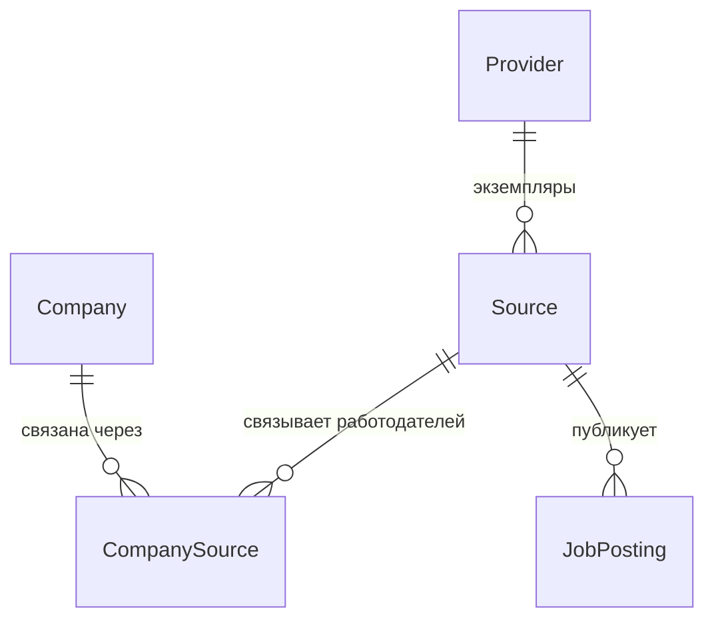

# Техническое описание проекта: файлы и конструкции

Живой документ. Объясняет **каждый файл и каждую неочевидную конструкцию** проекта
простыми словами — что это, зачем здесь и куда посмотреть в официальной
документации. Пополняется по мере роста проекта. Цель — чтобы владелец понимал
весь код и структуру (см. `working-contract.md`, раздел 0.1).

Пояснение сквозных слов, которые встречаются ниже:

- **Каркас** — базовая заготовка проекта: структура папок и минимальные
  приложения, которые собираются и запускаются, но ещё без бизнес-логики.
- **Зависимость** — сторонняя библиотека, которую использует наш код.
- **Бин** (bean) — объект-компонент, которым управляет Spring: создаёт его и
  подставляет туда, где он нужен.
- **Контекст приложения** — набор всех таких компонентов и их связей, который
  Spring создаёт при запуске.

---

## 1. Структура репозитория

```
roleorienta/
├── pom.xml                  # корневой файл сборки (объединяет модули + задаёт версии)
├── core/                    # общий модуль: классы предметной области (сущности БД)
├── job-api/                 # приложение REST API
├── job-worker/              # приложение фоновой обработки
├── docs/                    # документация (источник истины)
├── infra/source-stub/       # файлы заглушки источника (имитация внешнего сайта)
├── docker-compose.yml       # локальное окружение для запуска на своей машине
├── .github/workflows/ci.yml # автоматическая сборка при загрузке в GitHub
├── .gitignore
└── .env.example             # пример локальных переменных окружения
```

Это **монорепозиторий** — то есть несколько приложений живут в одном
Git-репозитории и собираются одним деревом сборки. `job-api` и `job-worker` —
отдельные приложения, но с общими версиями библиотек и общей базой данных.

---

## 2. Maven: проект из нескольких модулей

Maven — это система сборки: она скачивает нужные библиотеки, компилирует код,
запускает тесты и собирает готовые приложения. Каждый модуль описывается файлом
`pom.xml` (Project Object Model — «объектная модель проекта»).
Документация: https://maven.apache.org/pom.html · про несколько модулей:
https://maven.apache.org/guides/mini/guide-multiple-modules-4.html

### 2.1 Корневой `pom.xml` — две роли

**Объединяющий модуль**: секция `<modules>` перечисляет подмодули
(`core`, `job-api`, `job-worker`). Одна команда `mvn ...` в корне собирает их все
сразу.

**Родительский модуль**: подмодули в своём `pom.xml` указывают `<parent>` = наш
корневой модуль и наследуют от него общие настройки и версии библиотек.
`<packaging>pom</packaging>` означает, что сам корень ничего не компилирует — он
только объединяет модули и задаёт общие правила.

### 2.2 Наследование от `spring-boot-starter-parent`

Наш корневой `pom.xml` сам наследует от стандартного родителя Spring Boot —
`spring-boot-starter-parent:4.1.1`:

```xml
<parent>
    <groupId>org.springframework.boot</groupId>
    <artifactId>spring-boot-starter-parent</artifactId>
    <version>4.1.1</version>
</parent>
```

Он приносит **согласованный список версий** сотен библиотек (такой список
называют BOM — bill of materials, «спецификация версий»), а также разумные
настройки компилятора и вспомогательных инструментов. Именно поэтому у
большинства библиотек ниже **не указана версия** — её подставляет этот родитель,
и все библиотеки заведомо совместимы между собой.
Документация: https://docs.spring.io/spring-boot/reference/using/build-systems.html

### 2.3 Свойство `java.version`

```xml
<properties>
    <java.version>21</java.version>
</properties>
```

Родитель Spring Boot превращает это свойство в настройку компилятора
(`maven.compiler.release=21`) — то есть код компилируется под Java 21. Задаётся в
одном месте.

### 2.4 Зависимости-«стартеры»

`spring-boot-starter-web`, `-data-jpa`, `-amqp` и подобные — это **готовые
наборы**: одна зависимость подтягивает сразу связку библиотек под конкретную
задачу (например, `web` = встроенный веб-сервер Tomcat + Spring MVC +
обработка JSON). Не нужно перечислять десятки библиотек вручную.
Список стартеров: https://docs.spring.io/spring-boot/reference/using/build-systems.html#using.build-systems.starters

### 2.5 `dependencyManagement` + подключение чужого списка версий

```xml
<dependencyManagement>
    <dependencies>
        <dependency>
            <groupId>org.testcontainers</groupId>
            <artifactId>testcontainers-bom</artifactId>
            <version>${testcontainers.version}</version>
            <type>pom</type>
            <scope>import</scope>
        </dependency>
    </dependencies>
</dependencyManagement>
```

Секция `dependencyManagement` **не добавляет** библиотеки — она только заранее
задаёт их версии на случай, если библиотека понадобится. Строка
`<scope>import</scope>` вместе с `<type>pom</type>` подключает готовый список
версий из чужого файла (`testcontainers-bom`). Это понадобилось потому, что
Spring Boot 4.x **не задаёт** версии библиотеки Testcontainers (в версии 3.x
задавал) — и без этого блока сборка выдавала ошибку «version is missing» (версия
не указана).
Документация:
https://maven.apache.org/guides/introduction/introduction-to-dependency-mechanism.html#importing-dependencies

### 2.6 Плагин `spring-boot-maven-plugin` и сборка образа

Этот плагин в каждом приложении делает две вещи: `repackage` — собирает
запускаемый jar-файл, внутри которого лежат сразу все нужные библиотеки;
`build-image` — собирает Docker-образ **без написания Dockerfile** (с помощью
готового инструмента Cloud Native Buildpacks). Имя образа задано в корне:
`roleorienta/<имя-модуля>:<версия>`.
Документация: https://docs.spring.io/spring-boot/maven-plugin/build-image.html

---

## 3. Приложения Spring Boot

### 3.1 `@SpringBootApplication`

Эта аннотация стоит над главными классами `JobApiApplication` /
`JobWorkerApplication`. Она объединяет три аннотации в одной:

- `@Configuration` — класс может описывать компоненты (бины);
- `@EnableAutoConfiguration` — Spring Boot сам настраивает то, что нашёл среди
  подключённых библиотек (нашёл драйвер PostgreSQL и `spring-data-jpa` → настроил
  подключение к базе; нашёл веб-стартер → запустил веб-сервер);
- `@ComponentScan` — ищет наши компоненты в этом пакете и вложенных.

Документация: https://docs.spring.io/spring-boot/reference/using/using-the-springbootapplication-annotation.html

### 3.2 `SpringApplication.run(...)`

Точка входа приложения: создаёт контекст приложения (то есть все компоненты и их
связи), применяет автонастройку и запускает веб-сервер. Это обычный
`public static void main`.

### 3.3 `@EnableScheduling` (только в job-worker)

Включает встроенный планировщик Spring: методы, помеченные `@Scheduled`, будут
вызываться по расписанию. На первом этапе `job-worker` работает как периодический
планировщик — эта аннотация закладывает такую возможность (сами периодические
задачи добавим позже).
Документация: https://docs.spring.io/spring-framework/reference/integration/scheduling.html

---

## 4. Конфигурация `application.yml`

Внешние настройки каждого приложения. YAML — текстовый формат «ключ: значение» с
отступами.
Документация: https://docs.spring.io/spring-boot/reference/features/external-config.html

### 4.1 Подстановки вида `${ПЕРЕМЕННАЯ:значение-по-умолчанию}`

```yaml
url: ${DB_URL:jdbc:postgresql://localhost:5432/roleorienta}
```

Значение берётся из переменной окружения `DB_URL`; если её нет — используется
значение после двоеточия (удобно для запуска на своей машине). Так пароли и
адреса не «зашиты» в код и задаются снаружи (требование к облачной готовности,
раздел 3.4 технического документа).

### 4.2 JPA (работа с базой через объекты)

- `spring.jpa.hibernate.ddl-auto` — определяет, меняет ли Hibernate схему базы
  сам. `validate` (в `job-api`) = только проверить, что таблицы совпадают с
  классами; `none` (в `job-worker`) = вообще не трогать. Схему у нас ведёт
  **Flyway**, а не Hibernate.
- `open-in-view: false` — отключает режим, при котором соединение с базой
  держится открытым на всё время ответа пользователю. Этот режим приводит к
  скрытым запросам к базе, поэтому мы его явно выключаем.

Документация: https://docs.spring.io/spring-boot/reference/data/sql.html#data.sql.jpa-and-spring-data

### 4.3 Flyway

`spring.flyway.enabled: true` в `job-api` и `false` в `job-worker` — значит,
миграции (изменения схемы базы) применяет только `job-api` (он владелец схемы),
чтобы два приложения не применяли их одновременно. Подробнее про Flyway —
раздел 5.

### 4.4 Actuator: служебные проверки состояния

Библиотека `spring-boot-starter-actuator` добавляет служебные адреса, в том числе
`/actuator/health` (проверка состояния приложения).

```yaml
management:
  endpoint:
    health:
      probes:
        enabled: true
      group:
        readiness:
          include: readinessState,db
```

Различают две проверки:

- **liveness** («приложение живо?») — не должна зависеть от внешних систем; если
  она не проходит, система управления контейнерами (например, Kubernetes)
  перезапускает приложение. Поэтому базу данных в неё не включают.
- **readiness** («приложение готово принимать запросы?») — включает базу: если
  база недоступна, запросы на приложение временно не направляют, но и не
  перезапускают его.

Это общепринятый подход для Kubernetes; закладываем сразу.
Документация: https://docs.spring.io/spring-boot/reference/actuator/endpoints.html#actuator.endpoints.health.groups
и https://docs.spring.io/spring-boot/reference/deployment/cloud.html

### 4.5 RabbitMQ (в job-worker)

```yaml
rabbitmq:
  publisher-confirm-type: correlated
  publisher-returns: true
```

`publisher-confirm-type` включает подтверждения от брокера сообщений, что
сообщение принято; `publisher-returns` включает уведомление, если сообщение
некуда доставить. Оба нужны для надёжной отправки (см. раздел 7 про паттерн
outbox). Соединение с брокером «ленивое» — приложение запускается, даже если
брокер сейчас недоступен.
Документация: https://docs.spring.io/spring-boot/reference/messaging/amqp.html

---

## 5. База данных и миграции (Flyway)

Flyway — инструмент управления версиями схемы базы данных. Файлы миграций (по
одному на каждое изменение схемы) лежат в
`job-api/src/main/resources/db/migration/` и применяются по порядку при запуске
`job-api`. Flyway ведёт служебную таблицу `flyway_schema_history` и не применяет
одну и ту же миграцию дважды.
Документация: https://documentation.red-gate.com/flyway и
https://docs.spring.io/spring-boot/how-to/data-initialization.html#howto.data-initialization.migration-tool.flyway

### 5.1 Имена файлов миграций

Формат: `V` + номер версии + **два подчёркивания** + описание + `.sql`, например
`V1__baseline.sql`. Миграции применяются в порядке возрастания номера версии. Два
подчёркивания обязательны — это разделитель между номером и описанием.

### 5.2 `V1__baseline.sql`

Намеренно пустая (только комментарии): фиксирует «нулевую точку» истории
миграций. Таблицы предметной области добавляются отдельными миграциями.

### 5.3 `V2__outbox.sql` — конструкции SQL

```sql
CREATE TABLE outbox_event (
    id BIGINT GENERATED ALWAYS AS IDENTITY PRIMARY KEY,
    ...
    payload JSONB NOT NULL,
    published_at TIMESTAMPTZ,
    ...
);
CREATE INDEX idx_outbox_event_unpublished
    ON outbox_event (id) WHERE published_at IS NULL;
```

- `GENERATED ALWAYS AS IDENTITY` — современный способ автоматически выдавать
  числовой ключ (вместо устаревшего `serial`): значение `id` присваивает сама
  база. https://www.postgresql.org/docs/current/ddl-identity-columns.html
- `JSONB` — тип для хранения JSON в двоичном виде: удобно хранить тело события и
  искать по его полям. https://www.postgresql.org/docs/current/datatype-json.html
- `TIMESTAMPTZ` — момент времени с учётом часового пояса.
- **Частичный индекс** (`WHERE published_at IS NULL`) — ускоряющая структура,
  которая охватывает **только ещё не отправленные** строки. Отправитель ищет
  именно их, а такой индекс маленький и быстрый.
  https://www.postgresql.org/docs/current/indexes-partial.html

Назначение таблицы — паттерн «transactional outbox», см. раздел 7.

---

## 6. Тесты (JUnit 5 + Testcontainers)

### 6.1 `@SpringBootTest` + `contextLoads()`

`@SpringBootTest` запускает **настоящий** контекст приложения внутри теста.
Пустой тест `contextLoads()` проверяет самое важное: приложение вообще
запускается (все компоненты создались и связались, автонастройка и миграции
согласованы). Простой, но ценный тест «на дым» (быстрая проверка, что ничего не
сломано на самом базовом уровне).
Документация: https://docs.spring.io/spring-boot/reference/testing/spring-boot-applications.html

### 6.2 Testcontainers и `@ServiceConnection`

Тесту нужна настоящая база данных (и брокер), а не имитация. Библиотека
Testcontainers на время теста запускает их в Docker-контейнерах и останавливает
после.

```java
@TestConfiguration(proxyBeanMethods = false)
public class TestcontainersConfiguration {
    @Bean @ServiceConnection
    PostgreSQLContainer<?> postgresContainer() { return new PostgreSQLContainer<>("postgres:16-alpine"); }
}
```

- `@TestConfiguration` — настройка, действующая только в тестах.
- `PostgreSQLContainer` / `RabbitMQContainer` — управляемые из кода контейнеры.
- `@ServiceConnection` — Spring Boot сам берёт из контейнера адрес, логин и пароль
  и подставляет их приложению. Не нужно вручную прописывать адрес базы в тесте.
- Тест подключает эту настройку через `@Import(TestcontainersConfiguration.class)`.

Важно: для запуска таких тестов нужен **работающий Docker** (на своей машине —
Docker Desktop; при автоматической сборке в GitHub он уже есть).
Документация: https://docs.spring.io/spring-boot/reference/testing/testcontainers.html и
https://java.testcontainers.org/

---

## 7. RabbitMQ и паттерн transactional outbox

**RabbitMQ** — брокер сообщений: посредник с очередью, через который `job-worker`
надёжно получает фоновые задания. Надёжность означает доставку «хотя бы один раз»
(at-least-once), автоматические повторы при сбое и отдельную очередь для
сообщений, которые так и не удалось обработать (её называют dead-letter queue,
DLQ — «очередь мёртвых писем»).
Документация: https://www.rabbitmq.com/tutorials

**Transactional outbox** («исходящий ящик в транзакции») — приём надёжной
отправки сообщений. Проблема: нельзя одной неделимой операцией и записать в базу,
и отправить сообщение в брокер — это две разные системы, и любая из них может
сбойнуть в середине. Решение: событие сначала пишется в таблицу `outbox_event`
**в той же транзакции базы**, что и основные данные; затем отдельный отправитель
читает ещё не отправленные строки, шлёт их в брокер и помечает временем отправки
(`published_at`). Если отправка сорвётся — событие не потеряется, его отправят
снова.
Обзор паттерна: https://microservices.io/patterns/data/transactional-outbox.html

На первом этапе заложена только инфраструктура (брокер + таблица + настройки).
Сам отправитель и обработчики сообщений — ближайшая задача реализации.

---

## 8. `docker-compose.yml` — локальный запуск

Docker Compose запускает несколько контейнеров одной командой `docker compose up`.
Наш набор: PostgreSQL, RabbitMQ, MinIO (хранилище файлов, совместимое с
Amazon S3), WireMock (заглушка внешнего источника) и два наших приложения.
Документация: https://docs.docker.com/compose/

Ключевые части файла:

- `image:` — какой образ запускать (наши приложения — образы, собранные командой
  сборки образа из раздела 2.6).
- `environment:` — переменные окружения (те самые `${DB_URL}` и подобные).
- `${ПЕРЕМЕННАЯ:-значение}` — как в командной оболочке: берётся значение из файла
  `.env`, а если его нет — подставляется значение после `:-`. Файл `.env`
  создаётся из `.env.example` и в Git не сохраняется.
- `healthcheck:` — как Compose понимает, что сервис готов (например, команда
  `pg_isready` для PostgreSQL).
- `depends_on: { condition: service_healthy }` — `job-worker` запускается только
  после того, как база и брокер стали готовы.
- `volumes:` — постоянные тома, чтобы данные базы и брокера не пропадали между
  перезапусками.
- `ports: "5432:5432"` — сделать порт контейнера доступным на вашей машине
  (по адресу localhost).

---

## 9. Автоматическая сборка — `.github/workflows/ci.yml` (GitHub Actions)

Сборка запускается автоматически при каждой загрузке кода (`push`) и каждом
запросе на слияние (`pull request`).
Документация: https://docs.github.com/actions

- `on:` — когда запускать (загрузка в ветку `main`, любые запросы на слияние).
- `jobs.build.runs-on: ubuntu-latest` — на какой машине выполнять.
- `steps:` — шаги: `checkout` (получить код), `setup-java` (установить Java 21 и
  сохранить кэш загруженных библиотек Maven), `mvn -B -ntp verify` (собрать и
  прогнать тесты).
- `-B` — неинтерактивный режим, `-ntp` — не печатать подробности загрузок.

На серверах-исполнителях GitHub есть Docker, поэтому тесты с Testcontainers там
работают.

---

## 10. `.gitignore`

Список того, что Git не сохраняет: `target/` (результаты сборки), файлы среды
разработки (`.idea/`, `.settings/`, `bin/`), `.DS_Store` (служебный файл macOS),
`.env` (локальные пароли и настройки), `.obsidian/` (настройки Obsidian, если вы
открываете папку `docs/` как хранилище заметок Obsidian).

---

## 11. Модель данных — срез 1: источники и публикации

Этот срез задаёт **вход данных**: откуда мы собираем вакансии (провайдер,
источник, компания и их связи) и какие исходные публикации получили — с ключами,
которые однозначно опознают каждую запись и не дают появиться дублям.
Объединение публикаций в единую вакансию и разбор их содержимого — в следующих
срезах.

Пять сущностей (классов, которые отображаются на таблицы) в модуле `core`
(пакет `com.roleorienta.core.domain`): `Provider`, `Company`, `Source`,
`CompanySource`, `JobPosting`. Плюс перечисления `ProviderKind`, `SourceKind`,
`SourceState`, `VerifiedBy`. Схему задаёт миграция `V3__sources_and_postings.sql`.

Связи первого среза:



### 11.1 Модуль `core`

Отдельный модуль сборки с классами предметной области, от которого зависят
приложения (сейчас — `job-api`, позже — `job-worker`). Так одни и те же классы не
дублируются. Это **библиотека**, а не приложение: у неё нет плагина сборки
образа, только зависимости `spring-boot-starter-data-jpa` (аннотации для работы с
базой) и `jackson-databind` (нужна для сохранения поля-JSON). Почему отдельный
модуль, а не пакет внутри `job-api`: `job-worker` вскоре будет записывать эти же
сущности, и общий модуль избавляет от дублирования и от болезненного переноса
классов позже.

### 11.2 Подход «сначала схема базы» (DB-first)

Схему базы описывает **Flyway** (миграция `V3`), а классы-сущности ей
**соответствуют**. При запуске `job-api` с настройкой `ddl-auto: validate`
Hibernate только проверяет, что сущности совпадают со схемой, и **сам ничего не
меняет**. Единственный источник истины по схеме — миграции. Почему так: миграции
дают управляемое, версионируемое изменение схемы, а Hibernate в роли
«генератора схемы» непредсказуем и опасен для данных.

### 11.3 Конструкции работы с базой (и почему они выбраны)

- `@Entity` + `@Table(name, uniqueConstraints)` — класс соответствует таблице;
  ограничения уникальности заданы прямо в аннотации.
- `@Id` + `@GeneratedValue(IDENTITY)` — первичный ключ выдаёт база
  (`GENERATED ALWAYS AS IDENTITY`). Почему IDENTITY: простой автоинкремент
  средствами PostgreSQL, без отдельных таблиц-последовательностей.
- `@Column(name, nullable, updatable)` — соответствие поля колонке. Перевод имён
  из `camelCase` в `snake_case` Spring делает сам (`firstSeenAt` →
  `first_seen_at`).
- `@ManyToOne(fetch = LAZY, optional = false)` + `@JoinColumn(nullable=false)` —
  связь «многие к одному» через внешний ключ. Почему LAZY («ленивая»): связанные
  строки подгружаются только при обращении к ним, а не заранее. Почему связь
  только с одной стороны (без коллекций `@OneToMany`): так меньше риск лишних
  запросов и случайной загрузки больших списков; связь всегда указывается со
  стороны «многих».
- `@Enumerated(EnumType.STRING)` — перечисление хранится в базе текстом
  (например, `"ATS"`). Почему текстом, а не числом: читаемо в базе и не ломается,
  если поменять порядок значений в перечислении.
- **Поле-JSON**: `@JdbcTypeCode(SqlTypes.JSON)` + `@Column(columnDefinition="jsonb")`
  на поле `Map<String,Object> capabilities`. Почему JSON: карточка возможностей
  провайдера — гибкая структура, её преждевременно раскладывать на отдельные
  колонки.
- `@CreationTimestamp` / `@UpdateTimestamp` — автоматически заполняют поля
  `createdAt` / `updatedAt` (тип `Instant` → колонка `timestamptz`, момент
  времени в UTC).
- Методы чтения/записи (геттеры и сеттеры) написаны вручную, **без библиотеки
  Lombok** — намеренно: никакой автоматически подставляемой «невидимой» части,
  весь код виден явно.

### 11.4 `@EntityScan` в job-api

Зачем нужен: по умолчанию Spring ищет сущности в пакете приложения
(`com.roleorienta.api`), а наши — в `com.roleorienta.core.domain` (другой модуль).
Аннотация `@EntityScan("com.roleorienta.core.domain")` указывает, где их искать;
без неё проверка `validate` не увидит сущностей. Важно: в Spring Boot 4 эта
аннотация находится в пакете `org.springframework.boot.persistence.autoconfigure`
(в версии 3.x была в `org.springframework.boot.autoconfigure.domain` — при
переносе кода легко ошибиться).
Документация: https://docs.spring.io/spring-boot/reference/data/sql.html#data.sql.jpa-and-spring-data.entity-classes

### 11.5 Правила из раздела 4 технического документа, закреплённые в схеме

(Ниже — правила, которые всегда должны соблюдаться; в базе они закреплены
ограничениями.)

- **Публикация уникальна** в паре «источник + внешний идентификатор»:
  ограничение `uq_job_posting_source_external_id (source_id, external_id)`.
- **Провайдер, источник и компания — это разные вещи** (ADR-16): работодатель
  связан с источником только через `CompanySource` (связь «многие-ко-многим»,
  ограничение `uq_company_source_source_company`).
- Источник уникален в паре «провайдер + ссылка»: `uq_source_provider_external_ref`.
- Внешние ключи (`fk_*`) обеспечивают целостность связей; индексы (`idx_*`) на
  колонках-ссылках ускоряют выборки.

### 11.6 Что НЕ вошло (следующие срезы)

`Vacancy`, `VacancyRevision`, `CoverageAssessment` (с осями зарплаты и языковыми
полями), `Requirement`, `CrawlRun` / `CrawlTask` / `SourceSnapshot`,
`EmployerCandidate`, пользовательские сущности (`Application`, `SavedVacancy` и
другие), а также методы доступа к данным (репозитории Spring Data) и бизнес-логика
— отдельными срезами.

## 12. Как запустить локально

Инфраструктура (PostgreSQL, RabbitMQ и прочее) запускается в Docker, а приложения
— из среды разработки или терминала. PostgreSQL контейнера опубликован на порт
**5433**, чтобы не конфликтовать с локально установленной на 5432. Это частый
источник ошибки `role "roleorienta" does not exist`: приложение подключается к
5432, где отвечает **другая** база (например, установленная через Homebrew), в
которой нашего пользователя нет. Разведение по портам снимает конфликт.

Скрипты в папке `scripts/`:

- `dev-up.sh` — поднимает инфраструктуру и ждёт готовности базы;
- `run-api.sh` — устанавливает модуль `core` в локальный репозиторий и запускает `job-api`;
- `run-worker.sh` — то же для `job-worker`;
- `dev-down.sh` — останавливает инфраструктуру (данные в томах сохраняются).

Обычный цикл работы:

```bash
./scripts/dev-up.sh
./scripts/run-api.sh     # http://localhost:8080/actuator/health -> {"status":"UP"}
```

Почему `run-api.sh` сначала делает `mvn -pl core install`: `job-api` зависит от
модуля `core`, и при запуске только `job-api` (`-pl job-api`) Maven берёт `core`
из локального репозитория. Флаг `-am` для `spring-boot:run` не годится — он
пытается запустить и корневой модуль-агрегатор, у которого нет класса `main`.

## Куда смотреть дальше

- Справочник Spring Boot: https://docs.spring.io/spring-boot/index.html
- Справочник Spring Framework: https://docs.spring.io/spring-framework/reference/
- Каждый раздел выше содержит прямую ссылку на официальный источник — при
  малейшем «не понимаю» открывайте её.
