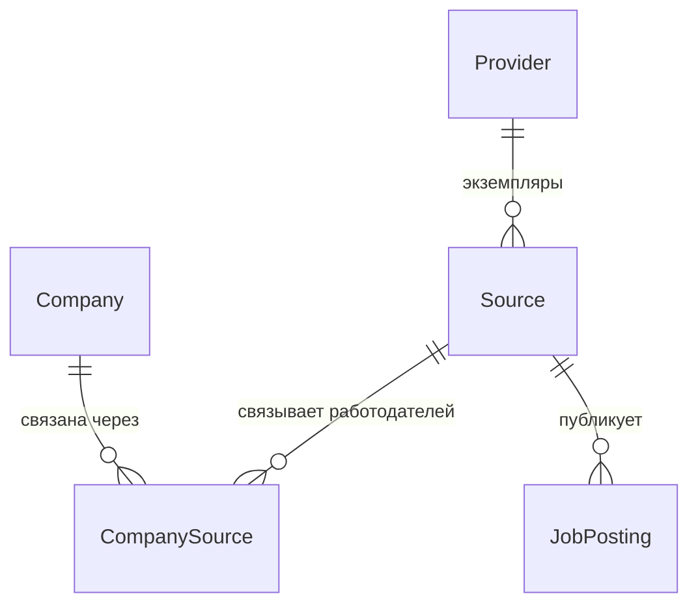

# Разбор каркаса: конструкции и файлы

Живой документ. Объясняет **каждый файл и каждую неочевидную конструкцию**
каркаса Этапа 1 — что это, зачем здесь, и куда посмотреть в официальной
документации. Пополняется по мере роста проекта. Цель — чтобы владелец понимал
весь код и структуру (см. `working-contract.md`, §0.1).

---

## 1. Структура репозитория

```
roleorienta/
├── pom.xml                  # корневой Maven-модуль (aggregator + управление версиями)
├── job-api/                 # приложение REST API
├── job-worker/              # приложение фоновой обработки
├── docs/                    # документация (источник истины)
├── infra/source-stub/       # файлы заглушки источника (WireMock)
├── docker-compose.yml       # локальное окружение (профиль local-pilot)
├── .github/workflows/ci.yml # непрерывная интеграция (GitHub Actions)
├── .gitignore
└── .env.example             # пример локальных переменных окружения
```

Это **монорепозиторий**: несколько приложений в одном Git-репозитории, собираемых
одним Maven-деревом. `job-api` и `job-worker` — отдельные приложения, но с общими
версиями зависимостей и общей БД.

---

## 2. Maven: многомодульный проект

Maven — система сборки. Проект описывается файлами `pom.xml` (Project Object Model).
Док: https://maven.apache.org/pom.html · многомодульность:
https://maven.apache.org/guides/mini/guide-multiple-modules-4.html

### 2.1 Корневой `pom.xml` — две роли

**Aggregator** (агрегатор): секция `<modules>` перечисляет подмодули
(`job-api`, `job-worker`). Одна команда `mvn ...` в корне собирает их все.

**Parent** (родитель): подмодули указывают `<parent>` = наш корневой модуль и
наследуют от него настройки и версии. `<packaging>pom</packaging>` означает, что
сам корень ничего не компилирует — он только агрегирует и задаёт общие правила.

### 2.2 Наследование от `spring-boot-starter-parent`

Наш корневой `pom.xml` сам наследует от `spring-boot-starter-parent:4.1.1`:

```xml
<parent>
    <groupId>org.springframework.boot</groupId>
    <artifactId>spring-boot-starter-parent</artifactId>
    <version>4.1.1</version>
</parent>
```

Он приносит **управление версиями** сотен библиотек (BOM), разумные настройки
компилятора и плагинов. Именно поэтому у большинства зависимостей ниже **нет
тега `<version>`** — версию подставляет этот родитель, и все библиотеки заведомо
совместимы между собой.
Док: https://docs.spring.io/spring-boot/reference/using/build-systems.html

### 2.3 Свойство `java.version`

```xml
<properties>
    <java.version>21</java.version>
</properties>
```

`spring-boot-starter-parent` превращает это свойство в настройку компилятора
(`maven.compiler.release=21`) — код компилируется под Java 21. Меняется в одном
месте.

### 2.4 «Starter»-зависимости

`spring-boot-starter-web`, `-data-jpa`, `-amqp` и т.п. — это **наборы-заготовки**:
одна зависимость подтягивает связку библиотек под задачу (web = встроенный
Tomcat + Spring MVC + JSON и т.д.). Не нужно перечислять десятки артефактов вручную.
Список стартеров: https://docs.spring.io/spring-boot/reference/using/build-systems.html#using.build-systems.starters

### 2.5 `dependencyManagement` + импорт BOM (Testcontainers)

```xml
<dependencyManagement>
    <dependencies>
        <dependency>
            <groupId>org.testcontainers</groupId>
            <artifactId>testcontainers-bom</artifactId>
            <version>${testcontainers.version}</version>
            <type>pom</type>
            <scope>import</scope>
        </dependency>
    </dependencies>
</dependencyManagement>
```

`dependencyManagement` **не добавляет** зависимости — он только задаёт их версии
на случай использования. `<scope>import</scope>` c `<type>pom</type>` — это
«импорт BOM»: втягиваем таблицу версий из чужого файла (`testcontainers-bom`).
Понадобилось потому, что Spring Boot 4.x **не управляет** версиями Testcontainers
(в 3.x управлял) — без этого блока Maven ругался «version is missing».
Док про import scope:
https://maven.apache.org/guides/introduction/introduction-to-dependency-mechanism.html#importing-dependencies

### 2.6 `spring-boot-maven-plugin` и `build-image`

Плагин в каждом приложении делает две вещи: `repackage` — собирает
исполняемый «fat jar»; `build-image` — собирает Docker-образ **без Dockerfile**
(через Cloud Native Buildpacks). Имя образа задано в корне:
`roleorienta/<artifactId>:<version>`.
Док: https://docs.spring.io/spring-boot/maven-plugin/build-image.html

---

## 3. Приложения Spring Boot

### 3.1 `@SpringBootApplication`

Стоит над `JobApiApplication` / `JobWorkerApplication`. Это «три аннотации в
одной»:
- `@Configuration` — класс может определять бины (компоненты);
- `@EnableAutoConfiguration` — Spring Boot сам настраивает то, что нашёл в
  classpath (нашёл драйвер PostgreSQL и `spring-data-jpa` → настроил подключение
  к БД; нашёл web-стартер → поднял веб-сервер);
- `@ComponentScan` — ищет ваши компоненты в этом пакете и вложенных.
Док: https://docs.spring.io/spring-boot/reference/using/using-the-springbootapplication-annotation.html

### 3.2 `SpringApplication.run(...)`

Точка входа: поднимает контекст приложения (создаёт и связывает все бины,
применяет автоконфигурацию, запускает веб-сервер). Обычный `public static void main`.

### 3.3 `@EnableScheduling` (только в job-worker)

Включает планировщик Spring: методы, помеченные `@Scheduled`, будут вызываться по
расписанию. На Этапе 1 воркер работает как периодический планировщик — эта
аннотация закладывает такую возможность (сами задачи добавим позже).
Док: https://docs.spring.io/spring-framework/reference/integration/scheduling.html

---

## 4. Конфигурация `application.yml`

Внешняя конфигурация каждого приложения. YAML — формат «ключ: значение» с
отступами.
Док: https://docs.spring.io/spring-boot/reference/features/external-config.html

### 4.1 Плейсхолдеры `${VAR:default}`

```yaml
url: ${DB_URL:jdbc:postgresql://localhost:5432/roleorienta}
```

Значение берётся из переменной окружения `DB_URL`; если её нет — используется
значение после двоеточия (для локального запуска). Так секреты и адреса не зашиты
в код и меняются снаружи (требование cloud-readiness, §3.4 техдока).

### 4.2 JPA

- `spring.jpa.hibernate.ddl-auto` — управляет тем, меняет ли Hibernate схему БД.
  `validate` (в api) = только проверить соответствие; `none` (в worker) = не
  трогать. Схему у нас ведёт **Flyway**, а не Hibernate.
- `open-in-view: false` — отключает «открытую сессию БД на время HTTP-ответа»
  (антипаттерн, ведёт к скрытым запросам). Явно выключаем.
Док: https://docs.spring.io/spring-boot/reference/data/sql.html#data.sql.jpa-and-spring-data

### 4.3 Flyway

`spring.flyway.enabled: true` в api и `false` в worker — миграции применяет
только `job-api` (владелец схемы), чтобы два приложения не гоняли их
одновременно. Подробнее про Flyway — §5.

### 4.4 Actuator: health, liveness, readiness

`spring-boot-starter-actuator` даёт служебные эндпоинты, включая
`/actuator/health`.

```yaml
management:
  endpoint:
    health:
      probes:
        enabled: true
      group:
        readiness:
          include: readinessState,db
```

- **liveness** («жив ли процесс») — не должен зависеть от внешних систем; если он
  «падает», оркестратор перезапускает контейнер. Поэтому в него не включают БД.
- **readiness** («готов ли принимать запросы») — включает БД: если БД недоступна,
  трафик на приложение не направляют, но не перезапускают.
Это стандарт для Kubernetes; закладываем сразу.
Док: https://docs.spring.io/spring-boot/reference/actuator/endpoints.html#actuator.endpoints.health.groups
и https://docs.spring.io/spring-boot/reference/deployment/cloud.html

### 4.5 RabbitMQ (job-worker)

```yaml
rabbitmq:
  publisher-confirm-type: correlated
  publisher-returns: true
```

`publisher confirms` — брокер подтверждает, что сообщение принято; `returns` —
уведомление, если сообщение некуда доставить. Нужны для надёжной публикации
(паттерн outbox, §7). Соединение «ленивое»: приложение стартует даже без брокера.
Док: https://docs.spring.io/spring-boot/reference/messaging/amqp.html

---

## 5. База данных и миграции (Flyway)

Flyway — инструмент версионирования схемы БД. Файлы миграций лежат в
`job-api/src/main/resources/db/migration/` и применяются по порядку при старте
`job-api`. Flyway ведёт служебную таблицу `flyway_schema_history` и не применяет
одну миграцию дважды.
Док: https://documentation.red-gate.com/flyway и
https://docs.spring.io/spring-boot/how-to/data-initialization.html#howto.data-initialization.migration-tool.flyway

### 5.1 Имена файлов `V1__baseline.sql`

Формат: `V` + версия + **два подчёркивания** + описание + `.sql`. `V1__baseline`,
`V2__outbox` применяются в порядке версий. Два подчёркивания — обязательны.

### 5.2 `V1__baseline.sql`

Намеренно пустая (только комментарии): фиксирует «нулевую точку» истории
миграций. Доменные таблицы добавим отдельными миграциями.

### 5.3 `V2__outbox.sql` — конструкции SQL

```sql
CREATE TABLE outbox_event (
    id BIGINT GENERATED ALWAYS AS IDENTITY PRIMARY KEY,
    ...
    payload JSONB NOT NULL,
    published_at TIMESTAMPTZ,
    ...
);
CREATE INDEX idx_outbox_event_unpublished
    ON outbox_event (id) WHERE published_at IS NULL;
```

- `GENERATED ALWAYS AS IDENTITY` — современный стандартный автоинкремент
  (вместо устаревшего `serial`). БД сама выдаёт `id`.
  https://www.postgresql.org/docs/current/ddl-identity-columns.html
- `JSONB` — бинарный JSON: хранит тело события и позволяет индексировать/искать по
  полям. https://www.postgresql.org/docs/current/datatype-json.html
- `TIMESTAMPTZ` — момент времени с учётом часового пояса.
- **Частичный индекс** `WHERE published_at IS NULL` — индексирует **только
  неопубликованные** строки. Публикатор ищет именно их, а индекс маленький и
  быстрый. https://www.postgresql.org/docs/current/indexes-partial.html

Назначение таблицы — паттерн «transactional outbox», см. §7.

---

## 6. Тесты (JUnit 5 + Testcontainers)

### 6.1 `@SpringBootTest` + `contextLoads()`

`@SpringBootTest` поднимает **настоящий** контекст приложения в тесте. Пустой тест
`contextLoads()` проверяет главное: приложение вообще стартует (все бины
связались, автоконфигурация и миграции согласованы). Простой, но ценный дымовой
тест.
Док: https://docs.spring.io/spring-boot/reference/testing/spring-boot-applications.html

### 6.2 Testcontainers и `@ServiceConnection`

Тесту нужна реальная БД (и брокер), а не подделка. Testcontainers на время теста
поднимает их в Docker-контейнерах и гасит после.

```java
@TestConfiguration(proxyBeanMethods = false)
public class TestcontainersConfiguration {
    @Bean @ServiceConnection
    PostgreSQLContainer<?> postgresContainer() { return new PostgreSQLContainer<>("postgres:16-alpine"); }
}
```

- `@TestConfiguration` — конфигурация, действующая только в тестах.
- `PostgreSQLContainer` / `RabbitMQContainer` — управляемые контейнеры.
- `@ServiceConnection` — Spring Boot сам берёт из контейнера адрес/логин/пароль и
  подставляет в приложение. Не нужно вручную прописывать URL БД в тесте.
- Тест подключает конфигурацию через `@Import(TestcontainersConfiguration.class)`.

Важно: для запуска этих тестов нужен **работающий Docker** (локально — Docker
Desktop; в CI — есть на раннерах).
Док: https://docs.spring.io/spring-boot/reference/testing/testcontainers.html и
https://java.testcontainers.org/

---

## 7. RabbitMQ и паттерн transactional outbox

**RabbitMQ** — брокер сообщений: очередь, через которую воркер получает фоновые
задания надёжно (at-least-once, повторы, «мёртвая» очередь DLQ).
Док: https://www.rabbitmq.com/tutorials

**Transactional outbox** — паттерн надёжной публикации. Проблема: нельзя
атомарно и записать в БД, и отправить в брокер (это две разные системы). Решение:
события пишутся в таблицу `outbox_event` **в той же транзакции**, что и данные;
отдельный публикатор читает неопубликованные строки и шлёт их в брокер, затем
помечает `published_at`. Если публикация упадёт — событие не потеряется, повторим.
Обзор: https://microservices.io/patterns/data/transactional-outbox.html

На Этапе 1 заложена инфраструктура (брокер + таблица + конфиг). Сам публикатор и
обработчики — ближайшая задача реализации.

---

## 8. `docker-compose.yml` (профиль local-pilot)

Docker Compose поднимает несколько контейнеров одной командой `docker compose up`.
Наш профиль: PostgreSQL, RabbitMQ, MinIO (S3-совместимое хранилище), WireMock
(заглушка источника) и два наших приложения.
Док: https://docs.docker.com/compose/

Ключевые конструкции:
- `image:` — какой образ запустить (наши приложения — образы из `build-image`).
- `environment:` — переменные окружения (те самые `${DB_URL}` и т.д.).
- `${VAR:-default}` — как в shell: значение из `.env` или дефолт. Файл `.env`
  создаётся из `.env.example` и в Git не коммитится.
- `healthcheck:` — как Compose понимает, что сервис «здоров» (например,
  `pg_isready` для Postgres).
- `depends_on: { condition: service_healthy }` — наш воркер стартует только после
  того, как БД и брокер стали здоровыми.
- `volumes:` — постоянные тома, чтобы данные БД/брокера не пропадали между
  перезапусками.
- `ports: "5432:5432"` — проброс порта контейнера на ваш localhost.

---

## 9. CI — `.github/workflows/ci.yml` (GitHub Actions)

Автоматическая сборка при каждом `push`/`pull request`.
Док: https://docs.github.com/actions

- `on:` — когда запускать (push в main, любые PR).
- `jobs.build.runs-on: ubuntu-latest` — на какой машине.
- `steps:` — шаги: `checkout` (забрать код), `setup-java` (поставить JDK 21 +
  кэш Maven), `mvn -B -ntp verify` (собрать и прогнать тесты).
- `-B` — batch (без интерактива), `-ntp` — не печатать прогресс загрузок.
На раннерах GitHub есть Docker, поэтому Testcontainers-тесты там работают.

---

## 10. `.gitignore`

Список того, что Git игнорирует: `target/` (результаты сборки), файлы IDE
(`.idea/`, `.settings/`, `bin/`), `.DS_Store` (macOS), `.env` (локальные секреты),
`.obsidian/` (конфиг Obsidian, если открываете `docs/` как волт).

---

## 11. Модель данных — первый срез («идентичность приёма»)

Пять сущностей в модуле `core` (пакет `com.roleorienta.core.domain`): `Provider`,
`Company`, `Source`, `CompanySource`, `JobPosting`. Плюс перечисления
`ProviderKind`, `SourceKind`, `SourceState`, `VerifiedBy`. Схему задаёт миграция
`V3__ingestion_identity.sql`.

Связи первого среза:



### 11.1 Модуль `core`

Отдельный Maven-модуль с доменными классами, от которого зависят приложения
(сейчас — `job-api`, позже — `job-worker`). Так сущности не дублируются. Это
**библиотека**: у неё нет `spring-boot-maven-plugin` (не исполняемое приложение),
только `spring-boot-starter-data-jpa` (аннотации JPA/Hibernate) и `jackson-databind`
(для JSONB). Почему модуль, а не пакет в job-api: воркер вскоре будет писать эти же
сущности, и общий модуль исключает дублирование и болезненный перенос пакетов позже.

### 11.2 Подход DB-first

Схему БД описывает **Flyway** (`V3`), а JPA-сущности ей **соответствуют**. При
старте `job-api` с `ddl-auto: validate` Hibernate проверяет совпадение сущностей
со схемой и **ничего не меняет** сам. Источник истины по схеме — миграции.
Почему так: миграции дают контролируемую, версионируемую эволюцию схемы; Hibernate
в роли «генератора схемы» непредсказуем и опасен для данных.

### 11.3 Конструкции JPA (и почему они выбраны)

- `@Entity` + `@Table(name, uniqueConstraints)` — класс ↔ таблица; уникальные
  ограничения объявлены декларативно.
- `@Id` + `@GeneratedValue(IDENTITY)` — ключ выдаёт БД (`GENERATED ALWAYS AS
  IDENTITY`). Почему IDENTITY: простой автоинкремент средствами Postgres, без
  доп. таблиц-последовательностей в приложении.
- `@Column(name, nullable, updatable)` — отображение колонок. Именование
  camelCase→snake_case Spring делает сам (`firstSeenAt` → `first_seen_at`).
- `@ManyToOne(fetch = LAZY, optional = false)` + `@JoinColumn(nullable=false)`.
  Почему LAZY: не тянуть связанные строки, пока к ним не обратились. Почему
  однонаправленно (без коллекций `@OneToMany`): меньше риск N+1 и случайной
  загрузки больших коллекций; связь всегда со стороны «многих».
- `@Enumerated(EnumType.STRING)` — enum хранится строкой. Почему STRING, а не
  ORDINAL: читаемо в БД и не ломается при перестановке значений enum.
- **JSONB**: `@JdbcTypeCode(SqlTypes.JSON)` + `@Column(columnDefinition="jsonb")`
  на `Map<String,Object> capabilities`. Почему JSONB: capability-карточка —
  гибкая структура, её преждевременно раскладывать на колонки.
- `@CreationTimestamp` / `@UpdateTimestamp` — авто-заполнение `createdAt`/`updatedAt`
  (`Instant` → `timestamptz`, момент в UTC).
- Геттеры/сеттеры вручную, **без Lombok** — намеренно: никакой «магии», всё явно.

### 11.4 `@EntityScan` в job-api

Почему нужен: по умолчанию JPA ищет сущности в пакете приложения
(`com.roleorienta.api`), а наши — в `com.roleorienta.core.domain` (другой модуль).
`@EntityScan("com.roleorienta.core.domain")` указывает, где искать; иначе
`validate` не увидит сущностей. Важно: в Spring Boot 4 эта аннотация в пакете
`org.springframework.boot.persistence.autoconfigure` (в 3.x была в
`org.springframework.boot.autoconfigure.domain` — при переносе кода легко ошибиться).
Док: https://docs.spring.io/spring-boot/reference/data/sql.html#data.sql.jpa-and-spring-data.entity-classes

### 11.5 Инварианты §4, зафиксированные в схеме

- **Публикация уникальна** в паре источник+внешний ID:
  `uq_job_posting_source_external_id (source_id, external_id)`.
- **Provider ≠ Source ≠ Company** (ADR-16): работодатель связан с источником
  только через `CompanySource` (многие-ко-многим, `uq_company_source_source_company`).
- Источник уникален в паре провайдер+ссылка: `uq_source_provider_external_ref`.
- Внешние ключи (`fk_*`) и индексы на FK-колонках (`idx_*`).

### 11.6 Что НЕ вошло (следующие срезы)

`Vacancy`, `VacancyRevision`, `CoverageAssessment` (оси зарплаты и языковые поля),
`Requirement`, `CrawlRun`/`CrawlTask`/`SourceSnapshot`, `EmployerCandidate`,
пользовательские сущности (`Application`, `SavedVacancy`, …), а также репозитории
Spring Data и бизнес-логика — отдельными срезами.

## Куда смотреть дальше

- Spring Boot Reference: https://docs.spring.io/spring-boot/index.html
- Spring Framework Reference: https://docs.spring.io/spring-framework/reference/
- Каждый раздел выше содержит прямую ссылку на официальный источник — при
  малейшем «не понимаю» открывайте её.
