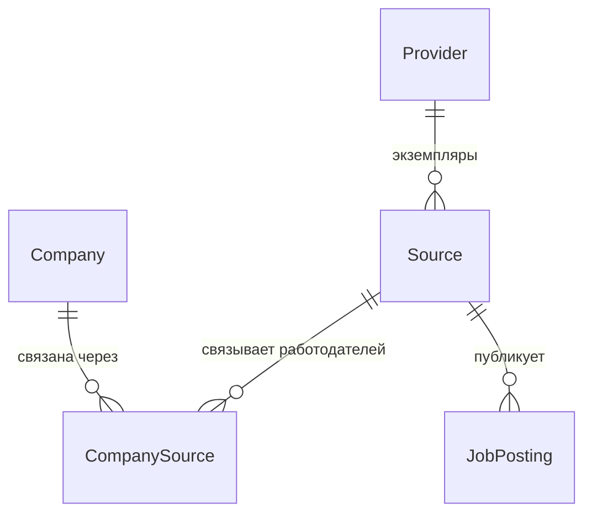
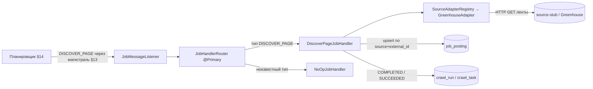
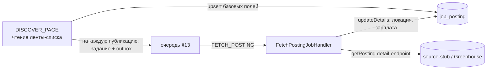
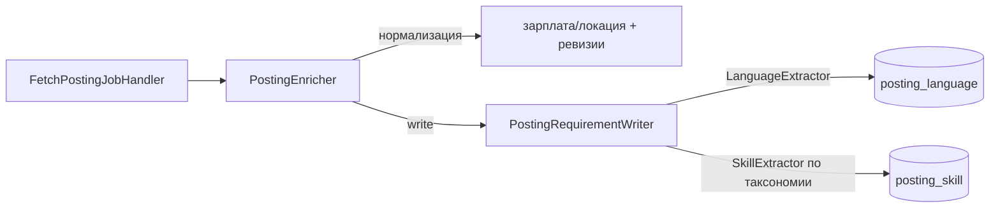
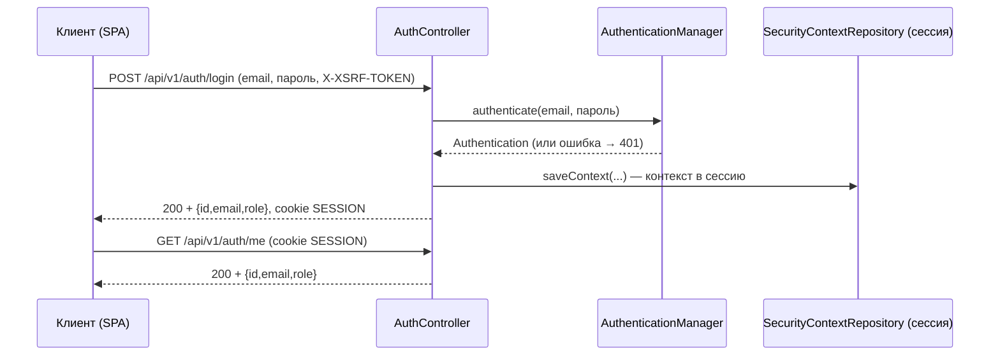
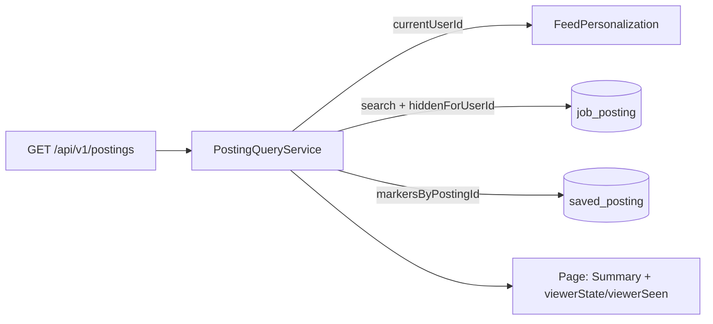
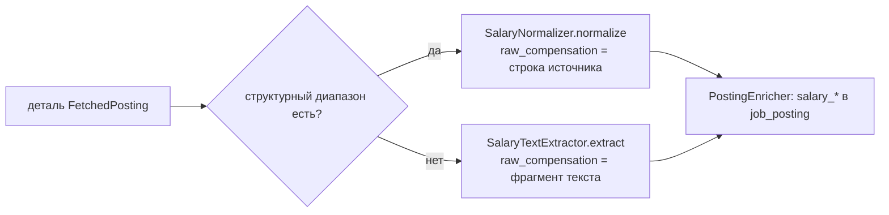

# Техническое описание проекта: файлы и конструкции

Живой документ. Объясняет **каждый файл и каждую неочевидную конструкцию** проекта
простыми словами — что это, зачем здесь и куда посмотреть в официальной
документации. Пополняется по мере роста проекта. Цель — чтобы владелец понимал
весь код и структуру (см. `working-contract.md`, раздел 0.1).

Пояснение сквозных слов, которые встречаются ниже:

- **Каркас** — базовая заготовка проекта: структура папок и минимальные
  приложения, которые собираются и запускаются, но ещё без бизнес-логики.
- **Зависимость** — сторонняя библиотека, которую использует наш код.
- **Бин** (bean) — объект-компонент, которым управляет Spring: создаёт его и
  подставляет туда, где он нужен.
- **Контекст приложения** — набор всех таких компонентов и их связей, который
  Spring создаёт при запуске.

---

## 1. Структура репозитория

```
roleorienta/
├── pom.xml                  # корневой файл сборки (объединяет модули + задаёт версии)
├── core/                    # общий модуль: классы предметной области (сущности БД)
├── job-api/                 # приложение REST API
├── job-worker/              # приложение фоновой обработки
├── docs/                    # документация (источник истины)
├── infra/source-stub/       # файлы заглушки источника (имитация внешнего сайта)
├── docker-compose.yml       # локальное окружение для запуска на своей машине
├── .github/workflows/ci.yml # автоматическая сборка при загрузке в GitHub
├── .gitignore
└── .env.example             # пример локальных переменных окружения
```

Это **монорепозиторий** — то есть несколько приложений живут в одном
Git-репозитории и собираются одним деревом сборки. `job-api` и `job-worker` —
отдельные приложения, но с общими версиями библиотек и общей базой данных.

---

## 2. Maven: проект из нескольких модулей

Maven — это система сборки: она скачивает нужные библиотеки, компилирует код,
запускает тесты и собирает готовые приложения. Каждый модуль описывается файлом
`pom.xml` (Project Object Model — «объектная модель проекта»).
Документация: https://maven.apache.org/pom.html · про несколько модулей:
https://maven.apache.org/guides/mini/guide-multiple-modules-4.html

### 2.1 Корневой `pom.xml` — две роли

**Объединяющий модуль**: секция `<modules>` перечисляет подмодули
(`core`, `job-api`, `job-worker`). Одна команда `mvn ...` в корне собирает их все
сразу.

**Родительский модуль**: подмодули в своём `pom.xml` указывают `<parent>` = наш
корневой модуль и наследуют от него общие настройки и версии библиотек.
`<packaging>pom</packaging>` означает, что сам корень ничего не компилирует — он
только объединяет модули и задаёт общие правила.

### 2.2 Наследование от `spring-boot-starter-parent`

Наш корневой `pom.xml` сам наследует от стандартного родителя Spring Boot —
`spring-boot-starter-parent:4.1.1`:

```xml
<parent>
    <groupId>org.springframework.boot</groupId>
    <artifactId>spring-boot-starter-parent</artifactId>
    <version>4.1.1</version>
</parent>
```

Он приносит **согласованный список версий** сотен библиотек (такой список
называют BOM — bill of materials, «спецификация версий»), а также разумные
настройки компилятора и вспомогательных инструментов. Именно поэтому у
большинства библиотек ниже **не указана версия** — её подставляет этот родитель,
и все библиотеки заведомо совместимы между собой.
Документация: https://docs.spring.io/spring-boot/reference/using/build-systems.html

### 2.3 Свойство `java.version`

```xml
<properties>
    <java.version>21</java.version>
</properties>
```

Родитель Spring Boot превращает это свойство в настройку компилятора
(`maven.compiler.release=21`) — то есть код компилируется под Java 21. Задаётся в
одном месте.

### 2.4 Зависимости-«стартеры»

`spring-boot-starter-web`, `-data-jpa`, `-amqp` и подобные — это **готовые
наборы**: одна зависимость подтягивает сразу связку библиотек под конкретную
задачу (например, `web` = встроенный веб-сервер Tomcat + Spring MVC +
обработка JSON). Не нужно перечислять десятки библиотек вручную.
Список стартеров: https://docs.spring.io/spring-boot/reference/using/build-systems.html#using.build-systems.starters

### 2.5 `dependencyManagement` + подключение чужого списка версий

```xml
<dependencyManagement>
    <dependencies>
        <dependency>
            <groupId>org.testcontainers</groupId>
            <artifactId>testcontainers-bom</artifactId>
            <version>${testcontainers.version}</version>
            <type>pom</type>
            <scope>import</scope>
        </dependency>
    </dependencies>
</dependencyManagement>
```

Секция `dependencyManagement` **не добавляет** библиотеки — она только заранее
задаёт их версии на случай, если библиотека понадобится. Строка
`<scope>import</scope>` вместе с `<type>pom</type>` подключает готовый список
версий из чужого файла (`testcontainers-bom`). Это понадобилось потому, что
Spring Boot 4.x **не задаёт** версии библиотеки Testcontainers (в версии 3.x
задавал) — и без этого блока сборка выдавала ошибку «version is missing» (версия
не указана).
Документация:
https://maven.apache.org/guides/introduction/introduction-to-dependency-mechanism.html#importing-dependencies

### 2.6 Плагин `spring-boot-maven-plugin` и сборка образа

Этот плагин в каждом приложении делает две вещи: `repackage` — собирает
запускаемый jar-файл, внутри которого лежат сразу все нужные библиотеки;
`build-image` — собирает Docker-образ **без написания Dockerfile** (с помощью
готового инструмента Cloud Native Buildpacks). Имя образа задано в корне:
`roleorienta/<имя-модуля>:<версия>`.
Документация: https://docs.spring.io/spring-boot/maven-plugin/build-image.html

---

## 3. Приложения Spring Boot

### 3.1 `@SpringBootApplication`

Эта аннотация стоит над главными классами `JobApiApplication` /
`JobWorkerApplication`. Она объединяет три аннотации в одной:

- `@Configuration` — класс может описывать компоненты (бины);
- `@EnableAutoConfiguration` — Spring Boot сам настраивает то, что нашёл среди
  подключённых библиотек (нашёл драйвер PostgreSQL и `spring-data-jpa` → настроил
  подключение к базе; нашёл веб-стартер → запустил веб-сервер);
- `@ComponentScan` — ищет наши компоненты в этом пакете и вложенных.

Документация: https://docs.spring.io/spring-boot/reference/using/using-the-springbootapplication-annotation.html

### 3.2 `SpringApplication.run(...)`

Точка входа приложения: создаёт контекст приложения (то есть все компоненты и их
связи), применяет автонастройку и запускает веб-сервер. Это обычный
`public static void main`.

### 3.3 `@EnableScheduling` (только в job-worker)

Включает встроенный планировщик Spring: методы, помеченные `@Scheduled`, будут
вызываться по расписанию. На первом этапе `job-worker` работает как периодический
планировщик — эта аннотация закладывает такую возможность (сами периодические
задачи добавим позже).
Документация: https://docs.spring.io/spring-framework/reference/integration/scheduling.html

---

## 4. Конфигурация `application.yml`

Внешние настройки каждого приложения. YAML — текстовый формат «ключ: значение» с
отступами.
Документация: https://docs.spring.io/spring-boot/reference/features/external-config.html

### 4.1 Подстановки вида `${ПЕРЕМЕННАЯ:значение-по-умолчанию}`

```yaml
url: ${DB_URL:jdbc:postgresql://localhost:5432/roleorienta}
```

Значение берётся из переменной окружения `DB_URL`; если её нет — используется
значение после двоеточия (удобно для запуска на своей машине). Так пароли и
адреса не «зашиты» в код и задаются снаружи (требование к облачной готовности,
раздел 3.4 технического документа).

### 4.2 JPA (работа с базой через объекты)

- `spring.jpa.hibernate.ddl-auto` — определяет, меняет ли Hibernate схему базы
  сам. `validate` (в `job-api`) = только проверить, что таблицы совпадают с
  классами; `none` (в `job-worker`) = вообще не трогать. Схему у нас ведёт
  **Flyway**, а не Hibernate.
- `open-in-view: false` — отключает режим, при котором соединение с базой
  держится открытым на всё время ответа пользователю. Этот режим приводит к
  скрытым запросам к базе, поэтому мы его явно выключаем.

Документация: https://docs.spring.io/spring-boot/reference/data/sql.html#data.sql.jpa-and-spring-data

### 4.3 Flyway

`spring.flyway.enabled: true` в `job-api` и `false` в `job-worker` — значит,
миграции (изменения схемы базы) применяет только `job-api` (он владелец схемы),
чтобы два приложения не применяли их одновременно. Подробнее про Flyway —
раздел 5.

### 4.4 Actuator: служебные проверки состояния

Библиотека `spring-boot-starter-actuator` добавляет служебные адреса, в том числе
`/actuator/health` (проверка состояния приложения).

```yaml
management:
  endpoint:
    health:
      probes:
        enabled: true
      group:
        readiness:
          include: readinessState,db
```

Различают две проверки:

- **liveness** («приложение живо?») — не должна зависеть от внешних систем; если
  она не проходит, система управления контейнерами (например, Kubernetes)
  перезапускает приложение. Поэтому базу данных в неё не включают.
- **readiness** («приложение готово принимать запросы?») — включает базу: если
  база недоступна, запросы на приложение временно не направляют, но и не
  перезапускают его.

Это общепринятый подход для Kubernetes; закладываем сразу.
Документация: https://docs.spring.io/spring-boot/reference/actuator/endpoints.html#actuator.endpoints.health.groups
и https://docs.spring.io/spring-boot/reference/deployment/cloud.html

### 4.5 RabbitMQ (в job-worker)

```yaml
rabbitmq:
  publisher-confirm-type: correlated
  publisher-returns: true
```

`publisher-confirm-type` включает подтверждения от брокера сообщений, что
сообщение принято; `publisher-returns` включает уведомление, если сообщение
некуда доставить. Оба нужны для надёжной отправки (см. раздел 7 про паттерн
outbox). Соединение с брокером «ленивое» — приложение запускается, даже если
брокер сейчас недоступен.
Документация: https://docs.spring.io/spring-boot/reference/messaging/amqp.html

---

## 5. База данных и миграции (Flyway)

Flyway — инструмент управления версиями схемы базы данных. Файлы миграций (по
одному на каждое изменение схемы) лежат в
`job-api/src/main/resources/db/migration/` и применяются по порядку при запуске
`job-api`. Flyway ведёт служебную таблицу `flyway_schema_history` и не применяет
одну и ту же миграцию дважды.
Документация: https://documentation.red-gate.com/flyway и
https://docs.spring.io/spring-boot/how-to/data-initialization.html#howto.data-initialization.migration-tool.flyway

### 5.1 Имена файлов миграций

Формат: `V` + номер версии + **два подчёркивания** + описание + `.sql`, например
`V1__baseline.sql`. Миграции применяются в порядке возрастания номера версии. Два
подчёркивания обязательны — это разделитель между номером и описанием.

### 5.2 `V1__baseline.sql`

Намеренно пустая (только комментарии): фиксирует «нулевую точку» истории
миграций. Таблицы предметной области добавляются отдельными миграциями.

### 5.3 `V2__outbox.sql` — конструкции SQL

```sql
CREATE TABLE outbox_event (
    id BIGINT GENERATED ALWAYS AS IDENTITY PRIMARY KEY,
    ...
    payload JSONB NOT NULL,
    published_at TIMESTAMPTZ,
    ...
);
CREATE INDEX idx_outbox_event_unpublished
    ON outbox_event (id) WHERE published_at IS NULL;
```

- `GENERATED ALWAYS AS IDENTITY` — современный способ автоматически выдавать
  числовой ключ (вместо устаревшего `serial`): значение `id` присваивает сама
  база. https://www.postgresql.org/docs/current/ddl-identity-columns.html
- `JSONB` — тип для хранения JSON в двоичном виде: удобно хранить тело события и
  искать по его полям. https://www.postgresql.org/docs/current/datatype-json.html
- `TIMESTAMPTZ` — момент времени с учётом часового пояса.
- **Частичный индекс** (`WHERE published_at IS NULL`) — ускоряющая структура,
  которая охватывает **только ещё не отправленные** строки. Отправитель ищет
  именно их, а такой индекс маленький и быстрый.
  https://www.postgresql.org/docs/current/indexes-partial.html

Назначение таблицы — паттерн «transactional outbox», см. раздел 7.

---

## 6. Тесты (JUnit 5 + Testcontainers)

### 6.1 `@SpringBootTest` + `contextLoads()`

`@SpringBootTest` запускает **настоящий** контекст приложения внутри теста.
Пустой тест `contextLoads()` проверяет самое важное: приложение вообще
запускается (все компоненты создались и связались, автонастройка и миграции
согласованы). Простой, но ценный тест «на дым» (быстрая проверка, что ничего не
сломано на самом базовом уровне).
Документация: https://docs.spring.io/spring-boot/reference/testing/spring-boot-applications.html

### 6.2 Testcontainers и `@ServiceConnection`

Тесту нужна настоящая база данных (и брокер), а не имитация. Библиотека
Testcontainers на время теста запускает их в Docker-контейнерах и останавливает
после.

```java
@TestConfiguration(proxyBeanMethods = false)
public class TestcontainersConfiguration {
    @Bean @ServiceConnection
    PostgreSQLContainer<?> postgresContainer() { return new PostgreSQLContainer<>("postgres:16-alpine"); }
}
```

- `@TestConfiguration` — настройка, действующая только в тестах.
- `PostgreSQLContainer` / `RabbitMQContainer` — управляемые из кода контейнеры.
- `@ServiceConnection` — Spring Boot сам берёт из контейнера адрес, логин и пароль
  и подставляет их приложению. Не нужно вручную прописывать адрес базы в тесте.
- Тест подключает эту настройку через `@Import(TestcontainersConfiguration.class)`.

Важно: для запуска таких тестов нужен **работающий Docker** (на своей машине —
Docker Desktop; при автоматической сборке в GitHub он уже есть).
Документация: https://docs.spring.io/spring-boot/reference/testing/testcontainers.html и
https://java.testcontainers.org/

---

## 7. RabbitMQ и паттерн transactional outbox

**RabbitMQ** — брокер сообщений: посредник с очередью, через который `job-worker`
надёжно получает фоновые задания. Надёжность означает доставку «хотя бы один раз»
(at-least-once), автоматические повторы при сбое и отдельную очередь для
сообщений, которые так и не удалось обработать (её называют dead-letter queue,
DLQ — «очередь мёртвых писем»).
Документация: https://www.rabbitmq.com/tutorials

**Transactional outbox** («исходящий ящик в транзакции») — приём надёжной
отправки сообщений. Проблема: нельзя одной неделимой операцией и записать в базу,
и отправить сообщение в брокер — это две разные системы, и любая из них может
сбойнуть в середине. Решение: событие сначала пишется в таблицу `outbox_event`
**в той же транзакции базы**, что и основные данные; затем отдельный отправитель
читает ещё не отправленные строки, шлёт их в брокер и помечает временем отправки
(`published_at`). Если отправка сорвётся — событие не потеряется, его отправят
снова.
Обзор паттерна: https://microservices.io/patterns/data/transactional-outbox.html

Инфраструктура (брокер, таблица outbox, настройки) и сам конвейер доставки —
публикатор, топология RabbitMQ и идемпотентный потребитель — реализованы;
подробный разбор конструкций в §13. Планировщик доменных заданий (создание
`CrawlRun`/задания в одной транзакции с outbox-событием) — следующий инкремент.

---

## 8. `docker-compose.yml` — локальный запуск

Docker Compose запускает несколько контейнеров одной командой `docker compose up`.
Наш набор: PostgreSQL, RabbitMQ, MinIO (хранилище файлов, совместимое с
Amazon S3), WireMock (заглушка внешнего источника) и два наших приложения.
Документация: https://docs.docker.com/compose/

Ключевые части файла:

- `image:` — какой образ запускать (наши приложения — образы, собранные командой
  сборки образа из раздела 2.6).
- `environment:` — переменные окружения (те самые `${DB_URL}` и подобные).
- `${ПЕРЕМЕННАЯ:-значение}` — как в командной оболочке: берётся значение из файла
  `.env`, а если его нет — подставляется значение после `:-`. Файл `.env`
  создаётся из `.env.example` и в Git не сохраняется.
- `healthcheck:` — как Compose понимает, что сервис готов (например, команда
  `pg_isready` для PostgreSQL).
- `depends_on: { condition: service_healthy }` — `job-worker` запускается только
  после того, как база и брокер стали готовы.
- `volumes:` — постоянные тома, чтобы данные базы и брокера не пропадали между
  перезапусками.
- `ports: "5432:5432"` — сделать порт контейнера доступным на вашей машине
  (по адресу localhost).

---

## 9. Автоматическая сборка — `.github/workflows/ci.yml` (GitHub Actions)

Сборка запускается автоматически при каждой загрузке кода (`push`) и каждом
запросе на слияние (`pull request`).
Документация: https://docs.github.com/actions

- `on:` — когда запускать (загрузка в ветку `main`, любые запросы на слияние).
- `jobs.build.runs-on: ubuntu-latest` — на какой машине выполнять.
- `steps:` — шаги: `checkout` (получить код), `setup-java` (установить Java 21 и
  сохранить кэш загруженных библиотек Maven), `mvn -B -ntp verify` (собрать и
  прогнать тесты).
- `-B` — неинтерактивный режим, `-ntp` — не печатать подробности загрузок.

На серверах-исполнителях GitHub есть Docker, поэтому тесты с Testcontainers там
работают.

---

## 10. `.gitignore`

Список того, что Git не сохраняет: `target/` (результаты сборки), файлы среды
разработки (`.idea/`, `.settings/`, `bin/`), `.DS_Store` (служебный файл macOS),
`.env` (локальные пароли и настройки), `.obsidian/` (настройки Obsidian, если вы
открываете папку `docs/` как хранилище заметок Obsidian).

---

## 11. Модель данных — срез 1: источники и публикации

Этот срез задаёт **вход данных**: откуда мы собираем вакансии (провайдер,
источник, компания и их связи) и какие исходные публикации получили — с ключами,
которые однозначно опознают каждую запись и не дают появиться дублям.
Объединение публикаций в единую вакансию и разбор их содержимого — в следующих
срезах.

Пять сущностей (классов, которые отображаются на таблицы) в модуле `core`
(пакет `com.roleorienta.core.domain`): `Provider`, `Company`, `Source`,
`CompanySource`, `JobPosting`. Плюс перечисления `ProviderKind`, `SourceKind`,
`SourceState`, `VerifiedBy`. Схему задаёт миграция `V3__sources_and_postings.sql`.

Связи первого среза:



### 11.1 Модуль `core`

Отдельный модуль сборки с классами предметной области, от которого зависят
приложения (сейчас — `job-api`, позже — `job-worker`). Так одни и те же классы не
дублируются. Это **библиотека**, а не приложение: у неё нет плагина сборки
образа, только зависимости `spring-boot-starter-data-jpa` (аннотации для работы с
базой) и `jackson-databind` (нужна для сохранения поля-JSON). Почему отдельный
модуль, а не пакет внутри `job-api`: `job-worker` вскоре будет записывать эти же
сущности, и общий модуль избавляет от дублирования и от болезненного переноса
классов позже.

### 11.2 Подход «сначала схема базы» (DB-first)

Схему базы описывает **Flyway** (миграция `V3`), а классы-сущности ей
**соответствуют**. При запуске `job-api` с настройкой `ddl-auto: validate`
Hibernate только проверяет, что сущности совпадают со схемой, и **сам ничего не
меняет**. Единственный источник истины по схеме — миграции. Почему так: миграции
дают управляемое, версионируемое изменение схемы, а Hibernate в роли
«генератора схемы» непредсказуем и опасен для данных.

### 11.3 Конструкции работы с базой (и почему они выбраны)

- `@Entity` + `@Table(name, uniqueConstraints)` — класс соответствует таблице;
  ограничения уникальности заданы прямо в аннотации.
- `@Id` + `@GeneratedValue(IDENTITY)` — первичный ключ выдаёт база
  (`GENERATED ALWAYS AS IDENTITY`). Почему IDENTITY: простой автоинкремент
  средствами PostgreSQL, без отдельных таблиц-последовательностей.
- `@Column(name, nullable, updatable)` — соответствие поля колонке. Перевод имён
  из `camelCase` в `snake_case` Spring делает сам (`firstSeenAt` →
  `first_seen_at`).
- `@ManyToOne(fetch = LAZY, optional = false)` + `@JoinColumn(nullable=false)` —
  связь «многие к одному» через внешний ключ. Почему LAZY («ленивая»): связанные
  строки подгружаются только при обращении к ним, а не заранее. Почему связь
  только с одной стороны (без коллекций `@OneToMany`): так меньше риск лишних
  запросов и случайной загрузки больших списков; связь всегда указывается со
  стороны «многих».
- `@Enumerated(EnumType.STRING)` — перечисление хранится в базе текстом
  (например, `"ATS"`). Почему текстом, а не числом: читаемо в базе и не ломается,
  если поменять порядок значений в перечислении.
- **Поле-JSON**: `@JdbcTypeCode(SqlTypes.JSON)` + `@Column(columnDefinition="jsonb")`
  на поле `Map<String,Object> capabilities`. Почему JSON: карточка возможностей
  провайдера — гибкая структура, её преждевременно раскладывать на отдельные
  колонки.
- `@CreationTimestamp` / `@UpdateTimestamp` — автоматически заполняют поля
  `createdAt` / `updatedAt` (тип `Instant` → колонка `timestamptz`, момент
  времени в UTC).
- Методы чтения/записи (геттеры и сеттеры) написаны вручную, **без библиотеки
  Lombok** — намеренно: никакой автоматически подставляемой «невидимой» части,
  весь код виден явно.

### 11.4 `@EntityScan` в job-api

Зачем нужен: по умолчанию Spring ищет сущности в пакете приложения
(`com.roleorienta.api`), а наши — в `com.roleorienta.core.domain` (другой модуль).
Аннотация `@EntityScan("com.roleorienta.core.domain")` указывает, где их искать;
без неё проверка `validate` не увидит сущностей. Важно: в Spring Boot 4 эта
аннотация находится в пакете `org.springframework.boot.persistence.autoconfigure`
(в версии 3.x была в `org.springframework.boot.autoconfigure.domain` — при
переносе кода легко ошибиться).
Документация: https://docs.spring.io/spring-boot/reference/data/sql.html#data.sql.jpa-and-spring-data.entity-classes

### 11.5 Правила из раздела 4 технического документа, закреплённые в схеме

(Ниже — правила, которые всегда должны соблюдаться; в базе они закреплены
ограничениями.)

- **Публикация уникальна** в паре «источник + внешний идентификатор»:
  ограничение `uq_job_posting_source_external_id (source_id, external_id)`.
- **Провайдер, источник и компания — это разные вещи** (ADR-16): работодатель
  связан с источником только через `CompanySource` (связь «многие-ко-многим»,
  ограничение `uq_company_source_source_company`).
- Источник уникален в паре «провайдер + ссылка»: `uq_source_provider_external_ref`.
- Внешние ключи (`fk_*`) обеспечивают целостность связей; индексы (`idx_*`) на
  колонках-ссылках ускоряют выборки.

### 11.6 Что НЕ вошло (следующие срезы)

`Vacancy`, `VacancyRevision`, `CoverageAssessment` (с осями зарплаты и языковыми
полями), `Requirement`, `CrawlRun` / `CrawlTask` / `SourceSnapshot`,
`EmployerCandidate`, пользовательские сущности (`Application`, `SavedVacancy` и
другие), а также методы доступа к данным (репозитории Spring Data) и бизнес-логика
— отдельными срезами.

## 12. Как запустить локально

Инфраструктура (PostgreSQL, RabbitMQ и прочее) запускается в Docker, а приложения
— из среды разработки или терминала. PostgreSQL контейнера опубликован на порт
**5433**, чтобы не конфликтовать с локально установленной на 5432. Это частый
источник ошибки `role "roleorienta" does not exist`: приложение подключается к
5432, где отвечает **другая** база (например, установленная через Homebrew), в
которой нашего пользователя нет. Разведение по портам снимает конфликт.

Скрипты в папке `scripts/`:

- `dev-up.sh` — поднимает инфраструктуру и ждёт готовности базы;
- `run-api.sh` — устанавливает модуль `core` в локальный репозиторий и запускает `job-api`;
- `run-worker.sh` — то же для `job-worker`;
- `dev-down.sh` — останавливает инфраструктуру (данные в томах сохраняются).

Обычный цикл работы:

```bash
./scripts/dev-up.sh
./scripts/run-api.sh     # http://localhost:8080/actuator/health -> {"status":"UP"}
```

Почему `run-api.sh` сначала делает `mvn -pl core install`: `job-api` зависит от
модуля `core`, и при запуске только `job-api` (`-pl job-api`) Maven берёт `core`
из локального репозитория. Флаг `-am` для `spring-boot:run` не годится — он
пытается запустить и корневой модуль-агрегатор, у которого нет класса `main`.

## 13. Магистраль доставки: outbox-публикатор, RabbitMQ и потребитель

Этот срез оживляет доставку фоновых заданий (ADR-1/ADR-10/ADR-12, §8 техдока).
Всё, кроме миграции, лежит в `job-worker`; схему по-прежнему ведёт `job-api`.

Границы среза: реализованы публикатор outbox, топология брокера, идемпотентный
потребитель и leader-lock. **Доменный планировщик** (создание `CrawlRun`/задания
в одной транзакции с outbox-событием) в этот срез не входит — он появится, когда
будет модель заданий; поэтому leader-lock сделан как готовый компонент, но к
живому тику пока не подключён.

Новые файлы:

```
job-api/.../db/migration/V4__delivery_backbone.sql   # таблица processed_message
job-worker/.../messaging/RabbitMessaging.java          # имена топологии
job-worker/.../messaging/RabbitTopologyConfig.java     # обменники, очереди, DLX/DLQ, retry
job-worker/.../messaging/JobMessageListener.java        # потребитель
job-worker/.../outbox/OutboxEvent.java                  # сущность строки outbox
job-worker/.../outbox/OutboxEventRepository.java        # захват и отметка событий
job-worker/.../outbox/OutboxPublisher.java              # публикация пачки
job-worker/.../outbox/OutboxPublisherScheduler.java     # периодический тик
job-worker/.../idempotency/ProcessedMessage.java        # сущность ключа идемпотентности
job-worker/.../idempotency/ProcessedMessageRepository.java
job-worker/.../jobs/JobHandler.java                     # абстракция обработчика
job-worker/.../jobs/NoOpJobHandler.java                 # обработчик-заглушка
job-worker/.../jobs/JobMessage.java                     # разобранное задание
```

### 13.1 Декларативная топология и dead-letter (DLX/DLQ)

`RabbitTopologyConfig` объявляет бинами обменники (`DirectExchange`), очереди
(`Queue`) и привязки (`Binding`). Spring AMQP при старте создаёт их в брокере,
если отсутствуют. Всё durable — переживает перезапуск брокера.
Рабочая очередь настроена на **dead-letter**: аргумент `x-dead-letter-exchange`
(через `QueueBuilder.deadLetterExchange(...)`) отправляет отклонённые сообщения в
отдельный обменник `job.dlx`, а он — в очередь «мёртвых писем» `job.work.dlq` для
ручного разбора. Документация:
https://docs.spring.io/spring-amqp/reference/amqp/broker-configuration.html и
https://www.rabbitmq.com/docs/dlx

### 13.2 Publisher confirms + `mandatory` (почему одного confirm мало, A15)

Publisher confirm подтверждает, что брокер **принял** сообщение, но не то, что
оно попало в очередь (например, при неверном ключе маршрутизации сообщение
некуда деть). Поэтому у `RabbitTemplate` включён `mandatory`: немаршрутизируемое
сообщение брокер **возвращает** (basic.return), а не теряет молча. Возвраты
собираются через `setReturnsCallback`, и публикатор помечает событие
опубликованным **только если оно не вернулось**. Документация:
https://docs.spring.io/spring-amqp/reference/amqp/template.html#template-confirms

### 13.3 Захват событий: `FOR UPDATE SKIP LOCKED`

`OutboxEventRepository.claimUnpublished` — нативный запрос
`SELECT ... WHERE published_at IS NULL ... FOR UPDATE SKIP LOCKED LIMIT :batch`.
`FOR UPDATE` блокирует выбранные строки на время транзакции публикатора,
`SKIP LOCKED` пропускает строки, уже захваченные другой репликой. Итог: каждое
событие публикует ровно один экземпляр worker, без координатора. Документация:
https://www.postgresql.org/docs/current/sql-select.html#SQL-FOR-UPDATE-SHARE

`OutboxPublisher.publishBatch` выполняется в одной транзакции: захват →
отправка с ожиданием подтверждений (`invoke` + `waitForConfirmsOrDie`) → отметка
`published_at` у маршрутизированных, `attempts++` у вернувшихся. Транзакция
удерживается на время ожидания подтверждений, поэтому размер пачки и тайм-аут
ограничены свойствами `app.outbox.*`.

### 13.4 Разделение публикатора и тика

Логика публикации (`OutboxPublisher`) отделена от расписания
(`OutboxPublisherScheduler` с `@Scheduled`), чтобы пачку можно было запускать
вручную из тестов. Тик выключается свойством
`app.outbox.scheduler.enabled=false` через аннотацию
`@ConditionalOnProperty` (бин планировщика в этом случае просто не создаётся).
Сам публикатор безопасен на нескольких репликах (через `SKIP LOCKED`), поэтому
под leader-lock **не** ставится — в отличие от будущего планировщика заданий.

### 13.5 Идемпотентность потребителя: `INSERT ... ON CONFLICT DO NOTHING`

Доставка — at-least-once, повтор сообщения ожидаем. Перед обработкой
`JobMessageListener` фиксирует ключ идемпотентности (это `messageId`, равный id
исходного outbox-события) в таблице `processed_message`. Запрос
`INSERT ... ON CONFLICT DO NOTHING` атомарен и безопасен при гонке: первая
вставка вернёт 1 (обрабатываем), повторная — 0 (уже обработано, пропускаем).
Метод потребителя транзакционный: при ошибке обработчика откатывается и фиксация
ключа, поэтому повтор корректен. Документация:
https://www.postgresql.org/docs/current/sql-insert.html#SQL-ON-CONFLICT

### 13.6 Абстракция обработчика (`JobHandler`)

Слушатель зависит от интерфейса `JobHandler`, а не от конкретной логики (принцип
инверсии зависимостей, §3.2 контракта): приём, идемпотентность и повторы отделены
от бизнес-обработки. Пока есть только `NoOpJobHandler` (подтверждает получение,
без доменной логики); реальные обработчики (сбор, обнаружение, агрегация)
добавятся отдельными реализациями. Это же разделение позволяет в тесте подменить
обработчик на падающий и проверить путь «повторы → DLQ».

### 13.7 Повторы с backoff, затем DLQ

Spring Boot 4 / Spring AMQP 4.0 отказались от библиотеки `spring-retry` и
используют нативные повторы Spring Framework, поэтому отдельная зависимость не
нужна и не добавляется. Повторы потребителя настраиваются **свойствами**
`spring.rabbitmq.listener.simple.retry.*` (`enabled`, `max-attempts`,
`initial-interval`, `multiplier`, `max-interval`): ограниченное число попыток с
экспоненциальной паузой — чтобы не было бесконечного немедленного requeue.
Вместе с `spring.rabbitmq.listener.simple.default-requeue-rejected=false` это
означает: после исчерпания попыток сообщение отклоняется без возврата в очередь и
уходит в DLX→DLQ (dead-letter настроен на рабочей очереди, см. §13.1). Фатальную
ошибку можно сразу отправить в DLQ, бросив `AmqpRejectAndDontRequeueException`
(так сделано для сообщения без messageId). Тонкую настройку при необходимости даёт
бин `RabbitListenerRetrySettingsCustomizer`. Документация:
https://docs.spring.io/spring-boot/reference/messaging/amqp.html

### 13.8 Leader-lock: транзакционный advisory-лок PostgreSQL

`PostgresLeaderLock.runIfLeader` использует `pg_try_advisory_xact_lock(key)` —
**транзакционный** advisory-лок: он привязан к транзакции и освобождается
автоматически при её завершении. Это осознанный выбор против сессионного
`pg_advisory_lock`, для которого «взять» и «отпустить» нужно делать на одном и том
же соединении (в пуле соединений это легко нарушить и получить утечку лока).
Метод помечен `@Transactional`, поэтому лок и защищённая задача идут в одной
транзакции. Ограничение (A17): это защита от одновременного захвата, а не
пожизненная единственность, — поэтому она дополняет идемпотентность планирования,
а не заменяет её. Документация:
https://www.postgresql.org/docs/current/functions-admin.html#FUNCTIONS-ADVISORY-LOCKS

### 13.9 Маппинг `jsonb` в сущности

Поля `payload`/`headers` в `OutboxEvent` — тип `jsonb`. Аннотация
`@JdbcTypeCode(SqlTypes.JSON)` на строковом поле хранит/читает их как «сырой»
JSON без промежуточной десериализации: публикатору нужно лишь переслать тело
события дальше в брокер (тот же приём JSON-полей, что и в модуле `core`).

### 13.10 Схема в тестах

`job-worker` не применяет миграции (ADR-2), а Testcontainers поднимает пустую
базу. Поэтому интеграционные тесты создают нужные таблицы фикстурой
`src/test/resources/db/delivery-schema.sql` (аннотация `@Sql`). **Источник истины
по схеме — миграции `job-api` (V2, V4)**; фикстура повторяет их и при изменении
миграций должна синхронизироваться (кандидат на вынос в общий модуль позже).

### 13.11 Что проверяют интеграционные тесты (Testcontainers PG+Rabbit)

- `OutboxDeliveryIntegrationTest`: событие из outbox публикуется и помечается
  `published_at`; доходит до потребителя и обрабатывается один раз; повторная
  доставка того же `messageId` не создаёт дубля (идемпотентность);
  «отравленное» сообщение после повторов уходит в DLQ.
- `PostgresLeaderLockIntegrationTest`: незанятый лок захватывается и задача
  выполняется; при удержании лока другой транзакцией повторный захват не проходит.

Тесты требуют работающего Docker (Testcontainers) и запускаются владельцем как
завершающий этап (§2 контракта).

## 14. Доменный планировщик обхода источников

Этот срез оживляет вход конвейера: планировщик создаёт из активных источников
задания и кладёт их в outbox, откуда их забирает магистраль доставки (§13).
Реальный сбор (адаптеры) — следующий инкремент; пока обработчик задания —
заглушка.

Новые файлы:

```
job-api/.../db/migration/V5__crawl_scheduling.sql   # таблицы crawl_run, crawl_task
core/.../domain/CrawlRun.java, CrawlRunState.java     # обход источника за окно
core/.../domain/CrawlTask.java, CrawlTaskType.java, CrawlTaskState.java
job-worker/.../scheduling/SourceRepository.java       # активные источники
job-worker/.../scheduling/CrawlRunRepository.java     # вставка-если-нет обхода
job-worker/.../scheduling/CrawlTaskRepository.java
job-worker/.../scheduling/SourceScheduler.java        # планирование под leader-lock
job-worker/.../scheduling/SourceSchedulerTrigger.java # периодический тик
```

Изменены: `job-worker/pom.xml` (зависимость на `core`), `JobWorkerApplication`
(`@EntityScan` теперь включает `core.domain`), `OutboxEvent` (конструктор создания).

### 14.1 Зависимость job-worker → core

Планировщик читает `Source` и создаёт `CrawlRun`/`CrawlTask` — доменные сущности
из общего модуля `core`. Поэтому `job-worker` теперь зависит от `core` (как и
`job-api`). Это было предусмотрено (§11.1). Из-за того что сущности лежат вне
пакета приложения, в `JobWorkerApplication` добавлен
`@EntityScan({"com.roleorienta.worker", "com.roleorienta.core.domain"})` —
иначе JPA не найдёт ни свои (outbox/идемпотентность), ни core-сущности. В Spring
Boot 4 аннотация — из пакета `org.springframework.boot.persistence.autoconfigure`.

### 14.2 Окно расписания и идемпотентность (ADR-12)

«Пора ли запускать источник» определяется **окном времени**: `windowStart` —
текущий момент, усечённый вниз до кратного размеру окна
(`app.scheduler.window-ms`, по умолчанию 15 минут). В пределах окна источник
планируется один раз. Гарантия — уникальный ключ `(source_id, window_start)` на
`crawl_run`: даже двойной запуск (или гонка реплик) не создаёт второй обход. Это
durable-страховка поверх leader-lock (A17: лок защищает от одновременного
захвата, но уникальный ключ — последняя линия). Разбор cron-выражения из
`Source.schedule` пока не делается (фиксированное окно) — это упрощение на
следующий инкремент.

### 14.3 Транзакция планирования под leader-lock

`SourceScheduler.runOnce()` оборачивает работу в
`PostgresLeaderLock.runIfLeader(key, …)` (транзакционный advisory-лок из §13.8):
при нескольких репликах планирует только лидер. Внутри одной транзакции для
каждого активного источника:

1. `crawlRunRepository.insertIfAbsent(...)` — `INSERT ... ON CONFLICT DO NOTHING`;
   вернул 1 → обход создан впервые, 0 → в этом окне уже запланировано (пропуск).
2. При создании: `crawlTaskRepository.save(new CrawlTask(...))` — задание типа
   `DISCOVER_PAGE` в состоянии `SCHEDULED` (id нужен для события; ссылку на обход
   даёт `getReferenceById`, без лишнего запроса).
3. `outboxEventRepository.save(new OutboxEvent("CrawlTask", taskId, ...))` — событие
   с JSON-payload (`taskId`, `crawlRunId`, `sourceId`, `type`, `windowStart`).

Всё в одной транзакции: либо появляются и обход, и задание, и событие, либо
ничего (согласованность outbox). Публикатор (§13) затем отправит событие в брокер,
потребитель обработает его заглушкой.

### 14.4 Отделение тика от логики

Как и у публикатора, тик (`SourceSchedulerTrigger`, `@Scheduled`) отделён от
логики (`SourceScheduler`) и отключается свойством `app.scheduler.enabled=false`
(в тестах проход запускается вручную через `runOnce()`).

### 14.5 Что проверяют тесты

`SourceSchedulerIntegrationTest` (Testcontainers PostgreSQL): активный источник
планируется (создаются обход, задание, outbox-событие); повторный проход в том же
окне не создаёт дублей; неактивный источник (`PAUSED`) не планируется. Схему даёт
фикстура `scheduler-schema.sql` (мирроринг миграций, см. оговорку в §13.10).

## 15. Первый обработчик сбора: адаптер Greenhouse и DISCOVER_PAGE

Планировщик (§14) уже создаёт задания `DISCOVER_PAGE` и доставляет их через
магистраль (§13), но на приёмной стороне был только заглушка-обработчик
(`NoOpJobHandler`). Этот инкремент добавляет **первое реальное звено конвейера
сбора** (§6 техдока): задание `DISCOVER_PAGE` читает ленту источника через адаптер
и сохраняет обнаруженные публикации.

Что такое **«активный источник»**: строка таблицы `source` со `state = ACTIVE`
(перечисление `SourceState`: `ACTIVE` / `PAUSED` / `DISABLED`). `Source` — это
конкретная лента для сбора (доска компании на системе найма), а не тип системы;
тип системы — это `Provider`. Планировщик берёт на обход именно активные источники.

Новые файлы:

```
job-worker/.../adapters/SourceAdapter.java          # контракт адаптера (§5)
job-worker/.../adapters/DiscoveredPosting.java       # публикация из ленты (общий вид)
job-worker/.../adapters/PostingsPage.java            # страница + курсор
job-worker/.../adapters/SourceAdapterRegistry.java   # выбор адаптера по коду провайдера
job-worker/.../adapters/greenhouse/GreenhouseAdapter.java  # адаптер Greenhouse (JSON)
job-worker/.../http/SourceHttpClient.java            # HTTP-клиент чтения лент (RestClient)
job-worker/.../collect/JobPostingRepository.java     # идемпотентный upsert публикаций
job-worker/.../collect/DiscoverPageJobHandler.java   # обработчик DISCOVER_PAGE
job-worker/.../jobs/TypedJobHandler.java             # обработчик одного типа задания
job-worker/.../jobs/JobHandlerRouter.java            # маршрутизация по типу (@Primary)
infra/source-stub/mappings/greenhouse-acme-jobs.json # заглушка: нормальный ответ
infra/source-stub/mappings/greenhouse-broken-error.json # заглушка: ответ 500
infra/source-stub/__files/greenhouse-acme-jobs.json  # тело ответа Greenhouse
scripts/dev-seed.sql, scripts/dev-seed.sh            # демо-источник для локального пилота
```

### 15.1 Контракт адаптера и его выбор

`SourceAdapter` — единый интерфейс на все системы найма (§5): «перечислить
публикации в области источника с пагинацией». Обработчик зависит от этой
абстракции, а не от конкретной системы (инверсия зависимостей). Конкретные
адаптеры — отдельные бины; `SourceAdapterRegistry` строит из них отображение
«код провайдера → адаптер». Приём: **Spring внедряет все бины интерфейса списком**
(`List<SourceAdapter>` в конструкторе) — стандартный механизм DI, позволяющий
добавлять системы найма, не трогая обработчик. `PostingsPage.nextCursor` —
непрозрачный курсор следующей страницы (или `null`); Greenhouse отдаёт весь список
одним ответом, поэтому страница одна.

### 15.2 HTTP-клиент чтения лент (`SourceHttpClient`)

Обёртка над `RestClient` — синхронным HTTP-клиентом Spring Framework
(https://docs.spring.io/spring-framework/reference/integration/rest-clients.html).
Клиент один на приложение, с тайм-аутами соединения и чтения
(`app.collect.http.*`), чтобы зависший источник не занимал обработчик (§5:
«сбой одного источника не должен занимать все обработчики»). Фабрика запроса и её
настройки — из пакета `org.springframework.boot.http.client`
(`ClientHttpRequestFactoryBuilder`, `ClientHttpRequestFactorySettings`): Spring Boot
даёт удобный способ задать тайм-ауты и выбрать доступную реализацию клиента. Это
**единая точка исходящих запросов к источникам** — сюда отдельной задачей встанет
защита от SSRF (§9, A13/A14), не затрагивая адаптеры.

### 15.3 Маршрутизация обработчиков по типу задания

Раньше слушатель (`JobMessageListener`) внедрял единственный `JobHandler`. Теперь
обработчиков несколько, поэтому введены:

- `TypedJobHandler` — `JobHandler` с признаком `taskType()` (какой тип обслуживает);
- `JobHandlerRouter` — помечен `@Primary`, то есть при нескольких кандидатах Spring
  внедряет в слушатель именно его
  (https://docs.spring.io/spring-framework/reference/core/beans/dependencies/factory-autowire.html).
  Роутер по `eventType` сообщения выбирает нужный `TypedJobHandler`, а для типов без
  обработчика вызывает запасной `NoOpJobHandler` (магистраль не ломается).

Слушатель при этом **не меняется** — он и так зависит от абстракции `JobHandler`
(минимальное вмешательство, §3.3 контракта). `@Primary` — единственная новая
«магия», поэтому вынесена в разбор.

### 15.4 Обработчик `DISCOVER_PAGE` и идемпотентность публикаций

`DiscoverPageJobHandler` (тип `DISCOVER_PAGE`): разбирает тело задания (`sourceId`,
`crawlRunId`, `taskId`), загружает `Source`, выбирает адаптер по коду провайдера,
читает ленту и сохраняет каждую публикацию через `JobPostingRepository.upsert(...)`,
затем отмечает обход `COMPLETED`, а задание `SUCCEEDED`.

Upsert — `INSERT ... ON CONFLICT (source_id, external_id) DO UPDATE`: при первом
обнаружении ставится `first_seen_at`, при повторном обновляется только
`last_seen_at` (и ссылка/заголовок). Так «дата первого обнаружения» и «дата
последней встречи» остаются разными полями (§6, история с первого сбора), а
повторная обработка того же задания не создаёт дублей — тот же приём `ON CONFLICT`,
что в планировщике и в идемпотентности потребителя (§13.5).



**Границы транзакции — оговорка пилота (Этап 1).** Обработчик выполняется внутри
транзакции слушателя (общей с фиксацией ключа идемпотентности), поэтому HTTP-вызов
адаптера идёт в этой же транзакции. Разнесение HTTP и записи по разным транзакциям
(§6, шаг 4: «HTTP-вызов не удерживает длительную транзакцию БД») — улучшение
Этапа 2: оно затрагивает транзакцию идемпотентности слушателя (магистраль), поэтому
вынесено отдельной задачей, чтобы не расширять область. Повторный GET при повторе
задания безопасен (чтение идемпотентно).

### 15.5 Заглушка источника и демо-данные

WireMock-фикстуры: `mappings/greenhouse-acme-jobs.json` отвечает на
`GET /v1/boards/acme/jobs` телом из `__files/greenhouse-acme-jobs.json` (три
вакансии в формате Greenhouse); `mappings/greenhouse-broken-error.json` отвечает 500
на доску `broken` — для проверки, что неуспех источника уводит задание в повтор/DLQ.

`scripts/dev-seed.sql` (+ обёртка `dev-seed.sh`) создаёт провайдера `greenhouse` и
один активный источник `acme`, указывающий на заглушку (`http://localhost:8089`).
Это **не миграция Flyway**: миграции применяются во всех окружениях, а демо-источник
нужен только локально; скрипт идемпотентен (`ON CONFLICT DO NOTHING`). Для запуска
worker целиком в Compose источник должен указывать на `http://source-stub:8080`.

Локальный сквозной прогон: `./scripts/dev-up.sh` → `./scripts/run-api.sh` (накатит
схему) → `./scripts/dev-seed.sh` → `./scripts/run-worker.sh`. Через одно окно
планировщика в таблице `job_posting` появятся три публикации.

### 15.6 Что НЕ вошло (следующие срезы)

Задание `FETCH_POSTING` и получение полей с detail-endpoint (§5); нормализация и
извлечение структурированных требований (§6); сохранение сырого снимка
`SourceSnapshot`; ревизии «было → стало»; выделенный SSRF-клиент (§9, A13/A14);
разнесение HTTP и записи по транзакциям (§15.4); разбор cron из `Source.schedule`.

## 16. Второе звено конвейера: задание FETCH_POSTING

Первое звено (`DISCOVER_PAGE`, §15) сохраняет из ленты-списка только базовые поля
(id, ссылка, заголовок). Второе звено — `FETCH_POSTING` — дозапрашивает **детальную
страницу** каждой публикации и добирает поля, которых в списке нет. В этом срезе это
локация и зарплата; хранятся сырыми, нормализация — отдельный срез (§6, A09).

Новое и изменённое:

```
core/.../domain/CrawlTaskType.java        # изменён: добавлено значение FETCH_POSTING
core/.../domain/JobPosting.java           # изменён: поля raw_location, raw_compensation, detail_fetched_at
job-api/.../db/migration/V6__posting_details.sql   # миграция: nullable-колонки деталей
job-worker/.../adapters/FetchedPosting.java        # добранные детальные поля (record)
job-worker/.../adapters/SourceAdapter.java         # изменён: метод getPosting(...)
job-worker/.../adapters/greenhouse/GreenhouseAdapter.java  # изменён: реализация getPosting
job-worker/.../collect/JobPostingRepository.java   # изменён: updateDetails(...)
job-worker/.../collect/DiscoverPageJobHandler.java # изменён: постановка FETCH_POSTING
job-worker/.../collect/FetchPostingJobHandler.java # обработчик FETCH_POSTING
infra/source-stub/mappings/greenhouse-acme-job-400{1,2,3}.json  # detail-фикстуры
```

### 16.1 Сцепление заданий через outbox

`DiscoverPageJobHandler` после сохранения каждой публикации создаёт задание
`FETCH_POSTING` и outbox-событие — **в той же транзакции** (тем же паттерном, что
планировщик, §14.3). Событие несёт `externalId` публикации. Дальше оно идёт по
штатной магистрали (§13): публикатор → очередь → слушатель, а слушатель по
`eventType` направляет его новому обработчику `FetchPostingJobHandler` (маршрутизация
из §15.3 — новый тип подключился отдельным бином, слушатель и магистраль не менялись).

### 16.2 Дозапрос детали и сырые поля

Контракт адаптера расширен методом `getPosting(source, externalId)` →
`FetchedPosting` (локация, строка зарплаты). `GreenhouseAdapter` запрашивает
`<base_url>/v1/boards/<slug>/jobs/<id>?pay_transparency=true`: флаг
`pay_transparency=true` включает зарплатные диапазоны, которых нет в списке (§5,
A12). Из детали берутся `location.name` и первый диапазон `pay_input_ranges`.

Важно: строка зарплаты — **сырое сведение** исходных чисел (Greenhouse отдаёт
суммы в центах), без приведения к общей валюте/периоду и без различения gross/net.
Это не нормализация — полная нормализация зарплат отдельный срез (§6, A09). Поля
дописываются к существующей публикации методом `updateDetails` (UPDATE по
`(source_id, external_id)`; строку создал `DISCOVER_PAGE`).

### 16.3 Миграция V6 (expand)

`V6__posting_details.sql` добавляет в `job_posting` **nullable**-колонки
`raw_location`, `raw_compensation`, `detail_fetched_at` — шаг «expand» схемы
expand→migrate→contract (ADR-2): существующие строки и вставка в `DISCOVER_PAGE`
не затрагиваются, значения проставляет `FETCH_POSTING`.



### 16.4 Состояние обхода (оговорка)

`DISCOVER_PAGE` помечает `crawl_run` как `COMPLETED` сразу после обнаружения, хотя
порождённые `FETCH_POSTING` ещё выполняются. Для пилота это приемлемо (обход =
«список пройден»); каждое `FETCH_POSTING` отмечает лишь своё `crawl_task`.
Точная агрегированная семантика завершения обхода (с учётом дочерних заданий) —
предмет отдельного улучшения.

### 16.5 Что НЕ вошло (следующие срезы)

Нормализация полей (валюта/период/gross-net, языки — тристейт, §6, A07/A09);
извлечение структурированных требований по таксономии; ревизии «было→стало»;
сохранение сырого снимка `SourceSnapshot`; разнесение HTTP и записи по транзакциям.

## 17. Нормализация зарплаты (§6, A09)

Первый срез нормализации (§6): сырая строка зарплаты раскладывается на структуру,
пригодную для фильтров и поиска. Главное правило A09 — **валюта, период и база
(gross/net) не смешиваются, а чего в источнике нет, помечается явно**, а не
угадывается.

Новое и изменённое:

```
core/.../domain/SalaryPeriod.java   # перечисление периода (YEAR..HOUR, UNKNOWN)
core/.../domain/SalaryBasis.java    # перечисление базы (GROSS/NET/UNKNOWN)
core/.../domain/JobPosting.java     # изменён: поля salary_min/max/currency/period/basis
job-api/.../db/migration/V7__posting_salary.sql   # миграция: nullable-колонки зарплаты
job-worker/.../adapters/CompensationRange.java    # структурированный диапазон из источника
job-worker/.../adapters/FetchedPosting.java        # изменён: добавлен compensation
job-worker/.../adapters/greenhouse/GreenhouseAdapter.java  # изменён: разбор диапазона (центы→единицы)
job-worker/.../normalize/NormalizedSalary.java     # результат нормализации
job-worker/.../normalize/SalaryNormalizer.java     # правила нормализации
job-worker/.../collect/FetchPostingJobHandler.java # изменён: нормализация + запись через сущность
job-worker/.../collect/JobPostingRepository.java   # изменён: поиск публикации вместо native UPDATE
```

### 17.1 Разбор структуры, а не своей строки

Нормализация опирается на **структурированные поля источника** (§6: «основной путь —
разбор структурированных лент»), а не на нашу же строку `raw_compensation`. Поэтому
адаптер теперь возвращает `CompensationRange` (суммы + валюта), разобранный из
`pay_input_ranges` Greenhouse; суммы там в центах — переводятся в единицы валюты
(`BigDecimal`, `movePointLeft(2)`). Сырая строка для показа сохраняется рядом.

### 17.2 Явное «неизвестно»

`SalaryNormalizer` — отдельный компонент (правила нормализации в одном месте,
тестируются независимо от обработчика). Из диапазона Greenhouse известны только
суммы и валюта; период и база там не сообщаются, поэтому ставятся `UNKNOWN` —
это не то же самое, что «зарплаты нет». Различие в модели: `NormalizedSalary.ABSENT`
(все поля `null`) — зарплата не указана; суммы + `UNKNOWN` — зарплата есть, период/база
неизвестны. Так фильтр «есть зарплата» и фильтр «зарплата в год» не перепутаются.

### 17.3 Запись через сущность

`FETCH_POSTING` раньше писал детали длинным native UPDATE; с добавлением пяти полей
зарплаты это был бы `UPDATE` на десяток параметров. Вместо этого обработчик находит
публикацию (`findBySource_IdAndExternalId`) и проставляет поля через сеттеры сущности
`JobPosting` — короче, типобезопаснее и без длинного списка параметров.

### 17.4 Что НЕ вошло (следующие срезы)

Нормализация локации (город/страна/remote), формата работы и типа занятости; языки —
тристейт; извлечение требований по таксономии (нужен текст описания); приведение
валют между собой и определение периода/gross-net из текста описания; ревизии.

## 18. История изменений публикации (§6, A06/A16)

«История изменений с первого сбора» — заявленная ценность продукта: видеть, как
менялась вакансия (зарплата, локация и т.п.). Этот срез фиксирует изменения
детальных полей между повторными сборами.

Новое и изменённое:

```
core/.../domain/PostingRevision.java   # строка истории «было→стало»
job-api/.../db/migration/V8__posting_revision.sql   # таблица истории
job-worker/.../collect/PostingRevisionRepository.java # доступ
job-worker/.../collect/PostingRevisionRecorder.java   # правило «что считать изменением»
job-worker/.../collect/FetchPostingJobHandler.java    # изменён: фиксация изменений
```

### 18.1 Что считается изменением

`FETCH_POSTING` перед перезаписью полей сравнивает прежние значения публикации с
новыми и на **каждое реальное изменение** пишет строку `posting_revision`
(«было → стало», имя поля, момент). Правило вынесено в `PostingRevisionRecorder`:
изменение засчитывается, только если прежнее значение было **не пустым** и
отличается от нового. Первичное заполнение (`old == null`) — это первое наблюдение
поля, а не смена, и в историю не пишется (иначе первый сбор дал бы «изменение» на
каждое поле). Отслеживаются локация и зарплата (min/max/валюта).

### 18.2 Демонстрация на стенде

Поскольку заглушка отдаёт статичные данные, повторные сборы изменений не дают —
и это правильно (ничего не менялось, история пуста). Чтобы увидеть ревизию:
поменять сумму в фикстуре (напр. `min_cents` вакансии 4001), перезапустить
заглушку (`docker compose restart source-stub`), очистить учёт обходов и дождаться
нового сбора — в `posting_revision` появится строка `salary_min: было → стало`.

### 18.3 Что НЕ вошло (следующие срезы)

Изменения заголовка (идут через `DISCOVER_PAGE`/native upsert — нужен отдельный
путь сравнения); показ истории в REST/UI; ревизии на основе снимка (`SourceSnapshot`);
статус «вероятно закрыта» по подтверждённому отсутствию.

## 19. Нормализация локации (§6, A01)

Следующий срез нормализации (§6): локация раскладывается на структуру, пригодную
для фильтров (город/страна) и признак формата работы. Главное отличие от зарплаты —
источник даёт локацию **только свободной строкой** `location.name` (в фикстурах:
`"Berlin, Germany"`, `"Remote, EU"`, `"Munich, Germany"`), без структурированных
город/страна/формат. Поэтому разбор здесь эвристический и намеренно осторожный, а
правило A01 соблюдается буквально — **неизвестное помечается явно, а не угадывается**.

Новое и изменённое:

```
core/.../domain/WorkModality.java   # перечисление формата работы (REMOTE/HYBRID/UNKNOWN)
core/.../domain/JobPosting.java     # изменён: поля city/country/work_modality
job-api/.../db/migration/V9__posting_location.sql   # миграция: nullable-колонки локации
job-worker/.../normalize/NormalizedLocation.java    # результат нормализации
job-worker/.../normalize/LocationNormalizer.java    # правила нормализации
job-worker/.../collect/FetchPostingJobHandler.java  # изменён: нормализация + запись + ревизии
```

### 19.1 Свободная строка вместо структуры

Зарплату прошлый срез (§17) нормализовал из **структурированного** поля Greenhouse
(`pay_input_ranges`). Локацию Greenhouse на детали отдаёт только строкой
`location.name`. Структурированного город/страна и полей «формат работы» / «тип
занятости» в этом API нет. Поэтому:

- формат работы и тип занятости как отдельные структурированные поля **не вводятся** —
  источник их не сообщает, колонки были бы поголовно пустыми (минимизация, контракт
  §3.10);
- то, что можно взять честно, — это признак удалёнки и грубый разбор «город, страна».

### 19.2 Правило нормализации

`LocationNormalizer` — отдельный компонент (правила в одном месте, как
`SalaryNormalizer`). Порядок:

1. Пустая строка → `NormalizedLocation.ABSENT` (все поля `null`): локации нет вовсе.
2. Формат работы — только по явным словам: строка содержит `remote` → `REMOTE`,
   иначе `hybrid` → `HYBRID`, иначе `UNKNOWN`. **Отсутствие слова ≠ офис** —
   ставится явное «неизвестно» (A01).
3. Город/страна разбираются **только для обычного места** (модальность `UNKNOWN`):
   деление по **последней** запятой — слева город, справа страна. Без запятой вся
   строка считается городом. При `REMOTE`/`HYBRID` город/страна остаются `null`,
   чтобы `"Remote, EU"` не превратилось в город=`Remote`.

Результат на фикстурах: `"Berlin, Germany"` → Berlin / Germany / UNKNOWN;
`"Munich, Germany"` → Munich / Germany / UNKNOWN; `"Remote, EU"` → null / null / REMOTE.

Различие `null` и `UNKNOWN` — как у зарплаты: `null` во всех колонках — локации нет;
`work_modality = UNKNOWN` — локация есть, но формат из неё не следует.

### 19.3 Запись и ревизии

`FETCH_POSTING` до перезаписи сравнивает прежние значения с новыми и через
`PostingRevisionRecorder` пишет строку «было → стало» на реальную смену полей `city`,
`country`, `work_modality` (тем же правилом, что для зарплаты: было не пусто и
отличается). Сырое `raw_location` по-прежнему хранится и отслеживается рядом.

### 19.4 Что НЕ вошло (следующие срезы)

Точный справочник город/страна (гео-таксономия вместо разбора по запятой); формат
работы и тип занятости из адаптеров, которые их сообщают; языки — тристейт (A07);
извлечение требований по таксономии; показ истории/локации в REST/UI.

## 20. Захват описания и языковые требования (§6, A07)

Первый срез извлечения (§6): из текста описания правилами получаются структурированные
языковые требования. Захват описания идёт первым куском — до него `FETCH_POSTING`
описание не забирал, а языки и требования брать неоткуда.

Новое и изменённое:

```
core/.../domain/LanguageMention.java    # факт упоминания: YES/NO/UNKNOWN
core/.../domain/LanguageModality.java   # обязательность: REQUIRED/PREFERRED/UNSPECIFIED
core/.../domain/PostingLanguage.java    # сущность языкового требования публикации
core/.../domain/JobPosting.java         # изменён: поле raw_description
job-api/.../db/migration/V10__posting_description_and_languages.sql  # raw_description + таблица posting_language
job-worker/pom.xml                      # изменён: зависимость Jsoup
job-worker/.../adapters/FetchedPosting.java          # изменён: поле rawDescription
job-worker/.../adapters/greenhouse/GreenhouseAdapter.java  # изменён: разбор content через Jsoup
job-worker/.../extract/ExtractedLanguage.java        # результат извлечения языка
job-worker/.../extract/LanguageExtractor.java        # правила извлечения языков
job-worker/.../collect/PostingLanguageRepository.java # доступ к языкам
job-worker/.../collect/PostingEnricher.java          # обогащение публикации (нормализация + языки + ревизии)
job-worker/.../collect/FetchPostingJobHandler.java   # изменён: тонкая оркестрация через PostingEnricher
infra/source-stub/mappings/greenhouse-acme-job-400{1,2,3}.json  # изменены: поле content
```

### 20.1 Захват описания (Jsoup)

Greenhouse отдаёт описание вакансии в поле `content` как HTML. Адаптер снимает разметку
через **Jsoup** (`Jsoup.parse(html).text()`) — теги убираются, HTML-сущности
декодируются — и сохраняет текст в `raw_description`. Это тот самый случай, для
которого §6 разрешает Jsoup («Jsoup — только для HTML»). Пустое описание → `null`.
Jsoup — новая зависимость (BOM Spring Boot её не ведёт, версия задана явно в pom).

### 20.2 Модель языка A07: два независимых поля

По §4 (A07) язык — это **два независимых поля**: `mentioned` (YES/NO/UNKNOWN) и
`modality` (REQUIRED/PREFERRED/UNSPECIFIED), плюс фрагмент-подтверждение и версия
правил. Различия, которые модель не смешивает:

- «German-speaking team» → `mentioned=YES, modality=UNSPECIFIED` (упомянут, но
  обязательность не заявлена) — не «требуется»;
- «German is not required» → `mentioned=YES, modality=UNSPECIFIED` (отрицание не даёт
  REQUIRED);
- язык не упомянут → **строки нет** (это не `mentioned=NO` и не `UNKNOWN`);
- `NO`/`UNKNOWN` зарезервированы под явное «не требуется» и ошибку разбора.

Языки — отдельная таблица `posting_language` (не общая `Requirement`): у языка своя
модель A07, отличная от навыков; таксономия навыков придёт своей структурой позже.

### 20.3 Правила извлечения (детерминированно, ADR-13)

`LanguageExtractor` — курируемый набор языков (пилот: `en`, `de`) и словари
формулировок. Для каждого языка ищется упоминание по границам слова; найденное
предложение — фрагмент. Модальность по формулировке: отрицание → UNSPECIFIED;
`required/must/fluent/…` → REQUIRED; `is a plus/preferred/…` → PREFERRED; иначе
UNSPECIFIED. Правила версионируются (`VERSION = lang-rules-1`), результат
воспроизводим и может быть пересчитан. Качество ограничено полнотой словарей — они
ведутся как данные.

### 20.4 PostingEnricher (устранение роста конструктора)

Обогащение публикации (нормализация зарплаты/локации, извлечение языков, ревизии,
запись полей и языков) вынесено из `FetchPostingJobHandler` в отдельный компонент
`PostingEnricher`. Причина: добавление языков довело бы конструктор обработчика до 9
зависимостей, нарушая правило «не более 5 параметров» (контракт §3.10). Теперь
обработчик — тонкая оркестрация (источник, публикация, адаптер, отметка задания) с 5
зависимостями, а обогащение — в `PostingEnricher` (тоже 5). Публикацию сохраняет
обработчик; языки при каждом сборе переписываются полностью (удалить + вставить).

### 20.5 Демонстрация на стенде

Фикстуры детали содержат `content` с разными формулировками:

- 4001 «Fluent English is required. German is a plus.» → `en` REQUIRED, `de` PREFERRED;
- 4002 «German-speaking team. English is required…» → `de` UNSPECIFIED, `en` REQUIRED;
- 4003 «German is not required. English is a plus.» → `de` UNSPECIFIED, `en` PREFERRED.

Проверка в базе:

```sql
SELECT jp.external_id, pl.language_code, pl.mentioned, pl.modality
FROM posting_language pl JOIN job_posting jp ON jp.id = pl.job_posting_id
ORDER BY jp.external_id, pl.language_code;
```

### 20.6 Что НЕ вошло (следующие срезы)

Ревизии по языкам (смена требования между сборами); уровень владения языком; более
широкий набор языков и формулировок; извлечение технологий/опыта по таксономии навыков
(A08); показ языков в REST/UI.

## 21. Извлечение технологий/навыков по таксономии (§6, A08)

Второй срез извлечения (после языков §20): из текста описания правилами получаются
структурированные требования-навыки. Языки (§20) и навыки — разные модели (у языка A07
факт упоминания и модальность раздельно; у навыка A08 — каноническое имя и
обязательность), поэтому это отдельная таблица и отдельное перечисление.

Новое и изменённое:

```
core/.../domain/RequirementModality.java   # обязательность требования: REQUIRED/PREFERRED/UNSPECIFIED
core/.../domain/PostingSkill.java            # сущность требования-навыка публикации
job-api/.../db/migration/V11__posting_skill.sql   # таблица posting_skill (expand)
job-worker/.../extract/ExtractedSkill.java         # результат извлечения одного навыка
job-worker/.../extract/SkillExtractor.java         # правила извлечения по таксономии
job-worker/.../collect/PostingSkillRepository.java # доступ к навыкам
job-worker/.../collect/PostingRequirementWriter.java # извлечение+запись требований (языки+навыки)
job-worker/.../collect/PostingEnricher.java # изменён: языковые зависимости заменены на writer
infra/source-stub/mappings/greenhouse-acme-job-400{1,2,3}.json # изменены: content с навыками
```

### 21.1 Почему появился PostingRequirementWriter (правило «≤5 параметров»)

До этого среза `PostingEnricher` имел ровно 5 зависимостей (нормализаторы зарплаты и
локации, извлечение языков, запись ревизий, репозиторий языков). Навыки — это ещё
извлекатель и репозиторий, то есть 7 зависимостей, что нарушает правило контракта §3.10
«не более 5 параметров конструктора». Тем же приёмом, что и §20.4 (где ради этого
правила из обработчика вынесли сам `PostingEnricher`), извлечение и запись требований из
текста — и языков, и навыков — вынесены в новый компонент `PostingRequirementWriter`.
Теперь у обоих ≤5 зависимостей: `PostingEnricher` — 4 (нормализаторы, ревизии, writer),
`PostingRequirementWriter` — 4 (два извлекателя + два репозитория). Языки и навыки в
одном writer, потому что у них один вход (текст описания) и однотипная запись «удалить
прежние + вставить текущие»; хранятся они в разных таблицах.

### 21.2 Таксономия (газеттир): алиасы ≠ связанные навыки

`SkillExtractor` хранит курируемую таксономию «каноническое имя → алиасы» (пилотный
набор). Алиасы одного навыка сводятся к канону (`Postgres`/`PostgreSQL` → `PostgreSQL`,
`k8s` → `Kubernetes`) — это ровно различие A08 «алиасы одного навыка» против «связанных
навыков»: связи между навыками (Java↔JVM, Kotlin/JVM ≠ Java) и иерархия таксономии в
этот срез не вводятся. Набор намеренно мал и консервативен: неоднозначные коллизии со
словарём английского в него не включены (язык `Go` — только по алиасу `golang`, без
«go», иначе ловился бы английский глагол). Качество ограничено полнотой словарей
(ADR-13); набор ведётся как данные и версионируется (`VERSION = skill-rules-1`).

### 21.3 Границы токенов и разбиение на предложения

Технические названия содержат не-буквенные символы (`C++`, `C#`, `.NET`, `Node.js`), для
которых `\b` не годится (`+`/`#`/`.` для него — границы, и `C` ошибочно совпало бы с
началом `C++`). Совпадение алиаса ограничено лукбехайндом/лукахедом по набору «символов
токена» `[A-Za-z0-9+#.]`: так `java` не совпадает внутри `javascript`, `sql` — внутри
`postgresql`, `git` — внутри `github`. Разбиение на предложения тоже уточнено: точка —
конец предложения только перед пробелом или концом текста (`[.!?\n]+(?=\s|$)`), иначе
`Node.js` разорвалось бы на два фрагмента. (У `LanguageExtractor` названия языков без
точек, поэтому его разбиение не менялось — минимальное вмешательство.)

### 21.4 Обязательность: осознанная осторожность (две ловушки A08)

Обязательность — по формулировке предложения: `required/must/mandatory/…` → REQUIRED;
`is a plus/nice to have/…` → PREFERRED; иначе UNSPECIFIED. Две ловушки A08 обрабатываются
консервативно — лучше не утверждать обязательность, чем выдумать её:

- **Альтернативы.** Предложение с союзом `or` («Java or Kotlin is required») даёт обоим
  навыкам UNSPECIFIED — обязательность конкретного навыка из альтернативы не следует, и
  двух обязательных пробелов не создаётся (A08).
- **Отрицания/миграции.** `not required`, `moving away from`, `legacy` и т.п. не дают
  REQUIRED — ставится UNSPECIFIED.

Если навык упомянут в нескольких предложениях, берётся самая сильная обязательность
(REQUIRED > PREFERRED > UNSPECIFIED), фрагмент — предложение, её задавшее. Отличие от
языков: у навыка нет отдельного поля «факт упоминания» — наличие строки и означает
«упомянут», а провенанс даёт `source_fragment`.

### 21.5 Миграция V11 (expand) и запись

`V11__posting_skill.sql` добавляет таблицу `posting_skill` (шаг expand, ADR-2):
каноническое имя `skill`, `modality`, фрагмент, версия правил; строка уникальна в паре
`(job_posting, skill)` (алиасы сведены к канону — дублей нет). `PostingRequirementWriter`
при каждом сборе переписывает навыки полностью (удалить + вставить), как и языки; ревизии
по навыкам в этот срез не вводятся.



### 21.6 Демонстрация на стенде

Фикстуры детали дополнены навыками (языковые предложения §20.5 сохранены — языковые
результаты не изменились):

- 4001: «Spring Boot and Docker are required. Kubernetes (k8s) is nice to have.» →
  Spring REQUIRED, Docker REQUIRED, Kubernetes PREFERRED (алиас `k8s` сведён к
  `Kubernetes`); Java — UNSPECIFIED (упомянут в заголовке без формулировки).
- 4002: «Java or Kotlin is required. C# is not required.» → Java UNSPECIFIED и Kotlin
  UNSPECIFIED (альтернатива), C# UNSPECIFIED (отрицание; заодно граница токена `C#`);
  PostgreSQL — UNSPECIFIED.
- 4003: «Experience with Docker and Kubernetes is required. Node.js is a plus.» → Docker
  REQUIRED, Kubernetes REQUIRED, Node.js PREFERRED (граница токена с точкой).

Проверка в базе:

```sql
SELECT jp.external_id, ps.skill, ps.modality
FROM posting_skill ps JOIN job_posting jp ON jp.id = ps.job_posting_id
ORDER BY jp.external_id, ps.skill;
```

### 21.7 Что НЕ вошло (следующие срезы)

Уровень опыта/seniority и число лет (A08 — хранятся раздельно); связи между навыками и
версионируемая иерархия таксономии (Java↔JVM); расширение набора навыков и словарей
формулировок; ревизии по навыкам/языкам (смена требования между сборами); явная пометка
«навык назван как ненужный/миграция» отдельно от UNSPECIFIED; область упоминания
требования; показ навыков в REST/UI.

## 22. Модульные тесты логики извлечения и нормализации

До этого автоматические тесты покрывали только магистраль доставки и планирование
(Testcontainers, §13.11, §14.5); чистая логика извлечения/нормализации (§17–21)
оставалась без покрытия. Добавлены быстрые модульные тесты **без БД и Spring** — они
создают компонент через `new` и проверяют правила напрямую, поэтому не требуют Docker и
выполняются в обычном `mvn test`:

- `SkillExtractorTest` (§21, A08): сведение алиасов к канону, обязательность по
  формулировкам, альтернатива/отрицание → UNSPECIFIED, границы токенов
  (`C#`/`C++`/`.NET`/`Node.js`, `Java` ≠ `JavaScript`), осторожность набора (`Golang`,
  но не английский глагол `go`), выбор сильнейшей модальности среди упоминаний, версия
  правил;
- `LanguageExtractorTest` (§20, A07): раздельность «упомянут / обязательность»,
  «German-speaking team» и «not required» → UNSPECIFIED;
- `SalaryNormalizerTest` (§17, A09): суммы + валюта с явным `UNKNOWN` периода/базы;
  отсутствие сумм → `ABSENT` даже при валюте;
- `LocationNormalizerTest` (§19, A01): «City, Country» только для обычного места;
  `remote`/`hybrid` только по явным словам, иначе город/страна не выдумываются.

Стиль — JUnit 5 + AssertJ (как в интеграционных тестах). Обработчики сбора и запись
требований (репозитории/БД) по-прежнему проверяются сквозным прогоном и интеграционными
тестами — отдельная задача.

## 23. Исправление: порядок DELETE/INSERT при повторной записи требований

При повторном сборе публикации (`FETCH_POSTING` приходит повторно — доставка
at-least-once, либо новый обход) запись требований падала на уникальном ключе:
`duplicate key value violates unique constraint "uq_posting_language_posting_code"`
(`Key (job_posting_id, language_code)=(3, de) already exists`).

Причина — стратегия ключа `IDENTITY`: `save(...)` новой строки выполняет `INSERT`
**немедленно** (Hibernate нужен сгенерированный базой id), тогда как производный
`deleteByJobPosting_Id(...)` откладывает `DELETE` до flush. В одной транзакции новые
строки вставлялись раньше, чем удалялись прежние, и коллизия с уже существующей строкой
роняла **всю транзакцию обогащения** — поэтому и навыки не записывались, и результат
оставался пустым (пустой `posting_skill` — следствие отката, а не отдельная проблема).
Первый сбор публикации проходил (прежних строк нет — удалять нечего), падал только
повторный.

Исправление: удаление в `PostingLanguageRepository` и `PostingSkillRepository`
переведено с производного метода на bulk-запрос `@Modifying @Query("delete …")`, который
выполняет `DELETE` **немедленно**, до последующих `INSERT`. Так «полная замена» (удалить
прежние + вставить текущие) стала действительно идемпотентной при повторной обработке
(§3.4 контракта — операции идемпотентны). Баг был латентным с §20 (языки) и повторён в
§21 (навыки) — исправлены оба репозитория; `PostingRequirementWriter` не менялся (те же
имена методов).

## 24. Извлечение уровня опыта (§6, A08)

Третий срез извлечения по A08 (после языков §20 и навыков §21): уровень опыта
(seniority) и минимальное число лет. В отличие от языков/навыков это **скалярные
атрибуты** публикации (один на вакансию), поэтому они, как зарплата (§17) и локация
(§19), пишутся полями `JobPosting`, а не строками дочерней таблицы; извлечение — в
`PostingEnricher`, не в `PostingRequirementWriter`.

Новое и изменённое:

```
core/.../domain/SeniorityLevel.java           # JUNIOR/MEDIOR/SENIOR/UNKNOWN
core/.../domain/JobPosting.java               # изменён: поля seniority, experience_years_min
job-api/.../db/migration/V12__posting_experience.sql  # nullable-колонки (expand)
job-worker/.../extract/ExtractedExperience.java   # результат: уровень + число лет
job-worker/.../extract/ExperienceExtractor.java   # правила извлечения
job-worker/.../collect/PostingEnricher.java   # изменён: extract + запись + ревизии (деп 4→5)
infra/source-stub/mappings/greenhouse-acme-job-400{1,2,3}.json # изменены: фразы опыта
job-worker/.../test/.../extract/ExperienceExtractorTest.java   # юнит-тест
```

### 24.1 Уровень и годы — раздельно (A08)

A08 требует хранить уровень (seniority) и число лет опыта **раздельно**. Уровень — enum
`SeniorityLevel`; годы — целочисленное `experience_years_min`. Оба — nullable-скаляры на
`job_posting` (шаг expand V12, как зарплата/локация): `FETCH_POSTING` их проставляет,
существующие строки не трогаются.

### 24.2 Правила извлечения (детерминированно, ADR-13)

Уровень — по явным словам с границами: `junior` → JUNIOR, `senior` → SENIOR,
`medior`/`mid-level`/`intermediate` → MEDIOR. Найден ровно один — он; ноль или несколько
разных («junior or senior») → UNKNOWN (обязательность конкретного уровня из текста не
следует — не угадываем; та же осторожность, что у навыков §21.4). Границы слова важны:
`senior` не совпадает внутри `seniority`.

Число лет — только по типовым конструкциям, привязанным к требованию, чтобы не принять
произвольное «N лет» за опыт: `N+ years` (плюс = минимум) и `N years of experience`
(в т.ч. нижняя граница `N-M years of experience` и `at least N years of experience`).
Берётся первое по тексту совпадение; иначе `null`. Поэтому «founded 10 years ago» опытом
не считается. Верхняя граница диапазона в этот срез не хранится.

### 24.3 Запись и ревизии

`PostingEnricher` получил пятую (в пределах лимита §3.10) зависимость
`ExperienceExtractor`, извлекает опыт, пишет поля публикации и через
`PostingRevisionRecorder` фиксирует реальные смены `seniority` и `experience_years_min`
между сборами (тем же правилом «было не пусто и отличается», что зарплата/локация).
Первое наблюдение (`old == null`) в историю не пишется.

### 24.4 Демонстрация на стенде

Фразы опыта добавлены в фикстуры (навыки §21 и языки §20 сохранены — не изменились):

- 4001 «Senior Java Engineer… We expect 5+ years of experience.» → SENIOR, 5;
- 4002 «…We expect at least 3 years of experience.» → уровень UNKNOWN (слова уровня нет), 3;
- 4003 «…This is a mid-level role.» → MEDIOR, число лет не указано (`null`).

Проверка в базе:

```sql
SELECT external_id, seniority, experience_years_min
FROM job_posting ORDER BY external_id;
```

### 24.5 Что НЕ вошло (следующие срезы)

Уровни lead/principal/staff и более тонкая шкала; верхняя граница диапазона лет;
конструкции лет без слова «experience»; версия извлечения для скалярных полей (у
зарплаты/локации/опыта её пока нет); связи навыков и иерархия таксономии (A08); ревизии
навыков/языков; показ в REST/UI.

## 25. Отрицания и миграции навыков отдельно (§6, A08)

Закрывающий кусок A08 по извлечению навыков: отношение к навыку извлекается **отдельно**
от обязательности. Прежде «C# is not required» и «moving away from X» сливались в
`modality = UNSPECIFIED` (§21.4) — терялся сигнал «навык назван как ненужный/уходящий».
Теперь у навыка два независимых поля (как у языка A07 — упоминание и модальность):
`stance` (REQUESTED / NEGATED / MIGRATION) и `modality`.

Новое и изменённое:

```
core/.../domain/SkillStance.java              # REQUESTED/NEGATED/MIGRATION
core/.../domain/PostingSkill.java             # изменён: поле stance
job-api/.../db/migration/V13__posting_skill_stance.sql  # stance NOT NULL DEFAULT 'REQUESTED'
job-worker/.../extract/ExtractedSkill.java    # изменён: поле stance
job-worker/.../extract/SkillExtractor.java    # изменён: stanceOf, cue negation/migration, версия skill-rules-2
job-worker/.../collect/PostingRequirementWriter.java  # изменён: пишет stance
infra/source-stub/mappings/greenhouse-acme-job-4003.json # изменён: фраза миграции (AWS)
job-worker/.../test/.../extract/SkillExtractorTest.java  # обновлён: stance-тесты
```

### 25.1 Отношение и обязательность — раздельно

`stance` (`SkillStance`) отвечает «запрашивается ли навык или назван как
ненужный/уходящий», `modality` (`RequirementModality`) — «насколько обязателен, если
запрашивается». Значение `modality` осмысленно только при `stance = REQUESTED`; для
`NEGATED`/`MIGRATION` ставится `UNSPECIFIED` (это не требование, а сигнал «не считать
обязательным пробелом»). Различие A08:

- «Java or Kotlin is required» → Java/Kotlin `REQUESTED`, `UNSPECIFIED` (запрошены как
  альтернатива, обязательность конкретного не следует);
- «C# is not required» → C# `NEGATED` (явно не нужен);
- «moving away from AWS» → AWS `MIGRATION` (уходят от технологии).

### 25.2 Cue и агрегация

Словари разделены: `NEGATION_CUES` («not required», «no need»…) и `MIGRATION_CUES`
(«moving away», «away from», «legacy», «phasing out», «deprecat»…). `stanceOf`: миграция
→ отрицание → запрос. Cue — по предложению (как и обязательность), поэтому относятся ко
всем навыкам этого предложения; фикстуры держат отрицание/миграцию в отдельных
предложениях (ограничение то же, что было у модальности). При нескольких упоминаниях
навыка берётся самый сильный сигнал: запрос сильнее миграции/отрицания, среди запросов —
сильнейшая обязательность (напр. «X required» перевешивает «X not required» в другом
предложении). Версия правил поднята до `skill-rules-2` (при повторной обработке
`extraction_version` обновится).

### 25.3 Миграция V13

`stance TEXT NOT NULL DEFAULT 'REQUESTED'` (expand): существующие строки-навыки
трактуются как обычный запрос, при следующем сборе значение перезаписывается
извлекателем.

### 25.4 Демонстрация на стенде

В 4003 добавлена фраза «We are migrating away from AWS.» (навыков 3→4). Ожидаемо:

- 4001 — все REQUESTED (Java UNSPECIFIED, Spring/Docker REQUIRED, Kubernetes PREFERRED);
- 4002 — Java/Kotlin/PostgreSQL REQUESTED/UNSPECIFIED, **C# NEGATED**;
- 4003 — Docker/Kubernetes REQUIRED, Node.js PREFERRED (все REQUESTED), **AWS MIGRATION**.

Проверка:

```sql
SELECT jp.external_id, ps.skill, ps.stance, ps.modality
FROM posting_skill ps JOIN job_posting jp ON jp.id = ps.job_posting_id
ORDER BY jp.external_id, ps.skill;
```

### 25.5 Статус A08

С этим срезом A08 закрыт по извлечению из текста описания: языки-тристейт (§20), навыки
по таксономии с алиасами→канон и границами токенов (§21), уровень опыта и годы раздельно
(§24), отношение к навыку — запрос/отрицание/миграция — отдельно от обязательности (§25).
Осознанно за рамками (по решению владельца): связи навыков и версионируемая иерархия
(Java↔JVM), альтернативы как связанная группа, область упоминания (нужны структурные
секции источника), bare `Go`/`R` в таксономии, версия извлечения у скалярных полей.

## 26. REST-чтение публикаций (§7)

Первый read-эндпоинт: до сих пор весь конвейер (§13–25) писал данные, но наружу их не
было видно — `job-api` оставался владельцем схемы без единого контроллера. Этот срез
открывает сторону чтения: лента публикаций с курсорной пагинацией и карточка со всеми
нормализованными полями и требованиями.

Новое:

```
job-api/.../api/posting/PostingReadRepository.java          # чтение публикаций (узкий Repository)
job-api/.../api/posting/PostingLanguageReadRepository.java  # языки публикации
job-api/.../api/posting/PostingSkillReadRepository.java      # навыки публикации
job-api/.../api/posting/PostingDtos.java                     # DTO: Summary/Card/Language/Skill/Page
job-api/.../api/posting/PostingQueryService.java             # чтение + курсор + маппинг
job-api/.../api/posting/PostingController.java                # GET /api/v1/postings, /{id}
job-api/.../test/.../api/posting/PostingQueryServiceTest.java # юнит-тест (Mockito)
job-api/.../resources/application.yml                         # изменён: spring.mvc.problemdetails
```

### 26.1 Слои и минимальный набор (контракт §3.3)

Строго по слоям: контроллер тонкий (принимает параметры, делегирует), сервис — логика
чтения и отображение сущностей в DTO, репозитории — только доступ, DTO — только данные.
Репозитории наследуют узкий {@code Repository} (не {@code JpaRepository}): в API-приложении
доступны лишь нужные операции чтения, без методов записи — публикации ведёт `job-worker`,
а `job-api` их только отдаёт.

### 26.2 Эндпоинты и ресурс

- `GET /api/v1/postings?cursor=&limit=` — лента (страница + курсор следующей).
- `GET /api/v1/postings/{id}` — карточка; нет публикации → `404`.

Ресурс назван `postings` — это исходная публикация (`JobPosting`), а не агрегированная
`Vacancy` из §7 (её модели ещё нет): отдавать постинги под `/vacancies` было бы нечестно.
Агрегированные `/vacancies` появятся вместе с моделью `Vacancy`. Путь версионирован
(`/api/v1`).

### 26.3 Курсорная пагинация

Лента идёт по стабильному монотонному ключу `id` (ключ `IDENTITY` — возрастает и не
меняется). Сервис запрашивает на одну строку больше запрошенного размера: если пришла
лишняя — есть следующая страница, и её курсор — `id` последней строки текущей. Размер
приводится к диапазону `[1, 100]` (по умолчанию 20). Это осознанно простой курсор для
пилота; составной ключ `(first_seen_at, id)`, фильтры (покрытие/зарплата/язык/регион) и
полнотекстовый поиск (§7.3) — отдельные срезы.

### 26.4 Ошибки — problem+json (RFC 9457)

`spring.mvc.problemdetails.enabled: true` включает стандартное тело ошибок
`application/problem+json` (§7). Отсутствие карточки → `ResponseStatusException(404)`,
которое Spring отдаёт как problem+json без ручного обработчика. Единый формат для всех
ошибок (валидация, конфликты `409`/`412` — A19) достраивается со следующими эндпоинтами.

### 26.5 Что проверяет тест

`PostingQueryServiceTest` (Mockito, без БД и web): курсор следующей страницы ставится при
лишней строке и пуст на последней странице; курсор клиента прокидывается в запрос; размер
обрезается к максимуму и минимуму; карточка отображает поля, языки и навыки; отсутствие
публикации → пустой результат. Web-слой (маршруты, JSON, `404`→problem+json) — кандидат на
интеграционный тест (MockMvc + Testcontainers) следующим шагом.

### 26.6 Демонстрация на стенде

После сбора (§25.4) — лента и карточка:

```bash
curl -s "http://localhost:8080/api/v1/postings?limit=2"
curl -s "http://localhost:8080/api/v1/postings/1"   # id из ленты; в карточке — языки и навыки
```

### 26.7 Что НЕ вошло (следующие срезы)

Фильтры и полнотекстовый поиск (§7.3); составной курсор `(first_seen_at, id)` и режим
консистентности; `ETag`/условные запросы; OpenAPI как источник истины (API-first);
агрегированные `/vacancies` и оценка покрытия; история изменений и техпрофиль в выдаче;
запись/команды (подписки, отклики) и безопасность/сессии (§9); web-интеграционный тест.

## 27. Фильтры ленты публикаций (§7.3)

Продолжение read-эндпоинта (§26): к курсорной ленте добавлены необязательные фильтры по
нормализованным **скалярным** полям публикации. Фильтр по языку/навыку (нужен join к
дочерним таблицам) — отдельный срез.

Новое и изменённое:

```
job-api/.../api/posting/PostingFilter.java         # объект фильтров (формат/seniority/страна/мин.зарплата)
job-api/.../api/posting/PostingReadRepository.java  # изменён: search(...) с опциональными фильтрами
job-api/.../api/posting/PostingQueryService.java    # изменён: list(cursor, limit, filter)
job-api/.../api/posting/PostingController.java       # изменён: биндинг query → PostingFilter
job-api/.../test/.../PostingQueryServiceTest.java    # обновлён: search-мок, проброс фильтра
```

### 27.1 Фильтр как объект (лимит «≤5 параметров»)

Четыре фильтра + курсор + размер — это уже 6 аргументов у метода ленты, что нарушило бы
§3.10. Поэтому фильтры сгруппированы в запись `PostingFilter` (формат работы, seniority,
страна, минимальная зарплата). Методы ленты берут её одним параметром
(`list(cursor, limit, filter)` — 3), а Spring MVC связывает одноимённые query-параметры с
полями записи (конструкторный биндинг). Так и репозиторный `search(cursor, filter, limit)`
— 3 параметра.

### 27.2 Опциональные фильтры в одном запросе

`search` — JPQL с условиями вида «параметр `null` ИЛИ поле совпадает»: незаданный фильтр
(`null`) выборку не сужает. Значения полей `PostingFilter` подставляются через SpEL
(`:#{#filter.workModality}` и т.п.) — это позволяет передавать фильтры одним объектом, не
разворачивая их в отдельные `@Param` (иначе снова >5 параметров). Строка сравнивается
регистронезависимо (`lower(...)`), зарплата — `salary_max >= minSalary` (публикация может
платить не ниже порога; валюты между собой не сравниваются — в пилоте одна валюта). Курсор
(`id > :cursor`) и порядок (`order by id`) — как в §26; `Limit` берёт на строку больше для
курсора следующей страницы.

### 27.3 Неизвестные значения

Публикация с `null` в фильтруемом поле в выборку по этому фильтру не попадает (условие
требует совпадения). Показ «неизвестных» по явному выбору пользователя (§7.3) — отдельный
срез.

### 27.4 Что проверяет тест

`PostingQueryServiceTest` дополнен: фильтр пробрасывается в репозиторий как есть;
пагинация/clamp/маппинг — прежние. Корректность самих SQL-условий (типы полей, регистр,
`>=`) исполняется только на реальной БД, поэтому проверяется на стенде и будущим
web-интеграционным тестом.

### 27.5 Демонстрация на стенде

```bash
curl -s "http://localhost:8080/api/v1/postings?workModality=REMOTE"   # только удалёнка (4002)
curl -s "http://localhost:8080/api/v1/postings?seniority=SENIOR"      # 4001
curl -s "http://localhost:8080/api/v1/postings?country=Germany"       # 4001, 4003
curl -s "http://localhost:8080/api/v1/postings?minSalary=100000"      # верхняя граница ≥ 100000: 4001, 4003
```

### 27.6 Что НЕ вошло (следующие срезы)

Фильтр по языку/навыку (join/exists к `posting_language`/`posting_skill`); показ
«неизвестных» по выбору; составной курсор и полнотекстовый поиск (§7.3); валидация
значений параметров (сейчас неверный enum → ошибка биндинга Spring, problem+json);
составные/частичные индексы под реальные комбинации фильтров (проверка планов выполнения).

## 28. Web-интеграционный тест эндпоинтов чтения (§7)

Read-эндпоинты (§26–27) до сих пор покрывал только юнит-тест сервиса на моках — маршруты,
JSON, биндинг параметров и корректность самих SQL-фильтров не проверялись. Добавлен
интеграционный тест на реальном PostgreSQL.

`PostingApiIntegrationTest` (`@SpringBootTest` + Testcontainers; схему накатывает Flyway;
MockMvc собирается из контекста через `MockMvcBuilders.webAppContextSetup` — в Spring Boot 4
аннотация `@AutoConfigureMockMvc` лежит в другом модуле, ручная сборка от него не зависит): засевает провайдер/источник и три публикации с разными полями
(+ языки и навыки одной из них) прямо в базу через `JdbcTemplate` (в API-приложении нет
записи), затем через MockMvc проверяет:

- лента возвращает все публикации и пустой курсор, когда их меньше страницы;
- курсорная пагинация: `limit=2` даёт курсор, следующая страница с этим курсором — остаток;
- фильтры на настоящем SQL: `workModality`, `country` (регистронезависимо), `seniority`,
  `minSalary` (по верхней границе зарплаты);
- карточка: поля, языки и навыки (со `stance`; порядок по имени — `C#` раньше `Java`);
- несуществующий id → `404` с телом `application/problem+json`.

Так закрыт долг §26.4/§27.4: то, что исполняется только на реальной БД и web (JPQL-фильтры,
сериализация, маршрутизация, problem+json), теперь проверяется автоматически. Тест требует
Docker (Testcontainers) и запускается владельцем как завершающий этап (§2 контракта).

## 29. Модуль аутентификации (§9)

До сих пор все эндпoинты были анонимны. Пользовательские возможности пилота
(подписки, заметки, отклики, дайджест) привязаны к пользователю, поэтому первым
шагом введена аутентификация. Реализовано **ядро** модуля auth; восстановление
пароля и экспорт/удаление профиля отложены отдельными задачами (первое требует
почтовой доставки, второе осмысленно с появлением персональных данных).

Область — только `job-api`. Сущность пользователя размещена в самом `job-api`
(пакет `com.roleorienta.api.auth`), а не в общем `core`: пользователями управляет
только API, `job-worker` их не использует. Поэтому пакет добавлен в `@EntityScan`
приложения (рядом с `com.roleorienta.core.domain`).

### Файлы

- `auth/UserRole.java` — роль `USER` | `ADMIN` (§7.9).
- `auth/AppUser.java` — сущность пользователя: email, `password_hash` (только хэш,
  не пароль — §3.9), роль; уникальность email — без учёта регистра.
- `auth/AppUserRepository.java` — узкий `Repository` (как `PostingReadRepository`),
  но с записью (`save`): регистрация и bootstrap создают пользователей.
- `auth/AppUserService.java` — единственное место, где пароль хэшируется и
  проверяется уникальность email; регистрация (роль `USER`) и идемпотентное
  создание администратора.
- `auth/AppUserDetailsService.java` — мост к Spring Security: находит пользователя
  по email и отдаёт `UserDetails` с ролью (`ROLE_*`).
- `auth/SecurityConfig.java` — `SecurityFilterChain`, `PasswordEncoder`,
  `AuthenticationManager`, правила доступа, CSRF, точка входа 401, logout.
- `auth/AuthController.java` — `POST /register`, `POST /login`, `GET /me`,
  `GET /csrf` (выход обрабатывает Spring Security на `POST /logout`).
- `auth/AuthProperties.java` + `auth/AdminBootstrap.java` — bootstrap
  администратора при старте из внешней конфигурации.
- `auth/AuthDtos.java` — запросы/ответы (записи, валидация).
- Миграции `V14__app_user.sql`, `V15__spring_session.sql`.

### Неочевидные конструкции (по контракту 0.1)

- **Spring Security** (`spring-boot-starter-security`) — аутентификация,
  авторизация, CSRF, кодирование паролей. Конфигурация — бин `SecurityFilterChain`
  (компонентный стиль, без устаревшего `WebSecurityConfigurerAdapter`).
  https://docs.spring.io/spring-security/reference/
- **Spring Session JDBC** (`spring-session-jdbc`) — HTTP-сессия хранится в
  PostgreSQL, чтобы быть общей между репликами API (§9) и не держать локальное
  состояние (§3.4). Схему сессий ведёт Flyway (V15), авто-создание выключено
  (`spring.session.jdbc.initialize-schema=never`); эти таблицы — не JPA-сущности,
  поэтому `ddl-auto=validate` их не трогает.
  https://docs.spring.io/spring-session/reference/
- **`DelegatingPasswordEncoder`/bcrypt** — хэш хранится с префиксом алгоритма
  (`{bcrypt}…`); алгоритм можно сменить без миграции старых хэшей.
  https://docs.spring.io/spring-security/reference/servlet/authentication/passwords/
- **CSRF для SPA** — токен в читаемой cookie `XSRF-TOKEN`
  (`CookieCsrfTokenRepository.withHttpOnlyFalse()`), клиент возвращает его
  заголовком `X-XSRF-TOKEN`. Spring Security откладывает вычисление токена (защита
  от BREACH), поэтому без обращения к нему cookie не выставляется — небольшой
  фильтр `CsrfCookieFilter` принудительно отдаёт токен. Первый токен клиент
  получает безопасным `GET /api/v1/auth/csrf`.
  https://docs.spring.io/spring-security/reference/servlet/exploits/csrf.html
- **Явное сохранение контекста при входе** — при аутентификации из контроллера
  контекст безопасности нужно сохранить в сессию вручную
  (`SecurityContextRepository.saveContext`), иначе следующий запрос не будет
  аутентифицирован.
  https://docs.spring.io/spring-security/reference/servlet/authentication/session-management.html
- **Атрибуты cookie сессии** — `httpOnly`/`SameSite`/`Secure` через
  `server.servlet.session.cookie.*`; `Secure` включается за HTTPS (env), для
  локального http по умолчанию выключен.

### Поток входа



### Доступ

Открыты без входа: `GET /api/v1/postings/**` (существующие чтения — контракт §7 не
изменён), `GET /api/v1/auth/csrf`, `POST /api/v1/auth/register` и
`POST /api/v1/auth/login`, `actuator/health`. Всё прочее требует аутентификации;
неаутентифицированный запрос к защищённому ресурсу → `401`.

### Проверки

Компиляция и тесты в среде ИИ не запускались: Maven Central недоступен из-за
egress-политики сессии (403), новые зависимости не скачиваются, обход политики
запрещён. Код проверен ручным ревью. Сборку (`mvn -pl job-api -am -DskipTests
package`) и тесты (нужен Docker для Testcontainers) выполняет владелец как
завершающий этап (§2 контракта).

### Что дальше (вне этой задачи)

Восстановление пароля (после появления почты), экспорт/удаление профиля,
матрица прав «операция × владелец» (§9, A23) — по мере появления персональных
сущностей (подписки, заметки, отклики).

## 30. Персональные маркеры публикации: сохранить/скрыть (§7, A23)

Первая персональная (owner-scoped) фича поверх аутентификации (§29): пользователь помечает
публикацию как **сохранённую** или **скрытую (с причиной)**. Это первая **запись** в
`job-api` (до сих пор он только читал, §26–27) и первая проверка владельца (A23) — поэтому
в срез входит web-тест на **втором** пользователе, обязательный для Этапа 1.

Область — только `job-api`. Сущность живёт в пакете `com.roleorienta.api.saved` (не в `core`):
маркерами управляет только API, `job-worker` их не касается — по той же логике размещения,
что `AppUser` в §29 (пакет добавлен в `@EntityScan`). Ресурс — `postings` (исходная
`JobPosting`), а не `vacancies`: модели агрегата пока нет (§26.2).

Новые файлы:

```
job-api/.../saved/SavedState.java                  # перечисление: SAVED | HIDDEN
job-api/.../saved/SavedPosting.java                # сущность маркера (пользователь × публикация)
job-api/.../saved/SavedPostingRepository.java      # узкий Repository с записью
job-api/.../saved/SavedPostingDtos.java            # HideRequest, SavedPostingResponse
job-api/.../saved/SavedPostingService.java         # owner-логика: резолв пользователя, upsert, список
job-api/.../saved/SavedPostingController.java       # POST save/hide, DELETE, GET списка
job-api/.../db/migration/V16__saved_posting.sql     # expand: таблица saved_posting
```

Изменён: `JobApiApplication` (`@EntityScan` += `com.roleorienta.api.saved`).

### 30.1 Модель: один маркер на пару (пользователь, публикация)

Одна строка `saved_posting` на пару `(app_user, job_posting)`, уникальная (`uq_saved_posting_user_posting`).
`state` (`SavedState`: `SAVED` | `HIDDEN`) — взаимоисключающее отношение; `hidden_reason` осмысленна
только при `HIDDEN`. Save и hide объединены в одну сущность, потому что бизнес-ТЗ §7 группирует
«Сохранить/скрыть» и это одно и то же отношение «пользователь ↔ публикация». Связи — как в §11.3:
`@ManyToOne(fetch = LAZY, optional = false)` со стороны «многих», без коллекций; значения через
сеттеры (§3.10). Уникальный ключ — durable-страховка идемпотентности (тот же приём, что `uq_crawl_run`
§14 и `uq_app_user_email_lower` §29).

### 30.2 Проверка владельца (A23, §3.9) — без правки SecurityConfig

`SavedPostingService` **никогда** не принимает id пользователя от клиента: владелец резолвится из
сессии (`Authentication.getName()` → email → `AppUserRepository.findByEmailIgnoreCase`, как
`AuthController.me`). Все запросы к `saved_posting` идут по этому id, поэтому один пользователь не может
прочитать или изменить маркер другого.

`SecurityConfig` не менялся (§4). Пишущие операции — `POST`/`DELETE` под `/api/v1/postings/**`, а
публичным правилом открыт только `GET /api/v1/postings/**`; значит они уже попадают под
`anyRequest().authenticated()`. Персональный список вынесен под `GET /api/v1/me/saved-postings` — вне
публичного `GET`-матчера (иначе был бы открыт как чтение ленты).

### 30.3 Эндпоинты и идемпотентность

- `POST /api/v1/postings/{id}/save` → `200` + маркер (состояние `SAVED`).
- `POST /api/v1/postings/{id}/hide` (тело `{"reason": "..."}`, необязательно) → `200` (`HIDDEN`).
- `DELETE /api/v1/postings/{id}/saved` → `204` (снять маркер).
- `GET /api/v1/me/saved-postings` → список сохранённых текущего пользователя.

`save`/`hide` — «найти-или-создать + сеттеры» (§17.3): повтор обновляет строку, а не плодит
(идемпотентность §3.4). Публикация не найдена → `404` `application/problem+json` (§26.4).
`PostingReadRepository.findById` переиспользован без изменений — даёт и проверку `404`, и `JobPosting`
как цель связи, поэтому `PostingReadRepository` не менялся.

### 30.4 Что проверяют тесты

`SavedPostingServiceTest` (Mockito): создание/обновление состояния, идемпотентность, `404` на
несуществующей публикации, список только `SAVED`. `SavedPostingApiIntegrationTest` (Testcontainers +
MockMvc + `springSecurity()`): **A23 на втором пользователе** — B не видит маркеры A, маркеры
независимы, `DELETE` от B не трогает маркер A; плюс требование CSRF/аутентификации и `404` problem+json.

Из-за новой FK-связи `saved_posting → app_user/job_posting` в очистку `@BeforeEach` существующих
`AuthApiIntegrationTest` и `PostingApiIntegrationTest` добавлен `DELETE FROM saved_posting` (порядок
удаления под внешний ключ — как там уже удаляются `posting_skill`/`posting_language` перед `job_posting`).

### 30.5 Что НЕ вошло (следующие срезы)

Отметка «просмотрено» (seen); отражение маркеров в ленте; обогащение списка полями публикации и
курсор; подписки/заметки/отклики и полная матрица прав (A23) по мере их появления; агрегат `Vacancy`.

## 31. Интеграция маркеров в ленту и «просмотрено» (§7, §31)

Продолжение §30: маркеры пользователя начинают влиять на ленту, и добавляется «отметить
просмотренной». Половина среза (feed-персонализация) затрагивает **существующий** контракт чтения
(§26–27), поэтому изменение согласовано с владельцем (§7, контроль расширения).

Новые/изменённые файлы:

```
job-api/.../db/migration/V17__saved_posting_seen.sql   # expand: seen_at + state NULLABLE
job-api/.../saved/SavedPosting.java                    # изменён: seenAt, state nullable
job-api/.../saved/SavedPostingRepository.java          # изменён: findByUser_IdAndPosting_IdIn
job-api/.../saved/SavedPostingDtos.java                # изменён: seenAt в ответе
job-api/.../saved/SavedPostingService.java             # изменён: markSeen; remove сохраняет seen
job-api/.../saved/SavedPostingController.java           # изменён: POST /postings/{id}/seen
job-api/.../posting/FeedPersonalization.java           # НОВЫЙ: резолв владельца + маркеры страницы
job-api/.../posting/PostingReadRepository.java          # изменён: search исключает скрытые (NOT EXISTS)
job-api/.../posting/PostingDtos.java                    # изменён: Summary + viewerState/viewerSeen
job-api/.../posting/PostingQueryService.java            # изменён: персонализация (деп 3→4)
job-api/.../posting/PostingController.java               # изменён: Authentication + includeHidden
```

### 31.1 «Просмотрено» ортогонально «сохранить/скрыть»

Просмотр не исключает сохранение/скрытие, поэтому это отдельный признак `seen_at`, а не третье
состояние. Миграция V17 (expand) добавляет `seen_at` и снимает `NOT NULL` со `state`: строка-маркер
может существовать только из-за просмотра (`state = NULL`, `seen_at` задан). `POST /postings/{id}/seen`
проставляет момент первого просмотра идемпотентно (повтор не сдвигает `seen_at`).

`remove` уточнён: снятие сохранения/скрытия очищает `state`/`hidden_reason`, но **сохраняет** `seen_at`
— строка удаляется, только если не осталось ни состояния, ни отметки просмотра. Так «снял из
сохранённых» не стирает факт, что публикация уже просмотрена.

### 31.2 Персонализация ленты (FeedPersonalization)

Резолв владельца из сессии и его маркеры на публикациях страницы вынесены в отдельный компонент
`FeedPersonalization` (две зависимости) — чтобы `PostingQueryService` остался в пределах лимита §3.10
(4 зависимости) и не смешивал чтение публикаций с персонализацией (§3.3). Это единственная точка связи
read-слоя ленты с модулем маркеров (`com.roleorienta.api.saved`).

- **Фильтр скрытых.** `PostingReadRepository.search` получил параметр `hiddenForUserId` и клауз
  `... or not exists (select 1 from SavedPosting sp where sp.posting = p and sp.user.id = :hiddenForUserId
  and sp.state = ...HIDDEN)`. При `null` (аноним или `includeHidden=true`) клауз не сужает выборку.
  Фильтрация — в SQL, а не пост-обработкой, чтобы не ломать размер страницы и курсор.
- **Аннотация.** После выборки страницы одним запросом (`findByUser_IdAndPosting_IdIn`, без N+1)
  берутся маркеры владельца по публикациям страницы; каждый `Summary` получает `viewerState`
  (`SAVED`/`HIDDEN`/`null`) и `viewerSeen`.
- **Аноним.** Для неаутентифицированного запроса `currentUserId` возвращает `null`: лента остаётся
  публичной и неперсонализированной — контракт анонимного чтения не меняется. Id пользователя берётся
  только из сессии (A23).



### 31.3 Почему SecurityConfig снова не меняется (§4)

Лента `GET /api/v1/postings` уже открыта (permitAll). Персонализация сделана как **необязательная**
аутентификация: `Authentication` для анонима равен `null`, для вошедшего — его сессия. Новый эндпоинт
`POST /postings/{id}/seen` — `POST` под `/postings/**`, уже требует входа по общему правилу. Правки
правил безопасности не потребовались.

### 31.4 Что проверяют тесты

`FeedPersonalizationTest` (Mockito): аноним → `null`, резолв пользователя, карта маркеров по id.
`PostingQueryServiceTest` дополнен: аноним не фильтрует скрытые; вошедший — исключает (и `includeHidden`
возвращает); аннотация `Summary`. `SavedPostingServiceTest` дополнен: `markSeen` (создание, идемпотентность),
`remove` сохраняет seen / удаляет строку без seen. `SavedPostingFeedIntegrationTest` (Testcontainers +
MockMvc + `springSecurity()`): скрытая публикация исчезает из ленты вошедшего, возвращается по
`includeHidden=true` с `viewerState=HIDDEN`, сохранённая/просмотренная помечаются; аноним видит всё без
персонализации. Существующие `PostingApiIntegrationTest` (аноним) не изменились.

### 31.5 Что НЕ вошло (следующие срезы)

Аннотация карточки (`/postings/{id}`); гранулярное снятие только сохранения при сохранении и скрытия;
курсор/фильтр по состоянию в `/me/saved-postings`; агрегат `Vacancy` + `/vacancies`; подписки на компании;
SSRF-безопасный клиент (A13/A14).

## 32. Безопасный сбор внешнего контента: SSRF-клиент и hardened XML (§9, A13/A14)

Первый контур безопасности из обязательных для пилота (§14). Делается **до** слоя
обнаружения (`DISCOVER_EMPLOYER`): именно обнаружение резолвит произвольные внешние
URL и открывает основную SSRF-поверхность, поэтому безопасный путь должен
существовать раньше небезопасного вызывающего. Пользовательского поведения срез не
меняет.

Новые/изменённые файлы:

```
job-worker/.../worker/http/SsrfBlockedException.java   # НОВЫЙ: отказ контура SSRF
job-worker/.../worker/http/AddressPolicy.java          # НОВЫЙ: deny-list IP (A13)
job-worker/.../worker/http/SsrfGuard.java              # НОВЫЙ: allow-list схем + валидирующий DnsResolver
job-worker/.../worker/http/SourceHttpClient.java       # изменён: на Apache HttpClient 5 с guard
job-worker/.../worker/xml/SafeXml.java                 # НОВЫЙ: hardened XML-фабрики (A14)
job-worker/pom.xml                                     # изменён: + httpclient5 (версия из BOM)
```

### 32.1 Почему Apache HttpClient 5, а не JDK-клиент

Требование A13 — «проверяемый адрес связан с фактическим подключением; клиент не
должен повторно резолвить имя после проверки» (защита от DNS-rebinding). Стандартный
`java.net.http.HttpClient` не даёт подставить собственный резолвер имён, поэтому
провалидировать адрес и гарантированно подключиться именно к нему на нём нельзя без
хаков (для HTTPS ещё и ломается SNI при подключении к литеральному IP). Apache
HttpClient 5 принимает кастомный `DnsResolver` в connection manager: подключение идёт
на адреса, которые вернул наш резолвер, без повторного резолва. Это и есть
rebinding-safe pin к проверенному IP. Клиент по-прежнему спрятан за `RestClient`
(через `HttpComponentsClientHttpRequestFactory`) — API для адаптеров не изменился.

### 32.2 Два уровня проверки (SsrfGuard)

- **Схема (быстрый отказ до сети).** `checkScheme` в `SourceHttpClient.getBody`
  пропускает только `http`/`https`; `file:`, `ftp:`, `gopher:`, `data:` и др. —
  `SsrfBlockedException` до любого сетевого действия.
- **Адрес (авторитетно, на подключении).** `dnsResolver()` оборачивает
  `SystemDefaultDnsResolver` и применяет `AddressPolicy` к каждому резолвнутому
  адресу. Блокируются loopback, any-local, link-local (в т.ч. cloud-metadata
  169.254.169.254), site-local IPv4, multicast, ULA IPv6 (fc00::/7), CGN/metadata
  100.64.0.0/10, а IPv4-mapped IPv6 приводится к встроенному IPv4 и проверяется
  повторно. Резолвер вызывается на **каждом** переходе, поэтому редирект на
  приватный адрес тоже ре-валидируется (редиректы включены, но ограничены числом
  переходов). Проверка — по фактическому IP, а не по имени: имя может резолвиться в
  приватный адрес.

Обратная сторона A13 соблюдена: политика висит только на клиенте внешнего сбора, а не
на всём приложении — штатные внутренние интеграции (БД, брокер, MinIO) ходят своими
доверенными путями и не затронуты.

### 32.3 XXE (A14) — безопасный XML-путь заранее

`SafeXml` даёт StAX/DOM-фабрики с запретом DTD, внешних общих/параметрических
сущностей, внешних DTD/схем и XInclude. XML-адаптера (Personio) ещё нет, поэтому в
срез входит только утилита + тест — по тому же принципу, что и SSRF: безопасный путь
существует раньше первого XML-вызывающего. Правило: любой разбор XML-ленты идёт
только через `SafeXml`.

### 32.4 Что проверяют тесты

`AddressPolicyTest` — классификация приватных/публичных литералов (без сети).
`SsrfGuardSchemeTest` — allow-list схем. `SourceHttpClientSsrfTest` — реальный
`getBody` на 127.0.0.1 / 169.254.169.254 / 10.0.0.5 / `ftp:` → `SsrfBlockedException`
(соединение не устанавливается, сервер не нужен). `SourceHttpClientFetchTest` —
happy-path под permissive-политикой через локальный `com.sun.net.httpserver`: тело
читается и редирект отслеживается (permissive нужна только чтобы поднять loopback-
сервер в тесте; строгая политика его бы запретила). `SafeXmlTest` — DOCTYPE/XXE-
payload не разбирается, обычный XML — разбирается.

### 32.5 README и сборка (§0.2)

README не меняется: httpclient5 — внутренняя зависимость `job-worker`, её нет в
сводной таблице стека, шаги сборки/запуска/порты/endpoints/статус не затронуты.
Миграций нет.

### 32.6 Что НЕ вошло (следующие срезы)

Жёсткий стриминговый потолок размера тела ответа (сейчас время ограничено тайм-
аутами); подключение `SafeXml` к реальному XML-адаптеру (Personio); отдельные
доверенные конфигурации приватной сети для штатных интеграций (пока они просто не
проходят через этот клиент); rate-limit/бюджет обнаружения; сам слой
`DISCOVER_EMPLOYER`.

## 33. Каркас обнаружения работодателей: DISCOVER_EMPLOYER + очередь подтверждения (§5–6, ADR-6)

Первый срез слоя обнаружения (§5). Разблокирован предыдущим шагом (§32): проверка
ленты кандидата ходит наружу через тот же SSRF-защищённый клиент, что и сбор. В этом
срезе — сквозной **ручной** цикл: админ запускает обнаружение по кандидату → воркер
проверяет ленту и заводит `EmployerCandidate` в очередь → админ подтверждает
(появляется `Source`, планировщик ставит его на сбор) или отклоняет. Автоматических
входов-гарвест и авто-подключения по гейту уверенности здесь ещё нет.

Новые/изменённые файлы:

```
core/.../domain/EmployerCandidate.java            # НОВЫЙ: кандидат в работодатели
core/.../domain/EmployerCandidateState.java       # НОВЫЙ: PENDING/CONFIRMED/REJECTED
core/.../domain/DiscoveryConfidence.java          # НОВЫЙ: HIGH/LOW/NONE
core/.../domain/CrawlTaskType.java                # изменён: + DISCOVER_EMPLOYER
job-api/.../db/migration/V18__employer_candidate.sql  # НОВЫЙ: таблица очереди
job-worker/.../discovery/EmployerCandidateRepository.java   # НОВЫЙ (запись+дедуп)
job-worker/.../discovery/DiscoverEmployerJobHandler.java    # НОВЫЙ: обработчик задания
job-api/.../discovery/EmployerCandidateRepository.java      # НОВЫЙ (чтение очереди)
job-api/.../discovery/{Provider,Company,Source,CompanySource}Repository.java  # НОВЫЕ
job-api/.../discovery/DiscoveryJobEnqueuer.java             # НОВЫЙ: постановка в outbox
job-api/.../discovery/EmployerCandidateDtos.java            # НОВЫЙ
job-api/.../discovery/EmployerDiscoveryService.java         # НОВЫЙ
job-api/.../discovery/EmployerCandidateAdminController.java # НОВЫЙ
job-api/.../auth/SecurityConfig.java              # изменён: /api/v1/admin/** -> hasRole(ADMIN)
```

### 33.1 Задание без источника: почему не CrawlRun/CrawlTask

`DISCOVER_EMPLOYER` работает **до** появления `Source`, поэтому не использует модель
`CrawlRun`/`CrawlTask` (она привязана к источнику). Тип добавлен в `CrawlTaskType` как
ключ маршрутизации сообщения (§6, список типов задания), но строку `crawl_task` не
создаёт. Обработчик выбирается слушателем по заголовку `eventType` — как и остальные
`TypedJobHandler`, без правки слушателя.

### 33.2 Проверка ленты на непостоянном источнике-пробе

Чтобы переиспользовать существующий адаптер (и вместе с ним SSRF-клиент §32),
обработчик строит **несохранённый** `Source`-пробу (провайдер + slug + базовый адрес)
и вызывает `adapter.listPostings`. Адаптеру нужны только адрес и slug; реальный
`Source` заводится лишь при подтверждении. Гейт уверенности (в этом срезе —
информативный, без авто-подключения):

- непустая валидная лента → `HIGH`;
- валидная, но пустая → `LOW` (пустая доска не обязательно ложна, §5 — нужен человек);
- лента не читается/не разбирается → `NONE` (ошибка перехватывается, кандидат всё
  равно попадает в очередь — «неуверенный не пропадает»).

Дедуп (§5): при уже существующем кандидате `(providerCode, slug)` задание идемпотентно
пропускается; на уровне БД — уникальный ключ `uq_employer_candidate_provider_slug`.

### 33.3 Триггер из job-api через outbox

Обнаружение выполняет воркер (собственный бюджет, SSRF-контур), поэтому админ-триггер
`POST /api/v1/admin/employer-candidates/discover` не ходит наружу сам, а пишет событие
`DISCOVER_EMPLOYER` в `outbox_event` (`DiscoveryJobEnqueuer`, прямой SQL с кастом
`?::jsonb` — своей JPA-сущности outbox у job-api нет и заводить её ради одной вставки
незачем). Публикатор воркера подхватывает строку (messageId = id строки) и доставляет
её обработчику. Ответ — `202 Accepted` (§7): фактическая проверка асинхронна.

### 33.4 Подтверждение и роль-защита

`POST .../{id}/confirm` в одной транзакции находит/заводит `Provider`, создаёт
`Company` (имя — из тела или slug), `Source` в состоянии `ACTIVE` (планировщик §6 сам
поставит его на сбор в ближайшем окне) и связь `CompanySource` (`verifiedBy=MANUAL`),
переводит кандидата в `CONFIRMED` и проставляет ссылки. `reject` помечает `REJECTED`.
Повторная обработка не-`PENDING` кандидата → `409`; отсутствующий → `404`
(problem+json). Все `/api/v1/admin/**` закрыты ролью `ADMIN` — единственная правка
`SecurityConfig` (роль мапится в authority `ROLE_ADMIN`, §29).

### 33.5 Что проверяют тесты

`DiscoverEmployerJobHandlerTest` (Mockito): непустая лента → кандидат `HIGH`; пустая →
`LOW`; ошибка чтения → `NONE` с причиной; существующий кандидат → пропуск (дедуп),
реестр не тронут. `EmployerDiscoveryAdminIntegrationTest` (Testcontainers + MockMvc +
`springSecurity()`): не-админ → `403`; админ видит очередь; `discover` → `202` и строка
в `outbox_event`; `confirm` → источник `ACTIVE` и компания заведены, кандидат
`CONFIRMED`; несуществующий `confirm` → `404`.

### 33.6 README и сборка (§0.2)

README не меняется: набор развёртываемых модулей, стек, команды сборки/запуска и
статус не затронуты — это внутренняя доменная логика. Миграция V18 — expand (только
новая таблица), схему по-прежнему ведёт job-api.

### 33.7 Что НЕ вошло (следующие срезы)

Автоматический вход-гарвест ATS-хостов (Common Crawl / Certificate Transparency, A11)
— основной источник кандидатов пилота; авто-подключение уверенного кандидата по гейту
(гейт → сразу `Source`, `verifiedBy=AUTO`); бюджет обнаружения и лимит fan-out (A29);
условные запросы/`Retry-After`; вторичные входы (резолв по домену, связи); XML-
провайдеры (тогда подключается `SafeXml` §32); повтор/обработка транзиентных ошибок
отдельно от `NONE`; вывод кандидата в `/api/v1/companies/suggest` для обычных
пользователей (сейчас триггер только админский).

### 33.8 Изоляция интеграционных тестов (порядок очистки FK)

Добавление нового интеграционного класса (`EmployerDiscoveryAdminIntegrationTest`, буква E)
сдвинуло порядок тестов и вскрыло скрытый баг: `SavedPostingApiIntegrationTest` и
`SavedPostingFeedIntegrationTest` в `@BeforeEach` удаляли `job_posting`, не очистив дочерние
таблицы (`posting_language`/`posting_skill`/`posting_revision`, FK на `job_posting`). Пока
`PostingApiIntegrationTest` (единственный, кто их чистит) шёл после них — везло; при новом
порядке (CI и `-Dsurefire.runOrder=alphabetical`) он оставлял осиротевшую `posting_language`,
и `DELETE FROM job_posting` падал по внешнему ключу. Локально было зелено, в CI — красно.

Исправление: во всех `setUp`, удаляющих `job_posting`, дочерние таблицы чистятся первыми
(правило FK-порядка). Это тест-гигиена, вскрытая §33, а не дефект его прод-кода.

## 34. Доверенная локальная конфигурация SSRF-клиента (dev): allow-private-addresses

Выявлено при живом прогоне §33. Жёсткий SSRF-guard §32 (строгий по умолчанию)
блокирует заглушку-источник локального пилота: при запуске скриптами она на loopback
(`http://localhost:8089` → 127.0.0.1), в docker-compose — в приватной сети (`source-stub`).
То есть строгий guard режет весь локальный конвейер сбора/обнаружения против заглушки.

A13 это прямо предусматривает: «не запрещать приватные адреса всем клиентам — для
штатных внутренних интеграций отдельная доверенная конфигурация, недоступная для URL
из внешнего ввода». Заглушка в dev — именно такая доверенная внутренняя интеграция.

Решение: свойство `app.collect.http.allow-private-addresses` (по умолчанию `false` —
production строго запрещает приватные/loopback). `SsrfGuard` строит `AddressPolicy` по
этому флагу. Включено **только** в локальных путях: `scripts/run-worker.sh` (по
умолчанию `true`) и `docker-compose.yml` профиля local-pilot (env воркера). Тесты §32
не меняются — строгая политика остаётся дефолтом, а happy-path там и так на permissive.

Важно: флаг влияет только на клиент сбора/обнаружения (`SourceHttpClient`); при живом
обнаружении админ подаёт slug вручную, внешнего пользовательского ввода URL в dev нет.
В production флаг не задаётся — защита §32 действует в полную силу.

## 35. Авто-подключение по гейту уверенности (§5, §6, ADR-6)

Продолжение §33: гейт уверенности из ADR-6 доведён до конца. Раньше все кандидаты
шли в очередь на ручное подтверждение; теперь уверенный кандидат подключается сам.

Новые/изменённые файлы:

```
job-worker/.../discovery/EmployerSourceRegistrar.java        # НОВЫЙ: материализация источника
job-worker/.../discovery/ProviderRepository.java             # НОВЫЙ
job-worker/.../discovery/CompanyRepository.java              # НОВЫЙ
job-worker/.../discovery/CompanySourceRepository.java        # НОВЫЙ
job-worker/.../scheduling/SourceRepository.java              # изменён: + findByProvider_CodeAndExternalRef (дедуп)
job-worker/.../discovery/DiscoverEmployerJobHandler.java     # изменён: ветка HIGH → авто-подключение
```

### 35.1 Гейт

- **HIGH** (лента валидна и непуста) → `EmployerSourceRegistrar` заводит `Company`,
  `Source` в состоянии `ACTIVE` и `CompanySource` с `verifiedBy=AUTO`; кандидат
  сразу `CONFIRMED` со ссылками на созданные записи. Планировщик (§6) в ближайшем
  окне ставит по новому источнику `DISCOVER_PAGE` — сбор идёт без участия человека.
- **LOW/NONE** → кандидат `PENDING` в очереди на подтверждение (как в §33):
  «неуверенный не подключается вслепую и не пропадает» (ADR-6).

### 35.2 Дедуп и переиспользование

Дедуп кандидата (уникальность `(provider, slug)`) уже был. Регистратор дополнительно
ищет существующий `Source` по `(provider.code, external_ref)` и переиспользует его,
а не заводит второй (§5: одна компания/источник не заводится дважды из разных входов).

### 35.3 Дублирование с ручным подтверждением

Материализация в `EmployerSourceRegistrar` повторяет `EmployerDiscoveryService.confirm`
из job-api. Дублирование намеренное: job-api и job-worker — разные приложения со
своими репозиториями над общими сущностями core; общего сервисного слоя между ними
нет. Обе точки создают источник одинаково (Provider find-or-create → Company →
Source ACTIVE → CompanySource), отличается лишь `verifiedBy` (AUTO против MANUAL).

### 35.4 Что проверяют тесты

`DiscoverEmployerJobHandlerTest` (Mockito) дополнен: HIGH → вызван регистратор,
кандидат `CONFIRMED` с `sourceId`; LOW/NONE → регистратор не вызван, кандидат
`PENDING`; дедуп — ни реестр, ни регистратор не тронуты. `EmployerSourceRegistrarTest`
(Mockito): создаётся `Source` ACTIVE + `CompanySource` AUTO, провайдер find-or-create;
дедуп — существующий источник переиспользуется без создания.

### 35.5 README, миграции, job-api (§0.2)

Миграций нет (модель §33 не менялась). job-api не меняется: авто-подключённые
кандидаты приходят в список уже `CONFIRMED`, `confirm`/`reject` на них дают `409`
(как и было). README не затронут — внутренняя доменная логика.

### 35.6 Что НЕ вошло (следующие срезы)

Конфигурируемый порог/флаг гейта (сейчас HIGH подключается всегда); имя компании из
ленты (сейчас — slug, имя из feed не извлекается); бюджет обнаружения и лимит fan-out
(A29); автоматический вход-гарвест ATS-хостов (Common Crawl / Certificate Transparency,
A11) — основной источник кандидатов пилота; вынос общей материализации источника в
переиспользуемый модуль, если дублирование с job-api начнёт расходиться.

## 36. Гарвест-вход обнаружения (batch fan-out) + бюджет A29 (§5, §6, ADR-6)

Замыкает автоматический путь обнаружения: кандидаты появляются без ручного триггера.
Раньше `DISCOVER_EMPLOYER` ставился только вручную (админ по одному slug) — теперь их
периодически подаёт гарвест.

Новые/изменённые файлы:

```
job-worker/.../discovery/DiscoveryHarvestProperties.java   # НОВЫЙ: seed + бюджет (config)
job-worker/.../discovery/DiscoveryHarvestScheduler.java     # НОВЫЙ: проход под leader-lock
job-worker/.../discovery/DiscoveryHarvestTrigger.java       # НОВЫЙ: периодический тик
job-worker/.../JobWorkerApplication.java                    # изменён: @EnableConfigurationProperties
job-worker/src/main/resources/application.yml               # изменён: app.discovery.harvest.*
job-worker/src/test/resources/application-test.properties   # изменён: harvest.enabled=false
```

### 36.1 Источник кандидатов — курируемый seed (config)

На пилоте кандидаты берутся из seed в конфигурации: список `provider/slug/baseUrl`
(`app.discovery.harvest.seed`). Это соответствует Этапу 0 («предзаготовить курируемый
список работодателей»). Публичные датасеты (Common Crawl / Certificate Transparency,
A11) — следующий срез: они тяжелее и требуют проверки прав повторного использования
(A24). Пайплайн гарвест → `DISCOVER_EMPLOYER` → гейт (§35) от источника кандидатов не
зависит — реальный вход подключается на то же место.

### 36.2 Проход под leader-lock через outbox

`DiscoveryHarvestScheduler.runOnce()` идёт под advisory-локом (ключ 1002, отдельный от
планировщика источников 1001), так что при нескольких репликах гарвестит одна. Для
каждого seed-кандидата без записи `EmployerCandidate` ставит `DISCOVER_EMPLOYER` в
`outbox_event` — тем же transactional-outbox механизмом, что и `SourceScheduler`.
Триггер (`@Scheduled`) отделён от планировщика, чтобы проход можно было вызвать
напрямую в тестах; в интеграционных тестах отключается `harvest.enabled=false`.

### 36.3 Бюджет fan-out (A29) и дедуп

За один проход ставится не более `app.discovery.harvest.max-fan-out` заданий (по
умолчанию 20): валидный огромный seed не даёт неограниченного размножения заданий
(A29). Дедуп: кандидаты с уже существующей записью пропускаются (та же уникальность
`(provider, slug)`, что в §33), повторный проход не плодит дубли.

### 36.4 Что проверяют тесты

`DiscoveryHarvestSchedulerTest` (Mockito): бюджет — при seed из 3 и `max-fan-out=2`
ставится ровно 2 задания; дедуп — кандидат с существующей записью пропускается;
пустой seed — ничего не ставится.

### 36.5 README, миграции, job-api (§0.2)

Миграций нет (seed — конфигурация, не таблица). job-api не меняется. README не
затронут: набор модулей, стек, команды сборки/запуска и порты прежние — добавлен лишь
внутренний фоновый процесс и ключи конфигурации.

### 36.6 Что НЕ вошло (следующие срезы)

Реальный вход-гарвест из публичных датасетов (Common Crawl CDX / Certificate
Transparency, A11) на то же место пайплайна; основание доступа и повторного
использования на источник (A24); per-host/провайдер rate-limit гарвеста; seed как
курируемая таблица в БД (сейчас — конфигурация); вторичные входы (резолв по домену,
связи); предложения компаний пользователями.

## 37. Подписки на компании (§4, §7, A23)

Первая опора «дайджеста»: пользователь подписывается на компанию. Срез повторяет
owner-паттерн персональных маркеров (§30–31): владелец только из сессии, приватность
проверяется на втором пользователе (A23). Дайджест изменений (сопоставление подписок
с ревизиями) — следующий срез; ему теперь есть с чем сопоставлять.

Новые/изменённые файлы:

```
job-api/.../subscription/CompanySubscription.java             # НОВЫЙ: сущность
job-api/.../subscription/CompanySubscriptionRepository.java   # НОВЫЙ
job-api/.../subscription/CompanySubscriptionDtos.java         # НОВЫЙ
job-api/.../subscription/CompanySubscriptionService.java      # НОВЫЙ: owner-логика (A23)
job-api/.../subscription/CompanySubscriptionController.java   # НОВЫЙ
job-api/.../db/migration/V19__company_subscription.sql        # НОВЫЙ: таблица
job-api/.../JobApiApplication.java                            # изменён: @EntityScan += subscription
```

### 37.1 Эндпоинты и идемпотентность

`PUT /api/v1/companies/{id}/subscription` (подписаться), `DELETE .../subscription`
(отписаться), `GET /api/v1/me/company-subscriptions` (список). Обе изменяющие операции
идемпотентны: повторная подписка не плодит строк (уникальный ключ
`(app_user_id, company_id)`, V19), повторная отписка при отсутствии — no-op. 404 на
несуществующую компанию (problem+json).

### 37.2 Приватность (A23) и почему SecurityConfig не меняется

Владелец берётся только из `Authentication` (сессии) по email, id из запроса не
принимается — один пользователь не видит подписок другого. Пути под
`/api/v1/companies/**` и список под `/api/v1/me/**` уже требуют входа по общему правилу
`anyRequest().authenticated()` (открыт только `GET /api/v1/postings/**`), поэтому правки
безопасности не нужны — как в §30.

### 37.3 Переиспользование CompanyRepository

Для проверки существования компании переиспользован существующий
`com.roleorienta.api.discovery.CompanyRepository` (§33), а не заведён второй: два
интерфейса `CompanyRepository` дали бы конфликт имени бина Spring Data. Небольшая
связность пакетов — оправданная цена против дубля.

### 37.4 Что проверяют тесты

`CompanySubscriptionServiceTest` (Mockito): резолв владельца из сессии, создание/
идемпотентность, 404 на нет-компании, отписка, список по владельцу.
`CompanySubscriptionApiIntegrationTest` (Testcontainers + MockMvc + `springSecurity()`):
подписка → список; **второй пользователь не видит чужую подписку (A23)**; отписка →
пусто; 404. Тест сам убирает за собой строки company_subscription/company в `@AfterEach`, чтобы очистка соседних тест-классов (удаляющих app_user/company) не наткнулась на внешний ключ; урок §33.8 учтён локально, без правки чужих тестов.

### 37.5 README (§0.2)

Не меняется: набор модулей, стек, команды сборки/запуска и порты прежние — добавлена
внутренняя пользовательская функция и её эндпоинты (не процитированные в README).

### 37.6 Что НЕ вошло (следующие срезы)

Дайджест изменений: `MATCH_SUBSCRIPTIONS` + устойчивый `PendingChange` (§8, A16) и
email; влияние подписки на ленту/уведомления; поисковые подписки (`SearchSubscription`,
`POST /subscriptions`); предложить компанию пользователем; настройки частоты дайджеста.

## 38. Устойчивый журнал изменений PendingChange (§8, A16)

Первый шаг дайджеста. Техдок требует журнал `PendingChange` «с пилота»: он гарантирует,
что уведомление об изменении не потеряется при сбое между записью ревизии и рассылкой,
и не зависит от брокера. Сопоставление с подписками и сами уведомления —
следующий срез (§39, `MATCH_SUBSCRIPTIONS`).

Новые/изменённые файлы:

```
core/.../domain/PendingChange.java                          # НОВЫЙ: запись журнала
job-api/.../db/migration/V20__pending_change.sql            # НОВЫЙ: таблица
job-worker/.../collect/PendingChangeRepository.java         # НОВЫЙ
job-worker/.../collect/PostingRevisionRecorder.java         # изменён: пишет журнал вместе с ревизией
```

### 38.1 Запись в одной транзакции с ревизией

Журнал пишется там же, где история изменений: `PostingRevisionRecorder.recordIfChanged`
при реальном изменении поля (было не пусто и отличается) сохраняет и `PostingRevision`,
и `PendingChange` — в одной транзакции обработчика. Правило «что считать изменением»
не меняется (первичное заполнение и совпадение значений не пишутся), просто к ревизии
добавлена запись журнала.

### 38.2 Модель и обработанность

`PendingChange` несёт ссылку на публикацию, имя изменившегося поля, момент обнаружения
и `processed_at` (NULL — ещё не сопоставлено с подписками). Частичный индекс по
`processed_at IS NULL` — под будущую выборку необработанных записей в §39. Значения
«было/стало» не дублируются: они уже в `PostingRevision`.

### 38.3 Что проверяют тесты

`PostingRevisionRecorderTest` (Mockito): реальное изменение → пишутся и ревизия, и
запись журнала; первичное заполнение (`old=null`) и совпадение значений → не пишется
ничего.

### 38.4 README, размещение (§0.2)

README не меняется (внутренняя логика). `PendingChange` — общая сущность `core`
(пишет worker, читать будет §39); job-api ведёт схему (V20). Миграция — expand
(только новая таблица).

### 38.5 Что НЕ вошло (следующий срез §39)

`MATCH_SUBSCRIPTIONS`: выборка необработанных `PendingChange`, сопоставление
«публикация → источник → компания → подписчики» (§37), формирование внутренних
уведомлений и простановка `processed_at`; чтение уведомлений `GET /api/v1/notifications`;
email; агрегация/частота дайджеста; «прочитано».

## 39. Сопоставление подписок с изменениями: MATCH_SUBSCRIPTIONS → уведомления (§6, §7, §8)

Второй шаг дайджеста: движок сопоставления. По журналу `PendingChange` (§38) формирует
внутренние уведомления подписчикам компаний (§37). Чтение уведомлений
(`GET /api/v1/notifications`) — отдельный следующий срез (§40), чтобы рискованная часть
(интеграционный тест с FK-очисткой) шла изолированно.

Новые/изменённые файлы:

```
core/.../domain/Notification.java                          # НОВЫЙ: внутреннее уведомление
job-api/.../db/migration/V21__notification.sql            # НОВЫЙ: таблица
job-worker/.../collect/PendingChangeRepository.java        # изменён: выборка необработанных
job-worker/.../digest/NotificationRepository.java          # НОВЫЙ
job-worker/.../digest/SubscriptionLookup.java              # НОВЫЙ: подписчики/компании (SQL)
job-worker/.../digest/MatchSubscriptionsScheduler.java     # НОВЫЙ: проход под leader-lock
job-worker/.../digest/MatchSubscriptionsTrigger.java       # НОВЫЙ: периодический тик
job-worker/src/main/resources/application.yml              # изменён: app.digest.match.*
job-worker/src/test/resources/application-test.properties  # изменён: match.enabled=false
```

### 39.1 Цепочка

Под leader-lock (ключ 1003, отдельный от 1001 планировщика и 1002 гарвеста) берётся
пачка необработанных `PendingChange`. Для каждой: публикация → компании её источника →
подписчики компаний → по уведомлению каждому; затем запись помечается обработанной
(`processedAt`). Всё в транзакции leader-lock — уведомления и отметка фиксируются вместе.

### 39.2 Размещение сущности через границу приложений

`Notification` — общая сущность `core`, но владелец хранится простым `appUserId` (Long),
а не связью на `AppUser`: он живёт в job-api и в `core` недоступен, а уведомления создаёт
job-worker. FK на `app_user`/`job_posting`/`company` — на уровне схемы (V21). Подписки и
связи «источник → компания» воркер читает прямым SQL (`SubscriptionLookup`), потому что
их JPA-сущности job-api ссылаются на `AppUser`; воркеру нужны лишь идентификаторы.

### 39.3 Семантика (пилот)

At-least-once: при откате пачки записи остаются необработанными и обрабатываются
повторно — возможен повтор уведомления. Дедуп и отметка «прочитано» вынесены дальше.
Сериализацию обеспечивает leader-lock, поэтому выборка без SKIP LOCKED.

### 39.4 Что проверяют тесты

`MatchSubscriptionsSchedulerTest` (Mockito): по одному изменению с компанией и двумя
подписчиками создаётся 2 уведомления, запись помечается обработанной; при отсутствии
подписчиков уведомлений нет, но запись всё равно помечается обработанной.

### 39.5 README, изоляция тестов (§0.2)

README не меняется. Изоляция: тест — чистый Mockito (без БД), таблица `notification` в
тест-фикстурах воркера не нужна (сопоставление против БД в них не гоняется), а в job-api
уведомления в этом срезе никто не создаёт — значит очистка соседних тестов не задета.
Миграция V21 — expand. Схему ведёт job-api.

### 39.6 Что НЕ вошло (следующие срезы)

Чтение `GET /api/v1/notifications` (job-api, owner-scoped, A23) — §40; отметка
«прочитано» (`POST /notifications/{id}/read`); дедуп уведомлений; агрегация в дайджест и
его частота; email-рассылка.

## 40. Чтение уведомлений: GET /api/v1/notifications (§7, A23)

Замыкает цепочку дайджеста до пользователя: «изменение (§38) → сопоставление с
подписками (§39) → пользователь видит уведомление». Email — отдельно (следующий срез).

Новые файлы:

```
job-api/.../notification/NotificationRepository.java   # НОВЫЙ (чтение по владельцу)
job-api/.../notification/NotificationDtos.java         # НОВЫЙ
job-api/.../notification/NotificationService.java      # НОВЫЙ: owner-логика (A23)
job-api/.../notification/NotificationController.java   # НОВЫЙ
```

### 40.1 Эндпоинт и приватность

`GET /api/v1/notifications` — уведомления текущего пользователя, новые сверху. Владелец
берётся только из сессии (email → `AppUser` → выборка по его id); id из запроса не
принимается — чужие уведомления не видны (A23). Путь под `anyRequest().authenticated()`,
`SecurityConfig` не меняется. Миграции нет — таблицу `notification` завела V21 (§39);
`Notification` — общая сущность `core`, здесь job-api её только читает.

### 40.2 Что проверяют тесты

`NotificationApiIntegrationTest` (Testcontainers + MockMvc + `springSecurity()`):
пользователь видит своё уведомление (поле/публикация/компания); **второй пользователь
не видит чужого (A23)**. Это и есть изолированная «рисковая» часть §39–40 —
интеграционный тест с FK-очисткой: он сам убирает за собой в `@AfterEach` (FK-безопасный
порядок: notification и прочие дети job_posting/company/app_user — перед ними), урок
§33.8 учтён локально.

### 40.3 README (§0.2)

Не меняется: внутренняя пользовательская функция, эндпоинт в README не процитирован.

### 40.4 Что НЕ вошло (следующие срезы)

Отметка «прочитано» (`POST /api/v1/notifications/{id}/read`); email-рассылка дайджеста;
агрегация нескольких изменений в один дайджест и его частота; дедуп уведомлений.

## 41. Отклики и заметки (§7, A23)

Центральная опора пилота — путь кандидата: пользователь откликается на вакансию и ведёт
заметки. Тот же owner-паттерн, что подписки/уведомления (сессия + проверка владельца,
приватность на втором пользователе).

Новые/изменённые файлы:

```
job-api/.../application/Application.java              # НОВЫЙ: отклик
job-api/.../application/ApplicationStatus.java        # НОВЫЙ: статус
job-api/.../application/ApplicationNote.java          # НОВЫЙ: заметка
job-api/.../application/ApplicationRepository.java     # НОВЫЙ
job-api/.../application/ApplicationNoteRepository.java # НОВЫЙ
job-api/.../application/ApplicationDtos.java          # НОВЫЙ
job-api/.../application/ApplicationService.java       # НОВЫЙ: owner-логика (A23)
job-api/.../application/ApplicationController.java     # НОВЫЙ
job-api/.../db/migration/V22__application.sql         # НОВЫЙ: application + application_note
job-api/.../JobApiApplication.java                    # изменён: @EntityScan += application
```

### 41.1 Эндпоинты и идемпотентность

`POST /api/v1/applications` (создать, `201`), `GET /api/v1/applications` (список),
`GET /api/v1/applications/{id}` (карточка с заметками), `POST /api/v1/applications/{id}/notes`
(добавить заметку, `201`). Создание идемпотентно: повторный отклик на ту же публикацию
(уникальный ключ `(app_user_id, job_posting_id)`, V22) возвращает существующий отклик, не
сбрасывая статус (§7.8). Стартовый статус — `APPLIED`.

### 41.2 Приватность (A23) и почему SecurityConfig не меняется

Владелец берётся только из сессии; отклики и заметки читаются/меняются по id владельца.
Доступ к чужому отклику даёт `404` (не раскрываем существование). Существование публикации
проверяется переиспользуемым `PostingReadRepository` (иначе `404`). Пути под
`/api/v1/applications/**` уже требуют входа по `anyRequest().authenticated()` — правки
безопасности не нужны.

### 41.3 Что проверяют тесты

`ApplicationServiceTest` (Mockito): создание, идемпотентность (существующий не
перезаписывается), 404 на нет-публикацию, 404 на чужой отклик, добавление заметки.
`ApplicationApiIntegrationTest` (Testcontainers + MockMvc + `springSecurity()`):
создать → список → карточка с заметкой; повторный отклик идемпотентен; **второй
пользователь не видит чужого отклика и получает 404 по его id (A23)**. Тест сам убирает
за собой в `@AfterEach` (FK-безопасный порядок), урок §33.8 учтён.

### 41.4 README (§0.2)

Не меняется: внутренняя пользовательская функция; эндпоинты в README не процитированы.

### 41.5 Что НЕ вошло (следующие срезы)

Переходы статусов и `PATCH /applications/{id}` с `If-Match`/версией (§7, A19); интервью
(`POST /applications/{id}/interviews`, timezone/перенос/отмена); правка/удаление заметок;
повторный отклик на репост как отдельная семантика; «откликнись напрямую» для дублей.

## §42 — Переходы статусов + оптимистичная конкуренция (A19)

Смена статуса отклика через `PATCH /api/v1/applications/{id}` с телом `{"status": "..."}`.
Карточка (`GET /api/v1/applications/{id}`) и ответ `PATCH` отдают сильный `ETag` — версию
отклика (`@Version`). Клиент обязан вернуть её в `If-Match` при смене статуса (A19).

### 42.1 Модель версии и миграция

`Application.version` — `@Version long` (`V23__application_version.sql`:
`ALTER TABLE application ADD COLUMN version BIGINT NOT NULL DEFAULT 0`). JPA инкрементирует
версию на каждом изменении сущности; она же — сильный ETag (`"0"`, `"1"`, ...). У существующих
строк версия стартует с `0` (DEFAULT), совпадая с новыми.

### 42.2 Предусловие If-Match и коды ответов

`updateStatus` в сервисе:

- нет заголовка `If-Match` (или пустой) → `428 Precondition Required` (клиент не прочитал версию);
- `If-Match` не совпал с текущей версией → `412 Precondition Failed` (устаревшее представление);
- `If-Match: *` — принимается (безусловная смена);
- гонка одновременных изменений ловится `@Version` на `saveAndFlush`
  (`OptimisticLockingFailureException`) → `409 Conflict`.

ETag парсится терпимо: снимается префикс `W/` и кавычки, затем `Long.parseLong`; мусор → `null`
→ `412`.

### 42.3 Разрешённые переходы (§7.8)

`APPLIED → {INTERVIEWING, REJECTED, WITHDRAWN}`, `INTERVIEWING → {OFFER, REJECTED, WITHDRAWN}`,
`OFFER → {REJECTED, WITHDRAWN}`; `REJECTED` и `WITHDRAWN` — терминальные. Недопустимый переход
при корректном `If-Match` → `409 Conflict`. Повтор той же смены (статус уже целевой) при
совпавшем `If-Match` — идемпотентный успех (RFC 9110), тело — та же карточка, версия не растёт.

### 42.4 Что проверяют тесты

`ApplicationServiceTest` (Mockito): корректный переход (вызван `saveAndFlush`, статус сменился),
`428` без `If-Match`, `412` на устаревший `If-Match`, `409` на недопустимый переход, идемпотентность
той же смены. `ApplicationApiIntegrationTest` (Testcontainers + MockMvc): `GET`/`PATCH` отдают `ETag`;
цикл `If-Match` корректный → `200` + `INTERVIEWING` + `ETag "1"`, старый `If-Match` → `412`, без
`If-Match` → `428`, `APPLIED → OFFER` → `409`. Тест самоочищается в `@AfterEach` (§33.8).

### 42.5 README (§0.2)

Не меняется: внутренняя пользовательская функция; эндпоинты в README не процитированы.

### 42.6 Что НЕ вошло (следующие срезы)

Интервью (`POST /applications/{id}/interviews`, timezone/перенос/отмена); правка/удаление заметок;
email-дайджест; «сообщить об ошибке» (error-report); агрегат вакансии.

## §43 — Собеседования по отклику (таймзона, перенос, отмена)

Собеседования привязаны к отклику: `POST /api/v1/applications/{id}/interviews` (назначить, `201`),
`GET /api/v1/applications/{id}/interviews` (список), `PATCH .../interviews/{iid}` (перенести),
`POST .../interviews/{iid}/cancel` (отменить, идемпотентно). Всё — в пределах владельца отклика (A23).

### 43.1 Модель и миграция

`Interview` (`V24__interview.sql`): `application_id` (FK на `application`), `scheduled_at TIMESTAMPTZ`
(момент в UTC), `zone_id TEXT` (IANA-таймзона рядом с моментом — для корректного показа и переноса
в исходной зоне), `status TEXT` (`InterviewStatus`: `SCHEDULED` | `CANCELLED`), `created_at`/`updated_at`.
Перенос меняет только время и зону, статус остаётся `SCHEDULED`; отмена — терминальный `CANCELLED`.

### 43.2 Приватность (A23) и почему SecurityConfig не меняется

Собеседование доступно только через владельца отклика: репозиторий ищет по
`(interviewId, applicationId, ownerId)` — `findByIdAndApplication_IdAndApplication_User_Id`, а список
и назначение — через `applications.findByIdAndUser_Id`. Чужой отклик или чужое собеседование → `404`
(не раскрываем существование). Пути под `/api/v1/applications/**` уже требуют входа —
правки безопасности не нужны; `POST`/`PATCH` несут CSRF-токен.

### 43.3 Время и таймзона (валидация)

Момент хранится в UTC (`Instant`), таймзона — отдельной IANA-строкой, валидируется через
`ZoneId.of(...)`: некорректная (`Mars/Olympus`) → `400`. Назначение и перенос — только в будущее:
прошедшее время → `400`. Перенос отменённого собеседования → `409`. Повтор отмены —
идемпотентный успех (RFC 9110), тело — то же собеседование.

### 43.4 Что проверяют тесты

`InterviewServiceTest` (Mockito): корректное назначение (вызван `save`, статус `SCHEDULED`), `404`
на чужой отклик, `400` на некорректную зону и прошедшее время, перенос меняет время/зону, `409` на
перенос отменённого, отмена ставит `CANCELLED`, повтор отмены не сохраняет.
`InterviewApiIntegrationTest` (Testcontainers + MockMvc): назначить → список → перенести → отменить →
`409` на перенос отменённого; `400` на прошедшее время и некорректную зону; **второй пользователь
получает `404` по чужому отклику (A23)**. Тест самоочищается в `@AfterEach` (FK-безопасно, `interview`
удаляется перед `application`; тот же порядок добавлен в `ApplicationApiIntegrationTest`), урок §33.8 учтён.

### 43.5 README (§0.2)

Не меняется: внутренняя пользовательская функция; эндпоинты в README не процитированы.

### 43.6 Что НЕ вошло (следующие срезы)

Оптимистичная блокировка (A19/`If-Match`) на собеседовании — при необходимости отдельным срезом;
напоминания/уведомления о собеседовании; несколько раундов как связанные сущности; авто-переход
статуса отклика в `INTERVIEWING` при назначении; правка/удаление заметок; email-дайджест;
«сообщить об ошибке»; агрегат вакансии.

## §44 — Правка и удаление заметок отклика

Заметки теперь не только добавляются (§41), но и меняются/удаляются:
`PATCH /api/v1/applications/{id}/notes/{noteId}` (изменить текст, `200`),
`DELETE /api/v1/applications/{id}/notes/{noteId}` (удалить, `204`). Схема не меняется —
срез чисто кодовый.

### 44.1 Приватность (A23) и почему SecurityConfig не меняется

Заметка доступна только через владельца отклика: репозиторий ищет по
`(noteId, applicationId, ownerId)` — `findByIdAndApplication_IdAndApplication_User_Id`; чужая
заметка → `404` (не раскрываем существование). Пути под `/api/v1/applications/**` уже требуют
входа; `PATCH`/`DELETE` несут CSRF-токен — правки безопасности не нужны.

### 44.2 Что проверяют тесты

`ApplicationServiceTest` (Mockito): правка меняет текст (вызван `save`), `404` на чужую заметку при
правке, удаление вызывает `delete`, `404` на чужую заметку при удалении.
`ApplicationApiIntegrationTest` (Testcontainers + MockMvc): создать → изменить (карточка отдаёт новый
текст) → удалить (`204`, карточка без заметок); **второй пользователь получает `404` при правке и
удалении чужой заметки (A23)**. Тест самоочищается в `@AfterEach` (§33.8).

### 44.3 README (§0.2)

Не меняется: внутренняя пользовательская функция; эндпоинты в README не процитированы.

### 44.4 Что НЕ вошло (следующие срезы)

Метка `updated_at` на заметке (аудит правок) — при необходимости отдельной миграцией; напоминания
о собеседовании; авто-переход отклика в `INTERVIEWING` при назначении собеседования; «сообщить об
ошибке»; email-дайджест; агрегат вакансии.

## §45 — Авто-переход отклика в INTERVIEWING при назначении собеседования

Назначение собеседования (§43) теперь имеет побочный эффект (§7.8): отклик в статусе `APPLIED`
поднимается до `INTERVIEWING`. Связывает переходы статусов (§42) и собеседования (§43) — не нужно
менять статус вручную перед планированием интервью.

### 45.1 Где живёт правило перехода

Логика статусов остаётся в `ApplicationService`: добавлен `markInterviewing(Application)` —
поднимает `APPLIED → INTERVIEWING` (допустимый переход §7.8) и сохраняет; из прочих статусов
(в т.ч. терминальных `REJECTED`/`WITHDRAWN`) — no-op. `InterviewService.schedule` вызывает его
после сохранения собеседования. Так правила переходов не дублируются в двух сервисах.

### 45.2 Конкуренция и версия

Переход инициирует сервер, поэтому `If-Match` не требуется (в отличие от ручной смены §42);
`@Version` отклика растёт как при любом изменении. Оба изменения (собеседование + статус) — в одной
транзакции `schedule`. Зависимость односторонняя: `InterviewService → ApplicationService`, цикла нет.

### 45.3 Что проверяют тесты

`ApplicationServiceTest` (Mockito): `markInterviewing` поднимает из `APPLIED` (вызван `save`), из
`OFFER` — no-op. `InterviewServiceTest`: назначение вызывает `applicationService.markInterviewing`.
`InterviewApiIntegrationTest` (Testcontainers + MockMvc): отклик стартует `APPLIED`, после назначения
собеседования карточка отдаёт `INTERVIEWING`. Тест самоочищается в `@AfterEach` (§33.8).

### 45.4 README (§0.2)

Не меняется: внутренняя пользовательская функция; эндпоинты в README не процитированы.

### 45.5 Что НЕ вошло (следующие срезы)

Обратный переход/снятие статуса при отмене последнего собеседования; напоминания о собеседовании;
«сообщить об ошибке»; email-дайджест; агрегат вакансии.

## §46 — «Сообщить об ошибке» (жалобы на публикации)

Пользователь помечает публикацию как некорректную: `POST /api/v1/postings/{postingId}/reports`
(пожаловаться, `201`), `GET /api/v1/reports` (свои жалобы). Причина — enum, комментарий необязателен.
Жалоба садится в статус модерации `OPEN` для последующего разбора; сам разбор — следующий срез.

### 46.1 Модель и миграция

`PostingReport` (`V25__posting_report.sql`): `app_user_id` (автор), `job_posting_id` (FK),
`reason TEXT` (`PostingReportReason`: `BROKEN_LINK` | `DUPLICATE` | `OUTDATED` | `OTHER`),
`comment TEXT` (nullable), `status TEXT` (`PostingReportStatus`: `OPEN` | `RESOLVED` | `DISMISSED`),
`created_at`/`updated_at`. Пара `(app_user_id, job_posting_id)` уникальна — повторная жалоба того же
автора не создаёт дубля (идемпотентность, как у откликов §41). Новый пакет
`com.roleorienta.api.report` добавлен в `@EntityScan`.

### 46.2 Приватность (A23) и почему SecurityConfig не меняется

Автор берётся только из сессии; список отдаёт лишь свои жалобы (`findByReporter_IdOrderByIdDesc`).
`POST` на публикацию требует входа и CSRF автоматически: под `/api/v1/postings/**` открыт только
`GET` (`SecurityConfig`), `POST` попадает под `anyRequest().authenticated()` — правки безопасности
не нужны. Аноним получает `401`.

### 46.3 Что проверяют тесты

`PostingReportServiceTest` (Mockito): создание (вызван `save`, статус `OPEN`), идемпотентность
(существующая не перезаписывается), `404` на нет-публикацию, список только своих.
`PostingReportApiIntegrationTest` (Testcontainers + MockMvc): пожаловаться → список; повтор
идемпотентен; `404` на нет-публикацию; `401` без входа; **второй пользователь не видит чужих
жалоб (A23)**. Тест самоочищается в `@AfterEach`; `posting_report` удаляется перед `job_posting`
во всех интеграционных тестах, чистящих публикации (урок §33.8).

### 46.4 README (§0.2)

Не меняется: внутренняя пользовательская функция; эндпоинты в README не процитированы.

### 46.5 Что НЕ вошло (следующие срезы)

Правка/отзыв жалобы автором; разбор жалоб (`RESOLVED`/`DISMISSED`) и админ-эндпоинты;
outbox-событие в `job-worker` при жалобе (авто-перепроверка источника); дедуп по повторяющимся
жалобам на одну публикацию; напоминания о собеседовании; email-дайджест; агрегат вакансии.

## §47 — Разбор жалоб (admin-триаж)

Жалобы из §46 теперь можно разбирать: `GET /api/v1/admin/reports` (очередь; `?status=OPEN` —
фильтр), `PATCH /api/v1/admin/reports/{id}` (перевести в `RESOLVED` или `DISMISSED`). Только для
роли `ADMIN`.

### 47.1 Доступ и почему SecurityConfig не меняется

Пути под `/api/v1/admin/**` уже требуют `hasRole('ADMIN')` (`SecurityConfig`) — не-админ получает
`403`, аноним `401`. Правки безопасности не нужны; `PATCH` несёт CSRF-токен. В отличие от
пользовательских эндпоинтов (§46), очередь разбора **не** owner-scoped: админ видит жалобы всех
авторов (для контекста в ответе — email автора, `AdminReportResponse`).

### 47.2 Правила разбора

Допустимые переходы: `OPEN → RESOLVED`, `OPEN → DISMISSED`. Возврат в `OPEN` не поддерживается →
`400`. Повтор того же терминального статуса — идемпотентный успех; иной терминальный (напр.
`RESOLVED → DISMISSED`) → `409`. Нет жалобы → `404`. Кто разобрал и когда — в этот срез не входит
(только `updated_at` через `@UpdateTimestamp`).

### 47.3 Что проверяют тесты

`PostingReportServiceTest` (Mockito): очередь всех/по статусу, разбор `OPEN → RESOLVED` (вызван
`save`), `404` на нет-жалобу, `400` на `OPEN`, `409` на повторный разный терминальный, идемпотентность
того же статуса. `AdminReportApiIntegrationTest` (Testcontainers + MockMvc): не-админ → `403`;
админ видит очередь с email автора и фильтром по статусу, переводит в `RESOLVED` (уходит из `OPEN`);
`404`/`400`/`409` на граничных. Тест самоочищается в `@AfterEach` (§33.8).

### 47.4 README (§0.2)

Не меняется: админ-функция; эндпоинты в README не процитированы.

### 47.5 Что НЕ вошло (следующие срезы)

Аудит разбора (кто/когда разобрал); переоткрытие жалобы; уведомление автора о результате;
outbox-событие при `RESOLVED` (напр. пометить/перепроверить публикацию); напоминания о собеседовании;
email-дайджест; агрегат вакансии.

## §48 — Ревизия документации: вендор-инклюзивный охват и честное отличие (ADR-17/18)

Изменение — **только документация**, кода не касается. Повод: уточнение замысла с владельцем
(целевые компании — крупные EU-работодатели на энтерпрайз-ATS) и выверенный по коду
критический разбор от 2026-09-22.

### 48.1 Охват — по вендор-адаптерам, включая энтерпрайз (ADR-17)

Прежний текст ограничивал охват SMB-вендорами (Greenhouse/Lever/Ashby/Workable/Recruitee/
Personio) и относил остальное в non-goal. Уточнено: охват определяется **наличием вендорного
шаблона адреса ленты**, а не размером компании; в него включены энтерпрайз-вендоры — Workday
(де-факто открытый `/wday/cxs/.../jobs`) и SAP SuccessFactors (XML-фид/OData/публичные тенанты),
а также SmartRecruiters. Единственный оставшийся non-goal сбора — произвольная кастомная
страница без вендорного шаблона. Затронуто: техдок §1 (глоссарий), §5 (таблица вендоров,
contract-карточки, входы обнаружения), ADR-5; business-requirements §5/§7.1/§8/§9; README.

### 48.2 Отличие продукта — курирование/покрытие/мониторинг, не эксклюзив (ADR-18)

Зафиксировано: ленты ATS (включая Workday/SuccessFactors) читаемы не только нами (агрегаторы,
готовые скрейперы), поэтому «скрытость» не строится на эксклюзивном доступе. Моат — широта
курируемого охвата, честность покрытия и свежести, мониторинг во времени, техпрофиль, чистый
интерфейс. Затронуто: business-requirements §5; техдок ADR-18.

### 48.3 Синхронизация с ADR-10 и переприоритизация Этапа 1

Убраны остатки дотекущей редакции, противоречившие ADR-10: техдок §4 («OutboxEvent — с Этапа 2,
в пилоте не задействовано») и §6 («пилот без RabbitMQ и outbox») приведены к «брокер и outbox
с Этапа 1». §14 переприоритизирован: цель Этапа 1 — сперва проверить механизм автообнаружения
(автоматический вход по вендорным шаблонам, проверка принадлежности ленты работодателю, дедуп
работодателей), затем покрытие; уже построенная инфраструктура закрывается по дефектам. ADR-10
оставлен в силе (владелец подтвердил).

### 48.4 Разбор (findings) и бэклог дефектов

Добавлена `docs/roleorienta-plan-korrektirovka.md`: выверенный по коду разбор (все 12 пунктов
таблицы кода подтверждены), с приоритизацией дефектов (session fixation, потолок попыток outbox,
UNIQUE уведомления, бюджет/rate-limit источников, потолок тела ответа, N+1 под локом и др.) как
гейтов перед первым реальным прогоном. Дефекты вплетены в техдок §9/§14.

### 48.5 README (§0.2)

Обновлён: статус вместо устаревшего «каркас, бизнес-логика не реализована»; список
построенного и «в работе»; охват вендор-инклюзивный.

### 48.6 Что НЕ вошло (следующие срезы)

Реализация в коде (адаптеры Workday/SuccessFactors/SmartRecruiters, автоматический вход
обнаружения, проверка принадлежности ленты, `CoverageAssessment`, `SourceSnapshot`, дайджест+email,
дефект-фиксы) — отдельными задачами по приоритетам из `roleorienta-plan-korrektirovka.md`.

## §49 — Протокол Этапа 0 (трек Workday/DACH)

Изменение — **только документация** (исследование Этапа 0), кода не касается. Добавлен
`docs/stage-0-protocol.md` — записанный протокол проверки источника и рынка, которого
требует техдок §14 и ADR-17.

### 49.1 Паспорт пилота

Владелец делегировал выбор ниши; зафиксировано: ниша — backend/JVM-инженерия,
приоритетный рынок — Словакия и Австрия, язык пока английский, первый вендор —
Workday, первый вход обнаружения — Certificate Transparency (`*.myworkdayjobs.com`).
Названные владельцем
компании (Swiss Re, RBI — SuccessFactors; DT-IT — SmartRecruiters) не на Workday,
поэтому идут следующими треками; Workday взят первым как самый достижимый
энтерпрайз-вендор для проверки механизма.

### 49.2 Feasibility ленты Workday (подтверждено)

Проверено по источникам (dev.to, jobo.world) и реальному тенанту
`workday.wd5.myworkdayjobs.com`: список — `POST .../wday/cxs/{tenant}/{site}/jobs`
без ключа (`limit ≤ 20`, `offset`, `jobPostings[]` с `title`/`externalPath`/
`locationsText`/`postedOn`/`bulletFields`); деталь — `GET .../{externalPath}`
(`jobDescription`, `startDate`, `country`, …). Без CORS (server-side — воркеру ок).

### 49.3 Следствия для кода

Деталь обязательна на каждую публикацию → бюджет/rate-limit (B1) до реального прогона;
дата — `startDate`, не `postedOn` (A06/A18); зарплата/языки — из `jobDescription`
детерминированным экстрактором (A07/A09); принадлежность доски подтверждать, а не
выводить из slug (A2/A11).

### 49.4 Вход обнаружения и правовой пункт

CT-техника подтверждена концептуально; `crt.sh` блокирует автоматических клиентов
(robots), поэтому продукт берёт CT из логов/Censys/certspotter в своём окружении —
условия источника CT входят в правовое основание (A24).

### 49.5 Что НЕ вошло (закрывает Этап 0)

Выбор конкретного первого тенанта; правовое основание (A24) под него; площадка
сравнения покрытия. После — код: гейт принадлежности (A2) и скелет Workday-адаптера.

## §50 — Первый энтерпрайз-адаптер: Workday (список + деталь, на заглушке)

Первый шаг реализации по обновлённому §14/ADR-17: адаптер энтерпрайз-вендора Workday
за общим контрактом `SourceAdapter`, на заглушке (как Greenhouse в §15) — без реального
тенанта и правового вопроса (они гейтят только живой прогон). Опирается на протокол
Этапа 0 (§49, `docs/stage-0-protocol.md`).

### 50.1 Список — POST (расширение SourceHttpClient)

Список Workday отдаётся POST-запросом, а `SourceHttpClient` умел только GET. Добавлены
два SSRF-защищённых метода через тот же клиент: `postJson(url, body)` (Content-Type/
Accept `application/json` — для списка) и `getJson(url)` (Accept json — для cxs-детали).
`getBody` не тронут. Единая точка исходящих запросов сохранена (A13): адаптер своих
HTTP-клиентов не создаёт.

### 50.2 WorkdayAdapter

`providerCode="workday"`. Список: `POST <base>/wday/cxs/<tenant>/<site>/jobs`, тело
`{"appliedFacets":{},"limit":20,"offset":N,"searchText":""}`; из `jobPostings[]` берутся
`title` и `externalPath` (последний — идентификатор публикации и путь к детали).
Пагинация: Workday жёстко ограничивает `limit ≤ 20`, курсор — следующий `offset`,
следующая страница есть, пока `offset+20 < total` и текущая непуста. Деталь:
`GET <base>/wday/cxs/<tenant>/<site><externalPath>` → `jobPostingInfo` (локация,
`jobDescription` HTML → текст). `Source.external_ref` = `"<tenant>/<site>"`.

### 50.3 Честные границы (A07/A09/A06)

Структурной зарплаты Workday не отдаёт — `compensation`/`rawCompensation` остаются
`null`, зарплата и языки извлекаются из текста описания в следующем срезе (§6); у
многих вакансий зарплата честно `unknown`. Настоящая дата — `startDate` из детали,
не `postedOn` из списка (обработка дат — вместе с нормализацией). Адаптер ничего не
выдумывает.

### 50.4 Заглушка и тест

WireMock-фикстуры `infra/source-stub/mappings/workday-acme-*.json` (SK/AT-вакансии,
backend/JVM, английский). Unit-тест `WorkdayAdapterTest` на локальном `HttpServer`
(как `SourceHttpClientFetchTest`): разбор полей списка, обе ветки курсора пагинации,
разбор детали с `null`-зарплатой. Компиляция/тесты в среде ИИ не запускались — их
выполняет владелец.

### 50.5 README (§0.2)

Обновлён built-список: адаптеры Greenhouse; Workday (список/деталь на заглушке).

### 50.6 Что НЕ вошло (следующие срезы)

Регистрация провайдера `workday` и заведение Workday-`Source` при обнаружении;
нормализация полей Workday и извлечение зарплаты/языков из текста; настоящая дата
`startDate`; автоматический вход обнаружения (CT) и проверка принадлежности (A2/A11);
подбор первого реального SK/AT-тенанта и его правовое основание (A24).

## §51 — Workday сквозь контур обнаружения (end-to-end на заглушке)

Проверка, что новый вендор реально проходит контур обнаружения (§35), а не только
парсится адаптером (§50). Изменений в коде реализации нет — добавлен один тест.

### 51.1 Что проверяет тест

`WorkdayDiscoveryStubTest`: **реальные** `WorkdayAdapter` + `SourceHttpClient` против
локального Workday-стаба (`HttpServer`, POST `/wday/cxs/acme/careers/jobs`) проходят
через **реальные** `SourceAdapterRegistry` и `DiscoverEmployerJobHandler`. Кандидат
Workday (`slug="acme/careers"`, что для Workday и есть `tenant/site`) с валидной
непустой лентой → гейт `HIGH` → `EmployerSourceRegistrar.register(...)` вызван →
кандидат `CONFIRMED`, `postingCount=2`, `sourceId/companyId` из регистрации.
Регистратор (у него свой тест) и репозиторий кандидатов замоканы, чтобы тесту не
требовалась БД.

### 51.2 Отличие от DiscoverEmployerJobHandlerTest

Там адаптер замокан (проверяется логика гейта); здесь лента Workday читается
по-настоящему через HTTP — то есть подтверждается, что вендор `workday` реально
распознаётся контуром (модель кандидата менять не пришлось: `slug` несёт
`tenant/site`, чего `WorkdayAdapter` и ждёт как `external_ref`).

### 51.3 Демонстрация на стенде (полный прогон в running-стеке)

Чтобы увидеть весь путь `гарвест → DISCOVER_EMPLOYER → авто-подключение →
DISCOVER_PAGE → FETCH_POSTING` на Workday в `local-pilot`, добавить в конфигурацию
`job-worker` seed (WireMock уже отдаёт Workday-маппинги из `infra/source-stub`):

```yaml
app:
  discovery:
    harvest:
      seed:
        - provider-code: workday
          slug: acme/careers
          base-url: http://source-stub:8080
```

Основной `application.yml` намеренно держит `seed: []` (пилотный seed заполняется
владельцем) — врезка выше не коммитится в дефолт, а вставляется для демонстрации.

### 51.4 Что НЕ вошло (следующие срезы)

Полный DB-backed прогон (Testcontainers) до сохранённых `JobPosting`; проверка
принадлежности доски работодателю (A2/A11); нормализация полей Workday и извлечение
зарплаты/языков из текста; автоматический вход обнаружения (CT); подбор первого
реального SK/AT-тенанта и его правовое основание (A24).

## §52 — Автоматический вход обнаружения: клиент Certificate Transparency (A1a)

Первый срез автоматического входа (A1): клиент CT-источника, который заменит ручной
seed-гарвест реальным перечислением тенантов. Пока — только клиент + тест; постановка
кандидатов (`CtHarvestScheduler`) и Workday-резолв `site` — следующий срез (A1b).

### 52.1 Источник CT — Cert Spotter (SSLMate)

`crt.sh` закрывает ботов через robots.txt, поэтому источник — документированный
Cert Spotter CT Search API: `GET /v1/issuances?domain=<d>&include_subdomains=true&expand=dns_names`,
пагинация `after=<id>` до пустого массива, `Retry-After`. Неаутентифицированный доступ —
личное/оценочное использование (пилоту хватает), для объёма — API-ключ Bearer (A24,
зафиксировано в `docs/stage-0-protocol.md` §3). Censys — запасной (требует ключа).

### 52.2 CertSpotterClient

`subdomainsOf(domain)` перечисляет **конкретные** поддомены строго под доменом:
отбрасывает апекс и wildcard (`*.foo` тенанта не даёт), фильтрует по суффиксу
`.<domain>`, пагинирует по `after` до пустой страницы, число страниц ограничено
бюджетом `app.discovery.ct.max-pages` (уважение к лимитам источника, A29). Запрос —
через единый `SourceHttpClient.getJson` (та же точка egress и SSRF-контур, A13);
отображение хоста в кандидата (для Workday — в `tenant/site`) — задача A1b.

### 52.3 Тест

`CertSpotterClientTest` на заглушке certspotter (локальный `HttpServer`): разбор
`dns_names`, отбрасывание апекса/wildcard/чужого домена, пагинация (страница 2 пуста →
стоп). Компиляция/тесты в среде ИИ не запускались — их выполняет владелец.

### 52.4 Что НЕ вошло (следующий срез A1b)

`CtHarvestScheduler` под leader-lock: отображение хостов → кандидаты, дедуп + бюджет
fan-out (A29), постановка `DISCOVER_EMPLOYER` через outbox (замена ручного seed);
Workday-резолв `site` через redirect-проб (вариант b, правка SSRF-клиента —
`redirectLocation`); конфиг `app.discovery.ct` и триггер; поддержка API-ключа Bearer.

## §53 — Workday: определение site тенанта по хосту из CT (A1b-1)

Первая половина среза A1b (§52.4). CT (`CertSpotterClient`, §52) даёт только имя хоста
`<tenant>.wd<N>.myworkdayjobs.com`, а лента Workday адресуется парой `tenant/site`
(`/wday/cxs/<tenant>/<site>/jobs`, §50); `site` в сертификате не виден. Без него
кандидата из CT нельзя передать в контур обнаружения.

### 53.1 Почему не redirect-проб (живая проверка)

План §52.4 предполагал redirect-проб: корень хоста редиректит на `/<locale>/<site>`.
Первая версия среза так и была сделана, но до коммита владелец проверил живой тенант
`workday.wd5.myworkdayjobs.com`: корень отвечает **406** на любой GET/HEAD (UA curl,
Apache-HttpClient, браузерный; с `Accept: text/html` и без) и не редиректит;
`/Workday` и `/en-US/Workday` → 200; cxs-список с нашим UA → 200. Допущение опровергнуто,
redirect-проб (и метод `SourceHttpClient.redirectLocation`) удалён, не попав в историю.
Результат записан в `docs/stage-0-protocol.md` §3.

### 53.2 WorkdaySiteResolver — проверка кандидатов через cxs-ленту

`resolve(host)`: хост сверяется с шаблоном `^[a-z0-9][a-z0-9_-]*\.wd\d+\.myworkdayjobs\.com$`
без сети (апекс, wildcard, вложенные и чужие хосты — пусто); tenant — левая метка. Затем
по очереди проверяются кандидаты имени сайта из `app.discovery.workday.site-candidates`
(плейсхолдеры `{tenant}` — как в хосте, `{Tenant}` — с заглавной; подстановка, отбраковка
некорректных имён, дедуп): `POST <base>/wday/cxs/<tenant>/<site>/jobs` с `limit=1` через
`SourceHttpClient.postJson` (SSRF-контур, A13). Сайт признан, если ответ — JSON с числовым
`total` и массивом `jobPostings` (формат §50); первый признанный — результат. Потолок
запросов на хост — `app.discovery.workday.max-site-probes` (A29). Ответ 4xx (кроме 429)
или не-JSON — «не этот сайт»; 429, 5xx, сетевые ошибки и SSRF-отказ пробрасываются
(решение о повторе — у вызывающего, A1b-2; см. 53.3). Результат — `WorkdayBoard(tenant, site, baseUrl)`, `slug()` =
`tenant/site` — ровно `external_ref`, который ждёт `WorkdayAdapter`, и `slug`, с которым
кандидат проходит контур (§51). `SourceHttpClient` не менялся.

### 53.3 Калибровка по живому тенанту и честные границы

Вторая проверка владельца (тот же тенант): `site` **не чувствителен к регистру**
(`Workday` и `workday` → одна лента, `total=367`); несуществующий сайт (`NoSuchSite123`,
`External`) → `404` + JSON `errorCode:"S21"`, `not found: Job_Posting_Site_ID=<site>`.
Следствия в коде: кандидаты дедуплицируются без учёта регистра (`{tenant}` убран из
словаря по умолчанию, `{Tenant}` поставлен первым; `max-site-probes: 5`); 4xx (включая
404 S21) — «не этот сайт», а **429 и 5xx пробрасываются** — временный сбой источника
не должен выглядеть как «сайта нет» и терять кандидата.

Проверка по словарю: тенант с нетиповым именем сайта не определится — пусто, ничего не
выдумывается. Пустая доска (`total=0`) — всё равно доска: непустоту и принадлежность
проверяют гейт уверенности и A2.

### 53.4 Что проверяют тесты

`WorkdaySiteResolverTest` (локальный `HttpServer`, отвечает только на
`POST /wday/cxs/acme/<site>/jobs`): первый подтверждённый кандидат в заданном порядке и
остановка проб после него; `{Tenant}` → `Acme`, пустая доска признаётся; HTML, чужой JSON,
реальный 404 S21, 422 и пустой 404 — не сайт; 429 и 503 пробрасываются; бюджет проб
обрезает перебор; подстановка, дедуп без учёта регистра и отбраковка кандидатов; шаблон
хоста без сети. Компиляция/тесты в среде ИИ не запускались — их
выполняет владелец.

### 53.5 Конфигурация, README (§0.2)

`application.yml`: `app.discovery.workday.site-candidates`
(`{Tenant},External,Careers,{Tenant}_Careers,{Tenant}_External`) и
`max-site-probes: 5`. README не менялся — изменение внутреннее, автоматический вход
обнаружения в нём уже значится «в работе».

### 53.6 Что НЕ вошло (следующий срез A1b-2)

`CtHarvestScheduler` под leader-lock (новый ключ, D4): CT → фильтр по шаблону → резолв
site → дедуп → `DISCOVER_EMPLOYER` через outbox, бюджеты fan-out и проб на проход;
конфиг `app.discovery.ct.*` (`enabled=false` по умолчанию до B1/B2), API-ключ Bearer.
Явный честный User-Agent (A24) — отдельно, если потребуется.

## §54 — Вход обнаружения Workday: Common Crawl вместо CT (живая проверка)

Перед планировщиком (A1b-2) владелец проверил оба входа вживую (2026-09-23): допущение
«CT перечисляет тенантов Workday» было помечено в протоколе как «подтверждено
концептуально», а урок §53 — проверять такие допущения до кода.

### 54.1 Результат проверки

**CT (Cert Spotter):** 100 выпусков под `myworkdayjobs.com` → 300 имён, 140 wildcard
(`*.wdN.myworkdayjobs.com`) и **1** конкретный хост тенанта; лимит без ключа — 10
запросов/час. Workday закрывает тенантов wildcard-сертификатами — CT для него непригоден.
**Common Crawl** (`CC-MAIN-2026-39`, `url=*.myworkdayjobs.com`): первые 3000 URL →
**116 досок `tenant/site`**, `site` прямо в пути и в основном нетиповой
(`AdventistHealthCareCareers`, `Agent-Staff`, `japan`) — словарь §53 их бы не нашёл.
Решение: основной вход для Workday — индекс Common Crawl. Зафиксировано в протоколе
Этапа 0 (§1 паспорт, §3), техдоке §5/§14 и плане (A1).

### 54.2 CommonCrawlIndexClient

`discovery/cc/CommonCrawlIndexClient`: `latestCollection()` — первая запись
`collinfo.json`; `pageCount(collection, pattern)` — `showNumPages=true` → `pages`;
`urlsOnPage(collection, pattern, page)` — `output=json&fl=url&page=N`, JSON Lines
(пустые и строки без `url` пропускаются). `404` индекса («No Captures found») — пустой
результат, остальные ошибки (в т.ч. 503 перегрузки) пробрасываются. Запросы — через
`SourceHttpClient.getBody` (SSRF-контур, A13); база — `app.discovery.cc.index-base-url`.
Курсор `(collection, page)` и бюджет страниц — у вызывающего (следующий срез): индекс
отсортирован по SURT, без курсора каждый проход видел бы одни и те же тенанты.

**Калибровка API (вторая проверка владельца):** `showNumPages` → `pages: 5`
(`blocks: 24`) — полный обход коллекции по `*.myworkdayjobs.com` занимает 5 запросов;
страница 1 продолжает алфавит (`globalfoundries`, `gnw`); «нет совпадений» → `404`
`No Captures found` — ровно то, что клиент считает пустым результатом. Следствие для
A1b-2: курсор нужен лишь на уровне «какие страницы какой коллекции обработаны», а
отдельная «память досок» не нужна — Common Crawl даёт `site` сразу, неразрешённых хостов
для повторной проверки нет; дедуп — по `employer_candidate` (без учёта регистра site).

### 54.3 WorkdayBoard.fromCareerUrl

URL страницы карьеры → `WorkdayBoard`: хост по шаблону `<tenant>.wdN.myworkdayjobs.com`
(регистр хоста нормализуется), `site` — первый сегмент пути после необязательной локали
(`en-US`, `es-CL`, `de`; регистр значим — двухбуквенный сайт `AU` из живого среза локалью не считается), query-строка игнорируется, `robots.txt` и прочие имена с точкой отсекаются, служебные `wday`/`job`/`login`/`userhome` отбрасываются;
`baseUrl` всегда `https` (в архиве краулера встречаются http-URL). `dedupKey()` —
`slug` в нижнем регистре (cxs не чувствителен к регистру site, §53). Шаблон хоста и
правило имени сайта перенесены в `WorkdayBoard` и переиспользуются `WorkdaySiteResolver`,
который остаётся запасным путём для хостов без известного сайта.

### 54.4 Что проверяют тесты

`CommonCrawlIndexClientTest` (заглушка CDX на `HttpServer`): свежайшая коллекция,
`showNumPages`, разбор JSON Lines с пустой и «чужой» строкой, параметры `fl`/`page` и
шаблон в запросе, `404` → пусто, `503` → исключение. `WorkdayBoardTest`: формы URL из
живого среза (локаль + `/job/...`, без локали, http→https, регистр хоста, иные локали),
дедуп без учёта регистра site, отказ для корня/локали/`wday`/`login`/чужих хостов/не-http/
мусора. `WorkdaySiteResolverTest` не менялся. Компиляция/тесты в среде ИИ не
запускались — их выполняет владелец.

### 54.5 Конфигурация, README (§0.2)

`application.yml`: `app.discovery.cc.index-base-url`. README не менялся: в нём вход
обнаружения описан как «Common Crawl / Certificate Transparency» и значится «в работе» —
сводка остаётся верной.

### 54.6 Что НЕ вошло (следующие срезы)

A1b-2 (одним срезом, т.к. памяти досок не нужно — см. 54.1): миграция (`job-api`)
курсора `(input, collection, next_page)`; дедуп кандидатов без учёта регистра;
`CcHarvestScheduler` под leader-lock (новый ключ, D4): сеть вне транзакции, запись
короткой транзакцией; бюджет страниц и fan-out за проход; `DISCOVER_EMPLOYER` через
outbox; `enabled=false` по умолчанию до B1/B2. Отбор SK/AT — гейт/нормализация.

## §55 — Автоматический вход обнаружения Workday: CcHarvestScheduler (A1b-2)

Замыкает A1 в коде: кандидаты Workday берутся из индекса Common Crawl (§54) и уходят в
существующий контур обнаружения (§35) без ручного seed. Живой обход по умолчанию
выключен — до B1/B2.

### 55.1 Схема (V26, job-api)

`harvest_cursor(input_code PK, collection, page_size, page_count, next_page, lease_until)` —
докуда обойдена текущая коллекция индекса (номера страниц имеют смысл только при том же
`page_size`); строка `cc-workday` заводится миграцией.
`harvested_board(provider_code, slug, dedup_key, base_url, state NEW|ENQUEUED|SKIPPED)` с
`UNIQUE (provider_code, dedup_key)` (`dedup_key` — slug в нижнем регистре, §53) и
частичным индексом по `NEW`. Накопитель нужен потому, что одна страница индекса даёт
сотни досок, а fan-out ограничен бюджетом: без него доски сверх бюджета терялись бы при
продвижении курсора или ставились бы повторно. Тестовая копия схемы —
`job-worker/src/test/resources/db/harvest-schema.sql` (синхронизировать с V26).

### 55.2 HarvestStore — аренда вместо удержания транзакции

Прямой SQL (`JdbcTemplate`, как `SubscriptionLookup` §39). `tryLease` — атомарный
`UPDATE ... WHERE lease_until IS NULL OR lease_until < now() RETURNING` (строка курсора
создаётся `ON CONFLICT DO NOTHING`). Почему не `PostgresLeaderLock`: advisory-лок
транзакционный и держал бы соединение всё время HTTP-запросов к индексу (та же проблема,
что C6); аренда даёт единственность обхода без открытой транзакции, а истёкшую аренду
упавшей реплики перехватывает следующий проход. `recordPage` — одна короткая транзакция:
вставка досок (`ON CONFLICT DO NOTHING`) и продвижение курсора атомарно, поэтому сбой
между страницами не теряет и не дублирует доски. `lockNewBoards` — `FOR UPDATE SKIP
LOCKED` по порядку обнаружения; `mark` — `ENQUEUED`/`SKIPPED`.

### 55.3 CcHarvestScheduler — сбор и fan-out

`runOnce()` = `collect()` + `fanOut()`. **Сбор** под арендой, вне транзакции: свежая
коллекция (`collinfo.json`); если она новая — `pageCount` и обход с page 0 (известные
доски гасятся дедупом); до `pages-per-pass` страниц от курсора → `WorkdayBoard.fromCareerUrl`
+ дедуп без учёта регистра → `recordPage`; коллекция пройдена — только один запрос
`collinfo`. Аренда освобождается в `finally`. Ошибка сбора (503 индекса) логируется и не
мешает **fan-out**: под leader-lock (ключ 1004, только БД) до `max-fan-out` досок `NEW` —
кандидат уже есть (`existsByProviderCodeAndSlugIgnoreCase`, новый метод репозитория) →
`SKIPPED`, иначе `DISCOVER_EMPLOYER` через outbox → `ENQUEUED`. Сборка события вынесена в
`DiscoverEmployerPayload` и переиспользуется seed-гарвестом (`DiscoveryHarvestScheduler`
— поведение не изменилось).

### 55.4 Включение и бюджеты (application.yml)

`app.discovery.cc`: `enabled: false` (триггер `CcHarvestTrigger` не создаётся),
`poll-interval-ms: 600000`, `url-pattern`, `page-size: 1` (блок CDX ≈ 3 тыс. URL; коллекция —
~24 страницы, см. 55.5a), `pages-per-pass: 1`, `max-fan-out: 20`, `lease-seconds: 900`. Параметры — record
`CcHarvestProperties`. Почему выключено: при включении за час уходит до ~120 заданий к
лентам Workday; без B1 (общий rate-limit, `Retry-After`) и B2 (потолок тела) это риск бана.
Выборка индекса в основном US — отбор SK/AT остаётся за гейтом/нормализацией.

### 55.5 Что проверяют тесты

`CcHarvestSchedulerTest` (заглушки): без аренды сеть не трогается; новая коллекция →
`recordPosition(…, 0)`, затем страница 0, затем освобождение аренды (порядок); продолжение
с курсора в пределах бюджета страниц; пройденная коллекция — только `collinfo`; 503 →
аренда освобождена, страница не записана; сбой сбора не блокирует fan-out; fan-out
пропускает известного кандидата и ставит новое `DISCOVER_EMPLOYER`; разбор страницы
(дедуп `aig`/`AIG`, отсев `robots.txt` и чужих хостов). `HarvestStoreIntegrationTest`
(Testcontainers + фикстура): эксклюзивность и перехват истёкшей аренды, дедуп без учёта
регистра с сохранением первого написания и продвижение курсора, выдача `NEW` по порядку и
смена состояний. Компиляция/тесты в среде ИИ не запускались — их выполняет владелец.

### 55.5a Прогон на стенде и устойчивый разбор страницы

Первый живой прогон (`enabled=true`, `max-fan-out=0`): коллекция `CC-MAIN-2026-39`, 5
страниц — курсор записан (`next_page=0`), но страница 0 упала на разборе:
`JsonEOFException … line 1, column 170` — строка JSON Lines оборвана посреди значения.
Аренда освободилась, курсор не продвинулся, досок нет — отказ корректный, но разбор был
хрупким: одна плохая строка роняла всю страницу. `CommonCrawlIndexClient.urlsOnPage`
теперь: неразборная строка в середине — пропуск с подсчётом в логе; неразборная
**последняя** строка = ответ оборван (сервер закрыл соединение посреди тела) →
`IncompleteIndexPageException` с числом строк/байт/разобранных URL и хвостом строки;
страница не засчитывается (иначе хвост терялся бы молча). Тесты:
`malformedMiddleLineIsSkipped`, `truncatedResponseIsRejectedNotSilentlyShortened`.

**Диагностика владельца** (страница 0 три раза подряд, `curl`): (1) `200`, chunked, ровно
**65 536 байт**, 511 строк, последняя оборвана — сервер прервал поток после первого буфера;
(2) `200`, **1 753 840 байт, 12 202 строки**, все целые, 12 с; (3) `502 Bad Gateway`
(HTML). Вывод: обрыв — **нестабильность общего CDX-сервера**, а не лимит размера (полный
ответ того же запроса проходит), поэтому `pageSize` не меняется. Поведение: обрыв →
`IncompleteIndexPageException`, 502/503 → `HttpServerErrorException`; в обоих случаях
страница не засчитана, курсор на месте, повтор на следующем тике. Эти два штатных сбоя
логируются одной строкой WARN без стектрейса (`CcHarvestScheduler.runOnce`), прочие — со
стектрейсом. Повторы внутри прохода не вводятся: темп обращений к источнику — предмет B1
(бюджет, `Retry-After`), а не отдельной логики входа.

**Второй прогон:** два тика подряд — `504 Gateway Time-out` (nginx индекса) примерно через
10 с после начала запроса. В сопоставлении с `curl` (полная страница 0 — 1.75 МБ за 12 с)
это не случайная перегрузка, а системное: страница по умолчанию (5 блоков, ~15 тыс. URL)
отвечает дольше тайм-аута шлюза CDX (~10 с) и проходит лишь иногда. Решение: размер
страницы — параметр CDX `pageSize` (в блоках), конфиг `app.discovery.cc.page-size: 1`
(~3 тыс. URL, по оценке ~24 страницы на коллекцию); передаётся одинаково в
`showNumPages` и в запрос страницы. Номера страниц зависят от размера, поэтому
`harvest_cursor.page_size` (правка V26 до коммита) и правило: другая коллекция **или**
другой `page_size` → обход с page 0 (повторы гасит дедуп накопителя). Тест:
`changedPageSizeRestartsCollectionFromZero`; параметр `pageSize=1` в запросе —
`CommonCrawlIndexClientTest`.

**Проверка `pageSize=1` (владелец, `curl`):** `showNumPages` → `pages: 24`. Страницы 0/2/12/23
× 3 попытки с паузой 20 с: 10 из 12 — `200` за 0.8–8.2 с (страница 0 — 202 строки,
середина — 3000, последняя — 2780); 2 отказа `502` (страница 23 в первой попытке,
страница 0 — во второй), обе прошли при следующей попытке. Отказы **случайны по страницам**
(не «плохая страница»), поэтому механизм пропуска страниц не нужен: курсор остаётся на
упавшей странице и берёт её следующим тиком — этого достаточно. При ~17 % отказов полный
обход коллекции (24 страницы) — ~29 тиков. Ранний `504` страницы 0 при `pageSize=1`
(10.4 с) — та же нестабильность шлюза, не размер.

**Прогон на стенде (успешный):** `enabled=true`, тик 60 с, `max-fan-out=0`; 5 тиков подряд
без единого отказа, 0.5–10 с на страницу. Страницы 1–5 из 24: URL 202/3000/3000/3000/3000 →
досок 1/89/112/134/201, новых 1/88/111/134/200 — расхождение «досок/новых» на стыке страниц
(доска, начатая на предыдущей странице) погашено дедупом накопителя. Итог в БД: курсор
`CC-MAIN-2026-39 | page_size 1 | 24 | next_page 5 |` (аренда освобождена), 534 доски `NEW`
(`2020companies/External_Careers`, `3m/Search`, `abcsupply/…` — несколько сайтов одного
тенанта как отдельные доски). Оценка на коллекцию: ~24 × 100–200 ≈ 3–4 тыс. досок Workday.

### 55.6 README (§0.2)

Обновлён статус: автоматический вход по Common Crawl для Workday построен и выключен до
rate-limit; «в работе» — rate-limit и включение входа, проверка принадлежности (A2).
План: A1 отмечен статусом, реестр ключей D4 дополнен 1004.

### 55.7 Что НЕ вошло (следующие срезы)

B1 — общий бюджет/rate-limit источников и `Retry-After` (гейт включения); B2 — потолок
тела ответа (страница CDX ≈ 1.5 МБ); прогон на стенде с включённым входом; A2 — проверка
принадлежности доски (сейчас любая валидная непустая лента Workday даёт `HIGH`);
отбор по рынку SK/AT; повторный обход при новой коллекции — только дедуп, без
перепроверки исчезнувших досок.

## §56 — Гейт рынка в обнаружении: фасет стран Workday (A2, минимальная версия)

Повод — обсуждение с владельцем объёма: брать не «сколько успеем», а **сначала самое
перспективное**; неинтересное отсекать дешёвыми сигналами до дорогих запросов. Два разных
лимита: вежливость к источнику (B1) и бюджет внимания (сколько анализировать).

### 56.1 Проверки перед кодом

Сигнал рынка в индексе CC — почти нулевой (1 доска из 131), поэтому «приоритет из индекса»
отменён. Зато список Workday одним запросом отдаёт фасет `Location_Country` со всеми
странами доски и счётчиками (тенант `workday`: 370, US 173 … Czechia 1, SK/AT — 0), а
названия стран локализуются по `Accept-Language`. Детали — протокол Этапа 0 §3.2.

### 56.2 Код

- `SourceHttpClient.postJson(url, body, headers)` — перегрузка с заголовками; старая
  делегирует ей.
- `PostingsPage.countryCounts` — распределение всех публикаций источника по странам
  (пусто — провайдер не сообщает); прежний конструктор сохранён (Greenhouse не менялся).
- `WorkdayAdapter`: список с `Accept-Language: en-US`; `collectCountryCounts` рекурсивно
  ищет фасет с `facetParameter` ~ «country» (верхний уровень и вложенные группы вроде
  `locationMainGroup`), суммирует `descriptor → count`.
- `DiscoveryMarketProperties` (`app.discovery.market.countries`, по умолчанию
  `Slovakia, Slovak Republic, Austria`; сравнение без учёта регистра; пусто — гейт выключен).
- `DiscoverEmployerJobHandler`: при непустом распределении и включённом рынке —
  публикации на рынке → `HIGH` (авто-подключение, причина «на рынке N из M; страны: …»);
  нет → `LOW` + новое состояние **`OUT_OF_MARKET`** (в очередь подтверждения не идёт —
  иначе тысячи чужих досок из CC затопили бы её; повторно не проверяется). Распределение
  неизвестно — прежнее правило. **Дополнительных запросов нет**: фасеты приходят в том же
  ответе, который гейт уже читал.
- `EmployerCandidateState.OUT_OF_MARKET` (core). Столбец `state` — TEXT без CHECK (D2),
  миграция не нужна; job-api проверяет только `PENDING` для confirm/reject — не затронут.
- Заглушка `infra/source-stub/.../workday-acme-jobs.json` получила фасет SK/AT — демо
  на стенде по-прежнему даёт `HIGH`.

### 56.3 Что проверяют тесты

`WorkdayAdapterTest.listReadsCountryFacetsIncludingNestedAndPinsEnglish` — страны с
верхнего уровня и из вложенной группы, прочие фасеты игнорируются, заголовок `en-US`
отправлен. `DiscoverEmployerJobHandlerTest`: рынок есть → `CONFIRMED`/`HIGH`, «2 из 175»;
рынка нет → `OUT_OF_MARKET`/`LOW` без регистрации, причина с топ-3 стран; сравнение без
учёта регистра; пустой рынок → прежнее правило; прежние 4 теста (Greenhouse без фасетов)
не изменены по смыслу. `WorkdayDiscoveryStubTest` — стаб без фасетов, прежний `HIGH`.
Компиляция/тесты в среде ИИ не запускались — их выполняет владелец.

### 56.4 Метрика Этапа 0, README (§0.2)

Доля досок Workday с вакансиями SK/AT = `CONFIRMED / (CONFIRMED + OUT_OF_MARKET)` по
`provider_code='workday'` — ответ на открытый вопрос протокола о распространённости
Workday у целевых работодателей. README не менялся (сводка «в работе: проверка
принадлежности» остаётся верной); план — статусы A2 и уточнение B1.

### 56.5 Что НЕ вошло (следующие срезы)

B1-минимум — интервал запросов на провайдера (Workday целиком, общая инфраструктура
`wdN`) и `Retry-After`; затем сбор подключённых досок с `appliedFacets` по стране + фильтр
ниши по заголовку + дневной бюджет деталей, свежие первыми (проверка фильтра по `id` —
открыта); принадлежность доски юрлицу; пересмотр `OUT_OF_MARKET` при смене рынка.

## §57 — Вежливость к источникам: темп на домен и Retry-After (B1, минимальная версия)

Первый из двух лимитов, выделенных в §56: **вежливость** (не забанить источник) —
технический минимум при любом объёме. Второй лимит — бюджет внимания — делается вместе со
сбором по рынку.

### 57.1 RequestPacer

Единая точка egress (`SourceHttpClient`) перед каждым запросом берёт слот у
`RequestPacer`. Ключ темпа — зарегистрированный домен (две последние метки): все тенанты
`*.wdN.myworkdayjobs.com` стоят на общей инфраструктуре Workday, поэтому темп считается для
`myworkdayjobs.com` целиком; IP и однометочные хосты (стенд) — как есть. Слот резервируется
атомарно (`max(сейчас, следующий)`, затем сдвиг на интервал домена); ждать дольше
`max-wait-ms` поток не будет — слот не занимается и бросается `SourceBackoffException`
(временный отказ: задание повторит брокер или следующий тик, поток не блокируется на
минуты). Темп — на процесс: при N репликах суммарная частота ×N (общий лимит через БД —
вне среза).

### 57.2 Retry-After

Ответ `429` или `503` с `Retry-After` (секунды или HTTP-дата) отодвигает следующий слот
домена (потолок `max-backoff-ms`); `429` без заголовка — пауза `default-retry-after-ms`
(60 с); `503` без заголовка паузы не ставит (случайные 502/503 CDX, §55.5a, не должны
тормозить вход). Исключение пробрасывается как есть.

### 57.3 Временный сбой ≠ «лента плохая»

`DiscoverEmployerJobHandler` раньше любую ошибку чтения записывал как кандидата `NONE` —
и дедуп больше не давал его проверить. Теперь временные сбои (`SourceBackoffException`,
`5xx`, `429`, сетевые/тайм-ауты — `isTransient`) пробрасываются, и задание повторяет
брокер; `NONE` остаётся для неразборной ленты и `4xx`. `CcHarvestScheduler` логирует
`SourceBackoffException` одной строкой, как прочие штатные сбои индекса. **Граница:**
повторы брокера короткие (5 попыток, до ~15 с); при паузе источника дольше задание
уходит в DLQ — повторная постановка через delayed-exchange — C7.

**Найдено при прогоне тестов (владелец):** `SourceHttpClientRetryAfterTest` «висел». Причина —
Apache HttpClient 5 по умолчанию включает `DefaultHttpRequestRetryStrategy`: сам повторяет
`429`/`503` (1 раз) и **спит столько, сколько просит `Retry-After`** — в тесте 120 с,
держа поток. То есть до этого среза клиент в проде уже молча повторял `503` индекса CC и
мог уснуть на `Retry-After` источника. Встроенные повторы выключены
(`disableAutomaticRetries()` в `SourceHttpClient`): повторы и паузы — только наши
(`RequestPacer`, брокер, тик). Заодно выключены и авто-повторы I/O-ошибок — их тоже
повторяет брокер/тик.

### 57.4 Конфигурация

`app.source.pacing` (`SourcePacingProperties`): `default-interval-ms: 1000`;
`intervals-ms`: `myworkdayjobs.com` 2000, `commoncrawl.org` 3000, `certspotter.com` 360000
(10 запросов/час без ключа); `max-wait-ms: 20000`; `max-backoff-ms: 3600000`;
`default-retry-after-ms: 60000`. В тестах интервал 0 (`application-test.properties`);
4-аргументный конструктор `SourceHttpClient` (для unit-тестов на заглушках) — без темпа.

### 57.5 Что проверяют тесты

`RequestPacerTest` (управляемые часы, «сон» сдвигает время): ключ домена для тенантов
Workday/CDX/IP/стенда; интервал домена (сны 2000, 2000); независимость доменов; долгое
ожидание → исключение без сна и без занятия слота; `Retry-After` откладывает, потолок
соблюдается. `SourceHttpClientRetryAfterTest` (локальный `HttpServer`): после `429
Retry-After: 120` следующий запрос к домену в сеть не уходит (`SourceBackoffException`,
~120 с); `503` без заголовка паузы не ставит; разбор секунд/HTTP-даты/`429` без заголовка/
`404`. `DiscoverEmployerJobHandlerTest`: временный сбой пробрасывается, кандидат не
сохраняется; классификация `isTransient`. Компиляция/тесты в среде ИИ не запускались — их
выполняет владелец.

### 57.6 README (§0.2)

Обновлён статус: темп запросов к источникам построен; «в работе» — сбор по рынку с
бюджетом деталей и включение входа.

### 57.7 Что НЕ вошло (следующие срезы)

Сбор подключённых досок Workday только по рынку (`appliedFacets` по id страны — ждёт
проверки фильтра), отбор ниши по заголовку, дневной бюджет деталей со свежими первыми;
общий (межрепличный) лимит; долгие паузы без DLQ (C7).

## §58 — Исправление гейта рынка: «стран нет в ответе» ≠ «провайдер стран не сообщает»

### 58.1 Что показал прогон

Стенд (§57, `max-fan-out=5`, 40 досок из CC): `OUT_OF_MARKET` 10 (Chile, Colombia, US …),
`PENDING/LOW` 6 (пустые ленты), `PENDING/NONE` 1 — и **`CONFIRMED/HIGH` 18** с причиной
«лента валидна, публикаций: N» (напр. `adams/ASU`, `aenetworks/AE-Careers`). Это прежнее
правило: в ответе этих досок не нашлось фасета стран, а §56 трактовал пустое распределение
как «провайдер не сообщает» (так задумано для Greenhouse) и пропускал к `HIGH`. Итог —
18 американских досок авто-подключены, и планировщик начал полный сбор по ним.

### 58.2 Исправление

Различаем «провайдер в принципе не сообщает страны» и «сообщает, но в этом ответе их нет»:
`SourceAdapter.reportsCountries()` (по умолчанию `false`; `WorkdayAdapter` — `true`). Гейт:
распределение пустое, а адаптер страны обычно сообщает → `LOW`/`PENDING` с причиной
«распределение по странам не получено — рынок не проверен» (вслепую не подключается).
Greenhouse — прежнее правило. Тест
`providerThatReportsCountriesButSentNoneIsNotConnectedBlindly`.

### 58.3 Открыто

Почему у части тенантов фасета стран нет (другое имя фасета, только регион/город, фасеты
выключены тенантом) — исследуется по сырому ответу (`curl` в инструкции владельцу); по
результату — разбор другого фасета или отбор по `locationsText`. Очистка стенда от
ошибочно подключённых источников — SQL в инструкции (перевод в `PAUSED`, кандидаты — в
`PENDING`). Компиляция/тесты в среде ИИ не запускались — их выполняет владелец.

## §59 — Гейт рынка по локациям для тенантов без фасета стран

### 59.1 Диагностика (владелец, `curl`)

Четыре из 18 ошибочно подключённых досок (§58): у всех `200`, есть `facets`, но нет
`Location_Country`; есть `locationMainGroup` → вложенный фасет `locations` со всеми
локациями и счётчиками (у `aaaie` — «Alabama/Arizona/… - Home Teleworkers»). У
многостранового тенанта `workday` есть и `Location_Country`, и `locations`. Вывод: Workday
не показывает фасет стран у тенантов с **одной** страной. Поиск `searchText` по стране
неточен (Austria → 1 при отсутствии в фасете) — не годится как сигнал. Фильтр
`appliedFacets` по id страны подтверждён (Польша → 15). Детали — протокол Этапа 0 §3.2.

### 59.2 Код

- `WorkdayAdapter`: общий `collectFacetCounts(facets, шаблон, карта)` — страны
  (`~country`) и локации (`locations`, вложенный); `PostingsPage.locationCounts` (новый
  компонент, прежние конструкторы сохранены).
- `DiscoveryMarketProperties.locationTerms` (`app.discovery.market.location-terms`):
  Slovakia, Slovensko, Bratislava, Košice/Kosice, Žilina/Zilina, Austria, Österreich,
  Vienna, Wien, Graz, Linz, Salzburg, Innsbruck, SVK, AUT; совпадение целым словом без
  учёта регистра (Unicode) — «AUT.9.Vienna» да, «Autauga County», «Wiener Neustadt Str» нет.
- Гейт: страны есть → как в §56; стран нет, но адаптер их обычно сообщает → по локациям:
  есть локация рынка → `HIGH` («фасета стран нет, по локациям на рынке N из M»), нет →
  `OUT_OF_MARKET` (причина — топ-3 локации); ни стран, ни локаций → `PENDING` (§58).
  Дополнительных запросов по-прежнему нет.

### 59.3 Что проверяют тесты

`WorkdayAdapterTest` — вложенный `locations` собран отдельно от стран.
`DiscoverEmployerJobHandlerTest`: тенант-штаты США → `OUT_OF_MARKET` с локациями в
причине; «AUT.9.Vienna» без фасета стран → `HIGH` «4 из 6»; совпадение целым словом
(Košice в верхнем регистре — да; Autauga/Wiener — нет). Первый прогон владельца дал 2
падения, исправлены в тестах: (1) тест-хендлер строил рынок конструктором «только
страны», где признаки локаций = названия стран, и «AUT.9.Vienna» не совпадал — теперь
признаки заданы явно; (2) `WorkdayDiscoveryStubTest` — стаб без фасетов после §58 честно
давал `PENDING` «рынок не проверен»; стаб получил фасет `Location_Country` (SK/AT), как у
реального тенанта. Второй прогон (`verify`): `OutboxDeliveryIntegrationTest` — контекст Spring не
поднимался. Причина — у record `DiscoveryMarketProperties` появился второй публичный
конструктор (1 аргумент), а Spring Boot связывает record-свойства только через
единственный конструктор. Второй конструктор заменён фабрикой `ofCountries(...)` (для
тестов); контекст приложения (и живой воркер) снова поднимается.

### 59.4 Что НЕ вошло

Переоценка уже сброшенных в `PENDING` кандидатов (на стенде — удалить и дать обнаружению
пройти заново); сбор подключённых досок с `appliedFacets` по id стран рынка (id — из фасета
ответа, у тенантов разные; у одностранового SK/AT-тенанта фильтр не нужен).

## §60 — Задания сбора по остановленному источнику снимаются

### 60.1 Что показал стенд

Прогон гейта §59 (3 мин, `max-fan-out=5`): fan-out поставил 15 `DISCOVER_EMPLOYER`, outbox
их опубликовал, но **ни одного кандидата** не появилось. В логе воркера — только
`FETCH_POSTING … источник 9/10 (workday)`: сотни заданий детали по 18 источникам, ошибочно
подключённым в §58 и затем поставленным на паузу. Пауза источника останавливает
**планирование**, но уже поставленные в очередь `DISCOVER_PAGE`/`FETCH_POSTING`
продолжали выполняться (по одному в ~2 с из-за темпа §57), и `DISCOVER_EMPLOYER` ждали в
общей очереди за ними. Отчёт стенда — `target/stand-report.txt` (вне git).

### 60.2 Исправление

`DiscoverPageJobHandler` и `FetchPostingJobHandler`: если источник не `ACTIVE`, задание
снимается без обращения к источнику (адаптер не вызывается), `CrawlTask` → `FAILED`
(`DISCOVER_PAGE` — и `CrawlRun` → `FAILED`), строка в логе. Пауза источника теперь
действует сразу, а не после разбора очереди. Тест `InactiveSourceJobsTest` (моки, без БД).

### 60.2a Повторный прогон на стенде (успешный)

После исправления (3 мин, `max-fan-out=5`): старые задания остановленных источников сняты,
обнаружение пошло сразу. Кандидатов 20: **`OUT_OF_MARKET` 19** — по фасету стран
(`3m`, `aampower`, `abglobal` — US/India…) и по локациям у тенантов с одной страной
(`2020companies`, `aaaie`, `aba`, `abcsupply`, `academy` — штаты США; `acehardware/AIH_External`
— Panama); **`PENDING/NONE` 1** — `abcsupply/TCIcareers`: `404 S21`, сайта больше нет
(индекс CC старше доски); **ложных `HIGH` нет**. На первых ~20 досках (алфавит «2…ac»)
работодателей с SK/AT не нашлось — ожидаемо для выборки, где преобладают US-компании.

### 60.3 Что НЕ вошло

Отдельная очередь/приоритет для `DISCOVER_EMPLOYER` (сейчас все задания в одной `job.work`
— длинный сбор может задерживать обнаружение); отдельное состояние задания «снято»
(используется `FAILED`). Компиляция/тесты в среде ИИ не запускались — их выполняет владелец.

## §61 — Прогон гейта рынка по ~1000 доскам Workday; «Vienna» — неоднозначный город

### 61.1 Прогон (вариант А, 90 мин, сбор выключен)

Воркер с `max-fan-out=20`, планировщик источников выключен (`APP_SCHEDULER_ENABLED=false` —
только обнаружение). Обработано 982 задания `DISCOVER_EMPLOYER`, ошибок 0, пауз от Workday 0,
10 сбоев индекса CC (штатно). Итог по 1002 кандидатам: `OUT_OF_MARKET` 733 (главная страна
— США у 232 досок с фасетом, далее Индия, Великобритания, Япония, Канада), `PENDING/LOW` 127
(пустые ленты и «рынок не проверен»), `PENDING/NONE` 84 (ленту не прочитать — в основном
`404`: доски из индекса CC уже не существуют), `CONFIRMED/HIGH` 58 (все поставлены на паузу
до решения). Сырые отчёты — `target/stand-a-db.txt`, `target/loc-check.txt` (вне git).

### 61.2 Разбор 58 HIGH

**34 — по фасету стран** (Workday сам сообщает Slovakia/Austria): IQVIA 39, Hitachi 18,
Medtronic 17, DXC 16, Flex 14, Danaher 12, Fortrea 11, PVH 10, AT&T 9 (Slovakia),
Solenis 9, Arrow 7, MMC 7/5, Avis 5, Autodesk 4, … — крупные международные работодатели,
правдоподобно. **24 — по локациям** (фасета стран нет): сверка совпавших локаций вживую —
**11 ложных** («Vienna, VA», «VA - Vienna», «US-VA-Vienna», «Vienna, West Virginia»,
«Vienna, WV 26105», «Vienna GA»: CVS, J.Crew, Signet×3, O'Reilly, Mattress Firm, Labcorp,
Booz Allen, JD, Knitwell); **10 настоящих** («Vienna, Austria», «AUT-Vienna …», «Remote -
Austria», «AUT - Styria - Graz», «Salzburg, Austria», «SV-Bratislava»: Snap, Mastercard,
Broadcom, BD, Ecolab, Nike, Dexcom, Regeneron, Arctic Wolf, Amentum); **3 неоднозначных**
(голая «Vienna»: Capri/Michael Kors, два сайта GHR).

**Метрика Этапа 0 (предварительно):** 44 доски Workday из ~960 проверенных (≈4,6 %) имеют
вакансии в SK/AT; выборка — первые ~40 % алфавита тенантов индекса CC.

### 61.3 Исправление признаков локаций

`DiscoveryMarketProperties`: `locationTerms` — только **однозначные** признаки (страны, коды
AUT/SVK, земли Styria/Steiermark/Upper Austria/Tyrol/Carinthia, города без заметных
зарубежных «тёзок»: Bratislava, Košice, Žilina, Wien, Graz, Linz, Salzburg, Innsbruck);
новый `ambiguousLocationTerms` (по умолчанию `Vienna`): засчитывается, только если в той же
локации нет маркера США (коды штатов заглавными целым словом, `US`/`USA`, Virginia и т.п.);
без маркера — «неоднозначно». `matchLocations` возвращает счётчики и сами локации. Гейт:
однозначная локация → `HIGH`, в причине — **совпавшие** локации (решение проверяемо);
только неоднозначные → `PENDING/LOW` «страна не указана, требует проверки»; иначе
`OUT_OF_MARKET`. Конфиг — `app.discovery.market.ambiguous-location-terms`.

### 61.4 Тесты

`DiscoverEmployerJobHandlerTest.viennaInTheUsIsNotTheMarket` — 8 реальных «американских Vienna»
из прогона → 0 рынка и 0 неоднозначных; реальные австрийские/словацкие локации → рынок;
голая «Vienna» → неоднозначно. `onlyAmbiguousLocationsGoToManualReview` → `PENDING`.
`marketLocationWithoutCountryFacetGivesHigh` — причина называет совпавшую локацию.
Компиляция/тесты в среде ИИ не запускались — их выполняет владелец.

### 61.4a Повторный гейт 24 кандидатов «по локациям» (стенд)

`target/regate-loc.sh`: ровно как ожидалось — **10 `CONFIRMED`** (причины называют
совпавшие локации: «Remote, Austria», «AUT-Vienna Am Europlatz 5», «AUT - Styria - Graz»,
«Salzburg, Austria», «SV-Bratislava», «Vienna, Austria»), **11 `OUT_OF_MARKET`** (все
американские «Vienna»), **3 `PENDING`** («только неоднозначные локации: Vienna»). Итог по
Workday: `CONFIRMED` 44, `OUT_OF_MARKET` 744, `PENDING/LOW` 130, `PENDING/NONE` 84.
Источники подтверждённых досок остаются `PAUSED` (регистратор существующий источник не
активирует) — сбор по ним включается следующим срезом.

### 61.5 Что НЕ вошло

Повторный гейт 24 кандидатов «по локациям» — скрипт стенда `target/regate-loc.sh`; сбор по
рынку для подтверждённых досок (фильтр `appliedFacets` по id стран, ниша по заголовку,
бюджет деталей) — следующий срез, начать с 5–10 досок с наибольшим числом SK/AT-вакансий.

## §62 — Сбор только по рынку: фильтр Workday appliedFacets и пагинация

Первый срез сбора для подключённых SK/AT-досок (§61). Прежде `DISCOVER_PAGE` читал одну
первую страницу ленты целиком (у Workday — 20 любых вакансий из тысяч) и ставил деталь на
каждую; у крупного работодателя почти всё — чужие страны.

### 62.1 Код

- `adapters/MarketScope` — область сбора: предикаты «страна на рынке», «локация
  однозначно на рынке»; `MarketScope.ALL` — без ограничения.
- `SourceAdapter.listPostings(source, cursor, scope)` — default игнорирует область и
  делегирует прежнему методу: **Greenhouse не затронут** (лента одна и маленькая).
- `WorkdayAdapter` (переопределяет): первый вызов читает фасеты без фильтра и выбирает
  id рыночных значений — страны (`Location_Country`), а если фасета стран нет (тенант с
  одной страной) — однозначно рыночные локации (`locations`; «Vienna, VA» не берётся);
  затем список с `appliedFacets: {"<facet>": [ids]}`. Фильтр едет в курсоре
  (`"20|Location_Country=sk1,at1"`) — следующие страницы без повторного чтения фасетов.
  Рыночных значений нет → пустая страница без курсора. Без области — прежнее поведение.
- `DiscoveryMarketProperties.toScope()` — область из конфига рынка (страны; локации —
  только однозначные признаки).
- `DiscoverPageJobHandler`: лента в области рынка; страницы по курсору до конца, но не
  больше `app.collect.max-list-pages` (по умолчанию 10 = 200 вакансий Workday) за обход.
- `DISCOVER_EMPLOYER` (гейт) по-прежнему читает ленту **без** области — ему нужны все
  страны.

### 62.2 Что проверяют тесты

`WorkdayMarketScopeTest` (заглушка, отвечающая по телу запроса): id стран SK/AT в
`appliedFacets`, фильтр в курсоре и вторая страница без чтения фасетов; тенант без фасета
стран — фильтр по id «Vienna, Austria», но не «Vienna, VA»; рынка нет — пусто, без
второго запроса; `MarketScope.ALL` — обычный список. `DiscoverPageMarketCollectionTest`
(моки): область рынка передана адаптеру, все страницы прочитаны, потолок страниц
соблюдён. Компиляция/тесты в среде ИИ не запускались — их выполняет владелец.

### 62.2a Пилот на стенде (5 досок, 7 мин)

Собрано **76** вакансий вместо тысяч у этих работодателей: IQVIA 36 (2 страницы), Hitachi 18,
DXC 16, Ecolab 3, Snap 3 — у всех деталь получена, ошибок нет. Фильтр по странам (IQVIA,
Hitachi, DXC) и по локациям (Ecolab — «AUT - Styria - Graz», Snap — «Vienna, Austria»)
работает. Основная локация детали в SK/AT у **56 из 76**: DXC 16/16 (Bratislava 14),
Ecolab 3/3, Snap 3/3, Hitachi 16/18 (+2 Czechia), IQVIA 18/36 (+UK, DE, HU, ES …) — у
остальных это многолокационные вакансии, где SK/AT — одна из локаций (деталь отдаёт
основную `location`, фасет Workday считает вакансию по любой). Разбор `additionalLocations`
— при нормализации локации. **Заголовки в основном вне ниши** (SAP-консультанты DXC,
клинические исследования IQVIA, продажи/инженерия Hitachi; в нише — единицы: «Software
Developer - Cybersecurity», «Software Engineer for Dependable Systems») — подтверждает,
что следующий срез — отбор ниши по заголовку до запроса детали. Greenhouse-источник стенда
(заглушка) собран, как раньше: область рынка его адаптер игнорирует (default).

### 62.3 Что НЕ вошло (следующий срез)

Отбор ниши по заголовку (деталь только для backend/JVM) и дневной бюджет деталей
(свежие первыми); проверка на стенде — `target/stand-collect.sh` (5 досок: IQVIA, Hitachi,
DXC — фильтр по странам; Snap, Ecolab — по локациям).

## §63 — Ниша и дневной бюджет деталей

Пилот §62 показал: из 76 вакансий SK/AT у 5 работодателей в нише backend/JVM — единицы
(SAP-консультанты, клинические исследования, продажи). Деталь — отдельный HTTP-запрос на
вакансию — уходила в основном впустую. Это второй из двух лимитов §56: **бюджет внимания**.

### 63.1 Код

- `collect/NicheFilterProperties` (`app.collect.niche`): `include` (Java, Kotlin, Scala, JVM,
  Spring, Backend, Software Engineer/Developer, Platform, DevOps, SRE, Cloud, Microservices,
  Architect), `exclude` (SAP, Sales, Marketing, Clinical, Intern, Accountant, Technician …),
  `daily-detail-budget: 30`. Совпадение целым словом/фразой без учёта регистра («Java» ≠
  «JavaScript»); `exclude` сильнее («Senior SAP HCM Full-Stack Developer» — вне ниши);
  пустой `include` — ниша не ограничена. **Списки временные** (решение владельца): в продукте
  ниша задаётся иначе (типовые названия ролей, профиль пользователя) — механизм тот же.
- `DiscoverPageJobHandler`: все публикации рынка сохраняются (`upsert`, дёшево); `FETCH_POSTING`
  — только для ниши и в пределах остатка бюджета источника за сутки UTC
  (`CrawlTaskRepository.countByTypeForSourceSince`); порядок — сначала без детали
  (`JobPostingRepository.findDetailedExternalIds`), затем перечитывание известных. Лог:
  «обнаружено N, в нише M, поставлено K (остальные — вне дневного бюджета)».
- `CollectClockConfig` — бин `Clock` (UTC), чтобы граница суток проверялась в тестах.

### 63.2 Что проверяют тесты

`NicheDetailBudgetTest` (моки, реальные заголовки из пилота §62): фильтр заголовков (SAP,
Intern — вне; «Software Developer - Cybersecurity», «Product Owner - DevOps» — в нише;
«JavaScript» ≠ Java; пустая ниша — всё); 7 публикаций сохранены, деталь — 3 (бюджет) новых
из 4 нишевых, уже детализированная — в конец и не влезает; окно бюджета — сутки UTC,
исчерпанный бюджет — ни одной детали. `DiscoverPageMarketCollectionTest`,
`InactiveSourceJobsTest` — обновлены конструкторы. Компиляция/тесты в среде ИИ не
запускались — их выполняет владелец.

### 63.2a Стенд (5 досок, 4 мин)

76 вакансий рынка сохранены в ленту, в нише — **6**, деталь запрошена только для них:
DXC 2 из 16 («Senior Technical Architect - Healthcare», «Senior Business Architect -
Healthcare»), Hitachi 3 из 18 («Software Engineer for Dependable Systems», «Software
Developer - Cybersecurity», «Product Owner / Lead - DevOps Team»), Snap 1 из 3
(«Software Engineer, CV»), IQVIA 0 из 36, Ecolab 0 из 3. Запросов детали — в ~13 раз
меньше. Шум: «Business Architect» проходит по слову Architect — уточнение списка ниши
(«Software/Solution/Technical Architect») — при настройке ниши в продукте. За 4 мин прошло
два обхода (граница окна планировщика): второй перечитал те же 6 деталей — при
`daily-detail-budget: 30` перечитывание ограничено бюджетом; частота перечитывания
известных вакансий — отдельная настройка (позже).

### 63.3 Что НЕ вошло

Свежесть по дате публикации (`postedOn` — строка «Posted 3 Days Ago», `startDate` — только
в детали): сейчас «новые первыми» = ещё без детали; перенос бюджета на следующие сутки не
нужен — непрочитанные ниши возьмёт следующий обход. Стенд — `target/stand-niche.sh`.

## §64 — Проверка собранных вакансий через REST (взгляд пользователя)

Изменение — **только документация**, кода не касается. Стенд после §62–§63: API
`GET /api/v1/postings` и карточки `GET /api/v1/postings/{id}`; скрипт `target/view-api.sh`,
отчёт `target/view-api.txt` (вне git).

### 64.1 Что работает

Лента отдаёт 284 публикации (включая 3 заглушки Greenhouse и вакансии 18 ошибочно
подключённых в §58 US-источников — они на паузе, но их публикации остаются в ленте стенда);
фильтр `country=Slovakia` → 17, `country=Austria` → 19 — только SK/AT. Карточки вакансий
ниши: описание снято из HTML, **навыки извлекаются из реального текста Workday** (Hitachi
«Product Owner / DevOps»: AWS, Docker, Kubernetes, Python, Spring; Snap: C++, Python, AWS),
**языки** — de/en REQUIRED у австрийских вакансий Hitachi, опыт (≥2, ≥3 года) — у части.

### 64.2 Дефекты нормализации на реальных данных Workday (вход в срез качества)

1. **Город**: Workday пишет «Город, Регион, Страна» → нормализатор берёт всё до страны:
   `city='Vienna, Vienna'`, `'Kosice, Kosicky kraj'`, `'Guntramsdorf, Lower Austria'`.
2. **Страна у US-локаций**: «Houston, TX» → `country='TX'` (код штата принят за страну);
   109 публикаций без страны.
3. **Формат работы** почти всегда `UNKNOWN` (2 из 284): у Workday есть `remoteType` в
   детали/фасете и «Remote: No / Hybrid» в тексте — не используются.
4. **Сеньорность** у вакансий Workday в основном `UNKNOWN` (заголовки без Senior/Junior).
5. **Дата публикации**: в тексте деталей Hitachi есть «Date Posted: 2026-07-07», у Workday
   есть `startDate` в детали — `first_seen_at` сейчас дата нашего обхода, не публикации.
6. **Зарплата** у австрийских вакансий не извлечена (3 из 284 с зарплатой — заглушки).
   В Австрии объявления, насколько известно, обязаны указывать минимальный оклад по
   коллективному договору (формулировки вида «Mindestgehalt … EUR … brutto») — проверить
   тексты и научить экстрактор немецким формулировкам.
7. **Многолокационные** вакансии: деталь отдаёт только основную `location`
   (`additionalLocations` не разбираются, §62.2a).
8. Шум ниши: «Student Worker» (нет в `exclude`), «Business Architect» (§63.2a) — вопрос
   списков ниши, не механизма.

### 64.3 Что дальше

Срез «качество данных Workday» (вариант А): п.1–7; порядок — по влиянию на фильтры ленты
(страна/город, формат, дата, зарплата AT).

## §65 — Качество данных Workday: страна, город, формат работы, дата, доп. локации

Пункты 1–3 и 7 из §64.2. Перед кодом структура детали Workday проверена на 4 живых
вакансиях (`target/wd-detail.sh`, Hitachi/IQVIA/Snap): в `jobPostingInfo` есть
`country: {descriptor, id}`, `jobRequisitionLocation.country.alpha2Code`, `remoteType`
(только у части вакансий, напр. «Hybrid»), `startDate` (`YYYY-MM-DD`; `postedOn` — лишь
«Posted 30+ Days Ago»), `additionalLocations` (массив строк у многолокационных — у IQVIA
«Livingston, UK» + Vienna, Bratislava и ещё 4).

### 65.1 Код

- `FetchedPosting` + `country`, `remoteType`, `postedOn`, `additionalLocations`
  (4-аргументный конструктор сохранён — Greenhouse не затронут).
- `WorkdayAdapter.parseDetail` заполняет их из полей выше.
- `LocationNormalizer`: структурные поля источника главнее эвристики; город —
  **первый** сегмент строки, страна — последний («Vienna, Vienna, Austria» → Vienna /
  Austria); последний сегмент — код штата США → «United States of America» («Houston, TX»);
  `remoteType`: Remote → REMOTE, Hybrid/Flex → HYBRID, On-site → ONSITE (новое значение
  `WorkModality.ONSITE` — **только** по явному сообщению источника, не по отсутствию слова);
  для remote/hybrid-строк страна источника сохраняется, город — нет.
- `JobPosting` + `postedOn` (дата публикации по источнику, не затирается пустым значением),
  `additionalLocations` (через «; »); миграция **V27** (`posted_on DATE` с индексом,
  `additional_locations TEXT`).
- API: `postedOn` в строке ленты и карточке, `additionalLocations` в карточке.

### 65.2 Что проверяют тесты

`LocationNormalizerTest` — реальные строки Workday (Vienna/Kosice/Guntramsdorf), «Houston,
TX» → США, «Bratislava, SK» не США, страна и формат источника главнее, «Remote - Austria» с
страной, без `remoteType` — UNKNOWN (не офис), маппинг `remoteType`. `WorkdayAdapterTest.
detailStructuredFields` — страна, формат, `startDate` (не «Posted 13 Days Ago»), доп. локации.
`PostingApiIntegrationTest` — `postedOn` и `additionalLocations` в карточке. Компиляция/тесты
в среде ИИ не запускались — их выполняет владелец.

### 65.2a Стенд

Перезапрос деталей 6 вакансий ниши: Hitachi — город `Vienna` (было «Vienna, Vienna»),
страна Austria, **формат HYBRID** (`remoteType`), опубликовано 2026-07-07/16; Snap — Vienna,
2026-07-23; DXC — страна Austria и дата 2026-09-01, но город «AUT - VIENNA» (формат части
тенантов «КОД - [Регион -] ГОРОД») → добавлен разбор: последний сегмент через « - »,
заглавные → «Vienna» (тест `countryCodedWorkdayLocations`). Скрипты стенда (`target/*.sh`)
останавливали воркер через `pkill -f 'spring-boot:run'` — это гасило и API, поэтому
проверка через REST не прошла; исправлено на `'job-worker spring-boot:run'`.

**Повтор со свежей деталью** (окно планировщика 1 мин): через REST — DXC `city=Vienna`
(было «AUT - VIENNA»), Hitachi `Vienna`/`HYBRID`/`postedOn` 2026-07-07 и 07-16, Snap
`postedOn` 2026-07-23. Публикации, для которых деталь в этом прогоне не запрашивалась (вне
ниши — «Software Project Manager», «Student Worker»), сохраняют прежние значения
(«Vienna, Vienna», `postedOn=null`) до следующей детали — ожидаемо: нормализация
применяется при получении детали.

### 65.3 Что НЕ вошло

Фильтр/сортировка ленты по `postedOn`; фильтр страны с учётом доп. локаций (сейчас
`country=` — только основная; IQVIA «UK + Bratislava» по Slovakia не найдётся); зарплата
AT (§64.2 п.6) — отдельным срезом; перечитывание уже собранных публикаций на стенде
(новые поля заполнятся при следующей детали).

## §66 — Зарплата из текста описания (Workday SK/AT)

Пункт 6 из §64.2. У Workday нет структурного поля зарплаты; до этого среза зарплату давал
только Greenhouse (`pay_input_ranges`), и у 281 из 284 публикаций стенда её не было.

### 66.1 Сначала — реальные тексты

Облачная среда ассистента до Workday не достаёт (прокси), поэтому описания сняты через
встроенный браузер тем же API cxs, что и у адаптера (2026-09-24): Hitachi 18, DXC 16,
IQVIA 20, Snap 3 вакансии SK/AT. Итог:

- **Сумма есть почти везде, и не только в Австрии.** Hitachi AT — 11 из 12, DXC — 16 из 16
  (AT и SK), IQVIA SK — 4 из 7 с суммой, Snap — ни у одной (только «compensation packages»).
- **Формулировки** (EN/DE/SK): «Das Mindestgrundgehalt gemäß des Kollektivvertrages … startet
  bei EUR 3.348,62 brutto pro Monat», «Mindestgehalt … (3.775,25 € in Vollzeit)» (без слова о
  периоде), «kollektivvertragliche Mindestgehalt von 76 216 EUR p.a. brutto», «The salary for
  this position starts at € 60.000 gross p.a.», «from EUR 3000 – 4500 gross per month»,
  «from 36,400 to 44,200 EUR/annual», «when annualized, is €32,200.00 - €48,400.00»,
  «Mzdové podmienky (brutto) 2 000 EUR/mesiac», «Monthly gross salary: starting at 3.000 EUR».
- **Ловушки**: «Essenszuschuss i. H. v. 8€», «Cafeteria benefit of CZK 7,000», «meal vouchers
  (CZK 110 per day)», «2–3% of salary», пустые шаблоны IQVIA «$0.00 - $0.00» и «range for this
  role is The actual…».

### 66.2 Код

- `normalize/SalaryTextExtractor` — правила (ADR-13, без ML). Денежное выражение: сумма с
  разделителями `3.348,62` / `76 216` / `32,200.00` / `3.775, 25`, валюта до или после
  (`EUR € USD $ CZK Kč CHF GBP £`), суффикс `k`, диапазон через `- – to bis až`. Кандидат
  принимается, если рядом (150 символов до, 80 после) есть слово о зарплате (salary, Gehalt,
  Vergütung, pay, compensation, gross, brutto, mzda …), прямо перед суммой нет слов о
  льготах (Zuschuss, meal, voucher, cafeteria, bonus, pension …), сразу после — `% / billion /
  Mio`, и сумма не нулевая. Берётся первый прошедший.
- **Честность A09.** Период (YEAR/MONTH/WEEK/DAY/HOUR) и база (GROSS/NET) — только по явным
  словам рядом; иначе `UNKNOWN` («3.775,25 € in Vollzeit» — период неизвестен, хотя по смыслу
  месячный). Форма: диапазон → min+max; «from / ab / starts at / startet bei / Mindest- /
  minimum / od» перед суммой или «can be higher / Überzahlung / najnižšou» после → только
  min; «up to / bis zu» прямо перед → только max; иначе точная (min = max).
- `normalize/ExtractedSalary` — зарплата + фрагмент текста вокруг суммы. Оба класса — в пакете
  `normalize`, рядом с `SalaryNormalizer`/`NormalizedSalary`: в пакете `extract` получилась бы
  циклическая зависимость пакетов `normalize` ↔ `extract` (контракт §3.3).
- `SalaryNormalizer.resolve(range, rawCompensation, description)` — структурный диапазон
  главнее, без него — текст. Сделано внутри нормализатора, а не новой зависимостью
  `PostingEnricher`: у того уже 5 параметров конструктора (контракт §3.10).
- `PostingEnricher` — берёт зарплату через `resolve`; в `raw_compensation` пишется фрагмент
  текста (напр. «…Mindestgehalt von 76 216 EUR p.a. brutto…») — видно, откуда число, и можно
  отличить ошибку извлечения от отсутствия суммы в оригинале.



**Найдено вне области среза (не исправлено, нужно решение владельца).** Фильтр ленты
`minSalary` (`PostingReadRepository.search`) сравнивает только `salary_max`. У зарплат «от X»
верхней границы нет (`salary_max = NULL`) — а это большинство SK/AT, — поэтому такие
вакансии фильтром `minSalary` не находятся. Минимальное исправление:
`coalesce(p.salaryMax, p.salaryMin) >= :minSalary` + интеграционный тест.

### 66.3 Что проверяют тесты

`normalize/SalaryTextExtractorTest` — 20 тестов на дословных фрагментах из 66.1: разбор сумм, форма,
период/база и UNKNOWN без слов, отсев льгот, процентов, оборотов, нулевых шаблонов, чисел
без валюты. `SalaryNormalizerTest` — структурный диапазон главнее текста, без него — текст
с фрагментом, нет нигде — `ABSENT`. Сборка Maven в среде ИИ недоступна
(нет доступа к Maven Central): тесты зарплаты прогнаны отдельно на javac с минимальной
подменой JUnit/AssertJ — 26/26; полный `mvn verify` (компиляция модулей, все тесты)
выполняет владелец. README по §0.2 не затронут (сводка не меняется).

### 66.4 Стенд

`target/stand-salary.sh` (вне git): 5 досок, ниша снята (`APP_COLLECT_NICHE_INCLUDE=,` и
`APP_COLLECT_NICHE_EXCLUDE=,` — список из пустых слов, пустые отбрасываются, значит ниша не
ограничена и деталь приходит у всех вакансий рынка), бюджет 1000, 5 мин; отчёт
`target/stand-salary.txt` — доля с зарплатой по стране, суммы с фрагментами, SK/AT без суммы
со ссылками, карточка через REST. Результат — отдельной записью.

### 66.5 Что НЕ вошло

Исправление фильтра `minSalary` для «от X» (см. 66.2, ждёт решения); сравнение зарплат разных периодов/валют в фильтре (месячная 3 348 и годовая 60 000
сравниваются как числа; A09 требует только совместимые единицы) — отдельный срез вместе с
осью «форма» (`exact/range/min_only/max_only`, сейчас выводится из null в min/max) и
компонентом (`base/bonus`; бонус «15%» не извлекается); признак «не указана (ожидается по
закону)» (бизнес-ТЗ) — нужен `MarketProfile`; уже собранные публикации получат зарплату при
следующей детали.

## §68 — Лента: страна по доп. локациям, «от X» в фильтре зарплаты, период в строке, фильтр по дате

Срез объединяет четыре правки ленты `GET /api/v1/postings` (все — в `job-api`, без миграций).
Стенд §66 показал: у 30 из 43 найденных зарплат SK/AT есть только нижняя граница, и фильтр
`minSalary` их не видел; в строке ленты годовые и месячные суммы стояли без периода; вакансия
IQVIA «UK + Bratislava» не находилась по Slovakia.

### 68.1 Код

- `PostingFilter` (5 полей — в лимите §3.10):
  - `country` — основная страна **или** страна одной из доп. локаций. Доп. локации хранятся
    строкой «Город, [Регион,] Страна; …» (V27), поэтому условие —
    `concat(lower(additional_locations), ';') like '%, <страна>;%'`: страна как последний
    сегмент записи, а не подстрока («Vienna» — город, не совпадает; «India» ≠ «Indiana»).
  - `minSalary` — `coalesce(salary_max, salary_min) >= minSalary`: без верхней границы
    сравнивается нижняя.
  - новое `postedFrom` — `posted_on >= postedFrom` (индекс `idx_job_posting_posted_on`, V27).
    Проверка «фильтр не задан» — булев параметр, вычисленный в Java:
    `:#{#filter.postedFrom == null} = true or posted_on >= :postedFrom`. Варианты
    `:postedFrom is null` и `cast(:postedFrom as LocalDate) is null` на стенде тестов падали: у
    параметра-даты вне сравнения Hibernate не знает тип, и PostgreSQL получает его без типа
    («could not determine data type») или как `bytea` («cannot cast type bytea to date»).
    В сравнении с `posted_on` тип берётся из колонки — там дата работает и при `null`.
    **`@DateTimeFormat(iso = ISO.DATE)`** — аннотация Spring, которая говорит, как превратить
    query-параметр `2026-09-01` в `LocalDate` при связывании полей записи; без неё Spring не
    знает формат даты и вернёт 400
    (https://docs.spring.io/spring-framework/reference/core/validation/format.html#format-CustomFormatAnnotations).
- `PostingDtos.Summary` + `salaryPeriod`, `salaryBasis` (в карточке они уже были);
  `PostingQueryService.toSummary` заполняет их. Изменение формата JSON — с разрешения владельца.

### 68.2 Что проверяют тесты

`PostingApiIntegrationTest`: `filterByCountryMatchesAdditionalLocations` (Slovakia находит A по
доп. локации; «Vienna» — ничего), `filterByMinSalaryTakesLowerBoundWhenUpperIsUnknownAndRowShowsPeriod`
(«от 120000» проходит порог 100000, «от 90000» — нет; в строке `salaryPeriod`/`salaryBasis`),
`filterByPostedFrom` (граница включительно, без даты — не попадает). Прежние тесты фильтров
не изменились. `PostingQueryServiceTest` — конструктор `PostingFilter` с пятым полем.
README по §0.2 не затронут.

### 68.3 Стенд

`target/stand-feed.sh` (вне git, только чтение REST на данных стенда §66): Slovakia/Austria с
доп. локациями, Austria + `minSalary=50000`, `postedFrom=2026-09-01`; отчёт `target/stand-feed.txt`.

### 68.4 Что НЕ вошло

Сортировка ленты по дате публикации — отдельный срез: курсор сейчас по `id`, для сортировки по
дате нужен курсор по паре (дата, id). Межпериодное/межвалютное сравнение в `minSalary`
(месячная 3 348 и годовая 50 000 сравниваются как числа). Привязка суммы к конкретной локации
многолокационной вакансии (чешская вакансия Hitachi со словацкой суммой).

## Куда смотреть дальше

- Справочник Spring Boot: https://docs.spring.io/spring-boot/index.html
- Справочник Spring Framework: https://docs.spring.io/spring-framework/reference/
- Каждый раздел выше содержит прямую ссылку на официальный источник — при
  малейшем «не понимаю» открывайте её.
