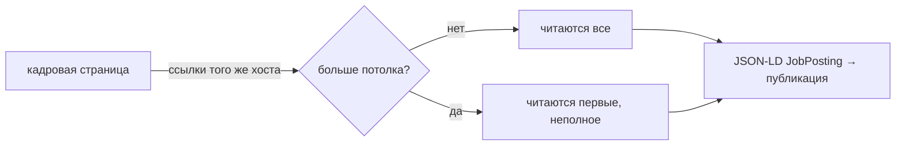
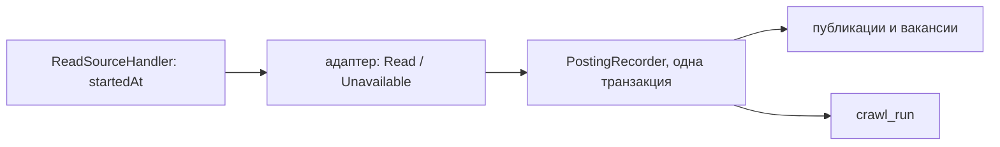
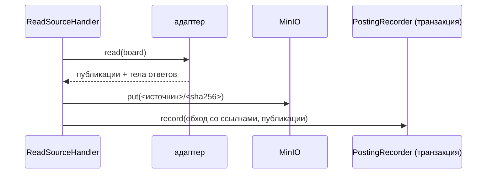
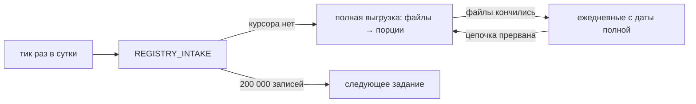

# Стенограмма проекта

Живой документ (рабочий контракт §0.1, §0.4): что и зачем сделано и простое объяснение каждой
неочевидной конструкции со ссылкой на официальную документацию. Записи `§NN` только
дописываются.

## §1 — Каркас нового репозитория (подэтап 1.1)

**Зачем.** Технический документ §15, подэтап 1.1: основа, на которой строится магистраль доставки
заданий. Бизнес-логики нет.

**Что сделано.**
- `pom.xml` — корневой модуль сборки (packaging `pom`): общие версии и правила для модулей
  `job-api` и `job-worker`. Родитель `spring-boot-starter-parent` 4.1.1 задаёт согласованные
  версии зависимостей Spring и плагинов. https://docs.spring.io/spring-boot/maven-plugin/using.html
- `testcontainers-bom` — список согласованных версий библиотек Testcontainers; импортируется в
  `dependencyManagement`, поэтому в модулях версии не пишутся. Spring Boot 4 этими версиями не
  управляет. https://java.testcontainers.org/
- `maven-checkstyle-plugin` на фазе `validate` с `config/checkstyle/checkstyle.xml` — правила
  контракта (≤5 параметров и полей записей, имена ≥2 символов, JavaDoc у публичных типов)
  проверяются каждой сборкой. https://checkstyle.org/checks.html
- `job-api`: `spring-boot-starter-web` (REST), `actuator` (health), `data-jpa`,
  `spring-boot-starter-flyway` + `flyway-database-postgresql` (миграции схемы; в Spring Boot 4
  автоконфигурация Flyway — отдельный стартер), драйвер PostgreSQL. В `application.yml`:
  `ddl-auto: validate` — Hibernate только сверяет сущности со схемой, создаёт её Flyway;
  `open-in-view: false` — соединение с БД не удерживается на всё время HTTP-запроса;
  `problemdetails.enabled` — ошибки в формате RFC 9457.
- `job-worker`: web (только для Actuator), `actuator`, `data-jpa`, `spring-boot-starter-amqp`
  (RabbitMQ), драйвер PostgreSQL; Flyway не подключён — схемой владеет job-api. Настройки
  RabbitMQ: `publisher-confirm-type: correlated` — брокер подтверждает приём каждого сообщения;
  `publisher-returns: true` + `template.mandatory: true` — сообщение без подходящей очереди
  брокер возвращает, а не теряет. https://docs.spring.io/spring-amqp/reference/amqp/template.html
- Тесты `contextLoads` в обоих модулях на реальных контейнерах. `@ServiceConnection` —
  Spring Boot сам берёт адрес и учётные данные из контейнера Testcontainers и настраивает
  подключение. https://docs.spring.io/spring-boot/reference/testing/testcontainers.html
- `docker-compose.yml` — PostgreSQL 16 (:5433), RabbitMQ 4 с консолью (:5672, :15672), MinIO
  (:9000, :9001); `healthcheck` — Docker сам проверяет готовность сервиса.
- `.github/workflows/ci.yml` — GitHub Actions: JDK 21 и `mvn -B -ntp verify` на каждый push в
  `main` и pull request.
- Документы: README и эта стенограмма.

**Тесты.** `JobApiApplicationTests`, `JobWorkerApplicationTests` — контекст поднимается.

**README** — написан для нового проекта (контракт §0.2).

**Не вошло.** Outbox, leader-lock, задания с повторами, HTTP-клиент, ArchUnit, приёмочные тесты —
следующие срезы подэтапа 1.1.

## §2 — Outbox и публикация в RabbitMQ (подэтап 1.1)

**Зачем.** Магистраль доставки заданий (технический документ §6, §9, §16.2): событие пишется в
БД в одной транзакции с изменением данных и гарантированно доходит до RabbitMQ.

**Что сделано.**
- `V1__outbox.sql` (job-api) — таблица `outbox_event`; частичный индекс по неопубликованным.
- `RabbitTopology` — обменник `roleorienta.jobs`, рабочая очередь, dead-letter обменник и DLQ,
  всё durable. Бины `DirectExchange`/`Queue`/`Binding` Spring AMQP сам объявляет в брокере.
  https://docs.spring.io/spring-amqp/reference/amqp/broker-configuration.html
- `OutboxRepository` — SQL к outbox. `FOR UPDATE SKIP LOCKED` блокирует выбранные строки до конца
  транзакции и пропускает занятые другой репликой — каждое событие отправляет один публикатор.
- `OutboxPublisher` — пачка в одной транзакции: захват → отправка с `mandatory` → ожидание
  подтверждений (`waitForConfirmsOrDie`) → отметка `published_at`. Вернувшиеся как
  немаршрутизируемые (`basic.return`, собираются `ReturnsCallback`) не отмечаются, счётчик попыток
  +1. Нет подтверждений — откат, повтор на следующем тике; возможный повторный приход сообщения
  гасит идемпотентный потребитель по `messageId`.
  https://docs.spring.io/spring-amqp/reference/amqp/template.html#template-confirms
- `OutboxPublisherTick` — `@Scheduled` тик (пауза `app.outbox.poll-interval-ms`), выключается
  `app.outbox.tick-enabled=false`; `@ConditionalOnProperty` не создаёт бин при выключении.
- `OutboxProperties` — запись настроек `app.outbox.*` (`@ConfigurationProperties`,
  `@DefaultValue`); регистрируется `@ConfigurationPropertiesScan` в `JobWorkerApplication`;
  там же `@EnableScheduling` — включает `@Scheduled`.
- Тесты worker создают схему теми же миграциями job-api: Flyway подключён к worker только в
  тестах, `spring.flyway.locations=filesystem:../job-api/...` в профиле `test`.

**Тесты.** `OutboxPublisherTests`: событие доставлено в очередь с id в `messageId` и отмечено;
без привязки очереди событие не отмечено, попытка засчитана, после восстановления привязки
доставлено.

**README** — строка статуса.

**Не вошло.** Потребитель заданий, таблица заданий с повторами, leader-lock — следующий срез.

## §3 — Задания с повтором через БД (подэтап 1.1)

**Зачем.** Технический документ §6, §9, §16.3, §16.12: временный отказ повторяется с растущим
интервалом, прогресс переживает перезапуск, ошибка кода не теряется.

**Что сделано.**
- `V2__task.sql` — таблица `task`: тип, ключ идемпотентности (UNIQUE), параметры, состояние
  QUEUED → RUNNING → DONE / WAITING / FAILED, попытки, срок повтора, аренда. `outbox_event.task_id`.
- `TaskService.enqueue` — задание и событие outbox одной транзакцией; повтор с тем же ключом
  ничего не делает (`ON CONFLICT DO NOTHING`).
- `OutboxPublisher` кладёт id задания в заголовок `taskId`; `TaskListener` (`@RabbitListener`)
  передаёт его `TaskExecutor`.
- `TaskExecutor` — захват `UPDATE … WHERE state = 'QUEUED'` (повторная доставка задание не
  захватит — идемпотентность), обработчик вне транзакции, запись результата. Результат —
  `TaskOutcome` (sealed: `Done`, `Retry`, `Failed`; `switch` проверяется компилятором на полноту).
  Исключение обработчика → FAILED и сообщение в DLQ (`default-requeue-rejected: false`).
- `RetryPolicy` — 5 мин × 2 до 6 ч + до 10% случайной надбавки, не меньше срока источника
  (`Retry-After`); 8 попыток — FAILED. Значения — `app.task.*`.
- `TaskRequeueTick` — раз в 10 с под leader-lock снова ставит в очередь WAITING с наступившим
  сроком и RUNNING с истёкшей арендой (процесс упал).
- `PostgresLeaderLock` — `pg_try_advisory_xact_lock`: не ждёт, освобождается с транзакцией;
  реестр ключей — в JavaDoc класса. https://www.postgresql.org/docs/current/functions-admin.html#FUNCTIONS-ADVISORY-LOCKS
- `TaskHandler` — контракт обработчика; бины собираются через `ObjectProvider` (обработчиков
  может не быть). Обработчики типов появятся с функциями (подэтап 1.2).
- В профиле `test` потребитель не стартует сам (`auto-startup: false`); тесты, которым он нужен,
  запускают его через `RabbitListenerEndpointRegistry`.

**Тесты.** `TaskFlowTests`: постановка → outbox → брокер → потребитель → DONE, повторная
постановка не создаёт задание; повторное выполнение не вызывает обработчик; временный отказ →
WAITING → перепостановка по сроку; последняя попытка → FAILED; истёкшая аренда → QUEUED;
исключение → FAILED и DLQ; неизвестный тип → FAILED. `RetryPolicyTests`: удвоение, потолок,
надбавка, `Retry-After`.

**README** — строка статуса.

**Не вошло.** Выделенный HTTP-клиент, безопасный XML, ArchUnit, каркас приёмочных тестов —
следующие срезы подэтапа 1.1.

## §4 — Чистка: outbox только для заданий (подэтап 1.1)

**Зачем.** Убрать код без назначения (контракт §3.10): outbox ставит в очередь только задания,
потребитель читает id задания из заголовка.

**Что сделано.**
- `V3__outbox_task_only.sql` — удалены `event_type` и `payload`, `task_id` обязателен.
- `OutboxEvent` — `(id, taskId)`; сообщение без тела: `messageId` — id события, заголовок
  `taskId`; заголовок `eventType` убран.
- job-api: убрана настройка `spring.mvc.problemdetails` — контроллеров нет, вернётся с API
  (подэтап 1.5).
- Доступ к данным: доменные сущности — Spring Data JPA (технический документ §3); механика
  очереди, захвата и выдачи — `JdbcTemplate` с явным SQL (`SKIP LOCKED`, условный `UPDATE …
  RETURNING`, `ON CONFLICT`), в одной транзакции с JPA.

**Тесты.** `OutboxPublisherTests` — событие ссылается на задание; проверяются `messageId` и
заголовок `taskId`.

**README** — не менялся.

## §5 — Выделенный HTTP-клиент (подэтап 1.1)

**Зачем.** Технический документ §10: все внешние запросы — через один клиент с защитой от SSRF,
таймаутами и потолками; отказы источника разобраны для повторов (бизнес-описание §4.6).

**Что сделано.**
- Зависимость Apache HttpClient 5 (версия — Spring Boot). Встроенный в JDK клиент сам заново
  определяет адрес хоста и не даёт проверить фактический адрес соединения; в Apache HttpClient
  определение адреса подменяется (`SystemDefaultDnsResolver`). Строка §3 технического документа
  исправлена. https://hc.apache.org/httpcomponents-client-5.4.x/
- `AddressPolicy` — запрещённые адреса: loopback, частные сети, link-local (облачный metadata),
  multicast, 0.0.0.0/8, 100.64/10, fc00::/7, IPv4 в записи IPv6.
- `ExternalHttpClient` — только http/https; каждый адрес, в который разрешилось имя, проверяется
  перед соединением, в том числе на редиректах (защита от DNS-rebinding); таймауты, не больше
  `max-redirects` переходов, циклы запрещены, тело — не больше `max-body-bytes`; встроенные
  повторы библиотеки выключены. `BlockedAddressException` наследует `UnknownHostException` —
  так отказ проходит через клиент как ошибка ввода-вывода.
- `HttpResult` (sealed): `Success`; `TemporaryFailure` — таймаут, обрыв, 5xx, 429 с `Retry-After`
  (секунды или дата); `PermanentFailure` — `ACCESS_DENIED` (401/403), `NOT_FOUND` (404/410),
  `BLOCKED`, `TOO_LARGE`, `CLIENT_ERROR`. Обработчики заданий переводят его в `TaskOutcome`.
- Настройки `app.http.*`; `allow-private-addresses: true` — только для локальных заглушек.

**Тесты.** `ExternalHttpClientTests` на встроенном в JDK HTTP-сервере (без новой тестовой
зависимости): успех с кодировкой, POST JSON, 503, 429 с `Retry-After` секундами и датой,
403/404/400, большой ответ, цикл редиректов, таймаут, блокировка 127.0.0.1, localhost,
169.254.169.254 и схемы ftp. `AddressPolicyTests` — внутренние и публичные адреса.

**README** — стек и строка статуса.

**Не вошло.** Бюджет запросов на хост, robots.txt, безопасный XML — вместе с первым чтением
источника и адаптером Personio (подэтап 1.2).

## §6 — Чтение источника Greenhouse (подэтап 1.2)

**Зачем.** Первый рабочий путь ядра «источник → вакансии» (технический документ §5, §6).

**Что сделано.**
- `V4__source_posting_vacancy.sql` — `source` (провайдер + доска), `vacancy` (состояние, позиция,
  ссылка, даты), `job_posting` (уникальна в паре «источник + внешний id»).
- JPA-сущности `Source`, `Vacancy`, `JobPosting` и репозитории Spring Data
  (`JpaRepository`: готовые операции, запрос по имени метода
  `findBySourceIdAndExternalId`). https://docs.spring.io/spring-data/jpa/reference/
- `SourceAdapter` — контракт адаптера провайдера; `SourceReadResult` — `Read` (публикации) или
  `Unavailable` (отказ `HttpResult`).
- `GreenhouseAdapter` — `GET /v1/boards/{board}/jobs?content=true` через `ExternalHttpClient`,
  разбор JSON (Jackson 2, версия — Spring Boot); не-JSON в ответе — временный отказ.
- `PostingRecorder` — новая публикация создаёт вакансию; известная обновляет сведения и
  подтверждает наличие; всё чтение — одна транзакция.
- `ReadSourceHandler` — задание `READ_SOURCE`: адаптер по провайдеру; временный отказ → повтор
  (с `Retry-After`), постоянный → неудача; сохранённые сведения при отказе не меняются.
- `ReadSourcePlanner` + `ReadSourceTick` (leader-lock 1002) — раз в сутки ставят чтение каждого
  источника, ключ `read:<источник>:<дата>`.
- `ClockConfig` — часы бином, чтобы тесты подменяли время.

**Тесты.** `GreenhouseAdapterTests` — разбор, 503, не-JSON. `ReadSourceFlowTests` — первое
чтение создаёт вакансии, повторная постановка в тот же день ничего не добавляет, второе чтение
обновляет ту же вакансию, 503 → задание ждёт повтора, данные прежние.

**README** — не менялся.

**Не вошло.** Полнота обхода, счётчик отсутствия, состояния и закрытие — следующий срез.

## §7 — Закрытие вакансий и состояния (подэтап 1.2)

**Что сделано.**
- `V5__vacancy_closure.sql` — у публикации `confirmed`, `missing_complete_reads`, `closed_at`;
  у вакансии `closed_at`.
- `SourceReadResult.Read(postings, complete)` — адаптер сообщает, прочитан ли список полностью;
  Greenhouse отдаёт доску одним ответом — всегда `true`.
- `PostingRecorder`:
  - полное чтение — новые публикации создают вакансии, известные обновляются и подтверждаются,
    отсутствующие получают +1 к счётчику и закрываются на 3-м полном чтении подряд
    (`app.vacancy.close-after-missing-reads`);
  - неполное чтение — добавляются только новые публикации, сохранённые не меняются;
  - отказ источника — публикации теряют подтверждение, сведения и счётчики прежние.
- `Vacancy.refreshState` (бизнес-описание §4.3): все публикации закрыты — `CLOSED`; хотя бы одна
  подтверждена — `ACTIVE`; иначе — `NEEDS_RECHECK`. Появившаяся снова публикация открывает ту же
  вакансию.
- Публикации затронутых вакансий читаются одним запросом `findByVacancyIdIn` (без N+1).

**Тесты.** `ReadSourceFlowTests` — через задание и БД: закрытие на 3-м отсутствии, отказ →
повторная проверка, повторное появление → та же вакансия актуальна.

**README** — не менялся.

**Не вошло.** Скрытие неподтверждённой 30 дней вакансии — условие запроса выдачи (подэтап 1.5).

## §8 — Адаптер Personio и безопасный XML (подэтап 1.2)

**Что сделано.**
- `SafeXml` — единственный разборщик внешнего XML (технический документ §10): StAX из JDK
  (`newDefaultFactory`), DTD и внешние сущности выключены, потолок вложенности 32. Размер
  ограничен потолком тела ответа HTTP-клиента.
  https://owasp.org/www-community/vulnerabilities/XML_External_Entity_(XXE)_Processing
- `PersonioAdapter` — лента `https://<доска>/xml`, весь список одним ответом (`complete = true`).
  Доска — хост витрины `<компания>.jobs.personio.de` или `.jobs.personio.com`; другой хост не
  читается (отказ `BLOCKED`); поля `id`, `name`, `office`, тексты `jobDescription/value`; ссылка —
  `/job/<id>`. Корень не `workzag-jobs` или испорченный XML — временный отказ.
- `app.adapter.personio.base-url-template` — адрес витрины, `{board}` — хост витрины.

**Тесты.** `SafeXmlTests` — XXE и глубокая вложенность отвергаются. `PersonioAdapterTests` —
разбор ленты, витрина `.com`, чужой хост, HTML вместо ленты, 503.

**README** — не менялся.

## §9 — Адаптер Workday: список страницами (подэтап 1.2)

**Что сделано.**
- `WorkdayAdapter` — `POST https://<тенант>.<dc>.myworkdayjobs.com/wday/cxs/<тенант>/<сайт>/jobs`
  через `ExternalHttpClient.postJson`, страницы `offset/limit` по 20. Доска —
  `<тенант>.<dc>.myworkdayjobs.com/<сайт>`; другой хост — отказ `BLOCKED`.
- Внешний id и ссылка — `externalPath`; место — `locationsText`; `total` берётся с первой
  страницы (на следующих Workday его не отдаёт).
- Полнота: отказ на первой странице — источник недоступен; отказ на следующей, пустая страница
  раньше `total` или упор в потолок `app.adapter.workday.max-pages` — неполное чтение (§7:
  добавляются только новые публикации, ничего не закрывается).

**Тесты.** `WorkdayAdapterTests` — две страницы с `total` только на первой, отказ на второй
странице, отказ на первой, чужой хост.

**README** — не менялся.

**Не вошло.** Текст вакансии (деталь по `externalPath`) — следующий срез; фасеты стран — вместе с
проходом по стране.

## §10 — Текст вакансий Workday (подэтап 1.2)

**Что сделано.**
- `SourceAdapter.content(board, externalId)` — текст публикации отдельным запросом; по умолчанию
  `null` (Greenhouse и Personio отдают текст в списке).
- `WorkdayAdapter.content` — `GET <api>/<externalPath>`, поле `jobPostingInfo.jobDescription`;
  отказ — `null`.
- `ReadSourceHandler` — запрашивает текст только у публикаций без сохранённого текста и не больше
  `app.collect.max-content-requests-per-read` (200) за чтение; остальное — следующими чтениями.
  Задание остаётся ограниченным: Workday отдаёт текст за ~0,5 с (замер: 50 за 26 с), 200 запросов —
  около 2 минут, далеко от аренды задания (10 минут).
- `JobPosting.update` не стирает сохранённый текст, если чтение текста не принесло.
- `JobPostingRepository.findExternalIdsWithContent` — JPQL в `@Query`.
- Уборка: удалены неиспользуемые методы `JobPosting`/`Vacancy` и дублирующий `VacancyStateTests`.

- Журнал: итог чтения (`Source N read: X postings, complete=…`), итог запроса текстов
  (`requested/received`); неудачный запрос текста Workday — WARN с причиной.

**Тесты.** `WorkdayAdapterTests.readsContent`; `ReadSourceHandlerTests` (Mockito) — текст
запрошен только у публикации без сохранённого текста и в пределах потолка.

**README** — не менялся.

## §11 — Аудит §1–§10

**Область.** Весь код и документы: аудитов раньше не было.

**Исправлено.**
- README: статус отставал (подэтап 1.1, «бизнес-логики нет»), нарушение §0.2 контракта.
- `PersonioAdapter`: позиция без названия ломала бы всё чтение (`vacancy.title NOT NULL`) —
  теперь пропускается, как позиция без id.

**Проверено, нарушений нет.** Нет циклов между пакетами; SQL только в репозиториях; транзакции
короткие — внешние запросы вне транзакций; внешние вызовы с таймаутами, повторы ограничены
таблицей заданий; нет секретов в коде; нет N+1 в записи чтения; индексы под запросы (`task`,
`job_posting`); конструкторы ≤ 5 параметров.

**Отмечено, не менялось (минимальное вмешательство).**
- `WorkdayAdapter.read` — длинный метод (страницы, разбор, полнота); выносить при следующей
  правке адаптера.
- `ExternalHttpClient` берёт `Clock.systemUTC()`, а не бин `Clock`.
- `outbox_event.attempts` растёт, но нигде не читается.

**Расхождения с техническим документом (подэтап 1.2).**
1. robots.txt и бюджет на хост (§10) не сделаны, а сбор уже ходит на настоящие источники
   (Workday — до ~220 запросов за чтение). Это первое по важности.
2. `SourceSnapshot` (снимки в S3), `CrawlRun`, `VacancyRevision` — нет.
3. Адаптер schema.org `JobPosting` — нет.
4. Скрытие вакансии без подтверждения 30 дней — условие выдачи (1.5).
5. Правило ArchUnit «XML только через `SafeXml`» — ArchUnit не подключён.

## §12 — Бюджет на хост и User-Agent (подэтап 1.2)

**Что сделано.**
- `V6__host_budget.sql` — `host_budget(host, next_allowed_at)`: время следующего разрешённого
  запроса к хосту, общее для всех реплик (технический документ §16.11).
- `HostBudget` / `PostgresHostBudget` — резервирование места одним оператором
  `INSERT … ON CONFLICT DO UPDATE … RETURNING`: строка хоста блокируется на время оператора, две
  реплики не получат одно место; время — часы БД. Место дальше потолка ожидания не резервируется.
  https://www.postgresql.org/docs/16/sql-insert.html#SQL-ON-CONFLICT
- `ExternalHttpClient`: перед запросом резервирует место и ждёт его; очередь длиннее
  `host-max-wait` — временный отказ без запроса; `Retry-After` сдвигает очередь хоста
  (`backOff`); единый User-Agent. Часы — бин `Clock` (закрыто замечание аудита §11), один
  конструктор.
- `app.http.politeness.*` — User-Agent с контактом, промежуток 1 с, потолок ожидания 30 с.

**Тесты.** `PostgresHostBudgetTests` — очередь с промежутком и потолок, `Retry-After`, 8
одновременных резервирований получают разные места. `ExternalHttpClientTests` — User-Agent, отказ
без запроса при исчерпанном бюджете, `Retry-After` → `backOff`. Адаптерам клиент для заглушек даёт
`TestHttpClients`.

**README** — не менялся.

**Не вошло.** Редирект на другой хост бюджет не резервирует; robots.txt — §13.

## §13 — robots.txt (подэтап 1.2)

**Что сделано.**
- `RobotsRules` — разбор и сопоставление по RFC 9309: группа робота (токен из User-Agent, без
  учёта регистра) важнее `*`; самое длинное совпадение, при равенстве — `allow`; `*` и `$`.
  Сопоставление без регулярных выражений — чужой файл не вызовет экспоненциальный перебор.
  https://www.rfc-editor.org/rfc/rfc9309
- `ExternalHttpClient` сверяет каждый запрос с robots.txt его происхождения; robots.txt читается
  тем же клиентом (SSRF-защита, бюджет хоста) и кэшируется на сутки в памяти реплики. 2xx —
  правила; 4xx — разрешено всё; 5xx/сеть — запрос откладывается (временный отказ), в кэш не
  кладётся. Запрет — `USE_FORBIDDEN` без запроса; задание чтения — неудача.
- Проверено вручную: robots.txt Workday, Greenhouse разрешают наши пути; у Personio robots.txt нет
  (404).

**Тесты.** `RobotsRulesTests` — своя группа против `*`, самое длинное совпадение и ничья, `*` и
`$`, группировка строк `user-agent`. `ExternalHttpClientTests` — запрет без запроса и один
запрос robots.txt на происхождение; robots.txt 503 — запрос откладывается.

**README** — не менялся.

**Не вошло.** Правило `SourcePermission` (основание использования источника) — отдельно от
robots.txt, по техническому документу §10.

## §14 — Адаптер schema.org `JobPosting` (подэтап 1.2)

**Зачем.** Технический документ §5: четвёртый формат первого этапа — разметка вакансий на сайте
компании. JSON-LD — блок `<script type="application/ld+json">` в HTML-странице с описанием
вакансии по словарю schema.org. https://schema.org/JobPosting,
https://developers.google.com/search/docs/appearance/structured-data/job-posting

**Что сделано.**
- Зависимость Jsoup 1.23.2 (разбор HTML: ссылки и блоки JSON-LD; технический документ §3). Spring
  Boot её версией не управляет — версия в корневом `pom.xml` (`jsoup.version`,
  `dependencyManagement`), в `job-worker` — без версии. https://jsoup.org/
- `JobPostingAdapter` (провайдер `jobposting`). Доска — адрес кадровой страницы (`http`/`https`),
  иначе `BLOCKED` без запроса. С кадровой страницы берутся только ссылки `<a href>` на тот же
  хост, без фрагмента (`#…`), без повторов и без неё самой. Каждая ссылка читается; первый блок
  JSON-LD с типом `JobPosting` (корень, элемент массива или `@graph`; `@type` — строка или
  массив) и непустым `title` даёт публикацию. Страница без разметки — не вакансия, пропускается;
  испорченный блок JSON-LD — тоже.
- Поля: внешний id и ссылка — адрес страницы; `title`; `description` — текст;
  `jobLocation.address` — место («город, регион, страна»; адрес-строка как есть; несколько мест
  через «; »).
- Полнота: отказ кадровой страницы — источник недоступен; ссылок больше потолка
  `app.adapter.jobposting.max-pages` (200, технический документ §17) — читаются первые, чтение
  неполное; временный отказ страницы — чтение неполное. Постоянный отказ страницы (404, запрет
  robots.txt, слишком большая) — страница пропускается: повтор не поможет, а неполнота навсегда
  заблокировала бы закрытие вакансий источника.
- Все страницы читаются через `ExternalHttpClient` — SSRF-защита, бюджет хоста и robots.txt
  действуют без доработок.

```mermaid
flowchart LR
  C[кадровая страница] -->|ссылки того же хоста| L{больше потолка?}
  L -->|да| P[читаются первые, неполное]
  L -->|нет| R[читаются все]
  R --> J[JSON-LD JobPosting → публикация]
  P --> J
```

**Тесты.** `JobPostingAdapterTests` на заглушке сайта: отбор ссылок (свой хост, фрагмент, повтор,
сама страница), `@graph` и массив типов, несколько мест, страница без разметки и испорченный
JSON-LD; потолок — неполное чтение; 503 страницы — неполное; 404 страницы — пропуск, чтение
полное; 503 кадровой страницы — недоступен; не-адрес доски — `BLOCKED`.

**README** — статус (формат `JobPosting`) и стек (Jsoup).

**Не вошло.** Причина неполноты «превышен потолок страниц» в показателях источников — пока только
в журнале (показателей ещё нет). Ссылки на другие поддомены сайта не читаются — только хост
кадровой страницы. Отбор ссылок без признаков «страница вакансии»: читаются все ссылки того же
хоста, лишние отсеиваются отсутствием разметки. На странице берётся одна публикация. Объединение
по `url`/`sameAs` с системой найма — §6 технического документа, позже.

## §15 — Обходы `CrawlRun` (подэтап 1.2)

**Зачем.** Технический документ §4: обход — одно чтение списка публикаций источника с конечным
состоянием. Раньше итог чтения (полное, неполное, отказ и почему) оставался только в журнале;
теперь он хранится и станет основой показателей источников. Расхождение 2 аудита §11 (частично).

**Что сделано.**
- `V7__crawl_run.sql` (job-api — владелец схемы): `crawl_run` — источник, задание, начало и конец,
  состояние `COMPLETE`/`PARTIAL`/`FAILED`, причина неполноты, вид и текст отказа, число
  публикаций. Две проверки `CHECK` держат согласованность: причина неполноты есть тогда и только
  тогда, когда `PARTIAL`; вид отказа — когда `FAILED`. Внешний ключ на задание с
  `ON DELETE SET NULL`: удаление задания не стирает историю обходов.
  https://www.postgresql.org/docs/16/ddl-constraints.html
- Пакет `crawl`: сущность `CrawlRun` (фабрики `read` и `failed`, `finish` — время записи),
  `CrawlRunState`, `PartialReason` (`PAGE_LIMIT`, `PAGE_FAILED`, `LIST_ENDED_EARLY`),
  `CrawlRunRepository`.
- `SourceReadResult.Read` вместо признака `complete` несёт причину неполноты (`null` — полное);
  фабрики `Read.full` / `Read.partial`, метод `complete()` сохранён. Адаптеры называют причину:
  Workday — отказ страницы, пустая страница раньше `total`, потолок; `JobPosting` — потолок,
  временный отказ страницы.
- `ReadSourceHandler` засекает начало до чтения (бин `Clock`) и передаёт обход в `PostingRecorder`;
  тот сохраняет его **в той же транзакции**, что и изменения публикаций, — итог чтения и его
  запись не расходятся. Конец обхода — момент записи, включая запросы текста.

```mermaid
flowchart LR
  H[ReadSourceHandler: startedAt] --> A[адаптер: Read / Unavailable]
  A --> R[PostingRecorder, одна транзакция]
  R --> P[публикации и вакансии]
  R --> C[crawl_run]
```

Зависимости пакетов без циклов: `adapter` → `crawl`, `vacancy` → `crawl`; `crawl` зависит только
от `source` и `http`.

**Тесты.** `ReadSourceFlowTests` — полное чтение даёт обход `COMPLETE` с числом публикаций и
заданием; 503 — `FAILED` с видом `TEMPORARY`. Тесты адаптеров проверяют причину неполноты
(Workday — `PAGE_FAILED`; `JobPosting` — `PAGE_LIMIT`, `PAGE_FAILED`).

**README** — не менялся (стек, запуск и статус подэтапа не изменились).

**Не вошло.** Обход не создаётся заранее планировщиком (пишется по итогу чтения); контрольная
точка, наблюдения `CrawlObservation`, область с фильтром страны — позже, когда появится обход
частями или фасеты стран. Даты источника (`lastAttemptAt`, `lastCompleteRunAt` …) выводятся из
`crawl_run` запросом — отдельных колонок нет. Показатели источников — подэтап показателей.

## §16 — История вакансий `VacancyRevision` (подэтап 1.2)

**Зачем.** Технический документ §4, §6: история изменений вакансии с первого обнаружения; пишется
только полным обходом. Расхождение 2 аудита §11 (частично).

**Что сделано.**
- `V8__vacancy_revision.sql`: запись истории — вакансия, публикация-источник, обход, поле
  (`TITLE`, `LOCATION`, `REOPENED`), было → стало. Время изменения не дублируется — это
  `crawl_run.finished_at`.
- `VacancyRevision`, `RevisionField`. `JobPosting.update(fetched, run, now)` сравнивает позицию и
  место с сохранёнными и отмечает повторное появление закрытой публикации, затем обновляет
  сведения. Текст (HTML) ревизий не создаёт — его изменения технические (§4).
- Записи сохраняются вместе с публикацией: `@OneToMany(mappedBy, cascade = PERSIST)` —
  добавленная запись вставляется при сохранении публикации, уже сохранённая история при этом не
  загружается. Отдельный репозиторий не понадобился (у `PostingRecorder` иначе было бы 6
  параметров конструктора — предел 5).
- `PostingRecorder` сохраняет обход **первым**: на него ссылаются записи истории.
- Неполное чтение известных публикаций не меняет — и истории не пишет (было и раньше).

**Тесты.** `ReadSourceFlowTests` — смена позиции даёт `TITLE` «было → стало»; повторное появление
закрытой публикации — `REOPENED`, неизменные сведения записей не дают.

**README** — не менялся.

**Не вошло.** Отдельная запись о первом обнаружении и о закрытии — даты уже в `vacancy`
(`first_seen_at`, `closed_at`). Показ истории пользователю — бизнес-описание §12, решение позже.

## §17 — Снимки ответов `SourceSnapshot` (подэтап 1.2)

**Зачем.** Технический документ §4, §16.10: исходные ответы источников хранятся в S3-хранилище,
чтобы после исправления адаптера или нормализации переразобрать их без нового обращения к
источнику. Закрывает расхождение 2 аудита §11.

**Что сделано.**
- Зависимости: AWS SDK v2 `s3` 2.54.13 (версии — BOM `software.amazon.awssdk:bom` в корневом
  `pom.xml`; асинхронный транспорт Netty исключён — не используется), в тестах
  `org.testcontainers:minio`. https://docs.aws.amazon.com/sdk-for-java/latest/developer-guide/examples-s3.html
- Пакет `snapshot`: `SnapshotProperties` (`app.snapshot.*`, из окружения `S3_*`; секрет не
  выводится в `toString`), `SnapshotConfig` — клиент S3: `endpointOverride` на MinIO,
  `forcePathStyle` (адрес `<хост>/<корзина>/<ключ>`), таймауты вызова и попытки.
  `SnapshotStore.put` — ключ `<источник>/<sha256 тела>`: неизменяемый, одинаковый ответ — один
  объект, хеш проверяет содержимое; корзина создаётся при первой записи. Сбой хранилища не
  прерывает чтение: снимок пропускается с записью в журнал.
- `V9__source_snapshot.sql`: ссылка обхода на объект — ключ, хеш, время сохранения (ставит БД).
- Адаптеры отдают тела успешных ответов списка (`SourceReadResult.Read.responses`).
  `ReadSourceHandler` сначала пишет объекты, затем обход со ссылками сохраняется в транзакции
  записи публикаций (`CrawlRun` → `SourceSnapshot`, `cascade = PERSIST`) — порядок «объект, затем
  ссылка в БД» (§9).
- `CrawlRun` начинается до чтения (`PostingRecorder.startRun`, часы — там же) и получает итог
  (`read` / `fail`); фабрики `read`/`failed` заменены — иначе у `ReadSourceHandler` было бы 6
  параметров конструктора.

```mermaid
sequenceDiagram
  participant H as ReadSourceHandler
  participant A as адаптер
  participant S as MinIO
  participant R as PostingRecorder (транзакция)
  H->>A: read(board)
  A-->>H: публикации + тела ответов
  H->>S: put(<источник>/<sha256>)
  H->>R: record(обход со ссылками, публикации)
```

**Тесты.** `ReadSourceFlowTests` (MinIO в Testcontainers) — после чтения в БД ссылка с ключом
`<источник>/<sha256>`, объект в MinIO содержит ответ. Тесты адаптеров проверяют отданные тела.

**README** — статус и переменные окружения `S3_*`.

**Не вошло.** Срок хранения и очистка сирот (§16.10) — отдельный срез. Версия адаптера в снимке —
версий адаптеров пока нет. Ответы текста публикаций (деталь Workday) не снимаются — только ответы
списка. Повторная обработка снимков — позже.

## §18 — Образ MinIO: архивный Bitnami (временная замена)

**Зачем.** CI упал на §17: `Can't get Docker image: minio/minio:latest`. MinIO в сентябре 2026
убрал свои образы с Docker Hub, затем закрыл и quay.io (401). Локально сборка проходила только
потому, что образ лежал в кэше Docker; на чистой машине не поднимался бы и `docker compose up`.
Код не при чём: клиент S3 (AWS SDK) работает с любым S3-совместимым хранилищем.

**Что сделано.**
- `docker-compose.yml`: `bitnamilegacy/minio:2025.2.28-debian-12-r1` — последние сборки MinIO,
  которые Bitnami (Broadcom) держит в архивном репозитории для amd64 и arm64. Тег закреплён.
  Сервер образ запускает сам (команда не нужна), данные — `/bitnami/minio/data` в новом томе
  `snapshots-data`: образ работает не от root, а старый том `minio-data` принадлежит root.
  Проверка готовности — `curl` на `/minio/health/live`.
- `TestcontainersConfiguration`: тот же образ через `GenericContainer` (обычный контейнер
  Testcontainers: образ, переменные, порт, ожидание готовности по HTTP). Специализированный
  `MinIOContainer` запускает команду официального образа и с образом Bitnami не работает, поэтому
  тестовая зависимость `org.testcontainers:minio` убрана.
  Свойства `app.snapshot.*` берут адрес контейнера через `@Qualifier("minioContainer")`:
  контейнеры PostgreSQL и RabbitMQ — тоже `GenericContainer`, без имени Spring не выберет бин.
  https://java.testcontainers.org/features/creating_container/

**Долг.** Архивный образ обновлений не получает и может исчезнуть. Замена на поддерживаемое
S3-совместимое хранилище записана в `docs/next-step.md` (раздел «Долг», переносится при каждой
перезаписи) и в комментарии `docker-compose.yml`.

**README** — не менялся (порты, переменные и команды те же).

## §19 — Workday: фильтр по стране и проверка пропажи (подэтап 1.2)

**Зачем.** Технический документ §5, §15 (1.2 «проверка пропажи из фильтрованного списка»),
бизнес-описание §4.3. Крупные доски Workday глобальны: без фильтра чтение упирается в потолок
страниц (2000 публикаций), остаётся неполным и никогда не закрывает вакансии. С фильтром читаются
только публикации страны, но пропажа из такого списка ещё не закрытие — публикация могла сменить
страну.

**Что сделано.**
- `V10__source_country.sql`: `source.country` (ISO 3166-1 alpha-2, `NULL` — без фильтра) и
  `crawl_run.country` — область обхода, фиксируется при его начале (технический документ §4).
- `SourceAdapter`: `read(board, country)` и `check(board, externalId)` — методы по умолчанию
  (`default`: реализация в интерфейсе, адаптер переопределяет при необходимости): у провайдеров без
  фильтра страна не влияет, а пропажа из списка — отсутствие. `PostingCheck` — итог проверки:
  `Present` (есть, с новыми сведениями), `Absent` (нет), `Unknown` (проверить не удалось).
- `WorkdayAdapter`: первый ответ без фильтра содержит фасеты (`facets` — группы значений для
  отбора; значение может нести вложенный фасет). Имя параметра страны у тенантов разное — берётся
  фасет с `country` в имени и значение с английским названием страны (`Locale`), дальше список
  читается с `appliedFacets`. Фасета страны нет — чтение без фильтра; страны нет среди значений —
  пустой полный список. `check` — деталь публикации: `jobPostingInfo` есть — `Present`; 404/410 —
  `Absent`; прочее — `Unknown`. Чтение страниц вынесено в `readPages`, запрос детали — в `detail`
  (общий с `content`).
- `ReadSourceHandler`: после полного чтения источника со страной известные незакрытые публикации,
  которых нет в списке, проверяются (`app.collect.max-checks-per-read`, 200): найденные идут в
  запись как прочитанные (сведения обновятся, история запишет смену места), не проверенные —
  не засчитываются отсутствующими (`PostingRecorder.record(..., unverified)` снимает с них
  подтверждение без счётчика отсутствия).

**Тесты.** `WorkdayAdapterTests` — фасет страны во вложенной группе и чтение с фильтром; страны
нет среди значений — пустой полный список; деталь есть / 404. `ReadSourceHandlerTests` — пропавшие
из списка: найденная остаётся с новыми сведениями, отсутствующая засчитывается, за потолком
проверок — не засчитывается.

**README** — не менялся.

**Не вошло.** Работа фасетов и ответ детали снятой публикации (404 или иной) проверены только на
заглушке — сверить на живом тенанте при подключении первых источников (этап 0). Название страны
тенант может писать иначе («Slovak Republic») — тогда список пуст, пропавшие проверяются деталью,
ложных закрытий нет; расхождение видно в журнале. Страна источника задаётся вручную, как и сам
источник (до 1.7).

## §20 — Приёмочные сценарии 6 и 7 (подэтап 1.2)

**Зачем.** Технический документ §14, §15: подэтап закрывается приёмочными сценариями бизнес-описания
§7.4-А, которые с этого момента идут в каждой сборке. Для 1.2 — 6 (закрытие) и 7 (временный отказ и
неполное чтение); 8 (срок без подтверждения) — условие выдачи, вместе с 1.5.

**Что сделано.**
- `acceptance/SourceToVacancyAcceptanceTests` — тестовый сайт с разметкой `JobPosting` и заранее
  известным содержимым (встроенный в JDK HTTP-сервер; кадровая страница ссылается на все
  опубликованные вакансии), сценарий меняет страницы и коды ответов между обходами:
  - 6 — пропавшая из трёх полных чтений вакансия закрыта; записи вакансии и публикации и история
    изменений сохранены; соседняя актуальна;
  - 7, отказ — три отказа кадровой страницы: не закрыта, «нуждается в повторной проверке»,
    сведения и дата подтверждения прежние, отсутствие не засчитано; после восстановления та же
    вакансия актуальна;
  - 7, неполное чтение (граничный случай 1 §14) — страница вакансии отвечает 503: изменения
    известной вакансии не применены, истории нет, дата подтверждения прежняя, новая вакансия
    добавлена; после полного чтения изменения применены, повторов нет.
- **Исправлено по сценарию 7.** Неполное чтение не снимало подтверждение с известных публикаций —
  их вакансии оставались «актуальными». По §4 неполный обход снимает подтверждение ранее известных
  публикаций источника (впервые увиденные подтверждаются и неполным); `PostingRecorder` теперь
  так и делает.

**README** — не менялся.

**Не вошло.** Управляемые часы — не нужны 6 и 7, понадобятся сценарию 8. Явное закрытие в
источнике — поддерживаемые форматы его не дают. Уход закрытой вакансии из накопленного списка —
с выдачей (1.5). WireMock (§14) не подключался: заглушки на встроенном сервере JDK покрывают эти
сценарии без новой зависимости.

## §21 — Доступность источника: «временные отказы» и «недоступен» (подэтап 1.3)

**Зачем.** Технический документ §4 (`Source`: доступность `OK`/`TEMP_FAILING`/`UNAVAILABLE`), §9,
§17 (7 дней); бизнес-описание §4.6: источник, недоступный дольше срока, получает статус
«недоступен» и перепроверяется как исчезнувшая кадровая страница. Первый срез подэтапа 1.3.

**Что сделано.**
- `V11__source_availability.sql`: `source.availability` (по умолчанию `OK`) и `failing_since` —
  начало текущей серии отказов.
- `Source.markRead` / `markFailure` — правило в сущности, проверяется без БД: ответ списка
  (полное или неполное чтение) — `OK`, серия прервана; временный отказ — `TEMP_FAILING` с начала
  серии, `UNAVAILABLE` — когда серия длится не меньше `app.crawl.unavailable-after` (7 дней);
  постоянный отказ (доступ запрещён, страница удалена, запрет robots.txt, чужой адрес) — сразу
  `UNAVAILABLE`.
- `CrawlLog.finish` — итог обхода: сохраняет обход и пересчитывает доступность источника.
  `@Transactional(propagation = MANDATORY)` — выполняется только внутри уже открытой транзакции
  (записи публикаций), отдельно от неё записаться не может. `PostingRecorder` вызывает его вместо
  прямого сохранения обхода; `CrawlRunRepository` из него ушёл (иначе 6 параметров конструктора).
  https://docs.spring.io/spring-framework/reference/data-access/transaction/declarative/tx-propagation.html

**Тесты.** `SourceTests` — серия временных отказов до и после срока, сброс серии ответом,
постоянный отказ. Приёмочный сценарий 7 (отказ) проверяет `TEMP_FAILING` при отказах и `OK` после
восстановления.

**README** — не менялся.

**Не вошло.** Перепроверка кадровой страницы при `UNAVAILABLE` — подэтап 1.7 (обнаружения ещё нет);
до тех пор недоступный источник читается по расписанию как прежде и при ответе снова `OK`. Статусы
в показателях — `CoreMetricDaily` (1.3).

## §22 — Аудит §12–§21

**Область.** Код, изменённый после аудита §11 (срезы §12–§21: HTTP-клиент с бюджетом и
robots.txt, адаптеры, обходы, история, снимки, доступность, запись чтения), и документы.

**Исправлено.**
- **N+1 в записи чтения** (контракт §3.5). `PostingRecorder` обращается к вакансии каждой
  публикации (подтверждение, пересчёт состояния), а публикации грузились без вакансий — отдельный
  запрос на каждую (Workday — до 2000 за чтение). `JobPostingRepository.findBySourceId` и
  `findByVacancyIdIn` получили `@EntityGraph(attributePaths = "vacancy")`: вакансии загружаются тем
  же запросом (JOIN). Аудит §11 это пропустил.
  https://docs.spring.io/spring-data/jpa/reference/jpa/query-methods.html#jpa.entity-graph
- `ReadSourceHandler.handle` — запись снимков вынесена в `storeSnapshots` (метод делал слишком
  много, контракт §3.1).
- **ArchUnit** (технический документ §15, подэтап 1.1; расхождение 5 аудита §11) — с разрешения
  владельца: зависимость `com.tngtech.archunit:archunit` 1.4.2 (только тесты; ядро без движка JUnit —
  у Spring Boot 4 JUnit 6, движок ArchUnit для него только в новых версиях). `ArchitectureTests`:
  фабрики разборщиков XML — только в пакете `xml` (`SafeXml`, защита от XXE); нет циклов между
  пакетами верхнего уровня. https://www.archunit.org/userguide/html/000_Index.html
- README: статус отставал (подэтап 1.2 → закрыт кроме сценария 8, идёт 1.3) — нарушение §0.2.
- Технический документ §3, §6 «Заглушки», §14: заглушки источников — встроенный HTTP-сервер JDK,
  а не WireMock (так сделано с §6; сценарии покрываются без новой зависимости).

**Проверено, нарушений нет.** Циклов между пакетами нет (теперь проверяет тест). SQL только в
репозиториях и `PostgresHostBudget`; внешние запросы (источники, S3) вне транзакций БД; порядок
«объект в S3, затем ссылка в БД»; итог обхода, доступность источника и публикации — одна
транзакция (`CrawlLog`, `MANDATORY`). Таймауты: HTTP-клиент, S3-клиент. Повторы ограничены
(таблица заданий, SDK). Секреты: `SnapshotProperties.toString` без ключей. Конструкторы и записи ≤ 5
параметров. Индексы под новые запросы (`crawl_run`, `vacancy_revision`, `source_snapshot`,
незакрытые публикации — уникальный индекс `(source_id, external_id)`). Checkstyle и JavaDoc
новых классов.

**Отмечено, не менялось (минимальное вмешательство).**
- `WorkdayAdapter.read(board, country)` — около 35 строк (обнаружение фасета и выбор значения);
  выносить при следующей правке адаптера.
- `Source` не хранит даты попыток и успехов и версию адаптера (технический документ §4): даты
  выводятся из `crawl_run`, версий адаптеров нет.
- Недоступный источник читается по расписанию, как прежде — перепроверка кадровой страницы (1.7).

**Расхождения с техническим документом, остающиеся.** Сценарий 8 — с выдачей (1.5); контрольная
точка обхода — у поддерживаемых форматов пагинация нестабильна или список одним ответом, обход
начинается заново (§6 это допускает); срок хранения снимков и очистка сирот (§16.10) — не сделаны.

**README** — статус.

## §23 — Подэтап 1.3 закрыт: перезапуск во время чтения (сценарий 9, сбор)

**Зачем.** Решение владельца: закрыть 1.3 одним срезом только по надёжности и идти к работающему
ядру — сначала автоматический сбор компаний (1.6–1.7), затем отбор и выдача (1.4–1.5).

**Что сделано.**
- Приёмочный сценарий 9 (сбор) в `SourceToVacancyAcceptanceTests`: приложение останавливается во
  время чтения (задание захвачено, аренда истекла) и после записи результата, но до отметки
  задания выполненным. Оба раза задание возвращается в очередь по аренде и выполняется снова;
  вакансия и публикация записаны по одной, повторов нет.
- Проверено без изменений кода: ошибка кода обработчика переводит задание в `FAILED` с причиной, а
  сообщение — в DLQ (`TaskFlowTests`); зависших заданий не остаётся — незавершённое возвращается
  по аренде.
- Технический документ: `FailedOperation` отдельной таблицей не вводится — его роль выполняет
  задание в `FAILED` (тип, параметры, причина, попытки, время), §4, §9, §11. Подэтап 1.3 сужен до
  надёжности; `CoreMetricDaily`, отчёт администратору, эксплуатационная наблюдаемость, резервная
  копия и восстановление перенесены в 1.10, где они нужны для эксплуатационной проверки (§15).
- Срок хранения снимков и очистка сирот — в «Долг» `docs/next-step.md`.

**README** — статус (1.3 закрыт, следующий — 1.6).

**Не вошло.** Сценарий 9 для выдачи — с 1.5; для мест обработки общего сбора — с 1.6.

## §24 — Приём юрлиц Словакии из выгрузок RPO (подэтап 1.6)

**Зачем.** Технический документ §5.1, §15 (1.6): компании страны попадают в систему автоматически
из реестра юрлиц. Этап 0 для RPO проведён в этом срезе по официальной документации
(https://rpo.minv.sk/rpo-api-doc.html), решения владельца:
- **Способ чтения — выгрузки, а не поисковый API.** API требует фильтр и отдаёт не больше 500
  записей — полный перебор ненадёжен. Выгрузки лежат в открытом S3-совместимом хранилище МВД:
  полная (раз в месяц, ~815 МБ gzip в 23 файлах на 5.09.2026) и ежедневные с новыми и изменёнными
  записями; хранятся 45 дней. Полная читается один раз — только она перечисляет все записи без
  потерь (записи, не менявшиеся 45 дней, в ежедневные не попадают); дальше — ежедневные.
- **Какие записи.** Действующие юрлица, включая органы власти и города; предприниматели-физлица —
  нет (у них почти не бывает кадровых страниц, а это основная масса записей).
- **Условия.** Лицензия CC BY 4.0: использовать можно, источник указывается (`company.registry`;
  в интерфейсе — с 1.5).

**Что сделано.**
- `V12__company_intake.sql`: `company` (страна + регистрационный номер уникальны; название, форма,
  населённый пункт, реестр, дата прекращения) и `intake_cursor` (выгрузка, файл, запись, последняя
  ежедневная, версия).
- `RpoExports` — клиент S3 (AWS SDK) без ключей: список файлов полной выгрузки, наличие
  ежедневной, чтение файла потоком с распаковкой gzip. Не `ExternalHttpClient`: это официальный
  набор открытых данных, а не страница сайта, и файлы до ~100 МБ при его потолке 5 МБ.
- `RpoRecordParser` — запись → юрлицо: текущие значения списков с периодами действия (без
  `validTo`), отбор физлиц по коду формы 101–110 или словам «fyzická osoba»/«roľník».
- `RegistryIntakeHandler` (задание `REGISTRY_INTAKE`): файл выгрузки — `{"exportDate": …, "results": [ … ]}`
  (сверено на живых файлах); потоковый парсер Jackson (`JsonParser`) доходит до `results` и читает
  записи по одной, не загружая файл (~100 МБ gzip) в память; порция (1000) и сдвиг курсора — одна
  транзакция (`IntakeRepository.applyBatch`), поэтому после остановки чтение продолжается с места
  без пропусков и повторов. Не больше 200 000 записей за задание (порядка одного файла: продолжение открывает файл заново и
  пропускает прочитанное), дальше — следующее задание.
  Курсор сдвигается условным `UPDATE … WHERE version = ?`: два задания не ведут его одновременно
  (второе завершается без изменений). Ежедневная за сегодня не читается (ещё не полна); цепочка
  ежедневных прервана — переход на более новую полную выгрузку, её нет — ожидание.
- `RegistryIntakeTick` — раз в сутки ставит задание под leader-lock (ключ 1003).
- Настройки `app.intake.*`.

```mermaid
flowchart LR
  T[тик раз в сутки] --> H[REGISTRY_INTAKE]
  H -->|курсора нет| I[полная выгрузка: файлы → порции]
  I -->|файлы кончились| D[ежедневные с даты полной]
  D -->|цепочка прервана| I
  H -->|200 000 записей| N[следующее задание]
```

**Тесты.** `RegistryIntakeTests` (заглушка хранилища, настоящая PostgreSQL; порция 2, задание 3):
отбор записей (s.r.o., город — да; физлицо, без IČO, неизвестное прекращённое — нет), ежедневные
переименование и прекращение, ожидание при прерванной цепочке без новой полной; продолжение с места
курсора.

**README** — статус.

**Не вошло.** Первый прогон на живой выгрузке показал формат файла (обёртка `results`, коды форм
числовые: 101 — физлицо, 112 — s.r.o.); первая версия читала файл как одно значение — исправлено до
коммита. `CollectionCountry` и чередование стран — одна
страна; появятся со второй страной или с пользователями (1.5). Партии компаний на проверку сайта
(`CHECK_COMPANY`) — 1.7. Индекс систем найма (Common Crawl) — отдельным срезом 1.6.

## §25 — Сайты компаний по IČO из Common Crawl (подэтап 1.7)

**Зачем.** Технический документ §5.1, §15 (1.7): у компании из реестра нужно найти сайт и
подтвердить его регистрационным номером. Решение владельца — бесплатные источники; основной —
Common Crawl (открытый архив веба, обновляется раз в месяц; в сентябрьском обходе 2026 года зона
`.sk` — ~8,2 млн страниц, ~112 тыс. доменов). Опора — Торговый кодекс Словакии §3a: предприниматель
указывает на сайте данные о себе, на практике IČO в контактах или подвале.

**Что сделано.**
- `V13__company_site.sql`: `company_site` (компания, хост, страница-доказательство, источник,
  обход; уникально «компания + хост») и `cc_index_block` (блоки индекса обхода к просмотру с
  отметкой `done`).
- `CommonCrawlClient` — JDK `HttpClient` к открытым данным Common Crawl: список обходов
  (`collinfo.json`), оглавление индекса (`cluster.idx`, читается потоком до конца зоны), блок
  индекса и запись архива страницы — запросом части файла (`Range`), без скачивания файлов. Пауза
  перед каждым запросом (`app.site.request-interval`, 200 мс); 429/5xx — `UnavailableException`,
  задание повторится.
- `SiteScanHandler` (задание `SITE_SCAN`): блоки зоны `.sk` по оглавлению (адреса в индексе
  отсортированы в виде SURT — хост задом наперёд, `sk,firma)/kontakt`; берутся блоки, начинающиеся в
  зоне, и предыдущий); по одной странице на хост — контакты/реквизиты, иначе главная; текст страницы
  (Jsoup) → IČO (`IcoExtractor`: восемь цифр после подписи «IČO», пробелы допустимы) → действующая
  компания реестра → сайт. Находки блока и `done` — одна транзакция: скан продолжается с места.
  20 блоков за задание, дальше — следующее. Нечитаемая страница пропускается, недоступность Common
  Crawl — повтор.
- `SiteScanTick` — раз в сутки (leader-lock 1004); новый обход сканируется, просканированный —
  задание сразу завершается.
- Технический документ §5.1 — метод поиска сайта (решение владельца).

**Тесты.** `IcoExtractorTests` — форматы записи IČO, DIČ и IČ DPH не путаются. `SiteScanTests` —
заглушка хранилища Common Crawl с запросами частей файлов: выбор блоков зоны, контакты вместо
главной, неизвестный и прекращённый IČO не дают сайта, повторный скан ничего не добавляет.

**README** — статус.

**Не вошло.** Словацкоязычные сайты вне `.sk` (`.com`, `.eu`), обратный путь (доски систем найма,
`JobPosting`), OSM и Wikidata, угадывание домена — следующими срезами по замеру охвата. Поиск
кадровых страниц на найденных сайтах и подключение источников — следующий срез 1.7. Страница-
доказательство чужой компании (например, «сделано студией X, IČO …») тоже даёт связь — видно по
`evidence_url`, отсев — по замеру.

## §26 — От сайта компании к источнику вакансий (подэтап 1.7)

**Зачем.** Технический документ §5.1: сайт → кадровые страницы → гейт принадлежности → формат →
подключение. Замыкает цепочку «реестр → сайт → источник → вакансии» без ручного ввода.

**Что сделано.**
- `V14__career_scan.sql`: итог проверки сайта (`company_site.checked_at`, `check_result` —
  `SOURCE_FOUND` / `NO_CAREER_PAGE` / `FORMAT_UNSUPPORTED` / `UNREACHABLE`) и `company_source` —
  связь компании с источником, многие-ко-многим (технический документ §4 `CompanyCareerPage`).
- `CareerLinks` — разбор страницы: ссылки на доски Workday (`<тенант>.wdN.myworkdayjobs.com/[язык/]<сайт>`),
  Greenhouse (обе витрины и встраивание), Personio; кадровая страница того же сайта («kariéra»,
  «práca», «jobs», «voľné pozície» … в адресе или тексте ссылки); ссылки вглубь кадровой страницы;
  `JobPosting` в JSON-LD.
- `CareerScanHandler` (задание `CAREER_SCAN`): главная → доски; нет — кадровая страница → доски; нет
  — кадровая страница с `JobPosting` (на ней или на одной из первых трёх страниц вакансий) как
  источник `jobposting`. Найденное подключается (`source`, страна SK — Workday читается с фильтром)
  и связывается с компанией одной транзакцией с итогом проверки. Доска, на которую ссылается
  подтверждённый по IČO сайт, принадлежит компании — гейт принадлежности (бизнес-описание §4.2,
  сценарий 11). Страницы — через `ExternalHttpClient` (robots.txt, бюджет, SSRF). 50 сайтов за
  задание, перепроверка — через 30 дней (§17).
- `CareerScanTick` — раз в сутки (leader-lock 1005). Подключённые источники читает общий сбор.
- `SiteScanHandler`: страница с больше чем тремя разными IČO — каталог чужих организаций, ничего
  не подтверждает (по замеру §25: портал НКО давал ложную связь).

**Тесты.** `CareerLinksTests` — доски трёх систем найма, кадровая страница того же сайта, ссылки
вглубь, `JobPosting`. `CareerScanTests` (тестовый сайт, PostgreSQL) — Workday с главной, `jobposting`
по странице вакансии, причины «нет кадровой страницы» и «формат не поддерживается».

**README** — статус.

**Не вошло.** Агентства (роль «размещающее агентство») и `SourcePermission` — позже в 1.7;
ссылки на доски, вставленные скриптами без адреса в HTML, не видны. Перепроверка источника со
статусом «недоступен» — следующим шагом.
