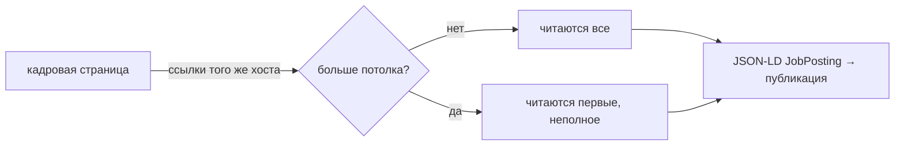
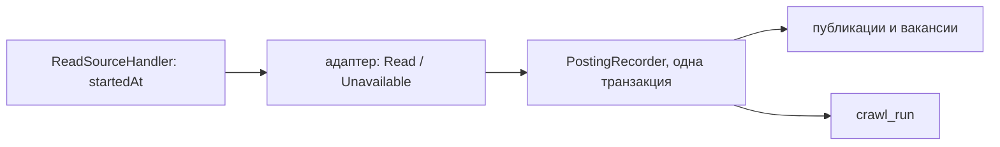
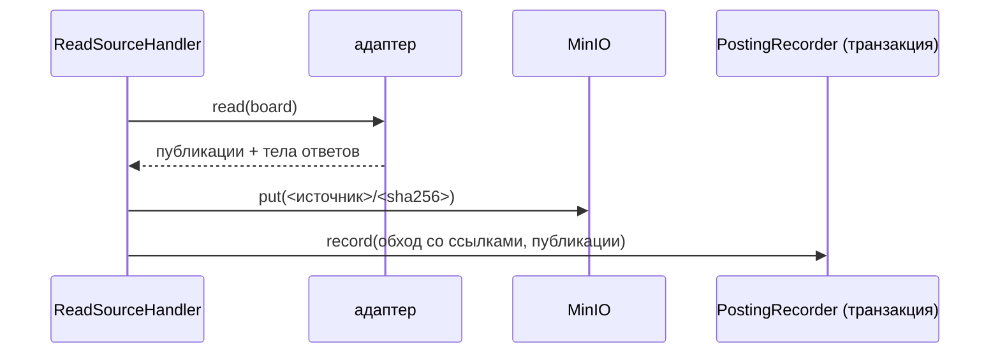
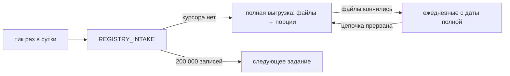
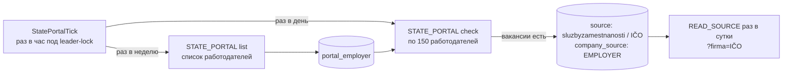
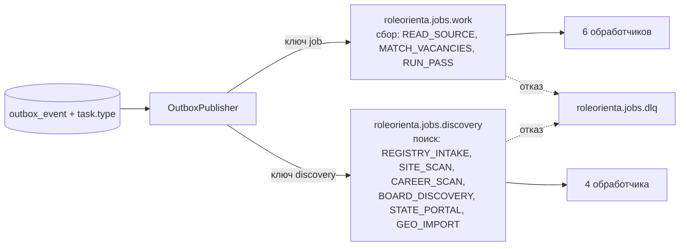
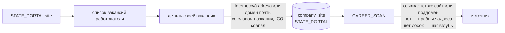

# Стенограмма проекта

Живой документ (рабочий контракт §0.1, §0.4): что и зачем сделано и простое объяснение каждой
неочевидной конструкции со ссылкой на официальную документацию. Записи `§NN` только
дописываются.

## §1 — Каркас нового репозитория (подэтап 1.1)

**Зачем.** Технический документ §15, подэтап 1.1: основа, на которой строится магистраль доставки
заданий. Бизнес-логики нет.

**Что сделано.**
- `pom.xml` — корневой модуль сборки (packaging `pom`): общие версии и правила для модулей
  `job-api` и `job-worker`. Родитель `spring-boot-starter-parent` 4.1.1 задаёт согласованные
  версии зависимостей Spring и плагинов. https://docs.spring.io/spring-boot/maven-plugin/using.html
- `testcontainers-bom` — список согласованных версий библиотек Testcontainers; импортируется в
  `dependencyManagement`, поэтому в модулях версии не пишутся. Spring Boot 4 этими версиями не
  управляет. https://java.testcontainers.org/
- `maven-checkstyle-plugin` на фазе `validate` с `config/checkstyle/checkstyle.xml` — правила
  контракта (≤5 параметров и полей записей, имена ≥2 символов, JavaDoc у публичных типов)
  проверяются каждой сборкой. https://checkstyle.org/checks.html
- `job-api`: `spring-boot-starter-web` (REST), `actuator` (health), `data-jpa`,
  `spring-boot-starter-flyway` + `flyway-database-postgresql` (миграции схемы; в Spring Boot 4
  автоконфигурация Flyway — отдельный стартер), драйвер PostgreSQL. В `application.yml`:
  `ddl-auto: validate` — Hibernate только сверяет сущности со схемой, создаёт её Flyway;
  `open-in-view: false` — соединение с БД не удерживается на всё время HTTP-запроса;
  `problemdetails.enabled` — ошибки в формате RFC 9457.
- `job-worker`: web (только для Actuator), `actuator`, `data-jpa`, `spring-boot-starter-amqp`
  (RabbitMQ), драйвер PostgreSQL; Flyway не подключён — схемой владеет job-api. Настройки
  RabbitMQ: `publisher-confirm-type: correlated` — брокер подтверждает приём каждого сообщения;
  `publisher-returns: true` + `template.mandatory: true` — сообщение без подходящей очереди
  брокер возвращает, а не теряет. https://docs.spring.io/spring-amqp/reference/amqp/template.html
- Тесты `contextLoads` в обоих модулях на реальных контейнерах. `@ServiceConnection` —
  Spring Boot сам берёт адрес и учётные данные из контейнера Testcontainers и настраивает
  подключение. https://docs.spring.io/spring-boot/reference/testing/testcontainers.html
- `docker-compose.yml` — PostgreSQL 16 (:5433), RabbitMQ 4 с консолью (:5672, :15672), MinIO
  (:9000, :9001); `healthcheck` — Docker сам проверяет готовность сервиса.
- `.github/workflows/ci.yml` — GitHub Actions: JDK 21 и `mvn -B -ntp verify` на каждый push в
  `main` и pull request.
- Документы: README и эта стенограмма.

**Тесты.** `JobApiApplicationTests`, `JobWorkerApplicationTests` — контекст поднимается.

**README** — написан для нового проекта (контракт §0.2).

**Не вошло.** Outbox, leader-lock, задания с повторами, HTTP-клиент, ArchUnit, приёмочные тесты —
следующие срезы подэтапа 1.1.

## §2 — Outbox и публикация в RabbitMQ (подэтап 1.1)

**Зачем.** Магистраль доставки заданий (технический документ §6, §9, §16.2): событие пишется в
БД в одной транзакции с изменением данных и гарантированно доходит до RabbitMQ.

**Что сделано.**
- `V1__outbox.sql` (job-api) — таблица `outbox_event`; частичный индекс по неопубликованным.
- `RabbitTopology` — обменник `roleorienta.jobs`, рабочая очередь, dead-letter обменник и DLQ,
  всё durable. Бины `DirectExchange`/`Queue`/`Binding` Spring AMQP сам объявляет в брокере.
  https://docs.spring.io/spring-amqp/reference/amqp/broker-configuration.html
- `OutboxRepository` — SQL к outbox. `FOR UPDATE SKIP LOCKED` блокирует выбранные строки до конца
  транзакции и пропускает занятые другой репликой — каждое событие отправляет один публикатор.
- `OutboxPublisher` — пачка в одной транзакции: захват → отправка с `mandatory` → ожидание
  подтверждений (`waitForConfirmsOrDie`) → отметка `published_at`. Вернувшиеся как
  немаршрутизируемые (`basic.return`, собираются `ReturnsCallback`) не отмечаются, счётчик попыток
  +1. Нет подтверждений — откат, повтор на следующем тике; возможный повторный приход сообщения
  гасит идемпотентный потребитель по `messageId`.
  https://docs.spring.io/spring-amqp/reference/amqp/template.html#template-confirms
- `OutboxPublisherTick` — `@Scheduled` тик (пауза `app.outbox.poll-interval-ms`), выключается
  `app.outbox.tick-enabled=false`; `@ConditionalOnProperty` не создаёт бин при выключении.
- `OutboxProperties` — запись настроек `app.outbox.*` (`@ConfigurationProperties`,
  `@DefaultValue`); регистрируется `@ConfigurationPropertiesScan` в `JobWorkerApplication`;
  там же `@EnableScheduling` — включает `@Scheduled`.
- Тесты worker создают схему теми же миграциями job-api: Flyway подключён к worker только в
  тестах, `spring.flyway.locations=filesystem:../job-api/...` в профиле `test`.

**Тесты.** `OutboxPublisherTests`: событие доставлено в очередь с id в `messageId` и отмечено;
без привязки очереди событие не отмечено, попытка засчитана, после восстановления привязки
доставлено.

**README** — строка статуса.

**Не вошло.** Потребитель заданий, таблица заданий с повторами, leader-lock — следующий срез.

## §3 — Задания с повтором через БД (подэтап 1.1)

**Зачем.** Технический документ §6, §9, §16.3, §16.12: временный отказ повторяется с растущим
интервалом, прогресс переживает перезапуск, ошибка кода не теряется.

**Что сделано.**
- `V2__task.sql` — таблица `task`: тип, ключ идемпотентности (UNIQUE), параметры, состояние
  QUEUED → RUNNING → DONE / WAITING / FAILED, попытки, срок повтора, аренда. `outbox_event.task_id`.
- `TaskService.enqueue` — задание и событие outbox одной транзакцией; повтор с тем же ключом
  ничего не делает (`ON CONFLICT DO NOTHING`).
- `OutboxPublisher` кладёт id задания в заголовок `taskId`; `TaskListener` (`@RabbitListener`)
  передаёт его `TaskExecutor`.
- `TaskExecutor` — захват `UPDATE … WHERE state = 'QUEUED'` (повторная доставка задание не
  захватит — идемпотентность), обработчик вне транзакции, запись результата. Результат —
  `TaskOutcome` (sealed: `Done`, `Retry`, `Failed`; `switch` проверяется компилятором на полноту).
  Исключение обработчика → FAILED и сообщение в DLQ (`default-requeue-rejected: false`).
- `RetryPolicy` — 5 мин × 2 до 6 ч + до 10% случайной надбавки, не меньше срока источника
  (`Retry-After`); 8 попыток — FAILED. Значения — `app.task.*`.
- `TaskRequeueTick` — раз в 10 с под leader-lock снова ставит в очередь WAITING с наступившим
  сроком и RUNNING с истёкшей арендой (процесс упал).
- `PostgresLeaderLock` — `pg_try_advisory_xact_lock`: не ждёт, освобождается с транзакцией;
  реестр ключей — в JavaDoc класса. https://www.postgresql.org/docs/current/functions-admin.html#FUNCTIONS-ADVISORY-LOCKS
- `TaskHandler` — контракт обработчика; бины собираются через `ObjectProvider` (обработчиков
  может не быть). Обработчики типов появятся с функциями (подэтап 1.2).
- В профиле `test` потребитель не стартует сам (`auto-startup: false`); тесты, которым он нужен,
  запускают его через `RabbitListenerEndpointRegistry`.

**Тесты.** `TaskFlowTests`: постановка → outbox → брокер → потребитель → DONE, повторная
постановка не создаёт задание; повторное выполнение не вызывает обработчик; временный отказ →
WAITING → перепостановка по сроку; последняя попытка → FAILED; истёкшая аренда → QUEUED;
исключение → FAILED и DLQ; неизвестный тип → FAILED. `RetryPolicyTests`: удвоение, потолок,
надбавка, `Retry-After`.

**README** — строка статуса.

**Не вошло.** Выделенный HTTP-клиент, безопасный XML, ArchUnit, каркас приёмочных тестов —
следующие срезы подэтапа 1.1.

## §4 — Чистка: outbox только для заданий (подэтап 1.1)

**Зачем.** Убрать код без назначения (контракт §3.10): outbox ставит в очередь только задания,
потребитель читает id задания из заголовка.

**Что сделано.**
- `V3__outbox_task_only.sql` — удалены `event_type` и `payload`, `task_id` обязателен.
- `OutboxEvent` — `(id, taskId)`; сообщение без тела: `messageId` — id события, заголовок
  `taskId`; заголовок `eventType` убран.
- job-api: убрана настройка `spring.mvc.problemdetails` — контроллеров нет, вернётся с API
  (подэтап 1.5).
- Доступ к данным: доменные сущности — Spring Data JPA (технический документ §3); механика
  очереди, захвата и выдачи — `JdbcTemplate` с явным SQL (`SKIP LOCKED`, условный `UPDATE …
  RETURNING`, `ON CONFLICT`), в одной транзакции с JPA.

**Тесты.** `OutboxPublisherTests` — событие ссылается на задание; проверяются `messageId` и
заголовок `taskId`.

**README** — не менялся.

## §5 — Выделенный HTTP-клиент (подэтап 1.1)

**Зачем.** Технический документ §10: все внешние запросы — через один клиент с защитой от SSRF,
таймаутами и потолками; отказы источника разобраны для повторов (бизнес-описание §4.6).

**Что сделано.**
- Зависимость Apache HttpClient 5 (версия — Spring Boot). Встроенный в JDK клиент сам заново
  определяет адрес хоста и не даёт проверить фактический адрес соединения; в Apache HttpClient
  определение адреса подменяется (`SystemDefaultDnsResolver`). Строка §3 технического документа
  исправлена. https://hc.apache.org/httpcomponents-client-5.4.x/
- `AddressPolicy` — запрещённые адреса: loopback, частные сети, link-local (облачный metadata),
  multicast, 0.0.0.0/8, 100.64/10, fc00::/7, IPv4 в записи IPv6.
- `ExternalHttpClient` — только http/https; каждый адрес, в который разрешилось имя, проверяется
  перед соединением, в том числе на редиректах (защита от DNS-rebinding); таймауты, не больше
  `max-redirects` переходов, циклы запрещены, тело — не больше `max-body-bytes`; встроенные
  повторы библиотеки выключены. `BlockedAddressException` наследует `UnknownHostException` —
  так отказ проходит через клиент как ошибка ввода-вывода.
- `HttpResult` (sealed): `Success`; `TemporaryFailure` — таймаут, обрыв, 5xx, 429 с `Retry-After`
  (секунды или дата); `PermanentFailure` — `ACCESS_DENIED` (401/403), `NOT_FOUND` (404/410),
  `BLOCKED`, `TOO_LARGE`, `CLIENT_ERROR`. Обработчики заданий переводят его в `TaskOutcome`.
- Настройки `app.http.*`; `allow-private-addresses: true` — только для локальных заглушек.

**Тесты.** `ExternalHttpClientTests` на встроенном в JDK HTTP-сервере (без новой тестовой
зависимости): успех с кодировкой, POST JSON, 503, 429 с `Retry-After` секундами и датой,
403/404/400, большой ответ, цикл редиректов, таймаут, блокировка 127.0.0.1, localhost,
169.254.169.254 и схемы ftp. `AddressPolicyTests` — внутренние и публичные адреса.

**README** — стек и строка статуса.

**Не вошло.** Бюджет запросов на хост, robots.txt, безопасный XML — вместе с первым чтением
источника и адаптером Personio (подэтап 1.2).

## §6 — Чтение источника Greenhouse (подэтап 1.2)

**Зачем.** Первый рабочий путь ядра «источник → вакансии» (технический документ §5, §6).

**Что сделано.**
- `V4__source_posting_vacancy.sql` — `source` (провайдер + доска), `vacancy` (состояние, позиция,
  ссылка, даты), `job_posting` (уникальна в паре «источник + внешний id»).
- JPA-сущности `Source`, `Vacancy`, `JobPosting` и репозитории Spring Data
  (`JpaRepository`: готовые операции, запрос по имени метода
  `findBySourceIdAndExternalId`). https://docs.spring.io/spring-data/jpa/reference/
- `SourceAdapter` — контракт адаптера провайдера; `SourceReadResult` — `Read` (публикации) или
  `Unavailable` (отказ `HttpResult`).
- `GreenhouseAdapter` — `GET /v1/boards/{board}/jobs?content=true` через `ExternalHttpClient`,
  разбор JSON (Jackson 2, версия — Spring Boot); не-JSON в ответе — временный отказ.
- `PostingRecorder` — новая публикация создаёт вакансию; известная обновляет сведения и
  подтверждает наличие; всё чтение — одна транзакция.
- `ReadSourceHandler` — задание `READ_SOURCE`: адаптер по провайдеру; временный отказ → повтор
  (с `Retry-After`), постоянный → неудача; сохранённые сведения при отказе не меняются.
- `ReadSourcePlanner` + `ReadSourceTick` (leader-lock 1002) — раз в сутки ставят чтение каждого
  источника, ключ `read:<источник>:<дата>`.
- `ClockConfig` — часы бином, чтобы тесты подменяли время.

**Тесты.** `GreenhouseAdapterTests` — разбор, 503, не-JSON. `ReadSourceFlowTests` — первое
чтение создаёт вакансии, повторная постановка в тот же день ничего не добавляет, второе чтение
обновляет ту же вакансию, 503 → задание ждёт повтора, данные прежние.

**README** — не менялся.

**Не вошло.** Полнота обхода, счётчик отсутствия, состояния и закрытие — следующий срез.

## §7 — Закрытие вакансий и состояния (подэтап 1.2)

**Что сделано.**
- `V5__vacancy_closure.sql` — у публикации `confirmed`, `missing_complete_reads`, `closed_at`;
  у вакансии `closed_at`.
- `SourceReadResult.Read(postings, complete)` — адаптер сообщает, прочитан ли список полностью;
  Greenhouse отдаёт доску одним ответом — всегда `true`.
- `PostingRecorder`:
  - полное чтение — новые публикации создают вакансии, известные обновляются и подтверждаются,
    отсутствующие получают +1 к счётчику и закрываются на 3-м полном чтении подряд
    (`app.vacancy.close-after-missing-reads`);
  - неполное чтение — добавляются только новые публикации, сохранённые не меняются;
  - отказ источника — публикации теряют подтверждение, сведения и счётчики прежние.
- `Vacancy.refreshState` (бизнес-описание §4.3): все публикации закрыты — `CLOSED`; хотя бы одна
  подтверждена — `ACTIVE`; иначе — `NEEDS_RECHECK`. Появившаяся снова публикация открывает ту же
  вакансию.
- Публикации затронутых вакансий читаются одним запросом `findByVacancyIdIn` (без N+1).

**Тесты.** `ReadSourceFlowTests` — через задание и БД: закрытие на 3-м отсутствии, отказ →
повторная проверка, повторное появление → та же вакансия актуальна.

**README** — не менялся.

**Не вошло.** Скрытие неподтверждённой 30 дней вакансии — условие запроса выдачи (подэтап 1.5).

## §8 — Адаптер Personio и безопасный XML (подэтап 1.2)

**Что сделано.**
- `SafeXml` — единственный разборщик внешнего XML (технический документ §10): StAX из JDK
  (`newDefaultFactory`), DTD и внешние сущности выключены, потолок вложенности 32. Размер
  ограничен потолком тела ответа HTTP-клиента.
  https://owasp.org/www-community/vulnerabilities/XML_External_Entity_(XXE)_Processing
- `PersonioAdapter` — лента `https://<доска>/xml`, весь список одним ответом (`complete = true`).
  Доска — хост витрины `<компания>.jobs.personio.de` или `.jobs.personio.com`; другой хост не
  читается (отказ `BLOCKED`); поля `id`, `name`, `office`, тексты `jobDescription/value`; ссылка —
  `/job/<id>`. Корень не `workzag-jobs` или испорченный XML — временный отказ.
- `app.adapter.personio.base-url-template` — адрес витрины, `{board}` — хост витрины.

**Тесты.** `SafeXmlTests` — XXE и глубокая вложенность отвергаются. `PersonioAdapterTests` —
разбор ленты, витрина `.com`, чужой хост, HTML вместо ленты, 503.

**README** — не менялся.

## §9 — Адаптер Workday: список страницами (подэтап 1.2)

**Что сделано.**
- `WorkdayAdapter` — `POST https://<тенант>.<dc>.myworkdayjobs.com/wday/cxs/<тенант>/<сайт>/jobs`
  через `ExternalHttpClient.postJson`, страницы `offset/limit` по 20. Доска —
  `<тенант>.<dc>.myworkdayjobs.com/<сайт>`; другой хост — отказ `BLOCKED`.
- Внешний id и ссылка — `externalPath`; место — `locationsText`; `total` берётся с первой
  страницы (на следующих Workday его не отдаёт).
- Полнота: отказ на первой странице — источник недоступен; отказ на следующей, пустая страница
  раньше `total` или упор в потолок `app.adapter.workday.max-pages` — неполное чтение (§7:
  добавляются только новые публикации, ничего не закрывается).

**Тесты.** `WorkdayAdapterTests` — две страницы с `total` только на первой, отказ на второй
странице, отказ на первой, чужой хост.

**README** — не менялся.

**Не вошло.** Текст вакансии (деталь по `externalPath`) — следующий срез; фасеты стран — вместе с
проходом по стране.

## §10 — Текст вакансий Workday (подэтап 1.2)

**Что сделано.**
- `SourceAdapter.content(board, externalId)` — текст публикации отдельным запросом; по умолчанию
  `null` (Greenhouse и Personio отдают текст в списке).
- `WorkdayAdapter.content` — `GET <api>/<externalPath>`, поле `jobPostingInfo.jobDescription`;
  отказ — `null`.
- `ReadSourceHandler` — запрашивает текст только у публикаций без сохранённого текста и не больше
  `app.collect.max-content-requests-per-read` (200) за чтение; остальное — следующими чтениями.
  Задание остаётся ограниченным: Workday отдаёт текст за ~0,5 с (замер: 50 за 26 с), 200 запросов —
  около 2 минут, далеко от аренды задания (10 минут).
- `JobPosting.update` не стирает сохранённый текст, если чтение текста не принесло.
- `JobPostingRepository.findExternalIdsWithContent` — JPQL в `@Query`.
- Уборка: удалены неиспользуемые методы `JobPosting`/`Vacancy` и дублирующий `VacancyStateTests`.

- Журнал: итог чтения (`Source N read: X postings, complete=…`), итог запроса текстов
  (`requested/received`); неудачный запрос текста Workday — WARN с причиной.

**Тесты.** `WorkdayAdapterTests.readsContent`; `ReadSourceHandlerTests` (Mockito) — текст
запрошен только у публикации без сохранённого текста и в пределах потолка.

**README** — не менялся.

## §11 — Аудит §1–§10

**Область.** Весь код и документы: аудитов раньше не было.

**Исправлено.**
- README: статус отставал (подэтап 1.1, «бизнес-логики нет»), нарушение §0.2 контракта.
- `PersonioAdapter`: позиция без названия ломала бы всё чтение (`vacancy.title NOT NULL`) —
  теперь пропускается, как позиция без id.

**Проверено, нарушений нет.** Нет циклов между пакетами; SQL только в репозиториях; транзакции
короткие — внешние запросы вне транзакций; внешние вызовы с таймаутами, повторы ограничены
таблицей заданий; нет секретов в коде; нет N+1 в записи чтения; индексы под запросы (`task`,
`job_posting`); конструкторы ≤ 5 параметров.

**Отмечено, не менялось (минимальное вмешательство).**
- `WorkdayAdapter.read` — длинный метод (страницы, разбор, полнота); выносить при следующей
  правке адаптера.
- `ExternalHttpClient` берёт `Clock.systemUTC()`, а не бин `Clock`.
- `outbox_event.attempts` растёт, но нигде не читается.

**Расхождения с техническим документом (подэтап 1.2).**
1. robots.txt и бюджет на хост (§10) не сделаны, а сбор уже ходит на настоящие источники
   (Workday — до ~220 запросов за чтение). Это первое по важности.
2. `SourceSnapshot` (снимки в S3), `CrawlRun`, `VacancyRevision` — нет.
3. Адаптер schema.org `JobPosting` — нет.
4. Скрытие вакансии без подтверждения 30 дней — условие выдачи (1.5).
5. Правило ArchUnit «XML только через `SafeXml`» — ArchUnit не подключён.

## §12 — Бюджет на хост и User-Agent (подэтап 1.2)

**Что сделано.**
- `V6__host_budget.sql` — `host_budget(host, next_allowed_at)`: время следующего разрешённого
  запроса к хосту, общее для всех реплик (технический документ §16.11).
- `HostBudget` / `PostgresHostBudget` — резервирование места одним оператором
  `INSERT … ON CONFLICT DO UPDATE … RETURNING`: строка хоста блокируется на время оператора, две
  реплики не получат одно место; время — часы БД. Место дальше потолка ожидания не резервируется.
  https://www.postgresql.org/docs/16/sql-insert.html#SQL-ON-CONFLICT
- `ExternalHttpClient`: перед запросом резервирует место и ждёт его; очередь длиннее
  `host-max-wait` — временный отказ без запроса; `Retry-After` сдвигает очередь хоста
  (`backOff`); единый User-Agent. Часы — бин `Clock` (закрыто замечание аудита §11), один
  конструктор.
- `app.http.politeness.*` — User-Agent с контактом, промежуток 1 с, потолок ожидания 30 с.

**Тесты.** `PostgresHostBudgetTests` — очередь с промежутком и потолок, `Retry-After`, 8
одновременных резервирований получают разные места. `ExternalHttpClientTests` — User-Agent, отказ
без запроса при исчерпанном бюджете, `Retry-After` → `backOff`. Адаптерам клиент для заглушек даёт
`TestHttpClients`.

**README** — не менялся.

**Не вошло.** Редирект на другой хост бюджет не резервирует; robots.txt — §13.

## §13 — robots.txt (подэтап 1.2)

**Что сделано.**
- `RobotsRules` — разбор и сопоставление по RFC 9309: группа робота (токен из User-Agent, без
  учёта регистра) важнее `*`; самое длинное совпадение, при равенстве — `allow`; `*` и `$`.
  Сопоставление без регулярных выражений — чужой файл не вызовет экспоненциальный перебор.
  https://www.rfc-editor.org/rfc/rfc9309
- `ExternalHttpClient` сверяет каждый запрос с robots.txt его происхождения; robots.txt читается
  тем же клиентом (SSRF-защита, бюджет хоста) и кэшируется на сутки в памяти реплики. 2xx —
  правила; 4xx — разрешено всё; 5xx/сеть — запрос откладывается (временный отказ), в кэш не
  кладётся. Запрет — `USE_FORBIDDEN` без запроса; задание чтения — неудача.
- Проверено вручную: robots.txt Workday, Greenhouse разрешают наши пути; у Personio robots.txt нет
  (404).

**Тесты.** `RobotsRulesTests` — своя группа против `*`, самое длинное совпадение и ничья, `*` и
`$`, группировка строк `user-agent`. `ExternalHttpClientTests` — запрет без запроса и один
запрос robots.txt на происхождение; robots.txt 503 — запрос откладывается.

**README** — не менялся.

**Не вошло.** Правило `SourcePermission` (основание использования источника) — отдельно от
robots.txt, по техническому документу §10.

## §14 — Адаптер schema.org `JobPosting` (подэтап 1.2)

**Зачем.** Технический документ §5: четвёртый формат первого этапа — разметка вакансий на сайте
компании. JSON-LD — блок `<script type="application/ld+json">` в HTML-странице с описанием
вакансии по словарю schema.org. https://schema.org/JobPosting,
https://developers.google.com/search/docs/appearance/structured-data/job-posting

**Что сделано.**
- Зависимость Jsoup 1.23.2 (разбор HTML: ссылки и блоки JSON-LD; технический документ §3). Spring
  Boot её версией не управляет — версия в корневом `pom.xml` (`jsoup.version`,
  `dependencyManagement`), в `job-worker` — без версии. https://jsoup.org/
- `JobPostingAdapter` (провайдер `jobposting`). Доска — адрес кадровой страницы (`http`/`https`),
  иначе `BLOCKED` без запроса. С кадровой страницы берутся только ссылки `<a href>` на тот же
  хост, без фрагмента (`#…`), без повторов и без неё самой. Каждая ссылка читается; первый блок
  JSON-LD с типом `JobPosting` (корень, элемент массива или `@graph`; `@type` — строка или
  массив) и непустым `title` даёт публикацию. Страница без разметки — не вакансия, пропускается;
  испорченный блок JSON-LD — тоже.
- Поля: внешний id и ссылка — адрес страницы; `title`; `description` — текст;
  `jobLocation.address` — место («город, регион, страна»; адрес-строка как есть; несколько мест
  через «; »).
- Полнота: отказ кадровой страницы — источник недоступен; ссылок больше потолка
  `app.adapter.jobposting.max-pages` (200, технический документ §17) — читаются первые, чтение
  неполное; временный отказ страницы — чтение неполное. Постоянный отказ страницы (404, запрет
  robots.txt, слишком большая) — страница пропускается: повтор не поможет, а неполнота навсегда
  заблокировала бы закрытие вакансий источника.
- Все страницы читаются через `ExternalHttpClient` — SSRF-защита, бюджет хоста и robots.txt
  действуют без доработок.

```mermaid
flowchart LR
  C[кадровая страница] -->|ссылки того же хоста| L{больше потолка?}
  L -->|да| P[читаются первые, неполное]
  L -->|нет| R[читаются все]
  R --> J[JSON-LD JobPosting → публикация]
  P --> J
```

**Тесты.** `JobPostingAdapterTests` на заглушке сайта: отбор ссылок (свой хост, фрагмент, повтор,
сама страница), `@graph` и массив типов, несколько мест, страница без разметки и испорченный
JSON-LD; потолок — неполное чтение; 503 страницы — неполное; 404 страницы — пропуск, чтение
полное; 503 кадровой страницы — недоступен; не-адрес доски — `BLOCKED`.

**README** — статус (формат `JobPosting`) и стек (Jsoup).

**Не вошло.** Причина неполноты «превышен потолок страниц» в показателях источников — пока только
в журнале (показателей ещё нет). Ссылки на другие поддомены сайта не читаются — только хост
кадровой страницы. Отбор ссылок без признаков «страница вакансии»: читаются все ссылки того же
хоста, лишние отсеиваются отсутствием разметки. На странице берётся одна публикация. Объединение
по `url`/`sameAs` с системой найма — §6 технического документа, позже.

## §15 — Обходы `CrawlRun` (подэтап 1.2)

**Зачем.** Технический документ §4: обход — одно чтение списка публикаций источника с конечным
состоянием. Раньше итог чтения (полное, неполное, отказ и почему) оставался только в журнале;
теперь он хранится и станет основой показателей источников. Расхождение 2 аудита §11 (частично).

**Что сделано.**
- `V7__crawl_run.sql` (job-api — владелец схемы): `crawl_run` — источник, задание, начало и конец,
  состояние `COMPLETE`/`PARTIAL`/`FAILED`, причина неполноты, вид и текст отказа, число
  публикаций. Две проверки `CHECK` держат согласованность: причина неполноты есть тогда и только
  тогда, когда `PARTIAL`; вид отказа — когда `FAILED`. Внешний ключ на задание с
  `ON DELETE SET NULL`: удаление задания не стирает историю обходов.
  https://www.postgresql.org/docs/16/ddl-constraints.html
- Пакет `crawl`: сущность `CrawlRun` (фабрики `read` и `failed`, `finish` — время записи),
  `CrawlRunState`, `PartialReason` (`PAGE_LIMIT`, `PAGE_FAILED`, `LIST_ENDED_EARLY`),
  `CrawlRunRepository`.
- `SourceReadResult.Read` вместо признака `complete` несёт причину неполноты (`null` — полное);
  фабрики `Read.full` / `Read.partial`, метод `complete()` сохранён. Адаптеры называют причину:
  Workday — отказ страницы, пустая страница раньше `total`, потолок; `JobPosting` — потолок,
  временный отказ страницы.
- `ReadSourceHandler` засекает начало до чтения (бин `Clock`) и передаёт обход в `PostingRecorder`;
  тот сохраняет его **в той же транзакции**, что и изменения публикаций, — итог чтения и его
  запись не расходятся. Конец обхода — момент записи, включая запросы текста.

```mermaid
flowchart LR
  H[ReadSourceHandler: startedAt] --> A[адаптер: Read / Unavailable]
  A --> R[PostingRecorder, одна транзакция]
  R --> P[публикации и вакансии]
  R --> C[crawl_run]
```

Зависимости пакетов без циклов: `adapter` → `crawl`, `vacancy` → `crawl`; `crawl` зависит только
от `source` и `http`.

**Тесты.** `ReadSourceFlowTests` — полное чтение даёт обход `COMPLETE` с числом публикаций и
заданием; 503 — `FAILED` с видом `TEMPORARY`. Тесты адаптеров проверяют причину неполноты
(Workday — `PAGE_FAILED`; `JobPosting` — `PAGE_LIMIT`, `PAGE_FAILED`).

**README** — не менялся (стек, запуск и статус подэтапа не изменились).

**Не вошло.** Обход не создаётся заранее планировщиком (пишется по итогу чтения); контрольная
точка, наблюдения `CrawlObservation`, область с фильтром страны — позже, когда появится обход
частями или фасеты стран. Даты источника (`lastAttemptAt`, `lastCompleteRunAt` …) выводятся из
`crawl_run` запросом — отдельных колонок нет. Показатели источников — подэтап показателей.

## §16 — История вакансий `VacancyRevision` (подэтап 1.2)

**Зачем.** Технический документ §4, §6: история изменений вакансии с первого обнаружения; пишется
только полным обходом. Расхождение 2 аудита §11 (частично).

**Что сделано.**
- `V8__vacancy_revision.sql`: запись истории — вакансия, публикация-источник, обход, поле
  (`TITLE`, `LOCATION`, `REOPENED`), было → стало. Время изменения не дублируется — это
  `crawl_run.finished_at`.
- `VacancyRevision`, `RevisionField`. `JobPosting.update(fetched, run, now)` сравнивает позицию и
  место с сохранёнными и отмечает повторное появление закрытой публикации, затем обновляет
  сведения. Текст (HTML) ревизий не создаёт — его изменения технические (§4).
- Записи сохраняются вместе с публикацией: `@OneToMany(mappedBy, cascade = PERSIST)` —
  добавленная запись вставляется при сохранении публикации, уже сохранённая история при этом не
  загружается. Отдельный репозиторий не понадобился (у `PostingRecorder` иначе было бы 6
  параметров конструктора — предел 5).
- `PostingRecorder` сохраняет обход **первым**: на него ссылаются записи истории.
- Неполное чтение известных публикаций не меняет — и истории не пишет (было и раньше).

**Тесты.** `ReadSourceFlowTests` — смена позиции даёт `TITLE` «было → стало»; повторное появление
закрытой публикации — `REOPENED`, неизменные сведения записей не дают.

**README** — не менялся.

**Не вошло.** Отдельная запись о первом обнаружении и о закрытии — даты уже в `vacancy`
(`first_seen_at`, `closed_at`). Показ истории пользователю — бизнес-описание §12, решение позже.

## §17 — Снимки ответов `SourceSnapshot` (подэтап 1.2)

**Зачем.** Технический документ §4, §16.10: исходные ответы источников хранятся в S3-хранилище,
чтобы после исправления адаптера или нормализации переразобрать их без нового обращения к
источнику. Закрывает расхождение 2 аудита §11.

**Что сделано.**
- Зависимости: AWS SDK v2 `s3` 2.54.13 (версии — BOM `software.amazon.awssdk:bom` в корневом
  `pom.xml`; асинхронный транспорт Netty исключён — не используется), в тестах
  `org.testcontainers:minio`. https://docs.aws.amazon.com/sdk-for-java/latest/developer-guide/examples-s3.html
- Пакет `snapshot`: `SnapshotProperties` (`app.snapshot.*`, из окружения `S3_*`; секрет не
  выводится в `toString`), `SnapshotConfig` — клиент S3: `endpointOverride` на MinIO,
  `forcePathStyle` (адрес `<хост>/<корзина>/<ключ>`), таймауты вызова и попытки.
  `SnapshotStore.put` — ключ `<источник>/<sha256 тела>`: неизменяемый, одинаковый ответ — один
  объект, хеш проверяет содержимое; корзина создаётся при первой записи. Сбой хранилища не
  прерывает чтение: снимок пропускается с записью в журнал.
- `V9__source_snapshot.sql`: ссылка обхода на объект — ключ, хеш, время сохранения (ставит БД).
- Адаптеры отдают тела успешных ответов списка (`SourceReadResult.Read.responses`).
  `ReadSourceHandler` сначала пишет объекты, затем обход со ссылками сохраняется в транзакции
  записи публикаций (`CrawlRun` → `SourceSnapshot`, `cascade = PERSIST`) — порядок «объект, затем
  ссылка в БД» (§9).
- `CrawlRun` начинается до чтения (`PostingRecorder.startRun`, часы — там же) и получает итог
  (`read` / `fail`); фабрики `read`/`failed` заменены — иначе у `ReadSourceHandler` было бы 6
  параметров конструктора.

```mermaid
sequenceDiagram
  participant H as ReadSourceHandler
  participant A as адаптер
  participant S as MinIO
  participant R as PostingRecorder (транзакция)
  H->>A: read(board)
  A-->>H: публикации + тела ответов
  H->>S: put(<источник>/<sha256>)
  H->>R: record(обход со ссылками, публикации)
```

**Тесты.** `ReadSourceFlowTests` (MinIO в Testcontainers) — после чтения в БД ссылка с ключом
`<источник>/<sha256>`, объект в MinIO содержит ответ. Тесты адаптеров проверяют отданные тела.

**README** — статус и переменные окружения `S3_*`.

**Не вошло.** Срок хранения и очистка сирот (§16.10) — отдельный срез. Версия адаптера в снимке —
версий адаптеров пока нет. Ответы текста публикаций (деталь Workday) не снимаются — только ответы
списка. Повторная обработка снимков — позже.

## §18 — Образ MinIO: архивный Bitnami (временная замена)

**Зачем.** CI упал на §17: `Can't get Docker image: minio/minio:latest`. MinIO в сентябре 2026
убрал свои образы с Docker Hub, затем закрыл и quay.io (401). Локально сборка проходила только
потому, что образ лежал в кэше Docker; на чистой машине не поднимался бы и `docker compose up`.
Код не при чём: клиент S3 (AWS SDK) работает с любым S3-совместимым хранилищем.

**Что сделано.**
- `docker-compose.yml`: `bitnamilegacy/minio:2025.2.28-debian-12-r1` — последние сборки MinIO,
  которые Bitnami (Broadcom) держит в архивном репозитории для amd64 и arm64. Тег закреплён.
  Сервер образ запускает сам (команда не нужна), данные — `/bitnami/minio/data` в новом томе
  `snapshots-data`: образ работает не от root, а старый том `minio-data` принадлежит root.
  Проверка готовности — `curl` на `/minio/health/live`.
- `TestcontainersConfiguration`: тот же образ через `GenericContainer` (обычный контейнер
  Testcontainers: образ, переменные, порт, ожидание готовности по HTTP). Специализированный
  `MinIOContainer` запускает команду официального образа и с образом Bitnami не работает, поэтому
  тестовая зависимость `org.testcontainers:minio` убрана.
  Свойства `app.snapshot.*` берут адрес контейнера через `@Qualifier("minioContainer")`:
  контейнеры PostgreSQL и RabbitMQ — тоже `GenericContainer`, без имени Spring не выберет бин.
  https://java.testcontainers.org/features/creating_container/

**Долг.** Архивный образ обновлений не получает и может исчезнуть. Замена на поддерживаемое
S3-совместимое хранилище записана в `docs/next-step.md` (раздел «Долг», переносится при каждой
перезаписи) и в комментарии `docker-compose.yml`.

**README** — не менялся (порты, переменные и команды те же).

## §19 — Workday: фильтр по стране и проверка пропажи (подэтап 1.2)

**Зачем.** Технический документ §5, §15 (1.2 «проверка пропажи из фильтрованного списка»),
бизнес-описание §4.3. Крупные доски Workday глобальны: без фильтра чтение упирается в потолок
страниц (2000 публикаций), остаётся неполным и никогда не закрывает вакансии. С фильтром читаются
только публикации страны, но пропажа из такого списка ещё не закрытие — публикация могла сменить
страну.

**Что сделано.**
- `V10__source_country.sql`: `source.country` (ISO 3166-1 alpha-2, `NULL` — без фильтра) и
  `crawl_run.country` — область обхода, фиксируется при его начале (технический документ §4).
- `SourceAdapter`: `read(board, country)` и `check(board, externalId)` — методы по умолчанию
  (`default`: реализация в интерфейсе, адаптер переопределяет при необходимости): у провайдеров без
  фильтра страна не влияет, а пропажа из списка — отсутствие. `PostingCheck` — итог проверки:
  `Present` (есть, с новыми сведениями), `Absent` (нет), `Unknown` (проверить не удалось).
- `WorkdayAdapter`: первый ответ без фильтра содержит фасеты (`facets` — группы значений для
  отбора; значение может нести вложенный фасет). Имя параметра страны у тенантов разное — берётся
  фасет с `country` в имени и значение с английским названием страны (`Locale`), дальше список
  читается с `appliedFacets`. Фасета страны нет — чтение без фильтра; страны нет среди значений —
  пустой полный список. `check` — деталь публикации: `jobPostingInfo` есть — `Present`; 404/410 —
  `Absent`; прочее — `Unknown`. Чтение страниц вынесено в `readPages`, запрос детали — в `detail`
  (общий с `content`).
- `ReadSourceHandler`: после полного чтения источника со страной известные незакрытые публикации,
  которых нет в списке, проверяются (`app.collect.max-checks-per-read`, 200): найденные идут в
  запись как прочитанные (сведения обновятся, история запишет смену места), не проверенные —
  не засчитываются отсутствующими (`PostingRecorder.record(..., unverified)` снимает с них
  подтверждение без счётчика отсутствия).

**Тесты.** `WorkdayAdapterTests` — фасет страны во вложенной группе и чтение с фильтром; страны
нет среди значений — пустой полный список; деталь есть / 404. `ReadSourceHandlerTests` — пропавшие
из списка: найденная остаётся с новыми сведениями, отсутствующая засчитывается, за потолком
проверок — не засчитывается.

**README** — не менялся.

**Не вошло.** Работа фасетов и ответ детали снятой публикации (404 или иной) проверены только на
заглушке — сверить на живом тенанте при подключении первых источников (этап 0). Название страны
тенант может писать иначе («Slovak Republic») — тогда список пуст, пропавшие проверяются деталью,
ложных закрытий нет; расхождение видно в журнале. Страна источника задаётся вручную, как и сам
источник (до 1.7).

## §20 — Приёмочные сценарии 6 и 7 (подэтап 1.2)

**Зачем.** Технический документ §14, §15: подэтап закрывается приёмочными сценариями бизнес-описания
§7.4-А, которые с этого момента идут в каждой сборке. Для 1.2 — 6 (закрытие) и 7 (временный отказ и
неполное чтение); 8 (срок без подтверждения) — условие выдачи, вместе с 1.5.

**Что сделано.**
- `acceptance/SourceToVacancyAcceptanceTests` — тестовый сайт с разметкой `JobPosting` и заранее
  известным содержимым (встроенный в JDK HTTP-сервер; кадровая страница ссылается на все
  опубликованные вакансии), сценарий меняет страницы и коды ответов между обходами:
  - 6 — пропавшая из трёх полных чтений вакансия закрыта; записи вакансии и публикации и история
    изменений сохранены; соседняя актуальна;
  - 7, отказ — три отказа кадровой страницы: не закрыта, «нуждается в повторной проверке»,
    сведения и дата подтверждения прежние, отсутствие не засчитано; после восстановления та же
    вакансия актуальна;
  - 7, неполное чтение (граничный случай 1 §14) — страница вакансии отвечает 503: изменения
    известной вакансии не применены, истории нет, дата подтверждения прежняя, новая вакансия
    добавлена; после полного чтения изменения применены, повторов нет.
- **Исправлено по сценарию 7.** Неполное чтение не снимало подтверждение с известных публикаций —
  их вакансии оставались «актуальными». По §4 неполный обход снимает подтверждение ранее известных
  публикаций источника (впервые увиденные подтверждаются и неполным); `PostingRecorder` теперь
  так и делает.

**README** — не менялся.

**Не вошло.** Управляемые часы — не нужны 6 и 7, понадобятся сценарию 8. Явное закрытие в
источнике — поддерживаемые форматы его не дают. Уход закрытой вакансии из накопленного списка —
с выдачей (1.5). WireMock (§14) не подключался: заглушки на встроенном сервере JDK покрывают эти
сценарии без новой зависимости.

## §21 — Доступность источника: «временные отказы» и «недоступен» (подэтап 1.3)

**Зачем.** Технический документ §4 (`Source`: доступность `OK`/`TEMP_FAILING`/`UNAVAILABLE`), §9,
§17 (7 дней); бизнес-описание §4.6: источник, недоступный дольше срока, получает статус
«недоступен» и перепроверяется как исчезнувшая кадровая страница. Первый срез подэтапа 1.3.

**Что сделано.**
- `V11__source_availability.sql`: `source.availability` (по умолчанию `OK`) и `failing_since` —
  начало текущей серии отказов.
- `Source.markRead` / `markFailure` — правило в сущности, проверяется без БД: ответ списка
  (полное или неполное чтение) — `OK`, серия прервана; временный отказ — `TEMP_FAILING` с начала
  серии, `UNAVAILABLE` — когда серия длится не меньше `app.crawl.unavailable-after` (7 дней);
  постоянный отказ (доступ запрещён, страница удалена, запрет robots.txt, чужой адрес) — сразу
  `UNAVAILABLE`.
- `CrawlLog.finish` — итог обхода: сохраняет обход и пересчитывает доступность источника.
  `@Transactional(propagation = MANDATORY)` — выполняется только внутри уже открытой транзакции
  (записи публикаций), отдельно от неё записаться не может. `PostingRecorder` вызывает его вместо
  прямого сохранения обхода; `CrawlRunRepository` из него ушёл (иначе 6 параметров конструктора).
  https://docs.spring.io/spring-framework/reference/data-access/transaction/declarative/tx-propagation.html

**Тесты.** `SourceTests` — серия временных отказов до и после срока, сброс серии ответом,
постоянный отказ. Приёмочный сценарий 7 (отказ) проверяет `TEMP_FAILING` при отказах и `OK` после
восстановления.

**README** — не менялся.

**Не вошло.** Перепроверка кадровой страницы при `UNAVAILABLE` — подэтап 1.7 (обнаружения ещё нет);
до тех пор недоступный источник читается по расписанию как прежде и при ответе снова `OK`. Статусы
в показателях — `CoreMetricDaily` (1.3).

## §22 — Аудит §12–§21

**Область.** Код, изменённый после аудита §11 (срезы §12–§21: HTTP-клиент с бюджетом и
robots.txt, адаптеры, обходы, история, снимки, доступность, запись чтения), и документы.

**Исправлено.**
- **N+1 в записи чтения** (контракт §3.5). `PostingRecorder` обращается к вакансии каждой
  публикации (подтверждение, пересчёт состояния), а публикации грузились без вакансий — отдельный
  запрос на каждую (Workday — до 2000 за чтение). `JobPostingRepository.findBySourceId` и
  `findByVacancyIdIn` получили `@EntityGraph(attributePaths = "vacancy")`: вакансии загружаются тем
  же запросом (JOIN). Аудит §11 это пропустил.
  https://docs.spring.io/spring-data/jpa/reference/jpa/query-methods.html#jpa.entity-graph
- `ReadSourceHandler.handle` — запись снимков вынесена в `storeSnapshots` (метод делал слишком
  много, контракт §3.1).
- **ArchUnit** (технический документ §15, подэтап 1.1; расхождение 5 аудита §11) — с разрешения
  владельца: зависимость `com.tngtech.archunit:archunit` 1.4.2 (только тесты; ядро без движка JUnit —
  у Spring Boot 4 JUnit 6, движок ArchUnit для него только в новых версиях). `ArchitectureTests`:
  фабрики разборщиков XML — только в пакете `xml` (`SafeXml`, защита от XXE); нет циклов между
  пакетами верхнего уровня. https://www.archunit.org/userguide/html/000_Index.html
- README: статус отставал (подэтап 1.2 → закрыт кроме сценария 8, идёт 1.3) — нарушение §0.2.
- Технический документ §3, §6 «Заглушки», §14: заглушки источников — встроенный HTTP-сервер JDK,
  а не WireMock (так сделано с §6; сценарии покрываются без новой зависимости).

**Проверено, нарушений нет.** Циклов между пакетами нет (теперь проверяет тест). SQL только в
репозиториях и `PostgresHostBudget`; внешние запросы (источники, S3) вне транзакций БД; порядок
«объект в S3, затем ссылка в БД»; итог обхода, доступность источника и публикации — одна
транзакция (`CrawlLog`, `MANDATORY`). Таймауты: HTTP-клиент, S3-клиент. Повторы ограничены
(таблица заданий, SDK). Секреты: `SnapshotProperties.toString` без ключей. Конструкторы и записи ≤ 5
параметров. Индексы под новые запросы (`crawl_run`, `vacancy_revision`, `source_snapshot`,
незакрытые публикации — уникальный индекс `(source_id, external_id)`). Checkstyle и JavaDoc
новых классов.

**Отмечено, не менялось (минимальное вмешательство).**
- `WorkdayAdapter.read(board, country)` — около 35 строк (обнаружение фасета и выбор значения);
  выносить при следующей правке адаптера.
- `Source` не хранит даты попыток и успехов и версию адаптера (технический документ §4): даты
  выводятся из `crawl_run`, версий адаптеров нет.
- Недоступный источник читается по расписанию, как прежде — перепроверка кадровой страницы (1.7).

**Расхождения с техническим документом, остающиеся.** Сценарий 8 — с выдачей (1.5); контрольная
точка обхода — у поддерживаемых форматов пагинация нестабильна или список одним ответом, обход
начинается заново (§6 это допускает); срок хранения снимков и очистка сирот (§16.10) — не сделаны.

**README** — статус.

## §23 — Подэтап 1.3 закрыт: перезапуск во время чтения (сценарий 9, сбор)

**Зачем.** Решение владельца: закрыть 1.3 одним срезом только по надёжности и идти к работающему
ядру — сначала автоматический сбор компаний (1.6–1.7), затем отбор и выдача (1.4–1.5).

**Что сделано.**
- Приёмочный сценарий 9 (сбор) в `SourceToVacancyAcceptanceTests`: приложение останавливается во
  время чтения (задание захвачено, аренда истекла) и после записи результата, но до отметки
  задания выполненным. Оба раза задание возвращается в очередь по аренде и выполняется снова;
  вакансия и публикация записаны по одной, повторов нет.
- Проверено без изменений кода: ошибка кода обработчика переводит задание в `FAILED` с причиной, а
  сообщение — в DLQ (`TaskFlowTests`); зависших заданий не остаётся — незавершённое возвращается
  по аренде.
- Технический документ: `FailedOperation` отдельной таблицей не вводится — его роль выполняет
  задание в `FAILED` (тип, параметры, причина, попытки, время), §4, §9, §11. Подэтап 1.3 сужен до
  надёжности; `CoreMetricDaily`, отчёт администратору, эксплуатационная наблюдаемость, резервная
  копия и восстановление перенесены в 1.10, где они нужны для эксплуатационной проверки (§15).
- Срок хранения снимков и очистка сирот — в «Долг» `docs/next-step.md`.

**README** — статус (1.3 закрыт, следующий — 1.6).

**Не вошло.** Сценарий 9 для выдачи — с 1.5; для мест обработки общего сбора — с 1.6.

## §24 — Приём юрлиц Словакии из выгрузок RPO (подэтап 1.6)

**Зачем.** Технический документ §5.1, §15 (1.6): компании страны попадают в систему автоматически
из реестра юрлиц. Этап 0 для RPO проведён в этом срезе по официальной документации
(https://rpo.minv.sk/rpo-api-doc.html), решения владельца:
- **Способ чтения — выгрузки, а не поисковый API.** API требует фильтр и отдаёт не больше 500
  записей — полный перебор ненадёжен. Выгрузки лежат в открытом S3-совместимом хранилище МВД:
  полная (раз в месяц, ~815 МБ gzip в 23 файлах на 5.09.2026) и ежедневные с новыми и изменёнными
  записями; хранятся 45 дней. Полная читается один раз — только она перечисляет все записи без
  потерь (записи, не менявшиеся 45 дней, в ежедневные не попадают); дальше — ежедневные.
- **Какие записи.** Действующие юрлица, включая органы власти и города; предприниматели-физлица —
  нет (у них почти не бывает кадровых страниц, а это основная масса записей).
- **Условия.** Лицензия CC BY 4.0: использовать можно, источник указывается (`company.registry`;
  в интерфейсе — с 1.5).

**Что сделано.**
- `V12__company_intake.sql`: `company` (страна + регистрационный номер уникальны; название, форма,
  населённый пункт, реестр, дата прекращения) и `intake_cursor` (выгрузка, файл, запись, последняя
  ежедневная, версия).
- `RpoExports` — клиент S3 (AWS SDK) без ключей: список файлов полной выгрузки, наличие
  ежедневной, чтение файла потоком с распаковкой gzip. Не `ExternalHttpClient`: это официальный
  набор открытых данных, а не страница сайта, и файлы до ~100 МБ при его потолке 5 МБ.
- `RpoRecordParser` — запись → юрлицо: текущие значения списков с периодами действия (без
  `validTo`), отбор физлиц по коду формы 101–110 или словам «fyzická osoba»/«roľník».
- `RegistryIntakeHandler` (задание `REGISTRY_INTAKE`): файл выгрузки — `{"exportDate": …, "results": [ … ]}`
  (сверено на живых файлах); потоковый парсер Jackson (`JsonParser`) доходит до `results` и читает
  записи по одной, не загружая файл (~100 МБ gzip) в память; порция (1000) и сдвиг курсора — одна
  транзакция (`IntakeRepository.applyBatch`), поэтому после остановки чтение продолжается с места
  без пропусков и повторов. Не больше 200 000 записей за задание (порядка одного файла: продолжение открывает файл заново и
  пропускает прочитанное), дальше — следующее задание.
  Курсор сдвигается условным `UPDATE … WHERE version = ?`: два задания не ведут его одновременно
  (второе завершается без изменений). Ежедневная за сегодня не читается (ещё не полна); цепочка
  ежедневных прервана — переход на более новую полную выгрузку, её нет — ожидание.
- `RegistryIntakeTick` — раз в сутки ставит задание под leader-lock (ключ 1003).
- Настройки `app.intake.*`.

```mermaid
flowchart LR
  T[тик раз в сутки] --> H[REGISTRY_INTAKE]
  H -->|курсора нет| I[полная выгрузка: файлы → порции]
  I -->|файлы кончились| D[ежедневные с даты полной]
  D -->|цепочка прервана| I
  H -->|200 000 записей| N[следующее задание]
```

**Тесты.** `RegistryIntakeTests` (заглушка хранилища, настоящая PostgreSQL; порция 2, задание 3):
отбор записей (s.r.o., город — да; физлицо, без IČO, неизвестное прекращённое — нет), ежедневные
переименование и прекращение, ожидание при прерванной цепочке без новой полной; продолжение с места
курсора.

**README** — статус.

**Не вошло.** Первый прогон на живой выгрузке показал формат файла (обёртка `results`, коды форм
числовые: 101 — физлицо, 112 — s.r.o.); первая версия читала файл как одно значение — исправлено до
коммита. `CollectionCountry` и чередование стран — одна
страна; появятся со второй страной или с пользователями (1.5). Партии компаний на проверку сайта
(`CHECK_COMPANY`) — 1.7. Индекс систем найма (Common Crawl) — отдельным срезом 1.6.

## §25 — Сайты компаний по IČO из Common Crawl (подэтап 1.7)

**Зачем.** Технический документ §5.1, §15 (1.7): у компании из реестра нужно найти сайт и
подтвердить его регистрационным номером. Решение владельца — бесплатные источники; основной —
Common Crawl (открытый архив веба, обновляется раз в месяц; в сентябрьском обходе 2026 года зона
`.sk` — ~8,2 млн страниц, ~112 тыс. доменов). Опора — Торговый кодекс Словакии §3a: предприниматель
указывает на сайте данные о себе, на практике IČO в контактах или подвале.

**Что сделано.**
- `V13__company_site.sql`: `company_site` (компания, хост, страница-доказательство, источник,
  обход; уникально «компания + хост») и `cc_index_block` (блоки индекса обхода к просмотру с
  отметкой `done`).
- `CommonCrawlClient` — JDK `HttpClient` к открытым данным Common Crawl: список обходов
  (`collinfo.json`), оглавление индекса (`cluster.idx`, читается потоком до конца зоны), блок
  индекса и запись архива страницы — запросом части файла (`Range`), без скачивания файлов. Пауза
  перед каждым запросом (`app.site.request-interval`, 200 мс); 429/5xx — `UnavailableException`,
  задание повторится.
- `SiteScanHandler` (задание `SITE_SCAN`): блоки зоны `.sk` по оглавлению (адреса в индексе
  отсортированы в виде SURT — хост задом наперёд, `sk,firma)/kontakt`; берутся блоки, начинающиеся в
  зоне, и предыдущий); по одной странице на хост — контакты/реквизиты, иначе главная; текст страницы
  (Jsoup) → IČO (`IcoExtractor`: восемь цифр после подписи «IČO», пробелы допустимы) → действующая
  компания реестра → сайт. Находки блока и `done` — одна транзакция: скан продолжается с места.
  20 блоков за задание, дальше — следующее. Нечитаемая страница пропускается, недоступность Common
  Crawl — повтор.
- `SiteScanTick` — раз в сутки (leader-lock 1004); новый обход сканируется, просканированный —
  задание сразу завершается.
- Технический документ §5.1 — метод поиска сайта (решение владельца).

**Тесты.** `IcoExtractorTests` — форматы записи IČO, DIČ и IČ DPH не путаются. `SiteScanTests` —
заглушка хранилища Common Crawl с запросами частей файлов: выбор блоков зоны, контакты вместо
главной, неизвестный и прекращённый IČO не дают сайта, повторный скан ничего не добавляет.

**README** — статус.

**Не вошло.** Словацкоязычные сайты вне `.sk` (`.com`, `.eu`), обратный путь (доски систем найма,
`JobPosting`), OSM и Wikidata, угадывание домена — следующими срезами по замеру охвата. Поиск
кадровых страниц на найденных сайтах и подключение источников — следующий срез 1.7. Страница-
доказательство чужой компании (например, «сделано студией X, IČO …») тоже даёт связь — видно по
`evidence_url`, отсев — по замеру.

## §26 — От сайта компании к источнику вакансий (подэтап 1.7)

**Зачем.** Технический документ §5.1: сайт → кадровые страницы → гейт принадлежности → формат →
подключение. Замыкает цепочку «реестр → сайт → источник → вакансии» без ручного ввода.

**Что сделано.**
- `V14__career_scan.sql`: итог проверки сайта (`company_site.checked_at`, `check_result` —
  `SOURCE_FOUND` / `NO_CAREER_PAGE` / `FORMAT_UNSUPPORTED` / `UNREACHABLE`) и `company_source` —
  связь компании с источником, многие-ко-многим (технический документ §4 `CompanyCareerPage`).
- `CareerLinks` — разбор страницы: ссылки на доски Workday (`<тенант>.wdN.myworkdayjobs.com/[язык/]<сайт>`),
  Greenhouse (обе витрины и встраивание), Personio; кадровая страница того же сайта («kariéra»,
  «práca», «jobs», «voľné pozície» … в адресе или тексте ссылки); ссылки вглубь кадровой страницы;
  `JobPosting` в JSON-LD.
- `CareerScanHandler` (задание `CAREER_SCAN`): главная → доски; нет — кадровая страница → доски; нет
  — кадровая страница с `JobPosting` (на ней или на одной из первых трёх страниц вакансий) как
  источник `jobposting`. Найденное подключается (`source`, страна SK — Workday читается с фильтром)
  и связывается с компанией одной транзакцией с итогом проверки. Доска, на которую ссылается
  подтверждённый по IČO сайт, принадлежит компании — гейт принадлежности (бизнес-описание §4.2,
  сценарий 11). Страницы — через `ExternalHttpClient` (robots.txt, бюджет, SSRF). 50 сайтов за
  задание, перепроверка — через 30 дней (§17).
- `CareerScanTick` — раз в сутки (leader-lock 1005). Подключённые источники читает общий сбор.
- `SiteScanHandler`: страница с больше чем тремя разными IČO — каталог чужих организаций, ничего
  не подтверждает (по замеру §25: портал НКО давал ложную связь).

**Тесты.** `CareerLinksTests` — доски трёх систем найма, кадровая страница того же сайта, ссылки
вглубь, `JobPosting`. `CareerScanTests` (тестовый сайт, PostgreSQL) — Workday с главной, `jobposting`
по странице вакансии, причины «нет кадровой страницы» и «формат не поддерживается».

**README** — статус.

**Не вошло.** Агентства (роль «размещающее агентство») и `SourcePermission` — позже в 1.7;
ссылки на доски, вставленные скриптами без адреса в HTML, не видны. Перепроверка источника со
статусом «недоступен» — следующим шагом.

## §27 — Обратный путь: доски систем найма из индекса Common Crawl (подэтапы 1.6–1.7)

**Зачем.** Замер §26: из 181 проверенного сайта (малые фирмы) ни одного источника — малый бизнес
не пользуется Workday / Greenhouse / Personio. Работодатели на этих системах — крупные и
международные; к ним короче от досок: технический документ §5.1, вход «индекс систем найма».
Решения владельца: доска со словацкими вакансиями подключается и без подтверждённой связи с
юрлицом; для сайтов с неподдерживаемым форматом сохраняется адрес кадровой страницы.

**Что сделано.**
- `V15__board_discovery.sql`: `cc_index_block.purpose` (`SITE` / `BOARD`, первичный ключ с ним);
  `discovered_board` (провайдер, доска, обход, проверка, есть ли словацкие вакансии);
  `company_site.career_url`.
- `CommonCrawlClient.blocks(crawl, prefixes)` — блоки индекса по нескольким префиксам SURT за одно
  чтение оглавления (было — одна зона внутри `SiteScanHandler`, логика перенесена и обобщена).
- `CareerLinks.board(url)` — доска из адреса (им же пользуется разбор страниц).
- `BoardDiscoveryHandler` (задание `BOARD_DISCOVERY`): адреса досок из индекса
  (`com,myworkdayjobs,`, `com|de,personio,jobs,`, `io,greenhouse,boards)`, `io,greenhouse,job-boards)`)
  → `discovered_board` (блок и его доски — одна транзакция); затем каждая новая доска читается
  адаптером (Workday — с фильтром Словакии), есть публикация с местом в Словакии
  (`SlovakLocations`: страна или крупные города) — доска подключается как источник (страна SK),
  без `company_source`. Перепроверка через 30 дней; 20 блоков или досок за задание.
- `BoardDiscoveryTick` — раз в сутки (leader-lock 1006).
- `CareerScanHandler` сохраняет адрес кадровой страницы (`career_url`).

**Тесты.** `BoardDiscoveryTests` (заглушки Common Crawl и Greenhouse, PostgreSQL) — доски из адресов
индекса, словацкая подключена без связи с компанией, другая — нет. `CareerScanTests` — `career_url`
у «формат не поддерживается». `SiteScanTests` — без изменений, на обобщённом выборе блоков.

**README** — статус.

**Не вошло.** Привязка найденной доски к юрлицу по IČO на странице самой доски; признак
Словакии по тексту места грубый — точная страна вакансии в отборе (1.4).

## §28 — Отбор по позиции: словарь и предрасчитанное соответствие (подэтап 1.4)

**Зачем.** Бизнес-описание §4.4, технический документ §6, §16.13: соответствие позиции — по
названию и содержанию вакансии, эквивалентные названия учитываются («Backend Engineer — Java»
подходит «Java developer»), другая специализация не включается из-за общего сходства; словарь —
данные с версией, результат предрасчитан с объяснением.

**Что сделано.**
- `positions.json` (ресурс job-worker) — словарь позиций, версия `2026-09-29.1`: 14 позиций (Java,
  .NET, Python, frontend, QA, DevOps, аналитик данных, инженер данных, проектный менеджер,
  бизнес-аналитик, бухгалтер, продажи, HR, поддержка); у позиции — эквивалентные названия
  (словацкие и английские), роли, признаки специализации, исключающие слова.
- `PositionDictionary` — загрузка словаря; нормализация (нижний регистр, без диакритики, тире и
  разделители — пробелы); термины с границами слов, к которым относятся `+` и `#` (C++, C#, .NET).
- `PositionMatcher` — по порядку: исключающее слово в названии — нет; эквивалентное название — да;
  роль и признак в названии — да; роль в названии и признак в тексте не меньше трёх раз — да.
  Объяснение сохраняется («title: engineer + java»).
- `V16__position_match.sql`: `position`, `vacancy_position_match` (версия словаря, объяснение),
  `vacancy.match_version` (`NULL` — сопоставить).
- `MatchVacanciesHandler` (задание `MATCH_VACANCIES`) — незакрытые вакансии, не сопоставленные по
  текущей версии: соответствия заменяются вместе с версией одной транзакцией, версия пишется,
  только если вакансия не изменилась с чтения. 500 за задание. `MatchVacanciesTick` — раз в час
  (leader-lock 1007). `JobPosting.update` сбрасывает версию вакансии, если изменились название или
  текст.
- `spring.rabbitmq.listener.simple.concurrency: 4`, `prefetch: 1` — четыре обработчика заданий
  (технический документ §9: параллелизм согласован): долгие цепочки не задерживают чтение
  источников. Задание захватывается атомарно, вежливость держит бюджет хостов в БД.
- Технический документ §6: предрасчёт в приложении вместо полнотекстового индекса PostgreSQL.

**Тесты.** `PositionMatcherTests` — роль + признак, JavaScript ≠ Java, C#/.NET, диакритика,
исключение, признак в тексте только при роли в названии. `MatchVacanciesTests` — позиции и
соответствия в БД, текст Greenhouse с закодированной разметкой, закрытая не сопоставляется,
повтор ничего не меняет, изменённая — заново.

**README** — статус.

**Не вошло.** Страна и формат работы (GeoNames, регионы удалёнки, три значения оценки) — следующий
срез 1.4; размеченный корпус для точности и полноты — вместе со сценарием 10.

## §29 — Отбор: страна и формат работы, сценарий 10 (подэтап 1.4)

**Зачем.** Бизнес-описание §4.4, технический документ §6, §16.13: страна работы и формат —
отдельные признаки отбора с тремя значениями оценки (подходит / не подходит / неясно); места
публикации сводятся к странам по справочнику, территории удалённой работы — по данным с версией.
Живая выборка §28: большинство вакансий не словацкие; «Ruby» подходил Python по тексту,
«Product Management | Customer Support» — поддержке.

**Что сделано.**
- `V17__country_format.sql`: `geo_city` (название, страна, население); у вакансии
  `work_countries`, `country_uncertain`, `work_format` (`OFFICE`, `HYBRID`, `REMOTE`, `CONFLICT`).
- `GeoImportHandler` (задание `GEO_IMPORT`) — `cities15000` GeoNames: название и ASCII-название,
  для Словакии и альтернативные; нормализация как у словаря; при совпадении — большее население.
  `GeoImportTick` (leader-lock 1008) ставит загрузку, пока таблица пуста.
- `regions.json`, версия `2026-09-29.1` — территории удалённой работы (EU, EEA, EMEA, CEE, DACH,
  Nordics, Benelux) → страны; worldwide / anywhere / global — любая страна. `RemoteRegions`.
- `LocationResolver` — места вакансии → страны (название страны на английском, немецком,
  словацком, синонимы; регион; город) и формат по словам «remote», «hybrid», «office»/«on-site» в
  месте, названии и тексте; гибрид важнее, удалённо и офис вместе — `CONFLICT`. Не распознанное
  место — страна неясна.
- `Fit` — правила оценки: страна (любая или пересечение — подходит; неясно или пусто — неясно;
  иначе — не подходит), формат (не задан — подходит; не указан или конфликт — неясно).
- `MatchVacanciesHandler` пишет страны и формат вместе с позициями; версия сопоставления —
  словарь / регионы / число городов, поэтому загрузка GeoNames пересчитывает все вакансии.
  `JobPosting.update` сбрасывает версию и при смене места.
- Словарь `2026-09-29.2`: другие специализации (Ruby, PHP, Go, iOS и др.) в названии отключают
  соответствие по тексту; исключения для DevOps («data») и поддержки («product management»),
  «data platform engineer» — инженер данных.

**Тесты.** `MatchVacanciesTests` — страна и формат в БД. `SelectionScenarioTests` — приёмочный
сценарий 10: размеченный корпус `selection-corpus.json` (20 случаев, поиск в Словакии): позиция,
страна и формат совпадают с разметкой, все расхождения выводятся списком.

**README** — статус.

**Не вошло.** Применение оценок к поиску пользователя — выдача (1.5).

## §30 — Места Workday в оценке страны и формата (подэтап 1.4)

**Зачем.** Живая проверка §29: из 594 вакансий у 230 страна «неясно», почти все — Workday; у них же
ложный формат `OFFICE`. Причины: места Workday записаны как `IND.Pune`; у публикации в нескольких
местах список отдаёт сводку «2 Locations», сами места есть только в детали; шаблонная фраза текста
«in the office or in the field» считалась офисом.

**Что сделано.**
- `LocationResolver`: сегмент места, начинающийся с трёх заглавных букв и точки (`IND.Pune`,
  `USA.VA.Reston`), — страна по коду ISO 3166-1 alpha-3 (трёхбуквенный код страны; соответствие
  двухбуквенному — `Locale.getISO3Country`,
  https://docs.oracle.com/en/java/javase/21/docs/api/java.base/java/util/Locale.html#getISO3Country()).
- Формат: гибрид и удалённо — по названию, местам и тексту; офис — только по названию и местам.
  Офис в тексте учитывается лишь рядом с удалённой работой — даёт противоречие (`CONFLICT`,
  оценка «неясно»): иначе случай корпуса «On-site role, work from home occasionally» стал бы
  «удалённо» и исключался бы при поиске офиса. Это уточнение правила из `next-step.md`.
- `SourceAdapter.content` → `detail`: деталь возвращает публикацию (`FetchedPosting`) с местом и
  текстом. `WorkdayAdapter.detail` и `check` собирают места из `jobPostingInfo.location` и
  `additionalLocations` через «; » (по «;» `LocationResolver` делит места). Сводка «N Locations» в
  списке Workday — место не получено (`null`).
- `ReadSourceHandler.withDetail`: место детали заменяет место списка.
- `FetchedPosting.location == null` теперь значит «не получено», как у текста: `JobPosting` хранит
  прежнее место, в историю и в пересопоставление это не попадает. Иначе каждое чтение списка
  затирало бы места детали сводкой. Следствие для всех провайдеров: место, пропавшее у источника,
  не стирается (решение владельца).
- Технический документ §5 (таблица провайдеров): деталь Workday — текст и места.

**Тесты.** Корпус сценария 10 (+5): `SVK.Bratislava`, `IND.Pune`, `USA.VA.Reston`; «in the office or
in the field» в тексте — формат не указан; «(On-site)» в названии — офис. `WorkdayAdapterTests` —
деталь с `additionalLocations`, сводка «2 Locations» в списке — `null`. `ReadSourceHandlerTests` —
место детали заменяет место списка.

**README** — не меняется: внутренняя правка отбора и адаптера, сводка остаётся верной.

**Не вошло.** Смена логики `LocationResolver` не меняет версию сопоставления (словарь / регионы /
число городов) — уже сопоставленные вакансии стенда пересчитываются сбросом `match_version` вручную;
сохранённые публикации Workday со сводкой получают деталь после сброса их текста (очистка стенда —
владелец). Отдельного `LocationResolverTests` нет: случаи — в корпусе сценария 10.

## §31 — Проходы и выдача порциями (подэтап 1.5, срез 1 из 4)

**Зачем.** Бизнес-описание §4.5, технический документ §7, §16.15: главная функция продукта —
подходящие вакансии попадают в накопленный список пользователя порциями, без пропусков и повторов.
Нарезка 1.5 (решение владельца): §31 проходы и выдача → §32 учётные записи и условия → §33 аудит →
§34 список, сведения, отметки → §35 SPA. Этот срез — без API: пользователи и условия в тестах
задаются данными.

**Что сделано.**
- `V18__delivery.sql` (job-api):
  - `user_account` — email и хеш пароля (вход — §32);
  - `search_condition` — версия условий: страны `TEXT[]`, позиция, формат (`NULL` — не задан),
    лимит, `active`. Одна активная версия на пользователя — частичный уникальный индекс
    (`UNIQUE … WHERE active`: уникальность проверяется только среди строк, где условие истинно,
    https://www.postgresql.org/docs/16/indexes-partial.html). Лимит меняется в той же версии,
    смена стран, позиции или формата — новая версия (§32);
  - `pass_run` — проход, окно (начало часа) уникально;
  - `delivered_vacancy` — накопленный список и место остановки: первичный ключ «версия условий +
    вакансия» — вакансия выдаётся по версии один раз; `pass_run_id` — какой порцией;
  - `unsuitable_mark` — «не подходит»: пользователь + вакансия (ставится в §34, учитывается уже здесь).
- Пакет `delivery` (job-worker):
  - `PassTick` — раз в час под leader-lock 1009 планирует проход окна;
  - `PassPlanner` — одной транзакцией проход окна и задание `RUN_PASS` на каждую активную версию
    условий; ключ «проход + версия» — повторное планирование ничего не добавляет;
  - `RunPassHandler` → `DeliveryRepository.deliverPortion` — одной транзакцией: строка условий
    блокируется (`SELECT … FOR UPDATE` — другие транзакции, меняющие эту строку, ждут конца
    текущей, https://www.postgresql.org/docs/16/sql-select.html#SQL-FOR-UPDATE-SHARE); версия не
    активна или порция этого прохода уже выдана — ничего; иначе одна вставка
    `INSERT … SELECT … LIMIT … ON CONFLICT DO NOTHING` (строка, нарушающая уникальность, молча
    пропускается, https://www.postgresql.org/docs/16/sql-insert.html#SQL-ON-CONFLICT) — запрос
    технического документа §7;
  - отбор в запросе — правила `Fit`: позиция совпала; не закрыта; подтверждена не раньше срока без
    подтверждения (`app.delivery.hide-after`, 30 дней); страна исключается, только если у вакансии
    есть страны, ни одна не входит в условия (`&&` — пересечение массивов,
    https://www.postgresql.org/docs/16/functions-array.html), нет «*» и нет места с неясной страной;
    формат исключается, только если задан, указан у вакансии без противоречия и отличается; нет
    отметки «не подходит»; ещё не выдана. Порядок — дата первого обнаружения, затем id; не больше
    лимита.
- Время в JDBC-параметрах — `OffsetDateTime` в UTC: тип, который драйвер PostgreSQL сопоставляет
  `TIMESTAMPTZ` (https://jdbc.postgresql.org/documentation/query/#using-java-8-date-and-time-classes).

```mermaid
sequenceDiagram
    participant Tick as PassTick (раз в час)
    participant Plan as PassPlanner
    participant Q as task + outbox
    participant H as RunPassHandler
    participant DB as PostgreSQL
    Tick->>Plan: окно (начало часа), leader-lock 1009
    Plan->>DB: pass_run окна (уникально)
    Plan->>Q: RUN_PASS на каждую активную версию условий
    Q->>H: задание
    H->>DB: FOR UPDATE условий; порция прохода уже есть? — нет
    H->>DB: INSERT delivered_vacancy … LIMIT лимит
```

**Тесты.** `DeliveryAcceptanceTests`: сценарий 1 (45 вакансий, лимит 20 — 20, 20, 5, 0; граница
порции внутри вакансий одной компании; 45 разных), 2 (новые между проходами — в следующую порцию),
8 (не подтверждённая 31 день не выдаётся; подтверждённая снова — выдаётся; выданная и вернувшаяся —
не выдаётся повторно), 9 для выдачи (повтор задания и повторное планирование окна порцию не
удваивают; неактивная версия порций не получает), отбор в порции (исключают только явные
несоответствия, закрытие, отметка, отсутствие позиции). Тест удаляет свои строки и после себя:
остальные тесты чистят таблицы вакансий без таблиц выдачи.

**README** — статус: начат подэтап 1.5.

**Не вошло.** API, вход, условия от пользователя (§32); список и видимость в нём, сведения,
отметки (§34); SPA (§35). Состояние прохода в `pass_run` (технический документ §4) — не
используется ничем; добавится, когда понадобится. В долг (решение владельца): экран показателей
(1.10), ручное добавление (1.9), причина пустоты «обработано X из Y» (1.6), `ETag`/`If-None-Match`
и OpenAPI. Срок без подтверждения понадобится и job-api для видимости списка (§34) — та же
настройка в обоих приложениях.

## §32 — Учётные записи, вход и условия поиска (подэтап 1.5, срез 2 из 4)

**Зачем.** Бизнес-описание §3, §6, §7.2; технический документ §8, §10, §16.17: пользователь
работает под своей учётной записью и задаёт условия поиска; выдача §31 идёт по активной версии
условий.

**Что сделано (job-api).**
- Зависимости: `spring-boot-starter-security` (цепочка фильтров, пароли, CSRF),
  `spring-boot-starter-session-jdbc` (HTTP-сессии в PostgreSQL), `spring-boot-starter-validation`
  (проверка полей аннотациями Jakarta Validation).
- `V19__spring_session.sql` — таблицы `spring_session`, `spring_session_attributes`: официальная
  схема Spring Session для PostgreSQL; `spring.session.jdbc.initialize-schema: never` — схему
  создаёт Flyway. Сессия — 30 минут без запросов. https://docs.spring.io/spring-boot/reference/web/spring-session.html
- `SecurityConfig` — один бин `SecurityFilterChain` (правила для каждого запроса,
  https://docs.spring.io/spring-security/reference/servlet/architecture.html):
  - без входа — регистрация, вход, страны, позиции, health; остальное — `401` problem+json;
  - `csrf.spa()` — токен в cookie `XSRF-TOKEN`, SPA возвращает его заголовком `X-XSRF-TOKEN` в
    изменяющих запросах, иначе `403`. Spring Security создаёт токен лениво, поэтому
    `CsrfCookieFilter` запрашивает его на каждом запросе — cookie есть у SPA до первого `POST`
    (https://docs.spring.io/spring-security/reference/servlet/exploits/csrf.html);
  - пароли — `DelegatingPasswordEncoder`, BCrypt с префиксом `{bcrypt}`
    (https://docs.spring.io/spring-security/reference/features/authentication/password-storage.html);
  - вход проверяет `AuthenticationManager` (`DaoAuthenticationProvider` + пользователь по email);
    выход — `POST /api/v1/auth/logout`, `204`.
- Cookie сессии (`server.servlet.session.cookie.*`): `HttpOnly`, `SameSite=Lax`, `Secure` —
  `SESSION_COOKIE_SECURE` (при развёртывании за HTTPS — `true`).
- `account`: `UserAccount` (JPA; email в нижнем регистре), `AccountService` (регистрация, `409` при
  занятом email, в том числе при одновременной), `AccountController`:
  `POST /api/v1/auth/register` (`201`), `POST /api/v1/auth/login` (вход в HTTP-сессию, id сессии
  меняется — защита от подмены сессии), `GET /api/v1/me`.
- `condition`: `SearchCondition` (JPA; `countries TEXT[]` ↔ `List<String>` через
  `@JdbcTypeCode(SqlTypes.ARRAY)`,
  https://docs.jboss.org/hibernate/orm/7.0/userguide/html_single/Hibernate_User_Guide.html#basic-mapping-array),
  `ConditionService`, `ConditionController`: `GET/PUT /api/v1/me/search-condition`,
  `GET /api/v1/countries` (`app.countries`: SK), `GET /api/v1/positions?query=`.
  - `PUT` — одной транзакцией под блокировкой активной версии (`@Lock(PESSIMISTIC_WRITE)` — на
    PostgreSQL `FOR NO KEY UPDATE`, несовместима с `FOR UPDATE` прохода §31): условий нет — первая
    версия без `If-Match`; есть — `If-Match` обязателен (`428` без него, `412` — версия не та);
    страны, позиция или формат изменились — прежняя версия гасится (сброс в БД до вставки: частичный
    уникальный индекс «одна активная»), новая — с пустым списком; только лимит — та же версия.
  - `ETag` версии — `"id.лимит"`: меняется при любом изменении условий.
  - Проверка: страны — из поддерживаемых, позиция — из словаря, формат `OFFICE`/`HYBRID`/`REMOTE`
    или пусто, лимит 1–100 (по умолчанию 20, `app.default-portion-limit`); email и пароль от 8
    символов (значения предложены ассистентом, владелец согласился).
- `web.ApiExceptionHandler` — ошибки problem+json (RFC 9457); ошибки полей — расширение `errors`:
  `{"pointer": "/поле", "detail": …}` (JSON Pointer).
- Технический документ §8: `If-Match` не указан → `428`.

```mermaid
sequenceDiagram
    participant SPA
    participant API as job-api
    participant DB as PostgreSQL
    SPA->>API: GET /api/v1/countries
    API-->>SPA: Set-Cookie XSRF-TOKEN
    SPA->>API: POST /auth/login + X-XSRF-TOKEN
    API->>DB: сессия (spring_session)
    API-->>SPA: Set-Cookie SESSION (HttpOnly)
    SPA->>API: PUT /me/search-condition + If-Match
    API->>DB: FOR NO KEY UPDATE активной версии; новая версия или лимит
    API-->>SPA: ETag новой версии
```

**Тесты.** `AccountConditionAcceptanceTests` — настоящий HTTP на случайном порту, cookie и CSRF как
у SPA: регистрация, повтор email `409`, неверный пароль `401`, вход, `me`, сессия в
`spring_session`, выход; без CSRF-токена `403`; ошибки полей с указателями; сценарий 3 (смена
позиции — новая версия с пустым списком, отметка сохранена; только лимит — та же версия и список;
`428`, `412`; неподдерживаемая страна и неизвестная позиция — `400`); сценарий 14 для условий (без
входа `401`, условия другого пользователя не видны и не меняются).

**README** — статус; переменная `SESSION_COOKIE_SECURE`.

**Не вошло.** Список, сведения, отметки (§34); SPA (§35); роль `ADMIN` — с административными
экранами; страны сбора из условий пользователей (`CollectionCountry`, 1.6); долг §31 п. 3.
Счётчик срезов — 10: следующий срез — аудит (§33).

## §33 — Аудит §23–§32 (рабочий контракт §0.6, §3, §5)

**Зачем.** Десять срезов с аудита §22: код, изменённый с коммита `f26689e` до `995701e`
(`intake`, `site`, `career`, `geo`, `match`, `delivery`, сбор и Workday, `job-api`), проверен по
§3 контракта; документы — на соответствие коду. Новой функциональности нет.

**Исправлено.**
- **Гонка сопоставления (§3.5, запись).** Изменение вакансии ставило `match_version = NULL`, а
  сопоставление записывало результат при условии «отметка не изменилась с чтения». Два изменения
  подряд (NULL → NULL) неотличимы: результат по старому тексту записывался и больше не
  пересчитывался. `Vacancy.resetMatch` пишет новую случайную отметку `reset:<32 hex>` (помещается в
  `VARCHAR(40)`); отбор к сопоставлению — «версия отличается от текущей», поэтому отметка так же
  ставит вакансию в очередь. `NULL` по-прежнему значит «не сопоставлялась» (новые вакансии,
  ручной сброс на стенде). Тест `MatchVacanciesTests.matchOfChangedVacancyIsNotSaved`.
- **Таймаут на тело ответа (§3.4).** У JDK `HttpClient` таймаут запроса действует только до
  заголовков ответа; зависшее тело держало бы обработчик заданий бесконечно (у воркера их четыре).
  `CommonCrawlClient`: список обходов, блок индекса и страница читаются целиком через
  `sendAsync(…).get(timeout)` — общий срок на запрос и тело, по истечении запрос отменяется и
  задание повторяется позже. Оглавление индекса (раз в месяц, сотни мегабайт) читается потоком, как
  раньше. `GeoImportHandler` — так же (файл ~3 МБ).
  https://docs.oracle.com/en/java/javase/21/docs/api/java.net.http/java/net/http/HttpRequest.Builder.html#timeout(java.time.Duration)
- **N+1 (§3.5).** `SiteScanHandler` искал компании по номерам отдельным запросом на каждую
  страницу блока — теперь один запрос на блок.

**Проверено, нарушений нет.** Курсор приёма RPO (порция и сдвиг курсора одной транзакцией,
условный сдвиг по версии); идемпотентность заданий (ключи, `ON CONFLICT`); ограниченные повторы
(задания до 8 попыток); leader-lock тиков; выдача (блокировка условий, повтор прохода,
запрос §7 = правила `Fit`); вход и CSRF, пароли, доступ только к своим условиям; параметры SQL —
только через привязку; внешние запросы к сайтам — через `ExternalHttpClient` (SSRF, robots.txt,
бюджет хоста).

**Замечания без правки (решение за владельцем, не нарушения §3).**
- Доска из индекса Common Crawl, которую не удалось прочитать (временный отказ), отмечается
  проверенной и перепроверяется через 30 дней — как и сайт «недоступен» (§26, §27).
- Hibernate обновляет строку вакансии целиком: отметка сопоставления, прочитанная чтением
  источника, может перезаписать записанную сопоставлением — вакансия сопоставится ещё раз (лишняя
  работа, не ошибка).

**Документы.** Технический документ, README и заметки соответствуют коду; комментарий миграции
V16 («NULL — сопоставить») не меняется — применённые миграции не правятся; уточнение — здесь.

**README** — не меняется.

## §34 — Обратный путь: проверка всех найденных досок Workday (подэтап 1.7)

**Зачем.** Разведка охвата (решение владельца, 2026-09-30): на стенде из 1672 открытых вакансий
только 31 — в Словакии; ни одной от работодателей, публикующих словацкие вакансии на Workday (Dell,
Accenture, Cisco, Mondelez, PwC, Maersk, Otis, IQVIA, Clarios, SC Johnson), хотя формат
поддерживается. Запрос на стенде: индекс Common Crawl обойдён (60 блоков), найдено 5498 досок
Workday — **ни одна не проверена**: проверка шла по алфавиту провайдеров (сначала все Greenhouse,
каждая — полным чтением), до Workday очередь не дошла; среди досок — мусор разбора адресов
(`…/robots`, `…/es`). Понятие «крупный работодатель» не вводится (решение владельца): проверяются
все доски, для любой страны сбора механизм тот же.

**Что сделано.**
- `SourceAdapter.hasPostingsIn(board, country)` — есть ли у доски публикации в стране одним
  запросом, если провайдер умеет; по умолчанию — нет ответа. `WorkdayAdapter` — по фасету страны
  первого ответа (тот же разбор, что у чтения с фильтром); фасета нет или ответа нет — нет ответа.
  Название страны в фасете — английское или официальное («Slovak Republic», «Czech Republic»).
- `BoardDiscoveryHandler`: провайдер ответил — ответ и есть итог проверки (фильтр Workday по стране
  уже гарантирует страну, текст места не нужен: у публикаций в нескольких городах его в списке нет,
  §30); не ответил — доска читается и нужна публикация с местом в Словакии, как раньше.
- `BoardDiscoveryRepository.boardsToCheck` — провайдеры чередуются (`row_number() OVER (PARTITION BY
  provider …)` в порядке выборки: первая доска каждого провайдера, вторая каждого…).
- `CareerLinks`: сайт Workday — целый сегмент пути (не `robots.txt`), не код языка, не `wday`;
  язык перед сайтом — `es/` или `en-US/`. Записанный раньше мусор (`CareerLinks.isBoard`) отмечается
  проверенным без запроса.
- Проверка досок не зависит от Common Crawl: на стенде задание вставало на повторах из-за отказа
  `index.commoncrawl.org` при запросе списка обходов (`HTTP/1.1 header parser received …`), хотя
  все блоки индекса уже прочитаны. Индекс не отвечает — берётся последний обход, чьи блоки записаны
  (`BoardDiscoveryRepository.lastCrawl`), и проверка идёт; повтор — только если нужно читать блоки.
  Так же скан сайтов .sk (`SiteScanHandler`, `SiteScanRepository.lastCrawl`): список обходов с
  `index.commoncrawl.org` не нужен для чтения блоков и страниц с `data.commoncrawl.org`.

**Тесты.** `WorkdayAdapterTests.answersWhetherBoardHasPostingsInCountryByFacet` (есть / нет /
«Slovak Republic» / нет фасета), `CareerLinksTests.skipsWorkdayAddressesThatAreNotBoards`,
`BoardDiscoveryTests.checksProvidersInTurn`.

**Разведка для следующих срезов (сырой HTML со стенда, `target/*.html`).**
- SmartRecruiters: `api.smartrecruiters.com` запрещён robots.txt — не используется;
  `careers.smartrecruiters.com/<компания>` (список: ссылки на `jobs.smartrecruiters.com/…`,
  «Show more jobs» с параметром `page`) и страницы вакансий robots.txt не запрещает; на странице
  вакансии — микроразметка schema.org `JobPosting` (`itemprop`: title, description,
  addressLocality, addressCountry…). Deutsche Telekom IT Solutions Slovakia — 110 вакансий.
- SAP SuccessFactors (Swiss Re, 62 вакансии в Братиславе): `sitemap.xml` перечисляет все вакансии,
  `/services/` запрещён robots.txt; на странице вакансии — микроразметка `JobPosting`. Сайты таких
  работодателей не находятся ни сайтом по IČO на .sk (филиалы, домен .com), ни индексом досок —
  вход нужно решить.

**README** — не меняется.

**Не вошло.** Страна проверки — по-прежнему SK (страны сбора из условий пользователей — 1.6).
Временный отказ при проверке доски по-прежнему откладывает её на 30 дней (§33, замечание).

## §35 — Адаптер SmartRecruiters (подэтап 1.7)

**Зачем.** Разведка охвата (§34): Deutsche Telekom IT Solutions Slovakia — 110 вакансий в Košice,
Devoteam, Wolt, NielsenIQ и другие публикуют словацкие вакансии на SmartRecruiters. Решение
владельца: подключить через страницы, открытые соискателю, с текстом вакансий (вариант 2):
`api.smartrecruiters.com` запрещён robots.txt, на страницах вакансий — `noindex,nofollow`.

**Что сделано.**
- `SmartRecruitersAdapter` (провайдер `smartrecruiters`, доска — компания в адресе, нижний регистр):
  - список — `careers.smartrecruiters.com/<компания>?search=&page=N`, пока страница приносит новые
    вакансии (потолок `max-pages`, 50); место — заголовок группы («Košice, Slovakia (Slovak
    Republic)»), id — число в ссылке, ссылка на вакансию — `jobs.smartrecruiters.com/<компания>/<id>`;
    отказ на первой странице — источник недоступен, дальше или упор в потолок — неполное чтение;
  - фильтр страны — только вакансии, в месте которых есть название страны: текст нужен только
    вакансий страны сбора;
  - текст — `detail`: страница вакансии, микроразметка schema.org `JobPosting` (атрибуты `itemprop`
    внутри HTML, https://schema.org/JobPosting): `description`, место — `addressLocality` +
    `addressCountry`. Читается один раз на вакансию (§30, `ReadSourceHandler.withDetail`).
- `CountryNames` (пакет `adapter`) — краткое английское и официальное название страны; им пользуются
  Workday (фасет) и SmartRecruiters (заголовок группы).
- Поиск досок: `CareerLinks` распознаёт `careers|jobs.smartrecruiters.com/<компания>` (на сайтах
  компаний и в индексе); обратный путь — проходами индекса: у SmartRecruiters свой проход и свои
  блоки (`purpose = BOARD_SR`), поэтому уже пройденный обход Common Crawl просматривается по новым
  префиксам сразу, без ожидания следующего обхода.
- Технический документ: §5 — формат SmartRecruiters; §10 — основание использования и условия
  (решение владельца).

**Тесты.** `SmartRecruitersAdapterTests` — страницы до первой без новых вакансий, место из заголовка
группы, фильтр страны, текст из микроразметки, отказ на первой и второй странице, чужой формат
доски. `CareerLinksTests.findsSmartRecruitersBoards`.

**README** — статус: SmartRecruiters.

**Не вошло.** Проверка доски SmartRecruiters — чтением списка (одного дешёвого запроса, как у
Workday, нет). SAP SuccessFactors — §36.

## §36 — Исправление ошибок обратного пути и чтения (подэтапы 1.3, 1.7)

**Зачем.** Проверка стенда 2026-10-01 (решение владельца: исправить ошибки в уже сделанном, без
новых функций). Найдено три ошибки:
- чтение ABB на Workday падало каждый раз: строка мест вакансии (все места через «; ») длиннее
  `VARCHAR(500)` колонки `job_posting.location` — `DataIntegrityViolationException`, задание `FAILED`;
- одна доска записывалась дважды из-за регистра букв в ссылках (`…/AccentureCareers` и
  `…/accenturecareers`, ABB, Airbus) и читалась дважды — вакансии задваивались (у Accenture 27 + 27);
- одно звено цепочки проверки досок упало на кратковременной недоступности БД
  (`CannotCreateTransactionException`) — задание стало `FAILED`, следующее не поставилось, проверка
  стояла до суточного тика.

Остальное на стенде — не ошибка кода: `job-worker` не работал с 2026-09-30 ~16:00 UTC, поэтому новые
источники не читались и 54 вакансии не прошли отбор.

**Что сделано.**
- `V20__board_key_lower_case.sql`:
  - `job_posting.location` — `TEXT`. Обрезать нельзя: по местам определяется страна вакансии. Смена
    `VARCHAR` → `TEXT` в PostgreSQL не переписывает таблицу.
  - Дубли источников по регистру: остаётся источник с меньшим id; дубль удаляется вместе со своими
    чтениями, снимками, публикациями, вакансиями (копии вакансий оставшегося источника), их
    историей, соответствием позициям, выдачей и отметками; связь с компанией переносится на
    оставшийся источник. Остальные ключи приводятся к нижнему регистру. То же для
    `discovered_board`. Временные таблицы (`CREATE TEMPORARY TABLE`) живут только в сеансе миграции
    и удаляются в её конце. https://www.postgresql.org/docs/16/sql-createtable.html
  - Объекты снимков удалённых чтений остаются в хранилище без ссылки — очистка сирот уже в долге
    (`next-step.md`, «Долг» п. 2).
- `CareerLinks.board` — ключ доски в нижнем регистре у всех провайдеров; шаблоны адресов без учёта
  регистра (`Pattern.CASE_INSENSITIVE`). Основание: Workday — обе записи Accenture прочитаны с
  одинаковым результатом; Greenhouse — `boards-api…/boards/GitLab/jobs` отдаёт тот же список, что
  `gitlab`; Personio — хост (DNS регистр не различает); SmartRecruiters — уже так (§35). Хосты сайтов
  компаний (`company_site.host`) уже хранились в нижнем регистре — не менялись.
- `TaskExecutor` — временная недоступность БД во время обработки (`TransientDataAccessException`,
  `DataAccessResourceFailureException`, `CannotCreateTransactionException`) — временный отказ:
  задание `WAITING` и повтор по общему расписанию, цепочка заданий не обрывается. Нарушение
  ограничения БД и прочие исключения — по-прежнему `FAILED` и DLQ. Если БД недоступна и при записи
  результата, задание вернётся в очередь по истечении аренды (§3). Иерархия исключений Spring:
  https://docs.spring.io/spring-framework/reference/data-access/dao.html
- Технический документ: §9 — временная недоступность БД; §5 — ключ доски в нижнем регистре; §15 —
  порядок внутри этапа 1 (решение владельца): охват до конца, полнота — итог с причиной у каждой
  компании, затем 1.5.
- `next-step.md` — новый порядок; сняты с плана «филиалы иностранных компаний» (в RPO около 1250,
  в основном мелкие чешские фирмы; крупные работодатели — словацкие s.r.o.), SuccessFactors и
  отдельный сервис проверки досок — до чисел §37.

**Тесты.** `TaskFlowTests.unavailableDatabaseDuringHandlingIsRetried`,
`TaskFlowTests.dataIntegrityViolationFailsTask`, `CareerLinksTests.boardKeyIgnoresLetterCase`;
ожидания в `CareerLinksTests`, `CareerScanTests`, `BoardDiscoveryTests` — ключи в нижнем регистре.
Миграция V20 проверена на PostgreSQL 16 с данными-дублями (источники, чтения, снимки, публикации,
вакансии, история, соответствие, выдача, отметка, связь с компанией, найденные доски).

**README** — не меняется (внутреннее исправление, стек и запуск те же).

**Не вошло.** Названия вакансий длиннее 500 символов (`title`) — на стенде не встречались.

## §37 — Workday без фасета страны: фильтр по местам страны (подэтап 1.7)

**Зачем.** Стенд после §36: доска AstraZeneca со страной SK прочитана целиком — 1029 публикаций,
из них 4 в Словакии. У доски нет фасета страны (группы значений для отбора по стране), и по правилу
§19 такая доска читалась без фильтра. Образец первого ответа — `docs/samples/wd-astrazeneca.json`:
есть фасет мест `locations` со значениями «Slovakia - Bratislava», «China», «US - Boston - MA».

**Что сделано.**
- `WorkdayAdapter`: фасета страны нет — берётся фасет мест (в имени параметра есть `location`);
  фильтр списка — все места, в подписи которых есть название страны (`CountryNames.mentions`);
  Workday объединяет значения одного фасета по «или». Тот же фильтр отвечает, есть ли у доски
  публикации в стране. Нет и таких мест (подписи без страны, «Bratislava») — как раньше: чтение без
  фильтра, ответа о стране нет. `appliedFacets` собирается узлом JSON Jackson (`ObjectNode`), а не
  склейкой строк. https://javadoc.io/doc/com.fasterxml.jackson.core/jackson-databind/latest/com/fasterxml/jackson/databind/node/ObjectNode.html
- `V21__workday_reread_by_country.sql`: публикации и вакансии досок Workday со страной удаляются,
  следующее чтение записывает их заново — только страны сбора. Без этого записанные публикации
  других стран остались бы открытыми: пропавшую из отфильтрованного списка публикацию проверяет
  деталь, а на доске она есть. Обходы и снимки остаются историей чтений.
- Технический документ §5 — строка Workday.

**Тесты.** `WorkdayAdapterTests.filtersByPlacesOfCountryWhenThereIsNoCountryFacet`. Миграция V21
проверена на PostgreSQL 16: удалены только публикации, вакансии и их история досок Workday со
страной; Greenhouse и Workday без страны не тронуты.

**README** — не меняется.

**Не вошло.** SmartRecruiters упирается в потолок страниц у крупных компаний (JYSK, Eurofins) — §38.

## §38 — SmartRecruiters: все объявленные страницы списка (подэтап 1.7)

**Зачем.** Стенд после §36: JYSK и Eurofins прочитаны не полностью (`PAGE_LIMIT`). Список компании —
весь мир, сгруппированный по местам; словацкие места разбросаны по алфавиту городов, и всё, что
дальше 50-й страницы (потолок §35), терялось, а неполное чтение не закрывает пропавшие вакансии.
Образец — `docs/samples/sr-jysk.html`: первая страница объявляет число страниц
`data-groups-pages="167"`.

**Что сделано.**
- `SmartRecruitersAdapter.read`: число страниц берётся с первой (`data-groups-pages`), читаются все
  объявленные — полное чтение, даже если страница в середине не принесла новых вакансий. Не
  объявлено — как раньше: до первой страницы без новых вакансий.
- Потолок `app.adapter.smartrecruiters.max-pages` — 500 вместо 50: остаётся защитой от бесконечного
  чтения, а не обрезает крупные компании. Цена: у JYSK 167 запросов за чтение раз в сутки (пауза 1 с
  на хост).
- Технический документ §5 — строка SmartRecruiters.

**Тесты.** `SmartRecruitersAdapterTests.readsAllDeclaredPages` — объявлены 3 страницы, вторая без
новых вакансий, словацкая на третьей — чтение полное, вакансия найдена; объявлено больше потолка —
неполное чтение.

**README** — не меняется.

**Не вошло.** Фильтр списка по месту на стороне SmartRecruiters не найден в образце (поиск —
только по тексту), поэтому читается весь список.

## §39 — Итог проверки компании с причиной (подэтап 1.7)

**Зачем.** Бизнес-описание §4.2: результат проверки компании сохраняется в любом случае —
подключена либо не подключена с причиной; технический документ §4 (`DiscoveryAttempt`), §5.1. До
среза итог был только у проверенного сайта (`company_site.check_result`); у компании без сайта итога
не было, и по компаниям нельзя было сказать, где теряются вакансии.

**Что сделано.**
- `V22__company_check.sql` — `company_check`: одна строка на компанию, последний итог: `CONNECTED`,
  `SITE_NOT_FOUND`, `PAGE_NOT_FOUND`, `FORMAT_UNSUPPORTED`, `SOURCE_UNAVAILABLE`; дата первого итога и
  последней проверки. Нет строки — итога ещё нет. История попыток не хранится (минимум: показателям
  нужен последний итог). Заполнение из уже записанного: итоги проверенных сайтов; «сайт не найден» —
  если скан хотя бы одного обхода Common Crawl завершён.
- `CareerScanRepository.record` — в той же транзакции итог компании пересчитывается: лучший из итогов
  её сайтов (источник найден > формат не поддерживается > кадровой страницы нет > сайт не ответил).
- `SiteScanHandler` — скан обхода завершён (блоков не осталось): действующие компании без сайта и без
  итога получают `SITE_NOT_FOUND` (`SiteScanRepository.recordSitesNotFound`, один `INSERT … SELECT`).
  Найден сайт — итог «сайт не найден» снимается в транзакции блока; новый итог даст проверка сайта.
- Технический документ §5.1 — `company_check`; §15 — порядок срезов до готовности ядра (решение
  владельца): 1.7 → 1.6 → 1.5 → 1.8 → 1.9 → 1.10; новые системы найма — после ядра, по показателям.

**Тесты.** `CareerScanTests` — итог компании `CONNECTED`, `PAGE_NOT_FOUND`, `FORMAT_UNSUPPORTED`, одна
строка на компанию; `SiteScanTests.findsSitesByIcoOnContactPages` — после скана «сайт не найден» только
у действующей компании без сайта, у компании с найденным сайтом прежний итог снят. Миграция V22
проверена на PostgreSQL 16 (лучший итог из нескольких сайтов, прекращённая компания и непроверенный
сайт — без итога).

**README** — не меняется.

**Не вошло.** `OWNERSHIP_NOT_CONFIRMED` и `USE_FORBIDDEN` — с `SourcePermission` и правилами
принадлежности (§40). Причина «сайт не ответил» не различает запрет robots.txt — тоже §40.

## §40 — Основания использования и кадровые агентства, сценарий 11 (подэтап 1.7)

**Зачем.** Бизнес-описание §4.2, §10, сценарий 11 §7.4: источник подключается только при записанном
основании использования; доска кадрового агентства без разрешения на использование не подключается;
агентство — размещающая сторона, не работодатель. Технический документ §4 (`SourcePermission`,
`CompanyCareerPage`), §5.1, §10.

**Что сделано.**
- `V23__source_permission.sql`:
  - `source_permission` — реестр оснований: область `PROVIDER` (код провайдера) или `AGENCY`
    (компания), решение, основание словами, дата проверки. Записаны разрешения для Workday,
    Greenhouse, Personio, SmartRecruiters и сайтов с `JobPosting` (таблица — технический документ §10);
    для агентств записей нет.
  - `company.agency` — кадровое агентство; `company_source.role` — `EMPLOYER` или `AGENCY`.
  - итог `USE_FORBIDDEN` в `company_site.check_result` и `company_check.result`.
  - курсор приёма RPO — на начало полной выгрузки: у уже загруженных юрлиц появится признак
    агентства (повторное чтение — upsert, дубликатов нет); дальше приём сам переходит к ежедневным.
- `RpoRecordParser` — признак агентства: основной вид деятельности `statisticalCodes.mainActivity.code`
  начинается с `78` (SK NACE 78 — агентства занятости). Поле есть в выгрузке —
  `docs/samples/rpo-daily.json`. `RegistryCompany` — правовая форма, населённый пункт и признак
  агентства во вложенной записи `Details`: у записи не больше 5 полей (Checkstyle).
- `CareerScanHandler`: подключаются только доски провайдеров с разрешением; у агентства — только при
  разрешении на него, связь с ролью `AGENCY`. Нашлись доски, но разрешения нет — итог `USE_FORBIDDEN`;
  главная сайта запрещена robots.txt — тоже `USE_FORBIDDEN` (раньше — «сайт не ответил»).
  Итог компании: подключена > использование запрещено > формат не поддерживается > кадровой
  страницы нет > сайт не ответил.
- `BoardDiscoveryRepository.recordCheck` — обратный путь подключает доску только при разрешении для
  её провайдера.

**Сценарий 11.** «Сайт без регистрационного номера не подтверждается» — `SiteScanTests` (`beta.sk`:
IČO неизвестен); «страница, на которую ссылается подтверждённый сайт, подключается» —
`CareerScanTests.connectsWorkdayBoardLinkedFromHomePage`; «доска агентства без разрешения не
подключается» — `CareerScanTests.agencyBoardIsConnectedOnlyWithPermission` (с разрешением —
подключена с ролью `AGENCY`). `RegistryIntakeTests` — признак агентства по коду 7820. Миграция V23
проверена на PostgreSQL 16.

**README** — не меняется.

**Не вошло.** `OWNERSHIP_NOT_CONFIRMED`: сайт подтверждается только по IČO, доска — только ссылкой с
подтверждённого сайта, поэтому неподтверждённая страница сейчас не возникает; правило 3 (взаимная
ссылка) для обратного пути заменено решением владельца §27. Показ агентства как размещающей стороны —
со сведениями о вакансии (1.5). Запрет robots.txt — без отдельного теста (кэш правил общий для тестов).

## §41 — Страны сбора и чередование партий, сценарий 4 (подэтап 1.6, срез 1 из 2)

**Зачем.** Бизнес-описание §4.1: общий сбор обрабатывает страны, выбранные пользователями; партии
стран чередуются (А, Б, А …), у каждой страны сохраняется место обработки; сценарий 4 и сценарий 9
(места обработки) §7.4. До среза приём знал одну страну (SK зашита в обработчике) и ставился раз в
сутки. Подэтап 1.6 разделён на два среза (решение владельца, 2026-10-01): §41 — страны и
чередование; §42 — первичный обход и страна компании вместо зашитой SK в сканах и подключении.

**Что сделано.**
- `V24__collection_country.sql` — `collection_country`: страна, активна ли, есть ли что читать, время и
  число партий. Заполнение — из активных условий; незавершённые задания приёма прежнего вида
  (без страны в параметрах) закрываются.
- `CountryRegistry` — адаптер реестра страны (технический документ §5.1): страна и «прочитать одну
  партию с места обработки». `RpoRegistry` — прежнее чтение выгрузок RPO без изменений по сути,
  вынесенное из обработчика; место — `intake_cursor`.
- `CollectionPlanner` + `CollectionRepository`: страны сбора — объединение стран активных условий;
  следующей ставится партия активной страны, у которой есть что читать и чья последняя партия старше
  всех; страна без адаптера реестра в очередь не попадает. Страна, снятая всеми пользователями, выходит
  из очереди; её источники читаются дальше (сбор вакансий от очереди не зависит).
- `RegistryIntakeHandler` — одна партия страны из параметров задания (`{"country":"SK"}`), затем
  партия следующей в очереди страны; ключ задания — страна и номер партии (повторная постановка не
  дублирует). `RegistryIntakeTick` — раз в час обновляет страны и запускает очередь (было: раз в сутки
  по дате).

**Тесты.** `CollectionAlternationTests` (сценарий 4): условия — Австрия и Чехия (реестры-заглушки по
три партии) → партии AT0, CZ0, AT1, CZ1, AT2, CZ2; после остановки каждая страна продолжает со своего
места, страна, снятая из условий, выходит из очереди (сценарий 9, места обработки).
`RegistryIntakeTests` — то же чтение RPO через очередь стран. Миграция V24 проверена на PostgreSQL 16.

**README** — не меняется (стек, запуск, состав модулей те же).

**Не вошло (§42).** Критерий завершения первичного обхода; страна компании вместо зашитой SK в
скане сайтов (зона `.sk`), проверке сайтов и подключении источников; проверка досок по странам сбора.
На стенде приём идёт, только если у кого-то из пользователей в активных условиях есть Словакия.

## §42 — Первичный обход и страны сбора в сканах (подэтап 1.6, срез 2 из 2)

**Зачем.** Бизнес-описание §4.1: первичный обход страны — обработка всех её компаний; доски
проверяются на вакансии в выбранных пользователями странах; страна, снятая всеми пользователями, не
обрабатывается. Технический документ §5.1: обход завершён, когда входы исчерпаны и каждая компания
получила итог первой проверки. До среза страна SK была зашита в скане сайтов, проверке сайтов,
проверке досок и подключении источников.

**Что сделано.**
- `V25__first_pass.sql` — `collection_country.registry_read_at` (реестр впервые прочитан до конца) и
  `first_pass_done_at`; `discovered_board.country` вместо `slovak` (значения перенесены).
- `CollectionRepository.markFirstPassDone` — раз в час (тик общего сбора): реестр прочитан и нет
  действующей компании страны без `company_check` — дата завершения ставится один раз.
- `BoardDiscoveryHandler` — доски проверяются по активным странам сбора (нет активных — не
  проверяются): провайдер отвечает о стране одним запросом, если умеет; иначе доска читается один раз
  и проверяются места (Словакия — и по крупным городам, `SlovakLocations`; другие — по названию
  страны, `CountryNames`). Доска подключается как источник первой страны с вакансиями.
- `CareerScanRepository` — проверяются сайты компаний активных стран сбора; найденный источник
  получает страну компании.
- `SiteScanHandler` — скан `.sk` по IČO идёт, только пока Словакия — активная страна сбора.

**Тесты.** `CollectionAlternationTests.firstPassIsDoneWhenRegistryIsReadAndEveryCompanyHasResult` —
у Австрии итог у всех компаний — обход завершён, у Чехии компания без итога — нет;
`BoardDiscoveryTests` — страна доски `SK` / нет; `CareerScanTests`, `SiteScanTests` — Словакия активна.
Миграция V25 проверена на PostgreSQL 16.

**README** — статус: подэтап 1.6 закрыт, 1.7 — основания использования и итог с причиной.

**Не вошло.** Поколения первичного обхода (повторный обход после завершения) и граница входа
«индекс систем найма» — индекс читается своей цепочкой, его завершение в критерий не входит.
Доска с вакансиями в нескольких странах сбора подключается для первой из них (у источника одна
страна). Показатели «известно / обработано / осталось» — 1.10.

## §43 — Аудит §34–§42 (рабочий контракт §0.6, §3, §5)

**Зачем.** Решение владельца (2026-10-01): аудит раньше 10-го среза — после замера на 50 крупнейших
компаниях Словакии. Код, изменённый после аудита §33 (коммиты `afc0880`…`fc623f7`), проверен по §3
контракта; документы — на соответствие коду; разобрана находка замера.

**Найдено и исправлено.**
- **Задание дольше аренды (§3.4, идемпотентность и повтор).** Аренда задания — 10 минут: незавершённое
  за этот срок задание ставится снова, и его выполняют два обработчика. Проверка доски SmartRecruiters
  читает весь список (у JYSK — 167 страниц, пауза на хост 1 с ≈ 3 минуты), а задание обратного пути
  проверяло до 20 досок подряд; после §38 потолок — 500 страниц (≈ 8 минут на одну доску, с текстом
  вакансий при чтении источника — больше 10 минут). Исправлено: проверка досок в задании — не дольше
  `app.career.check-time-budget` (4 минуты), остаток — следующему заданию; потолок страниц SmartRecruiters
  — 300 (≈ 5 минут списка + текст до 200 вакансий укладываются в аренду).
- **Лишние запросы в цикле (§3.5).** `CareerScanHandler` читал разрешённых провайдеров для каждого сайта;
  теперь — один раз на задание.

**Проверено без изменений.** Запись порций и сдвиг мест — одной транзакцией; SQL с параметрами;
временные таблицы миграций удаляются; чередование стран идемпотентно по ключу «страна + номер партии»
(повторная постановка той же партии не дублирует, сдвиг места RPO — с оптимистической блокировкой);
JavaDoc у новых классов; ≤ 5 параметров и полей записей. Документы соответствуют коду.

**Замер на 50 крупнейших компаниях Словакии** (`target/top50.sql`). В реестре — 47; сайт найден у
одного (`esk.sk`); итога проверки нет ни у кого; вакансии — только через обратный путь (AUMOVIO,
Continental; Slovak Telekom косвенно). Скан `.sk` пройден на 27 %. Причины по коду `SiteScanHandler`:
1. Только зона `.sk`: дочерние компании групп часто на доменах группы (`samsung.com/sk`,
   `continental.com`, `stellantis.com`) — сканом не видны вообще.
2. С хоста берётся одна страница — главная (путь `/`) или контактная; главная с ответом не 200
   (перенаправление на `/sk/`) пропускается, а страница `/sk/` не рассматривается.
3. Страница с более чем тремя IČO отбрасывается как каталог — страница реквизитов группы с несколькими
   юрлицами тоже.
4. IČO может быть на странице, которой нет в списке (`o-spolocnosti`, `pravne-informacie`,
   `obchodne-podmienky` — последнее как «podmienky» есть).
5. Скан не завершён (73 % архива впереди).
Решение — за владельцем: следующий срез — поиск сайтов для крупных компаний (технический документ
§5.1, входы «OpenStreetMap / Wikidata» и «кандидаты домена»; страницы `/sk/`) или API списка по плану.

**README** — не меняется.

## §44 — Замер этапа 0: работодатели → каналы вакансий → формат (технический документ §15)

**Зачем.** Аудит §43 показал: ядро не находит сайты крупных компаний, а значит и их вакансии. Этап 0
(технический документ §15) — проверка источников — для поиска компаний и их кадровых страниц не
проводился. Решение владельца: замер на 500 случайных работодателях и 50 крупнейших, только бесплатные
источники. Скрипты и данные замера — в `survey/` (вне репозитория, `.gitignore`); код приложения не менялся.

**Выборка.** RÚZ (открытое API, CC0): действующие юрлица с 10+ сотрудниками — ~22 300 (нижняя оценка:
компании без указанного размера не учтены; сверка — ŠÚ SR на конец 2022: 17 025 предприятий с 10+ без
некоммерческих и публичных). 500 случайных (зерно 20261001; 19 % — школы, общины, учреждения) плюс 50
крупнейших по списку владельца. Порталы и площадки опрошены один раз — срез на 2026-10-02.

**Поиск сайта.**
- IČO на сайте: найден на 79 из 500 угаданных или взятых из Wikidata сайтов (16 %); Common Crawl в замере
  не применялся.
- Wikidata (P8174 → P856): 9 из 500, 16 из 50.
- Домен из названия (бренд.sk, бренд-slovakia.sk, бренд.com/sk …): у крупных сайт найден у 43 из 50 (по
  бренду — 24, одна явная ошибка: Slovenské elektrárne → `slovenske.sk`; 5 — только ответ 403); у мелких
  домены часто чужие (HP STROJÁRNE → `hp.com`, Novo Nordisk → `novo.sk`; у 9 из 13 мелких фирм с сайтом на
  портале домен по бренду не совпал с указанным там).
- Государственный портал Služby zamestnanosti: в карточке вакансии — IČO, «Internetová adresa», почта
  контакта; у 39 из 51 работодателя с вакансиями есть сайт или домен почты (у 12 — почта на gmail и
  подобных), 17 сайтов другими способами не находились. Вакансии работодателя — `?firma=<IČO>`; общий
  список отдаётся страницами в HTML, но обрывается примерно на 1000 записях — делить по месту работы.
  robots.txt запрещает только `/pracovne-ponuky/*/reagovat`; отдельных условий использования нет.
- Каталоги с полем сайта (Zoznam, Azet, Kompass) — условия запрещают автоматическое извлечение; реестры
  (RPO, RÚZ, ORSR, finstat и др.) поля сайта не имеют; OpenStreetMap — ~660 IČO, в основном органы власти.
- Сайты крупных компаний часто отвечают программе 403 (Tesco, Tatra banka, Alza, Panasonic, `swissre.com`);
  кадровый сайт группы при этом обычно открыт.

**Каналы вакансий** — таблица в техническом документе §5.1. Хотя бы один канал: 109 из 500 (22 %) и 46 из
50. У массовых работодателей вакансии обычно только в одном канале: только портал — 38, только profesia.sk
— 35, только своя кадровая страница — 14; у крупных портал и profesia в основном дублируют свою страницу
(из 19 крупных на портале 13 есть и на profesia). У 391 случайных канал не найден доступными способами (у
239 не найден сайт) — это не доказывает, что они не нанимают.

**Ограничения данных.** Карточки profesia сопоставлены по началу названия — есть ложные пары (три разных
«Poľnohospodárske družstvo» получили одну карточку); число объявлений на карточке не измерено (счётчик
считал ссылки шаблона). «Своя кадровая страница» — найдена страница с кадровыми словами, наличие вакансий
не проверялось; у 24 из 29 таких страниц мелких фирм не найдено ссылок на отдельные вакансии — текст это,
скрипт, виджет площадки или пустая страница, уточняется в срезе собственной страницы.

**Форматы.** Топ-50: SuccessFactors 6, Nalgoo 3, по одной Workday, Taleo, Phenom, Radancy, TopJobs;
JobPosting — ни у одной (у случайных — у 1 из 500).

**Проверка всего алгоритма на Swiss Re** (IČO 48293270, 36869791): портал — 5 вакансий, домен почты
`swissre.com`; сайт закрыт для программы (403); кадровая страница `careers.swissre.com` (SuccessFactors)
найдена пробой адреса; profesia — карточка C41992. Найденная ошибка: короткий бренд «swiss» давал
`swiss.com` — исправлено в скрипте (адрес с портала первым, затем самый длинный бренд).

**Аудит документации после замера** (четыре независимые проверки: логика документов, цифры против данных,
документы против кода, техническая состоятельность плана). Исправлено: завышенные выводы замера; описание
нереализованной модели как готовой (§4, §6, §5.1 — теперь отмечено, что сделано и что план); §17 приведён
к коду; правило 3 — отмечено, что заменено решением §27; итог проверки — соответствие итогов сайта и
компании по коду; README.

**Решения владельца (2026-10-02).**
- Каналы вакансий — своя кадровая страница, государственный портал, profesia.sk.
- Один канал на компанию: своя кадровая страница → портал → площадка (дублей между каналами нет,
  объединения между каналами нет).
- С портала и площадки — только вакансии с работодателем-юрлицом из реестра; физлица и вакансии агентств
  без работодателя не нужны.
- Собственная страница вакансий («Карьера» без разметки) — поддерживаемый формат.
- Сайт подтверждается также порталом, Wikidata и брендом крупной компании.
- Порядок срезов — `docs/next-step.md`.

**Изменено.** Бизнес-описание: §1, §2, §4.1 (каналы, один канал на компанию, только работодатели из
реестра), §4.2 (форматы, правила 1, 2, 4), §4.3, §5, §7.1, §7.3, §7.4 (сценарии 5, 11), §8, §9.
Технический документ: шапка, глоссарий, стек, §4 (что реализовано), §5 (форматы портала, profesia,
собственной страницы, SuccessFactors; фильтр по месту), §5.1 (замер, один канал, входы, способы поиска
сайта, поиск кадровой страницы, принадлежность, итоги проверки), §6 (задания сейчас), §10, §11, §14,
§15 (порядок, протокол этапа 0, подэтапы 1.6–1.7), §16.6, §16.8, §16.9, §16.16, §16.19, §17.
`.gitignore` — `/survey/`. README — статус и назначение.

**Тесты** — нет (только документация). **Не вошло** — код: срезы §45–§49.

## §45 — Государственный портал вакансий: работодатели и их вакансии (подэтап 1.7)

**Зачем.** Замер этапа 0 (§44) показал, что у массовых работодателей своей кадровой страницы нет, а их
вакансии — на государственном портале Služby zamestnanosti. Перед кодом портал проверен ещё раз (браузер,
2026-10-02): он показывает не только свои вакансии (12 101), но и объявления profesia.sk (11 853),
worki.sk, kariera.sk и EURES, и сам привязывает каждое к IČO работодателя — запрос `?firma=<IČO>`
возвращает всё вместе. Повторный подсчёт тех же 550 компаний: вакансии на портале у 95 из 500 случайных
(было 51 — считались только свои вакансии портала) и у 39 из 50 крупнейших; портал и своя кадровая
страница вместе — 107 из 113 работодателей, у которых найден хоть один канал; карточек profesia.sk вне
портала — 6. Поэтому отдельный срез profesia.sk не нужен (решение владельца).

**Как работает.**

```mermaid
flowchart LR
  T[StatePortalTick<br/>раз в час под leader-lock] -->|раз в неделю| L[STATE_PORTAL list<br/>список работодателей]
  T -->|раз в день| C[STATE_PORTAL check<br/>по 150 работодателей]
  L --> PE[(portal_employer)]
  PE --> C
  C -->|вакансии есть| S[(source: sluzbyzamestnanosti / IČO<br/>company_source: EMPLOYER)]
  S --> R[READ_SOURCE раз в сутки<br/>?firma=IČO]
```

- **Список работодателей** (`/zamestnavatelia`, около 27 800, по 200 на страницу) раз в неделю
  записывается в `portal_employer` (IČO, название, когда был в списке). Число вакансий в этом списке —
  только свои вакансии портала, объявления площадок оно не считает, поэтому наличие вакансий проверяется
  отдельно.
- **Проверка.** Работодатель, который есть в реестре (по IČO), действует, не кадровое агентство, страна
  сбора активна и у компании нет ни одного источника, проверяется запросом `?firma=<IČO>`: портал
  объявляет число вакансий («8 pracovných ponúk»). Есть вакансии — подключается источник портала (провайдер
  `sluzbyzamestnanosti`, доска — IČO, страна SK) при записанном основании использования, компания
  связывается с ним как работодатель, итог проверки компании — «подключена». Повтор через 7 дней.
- **Чтение источника** — общий механизм `READ_SOURCE`: страницы `?firma=<IČO>&pageSize=50`; карточка —
  название, место, ссылка (своя вакансия портала или объявление площадки); внешний id — uuid портала,
  `profesia:<номер>` или адрес объявления. Полное чтение — только если прочитано столько, сколько объявил
  портал; иначе неполное (`LIST_ENDED_EARLY`), закрытий по нему нет. Текста нет — отбор по названию.
- **Один канал на компанию** (бизнес-описание §4.1): проверка берёт только компании без источников;
  источник портала компании, у которой есть свой источник (кадровая страница), к чтению не ставится
  (`SourceRepository.findToRead`) — его вакансии перестают подтверждаться и уходят по сроку без
  подтверждения, не закрываясь.
- Итог компании пересчитывается так, что компания с любым подключённым источником (в том числе
  порталом) — «подключена» (`CareerScanRepository.COMPANY_RESULT`).

**Конструкции.**
- `portal_employer` (миграция V26) — справочник работодателей портала; `ON CONFLICT … DO UPDATE` обновляет
  известного работодателя тем же запросом, повтор задания дублей не создаёт.
  https://www.postgresql.org/docs/current/sql-insert.html#SQL-ON-CONFLICT
- Задание `STATE_PORTAL` — цепочка заданий ограниченного размера (как обратный путь, §27): шаг и место
  — в параметрах задания (`{"step":"list|check","period":…,"position":…}`), ключ задания содержит
  неделю или день и номер — повторная постановка в тот же период ничего не добавляет. Страниц списка за
  задание — 20, работодателей за проверку — 150 (≈ 1 с на запрос при паузе на хост) — задание
  укладывается в аренду 10 минут.
- Неделя ключа — неделя ISO (`IsoFields.WEEK_OF_WEEK_BASED_YEAR`, например `2026-W40`).
  https://docs.oracle.com/en/java/javase/21/docs/api/java.base/java/time/temporal/IsoFields.html
- `SourceRepository.findToRead` — метод Spring Data с `@Query(nativeQuery = true)`: SQL PostgreSQL,
  строки превращаются в `Source`. https://docs.spring.io/spring-data/jpa/reference/jpa/query-methods.html
- Leader-lock 1010 — постановка работы с порталом (`StatePortalTick`), реестр ключей — в
  `PostgresLeaderLock`.

**Ключевые файлы.** `job-api/.../V26__state_portal.sql`; `job-worker/.../adapter/stateportal/`
(`StatePortalAdapter`, `StatePortalProperties`, `PortalEmployer`); `job-worker/.../stateportal/`
(`StatePortalHandler`, `StatePortalRepository`, `StatePortalTick`); `SourceRepository`, `ReadSourcePlanner`,
`CareerScanRepository`, `PostgresLeaderLock`; `application.yml`, `application-test.yml`.

**Тесты.** `StatePortalAdapterTests` (заглушка): свои вакансии портала и объявления profesia.sk на двух
страницах до объявленного числа — полное чтение, адрес вакансии портала без параметров поиска; короткий
список — неполное; наличие вакансий; не IČO — без запроса; список работодателей. `StatePortalTests`
(заглушка + PostgreSQL): список работодателей записан; источник портала подключён только работодателю из
реестра с вакансиями — не агентству, не компании со своей кадровой страницей, не работодателю вне реестра,
не компании без вакансий; источник портала компании со своей кадровой страницей к чтению не ставится.

**Документы.** Бизнес-описание §4.1 — площадки для Словакии читаются через портал, повторный подсчёт;
технический документ §4, §5 (строки портала и profesia.sk), §5.1 (замер, вход «портал», площадки
напрямую), §6, §10, §15, §16.19, §17. README — статус.

**Не вошло.** Сайт работодателя из детали вакансии портала («Internetová adresa», домен почты) и чтение
текста вакансий — срез §46 и далее; работодатели портала, которых ещё нет в реестре (приём RPO не
завершён), — подключатся при следующей проверке после приёма; profesia.sk напрямую — не нужна.

## §46 — Две очереди заданий: сбор и поиск

**Зачем.** Все задания шли через одну очередь, их выполняли 4 обработчика. Цепочки поиска — приём реестра,
скан Common Crawl, обратный путь, а с §45 и проверка работодателей государственного портала (около
27 тыс. запросов в первые сутки, потом еженедельно) — длятся часами и могли занять все 4 обработчика;
чтение источников, то есть сбор самих вакансий, ждало. На стенде после §45 за ~40 минут проверено 2 700
работодателей портала, подключено 476 источников и прочитано 393 вакансии — нагрузка поиска уже
значительная. Решение владельца: разделить до следующих срезов поиска, чтобы их замеры не искажала
общая очередь.

**Что сделано.**

```mermaid
flowchart LR
  O[(outbox_event + task.type)] --> P[OutboxPublisher]
  P -->|ключ job| W[roleorienta.jobs.work<br/>сбор: READ_SOURCE, MATCH_VACANCIES, RUN_PASS]
  P -->|ключ discovery| D[roleorienta.jobs.discovery<br/>поиск: REGISTRY_INTAKE, SITE_SCAN, CAREER_SCAN,<br/>BOARD_DISCOVERY, STATE_PORTAL, GEO_IMPORT]
  W --> L1[6 обработчиков]
  D --> L2[4 обработчика]
  W -.отказ.-> DLQ[roleorienta.jobs.dlq]
  D -.отказ.-> DLQ
```

- `RabbitTopology` — вторая рабочая очередь `roleorienta.jobs.discovery` (ключ `discovery`) с тем же
  dead-letter обменником и той же DLQ; `routingKey(тип)` выбирает очередь. Типы поиска записаны
  строками: пакет обмена сообщениями не должен зависеть от пакетов обработчиков (иначе цикл пакетов,
  правило ArchUnit) — соответствие константам обработчиков проверяет тест. Прежняя очередь
  `roleorienta.jobs.work` осталась очередью сбора — сообщения, уже лежащие в ней при обновлении, не
  теряются.
- Публикатор outbox берёт тип задания вместе с событием (`JOIN task`); `FOR UPDATE OF e SKIP LOCKED`
  блокирует только строки событий, не задания. https://www.postgresql.org/docs/current/sql-select.html#SQL-FOR-UPDATE-SHARE
- `TaskListener` — два метода `@RabbitListener`, по одному на очередь; атрибут `concurrency` задаёт число
  обработчиков очереди из настроек (`app.task.collect-consumers: 6`, `app.task.discovery-consumers: 4`)
  вместо общего `spring.rabbitmq.listener.simple.concurrency`.
  https://docs.spring.io/spring-amqp/reference/amqp/receiving-messages/async-annotation-driven.html
- Пул соединений с БД `job-worker` — 15 (`spring.datasource.hikari.maximum-pool-size`): 10 обработчиков,
  тики и публикатор не ждут друг друга. https://github.com/brettwooldridge/HikariCP#gear-configuration-knobs-baby
- Почему не отдельное приложение: тормозит не процессор, а общая очередь и паузы к хосту; отдельные
  экземпляры по очередям — настройкой на этапе 3 (технический документ §2).

**Ключевые файлы.** `messaging/RabbitTopology.java`, `outbox/OutboxEvent.java`, `outbox/OutboxRepository.java`,
`outbox/OutboxPublisher.java`, `task/TaskListener.java`, `application.yml` (job-worker).

**Тесты.** `RabbitTopologyTests` — типы поиска совпадают с константами обработчиков; чтение источников,
соответствия и проходы — в очередь сбора. `OutboxPublisherTests` — задание поиска (государственный портал)
приходит в очередь поиска, а не сбора; прежние проверки публикации — без изменений.

**Документы.** Технический документ §2 (две очереди), §17 (обработчики очередей, соединения с БД);
`docs/next-step.md` — номера следующих срезов сдвинуты на один. README не меняется: модули, стек и запуск
те же (§0.2).

**Не вошло.** Отдельные экземпляры `job-worker` по очередям — этап 3.

**Исправление на стенде.** Чтение доски Workday падало целиком («value too long for type character
varying(500)»): Workday склеивает все места вакансии через «; », у крупной вакансии строка длиннее поля.
`FetchedPosting` обрезает название и место до 500 символов — для всех источников; тест `FetchedPostingTests`.

## §47 — Сайт компании с портала и поиск кадровой страницы

**Зачем.** После §45 у работодателей портала есть вакансии, но нет сайта: Common Crawl находит IČO на
малой части сайтов (замер §44: 79 из 500). Портал сам показывает в детали вакансии сайт или почту
работодателя рядом с его IČO — это самый надёжный бесплатный способ. Сайт нужен, чтобы найти свою
кадровую страницу: она важнее портала (один канал на компанию). Второе — поиск кадровой страницы
терял страницы на поддоменах (`kariera.firma.sk`), без ссылки с главной, на шаг глубже кадровой
страницы и на сайтах, которые отвечают программе 403 (Tesco, Alza, `swissre.com`). На стенде таких
работодателей без сайта — 1 290.

**Что сделано.**

```mermaid
flowchart LR
  P[STATE_PORTAL site] --> L[список вакансий работодателя]
  L --> D[деталь своей вакансии]
  D -->|Internetová adresa или домен почты<br/>со словом названия, IČO совпал| S[(company_site<br/>STATE_PORTAL)]
  S --> C[CAREER_SCAN]
  C -->|ссылка: тот же сайт или поддомен<br/>нет — пробные адреса<br/>нет досок — шаг вглубь| B[источник]
```

- Задание `STATE_PORTAL`, шаг `site` (раз в день, частями по 150): работодатели с подключённым
  порталом, у компании которых нет ни одного сайта. Первая своя вакансия портала из первой страницы
  списка → деталь: IČO детали должен совпасть; сайт — «Internetová adresa», иначе домен почты
  контакта, если это не общий почтовый сервис и в нём есть слово названия или инициалы (`zsr.sk` —
  «Železnice Slovenskej republiky»; почта бывает на домене бухгалтера). Сайт пишется в `company_site`
  (`source = STATE_PORTAL`, доказательство — адрес детали); дальше его проверяет обычный поиск
  кадровой страницы. Имя и почта контакта не хранятся. `portal_employer.site_checked_at` (V27) —
  повтор через срок перепроверки портала. Работодатель только с объявлениями площадок сайта отсюда
  не получает: детали у таких вакансий на портале нет.
- `CareerLinks`: кадровая ссылка — на тот же сайт или его поддомен; больше подписей («Pre uchádzačov»,
  «Poďte k nám», «Work with us»); шаг вглубь — другая кадровая ссылка на кадровой странице.
- `CareerScanHandler`: нет кадровой ссылки — пробные адреса `/kariera`, `/sk/kariera`, `/careers`,
  `/pre-uchadzacov`, `kariera.`/`jobs.`/`careers.<домен>`; пробный адрес засчитывается, только если в
  заголовке есть кадровое слово (иначе это заглушка, отвечающая на любой адрес). На кадровой странице
  нет ни досок, ни `JobPosting` — один шаг вглубь. Главная отвечает 401/403 — ограничение не
  обходится, поиск идёт по пробным адресам; ничего не открылось — итог сайта «не ответил», у компании
  «источник недоступен».
- Стенд: в ходе проверки §46 найдено, что чтение доски Workday падало целиком на месте длиннее 500
  символов — исправлено в §46 (`FetchedPosting`).

**Проверка.** `StatePortalAdapterTests` — сайт из детали: «Internetová adresa», домен почты, общий
сервис и чужой домен отбрасываются, IČO другой фирмы, только объявления площадки. `StatePortalTests` —
сквозной шаг `site`: сайт с портала записан с источником и доказательством. `CareerLinksTests` —
поддомен, шаг вглубь, заголовок пробной страницы. `CareerScanTests` — пробный адрес и шаг вглубь до
доски Workday; главная 403: ничего не открыто — «источник недоступен», открыт `/sk/kariera` —
подключено.

**Документы.** Технический документ §5.1 («Сайт компании» п. 1, «Сайт закрыт для программы», «Поиск
кадровой страницы»), таблица источников (деталь портала), §4 (способ подтверждения — `company_site.source`),
порядок этапа 1, §17. README не меняется (§0.2).

**Стенд 2026-10-02 (замер, сохранено для продолжения).**
- §46: за 30 минут после разделения очередей проверено работодателей портала 2 700 → 5 039, вакансий
  портала 393 → 1 541 — поиск не задерживает сбор. Очереди: сбор 6 обработчиков, поиск 4.
- Упавшие задания до §46: `READ_SOURCE` Workday (`workday.wd5…/workday`, `abb.wd3…/external_career_page`)
  — место длиннее 500 символов, исправлено (`FetchedPosting`); `BOARD_DISCOVERY` «Could not open JPA
  EntityManager» — нехватка соединений до пула 15; после перезапуска новых ошибок нет.
- Деталь вакансии портала (образец — ŽSR, IČO 31364501, сохранён вне репозитория в
  `survey/portal-offer.html`): поля `dt.vpm-data-panel__key`/`dd`; «Internetová adresa» заполнена не у
  всех (у ŽSR нет) — основной путь домен почты: адрес собирает скрипт `let name = "…"; let host = "…"`.
  Поле «Počet zamestnancov» есть, но не используется (решение владельца: часто неверно).
- Работодателей с вакансиями на портале без сайта — 1 290. Первые 20 минут шага `site`: искали у 156,
  сайт найден у 92 (59 %; в замере этапа 0 — 39 из 51). Скорость ≈ 150 работодателей за 20 минут.
- `company_site` на 18:04: Common Crawl — `NO_CAREER_PAGE` 2 327, `FORMAT_UNSUPPORTED` 326,
  `UNREACHABLE` 122, `SOURCE_FOUND` 3, не проверено 866; портал — 81, ещё не проверены: поиск кадровой
  страницы берёт сайты по порядку (`checked_at NULLS FIRST, id`), сайты портала стоят за 866 сайтами
  Common Crawl; 50 сайтов за задание, до 8 запросов на сайт. Итоги Common Crawl получены до §47 —
  по новым правилам пересмотрятся через срок перепроверки (30 дней).

**Не вошло.** Сайт по бренду крупных компаний (пп. 2–4 «Сайта компании», адреса `jobs.<бренд>.com`) —
решение владельца по показателям после §47: сколько крупных компаний осталось без сайта. Размер с
портала не берётся (решение владельца: часто неверный).

## §48 — Алгоритм поиска сайта версии 3; способ подтверждения и статус находки

**Зачем.** Стенд после §47 (3 дня): сайты есть у ~7,5 тыс. из ~500 тыс. юрлиц реестра; на выборках замера
Common Crawl и портал (то, что в коде) дают сайт у 22 из 50 крупнейших и у 60 из 500 случайных работодателей
с 10+ сотрудниками, а угадывание адреса по названию с проверкой (замер этапа 0, в код не попало) — у 46 из
50 и 278 из 500. Поиск сайта перемерен скриптами вне репозитория (`survey/site-cascade.py`,
`survey/site-search.py`) на двух выборках: топ-50 и 50 случайных из списка топ-200 владельца.

**Стенд 2026-10-05 (3 дня после §47).** Активных вакансий 25 302 (`NEEDS_RECHECK` 3 184, закрытых 215);
активные публикации: портал 19 571, Workday 6 173, Greenhouse 2 578, SmartRecruiters 99, `JobPosting` 64,
Personio 1. Шаг `site` портала: искали у 5 849 работодателей, сайт у 2 108 (36 %); у сайтов портала
`SOURCE_FOUND` 23, `FORMAT_UNSUPPORTED` 598, `NO_CAREER_PAGE` 1 065, `UNREACHABLE` 408. Упавшие задания: 7 —
до §46 (исправлены там); новое — чтение доски Workday PwC (источник 1217): две вакансии без `externalPath`
дали дубль ключа `(source_id, external_id='')`; ещё у трёх досок Workday по одной публикации с пустым id
(`WorkdayAdapter` не проверяет пустой `externalPath`) — исправление отдельным срезом по решению владельца.

**Замер 2026-10-05 (сохранено для продолжения).**
- Шесть прогонов: каждый способ отдельно и каскадом. Каждый способ отдельно на топ-50 (найдено / только
  этот способ): бренд 30/9, портал 18/2, Wikidata 16/6, ответ 403 14/2, profesia 7/0, IČO на сайте 5/0,
  Common Crawl 5/0, OpenStreetMap 0/0. Wikidata — 16 из 50 на топ-50 и 1 из 50 на топ-200.
- Независимая проверка (другая ИИ, `survey/site-search-independent-review.md`): «найдено» смешивало
  верные сайты, совпадения бренда и ответы 403; чужие сайты (`magnapt.com`, `crown.com`, `metro.com`,
  `ceva.com`, `mvm.sk`, `att.sk`, `autocentrum.sk`, `slovenske.sk`); IČO искался как любые цифры, текст
  скриптов считался текстом, `/sk` — подстрокой адреса; ответ 403 останавливал поиск.
- Алгоритм версии 3 (`survey/site-search.py`; технический документ §5.1 «Сайт компании — алгоритм
  версии 3»): Wikidata → портал → адрес по названию (IČO, затем бренд) → Common Crawl; сайт группы и
  ответ 403 по угаданному адресу — кандидаты. Итог: топ-50 — 45 из 50, чужих 0, кандидатов 4; 50 из
  топ-200 — 32, чужих 3 (`att.sk`, `autocentrum.sk`, `mvm.sk`), кандидатов 7; 7–19 минут на выборку.
- Кадровые страницы на найденных сайтах (`survey/career-search.py`): 60 из 77; формат — своя страница
  без ссылок на вакансии 26, profesia 10, SuccessFactors 7, своя со ссылками 5, Nalgoo 4, уже читаемые
  приложением 3, прочие 5.
- Решения владельца: алгоритм версии 3 зафиксировать и вносить в код срезами по его шагам (§48–§52,
  `docs/next-step.md`); Wikidata использовать (CC0); угадывание адреса — сначала для компаний с признаком
  найма, число сотрудников из RÚZ — позже; кандидаты — в `company_site` со статусом.

**Что сделано.**
- `V28__site_proof.sql`: `company_site.proof` — способ подтверждения (`REGISTRATION_NUMBER`, `BRAND`,
  `STATE_PORTAL`, `PORTAL_MAIL`, `PORTAL_MAIL_403`, `GROUP_SITE`, `WIKIDATA`, `WIKIDATA_403`, `HTTP_403`;
  ограничение `CHECK`); `company_site.status` — `FOUND` / `CANDIDATE` (по умолчанию `FOUND`). Уже записанные
  сайты: Common Crawl — `REGISTRATION_NUMBER`, портал — `STATE_PORTAL`.
- Скан Common Crawl пишет `REGISTRATION_NUMBER`, шаг `site` портала — `STATE_PORTAL`.
- Кандидат не участвует: поиск кадровой страницы берёт только `FOUND`; итог «сайт не найден» получает и
  компания только с кандидатами; шаг `site` портала ищет сайт у компании без найденного сайта.

**Ключевые файлы.** `V28__site_proof.sql`, `site/SiteScanRepository.java`,
`stateportal/StatePortalRepository.java`, `career/CareerScanRepository.java`.

**Тесты.** `SiteScanTests` — найденные сайты с `REGISTRATION_NUMBER`; компания только с кандидатом получает
«сайт не найден». `CareerScanTests` — кандидат не проверяется и итог компании не меняет. `StatePortalTests` —
сайт с портала с `STATE_PORTAL`.

**Документы.** Технический документ §4 (что из модели реализовано), §5.1 («Сайт компании — алгоритм версии
3», таблица способов подтверждения). README не меняется: стек, модули и запуск те же (§0.2).

**Не вошло.** Адрес стартовой страницы с путём — §50 (портал отдаёт адрес с путём); новые источники —
§49 (Wikidata), §51 (адрес по названию); основной сайт — §52.

## §49 — Шаг 1 поиска сайта: Wikidata

**Зачем.** Алгоритм версии 3 (технический документ §5.1, §48): первый шаг — официальный сайт из Wikidata по
IČO. Дёшево и без ошибок; на замере — 16 из 50 крупнейших (1 из 50 на выборке из топ-200). Решение
владельца: использовать, данные CC0.

**Что сделано.**
- `WikidataClient` — постраничный SPARQL-запрос (`LIMIT`/`OFFSET`, по 5000 строк) всех элементов со
  свойствами P8174 и P856: таких элементов тысячи, поэтому один постраничный запрос дешевле запросов по
  компаниям. Через `ExternalHttpClient` (бюджет на хост, robots.txt, User-Agent с контактом). IČO — цифры,
  дополненные нулями до восьми. https://www.wikidata.org/wiki/Wikidata:SPARQL_query_service
- `WikidataSiteHandler` (задание `SITE_WIKIDATA`, очередь поиска): компании Словакии без найденного сайта и
  без записи из Wikidata — по 100 за задание; сайт открывается: открылся — находка `WIKIDATA`; 401/403 или
  robots.txt — находка `WIKIDATA_403`; не существует / удалён — кандидат; временный отказ — компания остаётся к
  проверке. Найденный сайт снимает итог «сайт не найден». Полное число — следующее задание. Нет разрешения в
  `source_permission` — задание ничего не делает.
- `WikidataSiteTick` — раз в сутки, leader-lock 1011. `V29__wikidata_permission.sql` — основание (провайдер
  `wikidata`, ALLOW).
- `application.yml` — `app.wikidata.*`; `RabbitTopology` — тип в очереди поиска.

**Ключевые файлы.** `site/WikidataClient.java`, `site/WikidataSite.java`, `site/WikidataProperties.java`,
`site/WikidataSiteRepository.java`, `site/WikidataSiteHandler.java`, `site/WikidataSiteTick.java`,
`V29__wikidata_permission.sql`.

**Тесты.** `WikidataSiteTests` — заглушка SPARQL и сайтов: три страницы ответа, IČO без ведущего нуля,
открылся / 403 / 404, компания с найденным сайтом не проверяется, снятие «сайт не найден», повторный шаг без
дублей. `RabbitTopologyTests` — тип в очереди поиска.

**Документы.** Технический документ §5.1 (шаг 1), §17 (настройки). README — Wikidata среди источников сайтов
(§0.2).

**Не вошло.** Перепроверка сайтов из Wikidata через срок — вместе с основным сайтом (§52). Проверка на стенде:
отвечает ли SPARQL-сервис программе (robots.txt `query.wikidata.org` не проверен — при запрете задание
повторяется, причина в журнале).

**Исправление на стенде.** Задание `SITE_WIKIDATA` повторялось: robots.txt `query.wikidata.org` —
`User-agent: * / Disallow: /sparql`, клиент запрос не отправлял. Сам сервис отвечает (200 за 1,4 с, 472 пары —
весь набор). Тестовый скрипт замера этого не видел: запрос к Wikidata он делал напрямую, без проверки
robots.txt. Правила Wikidata (Wikidata:Data access, https://www.wikidata.org/wiki/Wikidata:Data_access)
разрешают программный доступ к SPARQL с User-Agent и без лишней нагрузки; robots.txt закрывает сервис от
поисковых роботов. Решение владельца: исключение для этого хоста. `PolitenessProperties.robotsExemptHosts`
(`app.http.politeness.robots-exempt-hosts: [query.wikidata.org]`) — для хостов списка `ExternalHttpClient`
robots.txt не читает; бюджет на хост и User-Agent — как для всех. В журнале теперь видна причина отказа
Wikidata. Тест `ExternalHttpClientTests.robotsExemptHostIgnoresRobots`. Технический документ §5.1, раздел
безопасности HTTP-клиента.

## §50 — Шаг 2 поиска сайта: портал по версии 3; Workday без `externalPath`

**Зачем.** Алгоритм версии 3 (технический документ §5.1, §48): шаг 2 — сайт с государственного портала.
Раньше (§47) адрес брался только хостом, а домен почты принимался без проверки сайта. Решение владельца —
объединить срез с исправлением `WorkdayAdapter` (открыто с §48).

**Итог §49 на стенде (2026-10-06).** Задания `SITE_WIKIDATA`: 5, все `DONE`. Сайты из Wikidata: `WIKIDATA` /
`FOUND` 301, `WIKIDATA_403` / `FOUND` 6, `WIKIDATA` / `CANDIDATE` 3 — 310 из 472 пар (остальные — компании с
уже найденным сайтом, IČO вне выгрузки RPO, несколько сайтов у одного IČO).

**Что сделано.**
- `SiteVerifier` (пакет `site`) — общий компонент проверки сайта, его переиспользует §51: открывает стартовую
  страницу; IČO компании рядом с подписью в видимом тексте (`IcoExtractor`; текст скриптов не считается — Jsoup
  `text()` его не включает) или на одной из первых двух ссылок с неё на реквизиты того же хоста (kontakt,
  impressum, ochrana osobných údajov, obchodné podmienky, o nás …) — `REGISTRATION_NUMBER`; иначе бренд —
  `BRAND`; открылась без подтверждения — `OPENED`; 401/403 или robots.txt — `CLOSED`; не существует, удалена —
  `GONE`; временный отказ — `TEMPORARY`. Итог — перечисление `SiteVerifier.Verdict`.
- `SiteBrand` — правила бренда из скрипта замера `survey/site-search.py`: бренд — первое слово названия без
  правовой формы и первые два слова слитно, общие слова (obec, group, slovakia …) — не бренд; бренд совпадает
  с первым словом домена и есть отдельным словом в видимом тексте; не заглушка продажи домена, не меньше 30
  слов; сайт не в `.sk` — только при признаке Словакии; бренд до трёх букв — ещё и в заголовке.
- Портал (`StatePortalAdapter.employerSite`): «Internetová adresa» — полным адресом (без схемы — `https`, путь
  сохраняется); `PortalSite` теперь `(website, mailHost, evidenceUrl)`, сайта нет — `PortalSite.NONE`.
- Шаг `site` (`StatePortalHandler`): адрес — `STATE_PORTAL` без проверки, адрес с путём записывается в
  `company_site.start_url`; домен почты — проверка `www.<домен>`: IČO или бренд — `PORTAL_MAIL`, `CLOSED` —
  `PORTAL_MAIL_403`, `OPENED` — `GROUP_SITE` (находка: почта на домене самого работодателя), `GONE` — сайта нет,
  `TEMPORARY` — не записывается, работодатель берётся следующим заданием. Название компании для бренда — из
  реестра (`StatePortalRepository.SiteEmployer`).
- `V30__site_start_url.sql` — `company_site.start_url`: адрес стартовой страницы; `NULL` — главная хоста.
  Поиск кадровой страницы (`CareerScanHandler`) начинает с него.
- `app.site-check.home-url` (`SiteCheckProperties`, `https://{host}/`) — адрес главной сайта по хосту для
  `SiteVerifier`; в тестах — заглушка (так же, как адрес API Workday с `{host}`). Отдельная запись настроек, а не
  поле `StatePortalProperties`: проверка сайта — общий компонент, и у записи настроек не больше пяти полей
  (checkstyle).
- `WorkdayAdapter`: публикация списка без `externalPath` пропускается с записью в журнал — без адреса у неё
  нет id, а пустой id давал дубль ключа `(source_id, external_id='')` и ронял чтение доски (PwC, источник 1217).

**Ключевые файлы.** `site/SiteVerifier.java`, `site/SiteBrand.java`, `site/SiteCheckProperties.java`, `adapter/stateportal/PortalSite.java`,
`adapter/stateportal/StatePortalAdapter.java`, `adapter/stateportal/StatePortalProperties.java`,
`stateportal/StatePortalHandler.java`, `stateportal/StatePortalRepository.java`, `career/CareerScanHandler.java`,
`career/CareerScanRepository.java`, `adapter/workday/WorkdayAdapter.java`, `V30__site_start_url.sql`.

**Тесты.** `SiteVerifierTests` — IČO на главной и на странице «Kontakt» (номер в скрипте не считается), бренд
на своём и чужом домене, нет признака Словакии / мало текста, 403 и 404, бренды названия. `StatePortalAdapterTests`
— адрес с путём и без схемы, домен почты, нет сайта. `StatePortalTests` — сайт по почте с IČO на «Kontakt» →
`PORTAL_MAIL`; адрес с путём → `STATE_PORTAL` и `start_url`. `CareerScanTests.startsFromStartUrl`.
`WorkdayAdapterTests.skipsPostingsWithoutExternalPath`.

**Проверки.** Сборка и checkstyle в окружении ассистента не выполнялись: Maven Central закрыт политикой сети;
код вычитан вручную. Первая сборка владельца: checkstyle — 6 полей в `StatePortalProperties`; адрес главной
вынесен в `SiteCheckProperties`.

**Документы.** Технический документ §4 (`start_url`), §5.1 (шаг 2), §17 (настройка). README — портал среди
источников сайтов (§0.2).

**Не вошло.** Переход сайтов, записанных до §50 по почте без проверки, на новые правила — они остаются
`STATE_PORTAL`; адрес по названию — §51; основной сайт — §52. IČO на сайте ищется только восьмизначным номером
после «IČO» (`IcoExtractor` не менялся; замер принимал и 5–7 цифр, и «IČ», «Reg. No.»).

## §51 — Шаги 3–4 поиска сайта: адрес по названию

**Зачем.** Алгоритм версии 3 (технический документ §5.1, §48): угадывание адреса по названию с проверкой дало
на замере сайт у 46 из 50 крупнейших и у 278 из 500 случайных работодателей — больше любого другого способа.
Решение владельца: сначала для компаний с признаком найма.

**Что сделано.**
- Задание `SITE_NAME` (`SiteNameHandler`, своя очередь): компании Словакии с признаком найма — у компании есть
  источник вакансий (`company_source`: портал или доска системы найма) — без найденного сайта, по 10 за задание.
  Адреса из названия (`SiteBrand.addresses`, до 36 на компанию) проверяются `SiteVerifier` по порядку: IČO —
  находка `REGISTRATION_NUMBER`, дальше не проверяется; иначе первый адрес с брендом — `BRAND`; иначе сайт группы
  (`GROUP_SITE`) — находка, если у компании есть сайт того же домена из другого источника; без находки —
  кандидаты: сайт группы и ответ 403 по `www.бренд.sk` / `www.бренд.com` (`HTTP_403`). Запись — `company_site`
  с `source = NAME`; адрес с путём (`бренд.com/sk/`) — в `start_url`. Находка снимает итог «сайт не найден».
- `V31__site_name.sql` — `company.site_name_checked_at`: когда проверяли адреса по названию; повтор через
  `app.site-name.recheck-after` (30 дней). `SiteNameTick` — раз в сутки, leader-lock 1012.
- Третья очередь `roleorienta.jobs.site-name` (`RabbitTopology`, `TaskListener`, `app.task.site-name-consumers`
  = 2): проверка одной компании — до 36 адресов, цепочка на дни; в очереди поиска она задержала бы портал, сайты
  и кадровые страницы.
- `SiteVerifier`: стартовая страница — главная и путь от неё (`verify(host, path, …)`, `start(host, path)`);
  новый итог `GROUP` — страница открылась без подтверждения, сайт не в `.sk`, бренд от 4 букв — первое слово
  домена (`SiteBrand.groupSite`). У почты портала `GROUP` и `OPENED` дают `GROUP_SITE`, как раньше.
- HTTP-клиент: домена нет (`UnknownHostException`) — постоянный отказ `NO_SUCH_HOST` вместо временного; robots.txt
  такого хоста не кэшируется. Сбой самого DNS («Temporary failure in name resolution») остаётся временным. Без
  этого каждый несуществующий угаданный адрес повторялся бы как временный отказ. Затрагивает всех: у Wikidata
  такой сайт — кандидат (как «не существует»), у чтения источника — неудача задания без повторов.

**Ключевые файлы.** `site/SiteNameHandler.java`, `site/SiteNameRepository.java`, `site/SiteNameTick.java`,
`site/SiteNameProperties.java`, `site/SiteAddress.java`, `site/SiteBrand.java`, `site/SiteVerifier.java`,
`http/HttpResult.java`, `http/ExternalHttpClient.java`, `messaging/RabbitTopology.java`, `task/TaskListener.java`,
`V31__site_name.sql`.

**Тесты.** `SiteNameTests` — IČO на «Kontakt» угаданного `www.alfaplast.sk` → находка, итог «сайт не найден»
снят; `www.betaplast.sk` 403 и `www.betaplast.com` сайт группы → два кандидата; компания без источника не
проверяется; повтор в срок ничего не добавляет. `SiteVerifierTests` — адреса из названия, «A & B», `GROUP`.
`ExternalHttpClientTests.unknownHostIsPermanentFailure`. `RabbitTopologyTests` — тип в своей очереди.

**Документы.** Технический документ §2 (три очереди), §5.1 (шаги 3–4), §17 (настройки). README — адреса по
названию среди источников сайтов (§0.2).

**Не вошло.** Основной сайт при нескольких находках — §52. Число сотрудников из RÚZ (круг — компании с 10+) —
позже. Перепроверка кандидатов — вместе с основным сайтом.

**Исправление §51 на стенде (2026-10-06).** Первые находки по названию: по IČO 6 — верные; по бренду 10, из них
чужие 3 (CARE Sandwiches → `careslovakia.sk`, Gelateria Paris → `gelateria.sk`, MÓDA MORA → `moda.sk`) и
сомнительные 2 (`skoda.sk`, `vsetkonajlepsie.sk`). Причина: у названия из двух слов и больше бренд брался по первому
слову, а оно бывает нарицательным. Решение владельца — исправить в §51:
- `SiteBrand.confirmingBrands` — в названии из одного слова бренд — оно, из двух и больше — только два первых
  слова: слитно в первом слове домена и подряд (через пробел или дефис) в видимом тексте. Сайт группы и кандидат
  403 — по-прежнему по первому слову (только кандидаты).
- Текст и заголовок сравниваются без диакритики (`Móda Mora` → `moda mora`): иначе бренд с диакритикой в тексте
  не находился.
- `V32__name_brand_recheck.sql` — все находки `NAME` / `BRAND` удаляются, их компании проверяются по названию
  заново, итог компании без другого найденного сайта удаляется. Находки по IČO не затронуты.
- Тест `SiteVerifierTests.multiWordNameNeedsBothWords`.
- Цена: верный сайт многословной компании с доменом из первого слова (`skoda.sk`) брендом не подтверждается —
  только по IČO или кандидатом сайта группы.

## §52 — Основной сайт компании

**Зачем.** Алгоритм версии 3 (технический документ §5.1): при нескольких находках основной — сайт из самого
раннего шага; кандидат основным не становится. Несколько найденных сайтов у компании появляются, когда Common
Crawl (шаг 5, идёт независимо) находит сайт компании, у которой уже есть сайт из другого шага. Раньше поиск
кадровой страницы проверял все сайты, а итог компании брался лучший — чужой или второстепенный сайт мог дать
компании канал.

**Что сделано.**
- `CareerScanRepository.MAIN_SITE` — подзапрос основного сайта компании: найденный сайт с наименьшим шагом
  (Wikidata 1, портал 2, по названию с IČO 3, по названию с брендом или сайтом группы 4, Common Crawl 5), при
  равенстве — меньший id. Отдельного столбца нет: основной сайт вычисляется в запросе, поэтому всегда
  соответствует текущим находкам.
- Поиск кадровой страницы берёт только основные сайты (`nextSites`); итог компании — итог основного сайта
  (`COMPANY_RESULT`), компания с подключённым источником — по-прежнему «подключена». Новый основной сайт (например,
  из Wikidata после Common Crawl) ещё не проверен и берётся первым.

**Ключевые файлы.** `career/CareerScanRepository.java`.

**Тесты.** `CareerScanTests.scansOnlyMainSite` — сайт из Wikidata и сайт из Common Crawl: проверен только первый,
итог компании — его.

**Документы.** Технический документ §5.1 (основной сайт, итог компании). README не меняется (§0.2).

**Не вошло.** Перепроверка сайтов из Wikidata и кандидатов через срок; источники, подключённые раньше со
второстепенного сайта, не отключаются (это сделает проверка источника, когда она появится). Число сотрудников из
RÚZ — следующим срезом по плану.

## §53 — Число сотрудников из RÚZ

**Зачем.** Решение владельца (§48): шаг «адрес по названию» — сначала компании с признаком найма, затем круг обхода
— компании с 10+ сотрудниками (~22 300 в Словакии по замеру этапа 0). Число сотрудников есть только в RÚZ —
реестре účtovných závierok (RPO его не содержит).

**Что сделано.**
- `RuzClient` — RÚZ Open API (https://www.registeruz.sk/cruz-public/home/api; данные CC0; robots.txt API не
  закрывает): по IČO — id учётных единиц (`uctovne-jednotky?zmenene-od=2000-01-01&ico=`), последняя — карточка
  (`uctovna-jednotka?id=`), поле `velkostOrganizacie` — код категории; код → нижняя граница по классификатору RÚZ
  `velkosti-organizacie` (таблица в коде: «06 10-19 zamestnancov» → 10, «00 nezistený» — неизвестно). Массовой
  выгрузки у RÚZ нет — два запроса на компанию.
- Задание `COMPANY_SIZE` (`CompanySizeHandler`, очередь поиска): компании Словакии, не спрошенные или спрошенные
  давнее 365 дней, по 200 за задание; RÚZ не ответил по компании — она остаётся к запросу. `CompanySizeTick` — раз
  в сутки, leader-lock 1013. Первый проход по всем компаниям — дни (пауза 1 с на хост).
- `V33__company_size.sql` — `company.employees_min`, `company.employees_checked_at`; основание `registeruz`
  (CC0) в `source_permission`.
- Шаг «адрес по названию» берёт и компании без источника вакансий с `employees_min >= 10`
  (`app.site-name.min-employees`).

**Ключевые файлы.** `intake/RuzClient.java`, `intake/CompanySizeHandler.java`, `intake/CompanySizeRepository.java`,
`intake/CompanySizeTick.java`, `intake/CompanySizeProperties.java`, `site/SiteNameRepository.java`,
`V33__company_size.sql`.

**Тесты.** `CompanySizeTests` — заглушка RÚZ: две учётные единицы — берётся последняя («50-99» → 50), «nezistený» и
отсутствие в RÚZ — неизвестно, повтор в срок не спрашивает. `SiteNameTests` — компания без источника с 50
сотрудниками проверяется, с 5 — нет. `RabbitTopologyTests` — тип в очереди поиска.

**Документы.** Технический документ §4 (`Company`), §5.1 (круг шагов 3–4), §17 (настройки). README — круг адреса
по названию (§0.2).

**Не вошло.** Правило «крупная компания» (категория от 250) не нужно: бренд подтверждается и у мелких по правилам
§51. Порядок первого прохода — по id компании, без приоритета.

## §54 — Аудит §44–§53: цепочки заданий не застревают на неудачных записях

**Зачем.** Контракт §0.6: каждые 10 срезов — аудит без новой функциональности. Область — код, изменённый с
прошлого аудита (коммит §43 `67c89e8` … `11d21f8`, 69 файлов), по §3 контракта; документы — на соответствие коду.

**Найдено и исправлено (§3.4 «повторные попытки ограничены»).** Цепочки заданий продолжаются, пока задание берёт
полный пакет; записи, по которым источник отказал, оставались без отметки в начале очереди. Набралось их на целый
пакет — цепочка либо крутилась вхолостую без паузы, либо после 8 повторов задание падало, а на следующий день
упиралась в те же записи: шаг вставал насовсем.
- Портал, шаг «проверка» (`StatePortalHandler.check`): работодатель, по которому портал не ответил или число
  вакансий не найдено, когда остальные прочитаны, отмечается проверенным (`StatePortalRepository.markChecked`) и
  берётся снова через срок перепроверки (7 дней). Портал не ответил ни разу — повтор задания, как раньше.
- Портал, шаг «сайт»: так же; временный отказ сайта по домену почты (§50) — тоже отметка «искали», без сайта.
- Wikidata (`WikidataSiteHandler`): следующее задание цепочки — только если раунд что-то записал; компании с
  временным отказом ждут следующего дня.
- RÚZ (`RuzClient`, §53): постоянный отказ (404 и т. п.) и неразобранный ответ — итог «неизвестно» (записывается);
  без записи остаётся только временный отказ.
- Тесты нового поведения: `CompanySizeTests` — RÚZ отвечает 404, «неизвестно» записано;
  `StatePortalTests.marksEmployerCheckedWhenPortalFailsForIt` — портал отвечает 500 по одному работодателю, он
  отмечен проверенным без итога, остальные проверены; `StatePortalTests.marksSiteSearchedWhenMailSiteIsDown` —
  сайт по почте отвечает 503, сайт не записан, работодатель отмечен «искали»;
  `WikidataSiteTests.chainStopsWhenWholeBatchFailsTemporarily` — весь пакет (2 компании, `sites-per-task=2` в
  тесте) — 503, ничего не записано, задание цепочки одно.

**Проверено без замечаний.** Портал (адаптер, список, проверка, источник, один канал на компанию —
`SourceRepository.findToRead`), три очереди и outbox с выбором очереди по типу, поиск кадровой страницы (поддомены,
пробные адреса, шаг вглубь, закрытая главная), `FetchedPosting` (обрезка до 500), `SiteScanRepository`, код §49–§53.
Документы: технический документ §17 — удалена строка «крупная компания для подтверждения по бренду (категория от
250)»: правило не реализовано и не нужно (§51, §53); таблица способов подтверждения — `BRAND` и для компаний с 10+
сотрудниками.

**Сборка и тесты** ассистентом не выполнялись (Maven Central закрыт политикой сети) — выполняет владелец.
README не меняется (§0.2).

## §55 — Замер поиска кадровых страниц на сайтах стенда

**Зачем.** План (`docs/next-step.md`): перед срезами чтения форматов (SuccessFactors, собственная страница вакансий,
Nalgoo) — замер того, что есть на сайтах, которые находит ядро, и что ядро теряет. Код ядра не менялся.

**Как.** Скрипт замера §48 `survey/career-search.py` (вне репозитория) получил выборку `stand`: 200 случайных
основных сайтов стенда, уже проверенных ядром (выгрузка из `company_site` с итогом ядра `check_result`; источники:
Common Crawl 144, портал 48, Wikidata 8). Скрипт ищет кадровую страницу своими правилами (ссылка с главной, пробные
адреса, шаг вглубь) и определяет формат; в сводке — таблица «итог ядра → формат по замеру». 30 минут.

**Итог 2026-10-06.**
- Кадровая страница по замеру — у 34 из 200 сайтов (17 %); у топ-50 крупнейших (§48) — у 35 из 45 (78 %).
- Формат: собственная страница без ссылок на отдельные вакансии — 33 (вакансии текстом на странице, подгружаются
  скриптом или их нет), topjobs.sk — 1. SuccessFactors, Nalgoo, profesia, «собственная со ссылками» — 0 (у топ-50:
  SuccessFactors 5, profesia 5, own-links 4, Nalgoo 3).
- Итог ядра против замера: `NO_CAREER_PAGE` 143 — замер нашёл страницу у 7 (6 собственных, 1 topjobs.sk), ядро
  теряет ~3,5 % сайтов; `FORMAT_UNSUPPORTED` 41 — замер нашёл страницу у 27, у 14 нет (ядро считает кадровой
  страницу без кадрового содержания, например `tenus.sk/pripadova-studia/…`: неверная причина в итоге, источника
  не подключает); `UNREACHABLE` 16 — замер тоже не открыл; `SOURCE_FOUND` в выборке нет.

**Вывод.** На сайтах, которые находит ядро (в основном малые и средние компании из Common Crawl и портала), канал
«своя кадровая страница» почти пуст: у 4 из 5 компаний её нет, а найденные — собственные страницы без
структуры, которые общим адаптером надёжно не читаются. Вакансии таких компаний ядро получает с портала (§45).
Форматы SuccessFactors, Nalgoo, profesia встречаются только у крупных компаний. Порядок срезов чтения форматов —
решение владельца (`docs/next-step.md`).

**Не вошло.** Правка правила «кадровая страница» ядра (ложные `FORMAT_UNSUPPORTED`) — не влияет на подключение
источников. README не меняется (§0.2).

## §56 — Накопленный список, сведения о вакансии, отметки «не подходит» (подэтап 1.5)

**Зачем.** Нарезка 1.5 (§31): после проходов (§31) и учётных записей с условиями (§32) — список, сведения и
отметки через API (технический документ §8; бизнес-описание §4.5, §6; сценарий 13). Решение владельца (§55,
вариант Б): сразу 1.5, форматы крупных компаний — после ядра.

**Что сделано (job-api, пакет `vacancy`).**
- `GET /api/v1/me/vacancies?cursor=&limit=` — накопленный список активной версии условий, новые сверху. Видимость
  — те же правила, что у выдачи job-worker (`DeliveryRepository.PORTION`): не закрыта, подтверждена не раньше
  срока `app.delivery.hide-after` (30 дней, то же значение, что у job-worker), подходит по позиции, стране и
  формату текущих условий, не отмечена. Условия не заданы — пустой список.
- Курсорная пагинация (технический документ §8): курсор — base64url строки «список.время.id» последней строки;
  список — версия условий или «отмеченные»; курсор другого списка или испорченный — `400` (`InvalidCursorException`).
  Сравнение `(время, id) < (?, ?)` — сравнение строк PostgreSQL: страница начинается строго после последней строки.
- `GET /api/v1/me/vacancies/{id}` — сведения (бизнес-описание §6): позиция, работодатель и агентство (компании
  источников публикаций с ролью `EMPLOYER` / `AGENCY`; агентство не подставляется в работодателя), страны,
  формат (противоречивый — «не указано»), территория удалённой работы (страны вакансии с форматом `REMOTE`),
  пометки неопределённости страны и формата, ссылка, даты, состояние, отметка. Полного текста нет. Доступна
  вакансия, которая выдавалась пользователю по любой версии условий или отмечена им; иначе `404`.
- `PUT` / `DELETE /api/v1/me/vacancies/{id}/unsuitable` — отметка и снятие, идемпотентно, `204`. Снятая отметка
  возвращает вакансию в список, если она выдавалась по текущим условиям; иначе её выдаст следующий проход.
- `GET /api/v1/me/unsuitable` — отмеченные, по курсору.
- DTO (`VacancyDtos`) — вложенные записи `Parties`, `Work`, `Publication`: у записи не больше пяти полей
  (checkstyle).
- Тесты: клиент «как SPA» вынесен из `AccountConditionAcceptanceTests` в `ApiTestClient` (общий для приёмочных
  тестов API).

**Ключевые файлы.** `vacancy/VacancyController.java`, `vacancy/VacancyService.java`, `vacancy/VacancyRepository.java`,
`vacancy/VacancyDtos.java`, `vacancy/VacancyProperties.java`, `vacancy/InvalidCursorException.java`,
`web/ApiExceptionHandler.java`, `application.yml` (job-api).

**Тесты.** `VacancyAcceptanceTests` — сценарий 13: две страницы по курсору, закрытая и не подтверждённая 40 дней
вакансии не видны, сведения, отметка и её повтор, отмеченная не в списке и есть в «отмеченных», смена условий —
отметка сохранена, снятие и его повтор; сценарий 14 (список) — чужая вакансия `404`, без условий список пуст,
курсор чужого списка `400`, без входа `401`.

**Документы.** Технический документ §8 (список). README — API списка, сведений и отметок (§0.2).

**Не вошло.** Причина пустоты списка — 1.10; `ETag` и OpenAPI — после ядра (§31, долг 3). SPA — следующий срез 1.5.

## §57 — Адаптер SAP SuccessFactors (Career Site Builder)

**Зачем.** Решение владельца (2026-10-06): закрыть чтение кадровых страниц максимально до SPA, срезы §57–§62
(`docs/next-step.md`). SuccessFactors — самый частый структурированный формат у крупных работодателей (замер §48:
Lidl, Kaufland, VÚB, ZF, Schaeffler, Vaillant, Gestamp).

**Образцы.** `docs/samples/sf-zf.html` (поиск ZF «Slovakia»: 25 строк из 36, все в Словакии),
`docs/samples/sf-kaufland.html` (поиск Kaufland «Slovensko»: 20 вакансий Германии — поиск по месту ненадёжен),
`docs/samples/sf-zf-job.html` (страница вакансии); там же образцы для §58–§61 (сняты владельцем 2026-10-06).

**Что сделано.**
- `SuccessFactorsAdapter` (провайдер `successfactors`, доска — хост кадрового сайта): список
  `/search/?q=&locationsearch=<страна по-английски>&startrow=N` — строки `tr.data-row`, ссылка `a.jobTitle-link`,
  место `span.jobLocation`; число вакансий — `.paginationLabel` (последнее число), страницы — сдвиг на число
  строк. С фильтром страны в список входят только строки, где место называет страну: код страны — последнее
  поле из двух заглавных букв («Levice, NI, SK, 934 01»; в «Regina, SK, CA» SK — провинция Канады), иначе название
  страны. Внешний id — путь `/job/<название>/<id>/` (как у Workday `externalPath`); длиннее 200 — пропуск с
  журналом. Текст — `span.jobdescription` страницы вакансии. Отказ первой страницы — недоступен, следующих —
  неполное чтение. `app.adapter.successfactors.*` (адрес с `{host}`, потолок 40 страниц).
- Поиск кадровой страницы (`CareerLinks`): страница с ресурсами `rmkcdn.successfactors.com` — сайт SuccessFactors,
  доска — её хост (адрес у каждого работодателя свой, по ссылке не узнать). Кадровая ссылка может вести на
  кадровый хост другого домена — первое слово `jobs`, `careers`, `career`, `kariera`, `karriere`, не меньше трёх
  частей хоста (`kaufland.sk` → `jobs.kaufland.com`; площадка `jobs.cz` — нет): без этого до сайтов
  SuccessFactors поиск не доходил.
- `V34__successfactors_permission.sql` — основание (решение владельца §57).

**Ключевые файлы.** `adapter/successfactors/SuccessFactorsAdapter.java`, `SuccessFactorsProperties.java`,
`career/CareerLinks.java`, `V34__successfactors_permission.sql`, `application.yml`.

**Тесты.** `SuccessFactorsAdapterTests` — на образцах: две страницы ZF (вторая синтетическая, со строкой Канады
«Regina, SK, CA») — 35 вакансий Словакии, чтение полное; Kaufland — ни одной; отказы первой и второй страниц;
текст вакансии; страна по месту. `CareerLinksTests` — сайт SuccessFactors по образцу, кадровый хост другого
домена, площадка из двух частей.

**Документы.** Технический документ §5 (таблица провайдеров), §10 (основания), §17 (потолок). README — SuccessFactors
среди читаемых форматов (§0.2).

**Не вошло.** Категорийные страницы (`/go/<категория>/<id>/` у VÚB) — доской становится весь сайт, страна сбора
отсекает чужие вакансии; сайты, где место пишется без кода страны и без её английского названия, — останутся без
вакансий (проверка на стенде).

**Исправление §57 на стенде (2026-10-06).** После снятия отметки проверки с 9 471 сайта перепроверка не пошла:
поиск кадровых страниц ставится раз в сутки (ключ — дата), и сегодняшняя цепочка уже прошла — снятые отметки
возьмёт завтрашний тик. При разборе найдена ошибка: продолжение цепочки получало ключ
`career-scan:site-<последний сайт>` без дня. Задания хранятся, ключ уникален, сайты перепроверяются через срок —
ключ мог совпасть с ключом прошлого дня, продолжение не ставилось, и цепочка дня молча обрывалась. Исправлено: день
постановки — в параметрах задания (`{"day": …}`), ключ продолжения — `career-scan:<день>:site-<id>`
(`CareerScanHandler.continuationKey`). Тест `CareerScanTests.continuationKeyDependsOnDay`. Остальные цепочки уже
содержат в ключе день, обход или версию.

## §58 — Адаптер Nalgoo

**Зачем.** План §57–§62 (решение владельца 2026-10-06): Nalgoo — словацкая система найма (замер §48: BILLA,
Foxconn, SSE, Markíza).

**Как найден API.** Кадровые сайты Nalgoo — приложения Next.js: страница выводит первые 6 вакансий, остальные
браузер берёт из публичного API. Адрес — в скриптах сайта (`survey/nalgoo/*.js`, вне репозитория): база
`https://ats.nalgoo.com/api/v3` + `/organizations/<организация>`, список — `/jobs`, вакансия — `/jobs/<id>`.
robots.txt у `ats.nalgoo.com` нет (404). Образцы ответов — `docs/samples/nalgoo-billa-jobs.json` (133 вакансии),
`nalgoo-foxconn-jobs.json` (8), `nalgoo-billa-job.json`.

**Что сделано.**
- `NalgooAdapter` (провайдер `nalgoo`, доска — организация): список — весь массив одним ответом (`id`, `title`,
  `url`, `location` — город без страны); фильтра страны нет — страну работы определяет общий разбор мест (GeoNames,
  §29). Текст — `content` вакансии. Отказ или неразобранный ответ — источник недоступен. `app.adapter.nalgoo.api-url`.
- Поиск кадровой страницы (`CareerLinks`): ссылки на `<организация>.nalgoo-jobs.com` и
  `ats.nalgoo.com/<язык>/gate/<организация>` — доски; сайт на своём домене (`kariera.foxconn.sk`) — по данным
  страницы: адрес `ats.nalgoo.com/api` и имя организации (`"organization":"foxconn"`, кавычки экранированы в данных
  Next.js).
- `V35__nalgoo_permission.sql` — основание (решение владельца §58).
- Образцы очищены от ключей API сторонних сайтов (`REDACTED-KEY`): GitHub отклонил пуш §57 из-за ключей Mapbox и
  Google, встроенных в страницы DHL, BILLA, Foxconn, dm.

**Ключевые файлы.** `adapter/nalgoo/NalgooAdapter.java`, `NalgooProperties.java`, `career/CareerLinks.java`,
`V35__nalgoo_permission.sql`, `application.yml`.

**Тесты.** `NalgooAdapterTests` — на образцах: список BILLA (133) и Foxconn (8, все в Нитре), текст вакансии, отказы.
`CareerLinksTests.findsNalgooBoards` — ссылки, «ворота», свой домен по образцу Foxconn.

**Документы.** Технический документ §5 (провайдер), §10 (основание). README — Nalgoo среди читаемых форматов.

**Не вошло.** SSE (`sse.sk/aktualne-pracovne-ponuky`): образца нет — узнаётся, только если страница ссылается на
`nalgoo-jobs.com`/«ворота» или несёт данные API; проверка на стенде.

## §59 — Адаптер Phenom

**Зачем.** План §57–§62 (решение владельца 2026-10-06): Phenom — платформа кадровых сайтов крупных работодателей
(замер §55: DHL, Allianz).

**Как читается.** Страницы сайта Phenom несут свои данные в скрипте `phApp.ddo = {…};` — список на странице поиска
(`eagerLoadRefineSearch`), вакансия на своей странице (`jobDetail`). Поиск с фильтром страны —
`<сайт>/search-results?qcountry=Slovakia&from=N` (по 10; у DHL объявлено 25, фильтр держится на всех страницах; с
параметром `s=1` фильтр терялся — не используется). Вакансия — `<сайт>/job/<jobId>`. robots.txt сайтов закрывает
`apply`, `chatbot`, `jobcart` и т. п., но не поиск и не вакансии. Образцы — `docs/samples/phenom-dhl-search.html`,
`phenom-dhl-search-2.html`, `phenom-dhl-job.html`, `phenom-dhl.html`, `phenom-allianz.html` (ключи API и токены
заменены на `REDACTED-KEY`).

**Что сделано.**
- `PhenomAdapter` (провайдер `phenom`, доска — хост и путь языка: `careers.dhl.com/eu/sk`): данные страницы
  разбираются потоковым парсером Jackson от `phApp.ddo =` до конца объекта. Список — `jobId` (внешний id), `title`,
  `location`; в список входят только вакансии страны сбора (`country` или место называют страну). Текст и место —
  `jobDetail.data.job`. Отказ или нет данных на первой странице — источник недоступен; дальше — неполное чтение.
  `app.adapter.phenom.site-url`, `max-pages` (40).
- `CareerLinks.phenomSite`: страница с ресурсами `cdn.phenompeople.com` — доска из `"baseUrl"` данных сайта.
- `V36__phenom_permission.sql` — основание (решение владельца §59).

**Ключевые файлы.** `adapter/phenom/PhenomAdapter.java`, `PhenomProperties.java`, `career/CareerLinks.java`,
`V36__phenom_permission.sql`, `application.yml`.

**Тесты.** `PhenomAdapterTests` — на образцах DHL: три страницы (две настоящие и синтетическая с вакансией Австрии)
— 24 вакансии Словакии, фильтр в каждом запросе; отказы; текст вакансии. `CareerLinksTests.findsPhenomSite` — DHL и
Allianz по образцам.

**Документы.** Технический документ §5 (провайдер), §10 (основание), потолок страниц. README — Phenom среди читаемых
форматов.

**Не вошло.** Название страны для `qcountry` — английское имя Java (`Slovakia`); для Чехии Java даёт `Czechia`, а
DHL пишет `Czech Republic` — проверить, когда Чехия станет страной сбора. Один сайт с разными путями языка
(`/eu/sk`, `/global/en`) — разные доски: каждая читается со своим фильтром страны.

## §60 — Адаптер Oracle Taleo; topjobs.sk и Teamio — не читаются

**Зачем.** План §57–§62 (решение владельца 2026-10-06): Slovnaft, Slovenská sporiteľňa, McDonald's, dm. Разбор
образцов изменил состав среза:
- Slovnaft (`kariera.slovnaft.sk`) ведёт не на Oracle Recruiting Cloud, а на Oracle Taleo — `molgroup.taleo.net`
  (адрес только в данных скрипта страницы, `https:\/\/…`).
- `mcdonalds.topjobs.sk` — кадровый сайт Alma Career (бывш. LMC/Teamio): вакансии приходят из GraphQL
  `api.capybara.lmc.cz/api/graphql/widget` (id виджета и общий ключ — в скрипте сайта). robots.txt этого API —
  `Disallow: /`: ядро robots.txt соблюдает, адаптера нет. Вакансии таких работодателей — через государственный портал
  (§45), если они там публикуют.
- `dm-jobs.sk` — своя платформа dm (Nuxt), не Teamio: переносится в §61 (своя страница со ссылками на вакансии).

**Как читается Taleo** (замер скриптами `survey/probe-60*.py`, вне репозитория). Страница поиска
`/careersection/<раздел>/jobsearch.ftl` несёт номер портала. Список — `POST /careersection/rest/jobboard/searchjobs?
lang=en&portal=<портал>`, тот же запрос, что делает страница: без заголовков часового пояса (`tz`, `tzname`) Taleo
отвечает 500; cookie сессии и CSRF-токен не нужны. Ответ — `requisitionList` по 25 (`contestNo` — номер,
`column` — название и места строкой-массивом), `pagingData.totalCount`, `facetResults`. У MOL Group 367 вакансий в 11
странах, в Словакии 52. robots.txt у Taleo нет (404).

**Что сделано.**
- `TaleoAdapter` (провайдер `taleo`, доска — `<компания>.taleo.net/<раздел>`): страна сбора — фильтр `LOCATION` по id
  страны из фасета первой страницы без фильтра (уровень 1, название страны по `CountryNames`); страны в фасете нет —
  вакансий в ней нет (чтение полное, пустое). Внешний id — номер вакансии. Текст — страница вакансии
  `jobdetail.ftl?job=<номер>`: поле `initialHistory`, части `!|!`, текстовые блоки `!*!` закодированы как в адресе
  (`+` в тексте — буквальный, при раскодировании сохраняется); повтор блока — один раз.
- `ExternalHttpClient.postJson(uri, json, headers)` — POST с дополнительными заголовками (для `tz`).
- `CareerLinks.taleoBoards`: адрес `<компания>.taleo.net/careersection/<раздел>/` в тексте страницы (с `\/` → `/`);
  служебные `rest`, `theme` — не разделы.
- `V37__taleo_permission.sql` — основание (решение владельца §60). `app.adapter.taleo.site-url`, `max-pages` (40).
- Образцы: `docs/samples/taleo-mol.html`, `taleo-mol-all.json`, `taleo-mol-search.json`, `taleo-mol-job.html`
  (CSRF-токены заменены на `REDACTED-KEY`).

**Ключевые файлы.** `adapter/taleo/TaleoAdapter.java`, `TaleoProperties.java`, `http/ExternalHttpClient.java`,
`career/CareerLinks.java`, `V37__taleo_permission.sql`, `application.yml`.

**Тесты.** `TaleoAdapterTests` — на образцах MOL: id Словакии из фасета, три страницы (вторая и третья синтетические) —
52 вакансии; страны нет в фасете — пустое полное чтение; отказы; текст вакансии и раскодирование блоков. Заглушка без
`tz` отвечает 500, как Taleo. `CareerLinksTests.findsTaleoBoards` — Slovnaft по образцу.

**Документы.** Технический документ §5 (провайдер, topjobs.sk), §10 (основание), потолок страниц. README — Taleo среди
читаемых форматов. `docs/next-step.md` — план §60 исправлен, проверка источника Taleo — в отложенных.

**Не вошло.** topjobs.sk / Alma Career — robots.txt API (см. выше). Slovenská sporiteľňa (`slsp.sk`) — образца нет;
если её кадровая страница — сайт Alma Career, читается только через портал. Заголовок `tz` — постоянный
(`GMT+02:00`): Taleo нужен сам заголовок, значение на список не влияет.

## §61 — «Свои» кадровые страницы крупных работодателей: адаптера нет, канал — портал

**Зачем.** План §57–§62: в замере §55 у Tesco, IKEA, Porsche, Tatra banka, Tate & Lyle кадровая страница отмечена как
своя со ссылками на вакансии (`own-links`), у Stellantis — ссылки на profesia.sk, dm перенесён из §60. Срез должен был
дать общий разбор такой страницы.

**Что показал разбор** (скрипт `survey/probe-61.py`, вне репозитория; образцы `docs/samples/own-tesco.html`,
`own-stellantis.html`):
- Tesco (`careers.tesco.com`) — система Avature: один список на все страны (716 вакансий, в основном Великобритания и
  Венгрия), фильтра страны нет, место без страны; словацких — единицы.
- IKEA — `jobs.ikea.com`: robots.txt закрывает `/search-jobs/`.
- Porsche — `jobs.porsche.com`, своя система Porsche AG, вакансии Германии.
- Tatra banka (`prirodzenenajlepsi.sk`) — ссылок на вакансии в HTML нет (скрипт); Tate & Lyle — вакансий на странице
  нет.
- Stellantis — ссылки на объявления profesia.sk; dm — своя платформа на Nuxt.

**Проверка на стенде (владелец, 2026-10-06).** У всех этих работодателей вакансии уже приходят через государственный
портал (§45) вместе с объявлениями profesia.sk: Tesco 95, Tatra banka 72, PCA Slovakia (Stellantis) 36, McDonald's 30,
dm 21, IKEA Components 7, Porsche Inter Auto 7. Общий разбор «ссылок на вакансии» на произвольной странице ненадёжен
(ссылки меню как вакансии) и этим работодателям ничего не добавляет.

**Решение.** Адаптера нет; код не меняется. В §62 — правило: кадровая страница, ведущая только на объявления площадок
(profesia.sk, jobs.cz/topjobs.sk), не даёт итог `FORMAT_UNSUPPORTED` — канал компании остаётся порталом.

**Документы.** `docs/next-step.md` — план §61, §62. Технический документ и README не меняются (поведение ядра то же).

**Не вошло.** Avature (Tesco) — при нужде отдельным срезом: список без фильтра страны, страна — по месту (GeoNames,
§29). Slovenská sporiteľňa и Tate & Lyle — без источника (у портала их вакансий на стенде нет).

## §62 — SPA: каркас, вход и регистрация (подэтап 1.5)

**Зачем.** Решение владельца 2026-10-06: поиск кадровой страницы в ядре (прежний план §62) меняет только причину
итога у компаний без источника и строится по замеру §55, который устареет после перепроверки сайтов 2026-10-07;
поэтому сейчас — SPA (технический документ §15, подэтап 1.5: «SPA: вход, условия, список, сведения, отмеченные»),
поиск кадровой страницы — после отложенных проверок.

**Что сделано.**
- Модуль `web/` — SPA по техническому документу §2, §16.17: React 19, TypeScript 5.9 (строгий режим), Vite 8.
  Статический артефакт (`web/dist`). Решение владельца 2026-10-06: собирается Maven-ом — модуль `web` (packaging
  `pom`) с `frontend-maven-plugin` 2.0.2: скачивает Node.js v22.22.1 в `web/node`, `npm ci` (generate-resources),
  `npm run build` (compile); Node.js на машине не нужен, `mvn -B -ntp verify` собирает всё.
  https://github.com/eirslett/frontend-maven-plugin. Версии зависимостей закреплены точно, `package-lock.json` в
  репозитории.
- `src/api.ts` — клиент API: тот же origin, cookie сессии отправляет браузер. CSRF (`csrf.spa()` в `SecurityConfig`):
  Spring кладёт токен в cookie `XSRF-TOKEN`, клиент повторяет его в заголовке `X-XSRF-TOKEN`; cookie ещё нет —
  сначала открытый `GET /api/v1/countries` (фильтр `CsrfCookieFilter` выдаёт токен на любом запросе); отказ 403 на
  изменяющем запросе повторяется один раз со свежим токеном. Ошибки — problem+json: `detail`, ошибки полей `errors`.
  https://docs.spring.io/spring-security/reference/servlet/exploits/csrf.html#csrf-integration-javascript-spa
- `App.tsx` — при загрузке `GET /api/v1/me`: 401 — форма входа, иначе — шапка с email и выходом
  (`POST /api/v1/auth/logout`, 204). `LoginPage.tsx` — одна форма: «Sign in» — вход, «Create account» — регистрация и
  сразу вход; ошибки API (400 по полям, 401, 409) показываются как есть.
- Разработка: `mvn -pl web frontend:npm -Dfrontend.npm.arguments="run dev"` — Vite на :5173 проксирует `/api` на job-api :8080 (один origin, cookie сессии
  `SameSite=Lax` работает). Развёртывание за общим обратным прокси — срез локального развёртывания (технический
  документ §11).
- CI: `mvn -B -ntp verify` собирает и SPA (модуль `web`); отдельных шагов Node.js нет.
- `.gitignore`: `node_modules/`, `web/dist/`, `web/node/`, `*.tsbuildinfo`.

**Тексты интерфейса — на английском** (как сообщения API); язык интерфейса — решение владельца, тексты собраны в
компонентах и меняются без перестройки.

**Тесты.** Сборка с проверкой типов в CI. Поведение входа — прогон на стенде (вход, неверный пароль, занятый email,
выход); тесты компонентов — не добавлялись (отдельная зависимость, вне минимального интерфейса).

**Документы.** README — модуль `web`, запуск SPA, стек; `docs/next-step.md` — план SPA §62–§65.

## §63 — SPA: условия поиска

**Зачем.** План SPA (`docs/next-step.md`), бизнес-описание §7.2: «условия поиска: страны, позиция, формат, лимит
порции». API — §32: `GET`/`PUT /api/v1/me/search-condition`, справочники `/api/v1/countries`, `/api/v1/positions`.

**Что сделано.**
- `api.ts`: `exchange` — запрос с версией ресурса: читает заголовок `ETag` ответа, передаёт `If-Match`; `request`
  стал обёрткой над ним. Типы и вызовы условий: `countries`, `positions(query)`, `searchCondition` (404 — условий
  нет), `saveSearchCondition(condition, etag)`.
- `ConditionsPage.tsx` — экран после входа: страны флажками из `/api/v1/countries`; позиция — поиск по словарю (от
  2 букв, задержка 300 мс, до 20 вариантов), выбранная показывается названием (для сохранённых условий название
  ищется по коду); формат — «Any» (`null`) или OFFICE/HYBRID/REMOTE; лимит порции 1–100, пусто — значение сервера
  (20). Сохранение: первое — без `If-Match`, дальше — с версией; 412 (условия изменены в другом окне) — условия
  перечитываются, сообщение; ошибки полей (400) — по полям.
- Смысл версий — на сервере (§32): смена стран, позиции или формата — новая версия условий (прежний накопленный
  список не используется), смена лимита — та же версия.

**Тесты.** Сборка с проверкой типов (`mvn verify`, модуль `web`). Поведение — прогон на стенде.

**Документы.** README — состав SPA; `docs/next-step.md` — план SPA.

## §64 — SPA: накопленный список, сведения о вакансии, отметки

**Зачем.** План SPA (`docs/next-step.md`), бизнес-описание §7.2: накопленный список и объяснение, если он пуст;
сведения о вакансии и переход к первичной публикации; отметка «не подходит», список отмеченных и снятие отметки.
API — §56.

**Что сделано.**
- `api.ts`: типы ответов §56 (`VacancyItem`, `VacancyPage`, `VacancyDetails`, `Parties`, `Work`, `Publication`) и
  вызовы `vacancies(cursor)`, `unsuitableVacancies(cursor)`, `vacancy(id)`, `markUnsuitable(id)`,
  `unmarkUnsuitable(id)`.
- `App.tsx` — разделы после входа: «Vacancies» (по умолчанию), «Not suitable», «Conditions»; вакансия открывается
  поверх раздела, «Back» — обратно (список перечитывается).
- `VacancyList.tsx` — список страницами по курсору («Load more»): позиция, работодатель (и агентство), страны,
  формат, когда выдана (в отмеченных — когда отмечена). Пустой накопленный список объясняется: условий нет —
  кнопка к условиям; условия есть — «подходящих вакансий пока нет, список пополняется раз в час».
- `VacancyPage.tsx` — сведения (§6 бизнес-описания): работодатель, агентство, страна и формат с пометкой «не ясно
  из публикации» (`countryUncertain`, `formatUncertain`), территория удалённой работы, состояние (`NEEDS_RECHECK` —
  «источник временно недоступен»), даты обнаружения и подтверждения, ссылка на первичную публикацию
  (`rel="noopener noreferrer"`); «Not suitable» / «Return to the list» — отметка и её снятие, затем возврат.
- `format.ts` — подписи стран («*» — любая страна), формата, дат.

**Не вошло.** Точная причина пустого списка (первичный обход не завершён — обработано X из Y и т. п.; технический
документ §8) — подэтап 1.10, API её пока не отдаёт.

**Тесты.** Сборка с проверкой типов (`mvn verify`, модуль `web`). Поведение — прогон на стенде.

**Документы.** README — состав SPA; `docs/next-step.md` — план SPA, следующий срез — аудит §65.

## §65 — Аудит §55–§64

**Зачем.** Контракт §0.6: каждые 10 срезов — аудит без новой функциональности. Область — код, изменённый с прошлого
аудита (коммит §54 `9786b21` … `369b623`, 53 файла: API накопленного списка §56, адаптеры SuccessFactors, Nalgoo,
Phenom, Taleo, поиск досок, SPA), по §3 контракта; документы — на соответствие коду. Проверка — три независимых
прохода (API; адаптеры; поиск досок и SPA), каждое замечание проверено по коду.

**Найдено и исправлено.**
- **Работодатель «не указан» у вакансий досок обратного пути** (владелец на стенде; бизнес-описание §6). Доски
  Workday, Greenhouse, SmartRecruiters из Common Crawl (§27, §34) не связаны с компанией реестра, API брал
  работодателя только из `company_source`. На стенде — большинство выданных вакансий (ING 33, PwC 9, SentinelOne 5
  …). Теперь: `V38` — `source.employer_name`; `SourceAdapter.employerName(board, externalId)` — Workday
  `hiringOrganization.name` детали публикации, Greenhouse `name` описания доски `/v1/boards/<доска>`, SmartRecruiters
  `og:site_name` кадровой страницы (образцы `docs/samples/wd-ing-job.json`, `gh-sentinellabs-board.json`,
  `sr-jysk.html`; скрипт `survey/probe-65.py` вне репозитория); `ReadSourceHandler` после чтения спрашивает название
  один раз — пока его нет и у источника нет компании-работодателя (`SourceRepository.needsEmployerName`,
  `nameEmployer` — запись только в пустое поле); API — `coalesce(компания-работодатель, employer_name источника без
  компании)`: источник агентства (роль `AGENCY`) название в работодателя не подставляет.
- **SuccessFactors: заглушка вместо списка — полное пустое чтение** (§3.4; закрывались все вакансии доски): первая
  страница без числа вакансий и без строк — источник временно недоступен.
- **Taleo: нет фасета стран — полное пустое чтение** (то же): пусто только если фасет стран есть и страны в нём нет
  или вакансий ноль; иначе — временно недоступен. **Отказ поиска (404, запрет robots.txt) становился временной
  ошибкой разбора** — удалённый раздел повторялся без конца: отказ передаётся как есть (`Answer`).
- **SuccessFactors: путь вакансии с пробелом или «%» без кода — исключение в `detail`** (адаптер не бросает): такие
  строки пропускаются, адрес проверяется без исключения.
- **Адрес после переадресации не учитывался**: страница разбиралась от запрошенного адреса — `/kariera` → 301 на сайт
  SuccessFactors давал доской хост компании, относительные ссылки — не того хоста. `HttpResult.Success.location` —
  конечный адрес (`HttpClientContext.getRedirectLocations`), `locationOr(requested)`; `CareerScanHandler` разбирает
  главную и кадровую страницы от него.
- **Nalgoo: шаблон организации ловил `"hiringOrganization"` разметки JSON-LD** — подключалась чужая «организация»:
  теперь ключ целиком (`"organization"`).
- **Taleo: путь входа `…/careersection/iam/…` принимался за раздел; перебор шаблона квадратичный на длинной строке
  без `.taleo.net`**: раздел — только у страницы поиска или вакансии (`jobsearch.ftl`, `jobdetail.ftl`,
  `moresearch.ftl`), начало хоста — с границей слова.
- **API списка**: курсор на пустую страницу, когда последняя страница заполнена ровно (строк запрашивается на одну
  больше); курсор без условий — `400` (было `200`); курсор с отрицательной датой или id — `400` (было `409` от
  PostgreSQL); тест чужого курсора проверял не накопленный список — дополнен.
- **SPA**: двойной «Load more» дублировал страницу (кнопка заблокирована на время запроса); ответ поиска позиций,
  пришедший позже, затирал новый (ответ устаревшего запроса отбрасывается); HTML-ответ прокси с ошибкой давал «Unexpected
  token <» (JSON разбирается только при `Content-Type` JSON); отказы выхода и перечитывания условий не обрабатывались.

**Тесты.** `VacancyAcceptanceTests` — ровно полная страница без курсора, работодатель источника без компании,
чужой курсор в накопленном списке; `TaleoAdapterTests.missingCountryFacetOrSearchFailureIsUnavailable`;
`SuccessFactorsAdapterTests` — заглушка вместо первой страницы; `ExternalHttpClientTests.reportsFinalLocationAfterRedirect`;
`CareerLinksTests` — `hiringOrganization` не организация Nalgoo, вход Taleo `iam` не раздел;
`WorkdayAdapterTests.namesEmployerFromPostingDetail`; `ReadSourceFlowTests.firstReadCreatesVacancies` — название
работодателя Greenhouse записано у источника.

**Проверено без замечаний.** API: приватность (все запросы — по пользователю сессии, отметка — только выданной
вакансии), порядок и границы страниц по курсору `(время, id)`, лимит 1–100, нет N+1. Адаптеры Nalgoo, Phenom,
`postJson` с заголовками. Ключи продолжения цепочки сканов. SPA: CSRF, сборка Maven, CI.

**Не исправлено (записано).** SuccessFactors: внешний id — путь с названием вакансии (`/job/<название>/<id>/`); смена
названия даёт закрытие и новую вакансию. Нужна проверка на живом сайте, открывается ли вакансия по одному номеру —
отдельно, после отложенных проверок. Название страны для фильтра Phenom/SuccessFactors (`Czechia` и т. п.) — когда
страна станет страной сбора.

**Документы.** Технический документ §8 — работодатель в сведениях о вакансии. README не меняется (§0.2: запуск и
стек те же).

## §66 — Повторный аудит §55–§65

**Зачем.** Владелец счёл аудит §65 неполным и поручил повторный аудит текущего кода. Область — `9786b21..HEAD` и
незакоммиченные правки рабочей копии (67 файлов без образцов `docs/samples` и `package-lock.json`). Способ: каждый
файл кода области прочитан целиком (не только изменённые строки) и проверен по каждому пункту §3 контракта; запросы
API сверены со схемой (индексы, ограничения NOT NULL) и с правилами выдачи job-worker; технический документ, README
и `docs/next-step.md` — с кодом. Дополнительно сверен список незакрытых пунктов, который сессия §65 назвала
владельцу, но не закрыла (переадресация, CareerScanHandler, заглушка SuccessFactors, правило названия работодателя,
индексы, отметка в строках списка, JavaDoc, SPA, документы) — закрыты здесь. Правки аудита по поручению владельца
проверены ещё раз автором и затем независимым проверяющим (отдельный агент, только чтение); его подтверждённые
замечания исправлены (ниже — «Независимая проверка»).

**Незаписанная правка после §65 (проверена и входит в §66).** `ExternalHttpClient` сам проходит переадресации
(`disableRedirectHandling`, цикл `follow`): каждый шаг — схема, robots.txt своего происхождения и место в очереди
своего хоста; проходятся только 301, 302, 303, 307, 308 (как у Apache HttpClient; 300, 304 — итог), 307/308
повторяют метод и тело, прочие — `GET`; цикл, больше `max-redirects` шагов или порт вне 1–65535 — постоянный отказ. До неё robots.txt сверялся только у первого адреса, а переадресация на другой хост обходила и его robots.txt,
и бюджет запросов (RFC 9309, технический документ §10). `CareerScanHandler` берёт хост и путь кадровой страницы от
конечного адреса (раньше страница разбиралась от конечного, а фильтры — от запрошенного: после переадресации на
другой хост ссылки отбрасывались).

**Найдено и исправлено.**
- **Чужая доска у компании** (гейт принадлежности, бизнес-описание §4.2; решение владельца 2026-10-07).
  `CareerLinks` принимал ссылку на любой кадровый хост другого домена (`jobs.sap.com`) и брал первую ссылку
  страницы — доски чужой кадровой страницы записывались в `company_source` как доски компании. Теперь сначала ссылки
  своего сайта, кадровый хост другого домена — только с тем же именем домена (`jobs.kaufland.com` при `kaufland.sk`).
- **Ссылка публикации не http(s)** (§3.9; решение владельца — общее правило): `PostingRecorder` не записывает новую
  публикацию с пустой ссылкой или `javascript:`; известная теряет подтверждение и не закрывается (ссылка уходит в
  `primary_url` и в `href` SPA; у Nalgoo и Greenhouse — поле ответа без проверки).
- **Индексы** (§3.5; решение владельца): `V39` — `company_source(source_id)` (подзапросы работодателя и агентства на
  каждую строку списка, `needsEmployerName`), `delivered_vacancy(search_condition_id, delivered_at, vacancy_id)` и
  `unsuitable_mark(user_id, marked_at, vacancy_id)` — страницы без сортировки всего списка (индекс читается в
  обратном порядке; курсор `(время, id) < (?, ?)` — по тем же колонкам).
- **Лишняя отметка в строках списка** (§3.10): `EXISTS unsuitable_mark` считался для каждой строки обоих списков и
  не использовался — теперь только в сведениях о вакансии; параметр `userId` у `VacancyRepository.delivered` после
  этого не нужен — убран.
- **Правило названия работодателя расходилось** (§65): job-worker запрашивал название у источника без связи с ролью
  `EMPLOYER`, API показывал его только у источника без любой связи — источник агентства получал ненужный запрос.
  Правило одно: источник без связи с компанией.
- **SuccessFactors: ответ «ничего не найдено» без строк и без числа вакансий считался заглушкой** (§65) — вакансии
  такой доски не закрывались бы никогда. Сайт отвечает на пустой поиск блоком `#noresults` (образец `sf-kaufland.html`;
  там ниже ещё последние вакансии Германии с числом 20 — этот случай и раньше давал полное пустое чтение после
  фильтра страны): ответ `#noresults` — вакансий нет; страница без строк, без числа и без `#noresults` — заглушка или
  смена разметки, источник временно недоступен. Первый вариант исправления (по ресурсам `rmkcdn.successfactors.com`)
  при смене разметки закрыл бы все вакансии доски — заменён при перепроверке правок.
- **SuccessFactors: число в `.paginationLabel` больше `int`** — исключение в адаптере (адаптер не бросает): теперь
  `-1`, список читается до пустой страницы.
- **Переадресация от адреса без пути** (новый код): `URI.resolve` от `https://firma.sk` и `Location: kariera`
  давал `https://firma.skkariera` — адрес разрешается от `/`.
- **JavaDoc** (§3.7): вставки §65 оставили без описания `SmartRecruitersAdapter.detail` и тест
  `WorkdayAdapterTests.readsDetailWithAdditionalLocations` (два комментария подряд над соседним методом).
- **SPA**: ошибка выхода уводила на тупиковый экран «Service unavailable» — теперь сообщение над разделом (снимается
  при смене раздела и при выходе); ошибка устаревшего поиска позиций показывалась после нового запроса —
  отбрасывается.
- **Ссылки на срез**: новый код переадресаций помечен «аудит §65», хотя записан в §66 — исправлено.
- **Документы**: технический документ — модель данных (`source.employer_name` вместо «поле работодателя не нужно»),
  стек (Phenom, Taleo — HTML), кадровый хост другого домена, ссылка публикации только http(s), API `400` курсора,
  robots.txt на шагах переадресации, лишняя строка SuccessFactors «срез §48» в основаниях, план 1.5 и 1.7 (§57–§60,
  SPA); README — «следующий срез: аудит» убран.

**Независимая проверка (отдельный агент) — исправлено.**
- `CareerScanHandler` передавал в поиск кадровой ссылки хост конечного адреса без порта, а ссылки сравниваются по
  хосту с портом: при адресе с портом кадровая ссылка не находилась (падали `CareerScanTests`
  `connectsCareerPageWithJobPostingMarkup`, `recordsReasonWhenNothingFound`) — передаётся `getAuthority()`, как в
  `deeperCareerPage`; JavaDoc `careerPage` — параметр и результат (хост другого домена).
- Тест `noResultsAnswerIsEmptyFullRead` проходил и без нового кода (образец Kaufland) — добавлена страница
  `#noresults` без строк и без числа.
- Порт вне 1–65535 в `Location` давал исключение Apache HttpClient мимо «клиент не бросает» — постоянный отказ при
  разборе `Location` (первый вариант проверял адрес на следующем шаге, но запрос `HttpGet` строится раньше и уже
  бросает — тест `everyRedirectHopReservesHostBudget` упал на сборке владельца 2026-10-07).
- Проходились любые 3xx с `Location` (300, 304) — только 301, 302, 303, 307, 308.
- Граница видимости, перенесённая мной на часы БД, разошлась бы с выдачей job-worker (часы приложения, ими же
  пишется `last_confirmed_at`) — возвращена на часы приложения (`Instant.now()`, как до §66).
- Проверка ссылки через `java.net.URI` отбрасывала бы ссылку с пробелом в пути (адрес как есть со страницы) —
  известные публикации теряли бы подтверждение; проверяется только начало: `http(s)://хост`.
- Переадресация на другое происхождение и бюджет на каждом шаге не были покрыты тестом — добавлены.

**Решение владельца 2026-10-07 (замечания проверяющего): оба пункта пока оставить как есть.**
1. Ответ SuccessFactors `#noresults` на поиск по английскому названию страны принимается как «вакансий нет». Если у
   сайта есть вакансии страны, но поиск по «Slovakia» их не находит, после трёх таких чтений вакансии доски закроются
   (так же было и раньше при ответе со строками других стран и числом).
2. Имя домена сравнивается по одной части: `alfa.sk` примет `careers.alfa.com` другой компании с тем же именем.
   Вернуться к пунктам, если на стенде появятся закрытия вакансий досок SuccessFactors без причины или чужие доски у
   компаний.

**Ответ на открытый вопрос §65.** `vacancy.last_confirmed_at` не бывает пустым (`NOT NULL`, V4) — API и SPA верны.

**Проверить на стенде.** Цена переадресаций: каждый шаг ждёт очередь своего хоста (1 с) и читает robots.txt нового
происхождения (до трёх на сайт вместо одного) — задания `CAREER_SCAN` (50 сайтов), поиска сайта по названию
(10 компаний, до 36 адресов) и проверки сайтов (100 компаний) станут дольше; запрос — `docs/next-step.md`, проверка 7.

**Записано, не исправлено (не нарушение контракта или вне задачи).** `CareerLinks.boards` строит `outerHtml`
страницы (до 5 МБ) четыре раза — оптимизация без запроса (§3.10). Taleo: заголовок `tz` — постоянный `GMT+02:00`
(Taleo нужен сам заголовок, значение не влияет); колонка места числом, а не строкой JSON теряется (в ответах
Taleo не встречалась). Тело ответа-переадресации и ответа с ошибкой HTTP-клиент дочитывает без потолка (так было и
со встроенными переадресациями; ограничено таймаутом чтения на каждую порцию). Имя домена сравнивается по второй
части с конца — зоны вида `co.uk` не различаются (сайты Словакии не затронуты). SPA: после ошибки загрузки нет
кнопки повтора — перезагрузка страницы. Строки списков несут признак отметки (в накопленном списке — `false`, в
отмеченных — `true`), а ответ строки его не показывает: общий тип строки `VacancyRow` для списка и сведений, отдельный
тип — лишний код. Публикации со ссылкой не http(s) отбрасываются в `PostingRecorder`, а не раньше: на них может
уйти запрос текста и они входят в число прочитанных у обхода (единая точка записи; такие ссылки — редкость).

**Проверено без замечаний.** API: приватность, курсор, граница полной страницы, правила видимости совпадают с
выдачей job-worker. Миграции V34–V38 не менялись. Адаптеры Nalgoo, Phenom, Taleo: проверка доски, потолок страниц,
неполное чтение не закрывает вакансии. SPA: CSRF, `rel="noopener noreferrer"`, сборка Maven.

**Тесты.** `ExternalHttpClientTests.redirect307KeepsPostAnd302TurnsIntoGet`, `relativeRedirectFromAddressWithoutPath`,
`everyRedirectHopReservesHostBudget` (и порт вне диапазона), `redirectToOtherOriginChecksItsRobots`; `CareerLinksTests` —
кадровый хост с другим именем домена не принимается, своя ссылка раньше чужой;
`ReadSourceFlowTests.postingWithoutWebLinkIsNotRecorded`; `SuccessFactorsAdapterTests.noResultsAnswerIsEmptyFullRead`
(было `dropsRowsOfOtherCountries`; добавлен ответ `#noresults` без строк и числа); `CareerScanTests` — без изменений
(снова проходят с портом в адресе); `VacancyAcceptanceTests` — без изменений. Сборка и прогон — владелец.

**Документы.** Технический документ §3, §5.1, §6, §8, §10, §15; README — следующий срез; `docs/next-step.md`.

## §67 — Аудит проводит независимый агент (решение владельца)

**Зачем.** Аудиты §65 и §66 ассистент, писавший код, проводил сам; подтверждённые дефекты дважды остались
незамеченными, а независимый агент (§66) нашёл два серьёзных за один проход. Решение владельца 2026-10-07: аудиты
проводит независимый агент.

**Что сделано.** Рабочий контракт: §0.6 — аудит проводит независимый агент; новый §5.1 — порядок: отдельный агент, не
писавший код, только чтение (без правок, сборок и пишущих команд git); задание (область, контракт целиком, каждый
изменённый файл целиком, код по §3, документы против кода); отчёт (файл и строка, сценарий отказа, «подтверждено» /
«вероятно», неверные утверждения стенограммы); исправления вносит ассистент, тот же агент проверяет их повторно;
запись аудита в стенограмме; расход токенов на такой аудит согласован владельцем.

**Также.** Работодатель у каждой публикации Workday (очистка кодов юрлица, дозапрос для прочитанных вакансий;
решения владельца 2026-10-07) отложен до стабилизации ядра — `docs/next-step.md`, «Долг». План стабилизации ядра
принят владельцем 2026-10-07 (`docs/next-step.md`): SPA — только позиция и результаты; эталон — топ-500 компаний
Словакии (список даёт владелец), правду по нему собирает независимый агент; исправления по шагам поиск сайта →
кадровая страница → чтение, каждое должно улучшить число на эталоне; помощь пользователя в пограничных случаях
(5–10 %); новых форматов и экранов до выполнения порогов нет.

**Тесты** — нет (только документы). README не меняется (§0.2: стек, запуск, состав те же).

## §68 — SPA: страна, искомая вакансия, список (шаг 1 плана стабилизации ядра)

**Зачем.** Решение владельца 2026-10-07: на этапе стабилизации ядра в интерфейсе только «страна — какую вакансию
искать — список вакансий»; интерфейс дорабатывается после ядра (`docs/next-step.md`, план, шаг 1).

**Что сделано.**
- `App.tsx` — после входа один экран: вверху страна и вакансия, под ними накопленный список; вакансия открывается
  поверх (сведения и ссылка на публикацию). Разделы «Not suitable» и «Conditions» убраны.
- `ConditionsPage.tsx` — выбор одной страны из поддерживаемых (`/api/v1/countries`; условий нет — первая из
  списка), поиск позиции словаря, кнопка «Search». Формат работы и лимит порции не показываются: при сохранении
  передаются прежние значения условий (у новых условий — `null`, значения сервера), поэтому повторное сохранение тех
  же страны и вакансии не создаёт новую версию и не сбрасывает накопленный список. После сохранения список
  перечитывается (новый `key` у `VacancyList`).
- `VacancyList.tsx` — только накопленный список; пустой — «выберите страну и вакансию» или «подходящих пока нет,
  список пополняется раз в час».
- `VacancyPage.tsx` — без кнопки «не подходит».
- `api.ts` — убраны неиспользуемые вызовы отметок и списка отмеченных, поле `unsuitable` ответа; `styles.css` —
  убраны неиспользуемые правила (`nav`, `fieldset`, `label.inline`, `.ok`), `select` — тем же шрифтом.

**API не меняется**: отметки «не подходит», формат и лимит порции остаются в API и выдаче; экраны вернутся после
стабилизации ядра.

**Тесты.** Сборка с проверкой типов (`mvn verify`, модуль `web`: `tsc -b`, `noUnusedLocals`). Поведение — ручная
проверка владельцем.

**Документы.** README — состав SPA. Технический документ не меняется (§15: SPA 1.5 — описание целевого состава).

## §69 — Эталонный список компаний (шаг 2 плана стабилизации ядра)

**Зачем.** План (`docs/next-step.md`, §67): ядро отрабатывается на постоянном коротком списке — числа прогонов
сравнимы. Решение владельца 2026-10-07: эталон — его список 500 иностранных компаний Словакии по обороту за 2024.

**Что сделано** — каталог `benchmark/` (не часть приложения):
- `foreign-top500.csv` — таблица владельца (место, IČO, название, город, оборот, период, код собственности), значения
  без изменений.
- `schema.sql` — схема `benchmark` в той же БД: таблица `foreign_top500`, представление `benchmark.company` (список с
  компанией реестра ядра). Отдельная схема: эталон — инструмент проверки, Flyway и Hibernate её не трогают.
- `report.sql` — сопоставление с реестром ядра, итог проверки компании и найден ли сайт — исходная точка.
- `README.md` — загрузка и отчёт.

**Замечено попутно (не исправлено, в «Долг»).** Среди работодателей портала с наибольшим числом вакансий — кадровые
агентства (Lugera & Maklér, Manuvia, TRANSFER International Staff и др.) с работодателем «агентство»: признак
агентства (SK NACE 78 из RPO, §40) у них, вероятно, не стоит.

**Тесты** — нет (код приложения не менялся). README не меняется (§0.2).

## §70 — Цепочки заданий: одна на шаг; задание числа сотрудников укладывается в аренду

**Зачем.** Отчёт по эталону (§69): ядро нашло основной сайт у 248 из 500 компаний. Из 252 без сайта 170 до поиска по
названию не дошли: 147 вне круга — размер неизвестен и источника нет (круг — источник вакансий или 10+ сотрудников,
§53), 23 — в круге, очередь не дошла; ещё 46 — кандидат не подтверждён, 35 — кандидата нет. Размер известен у 4 768
компаний из 504 349 (спрошено 10 486), хотя цепочка по 200 компаний должна давать десятки тысяч в сутки.

**Причина (задания на стенде 2026-10-07).**
- Тик раз в сутки ставит первое задание цепочки с ключом дня. Цепочка вчерашнего дня (`company-size:2026-10-06:46…`)
  ещё шла, а сегодняшняя (`company-size:2026-10-07:1…`) уже началась: две цепочки параллельно берут одних и тех же
  ещё не спрошенных компаний и делят очередь к одному хосту RÚZ (1 с между запросами).
- Задание — 200 компаний, 400 запросов: вчера одно задание шло ~10 мин при аренде 10 мин; с двумя цепочками —
  дольше аренды. Истёкшая аренда возвращает задание в очередь (QUEUED, попытки не растут), оно снова выходит за
  аренду — задания крутятся без конца (на стенде — 7 заданий в QUEUED, обновлялись по 1,5 часа).
- Ключ с днём у цепочек проверки кадровых страниц, адреса по названию и Wikidata — та же беда при цепочке длиннее
  суток (на стенде — две `CAREER_SCAN` одновременно).

**Что сделано.**
- `TaskService.startChain` — первое задание цепочки ставится, только если цепочки этого типа нет:
  `TaskRepository.hasActive` — незавершённое задание типа (QUEUED, RUNNING, WAITING), менявшееся за последние сутки.
  Задание, не менявшееся дольше (потерянное сообщение), цепочку не держит — шаг не останавливается навсегда.
  Используют: `CompanySizeHandler.enqueue`, `SiteNameHandler.enqueue`, `WikidataSiteHandler.enqueue`,
  `CareerScanTick`.
- `CompanySizeHandler` — задание не дольше `app.company-size.task-time-budget` (5 мин; аренда 10 мин): дальше —
  следующее задание цепочки; спрошено меньше взятых — цепочка продолжается.

**Не вошло.** Цепочки скана сайтов (`SITE_SCAN`), обратного пути (`BOARD_DISCOVERY`), портала и предрасчёта — свои
ключи; проверить тем же правилом, если на стенде появятся параллельные цепочки. Задание, вышедшее за аренду,
продолжает работать, пока его копия идёт снова (продление аренды — отдельный вопрос). На стенде `READ_SOURCE` в
QUEUED с 2026-09-29 — потерянное сообщение («Долг»). Круг поиска по названию (147 компаний вне круга) — следующий
срез: после этого среза размер наберётся быстрее, но полный проход всё равно займёт дни.

**Тесты.** `TaskFlowTests.newChainStartsOnlyWhenPreviousOneEnded`. `CompanySizeTests`, `SiteNameTests`,
`WikidataSiteTests` — без изменений (повторный шаг после завершённой цепочки).

**Документы.** Технический документ §2 (очереди), §17 (число сотрудников). README не меняется (§0.2).

## §71 — Приоритетные компании: эталон проходит ядро без ожидания

**Зачем.** Владелец: сбой в самом начале цепочки (поиск сайта) нельзя исправлять с ожиданием дней. Компании
эталона (§69) не попадали в поиск по названию, пока RÚZ не отдаст их размер (полный проход — ~11–12 дней после §70),
а правку ядра нужно проверять на списке за часы.

**Что сделано.**
- `V40__company_priority.sql` — `company.priority` (по умолчанию `FALSE`): эталон сейчас, компании, добавленные
  пользователем, — в подэтапе 1.9.
- Поиск по названию (`SiteNameRepository.dueCompanies`) — приоритетные компании входят в круг без условия о размере
  и источнике и берутся первыми; проверка сайтов (`CareerScanRepository.nextSites`) и число сотрудников
  (`CompanySizeRepository.dueCompanies`) — приоритетные первыми.
- `benchmark/README.md` — отметка эталона приоритетным и повторный прогон после правки (сброс отметок проверки у
  приоритетных компаний).

**Тесты.** `SiteNameTests.priorityCompanyIsCheckedRegardlessOfSize` — компания с 5 сотрудниками и без источника,
отмеченная приоритетной, проверена по названию.

**Документы.** Технический документ — не меняется (круг §5.1 дополнен в стенограмме; описание дополнится при 1.9).
README не меняется (§0.2).

## §72 — Решение владельца: три группы компаний и ручной адрес кадровой страницы

**Зачем.** Замеры 2026-10-07 (скрипты `survey/`, вне репозитория): бесплатные источники с разрешённым
автоматическим доступом не дают сайт и кадровую страницу для 90–95 % топ-500. Платные поисковые API владелец
отклонил. Исследование источников — отчёт «Поиск кадровых страниц компаний» (вне репозитория): готового
бесплатного списка кадровых страниц по стране нет; реестры (RPO, RÚZ) сайтов не хранят; путь через материнскую
компанию (GLEIF → Wikidata) даёт сайты групп, а не словацкие кадровые страницы.

**Замеры на топ-500 (поиск сайта v3, кадровые страницы — правила career-search).**
- Сайт и кадровая страница найдены — 245; сайт без кадровой страницы — 97; сайт не найден — 158.
- 97 без кадровой страницы: вакансии на государственном портале по IČO — 46; доска системы найма с упоминанием
  Словакии — 2; только доска без Словакии (jobs.cz — чешские филиалы, чужие компании того же слова) — 9;
  ничего — 40. Доски систем найма по бренду почти бесполезны.
- Причины 97: главная не прочитана — 14; страница строится скриптом — 8; кадровая страница найдена, но отброшена
  нашими правилами — 15 (проверка кадровых слов, ссылка на другой домен, адрес с «é»); на главной нет кадровой
  ссылки — 60 (у 53 нет кадровых слов во всём HTML); чужой сайт по бренду — ~5 (Continental Tobacco →
  continental-tires, Philip Morris → philip.sk, Heineken Distribúcia/Sladovne → потребительский heineken.com).
- 158 без сайта: у 100 адрес по названию угадан, но robots.txt не прочитан (5xx, обрыв) — сайт считается закрытым;
  у 65 есть кандидат (ответ 403, сайт группы).

**Решение владельца (2026-10-07).**
1. Ядро ищет кадровые страницы по текущему алгоритму; компании делятся на три группы: **есть** (кадровая страница
   найдена и читается, или вакансии на государственном портале), **может быть** (сайт найден, кадровой страницы
   нет), **нет** (сайт не найден).
2. Пользователь видит группы. Для интересной ему компании из «может быть» или «нет» он вручную добавляет адрес
   кадровой страницы (или название и адрес).
3. Введённый адрес проверяется: найдена ли кадровая страница, читается ли она. Читается — пользователь видит
   вакансии. Не читается — компания попадает в отдельный список (отдельная вкладка) сомнительных компаний; при
   следующем ручном изменении адрес проверяется снова.
4. Добавленный адрес — общий для всех пользователей.

**Что меняется в плане.** Цель «90–95 % автоматически» снята: автоматический поиск исправляется только там, где он
даёт ложное «есть» или ложное «нет» (чужой сайт по бренду, отброшенные кадровые страницы, robots.txt). Шаг 3 плана
(правда по списку независимым агентом) заменён замерами этого раздела. Ручное добавление — подэтап 1.9
(`CompanyRequest`, технический документ §15) в новом виде.

**Код.** Не меняется. **Документы.** `docs/next-step.md` — план. Технический документ и README — при срезах 1.9.

## §73 — Поиск сайта по названию (шаги 3–4) — как в скрипте замера топ-500

**Зачем.** Решение владельца 2026-10-07: алгоритмы поиска ядра привести к тем, на которых измерен топ-500
(`survey/site-search.py`, `survey/career-search.py`), а результат показать на экране — вакансии и отдельная вкладка
сомнительных компаний. Срезы: §73 — шаги 3–4 поиска сайта; §74 — Wikidata и государственный портал (шаги 1–2);
§75 — поиск кадровой страницы; §76 — три группы компаний и вкладка «Сомнительные компании». Сравнение ядра со
скриптами провёл отдельный агент (только чтение). Самый большой разрыв — по названию: скрипт нашёл 182 сайта, ядро
— 65.

**Что сделано.**
- `IcoExtractor` — подписи скрипта: IČO, I.Č.O., IČ, ICO, Company ID, Reg. No., Registration No.; номер из 5–8 цифр,
  короткий дополняется нулями до восьми (как сравнение без ведущих нулей в скрипте). Отличие от скрипта одно:
  подпись внутри слова («Mexico: …») не считается. Правило общее с картой Common Crawl (§25).
- `SiteBrand.confirmed` — бренды скрипта (`keys`: первое слово и два первых слова слитно, без общих слов); правило
  двух слов §51 (`confirmingBrands`) удалено. `SiteBrand.registrable` — регистрируемый домен (`firma.com`,
  `firma.co.kr`).
- `SiteVerifier.check` — итог, конечный адрес и конечный хост после переадресаций; ссылки реквизитов, домен, зона и
  путь для правил бренда — по конечному адресу (в скрипте — `final`). Новый итог `ROBOTS`: запрет robots.txt
  отделён от 401/403 (`CLOSED`).
- `SiteNameHandler` — сайт группы: находка, если регистрируемый домен конечного хоста совпал с доменом сайта
  компании из другого источника (`SiteNameRepository.otherHosts`; прежде — точное совпадение хоста без `www.`);
  кандидат `HTTP_403` — только ответ 401/403, запрет robots.txt — не кандидат; `evidence_url` — конечный адрес.
- `StatePortalHandler` — домен почты: запрет robots.txt — сайта нет (`PORTAL_MAIL_403` — только 401/403), как в
  скрипте.

**Не перенесено из скрипта.** robots.txt: в скрипте ошибка сервера или сети при чтении robots.txt — запрет
навсегда (из-за этого скрипт потерял 100 компаний топ-500), в ядре — временный отказ с повтором; остаётся как в
ядре. Сравнение бренда в тексте без диакритики (Nestlé → nestle) — остаётся как в ядре.

**Тесты.** `IcoExtractorTests.extractsOtherLabelsAndShortNumbers`; `SiteVerifierTests.firstWordOfNameConfirms`
(вместо `multiWordNameNeedsBothWords`), `brandCheckedOnFinalAddress` (тот же текст после переадресации на чужой хост
сайт не подтверждает), `registrable` в `closedAndGoneSites`; `SiteNameTests.groupSiteConfirmedBySameRegistrableDomain`
(`sk.betaplast.com` из Wikidata подтверждает `www.betaplast.com`).

**Документы.** Технический документ §5.1, шаги 2–4. README не меняется (§0.2).

**Проверка на эталоне.** После сборки — повторный прогон эталона (`benchmark/README.md`): сброс отметок поиска по
названию у приоритетных компаний, затем `benchmark/report.sql`; ждём сайтов по названию больше 65 (скрипт — 182).

## §74 — Wikidata и государственный портал (шаги 1–2 поиска сайта) — как в скрипте замера топ-500

**Зачем.** План §73: алгоритмы ядра — как в скриптах замера топ-500. Расхождения шагов 1–2 (сравнение агента, §73):
Wikidata — запрет robots.txt считался находкой `WIKIDATA_403`, путь адреса терялся; портал — сайт искался только у
работодателей, к компании которых подключён источник портала (не у компаний со своей кадровой страницей и не у
агентств), а скрипт берёт его для каждой компании.

**Что сделано.**
- `WikidataSiteHandler` — находка `WIKIDATA_403` только при ответе 401/403; запрет robots.txt — кандидат (как
  несуществующий сайт; кандидат подтверждает сайт группы того же домена, §73). Адрес из Wikidata с путём —
  стартовая страница (`company_site.start_url`; `WikidataSiteRepository.record` с новым параметром).
- `StatePortalRepository.employersForSite` — работодатели портала, которые есть в реестре и действуют, без
  условия о подключённом источнике портала.

**Не перенесено из скрипта.** Домен почты сверяется с названием на портале («Názov spoločnosti»), в скрипте — с
названием из реестра; это одно и то же юрлицо, название почти всегда совпадает. Источник портала по-прежнему
подключается только компании без другого источника (один канал на компанию, §45): это чтение вакансий, а не
поиск сайта; вакансии портала у компаний с другим источником — вопрос трёх групп (§76).

**Тесты.** `WikidataSiteTests.recordsWikidataSitesByOpening` — запрет robots.txt заглушки — кандидат, стартовая
страница с путём; `StatePortalTests.searchesSiteOfEmployerWithOwnPage` — сайт ищется у работодателя со своей
кадровой страницей.

**Документы.** Технический документ §5.1, шаги 1–2. README не меняется (§0.2).

## §75 — Отчёт эталона: кадровая страница вместо «подключено»; сравнение ядра со скриптами замера

**Зачем.** Отчёт эталона после §73–§74 (2026-10-08): сайт у 367 из 500, `NOT_CHECKED` — 1, `CONNECTED` — 338,
`FORMAT_UNSUPPORTED` — 63, `PAGE_NOT_FOUND` — 34, `SITE_NOT_FOUND` — 64. Числа не сравнимы со скриптом (§72: кадровая
страница — 245): `CONNECTED` — подключённый источник вакансий, а у 303 из 338 это только государственный портал (§45);
скрипт считает кадровую страницу найденной, читается она или нет (126 из 245 — своя страница без списка).

**Сравнение по компаниям** (выгрузка ядра — запрос `target/compare-core.sql`, таблица
`target/compare-core-vs-script.csv`; вне репозитория). Ядро, посчитанное как скрипт (кадровая страница основного
сайта найдена — `SOURCE_FOUND` или `FORMAT_UNSUPPORTED`): страница 242, сайт без страницы 125, сайта нет 133; скрипт —
245 / 97 / 158. Совпадают 387 компаний, вместе (лучшее из двух) страница у ~290. Причины расхождений:
- **Common Crawl** (в ядре 34 компании, в скрипте 0): чужие интернет-магазины с IČO перевозчика в условиях доставки
  (SPS, GLS, Toptrans — по 4 сайта, DPD, Tipsport — по 3, Packeta — 2; METRO → mojobchod.sk) — около 25 ложных; верных
  около 10, и у них найдена кадровая страница (Lidl, Kofola, Zeppelin, GECO, pcla.sk, msd.sk, kariera.sconto.sk,
  kariera.xxxlutz.sk и др.).
- **Разный сайт по названию** (62): чаще национальный сайт у ядра и международный у скрипта (scania.sk / scania.com);
  ложные по первому слову у обоих (Continental Tobacco, EF Parts → ef.com, Philip Morris → philip.sk).
- **Разный поиск кадровой страницы** (35 — только у скрипта, 23 — только у ядра): слово `praca` в словаре ядра
  (`CareerLinks.CAREER_WORDS`) находится внутри «spolupraca» — страницы о сотрудничестве (bang.sk, bic.sk, teva.sk,
  novartis, amgen) приняты за кадровые; с кадрового центра группы (careers.danone.com, dsv.com/careers, siemens.com)
  ядро не идёт по ссылке на систему найма.

**Решения владельца (2026-10-08).** Цель — больше найденных кадровых страниц. Порядок срезов: §75 — отчёт; §76 —
кадровая страница как в скрипте (словарь, ссылки на системы найма и кадровые хосты, пробные адреса); затем —
проверка всех найденных сайтов компании, а не только основного; кадровый сайт группы засчитывается, если на нём
есть вакансии в Словакии (принято); Common Crawl остаётся с правилом: сайт засчитывается, если в домене есть бренд
названия или это единственный сайт компании из Common Crawl (принято; на эталоне — ~10 верных остаются, из ~25
ложных остаются 3); бренд по первому слову — ужесточить.

**Что сделано.** `benchmark/report.sql` — два раздела:
- 4 — кадровая страница: лучший итог среди найденных сайтов компании (найдена и читается / найдена, формат не
  поддерживается / страницы нет / сайт недоступен / не проверен / сайта нет). Сумма строк 1–2 сравнима с группой
  «есть» замера топ-500.
- 5 — `CONNECTED` по каналу: только государственный портал (провайдер `sluzbyzamestnanosti`) или свой источник.

**Код.** Не меняется. **Тесты.** Нет (отчётный SQL, вне приложения). **Документы.** `benchmark/README.md` — состав
отчёта. README не меняется (§0.2).

**Ожидаемый отчёт.** Раздел 4: строки 1–2 вместе ~242–250 (основной сайт — 242; по всем сайтам — не меньше);
раздел 5: только портал ~303, свой источник ~35.

## §76 — Кадровая страница как в скрипте замера топ-500

**Зачем.** План §75, срез 1: поиск кадровой страницы ядра — по правилам `survey/career-search.py`. Исходная точка
(отчёт §75, раздел 4): кадровая страница найдена у 245 из 500 (читается 35, формат не поддерживается 210), как у
скрипта; но совпадают они по компаниям не везде: у 35 страница есть только у скрипта, у 23 — только у ядра (часть —
ложные страницы «spolupráca»).

**Что сделано.**
- `CareerLinks.CAREER_WORDS` — словарь скрипта (регулярное выражение вместо списка подстрок): голое «praca»
  удалено — находилось внутри «spolupraca»; добавлены «zamestnanie», «nábor», «ponuky práce». Флаг
  `UNICODE_CASE` — чтобы «Kariéra» и «kariéra» совпадали без учёта регистра и для букв с диакритикой
  (https://docs.oracle.com/en/java/javase/21/docs/api/java.base/java/util/regex/Pattern.html#UNICODE_CASE).
- `CareerLinks.careerLinks` — ссылки как в скрипте (`related`): свой регистрируемый домен (`SiteBrand.registrable`,
  §73; сделан публичным для пакета `career`), с кадровым словом — система найма (`RECRUITING_HOSTS`) или хост с
  брендом сайта; подвал площадок (`JOB_PORTAL_HOSTS`: jobs.cz, teamio …) — нет.
- `CareerLinks.isCareerPage` — кадровое слово в видимом тексте страницы (первые 300 000 символов), а не только в
  `title`/`h1`; проверяются и страница по ссылке с главной, и пробные адреса.
- `CareerScanHandler.check` — страница по ссылке без кадровых слов не засчитывается, тогда пробуются пробные
  адреса (раньше — только если ссылки не было); пробные адреса — и когда главная не открылась (раньше — только при
  401/403); добавлены `/kariera-a-praca`, `jobs.|careers.<бренд>.com`, `www.<бренд>-jobs.sk`. `career_url` —
  конечный адрес кадровой страницы после переадресаций.

**Не перенесено из скрипта.**
- Кадровый хост другого домена с другим именем (`jobs.sap.com` при `acme.sk`) не принимается (аудит §66: доски
  чужой страницы привязались бы к компании); в скрипте принимается любой хост со словом kariera/career/jobs/praca.
  Кадровый сайт группы — отдельный срез плана §75 (кандидаты, вакансии в Словакии).
- Ссылки своего домена — раньше ссылок других доменов (в скрипте — первая подходящая по порядку на странице).
- Переадресация пробного адреса на главную сайта страницу не засчитывает (в скрипте засчитывает, если в меню
  главной есть «Kariéra»).
- Главная не открылась из-за таймаута, 5xx или несуществующего домена — пробные пути на том же хосте не
  запрашиваются, только кадровые хосты: задание должно укладываться в аренду (§66). Бренд пробных хостов —
  первое слово регистрируемого домена (в скрипте — первое слово хоста: у `sk.volkswagen.sk` — «sk»).

**Тесты.** `CareerLinksTests.findsCareerPageLikeSurveyScript` — «Spolupráca» не кадровая, «Práca u nás» — кадровая,
ссылки на систему найма и хост с брендом — да, на teamio — нет, свой регистрируемый домен; `CareerScanTests.
findsCareerPageLikeSurveyScript` — ссылка «Kariéra» на страницу без кадровых слов → пробный `/kariera-a-praca`;
главная 404 → пробные адреса. В `connectsCareerPageWithJobPostingMarkup` и `recordsReasonWhenNothingFound` у
кадровых страниц добавлен заголовок «Kariéra» (страница без кадровых слов больше не засчитывается).

**Документы.** Технический документ §5.1 «Поиск кадровой страницы на сайте». README не меняется (§0.2).

**Проверка на эталоне.** Сброс проверки сайтов эталона и ключа дня цепочки `CAREER_SCAN` (`docs/next-step.md`),
затем `benchmark/report.sql`, раздел 4: строки 1–2 вместе больше 245 (ориентир — ~275).

**Прогон эталона после §76 (2026-10-08, ~1 час; перепроверены 276 из 389 найденных сайтов эталона).** Кадровая
страница найдена у 251 (было 245), читается у 43 (было 35), сайт недоступен — 28 (было 36). По компаниям: страница
появилась у 18 (Kaufland, Schaeffler ×2, Vaillant Group, DHL, DSV — источник подключён; IKEA ×2, McDonald's,
Deichmann, Gabor, OSRAM — страница найдена), пропала у 13. Причины потерь: правило «переадресация на главную не
засчитывается» применялось и к ссылке с главной — сайты, которые сами кадровые (`kariera.xxxlutz.sk`,
`kariera.sconto.sk`, `www.dm-jobs.sk`), и разделы главной (`kfts.sk/#career`) отбрасывались; страница о
сотрудничестве (Bang Joo) — верно. **Исправлено в том же срезе:** правило — только для пробных адресов
(`CareerScanHandler.careerPage`), ссылка с главной проверяется лишь на кадровые слова; адрес ссылки — без якоря
(`/#career` → `/`, `CareerLinks.careerLinks`). Тест `CareerScanTests.findsCareerPageLikeSurveyScript` — ссылка на
раздел главной кадрового сайта засчитывается. Остальные расхождения со скриптом — другой сайт (Common Crawl:
isedo.sk, energycbd.sk, lovecolors.sk; skodaauto.sk / skoda-auto.sk, lowaproduction.sk / lowa.com) — срезы 2 и 4
плана §75; главная не открывается программе (volkswagen.sk, lidl.sk, accenture.com, yanfeng.com, makos.sk) — не
разобрано.

## §77 — Проверка сайтов на кадровые страницы: несколько сайтов одновременно

**Зачем.** Контрольная выборка после §76 (2026-10-08): сайт проверялся около минуты (после §76 — больше пробных
адресов и хостов: каждый новый хост — чтение robots.txt, несуществующий или зависший — ожидание до 5 с соединения и
20 с ответа). Задание с 50 сайтами шло ~50 минут при аренде 10 минут; прогон эталона — больше двух часов. Скрипт замера
проверял 8 сайтов одновременно. Решение владельца: 6 одновременно, 25 сайтов за задание.

**Что сделано.**
- `CareerScanHandler.checkInParallel` — сайты задания проверяются пулом потоков фиксированного размера
  (`Executors.newFixedThreadPool`, потоки `career-scan-N`; https://docs.oracle.com/en/java/javase/21/docs/api/
  java.base/java/util/concurrent/ExecutorService.html#invokeAll(java.util.Collection)). Пул создаётся на задание и
  закрывается в `try` с ресурсами — `close()` ждёт окончания всех проверок. Ошибка одного сайта, как и раньше,
  завершает задание ошибкой (повтор — таблица заданий); остальные сайты уже записаны.
- Вежливость к сайтам не меняется: промежуток между запросами к одному хосту держит общий бюджет в БД
  (`app.http.politeness.host-interval`, §12) для всех потоков и реплик. Сайты одного задания — разных компаний
  (основной сайт компании), итог каждого — своей транзакцией; общая доска у двух компаний подключается один раз
  (`ON CONFLICT DO NOTHING` ждёт транзакцию, вставившую её первой).
- Настройки: `app.career.sites-per-task: 25` (было 50), `app.career.parallel-sites: 6` — внедряется в конструктор
  `@Value` (в `CareerProperties` уже пять полей — предел контракта, §3.10). `@Value` подставляет одно значение
  настройки, после двоеточия — значение по умолчанию
  (https://docs.spring.io/spring-framework/reference/core/beans/annotation-config/value-annotations.html).
  Соединений с БД: пул 15 (`spring.datasource.hikari.maximum-pool-size`); соединение берётся только на время
  запроса, ожидание ответов сайтов его не держит.

**Тесты.** `CareerScanTests.checksSitesOfTaskInParallel` — три компании с сайтом, ссылающимся на одну доску Workday:
все три проверены одним заданием, доска подключена один раз и связана с каждой компанией.

**Документы.** Технический документ, «Реализовано сейчас» (задания) — `CAREER_SCAN`: 25 сайтов, до 6 одновременно. README не меняется
(§0.2).

**Не вошло.** Почему один сайт проверяется около минуты (пробные хосты, таймауты) — разбор по замеру скорости и
логу job-worker после §77.

**Прогон эталона после §76–§77 (2026-10-08).** Контрольная выборка (60 компаний) — 8 минут (около 7–8 сайтов в
минуту, до §77 — 1); полный прогон — 367 основных сайтов меньше чем за час. Кадровая страница найдена у 256 из 500
(до §76 — 245; скрипт — 245), читается у 46 (было 35); свой источник подключён у 49 компаний (было 35). По компаниям
против прогона до §76: страница появилась у 22, пропала у 11. Из 11 верно — 6: страницы о сотрудничестве (Bang Joo,
SYNOT TIP), курс «Práca s PC» (VITA), политика данных (Stiebel Eltron), анкета соискателя (TMR — спорно), `frutree.sk/#`.
Потеряны настоящие кадровые страницы — 5: Vaillant (vaillant.com/…/careers), Mercedes-Benz (…/career.html), JYSK
(kariera.jysk.sk), SCONTO (kariera.sconto.sk), RWA (`/kariéra+…` — кадровое слово в адресе закодировано `%C3%A9`, в
подписи ссылки его нет); вероятно, страница собирается скриптом в браузере и в HTML нет кадровых слов — не
разобрано. Совпадение со скриптом по компаниям: страница у обоих — 211, только у скрипта — 34, только у ядра — 45.

## §78 — Аудит §67–§77 (независимый агент)

**Область.** Коммиты с прошлого аудита (§66, `5212d0a`) до `6f4150c`: срезы §67–§77, 45 файлов. Аудит проводил
отдельный агент только на чтение (контракт §5.1) на копии репозитория; сборки и тесты не запускал. Срезов с
прошлого аудита было 11 — аудит на один срез позже правила §0.6 (каждые 10).

**Что нашёл агент — подтверждено (исправлено).**
1. «práca v(o)» в словаре кадровых слов находилось внутри «Spolupráca v …» — ложная кадровая страница. Исправлено:
   «práca u nás» и «práca v(o)» — с начала слова (`\b`, `CareerLinks.CAREER_WORDS`).
2. Меню «Kariéra» с `href="#"` делало главную кадровой страницей (ссылка на саму страницу после отрезания якоря —
   адрес главной). Исправлено: ссылка на саму страницу — кадровая, только если кадровое слово в якоре (`/#career`)
   или в хосте сайта (`kariera.xxxlutz.sk`, `dm-jobs.sk`) (`CareerLinks.careerLinks`).
3. `career_url` у `NO_CAREER_PAGE` содержал отвергнутую ссылку. Исправлено: записывается конечный адрес найденной
   кадровой страницы, при досках на главной — ссылка с главной, иначе `null`; длиннее колонки (2000) — `null`
   (`CareerScanHandler.careerUrl`).
4. Пробные хосты бренда всегда `https://`. Исправлено: схема главной (`careerCandidates`).
5. `benchmark/report.sql`: `USE_FORBIDDEN` считался «не проверен». Исправлено: отдельная строка «5 use forbidden».
6. Покрытие тестами (§3.8) — добавлены: `CareerLinksTests.rejectsCooperationOtherBrandAndSelfLink`;
   `CareerScanTests.probeRedirectedToHomeIsNotCareerPage`, `probesNoPathsWhenHostDoesNotAnswer`,
   `careerCandidatesFollowSurveyScript`, `stopsStartingSitesAfterTimeBudget` (заглушка сайта научилась 302 и 500);
   `SiteVerifierTests.robotsDisallowIsNotClosed`; `SiteNameTests.robotsDisallowedAddressIsNotCandidate`;
   `CompanySizeTests.stopsAskingAfterTimeBudget`.
7. JavaDoc и комментарии, не совпадавшие с кодом: `CareerLinks.careerPage`/`deeperCareerPage` (`@return`),
   `StatePortalHandler` (шаг `site` — без условия о подключённом портале, §74), `SiteVerifier.check` (`@param host`),
   `SiteNameHandler` (круг — и приоритетные компании), `CareerLinksTests`, `application.yml` (пул соединений: 6 + 4 + 2
   обработчика и 6 потоков проверки сайтов).
8. Документы: технический документ §5.1 (словарь, хост с брендом, главная, `career_url`, круг поиска по названию);
   README (круг поиска по названию, стабилизация на эталоне); `docs/next-step.md` (область аудита §67–§77, 25 сайтов);
   `benchmark/README.md`.

**Вероятные — исправлено.**
- У `CAREER_SCAN` не было срока задания (при выходе за аренду задание перепоставлялось, цепочка раздваивалась):
  после `app.career.check-time-budget` (4m) новые сайты не начинаются, остаются следующему заданию; ключ
  продолжения — по последнему проверенному сайту (`CareerScanHandler.checkInParallel`).
- Прерывание потока задания превращалось в `FAILED`: теперь — повтор задания (`TaskOutcome.Retry`).
- `isHome` не узнавал главную со стартовым адресом с путём (`/sk/`): сравнивается и путь стартовой страницы.
- Бренд сайта как подстрока чужого хоста (`careers.nokia.com` у `kia.sk`) обходил правило аудита §66: бренд — целая
  часть имени хоста между точками и дефисами (`CareerLinks.brandHost`).
- Конечный адрес длиннее 2000 символов нарушил бы ограничение колонки: `evidence_url` — стартовый адрес
  (`SiteNameHandler.site`), `career_url` — `null`.
- Встречные вставки досок двумя потоками: доски записываются в одном порядке (`CareerScanRepository.record`).
- SPA: условия с несколькими странами теряли страны при сохранении: пока выбрана первая из сохранённых стран,
  сохраняются все прежние (`ConditionsPage.tsx`).

**Не исправлено — на решение владельца.**
- `benchmark/portal-hirers.csv` не описан и нигде не используется (§3.10, §0.1): описать или удалить (удаление —
  владелец).
- Заглушка с ответом 200 по пробному адресу и языковая переадресация (`/en/`) не отсекаются (как в скрипте замера;
  прежняя защита — кадровое слово в `title`/`h1` — снята в §76 решением «как в скрипте»).
- Сайт на хостинг-платформе (`sites.google.com/view/firma`, `firma.webnode.sk`): бренд — имя платформы, пробные
  `jobs.google.com` и т. п.
- Раздвоение цепочки при перепостановке задания по аренде (ключ продолжения у копии другой) — устройство цепочек, не
  только `CAREER_SCAN`; срок задания (выше) делает выход за аренду редким.
- Коммиты: §67–§72 и §75–§76 зафиксированы одним коммитом каждый (§0.6: один срез — один коммит).

**Не сделано.** Тест «запрет robots.txt домена почты» в `StatePortalTests`: все адреса заглушки портала — один хост,
robots.txt кэшируется на хост — запрет домена почты сломал бы остальные тесты класса. Тест `checksSitesOfTaskInParallel`
проверяет результат одного задания, а не одновременность.

**Повторная проверка агентом.** Подтверждённых нарушений нет; все пункты первого отчёта закрыты или отданы владельцу
(список выше). Мелкие замечания повторной проверки: бренд с дефисом (`skoda-auto`) не находился правилом
`brandHost` — исправлено (часть имени между точками, с дефисами по краям; тест в
`CareerLinksTests.rejectsCooperationOtherBrandAndSelfLink`); `docs/next-step.md` не был переписан после аудита —
переписан; в пункте 7 выше JavaDoc исправлен у метода `SiteVerifier.verify`, а не `check`. Остались как есть:
тест срока `stopsStartingSitesAfterTimeBudget` опирается на рост `System.nanoTime()` между вычислением срока и
запуском проверки в потоке (практически всегда); после прерывания запись повтора идёт с поднятым флагом прерывания
(при исчерпанном пуле соединений задание дождётся аренды и будет перепоставлено — данные не теряются).

**Код.** `CareerLinks`, `CareerScanHandler`, `CareerScanRepository`, `CareerProperties`, `SiteNameHandler`,
`SiteVerifier`, `StatePortalHandler`, `application.yml`, `ConditionsPage.tsx`, `benchmark/report.sql`; тесты — выше.
**Документы.** Технический документ §5.1, README (круг поиска по названию, стабилизация на эталоне — §0.2),
`benchmark/README.md`, `docs/next-step.md`.

**Решения владельца по §78 (2026-10-08).** `benchmark/portal-hirers.csv` удалён владельцем. Заглушка с ответом 200 и
языковая переадресация пробного адреса — не ужесточать. Сайты на хостинг-платформах — отложено. Раздвоение цепочки
заданий при перепостановке по аренде — не исправлять. Один коммит на несколько срезов — допустимо: маленькие связанные срезы объединяются в один коммит (контракт §0.6
дополнен; каждый срез — своя запись и +1 к счётчику до аудита).

**Контрольная выборка после §78 (2026-10-08).** 60 сайтов: страница вернулась у Vaillant (источник подключён); пропала у
SAM INDUSTRIES (главная через `#` — верно), Continental Tires (чужой сайт Continental Tobacco), ZSE (кадровый сайт группы
`skupinazse.sk`: правило «бренд — целая часть имени» его отбросило), Philip Morris (`join.pmicareers.com` — причина не
видна по выгрузке). **Решение владельца:** бренд в чужом хосте — как в скрипте, частью имени (`skupinazse.sk` у `zse.sk`);
риск чужого хоста с тем же сочетанием букв (`careers.nokia.com` у `kia.sk`) принят. `CareerLinks.brandHost` удалён,
проверка — `linkHost.contains(brand)`; тест `rejectsCooperationOtherBrandAndSelfLink` — `skupinazse.sk`.

## §79 — Кадровая страница: сайт сам кадровый, адрес ссылки с «é»

**Зачем.** Пять настоящих кадровых страниц, потерянных после §76 (§77), и Philip Morris (контрольная выборка §78).
Страницы скачаны владельцем тем же User-Agent, что у ядра (`target/fetch-pages.sh`, `target/fetch-robots.sh`, вне
репозитория): у всех ответ 200 и кадровые слова в видимом тексте — дело не в странице, собираемой скриптом.

**Причины и что сделано.**
- Vaillant — вернулась в контрольной выборке §78 без правки.
- Philip Morris — главная переадресует на `pmi.com`, ссылка «Všetky otvorené pozície» — на `join.pmicareers.com`
  (бренд «pmi» частью имени хоста): её отбросило правило §78 «бренд — целая часть имени»; вернулось с правилом как в
  скрипте (решение владельца, §78).
- SCONTO — сайт компании сам кадровый (`kariera.sconto.sk`), кадровые слова на главной, ссылки на кадровую страницу и
  пробных адресов нет. `CareerScanHandler.check`: ссылка не подошла, в имени хоста сайта кадровое слово
  (`CareerLinks.careerSite`) и на главной кадровые слова — кадровая страница — главная; затем пробные адреса.
- RWA — ссылка `/kariéra+2500++1003045`: адрес с «é» отправлялся как есть. `CareerLinks.careerLinks` — адрес в
  кодировке для запроса (`URI.toASCIIString`: `/kari%C3%A9ra…`;
  https://docs.oracle.com/en/java/javase/21/docs/api/java.base/java/net/URI.html#toASCIIString()).
- JYSK (`kariera.jysk.sk`), Mercedes-Benz (`/passengercars/brand/career.html`) — robots.txt путь не запрещает,
  страница отдаёт кадровые слова; ядро получает что-то другое, чем curl, — по скачанному не видно. Код не менялся;
  если после прогона страниц нет — разбор по логу job-worker.

**Тесты.** `CareerLinksTests.encodesLinkAndRecognizesCareerSite` — ссылка RWA в кодировке, `careerSite` по имени
хоста. Ветка «главная кадрового сайта» в `CareerScanTests` не проверяется: заглушка — сайт по IP-адресу, кадрового
слова в имени хоста нет.

**Документы.** Технический документ §5.1. README не меняется (§0.2).

## §80 — Кадровая страница на всех сайтах компании, кроме сайтов из Common Crawl

**Зачем.** План §75, срез 2: у 62 компаний эталона ядро и скрипт выбрали разные сайты (`scania.sk` / `scania.com`),
кадровая страница бывает только на одном. С §52 проверялся лишь основной сайт — чтобы чужой сайт не давал компании
канал; чужие сайты с IČO компании приходят почти только из Common Crawl (интернет-магазины с IČO перевозчика, §75).

**Что сделано.** `CareerScanRepository.CHECKED_SITE` — проверяются основной сайт и прочие найденные сайты, кроме сайтов
из Common Crawl (сайт из Common Crawl — только если он основной). Итог компании (`COMPANY_RESULT`) — лучший итог её
проверяемых сайтов. `nextSites` — не больше одного сайта компании за задание (`row_number() OVER (PARTITION BY
company_id …)` — номер строки внутри сайтов одной компании; https://www.postgresql.org/docs/current/tutorial-window.html):
сайты задания проверяются одновременно (§77), а итог компании пересчитывается по всем её сайтам — два сайта одной
компании в одном задании записали бы итог, не видя друг друга. Второй сайт компании проверяется следующим заданием.

**Тесты.** `CareerScanTests.scansMainAndOtherSitesExceptCommonCrawl` (вместо `scansOnlyMainSite`): основной сайт из
Wikidata, сайт по названию (`localhost` — та же заглушка), сайт из Common Crawl — первое задание проверяет один сайт
компании, сайт из Common Crawl не проверяется, итог компании — лучший.

**Документы.** Технический документ §5.1 (итог компании). README не меняется (§0.2).

**Не вошло.** Правило Common Crawl (бренд в домене или единственный сайт, §75) — сайт из Common Crawl по-прежнему может
быть основным, если других нет.

**Прогон эталона после §78–§80 (2026-10-08).** Проверены 359 сайтов (ещё 22 — сайты из Common Crawl, не основные, по §80
не проверяются). Раздел 4 отчёта: кадровая страница у 257 (читается 46, формат не поддерживается 211); но в счёт
попадали старые итоги непроверяемых сайтов из Common Crawl (SPS — `vcelarium.sk`, DPD — `krojove.sk`, AGROSERVIS —
`agroservis.sk`, второй сайт после `agrobazar.agroservis.sk`): `benchmark/report.sql` раздел 4 берёт теперь только
проверяемые сайты, как итог компании — по этому счёту ~254. Найдены SCONTO, RWA (§79), Philip Morris, ZSE (§78),
Mercedes-Benz, Vaillant. Против прогона до §76: появилось 21, пропало 9 — из них верно 8 (ложные страницы и чужой сайт
Continental Tires), JYSK — нет (`kariera.jysk.sk`: страница по ссылке не засчитана, причина по скачанному не видна).
Не найдены и раньше: Lidl (`UNREACHABLE`), CIKAUTXO (`/join-cikautxo/` — была после §76). §80 по эталону страниц не
прибавил: второй найденный сайт, кроме Common Crawl, есть у немногих компаний; `scania.sk` нашла страницу на
`scania.com` по ссылке.

## §81 — Кадровые сайты групп, часть 1: поиск кадровой страницы на кандидатах

**Зачем.** План §75, срез 3; решение владельца 2026-10-08 (вариант 1): кадровый сайт группы засчитывается, если на нём
есть вакансии в Словакии. У 63 компаний эталона сайт не найден, но есть кандидат: сайт группы (`GROUP_SITE`, 51 адрес)
или свой домен с ответом 403 (`HTTP_403`, 34). Среди кандидатов есть совпадения по слову (`ke.com` у KE Prešov,
`optimum.com`). Сколько кандидатов дают кадровую страницу — неизвестно (скрипт замера кандидатов топ-500 не
проверял), поэтому срез в две части: сначала поиск, потом — по итогу — подключение с проверкой вакансий в Словакии.

**Что сделано.** `CareerScanRepository.CANDIDATE_SITE` — кандидаты компании без найденного сайта берутся поиском
кадровой страницы (`nextSites`, не больше одного сайта компании за задание, как в §80). `Site.candidate` — у кандидата
`record` пишет только итог и адрес кадровой страницы: источники не подключаются, итог компании не меняется
(принадлежность не подтверждена). `benchmark/report.sql` раздел 6 — итог на кандидатах эталона.

**Тесты.** `CareerScanTests.scansCandidateOnlyWithoutConnecting` (вместо `doesNotScanCandidateSite`): кандидат с доской
Workday — итог `SOURCE_FOUND` у кандидата, источник не подключён, итога компании нет; у компании с найденным сайтом
кандидат не проверяется.

**Документы.** Технический документ §5.1. README не меняется (§0.2).

**§81, часть 2 — подключение досок кандидатов (решение владельца 2026-10-08).** Итог части 1 на эталоне (отчёт,
раздел 6): кадровая страница на кандидатах у 41 из 63 компаний; доска поддерживаемой системы найма — у 11 (Bayer,
Unilever, Gestamp, thyssenkrupp, Samsung, Prysmian, HAVI, Kyndryl, Lyreco, KraussMaffei, Audia; без вакансий до этого —
Bayer, Unilever, Kyndryl); формат не поддерживается — около 30 (Tesco, Ericsson, Magna, MAHLE, Daimler Truck, FedEx …);
ошибки по слову (`estamp.com` → stamps.com, `groupe.com`).
- `V41__company_source_group.sql` — роль связи компании с источником `GROUP` («кадровый сайт группы»).
- `CareerScanRepository.record` — у кандидата доски подключаются с ролью `GROUP` (кадровое агентство — не
  подключаются); итог компании не пересчитывается и `GROUP` в нём не учитывается (`COMPANY_RESULT`).
- `SourceRepository.findToRead`, `StatePortalRepository.dueEmployers` — доска группы не отключает и не заменяет канал
  государственного портала (один канал на компанию, §45, — без `GROUP`).
- job-api `VacancyRepository` — работодатель вакансии — и компания с ролью `GROUP`.
- `benchmark/report.sql` раздел 7 — компании эталона с доской группы и из них с вакансиями (публикации доски; отбор по
  стране — адаптер). Компания засчитывается по правилу владельца только с вакансиями.
- Тест `CareerScanTests.connectsCandidateBoardAsGroupSite` (вместо `scansCandidateOnlyWithoutConnecting`): доска
  кандидата подключена с ролью `GROUP`, итога компании нет.
- Документы: технический документ §4 (`CompanyCareerPage`), §5.1. README не меняется (§0.2).

## §82 — Страница компании на profesia.sk: путь к сайту и кадровой странице

**Зачем.** Алгоритм владельца (2026-10-08): 1) сайты компаний → кадровые страницы; 2) портал → объявление profesia.sk →
страница компании на profesia.sk → кадровая страница компании, с которой читаются все вакансии; 3) profesia.sk →
работодатели страны → их кадровые страницы (на случай расхождения портала и profesia.sk). Этот срез — шаг 2. Замер на
эталоне (`target/profesia-*.sh|py`, вне репозитория; 252 компании с вакансиями только с портала): страница компании
на profesia.sk есть у 251; разделы со ссылкой на систему найма («Open positions», как у Henkel → `henkel.csod.com`) —
у 2; прямая ссылка на кадровый сайт или систему найма — у 8 (Lidl, Continental, Mountfield, SCONTO, Mattoni → Nalgoo
…); ссылка на сайт компании — у 87, из них 15 сайтов ядро не находило (Plzeňský Prazdroj, Porsche Inter Auto,
cargo-partner, Tomra, Lyreco, SEAS, Decathlon, TEDi …). robots.txt profesia.sk: страницы компаний открыты,
переадресация отклика `redirect.php` запрещена.

**Решение владельца.** Основание использования profesia.sk (бизнес-описание §10): только путь к сайту и кадровой
странице компании; вакансии с profesia.sk не читаются (они приходят через портал).

**Что сделано.**
- `V42__profesia_company_page.sql` — `portal_employer.profesia_checked_at`; подтверждение сайта `PROFESIA`.
- `ProfesiaSiteHandler` (задание `PROFESIA_SITE`, очередь поиска; ставит `StatePortalTick` раз в день) — по 20
  работодателей за задание (до пяти запросов к profesia.sk с паузой 1 с на хост — в аренде): объявление → страница
  компании → разделы → ссылка; отметка «смотрели» при любом исходе, повтор — через срок перепроверки портала.
- `ProfesiaCompanyPage` — разбор: ссылка на страницу компании (`/praca/<…>/C<номер>`), разделы той же компании
  (`?page_num=`, до трёх), внешние ссылки компании (другой хост, не profesia.sk и не соцсети, вне `#profesia-footer`
  и `header`); выбор — первая кадровая (`CareerLinks.careerLink`: кадровое слово в адресе или доска системы найма),
  иначе первая.
- `StatePortalRepository.employersForProfesia` / `recordProfesia` — работодатели портала в реестре с действующим
  объявлением profesia.sk у источника портала; запись сайта (`STATE_PORTAL`, `PROFESIA`; кадровая ссылка —
  `start_url`); кандидат с тем же хостом становится найденным и перепроверяется.
- `CareerLinks` — публичный класс, `careerLink(url)` для пакета `stateportal`.
- `CareerScanHandler` — стартовый адрес, который сам доска системы найма, — источник; стартовый адрес с кадровым словом
  (`prazdroj.sk/kariera`) и кадровыми словами на странице — кадровая страница.

**Тесты.** `ProfesiaSiteTests`: ссылка на Workday в разделе страницы компании записана сайтом со стартовой страницей
(сайт компании той же страницы проиграл кадровой ссылке); без кадровой ссылки — сайт компании, кандидат с тем же хостом
стал найденным и перепроверяется; разбор страниц (ссылка компании, разделы той же компании, подвал и соцсети не
берутся). `RabbitTopologyTests` — `PROFESIA_SITE` в очереди поиска. Ветка «стартовый адрес — доска» в `CareerScanTests`
не проверяется: заглушка не может быть хостом Workday.

**Документы.** Технический документ §5.1 (шаг 2), README (источники сайтов, §0.2).

**Не вошло.** Шаг 3 (работодатели страны на profesia.sk) — после замера расхождения портала и profesia.sk. Чтение
Cornerstone (`csod.com`, Henkel) — формат не поддерживается.
