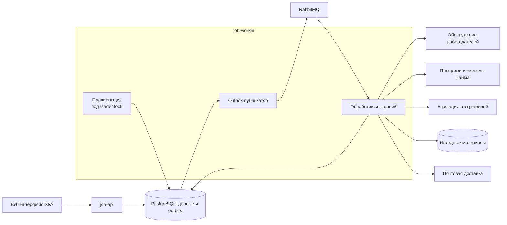
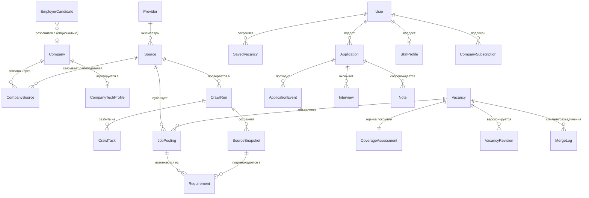

# Технический документ: приложение для поиска, мониторинга и анализа вакансий

## Оглавление

1. Введение (назначение, связь с бизнес-ТЗ, глоссарий)
2. Обзор архитектуры (компоненты, диаграмма, принципы)
3. Технологический стек (выбор с обоснованием)
4. Модель данных (сущности, связи, инварианты)
5. Источники и адаптеры (контракт адаптера, обнаружение, лимиты)
6. Конвейер обработки (единицы работы, шаги, стадии)
7. REST API (контракты и принципы)
8. Надёжность и качество данных
9. Безопасность
10. Наблюдаемость
11. Развёртывание (Docker, профили, Kubernetes)
12. CI/CD и GitOps
13. Тестирование и эксперименты
14. Этапность разработки
15. ADR (ключевые решения с обоснованием)

---

## 1. Введение

**Назначение документа.** Описывает технические решения и этапность разработки приложения. Это рабочий документ, по которому ведётся разработка: он фиксирует, *что* строим и *почему именно так*, на уровне, достаточном чтобы начать кодить; мелкие детали дорабатываются в коде. Документ опирается на бизнес-ТЗ и реализует его возможности.

**Связь с бизнес-ТЗ.** Продукт описан в бизнес-ТЗ обобщённо по нише и рынку — они являются настройкой, а не архитектурным решением. Технический документ так же не привязан к конкретной нише или стране; там, где реализация зависит от рынка (набор конкретных источников), это вынесено в настраиваемую конфигурацию, а не зашито в код.

**Принцип изложения.** Ключевые решения сопровождаются кратким обоснованием; развёрнутые обоснования спорных решений собраны в разделе 15 (ADR). Конкретные версии библиотек фиксируются перед реализацией после проверки совместимости.

**Принципы проектирования.** Предпочитаются проверенные, актуальные инженерные практики (API-first, транзакционная согласованность и идемпотентность, наблюдаемость, воспроизводимое развёртывание) — без устаревших решений и без усложнения без необходимости. Интерфейс — чистый, быстрый и сфокусированный в соответствии с бизнес-ТЗ (§5). «Современность» понимается как выбор актуального и адекватного задаче, а не как погоня за отдельными технологиями.

**Глоссарий.**

| Термин | Значение |
|---|---|
| **Источник** (`Source`) | Интеграция с конкретной площадкой или системой найма: адрес, тип, расписание, лимиты |
| **Система найма** (ATS) | Готовая платформа карьерных страниц. Два класса: **SMB/mid-market** (Greenhouse, Lever, Ashby, Workable, Recruitee, Personio, SmartRecruiters) и **энтерпрайз** (Workday, SAP SuccessFactors). Список вакансий компании доступен по **вендорному шаблону адреса** — открытой лентой (JSON/XML) либо документированным/де-факто открытым endpoint (§5). Именно предсказуемость шаблона делает возможным автоматическое обнаружение |
| **Публикация** (`JobPosting`) | Запись вакансии в одном конкретном источнике |
| **Вакансия** (`Vacancy`) | Объединённое представление предложения работодателя; может собираться из нескольких публикаций |
| **Ревизия** (`VacancyRevision`) | Зафиксированное изменение значимых полей вакансии во времени |
| **Обнаружение работодателей** (Discovery) | Отдельный слой, находящий новые компании и их карьерные источники |
| **Кандидат в работодатели** (`EmployerCandidate`) | Найденная, но ещё не подтверждённая компания/источник |
| **Признак покрытия** | Метка вакансии: «на площадке» / «только с сайта компании (скрытая)» / «и там, и там» |
| **Технологический профиль компании** (`CompanyTechProfile`) | Производный агрегат технологий по всем вакансиям работодателя |
| **Гейт уверенности** | Порог, ниже которого обнаруженный источник не подключается автоматически, а уходит на подтверждение |
| **Outbox** | Таблица исходящих событий, обеспечивающая надёжную публикацию сообщений вместе с транзакцией БД |
| **Идемпотентность** | Свойство: повторная обработка того же события не создаёт дублей и побочных эффектов |

## 2. Обзор архитектуры

**Форма системы.** Один репозиторий, два развёртываемых приложения на Spring Boot:

| Компонент | Ответственность |
|---|---|
| `job-api` | Пользователи, поиск, подписки, компании, техпрофили, отклики, заметки, интервью, профиль навыков, отчёты об ошибках |
| `job-worker` | Планирование, публикация outbox, обнаружение работодателей, сбор, нормализация, дедупликация, ревизии, агрегация техпрофилей, уведомления/дайджест |
| **PostgreSQL** | Данные продукта, история, задания, контрольные точки, outbox |
| **RabbitMQ** | Доставка фоновых заданий |
| **Объектное хранилище** (S3-совместимое) | Снимки исходных материалов для повторной обработки; позднее — файлы CV |
| **Веб-интерфейс (SPA)** | Пользовательские сценарии и административный обзор; отдельный фронтенд-артефакт, потребляющий REST API |
| **Почтовая доставка** (SMTP / провайдер email) | Внешний канал доставки уведомлений и дайджеста изменений |

**Модули приложения:** источники, обнаружение работодателей, сбор, каталог вакансий, требования, техпрофили компаний, подписки, отклики, уведомления и дайджест. Общая БД допустима; изменения её схемы согласуются между двумя приложениями. Отдельный сервис на каждый этап обработки не требуется. Каждый тип системы найма — это один адаптер за общим контрактом.

**Единственность планировщика и публикатора при масштабировании (см. ADR-12).** Планировщик и outbox-публикатор — логические роли внутри `job-worker`. Поскольку KEDA масштабирует worker *вверх*, роли делаются безопасными при нескольких репликах явным механизмом: (1) периодический тик планировщика выполняется под **leader-lock в PostgreSQL** (ShedLock / advisory-lock) — в каждый момент планирует только одна реплика; (2) планирование **идемпотентно** — уникальный ключ на `(source, окно расписания)`, поэтому даже двойной запуск не создаёт дублей заданий; (3) публикатор захватывает события outbox через `SELECT … FOR UPDATE SKIP LOCKED`, поэтому каждое событие отправляет ровно один издатель. **`minReplicaCount: 1`** гарантирует, что роль планирования не исчезнет при простое очереди (RabbitMQ-триггер не увидит событие, оставшееся только в outbox БД). Обработка заданий при этом идёт параллельно на всех репликах.

**Доставка заданий с пилота (пересмотрено).** На Этапе 1 конвейер работает через RabbitMQ и transactional outbox с самого начала: планировщик под leader-lock ставит задания, публикатор отправляет события outbox в брокер с publisher confirms, обработчики потребляют их идемпотентно; обнаружение выполняется периодическим заданием. KEDA-масштабирование по длине очереди подключается позже (Этап 3) и не блокирует пилот. Обоснование выбора RabbitMQ и общей БД — в ADR (раздел 15, ADR-1, ADR-10).

**Подход к интерфейсу.** Фронтенд — отдельный SPA (React или Svelte; выбор фиксируется на старте реализации), собираемый независимо (TypeScript, сборка Vite) и потребляющий REST API `job-api`. Приложение отдаётся как статический артефакт; интерфейс чистый и сфокусированный (бизнес-ТЗ §5), адаптивный под мобильный экран. Разделение фронтенда и API даёт понятную границу, упрощает тестирование и не привязывает бэкенд к одному клиенту. OpenAPI UI используется только для разработки и технической демонстрации и не заменяет пользовательский интерфейс.

## 3. Технологический стек

Выбор зафиксирован; каждая строка сопровождается ролью, границей применимости и этапом ввода (см. раздел 14). Конкретные версии проверяются на совместимость и фиксируются перед реализацией; major-версии не обновляются автоматически. Колонка «Этап» показывает, что нужно с первого дня, а что вводится позже и не блокирует выход пилота.

| Область | Выбор | Обоснование / граница | Этап |
|---|---|---|---|
| Язык | Java (LTS-версия, ориентир — 21 LTS; в окружении разработки установлен JDK 21) | Долгая поддержка; целевая экосистема backend | 1 |
| Каркас | Spring Boot (стабильная линия, ориентир — 4.1.x) | Web, DI, безопасность, данные из коробки; в 4.1 — встроенная защита от SSRF (см. §9) | 1 |
| API и безопасность | Spring Web, Validation, Spring Security, OpenAPI | REST, валидация, роли/владелец, машинный контракт API | 1 |
| Данные | PostgreSQL, Spring Data JPA, Flyway | Транзакции, полнотекстовый поиск, версионируемые миграции | 1 |
| Фронтенд | SPA (React или Svelte), TypeScript, сборка Vite | Чистый, сфокусированный, адаптивный UI; отдельный артефакт, потребляет REST | 1 |
| Доставка email | Spring Mail + SMTP / провайдер транзакционного email | Внешний канал уведомлений и дайджеста изменений (§7.4 бизнес-ТЗ) | 1 |
| Сбор | HTTP-клиент + разбор JSON/XML лент; Jsoup — только для HTML-страниц без открытой ленты | Основной путь — структурированные ленты; парсинг HTML — исключение | 1 |
| Очередь | RabbitMQ, Spring AMQP | Доставка фоновых заданий at-least-once с самого начала; KEDA-масштабирование по длине очереди — с Этапа 3 | 1 |
| Исходные материалы | S3-совместимое хранилище | Снимки для повторной обработки; позже файлы CV | 1 |
| Тесты | JUnit (версия по Spring Boot), Testcontainers, WireMock | Интеграционные тесты на реальных PG/брокере; заглушки источников | 1 |
| Образы | Spring Boot `bootBuildImage` + Docker Compose | Один способ сборки образов (см. ниже) | 1 |
| CI | GitHub Actions (компиляция, тесты) | Базовая проверка с первого дня | 1 |
| Проверка образов | Trivy + SBOM | Сканирование уязвимостей и состав зависимостей | 4 |
| Kubernetes | Helm, KEDA, Gateway API + Envoy Gateway | Развёртывание, масштабирование по очереди, внешний доступ | 3 |
| TLS и секреты | cert-manager + Sealed Secrets | Для демо-кластера | 3 |
| Метрики и трассировка | Actuator, Micrometer, Prometheus, Grafana, OpenTelemetry, Tempo | Наблюдаемость и сквозные трассы | 3 |
| GitOps-доставка | kind (smoke), Argo CD (демо) | Smoke-развёртывание и синхронизация демо-окружения | 4 |

**Границы стека.** RabbitMQ, PostgreSQL и два приложения достаточны для основной архитектуры. Kafka, service mesh, отдельный поисковый кластер и LLM **не добавляются без отдельного требования**. Сборка образов выполняется одним выбранным способом; Jib или Dockerfile могут заменить buildpacks по обоснованному решению, но три параллельных пути не поддерживаются.

## 4. Модель данных

**Сущности.**

| Сущность | Назначение |
|---|---|
| `User` | Учётная запись |
| `Company` | Компания-работодатель. Карьерные источники связываются через `CompanySource`, а не напрямую (площадка обслуживает многих) |
| `Provider` | Тип интеграции (конкретная ATS или площадка) и его **capability-карточка**: list/detail, виды пагинации, языки, обязательность credentials, полнота перечисления, включение скрытых записей, семантика дат, условные запросы (§5) |
| `EmployerCandidate` | Кандидат в работодатели от слоя обнаружения: источник находки, статус резолва, уверенность. **Связь с подтверждённой `Company` необязательна** — кандидат существует до её создания |
| `CompanySubscription` | Интерес пользователя к компании |
| `CompanyTechProfile` | Производный агрегат технологий компании (частота, совстречаемость, свежесть, объём выборки); пересчитывается периодически |
| `Source` | Конкретный источник сбора: доска работодателя **или** область на площадке (регион/специализация). Адрес, расписание, лимиты, версия адаптера, состояние. Ссылается на `Provider`; принадлежность одной компании необязательна |
| `CompanySource` | Проверенная связь «источник → работодатель». Для площадки — многие-ко-многим (одна доска отдаёт вакансии многих компаний) |
| `CrawlRun` | Область и полнота обхода, состояние и диагностика; конечные состояния и `lastCompleteRunAt` |
| `CrawlTask` | Тип задания, попытки, версия, состояние и контрольная точка |
| `SourceSnapshot` | Исходные данные, хеш, время и версия адаптера |
| `JobPosting` | Публикация в конкретном источнике |
| `Vacancy` | Объединённая вакансия; признак покрытия — производный из `CoverageAssessment` |
| `VacancyRevision` | Изменения значимых полей (история наблюдений приложения, с первого сбора) |
| `CoverageAssessment` | Результат сравнения покрытия: набор проверенных площадок, область и полнота проверки, дата, версия сопоставления, нерешённые кандидаты в дубли, состояние (`на площадке` / `только с сайта компании` / `и там, и там` / **`не проверено/неизвестно`**) |
| `MergeLog` | Журнал слияний/разъединений публикаций в вакансию: автор (авто/ручной), версия алгоритма, причина, запрет повторного ошибочного слияния |
| `Requirement` | Требование (технология/опыт/язык) и подтверждающий фрагмент |
| `SearchSubscription` | Поисковые фильтры |
| `SavedVacancy` | Персональное состояние вакансии; причина скрытия/отказа |
| `SkillProfile` | Список навыков пользователя для явного сопоставления |
| `ErrorReport` | Сообщение об ошибке в карточке и статус обработки |
| `Application` | Отклик; снимок вакансии и сопоставленных технологий |
| `ApplicationEvent` | История этапов отклика |
| `Interview`, `Note` | Собеседования и заметки |
| `Notification` | Внутреннее уведомление; уникальный ключ против дублей при повторной обработке |
| `PendingChange` | Устойчивый журнал изменений, ожидающих сопоставления с подписками. Работает **с пилота** (не полагаясь на брокер): гарантирует, что уведомление не теряется при падении между записью ревизии и рассылкой (§8) |
| `OutboxEvent` | Событие для надёжной публикации; задействовано **с Этапа 1** (ADR-10: RabbitMQ и transactional outbox введены с пилота) |
| `MarketProfile` | Конфигурация рынка/ниши: правовой режим зарплаты (обязательна ли публикация по закону), набор мейнстрим-площадок региона. Это настройка, а не пользовательские данные |
| `CandidateProfile`, `ResumeVersion` | Полный профиль и файлы CV — *(расширение)* |

**Ключевые связи.**

**Инварианты и ограничения (правила, обязательные к реализации).**

- **Публикация уникальна** в паре «источник + внешний ID»; внешние ID разных источников не считаются глобально уникальными.
- **Вакансия объединяет публикации при надёжном общем признаке** (тот же работодатель + та же система найма/ID, либо совпадение по безопасно нормализованному URL); а с Этапа 2 — дополнительно **обязательным минимальным нечётким сопоставлением** (работодатель + нормализованный заголовок + близость дат публикации, с порогом уверенности; сомнительные пары не сливаются автоматически и уходят на ручную проверку). Иначе публикации остаются отдельными записями. Ссылки и происхождение сохраняются.
- **Признак покрытия — результат процедуры сравнения, а не факт отсутствия (A01, ADR-15).** «Скрытая» не выставляется уверенно, если площадка была недоступна, обход неполон или сопоставление неоднозначно: в этих случаях `CoverageAssessment` имеет состояние **`не проверено/неизвестно`** с видимой причиной. Отрицательный результат формулируется ограниченно — «не найдена на X, Y при проверке [дата]», а не «нет на агрегаторах». Изменение набора подключённых площадок пересчитывает область сравнения. Достижимость состояния «и там, и там» зависит от нечёткого сопоставления (ADR-14).
- **Локация офиса и территория допустимой удалёнки — раздельные поля** `Vacancy`, как и требование локального присутствия; каждое с явным «неизвестно» (бизнес §7.3). `remote` не подтверждает право работать из любой страны.
- **Языковое требование — два независимых поля (A07):** `mentioned` (`yes`/`no`/`unknown`) и `modality` (`required`/`preferred`/`unspecified`), плюс уровень владения и статус ошибки извлечения **отдельно**. «German-speaking team» — это `mentioned=yes, modality=unspecified`, а не «требуется»; ошибка парсера/неподдерживаемый язык текста — это `unknown`, а не «не упомянут». `english-friendly` определяется явно (есть требование английского И нет подтверждённого обязательного локального языка) и показывается с оговоркой, что рабочая среда не доказана.
- **Зарплата разложена на независимые оси (A09):** форма (`exact`/`range`/`min_only`/`max_only`/`unknown`), полнота извлечения, юридическая применимость и компонент (`base`/`bonus`/`OTE`); валюта, период, gross/net хранятся явно. Фильтр по нижней границе сравнивает **только совместимые единицы**; несравнимые попадают в управляемую пользователем корзину «несопоставимо». Пустое поле API при сумме в тексте — это не «не указана». «До X» оставляет нижнюю границу неизвестной.
- **Признак «не указана (ожидается по закону)»** выставляется только при установленной юридической применимости (`MarketProfile`: юрисдикция, ссылка на норму, дата вступления, область); при `unknown`/`not_applicable` юридически окрашенная метка не показывается (A24).
- **`VacancyRevision` ведётся с первого сбора**; изменение значимого поля связано с источником и ревизией. Технические изменения HTML/ленты не создают ревизию.
- **`CompanyTechProfile` — производное представление, не источник истины:** кэш агрегата, пересчитываемый из `Requirement`/`JobPosting`, всегда объяснимый ссылками на исходные вакансии, честно показывающий объём выборки. **Основной факт — «часто встречается в вакансиях компании», а не «ядро стека» как утверждение (A10):** частоты считаются **после** дедупликации (репост/перевод/несколько источников одной роли — одна единица в знаменателе), с весом давности, минимальной выборкой и, где возможно, сегментацией по типу роли. «Полная доска» — это доска конкретного источника в наблюдаемой области, а не все вакансии юрлица. Текст о legacy-технологии не превращается в совет учить её как обязательный навык.
- **`Requirement` привязан к породившей его публикации** (`JobPosting`) и подтверждающему снимку (`SourceSnapshot`), а не напрямую к вакансии: он хранит исходную формулировку, источник и версию извлечения. Требования вакансии — это агрегат по её публикациям; такая привязка обязательна для объяснимости техпрофиля компании (клик из выведенного навыка в конкретную исходную вакансию — §6). Технология уровня компании не превращается автоматически в требование конкретной позиции.
- **Персональные записи** (`SavedVacancy`, `Application`, `Note`, `SkillProfile`, `SearchSubscription`, `CompanySubscription`) проверяются по владельцу; данные одного пользователя недоступны другому.
- **Конфликты полей при слиянии и обратимость (A04).** Значения публикаций хранятся раздельно; у выбранного значения поля хранится происхождение и правило выбора (не last-write-wins по порядку доставки). Существенный конфликт (разная зарплата, разное требование языка) показывается, а не скрывается. Слияние/разъединение фиксируется в `MergeLog` с запретом повторного ошибочного слияния; ручная коррекция имеет область, причину и политику override при новом сборе (иначе следующий обход её сотрёт). «Заголовок+дата+компания» не сливают две одинаково названные позиции в разных городах/подразделениях; учитываются отрицательные признаки и отсутствующая дата; неоднозначные пары — не автослияние.
- **Идентичность наблюдения отделена от версии интерпретации (A18).** Отдельно хранятся: идентичность наблюдения, время получения/версия источника, версия интерпретации (парсер/таксономия). Текущее состояние публикации обновляется **условно**; проигравшая старая обработка остаётся в истории, но не заменяет current и не создаёт ложную дельту. Защита распространяется не только на `Vacancy`, но и на `Requirement`, чтобы устаревшее задание не записало старое требование и не породило ошибочное уведомление. **Reprocessing не меняет `lastSeenAt`** и не делает данные «свежими»; повторный идентичный payload обновляет факт наблюдения, но не создаёт бизнес-ревизию.
- **Закрытие и полнота обхода — с первого регулярного сбора (A06), не с Этапа 2.** Раздельно хранятся `lastAttemptAt`, `lastSuccessfulFetchAt`, `lastSeenAt`, `lastCompleteRunAt`; `CrawlRun` имеет конечные состояния и область. Отсутствие засчитывается только по пригодному **завершённому** обходу той же области; частично разобранный `200 OK`, HTML-страница ошибки с кодом 200, оборванная пагинация и один пропуск не закрывают пачку вакансий. `404/410` трактуется по контракту адаптера (перенос/ошибка URL ≠ закрытие). «Не видели N дней» — это статус, а не доказательство закрытия; интервал и число подтверждений конфигурируются и тестируются.
- **Сроки снимков согласованы с объяснимостью (A05, ADR-8).** Раздельные политики хранения: raw payload, нормализованная ревизия, доказательный фрагмент, **неизменяемый снимок отклика**. `Application` фиксирует выбранную ревизию, результат сопоставления, версию профиля навыков/таксономии и время фиксации — и остаётся объяснимым после удаления raw и исчезновения внешней страницы (UI отличает сохранённый фрагмент от доступного оригинала). Каскадное уничтожение истории при удалении raw исключено; метаданные удалённого снимка сохраняются со статусом недоступности. «История с первого сбора» — это история наблюдений приложения, не история до подключения источника.
- **Обновление `Application`** идёт с контролем версии (оптимистичная блокировка): конкурирующие изменения из двух вкладок не затирают друг друга незаметно.
- **Уникальные ограничения** задаются для публикаций, заданий, уведомлений и кандидатов-работодателей (защита от дублей при повторной обработке).
- **Индексы** выбираются по реальным запросам и проверяются планами выполнения, а не задаются наугад.

## 5. Источники и адаптеры

**Контракт адаптера.** Каждый `Provider` (система найма или площадка) реализует единый интерфейс: получить список публикаций **в области источника** — доска конкретной компании (ATS) или область площадки по региону/специализации, — с пагинацией; получить одну публикацию; вернуть структурированные поля в общем виде. Один адаптер обслуживает все компании на этой системе. Версия адаптера привязана к типу `Provider` и участвует в версионировании парсера (раздел 8).

**Типы систем найма (примеры целей адаптеров; точный набор фиксируется на Этапе 0).**

| Система | Формат | Как читается (шаблон адреса) |
|---|---|---|
| Personio | XML | `https://<компания>.jobs.personio.de/xml` |
| Greenhouse | JSON | `https://boards-api.greenhouse.io/v1/boards/<компания>/jobs?content=true` |
| Lever | JSON | `https://api.lever.co/v0/postings/<компания>?mode=json` |
| Ashby | JSON | `https://api.ashbyhq.com/posting-api/job-board/<компания>` |
| Workable | JSON | `https://www.workable.com/api/accounts/<компания>` |
| Recruitee | JSON | `https://<компания>.recruitee.com/api/offers/` |
| SmartRecruiters | JSON | `https://api.smartrecruiters.com/v1/companies/<компания>/postings` (публичный Posting API, без ключа) |
| Workday (энтерпрайз) | JSON | `https://<tenant>.<dc>.myworkdayjobs.com/wday/cxs/<tenant>/<site>/jobs` (POST, де-факто открытый) |
| SAP SuccessFactors (энтерпрайз) | XML/OData | XML-фид опубликованных вакансий (если включён тенантом) либо OData `JobRequisition`; часть тенантов доступна анонимно, часть — нет |

Плюс адаптер(ы) мейнстрим-площадок региона. Единый и предсказуемый формат адреса лент — это ещё и то, что делает автоматическое обнаружение посильным (адрес выводится по шаблону из домена и типа системы). **Охват — по вендорам, а не по одной универсальной странице (ADR-17):** каждый ATS-вендор (SMB и энтерпрайз) — это один адаптер за общим контрактом; за пределами охвата остаётся только произвольная кастомная карьерная страница без вендорного шаблона (её сбор — дорогой и без гарантий, non-goal). Энтерпрайз-ленты (Workday, SuccessFactors) читаемы, но их доступность и правовое основание проверяются **по-тенантно** (A24), а часть SuccessFactors-витрин требует рендеринга страницы, а не готовой ленты.

**Contract-карточка адаптера (A12).** Приведённые адреса — ориентиры; точные контракты проверяются на Этапе 0 по официальной документации, потому что они различаются и меняются. Каждый `Provider` описывается capability-карточкой: list/detail, виды пагинации, языки представления, обязательность credentials, полное/частичное перечисление, включение скрытых записей, семантика дат, условные запросы. Известные нюансы, которые нельзя игнорировать:

- **Personio (XML):** язык представления feed — это язык витрины, **не** требование к кандидату; хранить как язык представления.
- **Greenhouse:** ID публикации и `internal_job_id` различаются; структурированные зарплатные диапазоны берутся с detail-endpoint (`pay_transparency=true`), а не только со списка `content=true`.
- **Lever:** global и EU endpoints различаются — хранить регион экземпляра, а не только slug; ограничения POST applications не переносить на GET без проверки.
- **Ashby:** compensation — через `includeCompensation=true`; `isListed=false` означает «только по прямой ссылке» — **не** выводить такие записи в общий каталог по умолчанию.
- **Workable:** публичный endpoint существует (пример с `?details=true`); не объявлять его несуществующим/закрытым, а определить нужную детализацию.
- **Recruitee:** объявлен переход на токен для Careers Site API (дедлайн ~10.02.2027), XML feed/widget из этой схемы исключены — **нельзя** считать JSON-endpoint бессрочно анонимным; проверить разрешённый путь/получение доступа и дату изменения.
- **SmartRecruiters:** публичный Posting API отдаёт опубликованные вакансии компании без ключа; статус публикации и детали — отдельными полями/вызовом; проверить лимиты и условия использования.
- **Workday (энтерпрайз):** карьерный сайт тенанта отдаёт вакансии POST-запросом к `.../wday/cxs/.../jobs` (JSON, пагинация `offset/limit`); деталь позиции — отдельным вызовом по `externalPath`. Endpoint де-факто открыт, но это **не** документированный публичный контракт — фиксировать хрупкость и ToS тенанта.
- **SAP SuccessFactors (энтерпрайз):** единого открытого контракта нет. У части тенантов включён XML-фид опубликованных вакансий или доступен OData `JobRequisition`; у других витрина — JS-SPA за tenant-API. Доступность и правовое основание проверяются **по каждому тенанту** (A24); где ленты нет — рендеринг страницы (дороже, отдельный контур).

**Деталь — из сохранённого ответа, а не N перекачек.** Если bulk-лента (XML/JSON) уже содержит поля публикации, отдельный сетевой detail-вызов на каждую запись не делается — иначе обработка N вакансий скачивает весь список N раз. Detail-endpoint запрашивается только там, где нужное поле (например, зарплата) в списке отсутствует.

**Слой обнаружения работодателей** — отдельный, независимый от сбора. Задача: `найти компанию → определить её карьерный источник/систему найма → поставить на регулярный сбор`. Работает в двух режимах:

- **Ручной:** администратор/пользователи добавляют или предлагают работодателей и их источники.
- **Автоматический:** резолв системы найма по домену, редиректам и известным шаблонам адресов; проверка, что лента отвечает ожидаемой структурой. **Гейт уверенности:** уверенно распознанный источник подключается автоматически, неуверенный уходит в очередь на подтверждение (не пропадает и не подключается вслепую).

Обнаружение имеет **собственный бюджет**, отдельный от бюджета сбора, и выполняется отдельными заданиями (`DISCOVER_EMPLOYER`) ограниченного размера и частоты, чтобы не тормозить основной конвейер. Это критический контур безопасности (SSRF), т.к. слой резолвит внешние URL (раздел 9).

**Источник кандидатов в работодатели (входы обнаружения).** Автоматический режим — основной; ручной — дополнение. Кандидаты поступают из нескольких входов, от самых точных и дешёвых к более общим:

- **Гарвест ATS-хостов из публичных датасетов — основной вход.** Common Crawl и Certificate Transparency дают **разные типы кандидатов и не взаимозаменяемы (A11):**
  - **Индекс URL Common Crawl** — для **path-based** ATS, где slug стоит в пути: `boards.greenhouse.io/<slug>`, `jobs.lever.co/<slug>`, `careers.smartrecruiters.com/<slug>`. Индекс исторический и не гарантирует все живые доски; массовую фильтрацию вести по колоночному индексу, не перегружая CDX-сервис.
  - **Логи Certificate Transparency** хранят **имена хостов, а не URL-пути**, поэтому годятся для **поддоменных** ATS: `<slug>.recruitee.com`, `<slug>.jobs.personio.de`, а также части энтерпрайз-витрин с поддоменом тенанта (`*.successfactors.eu`). **Workday — исключение (проверено на Этапе 0, 2026-09-23):** тенанты `<tenant>.wdN.myworkdayjobs.com` закрыты wildcard-сертификатами дата-центров, поэтому CT их почти не перечисляет; для Workday вход — **индекс Common Crawl**, который даёт полный URL и тем самым сразу пару `tenant/site`. slug из `greenhouse/lever` они не дают, а wildcard-сертификат не перечисляет все реально существующие поддомены.

  Оба входа дают лишь URL-кандидатов; ни «массово», ни «дёшево», ни «легально» не следуют из одной публичности данных — право повторного использования проверяется отдельно (§9, A24). Известный домен компании не гарантирует её slug. **Обязательно проверяется принадлежность доски работодателю**, а не только валидность JSON/XML: валидная лента может принадлежать другой компании; пустая валидная доска — не обязательно ложная компания.
- **Резолв по домену компании — вторичный вход.** Имея список доменов (региональный бизнес-реестр/каталог), пробуем известные шаблоны ATS для домена и его редиректов и валидируем ленту.
- **Расширение по связям — дополнительный, более шумный вход.** Переход от известных компаний к связанным (портфели фондов, отраслевые каталоги, «похожие компании»).
- **Ручной ввод и предложения** пользователей/администратора — дополнение, а не основной поток.

Любой вход даёт лишь *кандидата*: каждый проходит резолв системы найма, валидацию ленты, **проверку принадлежности доски работодателю** (A11 — не только валидность JSON/XML), гейт уверенности и SSRF-защиту (§9), а также **дедупликацию работодателей** (одна компания не заводится дважды из разных входов). На пилоте достаточно одного основного входа (гарвест ATS-хостов по одному-двум вендорным шаблонам); первым берётся вендор с достижимой лентой и реальной аудиторией целевой ниши — ориентир Workday через индекс Common Crawl (`*.myworkdayjobs.com`; CT для Workday непригоден — протокол Этапа 0 §3). Остальные входы и вендоры наращиваются далее (§14).

**Расписание и лимиты.** `Source` содержит адрес, тип, ограничения запросов, расписание, версию адаптера и состояние последнего запуска. По возможности используются условные HTTP-запросы (ETag / If-Modified-Since). Бюджет запросов и параллелизма общий для всех реплик; лимит может действовать на **провайдера, credential, хост или доску** — независимые бюджеты discovery и сбора не обходят общий внешний лимит. Для первой версии допустима координация в PostgreSQL (короткие транзакции + время следующего разрешённого запроса), Redis не обязателен. Учитывается `Retry-After`. Сбой одного источника не должен занимать все обработчики. **Бюджет обнаружения ограничивает не только запросы, но и число создаваемых кандидатов/задач**, чтобы валидный огромный ответ не давал неограниченный fan-out (A29).

**Основание доступа и повторного использования (A24).** Публичность URL не равна праву хранить и переиздавать данные; robots.txt (RFC 9309) — не механизм авторизации. Для каждого источника ведётся: основание доступа/повторного использования, ограничения хранения, дата проверки условий и действие при их изменении. Источник можно приостановить и удалить его raw-материалы по принятой политике. Универсального правового разрешения для перечисленных ATS документ не предполагает — это проверяется на Этапе 0 для выбранной пары источников.

**Заглушка источника** (WireMock) с нормальными и ошибочными ответами — обязательный элемент для тестов и нагрузочных экспериментов.

## 6. Конвейер обработки

**Единицы работы (задания).** Весь источник не обрабатывается одним неограниченным сообщением. Каждое задание имеет ограниченный размер, тайм-аут и ключ идемпотентности:

| Задание | Что делает |
|---|---|
| `DISCOVER_EMPLOYER` | Найти компанию-кандидата, определить источник/систему найма; при уверенном резолве создать/обновить `Source`, иначе — в очередь на подтверждение |
| `DISCOVER_PAGE` | Проверить страницу списка/ленту, сохранить контрольную точку, обнаружить публикации и следующую страницу |
| `FETCH_POSTING` | Получить одну публикацию, нормализовать, сохранить изменения |
| `REPROCESS_POSTING` | Повторно обработать сохранённый снимок новой версией парсера |
| `AGGREGATE_COMPANY_PROFILE` | Периодически пересчитать `CompanyTechProfile` из публикаций компании |
| `MATCH_SUBSCRIPTIONS` | Обработать изменение и сформировать персональные уведомления/дайджест |

**Шаги конвейера (с очередью — с Этапа 1, ADR-10).**

1. Планировщик создаёт `CrawlRun`, задание и outbox-событие **в одной транзакции**.
2. Публикатор отправляет сообщение и после подтверждения брокера отмечает публикацию в БД.
3. Worker получает задание и проверяет общий бюджет запросов к источнику.
4. Адаптер получает данные; **HTTP-вызов не удерживает длительную транзакцию БД**.
5. Сохраняются исходные сведения (`SourceSnapshot`), нормализованные поля и новая ревизия при изменении.
6. Следующие задания и события создаются через outbox.
7. После фиксации результата подтверждается входящее сообщение.

Сообщение содержит `eventId`, `taskId`, `schemaVersion`, ссылку на сущность, время создания и контекст трассировки. Большие HTML-документы в очередь не помещаются (лежат в объектном хранилище, в сообщении — ссылка).

**Стадии обработки данных.**

- **Нормализация.** Извлекаются должность, компания, описание, обязанности, требования, локация, формат работы, зарплата, тип занятости, языковые требования, ссылка отклика. Исходные значения сохраняются вместе с нормализованными; даты публикации/первого обнаружения/последней проверки — разные поля; валюта, период и gross/net не смешиваются; неизвестное явно помечается, а не заменяется догадкой. Основной путь — разбор структурированных лент; Jsoup — только для HTML без открытой ленты.
- **Дедупликация.** Точные признаки (§4): пара «источник + внешний ID», нормализованный URL, подтверждённый идентификатор работодателя/системы. Межисточниковое связывание одной вакансии (площадка + сайт компании) — при надёжном общем признаке, а **с Этапа 2 — обязательным минимальным нечётким сопоставлением**: работодатель + нормализованный заголовок (регистр, пунктуация, стоп-слова) + близость дат публикации, с порогом уверенности; при превышении порога публикации связываются с сохранением обоих источников, сомнительные пары — на ручную проверку (§7.8 бизнес-ТЗ), а не автослияние. Полное нечёткое сопоставление по всему тексту — *(расширение)*.
- **Ревизии.** Существенные изменения определяются по нормализованным полям; в карточке доступны «было → стало». Сбой источника или неполная пагинация не закрывают вакансию — закрытие только по явному статусу или подтверждённому отсутствию.
- **Агрегация техпрофиля.** По `Requirement` всех вакансий компании считаются частота и совстречаемость; недавние вакансии весомее; результат — `CompanyTechProfile` с объёмом выборки и ссылками на исходные вакансии. Только явная агрегация, без ML.

**Извлечение структурированных требований (технологии, опыт, языки).** Извлечение детерминированное, без ML/LLM в основной версии (обоснование — ADR-13):

- **Технологии** — по курируемой **таксономии навыков (газеттиру)**: нормализованный словарь с синонимами и вариантами написания (Java/JVM; PostgreSQL/Postgres), сопоставление по структурированным полям ленты и по тексту описания с учётом границ слов. Таксономия версионируется; версия извлечения хранится в `Requirement`.
- **Уровень опыта** — правилами по типовым конструкциям (junior/medior/senior, «N+ лет»), с явным «неизвестно», если однозначно не следует.
- **Языки** — правилами в тристейт: «требуется» / «желателен» / «не упомянут» по формулировкам («required», «is a plus», отсутствие упоминания).
- **Синонимы ≠ связанные навыки (A08).** Таксономия различает *алиасы одного навыка* (PostgreSQL/Postgres — один навык) и *отношения между навыками* (Java и JVM — связанные, но разные; Kotlin/JVM не равен опыту Java); иерархия версионируется. Отдельно извлекаются обязательность, **альтернативы** («Java or Kotlin» не создаёт два обязательных пробела), **отрицания/миграции** («away from X», «не используем») и область упоминания. Границы токенов учитывают `C++`, `C#`, `.NET`, `Go`, `R`, `Node.js`. Уровень (seniority) и число лет опыта хранятся раздельно.
- Обязательные и желательные требования разделяются, только если это явно следует из текста; иначе категория остаётся неизвестной. Каждое требование хранит исходную формулировку, публикацию-источник, снимок и версию извлечения (§4).

Качество зависит от полноты таксономии; она ведётся как данные и пополняется. LLM-извлечение — расширение (§14, Этап 5) со сверкой по схеме и сохранением происхождения; в основной версии не используется.

**Пилотное исполнение (Этап 1, пересмотрено — ADR-10).** Конвейер с самого начала работает через RabbitMQ и transactional outbox: периодический планировщик под leader-lock ставит задания и пишет outbox-событие в одной транзакции, публикатор отправляет его в брокер с publisher confirms, потребитель обрабатывает идемпотентно; обнаружение и агрегация — периодические задания. KEDA-масштабирование по длине очереди подключается позже (Этап 3) и не меняет модель данных и контракты.

## 7. REST API

**Принципы контракта.**

- **API-first.** Контракт описывается OpenAPI и является источником истины для фронтенда и внешних клиентов; SPA работает через тот же API.
- **Версионирование пути:** `/api/v1/...`; ломающие изменения — через новую версию.
- **Единый формат ошибок** — `application/problem+json` (RFC 9457): стандартные поля `type`, `title`, `status`, `detail`, `instance`. Ошибки полей — своим расширением `errors[]` с JSON Pointer на поле (не «ссылка на поле» как стандартное свойство). Валидация запросов — Spring Validation.
- **Пагинация — курсорная** для лент (стабильна при вставках), со стабильным дополнительным ключом сортировки. Курсор связан с фильтрами, сортировкой и правилами NULL.
- **Условные запросы:** `ETag` (strong) / `If-None-Match` на выдаче и карточках — кэширование и меньше трафика.
- **Оптимистичная конкуренция — два разных контракта (A19).** Несработавший `If-Match` → **`412 Precondition Failed`** (с strong ETag); прикладной конфликт версии, переданной в теле JSON, → `409`. Отсутствие обязательного предусловия обрабатывается явно; для уже применённой операции допускается идемпотентный успех (RFC 9110). Тест двух вкладок получает предсказуемый статус и данные для разрешения конфликта.
- **Асинхронные операции** (запуск проверки, резолв) отвечают `202 Accepted` и ID запуска.
- **Доступ:** административные операции защищены ролью, персональные — проверкой владельца.

**Основные эндпоинты.**

| Метод и путь | Назначение |
|---|---|
| `GET /api/v1/vacancies` | Поиск и фильтры (в т.ч. `coverage`, зарплата, язык), курсорная пагинация |
| `GET /api/v1/vacancies/{id}` | Карточка с требованиями и признаком покрытия |
| `GET /api/v1/vacancies/{id}/history` | История изменений |
| `GET /api/v1/vacancies/{id}/prep` | Подготовка под вакансию: требования роли, ядро стека компании, пробелы относительно профиля навыков |
| `POST /api/v1/vacancies/compare` | Сравнение нескольких сохранённых вакансий |
| `POST /api/v1/vacancies/{id}/error-reports` | Сообщить об ошибке в карточке |
| `GET /api/v1/companies/{id}/tech-profile` | Технологический профиль компании (ядро/контекст, объём выборки, ссылки на источники) |
| `GET/PUT /api/v1/profile/skills` | Профиль навыков для явного сопоставления |
| `POST /api/v1/subscriptions` | Поисковая подписка |
| `PUT /api/v1/companies/{id}/subscription` | Подписка на компанию |
| `POST /api/v1/companies/suggest` | Предложить работодателя (ручной режим обнаружения) |
| `POST /api/v1/applications` | Создать отклик |
| `PATCH /api/v1/applications/{id}` | Изменить отклик (с `If-Match`/версией) |
| `POST /api/v1/applications/{id}/notes` | Добавить заметку |
| `POST /api/v1/applications/{id}/interviews` | Добавить собеседование |
| `GET /api/v1/notifications` | Внутренние уведомления |
| `GET /api/v1/digest` | Дайджест изменений |
| `GET /api/v1/sources` | Покрытие и свежесть |
| `GET /api/v1/admin/employer-candidates` · `POST .../{id}/confirm` | Очередь и подтверждение кандидатов обнаружения |
| `POST /api/v1/admin/sources/{id}/runs` | Запустить проверку (`202`) |
| `POST /api/v1/admin/companies/{id}/resolve` | Определить/обновить систему найма (`202`) |
| `POST /api/v1/admin/error-reports/{id}/apply` | Применить/отклонить исправление |
| `GET /api/v1/admin/error-reports` | Список отчётов для администратора |
| `POST /api/v1/admin/tasks/{id}/retry` | Повторить допустимое проблемное задание |
| `GET /api/v1/applications` · `GET /api/v1/applications/{id}` | Список и карточка откликов |
| `POST /api/v1/vacancies/{id}/save` · `.../hide` · `.../seen` | Сохранить/скрыть (с причиной)/отметить просмотренной |
| `GET/PATCH/DELETE /api/v1/subscriptions/{id}` | Читать/менять частоту/отключать поисковую подписку |
| `POST /api/v1/notifications/{id}/read` | Пометить уведомление прочитанным |
| `GET /api/v1/runs/{id}` | Статус асинхронного 202-запуска |
| `POST /api/v1/admin/employer-candidates/{id}/reject` | Отклонить кандидата обнаружения |

**Полнота контракта (A20).** Перечень — «основной», но пользовательский путь A–D должен полностью проходиться через API (включая восстановление после перезагрузки страницы); действие не существует только как кнопка без сохраняемого состояния. К контракту прилагается таблица «сценарий → команды/чтения → роль → этап» и request/response-схемы. `POST` создания отклика идемпотентен по клиентскому ключу (защита от повтора после сетевого таймаута). Для `apply` отчёта различаются подтверждение, отклонение и фактическая коррекция; для интервью — timezone, перенос, отмена; для `Application` — допустимые переходы и повторный отклик на репост.

**Дизайн поиска (предварительный, уточняется по ходу разработки).** Поиск на PostgreSQL, без внешнего кластера:

- **Полнотекстовая часть — денормализованный поисковый документ (A21).** `tsvector` как *generated column* нельзя строить по имени компании из другой таблицы (PostgreSQL допускает в выражении только immutable-функции и текущую строку). Поэтому поисковые токены (должность/описание + денормализованное имя компании) собираются в отдельный поисковый столбец/документ, обновляемый триггером или на этапе нормализации, с GIN-индексом и `ts_rank`; text-search config (язык, синонимы, стоп-слова, поведение токенов вроде `C++`/`.NET`) задаётся явно.
- **Фильтры** (покрытие, зарплата, язык, регион, формат, компания, даты, состояние) — по индексированным нормализованным столбцам; составные/частичные индексы под реальные комбинации, проверяются планами выполнения.
- **Курсор и консистентность.** Для пилота проще стабильный ключ `(дата первого наблюдения, id)`: `rank` может меняться между страницами при редактировании вакансий, поэтому режим курсора выбирается явно — «живая лента с возможными перемещениями» либо snapshot/version-boundary; вставки/обновления между страницами дают документированное поведение.
- **Неизвестные значения** фильтруемых полей включаются в выдачу только по явному выбору пользователя (бизнес §7.3).

Внешний поисковый движок — только при доказанной необходимости (§3, границы стека).

## 8. Надёжность и качество данных

**Доставка и конкурентная обработка.**

- Семантика — **at-least-once**; повтор сообщения ожидаем, поэтому потребитель **идемпотентен** (ключ идемпотентности задания).
- Outbox использует publisher confirms; подтверждение входящего сообщения — **после** фиксации результата. Разрыв между подтверждением брокера и отметкой в БД может дать повтор — это штатно.
- **Publisher confirm не доказывает маршрутизацию (A15).** RabbitMQ подтверждает и немаршрутизируемое сообщение; поэтому используется `mandatory` + обработка `basic.return` (или alternate exchange), и outbox отмечается опубликованным **только после подтверждения корректной маршрутизации** — иначе ошибочный routing key потеряет задание. Явно задаются topology, тип и durability очередей и persistent-сообщения.
- Временные ошибки повторяются с задержкой и джиттером; бесконечный немедленный requeue исключён. После исчерпания попыток — DLQ, диагностика, контролируемый повтор. Повторы/DLQ/backoff — это выбранная и реализованная схема (delayed-exchange или повтор через БД), а не свойство «из коробки».
- Долговечность очередей/сообщений/подтверждений задаётся явно; отказ брокера рассматривается отдельно от падения worker. Одиночный брокер с PVC **не** объявляется устойчивым к потере диска. Prefetch, параллелизм, длительность задания и время завершения pod согласованы.
- **Единственность издателя/планировщика ограничена одной попыткой захвата (A17).** `SKIP LOCKED` и leader-lock исключают одновременный захват, но не пожизненную единственность: выбран один механизм с **ограниченным lease** (advisory-lock/ShedLock с `lockAtMostFor`), при истечении которого задача может выполниться повторно — поэтому уникальные ограничения на `(source, окно)` и идемпотентность потребителя остаются последней защитой. Долгие неограниченные транзакции на ожидание брокера не создаются; outbox-claim хранит attempt/lease. `minReplicaCount: 1` задаёт желаемый минимум, но не гарантирует постоянно живой pod при отказе узла/БД.

**Качество данных.**

- **Устаревшее задание не перезаписывает свежую ревизию:** используется версия источника либо монотонное поколение задания и условное обновление.
- **Неполный обход не закрывает** отсутствующие в его результате вакансии; закрытие — по явному статусу или подтверждённому отсутствию.
- **Парсер и нормализация версионируются**; версия адаптера привязана к типу системы найма. Повторная обработка снимка меняет интерпретацию, но не создаёт новое внешнее наблюдение и не делает старые данные «свежими».
- **Техпрофиль — производное представление:** честно показывает объём выборки, пересчитывается из первичных данных, не подменяет требования конкретной вакансии.
- **Контракт адаптера** проверяется эталонными ответами лент (JSON/XML) и HTML-фрагментами с ожидаемыми полями.
- **Результаты обнаружения** проходят гейт уверенности и валидацию ленты перед подключением; ошибочные находки не создают мусорных источников.

**Надёжные изменения и уведомления, не полагаясь на брокер (A16).** Путь уведомлений не полагается на брокер: они не должны теряться даже при его сбое. Изменение сначала фиксируется в устойчивом журнале `PendingChange`; сопоставление подписок идёт по checkpoint; создание персонального уведомления защищено уникальным ключом (падение между записью ревизии и рассылкой не теряет и не задваивает уведомление, а подписка на компанию и совпадающая поисковая подписка дают один элемент). Внешняя доставка (email) ведётся отдельными попытками с состоянием: SMTP **не** exactly-once (процесс может упасть после приёма письма сервером), поэтому допускается управляемый повтор или идемпотентность провайдера. Дайджест имеет окно, часовой пояс, правила свёртки и дедупликацию пересекающихся подписок; baseline при первой подписке фиксируется явно (слать существующий каталог или только изменения после подписки).

**Ограничения источников.** Бюджет запросов и параллелизма общий для всех реплик (координация в PostgreSQL, Redis не обязателен). При исчерпании бюджета задание откладывается, а не удерживает поток. Учитывается `Retry-After`. Сбой одного источника не занимает все обработчики.

**Согласованность S3 и БД (A18).** Запись объекта в S3 и commit в PostgreSQL — не одна транзакция; возможны объект без метаданных и строка без объекта. Поэтому: неизменяемый ключ снимка, проверка хеша, признак завершённости, согласованный порядок записи (сначала объект, потом ссылка в БД), очистка сирот и восстановление недописанных объектов.

## 9. Безопасность

- **Аутентификация и доступ.** Spring Security; роли и проверка владельца каждой персональной сущности. Для SPA — сессия в httpOnly/Secure/SameSite-cookie с CSRF-защитой; при нескольких репликах API сессии общие (через JDBC). Базовый профиль — **same-origin** (SPA и API за одним gateway). Уточнение (A22): `app.example.com` и `api.example.com` могут быть разными **origin**, но одним **site** — тогда `SameSite=None` не нужен; он требуется лишь для действительно cross-**site** клиента, и CORS его не заменяет и не заменяет CSRF. OIDC — возможное расширение.
- **Кэш персональных ответов (A22).** Персонализированные ответы (например, `prep`, состояние сохранения вакансии) имеют безопасную политику кэширования; `ETag` не должен позволить общему кэшу выдать чужое представление. После logout персональный ответ недоступен через общий кэш. Публичную карточку и персональный overlay имеет смысл разделять по представлениям/правилам кэша.
- **Приватность шире проверки владельца (A23).** Единая матрица прав «операция × связь владения», включающая `Interview`, `Notification`, `ErrorReport` и вложенные ресурсы. **Кураторская роль не даёт автоматического доступа к личным заметкам и контактам кандидата.** Предусматриваются bootstrap первого аккаунта, login/logout, хранение паролей/восстановление доступа, политика удаления и экспорта профиля (с определённым поведением для почтовой доставки и резервных копий). Тестирование приватности требует **второго** пользователя даже при одном реальном. Полная GDPR-машинерия (основание обработки, минимизация, сроки) вводится по применимости; на стадии синтетических данных и одного пользователя — не строится заранее, но помечена как обязательная при публичном использовании.
- **SSRF — критический контур, и защита не «включается сама» (A13).** Приём не зависит от фреймворка: allow-list схем (только http/https); **deny-list адресов** — приватные, loopback, link-local, IPv6/IPv4-mapped IPv6 и облачные metadata-диапазоны; **защита от DNS-rebinding** — проверяемый адрес должен быть связан с фактическим подключением (клиент не должен повторно резолвить имя после проверки); **повторная валидация при каждом редиректе**; ограничение размера распакованного тела, числа переходов и таймаутов; контроль прокси. Ключевое: это **один выделенный HTTP-клиент для discovery/сбора, использование которого обязательно** — `Jsoup.connect`, сторонний SDK, XML entity resolver или отдельный raw-клиент **не должны обходить** этот путь. Наличие bean/YAML не заменяет тест сетевого поведения. Обратная сторона: **не** запрещать приватные адреса всем клиентам приложения — штатные S3/SMTP/служебные интеграции могут быть во внутренней сети; для них — отдельные доверенные конфигурации, недоступные для URL из внешнего ввода.
- **XXE — отдельный канал при XML (A14).** SSRF-фильтр HTTP не покрывает загрузку внешних сущностей XML-парсером. Для XML-лент (например, Personio) обязательно: запрет DTD и external entities, запрет внешнего разрешения схем там, где не нужно, лимиты расширения сущностей, глубины, размера и времени разбора. Настройки берутся для фактического parser API. Это требование **пилота** при выборе XML, а не позднее усиление.
- **Недоверенный ввод.** Отчёты об ошибках и предложения компаний от пользователей валидируются, ограничиваются по частоте и **не меняют данные без административного подтверждения**. Внешний HTML очищается перед отображением.
- **Ограничение частоты аутентификации (по итогам разбора 2026-09-22).** `login`/`register` и пользовательские жалобы/предложения ограничиваются по частоте (защита от брутфорса/credential-stuffing и спама) — обязательно до публичной экспозиции. Ротация идентификатора сессии при входе (`changeSessionId`) — против session fixation.
- **Секреты** не хранятся открыто в git, образах и логах; Actuator и административные действия — только под контролем доступа.
- **Границы ресурсов:** ограничены размер ответа источника, время запросов и **сроки хранения снимков** (`SourceSnapshot` живёт ограниченное время и только в разрешённом объёме).
- **Условия использования** и лимиты источников соблюдаются; сбор — только с открытых лент и разрешённых страниц. Разрешение локальных заглушек — только в тестовом профиле. Для энтерпрайз-вендоров (Workday, SuccessFactors) доступность ленты и ToS проверяются **по-тенантно** (A24): де-факто открытый endpoint — не гарантия правового основания.
- **Файлы CV** (расширение): проверка файлов, доступа и удаления. Демонстрация — на синтетических профилях и откликах.

## 10. Наблюдаемость

Часть данных наблюдаемости (свежесть, время последнего успешного обхода) совпадает с данными пользовательской trust-панели, поэтому наблюдаемость проектируется вместе с продуктовыми полями, а не только как эксплуатационная надстройка.

**Минимум наблюдаемости — с пилота (A29).** Уже на Этапе 1 обязательны: операционные состояния источника и свежесть, простой журнал ошибок извлечения/сбора и контроль неотправленных уведомлений (`PendingChange`, email-повторы). Полный стек Prometheus/Grafana/Tempo/алерты — Этап 3; он усиливает, но не заменяет продуктовую наблюдаемость свежести, которую пилот обязан показывать пользователю.

**Метрики:** время ответа API (p95, доля ошибок); возраст данных источника и время последнего успешного обхода; полные/частичные/неудачные обходы; скорость обработки, длина очереди, возраст задания; повторы, DLQ, задержка публикации outbox; новые/изменённые публикации, ошибки извлечения; обнаружение (найдено кандидатов, подключено автоматически, отправлено на подтверждение, доля ошибочных резолвов); агрегация техпрофилей (число пересчётов, задержка, доля компаний с недостаточной выборкой); реплики, CPU, память, ожидание бюджета источника.

**Дашборды и алерты.** Grafana-дашборд хранится в репозитории и устанавливается автоматически; в профиле с Prometheus Operator применяется ServiceMonitor. Правила алертинга (Alertmanager): непустой DLQ, возраст старейшего задания выше порога, растущая задержка публикации outbox.

**Трассировка.** Путь «ручной запуск/планировщик → outbox → RabbitMQ → worker»; контекст сохраняется в outbox и передаётся в заголовках сообщения. Повторные попытки различимы; время ожидания в очереди и время обработки измеряются раздельно. Для длинных цепочек допустимы связанные trace/span.

**Логи.** JSON с `taskId`, `crawlRunId`, `sourceId` и trace ID. Высококардинальные идентификаторы не используются как labels метрик. CV, заметки, токены и персональные данные не попадают в обычные диагностические логи.

## 11. Развёртывание

### Docker

- Отдельные образы `job-api` и `job-worker`.
- В итоговом образе — непривилегированный пользователь.
- Базовые и применяемые builder/run-образы фиксируются по digest, где это поддерживается; обновление зависимостей — контролируемо.
- Конфигурация и секреты передаются извне (не зашиты в образ).
- Один проверенный образ продвигается между окружениями по digest (тег и digest — не одно и то же).
- Ограничения файловой системы и capabilities задаются в конфигурации запуска; необходимые временные директории предоставляются явно.

### Профили запуска

| Профиль | Состав и назначение |
|---|---|
| `local-pilot` | Compose: API + worker (scheduler/processor **+ RabbitMQ + outbox**), PostgreSQL, RabbitMQ, объектное хранилище, заглушка источника — соответствует Этапу 1 |
| `demo` | Kubernetes: приложения, KEDA, внешний доступ, наблюдаемость и GitOps |
| `ci-smoke` | kind: приложение и необходимые зависимости; без обязательного полного мониторинга |

Оба приложения (`job-api` и `job-worker`) присутствуют **с пилота**; на Этапе 1 worker работает как планировщик/обработчик без брокера, на Этапе 2 меняется только механизм доставки (A25). Из таблицы состава этапа (§14) однозначно выводится список контейнеров, зависимостей и доступных функций.

Для каждого профиля README содержит измеренный минимум ресурсов, рекомендуемый запас, время старта, объём диска и команды очистки. **До измерений численные требования не объявляются подтверждёнными.**

### Kubernetes: базовое развёртывание

- `Deployment` для API и worker, `Service` для API.
- Gateway API и контроллер Envoy Gateway; TLS через cert-manager при публичном демо; локальный доступ — через port-forward.
- `ConfigMap` для обычной конфигурации; Sealed Secrets для секретов демо (ключ контроллера требует отдельного защищённого резервирования).
- Requests и limits подбираются измерениями; Helm chart и отдельные values для профилей.
- Graceful shutdown и согласованный `terminationGracePeriodSeconds`.

### Probes и обновление

- **Liveness** проверяет внутреннюю работоспособность, а не доступность внешних сайтов, БД или брокера.
- **Readiness API** учитывает способность обслуживать запросы. При рабочей БД и недоступном RabbitMQ поиск и запись в outbox продолжаются, поэтому брокер не является обязательной общей проверкой API.
- Для worker readiness не заменяет управление RabbitMQ consumer: его остановка и восстановление реализуются явно.
- **Startup probe** даёт время на запуск JVM. Rolling update управляется `maxUnavailable`, `maxSurge`, readiness и завершением запросов.
- **PDB** — для добровольных вытеснений (drain); он не управляет rollout и не гарантирует доступность при произвольном отказе узла.

### Масштабирование

Обязательный эксперимент — KEDA RabbitMQ scaler в режиме `QueueLength`, `minReplicaCount: 1`, ограниченный максимум реплик, настроенные интервалы/стабилизация. Возраст старейшего задания — отдельная метрика для наблюдения; если он используется для масштабирования, это отдельная интеграция пользовательских метрик, а не встроенный режим scaler. Увеличение числа worker помогает только при достаточном числе независимых задач и свободном бюджете источников; эксперимент отдельно показывает и рост производительности, и достижение внешнего лимита. HPA для API — расширение после измерения нагрузки.

### Сетевые политики и хранилища

- Используется CNI, реально применяющий `NetworkPolicy` (наличие YAML без проверки блокировки не считается реализацией). При default-deny явно разрешаются DNS, внешний доступ worker к источникам, соединения с БД/брокером/хранилищем, трафик gateway, сбор метрик и экспорт трасс.
- Для учебного кластера допустимы одиночные PostgreSQL и RabbitMQ с постоянными томами — это не высокая доступность. **Резервное копирование PostgreSQL и пробное восстановление входят в проверку готовности.** Операторы БД/брокера и PITR — отдельное расширение; установка оператора не является доказательством сохранности данных.
- **Восстановление всего состояния, а не только БД (A29).** Определяются RPO/RTO и защита backup. Restore только PostgreSQL недостаточен, если подтверждающие объекты потеряны в S3 — восстанавливаются и проверяются **связи БД↔объекты**. При восстановлении учитывается, что состояние RabbitMQ может быть новее восстановленной БД (безопасный replay). Ключ Sealed Secrets резервируется независимо. Полный контур DR с кросс-стор согласованностью — уровень демо (Этапы 3–4), но базовое восстановление БД и снимков — с пилота.

## 12. CI/CD и GitOps

1. Компиляция, unit- и интеграционные тесты.
2. Сборка образов, SBOM и сканирование Trivy.
3. Политика уязвимостей: блокировка согласно принятой severity-политике; исключения документируются с причиной и сроком, а не игнорируются молча.
4. Публикация образов с тегом коммита; развёртывание фиксирует digest.
5. `helm lint`, рендеринг и проверка схем с учётом используемых CRD.
6. Smoke-развёртывание в kind: сначала нужные контроллеры/CRD и зависимости, затем миграция и приложение.
7. После успешных проверок обновляется декларация демо-окружения с новым digest.
8. Argo CD синхронизирует это состояние; порядок установки зависимостей и миграций задан явно.

**Миграции схемы БД** — по схеме expand → migrate → contract: старый и новый код некоторое время совместимы с общей схемой; сообщения содержат версию; новые worker умеют завершить ранее поставленные задания. Возврат предыдущего digest не откатывает автоматически схему БД или внешние действия — GitOps-доставка и миграции имеют документированный сценарий восстановления.

## 13. Тестирование и эксперименты

### Пользовательские критерии приёмки

- Новая вакансия появляется после завершения соответствующего цикла сбора и обработки.
- Подписка на компанию выдаёт её новые предложения, в том числе только с сайта компании.
- Вакансия, которой нет на площадке, но есть в системе найма компании, доходит до выдачи и помечается признаком «скрытой».
- Автоматически обнаруженный работодатель с уверенным резолвом появляется в источниках и даёт вакансии; неуверенный — в очереди на подтверждение.
- Изменение требований видно в карточке и истории; история ведётся с первого сбора.
- Зарплата и языки показываются с явными «неизвестно»; фильтры по ним работают.
- Сопоставление технологий вакансии с профилем навыков показывает совпадения и пробелы.
- Техпрофиль компании строится из её вакансий, помечает «ядро/требование/контекст», показывает объём выборки и ссылается на исходные вакансии; при малой выборке — честное «недостаточно данных».
- Отчёт об ошибке попадает в административную очередь и может привести к исправлению.
- Дайджест содержит новые скрытые вакансии и дельты сохранённых; повторный сбор не создаёт повторных уведомлений.
- Пользователь проходит путь от выдачи до записи результата интервью; закрытие публикации сохраняет отклик, заметки и снимок вакансии.
- Данные одного пользователя недоступны другому.

### Технические эксперименты

Все нагрузочные запросы направляются на управляемые заглушки. Инструмент нагрузки (k6, Gatling или Locust) фиксируется в протоколе.

| Сценарий | Действие | Проверяемый результат |
|---|---|---|
| Рост нагрузки | Создать много независимых заданий | KEDA увеличивает реплики; измеряется изменение скорости |
| Лимит источника | Ограничить разрешённый поток запросов | Общий лимит соблюдается всеми репликами; видна граница масштабирования |
| Сбой worker | Завершить процесс в середине обработки | Задание повторяется; итоговые данные не дублируются |
| Недоступность источника | Тайм-ауты, 429 и 5xx | Повторы с задержкой; остальные источники продолжают работать |
| Неполный обход | Оборвать пагинацию | Обход частичный; отсутствующие вакансии не закрываются |
| Старое задание | Завершить старую обработку после новой | Свежие данные не перезаписаны |
| Изменение формата ленты | Изменить тестовый ответ системы найма | Ошибка обнаружена; не возникает массового ложного закрытия |
| Обновление парсера | Повторно обработать снимок | Поля исправлены без дубликата и без ложной свежести |
| Ошибочный резолв обнаружения | Подать неоднозначного кандидата | Гейт уверенности не подключает мусорный источник; кандидат — на подтверждение |
| Пересчёт техпрофиля | Изменить вакансии компании и запустить агрегацию | Профиль обновляется, объём выборки корректен, ссылки на источники валидны |
| Rollout API | Обновить версию под нагрузкой | Измерены ошибки и задержки при замене реплик |
| Drain | Вытеснить pod через eviction | Проверяется PDB при подходящей топологии и числе реплик |
| Новая схема сообщения | Выпустить worker при старых заданиях | Обратная совместимость подтверждена |
| Сбой RabbitMQ | Временно отключить брокер | API работает с БД; outbox доставляется после восстановления |
| Restore БД | Восстановить копию в отдельную БД | Проверены целостность и фактическое время восстановления |

**Шаблон протокола эксперимента:** эксперимент; дата, коммит и digest образов; версии инфраструктуры; инструмент нагрузки; ресурсы, реплики, prefetch и настройки масштабирования; объём данных, число источников и лимиты; ожидаемый результат и порог; методика; результаты (throughput, p95, ошибки, возраст очереди, восстановление); проверка дубликатов и корректности; ссылки на графики и логи; вывод и ограничения. Пороги задаются **до** эксперимента для конкретного стенда; ни отсутствие потерь, ни производительность не объявляются универсальными гарантиями по одному тесту.

### Приёмка качества извлечения и связывания (A28)

Технические эксперименты проверяют доставку данных, но не качество распознавания на разнообразных вакансиях. Дополнительно:

- **Небольшой размеченный корпус** выбранного рынка с положительными и **отрицательными** примерами: «German is not required», «English or German», миграции («away from X»), репосты, несколько публикаций одной роли, `C++`/`.NET`, проверенная принадлежность компаний.
- **Precision/recall — раздельно по полям** (зарплата, языки, навыки, связывание источников), рядом показывается доля `unknown`/`error` (высокая точность не должна маскировать низкое покрытие).
- **Порог** автоматического слияния и автоподключения обнаружения калибруется на **отдельной контрольной части**, не на тех же примерах, где настраивались правила.
- Отдельная приёмка: ложные слияния, основание метки «скрытая», удаление снимка, корректировки администратора, репост, конфликт зарплаты между источниками.

Численные пороги качества утверждаются **до** измерения; «фильтры работают» их не заменяет, план эксперимента не выдаётся за пройденный тест. Минимальная матрица приёмки (сценарий → ожидаемый результат → затрагиваемое замечание) ведётся и привязывается к этапу появления функции.

## 14. Этапность разработки

Принцип: **пользовательская ценность съезжает в пилот, тяжёлая инфраструктура ведётся параллельно и не задерживает выход к пользователям.** Три приоритета зафиксированы явно: автоматическое обнаружение — с самого начала; история вакансий — с первого сбора; структурированные технологии и связь с резюме — в пилоте. Колонка «Этап» в стеке (§3) согласована с этой разбивкой.

**Цель Этапа 1 (уточнено 2026-09-22).** Раньше всего проверяется **самая рисковая гипотеза продукта: приложение само — без ручного ввода списков — находит реальных работодателей и их карьерные ленты и честно показывает вакансии, которых нет на сравниваемых площадках.** Ручное добавление источников — только вспомогательная опция, не основной поток. Отсюда порядок внутри Этапа 1: сперва **автоматический вход обнаружения** и **честное покрытие**, а инфраструктура доставки (уже построена, ADR-10) закрывается по дефектам, но не переделывается. Выверенный по коду список дефектов и их приоритет — в `docs/` (заметка о корректировке плана от 2026-09-22).

### Этап 0 — Проверка источника и рынка

- **Состав.** Выбрать рынок и нишу; **определить, на каких ATS реально сидят целевые компании** (для крупных EU-работодателей это часто энтерпрайз — Workday, SAP SuccessFactors — а не SMB-ATS); по этому выбрать первый вендор-трек обнаружения; проверить доступ к его ленте (примеры полей, включая зарплату и языки, лимиты, условия использования) и **зафиксировать правовое основание повторного использования (A24)**; проверить один автоматический вход обнаружения (Common Crawl или Certificate Transparency по вендорному шаблону); заглушка источника с нормальными и ошибочными ответами.
- **Зависимости.** Стартовая точка.
- **Критерий готовности.** **Записанный протокол** (проверенные поля, лимиты, правовое основание, дата) — не устная проверка. Подтверждено: нужные данные достаются с выбранного вендора, и автоматический вход находит настоящие компании в ограниченном виде.

### Этап 1 — Рабочий продукт в Compose (пилот)

- **Состав (пересмотрено 2026-09-22; порядок — по продуктовому риску).**

  *Уже построено:* магистраль доставки (RabbitMQ + Spring AMQP + transactional outbox с самого начала — at-least-once, publisher confirms, идемпотентные обработчики, leader-lock, DLQ; ADR-1/ADR-10/ADR-12); downstream-движок обнаружения (`DISCOVER_EMPLOYER`: проба ленты, гейт уверенности, авто-подключение / очередь подтверждения — ADR-6); сбор (`DISCOVER_PAGE`/`FETCH_POSTING`) на адаптере Greenhouse; извлечение требований (навыки/опыт/языки по таксономии, тристейт языков — §6) + профиль навыков и сопоставление; история публикации (`posting_revision`); подписки на компании; уведомления в приложении; отклики, заметки, собеседования, «сообщить об ошибке».

  *Приоритет A — ядро гипотезы (доделать первым):* **автоматический вход обнаружения** (гарвест ATS-хостов по вендорному шаблону из §5 — заменяет ручной seed как основной поток; первый вендор — по Этапу 0, ориентир Workday через индекс Common Crawl); **проверка принадлежности доски работодателю** в гейте уверенности (A11 — не только валидность ленты); **дедупликация работодателей между входами**; адаптер(ы) вендоров выбранного входа (Workday / SuccessFactors / SmartRecruiters, §5); `CoverageAssessment` (точное сопоставление + состояние «не проверено/неизвестно», A01/ADR-15) и **покрытие в ленте и фильтре** «только скрытые», со сравнением против ≥1 подключённой площадки; `SourceSnapshot` (S3) с привязкой `Requirement`→снимок (объяснимость, A18/ADR-8); дайджест изменений + email.

  *Гейты перед первым реальным прогоном (высокий риск, по итогам разбора 2026-09-22):* общий бюджет/rate-limit источников + `Retry-After` (ADR-9) — до первого реального сбора, иначе бан; стриминговый потолок тела ответа в SSRF-клиенте (OOM/gzip-bomb, §9); потолок попыток в outbox-публикаторе (карантин ядовитого события); ротация сессии при логине и rate-limit на login/register.

  *Обязательно уже в пилоте (по итогам аудита A01–A29):* состояние покрытия «не проверено/неизвестно» и ограниченные формулировки (A01); закрытие/полнота обхода с раздельными датами (A06); устойчивый журнал `PendingChange` и надёжные уведомления/email + UNIQUE-ключ уведомления (A16); безопасность XML/HTTP — выделенный SSRF-клиент и защита XXE (A13/A14); языковая и зарплатная честность (A07/A09); приватность с проверкой на **втором** пользователе (A23); наблюдаемость свежести/ошибок и базовое восстановление БД/снимков (A29). Сканирование образов и защита реальных персональных данных — до любого публичного пилота.

  *Остальное Этапа 1:* авторизация (сессия + cookie); сохранение вакансий с причиной скрытия; поиск и фильтры (покрытие/зарплата/язык) с курсорной пагинацией; SPA с trust-панелью и онбординг с непустым первым экраном; контейнерная сборка (`bootBuildImage`) + Compose; базовый CI (компиляция, тесты) и интеграционные тесты (Testcontainers); заглушка источника.
- **Зависимости.** Этап 0.
- **Критерий готовности.** **Работодатели находятся автоматически** (без ручного ввода списков) и стабильно доводятся до сбора; видны вакансии, которых нет на сравниваемой площадке, с честной меткой покрытия и датой проверки; история и технологии видимы с первого дня; законченный пользовательский путь. Пользователь находит интересное, чего не видел на площадках, и хочет получать обновления.

### Этап 2 — Полезный и надёжный мониторинг

- **Состав.** (Брокер, outbox и publisher confirms введены на Этапе 1 — ADR-10; здесь конвейер только расширяется.) Задания ограниченного размера, повторы и DLQ; несколько адаптеров систем найма с общим контрактом (включая энтерпрайз-вендоров сверх первого трека Этапа 1); расширение автоматического обнаружения (доп. входы: резолв по домену, связи) и предложения компаний пользователями; **обязательное минимальное нечёткое сопоставление публикаций разных источников** (§6, ADR-14); технологический профиль компании (агрегация ядро/контекст, объяснимость, объём выборки, оверлей подготовки под вакансию); сравнение сохранённых вакансий; «откликнись напрямую» для дублей; статус «вероятно закрыта» (после соответствующего состояния закрытия); расширенные интеграционные тесты (Testcontainers) и повторная обработка снимка; калиброванное сопоставление на размеченной выборке (§13, A28).
- **Зависимости.** Этап 1. Переход на очередь не меняет модель данных и контракты.
- **Критерий готовности.** Мониторинг разнородных источников с проверенной корректностью, растущей источниковой базой и полезной подготовкой кандидата под конкретную компанию.

### Этап 3 — Kubernetes и наблюдаемость

- **Состав.** Helm, probes, ресурсы, KEDA с `minReplicaCount: 1`, внешний доступ (Gateway API + Envoy Gateway), секреты (cert-manager + Sealed Secrets), базовые сетевые политики; метрики, Grafana, алерты и одна сквозная трасса; хранилища пока без обязательных операторов.
- **Зависимости.** Этап 2 (очередь нужна для KEDA scaler). Ведётся параллельно, не задерживая пилот.
- **Критерий готовности.** Воспроизводимое развёртывание и видимое поведение под нагрузкой.

### Этап 4 — Доставка и доказательства

- **Состав.** CI с kind, сканирование и SBOM, Argo CD, проверка миграций и эксперименты §13; восстановление БД, измерение ресурсов профилей, README, ADR и короткая демонстрация.
- **Зависимости.** Этап 3.
- **Критерий готовности.** Готовая версия; эксперименты содержат реальные измерения и условия.

### Этап 5 — Расширения по интересу

Широкое автономное обнаружение; внешнее обогащение техпрофиля и LLM-формулировки талкинг-поинтов с проверкой; дополнительные системы найма и новые рынки; полный профиль кандидата и файлы CV; полное текстовое нечёткое сопоставление и аналитика; геопоиск и адаптеры кастомных карьерных страниц; дополнительные каналы уведомлений и календарь; операторы БД/брокера и PITR; полная GDPR-машинерия при публичном использовании; scale-to-zero с изменённой архитектурой планирования. Расширения не являются условием завершения основной версии.

## 15. ADR (ключевые решения с обоснованием)

Каждое решение: контекст → выбор → обоснование → последствия.

**ADR-1. RabbitMQ для доставки фоновых заданий.** Нужна надёжная асинхронная доставка задач сбора. Рассмотрена более лёгкая альтернатива — **очередь в PostgreSQL** (`SELECT … FOR UPDATE SKIP LOCKED`), которой при нашем масштабе хватило бы и которая убрала бы отдельную зависимость. RabbitMQ выбран осознанно по трём причинам: (1) готовая семантика at-least-once, повторов, DLQ и подтверждений без реализации их поверх SQL; (2) прямая интеграция с KEDA-масштабированием по длине очереди — заявленная цель эксплуатационной части; (3) развязка публикатора и потребителей. Kafka не берётся (не нужны лог-стриминг и партиционирование). Последствие — брокер как зависимость (введён с Этапа 1, см. пересмотр ADR-10); отказ брокера рассматривается отдельно и не роняет API (§11, readiness).

**ADR-2. Общая база данных двух приложений.** `job-api` и `job-worker` работают с одной PostgreSQL. Выбор — против отдельных БД: упрощает транзакционный outbox и согласованность, оправдан масштабом. Последствие — дисциплина совместных миграций (expand→migrate→contract) и согласование схемы между приложениями.

**ADR-3. Задания ограниченного размера + идемпотентность.** Источник не обрабатывается одним неограниченным сообщением. Выбор — дробить на задания с тайм-аутом и ключом идемпотентности. Обоснование — повтор при at-least-once ожидаем; ограниченный размер даёт предсказуемость и наблюдаемость. Последствие — потребители обязаны быть идемпотентными.

**ADR-4. Масштабирование по длине очереди (KEDA), `minReplicaCount: 1`.** Нагрузка — фоновые задания. Выбор — KEDA RabbitMQ scaler, без scale-to-zero: планировщик и outbox-публикатор должны работать постоянно, иначе новые события не публикуются. HPA для API — позже, по измерению. Последствие — минимум одна реплика worker всегда активна.

**ADR-5. Адаптер на систему найма, а не универсальный парсер.** Карьерные страницы работают на распространённых системах найма. Выбор — один адаптер за общим контрактом на каждую систему (охват расширен на энтерпрайз-вендоров — см. ADR-17). Обоснование — переводит задачу из невозможного «парсить любой сайт» в посильное «по одному вендору»; даёт полную доску компании для техпрофиля. Последствие — граница охвата проходит по **наличию вендорного шаблона**, а не по «крупная/мелкая компания»: произвольная кастомная страница без вендора не гарантируется.

**ADR-6. Обнаружение с гейтом уверенности.** Автоматически найденный источник может быть ошибочным. Выбор — уверенный резолв подключается автоматически, неуверенный уходит на подтверждение человеку. Обоснование — рост базы без ручного труда, но без мусорных источников. Последствие — очередь подтверждения и отдельный бюджет обнаружения; критический контур SSRF (§9).

**ADR-7. Техпрофиль компании — производное представление.** Агрегат технологий по вакансиям. Выбор — кэш, пересчитываемый из первичных данных, а не источник истины. Обоснование — объяснимость (ссылки на исходные вакансии), честный объём выборки, отсутствие подмены требований позиции. Последствие — периодический пересчёт (`AGGREGATE_COMPANY_PROFILE`).

**ADR-8. Хранение исходных снимков.** Нормализация может ошибаться, парсеры обновляются. Выбор — хранить `SourceSnapshot` в объектном хранилище для повторной обработки. Обоснование — повторная обработка исправляет интерпретацию без нового внешнего наблюдения и без ложной свежести. Последствие — ограниченный срок хранения снимков (§9).

**ADR-9. Rate-limit и бюджет источника в PostgreSQL, без Redis.** Бюджет запросов общий для всех реплик. Выбор — координация через строки БД с временем следующего разрешённого запроса. Обоснование — при 1–2 репликах достаточно, меньше зависимостей. Последствие — точка конкуренции по строкам; при росте нагрузки пересматривается (возможен Redis).

**ADR-10. RabbitMQ и transactional outbox с Этапа 1 (пересмотрено).** Ранее очередь откладывалась до Этапа 2 (пилот на периодическом планировщике). Решение пересмотрено по запросу владельца продукта: RabbitMQ, Spring AMQP и transactional outbox вводятся с самого начала. Обоснование — не переделывать конвейер доставки дважды и сразу закрепить надёжную семантику (at-least-once, publisher confirms, идемпотентные обработчики, DLQ); операционная стоимость приемлема, команда владеет стеком. Последствие — брокер и outbox входят в профиль `local-pilot` и в требования пилота; планировщик и публикатор работают под leader-lock/идемпотентностью (ADR-12); KEDA-масштабирование по длине очереди подключается позже (Этап 3) и от этого решения не зависит. **Подтверждено при ревизии 2026-09-22:** решение оставлено в силе (владелец подтвердил); разбор предлагал перевесить, но откат не выбран. Рассогласование прежнего текста §4/§6 («outbox с Этапа 2», «пилот без RabbitMQ») с этим ADR исправлено в пользу Этапа 1.

**ADR-11. SPA + REST, сессии в cookie.** Клиент — отдельный SPA. Выбор — REST API как единый контракт; аутентификация через сессию в httpOnly/Secure/SameSite-cookie + CSRF, общие сессии через JDBC. Обоснование — простой безопасный вариант для same-origin клиента; OIDC оставлен как расширение. Последствие — чёткая граница фронтенд/бэкенд, готовность к другим клиентам без переделки бэкенда; при выносе фронта на отдельный домен нужны SameSite=None + CORS.

**ADR-12. Единственность планировщика/публикатора при масштабировании.** При KEDA-масштабировании роль планировщика оказывается в нескольких репликах worker. Выбор — **leader-lock в PostgreSQL** (ShedLock / advisory-lock) на тик планирования + идемпотентное планирование по уникальному ключу `(source, окно расписания)` + захват outbox через `SKIP LOCKED`. Отклонён отдельный Deployment планировщика на 1 реплику (лишняя единица развёртывания) — оставлен запасным вариантом. Обоснование — не требует новой инфраструктуры, использует имеющуюся БД. Последствие — планирование под лидер-локом, обработка заданий параллельна.

**ADR-13. Извлечение требований — словарь и правила, без ML.** Требования (технологии/опыт/языки) нужны структурировано и объяснимо уже в пилоте. Выбор — курируемая **таксономия навыков + правила** (тристейт языков, уровень опыта), детерминированно и версионируемо. Отклонены ML/LLM в основной версии (стоимость, недетерминизм, сложность происхождения). Последствие — качество зависит от полноты таксономии; она ведётся как данные и пополняется; LLM — расширение с проверкой по схеме.

**ADR-14. Нечёткое сопоставление источников: граница между документами (A02).** Ценность «и там, и там» (§7.1 бизнес-ТЗ) держится на связывании объявления площадки и ленты ATS, а точные признаки его почти не дают. Согласованная граница: **в пилоте — только точное сопоставление плюс честное состояние покрытия «не проверено/неизвестно»** (ADR-15); если на выбранной паре источников этого мало, условием пилота становится минимальное сопоставление или ручная проверка ограниченной выборки. **На Этапе 2 — обязательное минимальное нечёткое сопоставление** (работодатель + нормализованный заголовок + близость дат, с порогом; сомнительное — на ручную проверку). Полное текстовое сопоставление — расширение (в бизнес-ТЗ «нечёткое объединение дублей» переименовано в него). Обоснование — не обещать в пилоте того, что даёт только Этап 2. Последствие — precision/recall связывания измеряются на размеченных парах (§13); метка без проверенного основания не считается пройденной приёмкой (§7.8).

**ADR-15. Покрытие — результат сравнения, а не факт (A01).** «Скрытая» уверенно недоказуема при недоступной площадке, неполном обходе или неоднозначном сопоставлении. Выбор — отдельная сущность `CoverageAssessment` с состоянием, включающим **«не проверено/неизвестно»**, областью и полнотой проверки, набором проверенных площадок, версией сопоставления и датой; отрицательный результат формулируется ограниченно («не найдена на X, Y при [дате]»). Отклонено вычисление флага только по наличию/отсутствию публикаций (сливает «нет проверки» и «нет на площадке»). Последствие — метка «скрытая» проверяема, пересчитывается при смене набора площадок.

**ADR-16. Модель источников: провайдер ≠ источник ≠ компания (A03).** ER, где `Source` принадлежит одной `Company`, не описывает площадку с тысячами работодателей и кандидата до создания компании. Выбор — `Provider` (тип интеграции + capability-карточка), `Source` (доска/область сбора), `CompanySource` (проверенная связь источника с работодателем, для площадки многие-ко-многим), `EmployerCandidate` с необязательной связью с `Company`. Лимиты действуют на провайдера/credential/хост/доску. Последствие — одна площадка отдаёт вакансии многих компаний, одна компания имеет несколько досок, смена домена не создаёт второго работодателя.

**ADR-17. Охват — по вендор-адаптерам ATS, включая энтерпрайз (расширение ADR-5, ревизия 2026-09-22).** Контекст — главная ценность продукта — вакансии, которых нет на агрегаторах, а у крупных работодателей (напр. Swiss Re, Raiffeisen Bank International — SAP SuccessFactors; часть Deutsche Telekom — SmartRecruiters/кастом) карьерные сайты стоят на энтерпрайз-ATS, а не на SMB-платформах из исходного списка §5. Ограничение охвата только SMB-вендорами оставило бы самые ценные «скрытые» ленты вне продукта. Выбор — охват определяется **наличием вендорного шаблона адреса ленты**, а не размером компании: в охват входят и SMB-вендоры (Greenhouse, Lever, Ashby, Workable, Recruitee, Personio, SmartRecruiters), и энтерпрайз (Workday — де-факто открытый `/wday/cxs/.../jobs`; SAP SuccessFactors — XML-фид/OData/публичные тенанты). Каждый вендор — один адаптер за общим контрактом; обнаружение идёт по хостовому шаблону вендора (CT/Common Crawl, §5); порядок ввода вендоров — по «ценность × достижимость» (ориентир первым — Workday). Отклонено — универсальный ридер произвольных кастомных страниц без вендорного шаблона (дорого, хрупко, без гарантий): это единственный оставшийся non-goal сбора. Последствие — доступность ленты и правовое основание энтерпрайз-вендоров проверяются **по-тенантно** (A24); часть SuccessFactors-витрин требует рендеринга страницы (отдельный, более дорогой контур); контракт адаптера остаётся общим для SMB и энтерпрайз.

**ADR-18. Отличие продукта — курирование, честность покрытия и мониторинг, а не эксклюзивный доступ к лентам (ревизия 2026-09-22).** Контекст — ленты ATS (включая Workday и SuccessFactors) читаемы не только нами: их массово собирают агрегаторы и готовые скрейперы; «скрытость» вакансии **не следует** из «мы умеем читать эту ленту». Позиционирование на «эксклюзивном доступе» было бы ложной посылкой. Выбор — моат строится на: (1) **широте курируемого охвата** — длинный хвост карьерных досок в нише, включая те, что конкретный сравниваемый агрегатор не проиндексировал; (2) **честности покрытия и свежести** — метка «скрытая» = «не найдена на [площадках] при проверке [дата]», с состоянием «не проверено/неизвестно» (ADR-15); (3) **мониторинге во времени** (подписки на компании, «было → стало»); (4) **техпрофиле компании** и подготовке под вакансию; (5) **чистом сфокусированном интерфейсе**. Отклонено — заявление об уникальном доступе к данным. Последствие — ценность измеряется покрытием и честностью в ограниченной **проверенной области сравнения** (паспорт пилота, §13/A28), а не претензией на эксклюзивный доступ; это уточняет, но не отменяет бизнес-ТЗ §5.
