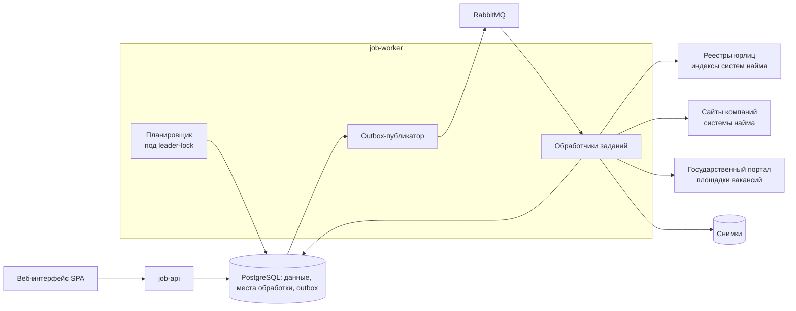
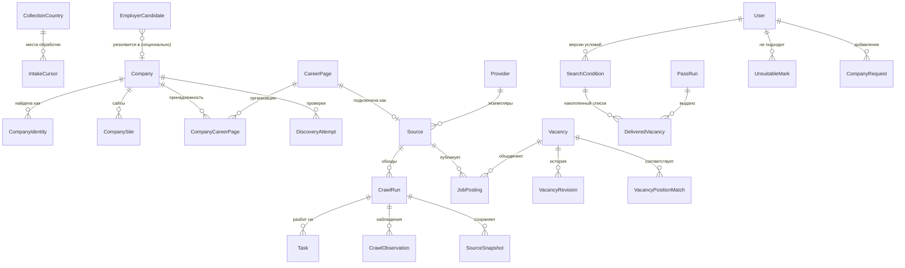

# Технический документ: Roleorienta

## Оглавление

1. Введение (назначение, связь с бизнес-описанием, глоссарий)
2. Обзор архитектуры (компоненты, диаграмма, принципы)
3. Технологический стек (выбор с обоснованием)
4. Модель данных (сущности, связи, инварианты)
5. Источники и адаптеры (контракт адаптера, обнаружение, принадлежность, лимиты)
6. Конвейер обработки (единицы работы, шаги, стадии)
7. Выдача пользователю (отбор, проходы, место остановки)
8. REST API (контракты и принципы)
9. Надёжность и качество данных
10. Безопасность и правовые правила
11. Наблюдаемость и показатели ядра
12. Развёртывание (Docker, профили, Kubernetes)
13. CI/CD и GitOps
14. Тестирование, приёмка и эксперименты
15. Этапность разработки
16. Архитектурные решения (выбор с обоснованием)
17. Значения по умолчанию

---

## 1. Введение

**Назначение документа.** Описывает технические решения и этапность разработки. Это рабочий
документ: он фиксирует, *что* строим и *почему именно так*, на уровне, достаточном чтобы начать
кодить; мелкие детали дорабатываются в коде. Документ реализует бизнес-описание приложения; ссылки
«бизнес-описание §N» ведут на его разделы.

**Связь с бизнес-описанием.** Страны, реестры и поддерживаемые форматы кадровых страниц — это
настройка и набор адаптеров, а не архитектурное решение: первая страна — Словакия, следующие
подключаются конфигурацией и новыми адаптерами реестров без изменения ядра. Вопросы, которые бизнес-описание
оставляет на реализацию (бизнес-описание §12), здесь решены; числовые значения — настройки, начальные значения в §17.

**Принцип изложения.** Ключевые решения сопровождаются кратким обоснованием; развёрнутые
обоснования — в §16. Конкретные версии библиотек фиксируются
перед реализацией после проверки совместимости.

**Принципы проектирования.** Проверенные, актуальные инженерные практики: API-first,
транзакционная согласованность и идемпотентность, наблюдаемость, воспроизводимое развёртывание —
без устаревших решений и без усложнения без необходимости. Неизвестное не угадывается. Всё, что
делает общий сбор, выполняется автоматически, без ручного подтверждения (бизнес-описание §4.2).

**Глоссарий.** Термины бизнес-описания (компания, система найма, доска, кадровая страница, общий
сбор, партия, проход, порция, лимит порции, накопленный список, место остановки — бизнес-описание §2)
используются в том же значении. Технические термины:

| Термин | Значение |
|---|---|
| **Провайдер** (`Provider`) | Тип интеграции: конкретная система найма (Workday, Personio, Greenhouse, SmartRecruiters, SAP SuccessFactors …), общий формат schema.org `JobPosting`, собственная страница вакансий сайта компании, государственный портал вакансий, площадка вакансий (profesia.sk); описывается capability-карточкой (§5) |
| **Источник** (`Source`) | Подключённая кадровая страница — доска системы найма, страница сайта с `JobPosting` или собственная страница вакансий — либо вакансии работодателя на государственном портале или площадке: адрес, провайдер, расписание, лимиты, состояние |
| **Канал вакансий** | Где работодатель публикует вакансии: своя кадровая страница (сайт, система найма), государственный портал вакансий страны, площадка вакансий. Замер этапа 0 (§15): у массовых работодателей вакансии обычно только в одном канале, поэтому используются все три; у каждой компании читается один, лучший (§5.1) |
| **Государственный портал вакансий** | Портал службы занятости страны, куда работодатели обязаны сообщать вакансии; Словакия — Služby zamestnanosti (`sluzbyzamestnanosti.gov.sk`). Даёт работодателя с регистрационным номером, его вакансии и указанный им сайт |
| **Площадка вакансий** | Частный сайт объявлений о работе (Словакия — profesia.sk); читается только при записанном основании использования (§10) |
| **Публикация** (`JobPosting`) | Запись вакансии в одном конкретном источнике |
| **Вакансия** (`Vacancy`) | Одна вакансия работодателя; объединяет одну или несколько публикаций (бизнес-описание §4.3) |
| **Обход** (`CrawlRun`) | Одно чтение списка публикаций источника; имеет область и признак полноты |
| **Находка** (`EmployerCandidate`) | Результат входа обнаружения (запись реестра, доска из индекса, запрос пользователя) до установления связи с компанией |
| **Гейт принадлежности** | Проверка, без прохождения которой кадровая страница не подключается (§5); неподтверждённое не подключается и перепроверяется позже |
| **Outbox** | Таблица исходящих событий: сообщение публикуется в брокер только если зафиксирована транзакция, его породившая |
| **Идемпотентность** | Повторная обработка того же события не создаёт дублей и побочных эффектов |
| **Leader-lock** | Блокировка в PostgreSQL, гарантирующая, что периодический тик выполняет одна реплика |

## 2. Обзор архитектуры

**Форма системы.** Один репозиторий, два развёртываемых приложения на Spring Boot (§16.1):

| Компонент | Ответственность |
|---|---|
| `job-api` | Учётные записи и вход; условия поиска; накопленный список и сведения о вакансии; отметки «не подходит»; запросы на добавление компании; показатели ядра для владельца; административные операции. Владеет схемой БД (миграции) |
| `job-worker` | Планирование под leader-lock; публикация outbox; общий сбор: приём компаний и партии стран, обнаружение сайта и кадровых страниц, гейт принадлежности, чтение источников, нормализация, объединение публикаций, состояния вакансий; предрасчёт соответствия; проходы выдачи; расчёт показателей |
| **PostgreSQL** | Данные продукта, история, задания, контрольные точки, места обработки и остановки, outbox |
| **RabbitMQ** | Доставка фоновых заданий (§16.2) |
| **Объектное хранилище** (S3-совместимое) | Снимки исходных ответов источников для повторной обработки (§16.10) |
| **Веб-интерфейс (SPA)** | Минимальный пользовательский интерфейс по бизнес-описанию §7.2 и экран показателей; отдельный фронтенд-артефакт, потребляющий REST API (§16.17) |

**Модули.** Обнаружение (компании, сайты, кадровые страницы), сбор (источники, обходы,
публикации), каталог вакансий (объединение, состояния, история), отбор, выдача, учётные записи,
показатели. Общая БД; отдельный сервис на этап обработки не требуется. Каждый тип системы найма —
один адаптер за общим контрактом.


```mermaid
flowchart LR
    SPA[Веб-интерфейс SPA] --> API[job-api]
    API --> DB[(PostgreSQL: данные, места обработки, outbox)]
    subgraph WK[job-worker]
      S[Планировщик<br/>под leader-lock]
      P[Outbox-публикатор]
      W[Обработчики заданий]
    end
    S --> DB
    DB --> P
    P --> Q[RabbitMQ]
    Q --> W
    W --> REG[Реестры юрлиц<br/>индексы систем найма]
    W --> SITES[Сайты компаний<br/>системы найма]
    W --> PORT[Государственный портал<br/>площадки вакансий]
    W --> DB
    W --> STORE[(Снимки)]
```

**Общий сбор и выдача развязаны (бизнес-описание §4).** Обнаружение и чтение источников идут непрерывно по
своим расписаниям; проход выдачи только читает уже собранные и отобранные данные. Общий сбор не
получает условий пользователей — только перечень стран сбора (бизнес-описание §4.1, §10).

**Единственность планировщика и публикатора при масштабировании (§16.4).** Планировщик и
outbox-публикатор — логические роли внутри `job-worker`: (1) тики — под **leader-lock в
PostgreSQL** с ограниченной арендой; (2) планирование **идемпотентно** — уникальный ключ на
окно расписания (`(источник, окно)`, `(участник, курсор)` партии, `(проход, время)`); (3) публикатор
захватывает события outbox через `SELECT … FOR UPDATE SKIP LOCKED`. `minReplicaCount: 1`
сохраняет роль планирования при простое очереди. Обработка заданий идёт параллельно на всех
репликах.

**Доставка заданий с первого этапа (§16.2).** Планировщик под leader-lock ставит задание и
outbox-событие в одной транзакции; публикатор отправляет его в брокер с publisher confirms и
проверкой маршрутизации; обработчики потребляют идемпотентно. KEDA-масштабирование по длине
очереди — этап 3, не меняет модель данных и контракты.

**Три очереди заданий (стенограмма §46, §51).** Очередь **сбора** — чтение источников, предрасчёт
соответствий, проходы выдачи; очередь **поиска** — приём реестра, скан сайтов, проверка кадровых
страниц, обратный путь, государственный портал, справочник GeoNames; очередь **адреса по названию** — шаги
3–4 поиска сайта (до 36 адресов на компанию, цепочка на дни). Очередь выбирается по типу
задания при публикации outbox; у каждой очереди своё число обработчиков (§17). Многочасовые цепочки
поиска не занимают обработчики сбора, поэтому вакансии читаются вовремя. На этапе 3 тот же `job-worker`
можно запускать отдельными экземплярами для каждой очереди настройкой, без изменения кода.

**Подход к интерфейсу (§16.17).** SPA (React, TypeScript, Vite) потребляет REST API
`job-api`; отдаётся как статический артефакт; интерфейс минимальный, чистый и адаптивный под
мобильный экран. OpenAPI UI — только для разработки и демонстрации.

## 3. Технологический стек

Колонка «Этап» — когда элемент нужен (§15); major-версии не обновляются автоматически.

| Область | Выбор | Обоснование / граница | Этап |
|---|---|---|---|
| Язык | Java 21 LTS | Долгая поддержка; целевая экосистема backend | 1 |
| Каркас | Spring Boot 4.1 | Web, DI, безопасность, данные | 1 |
| API и безопасность | Spring Web, Validation, Spring Security, OpenAPI | REST, валидация, роли и владелец, машинный контракт | 1 |
| Данные | PostgreSQL, Spring Data JPA, Flyway | Транзакции, массивы, частичные индексы, блокировки, версионируемые миграции | 1 |
| Очередь | RabbitMQ, Spring AMQP | At-least-once, подтверждения, DLQ; KEDA — этап 3 | 1 |
| Сбор | Apache HttpClient 5 за выделенным клиентом (§10: подменённое определение адреса проверяет каждое соединение); Jackson — JSON; StAX с защитой XXE — XML; Jsoup — разбор HTML (ссылки, реквизиты, JSON-LD, списки вакансий) | Структурированные ленты и разметка там, где они есть; HTML — для обнаружения, собственных страниц вакансий, государственного портала, площадок и систем найма без ленты (SuccessFactors, SmartRecruiters) | 1 |
| Снимки | S3-совместимое хранилище (локально MinIO) | Повторная обработка без нового внешнего наблюдения | 1 |
| Фронтенд | SPA (React), TypeScript, Vite | Отдельный артефакт, потребляет REST | 1 |
| Справочники | GeoNames (город → страна, CC BY 4.0); словарь регионов удалённой работы; словарь позиций — данные с версией | Детерминированный отбор без ручных списков в коде | 1 |
| Тесты | JUnit, Testcontainers, заглушки источников на встроенном HTTP-сервере JDK, ArchUnit | Интеграция на реальных PG/брокере; тестовые источники | 1 |
| Правила кода | Checkstyle, ArchUnit | Нарушение ломает сборку | 1 |
| Образы | Spring Boot `bootBuildImage` + Docker Compose | Один способ сборки | 1 |
| CI | GitHub Actions (компиляция, тесты, приёмка) | С первого дня | 1 |
| Проверка образов | Trivy + SBOM | Уязвимости и состав зависимостей | 4 |
| Kubernetes | Helm, KEDA, Gateway API + Envoy Gateway | Развёртывание, масштабирование по очереди | 3 |
| TLS и секреты | cert-manager + Sealed Secrets | Демо-кластер | 3 |
| Метрики и трассировка | Actuator, Micrometer, Prometheus, Grafana, OpenTelemetry, Tempo | Сквозные трассы и дашборды | 3 |
| GitOps | kind (smoke), Argo CD (демо) | Синхронизация демо-окружения | 4 |

**Границы стека.** PostgreSQL, RabbitMQ, объектное хранилище и два приложения достаточны. Kafka,
service mesh, поисковый кластер, Redis и LLM **не добавляются без отдельного требования**.

## 4. Модель данных

**Сущности.**

| Сущность | Назначение |
|---|---|
| `User` | Учётная запись: вход, роль (`USER`/`ADMIN`) |
| `CollectionCountry` | Страна общего сбора: активна ли (есть пользователь с этой страной), время последней партии, поколение и дата завершения первичного обхода (бизнес-описание §4.1) |
| `IntakeCursor` | Место обработки источника компаний: для реестра — в стране, для индекса систем найма — общее; курсор, граница поколения первичного обхода, время исчерпания |
| `EmployerCandidate` | Находка входа обнаружения: вход (реестр/индекс/запрос пользователя), исходные данные, статус резолва; **связь с `Company` необязательна** — находка существует до её установления |
| `Company` | Организация: страна регистрации, регистрационный номер, название, признак кадрового агентства, категория числа сотрудников (Словакия — RÚZ; нужна правилу «крупная компания», §5.1), поколение первичного обхода и дата первого итога проверки, срок перепроверки; атрибуция реестра (RPO — CC BY 4.0) |
| `CompanyIdentity` | Подтверждённая идентичность организации: регистрационный номер уникален в пространстве страны и реестра; домен и доска — связи с организациями, не глобальные уникальные идентификаторы юрлица. Обнаружение повторно использует установленную идентичность |
| `CompanySite` | Связь организации с сайтом и доказательством принадлежности (регистрационный номер на сайте; сайт или домен почты, указанные работодателем на государственном портале; бренд крупной компании — §5.1); организация может иметь несколько сайтов, сайт — несколько подтверждённых организаций |
| `CareerPage` | Кадровая страница с уникальным адресом (для Workday — тенант + сайт); связанные организации — через `CompanyCareerPage` |
| `CompanyCareerPage` | Проверенная связь организации и кадровой страницы: роль (**работодатель** или **размещающее агентство**), способ и дата подтверждения принадлежности; многие-ко-многим (одна доска может обслуживать несколько юрлиц группы) |
| `DiscoveryAttempt` | Попытка поиска/проверки компании: результат, причина, найденный формат, дата, срок перепроверки; адрес страницы необязателен |
| `CrawlObservation` | Наблюдения публикаций в текущем обходе; применяются к публикациям при завершении обхода (§6) |
| `Provider` | Тип интеграции и его **capability-карточка**: list/detail, пагинация, полнота перечисления, признак закрытия публикации, фасеты стран, семантика дат, условные запросы, требования доступа (§5) |
| `Source` | Подключённая кадровая страница: ссылается на `CareerPage` и `Provider`; расписание, лимиты, версия адаптера, доступность (`OK`/`TEMP_FAILING`/`UNAVAILABLE`), даты попыток и успехов |
| `SourcePermission` | Основание использования источника (бизнес-описание §10): область (провайдер — включая государственный портал и площадки, домен, агентство), решение, основание, дата проверки |
| `CrawlRun` | Обход источника: неизменная область (в т. ч. фильтр страны), конечное состояние (`COMPLETE`/`PARTIAL`/`FAILED`), вид отказа (временный / доступ запрещён / страница удалена), контрольная точка |
| `Task` | Фоновое задание любого типа (§6): тип, ключ идемпотентности, попытки, время следующей попытки, состояние, контрольная точка |
| `SourceSnapshot` | Исходный ответ источника: ключ в хранилище, хеш, время, версия адаптера |
| `JobPosting` | Публикация в источнике: внешний ID, адрес, исходные и нормализованные поля, текст (для отбора, не показывается), даты, счётчик полных обходов без публикации, явное закрытие |
| `Vacancy` | Вакансия: работодатель, агентство, позиция, страны выполнения работы, территория удалёнки, формат, пометки неопределённости страны и формата, состояние (`ACTIVE`/`NEEDS_RECHECK`/`CLOSED`), даты первого обнаружения и последнего подтверждения, ссылка на первичную публикацию |
| `VacancyRevision` | Изменение значимого поля: было → стало, публикация-источник, ревизия (история с первого обнаружения) |
| `Position` | Словарь позиций (данные с версией): каноническая позиция, эквивалентные названия, ключевые и исключающие признаки |
| `VacancyPositionMatch` | Предрасчитанное соответствие вакансии позиции: версия словаря и версия правил, объяснение (какое название и признак сработали) |
| `SearchCondition` | Условия поиска пользователя — **версия**: страны, позиция, формат; лимит порции; одна активная на пользователя (бизнес-описание §3) |
| `PassRun` | Проход по расписанию: время окна (уникально), состояние |
| `DeliveredVacancy` | Вакансия, выданная по версии условий: проход, время; уникальна в паре «версия условий + вакансия» — это накопленный список и место остановки (§7) |
| `UnsuitableMark` | Отметка «не подходит»: пользователь + вакансия; не зависит от версии условий (бизнес-описание §6) |
| `CompanyRequest` | Запрос пользователя на добавление компании: ввод, найденная компания, состояние и причина (бизнес-описание §5) |
| `FailedOperation` | Операция, не выполненная после всех попыток: тип, объект, причина, время — для показателей (бизнес-описание §4.6). Отдельной таблицы нет: роль выполняет задание (`task`) в состоянии `FAILED` — тип, параметры, `last_error`, число попыток, время (решение владельца, §23 стенограммы) |
| `CoreMetricDaily` | Показатель ядра: страна, день, показатель, разрез (формат, причина), значение (бизнес-описание §7.3) |
| `OutboxEvent` | Событие для надёжной публикации |

**Что из модели реализовано (на 2026-10-02, срезы §1–§43).** Таблицы: `company`, `company_site` (сайт,
найденный по IČO на странице из Common Crawl, итог проверки сайта), `company_source` (связь компании с
источником, роль работодатель / агентство — вместо `CompanyCareerPage`), `company_check` (последний итог
проверки компании — вместо `DiscoveryAttempt`), `discovered_board` и `cc_index_block` (доски из индекса
Common Crawl и место его обработки), `intake_cursor` (место обработки RPO), `collection_country`,
`source_permission` (области `PROVIDER` и `AGENCY`), `source`, `crawl_run`, `job_posting`, `vacancy`,
`vacancy_revision`, `source_snapshot`, `task`, `outbox_event`, `host_budget`, `geo_city`, `position`,
`vacancy_position_match`, `user_account`, `search_condition`, `pass_run`, `delivered_vacancy`,
`unsuitable_mark`, `portal_employer` (работодатели государственного портала, §45). Не реализованы: `EmployerCandidate`, `CompanyIdentity`, `CareerPage`, `CrawlObservation`,
`Provider` как таблица (провайдер — код в `source.provider`), `CompanyRequest` (1.9), `CoreMetricDaily`
(1.10); у `Company` нет поколения и срока перепроверки; категория размера — нижняя граница числа сотрудников из RÚZ (`employees_min`, §53). Источник портала — вакансии
одного работодателя, поэтому работодатель вакансии — компания источника (`company_source`), отдельное
поле работодателя не нужно; канал источника виден по провайдеру. Способ подтверждения
сайта — `company_site.proof`, статус — `company_site.status` (находка / кандидат; §48); источник находки —
`company_site.source` (`COMMON_CRAWL`, `STATE_PORTAL`; с §49 и §51 — `WIKIDATA`, `NAME`); адрес стартовой
страницы — `company_site.start_url` (адрес с портала с путём; `NULL` — главная хоста; §50).

**Ключевые связи** (целевая модель).


```mermaid
erDiagram
    CollectionCountry ||--o{ IntakeCursor : "места обработки"
    EmployerCandidate }o--o| Company : "резолвится в (опционально)"
    Company ||--o{ CompanyIdentity : "найдена как"
    Company ||--o{ CompanySite : "сайты"
    Company ||--o{ CompanyCareerPage : "принадлежность"
    CareerPage ||--o{ CompanyCareerPage : "организации"
    Company ||--o{ DiscoveryAttempt : "проверки"
    CareerPage ||--o| Source : "подключена как"
    Provider ||--o{ Source : "экземпляры"
    Source ||--o{ CrawlRun : "обходы"
    CrawlRun ||--o{ Task : "разбит на"
    CrawlRun ||--o{ CrawlObservation : "наблюдения"
    CrawlRun ||--o{ SourceSnapshot : "сохраняет"
    Source ||--o{ JobPosting : "публикует"
    Vacancy ||--o{ JobPosting : "объединяет"
    Vacancy ||--o{ VacancyRevision : "история"
    Vacancy ||--o{ VacancyPositionMatch : "соответствует"
    User ||--o{ SearchCondition : "версии условий"
    SearchCondition ||--o{ DeliveredVacancy : "накопленный список"
    PassRun ||--o{ DeliveredVacancy : "выдано"
    User ||--o{ UnsuitableMark : "не подходит"
    User ||--o{ CompanyRequest : "добавления"
```

**Инварианты и ограничения (обязательны к реализации).**

- **Одна организация — одна запись** (бизнес-описание §4.1). `CompanyIdentity` уникален для подтверждённого регистрационного признака в пространстве «страна + реестр + номер»; любой вход сначала ищет установленную идентичность. Домен и доска — связи, а не ключи юрлица: два юрлица с общим доменом или доской остаются разными компаниями, каждая связь подтверждается отдельно. У компании без регистрационного номера (доска иностранной
  компании, правило 3) идентичность — домен подтверждённого сайта.
- **Кадровая страница учитывается один раз** (бизнес-описание §4.2): адрес уникален; для Workday адрес — тенант
  + сайт (у тенанта может быть несколько досок). У каждой проверенной компании есть итог проверки
  с причиной, даже если страница не найдена.
- **Публикация уникальна** в паре «источник + внешний ID»; внешние ID разных источников глобально
  уникальными не считаются.
- **Одна вакансия — одна запись** (бизнес-описание §4.3). Новая публикация присоединяется к
  существующей вакансии той же компании при надёжном признаке (§6), иначе создаёт новую вакансию;
  существующие вакансии между собой не объединяются. Значения публикаций хранятся раздельно;
  расхождение источников по стране или формату — **пометка неопределённости**, а не выбор одного
  значения (бизнес-описание §4.3, §4.4).
- **Закрытие и полнота обхода — с первого сбора.** Раздельно хранятся `lastAttemptAt`,
  `lastSuccessfulFetchAt`, `lastConfirmedAt`, `lastCompleteRunAt`; `CrawlRun` имеет конечные
  состояния. Отсутствие засчитывается только по **завершённому полному** обходу той же области;
  частично разобранный `200 OK`, страница ошибки с кодом 200, оборванная пагинация и отказ не
  увеличивают счётчик отсутствия. Пропажа из списка, отфильтрованного по стране или формату, подтверждает
  отсутствие только после проверки публикации отдельным запросом (§5). Закрытие — при явном закрытии в источнике или N полных обходах
  подряд без публикации (N — настройка, §17), **во всех** источниках вакансии.
- **Состояния вакансии** (бизнес-описание §4.3): `ACTIVE` — хотя бы одна публикация подтверждена последним обходом своего источника (полным; впервые увиденная — и неполным); неполный обход или отказ снимает подтверждение ранее известных публикаций этого источника, не стирая `lastConfirmedAt`; `CLOSED` — по правилу выше; иначе `NEEDS_RECHECK`. Состояние
  «актуальна» не утверждает, что работодатель продолжает подбор.
- **Срок без подтверждения** (по умолчанию 30 дней от `lastConfirmedAt`) скрывает вакансию из
  накопленных списков, но **не меняет состояние**: условие проверяется в запросах выдачи, поэтому
  после успешного обхода вакансия возвращается сама и не становится новой.
- **Закрытие не удаляет историю.** Повторное появление закрытой публикации — та же вакансия
  снова `ACTIVE`, ревизия «опубликована снова» (предложение по бизнес-описанию §12).
- **`VacancyRevision` ведётся с первого обнаружения**; технические изменения ленты или HTML ревизию
  не создают.
- **Идентичность наблюдения отделена от версии интерпретации.** Хранятся отдельно:
  наблюдение (время получения, версия источника), версия интерпретации (адаптер, нормализация,
  словарь позиций). Текущее состояние публикации обновляется **условно** при завершении обхода по правилам §6 (монотонное поколение
  обхода): устаревшее задание не перезаписывает свежие данные. **Повторная обработка снимка не
  меняет `lastConfirmedAt`** и не делает вакансию «свежей».
- **Страна выполнения работы, территория удалённой работы и формат — раздельные поля**, каждое с
  явным «не указано»; «удалённо» не подтверждает страну (бизнес-описание §3).
- **Кадровое агентство не подставляется в работодателя** (бизнес-описание §6): роль в `CompanyCareerPage` и
  отдельные поля вакансии; владелец доски не становится работодателем вакансии автоматически.
- **Накопленный список** (бизнес-описание §4.5): `DeliveredVacancy` уникальна в паре «версия условий +
  вакансия» — вакансия выдаётся по условиям не более одного раза; смена условий создаёт новую
  версию с пустым списком; предыдущая версия не используется.
- **Отметка «не подходит»** уникальна в паре «пользователь + вакансия», не зависит от версии
  условий и не влияет на вакансию и общий сбор (бизнес-описание §6).
- **Персональные записи** (`SearchCondition`, `DeliveredVacancy`, `UnsuitableMark`,
  `CompanyRequest`) доступны только владельцу; административная роль не даёт доступа к чужим
  условиям и спискам.
- **Места обработки и остановки долговечны** (бизнес-описание §4.6): курсоры, партии, контрольные точки
  обходов и накопленные списки — строки БД, фиксируемые в той же транзакции, что и результат шага.
- **Сроки снимков** (§16.10): raw-ответ хранится ограниченное время; удаление снимка не
  удаляет публикацию, вакансию и историю; метаданные удалённого снимка сохраняются.
- **Уникальные ограничения** — на находки, компании, кадровые страницы, публикации, задания,
  выдачу, порции проходов, отметки и проходы (защита от дублей при повторной обработке).
- **Индексы** выбираются по реальным запросам (прежде всего запрос прохода, §7) и проверяются
  планами выполнения.

## 5. Источники и адаптеры

**Контракт адаптера (§16.6).** Каждый `Provider` реализует единый интерфейс: распознать свой
формат по адресу или разметке; получить профиль доски (ссылки на сайт компании — для взаимной
ссылки; признаки агентства); получить список публикаций **в области источника** с пагинацией и
**признаком полноты**; получить одну публикацию, если в списке не хватает полей; вернуть поля в
общем виде (включая явный признак закрытия, если формат его даёт). Один адаптер обслуживает все
доски этого формата; версия адаптера участвует в версионировании интерпретации.

**Поддерживаемые форматы первого этапа (граница охвата, бизнес-описание §4.2).** Первые пять строк
реализованы (§6–§38 стенограммы); остальные выбраны замером этапа 0 (§15, стенограмма §44) и
добавляются срезами §45–§49 в порядке таблицы `docs/next-step.md` (портал — §45, реализован).

| Провайдер | Формат | Как читается |
|---|---|---|
| Workday | JSON | `https://<tenant>.<dc>.myworkdayjobs.com/wday/cxs/<tenant>/<site>/jobs` (POST, `offset/limit`, фасет страны; нет его — фасет мест с названием страны в подписи, «Slovakia - Bratislava»); деталь — по `externalPath`: текст и места (`location`, `additionalLocations`; в списке вместо них бывает сводка «2 Locations») |
| Personio | XML | `https://<компания>.jobs.personio.de/xml` (или `.com`) |
| Greenhouse | JSON | `https://boards-api.greenhouse.io/v1/boards/<доска>/jobs?content=true`; деталь с `pay_transparency` — не нужна на первом этапе |
| SmartRecruiters | HTML | Список — `https://careers.smartrecruiters.com/<компания>?search=&page=N` (группы по месту; число страниц объявлено на первой — `data-groups-pages`, читаются все); текст — страница вакансии `https://jobs.smartrecruiters.com/<компания>/<id>`, микроразметка schema.org `JobPosting`. `api.smartrecruiters.com` не используется (запрещён robots.txt). Решение владельца (§35) |
| schema.org `JobPosting` | JSON-LD на страницах сайта | Страницы вакансий на домене сайта, найденные по ссылкам с кадровой страницы; с самой кадровой страницы берутся только ссылки; потолок числа страниц — настройка |
| Государственный портал (Словакия — Služby zamestnanosti), реализован в §45 | HTML | Портал показывает свои вакансии и объявления площадок (profesia.sk, kariera.sk, worki.sk, EURES) и сам привязывает их к IČO работодателя. **Источник — вакансии одного работодателя** (провайдер `sluzbyzamestnanosti`, доска — IČO): `/pracovne-ponuky?firma=<IČO>&pageSize=50&pageNr=<N>`; карточка — название, работодатель, место, ссылка (своя вакансия портала — `/pracovne-ponuky/<uuid>`, объявление площадки — ссылка на неё); внешний ID — uuid, `profesia:<номер>` или адрес объявления; текста в списке нет — отбор по названию. Чтение полное, только если прочитано столько вакансий, сколько объявил портал («8 pracovných ponúk»), иначе `PARTIAL`. **Работодатели** — список `/zamestnavatelia?pageSize=200&pageNr=<N>` (около 27 800: название, IČO; число в нём — только свои вакансии портала, поэтому наличие вакансий проверяется запросом `?firma=<IČO>`). Деталь вакансии (`/pracovne-ponuky/<uuid>`: «Internetová adresa», контактное лицо) читается только для сайта работодателя (§47): поля «IČO», «Názov spoločnosti», «Internetová adresa» и домен почты контакта (адрес собирает скрипт `let host = "…"`); контакт не сохраняется (§10). robots.txt запрещает только `/pracovne-ponuky/*/reagovat` |
| Площадка profesia.sk (напрямую) | HTML | Не нужна для Словакии: её объявления приходят через государственный портал с IČO работодателя (§45; по замеру 2026-10-02 — 11 853 объявления profesia.sk на портале; карточек profesia.sk, которых нет на портале, — 6 из 500). Карточки работодателей — из карты сайта `https://www.profesia.sk/sitemap.php` (`/praca/<slug>/C<id>`); читается напрямую, только если понадобится и после записи основания (§10) |
| Собственная страница вакансий | HTML на сайте компании | Кадровая страница сайта без системы найма и без разметки: вакансии ссылками на отдельные страницы или перечислены текстом (у 24 из 29 кадровых страниц мелких фирм замер не нашёл ссылок на отдельные вакансии; текст это, скрипт, виджет площадки или пустая страница — уточняется в срезе §49). Читаются названия вакансий, ссылки, место; страница принимается как список вакансий, только если в ней распознаны позиции (§16.6). Внешний ID — собственный адрес вакансии, иначе нормализованное название; адрес самой страницы списка не служит ключом объединения. Ноль позиций на странице, где раньше они были, — обход `PARTIAL` (сбой разбора, а не закрытие), кроме явной фразы «нет вакансий» (`nemáme voľné pozície` и т. п.). Срез §49 |
| SAP SuccessFactors (Recruiting Marketing) | HTML | Кадровый сайт группы (`careers.<бренд>.com`, `jobs.<бренд>.com`, ресурсы `rmkcdn.successfactors.com`); список — `/search/?locationsearch=<страна или город>&startrow=<N>` по 25, вакансии — `/job/<место>-<название>/<id>/`; фильтр по месту обязателен (сайт группы общий для всех стран). Срез §48 |

Другие системы найма (Nalgoo, Teamio/jobs.cz, Taleo, Phenom, Eightfold, Avature, Radancy, Lever,
Workable, Recruitee …) добавляются по доле, которую покажут замер и показатели ядра (бизнес-описание
§4.2, §7.3), — одним адаптером каждая (§16.6). Кадровая страница, в которой не распознан ни один
поддерживаемый формат, не читается; компания сохраняется с причиной «формат не поддерживается».

**Ключ доски** (`source.board`, `discovered_board.board`) хранится в нижнем регистре: Workday,
Greenhouse, Personio и SmartRecruiters регистр в адресе доски не различают, поэтому ссылки
`…/AccentureCareers` и `…/accenturecareers` — одна доска (стенограмма §36).

**Capability-карточка.** Адреса выше — ориентиры; контракт каждого провайдера проверяется
при подключении по официальной документации и фиксируется карточкой: list/detail, пагинация,
полнота перечисления, явный признак закрытия, фасеты стран, семантика дат, условные запросы,
доступ. Известные нюансы: Personio — язык ленты это язык витрины, не требование; Workday —
endpoint де-факто открыт, но не документирован как публичный контракт: хрупкость фиксируется и
отслеживается показателем неудачных обходов по провайдеру; `JobPosting` — обход полный, только если прочитаны все найденные страницы вакансий; упор в потолок даёт `PARTIAL` с причиной «превышен потолок страниц», видимой в показателях источников.

**Фильтр по стране.** Провайдер, читаемый с фильтром по стране или месту (фасеты Workday; поиск по
месту SuccessFactors — сайт группы общий для всех стран), подтверждает
отсутствие публикации только отдельным запросом её детали: не найдена — отсутствие засчитано;
найдена — обновляются её сведения, закрытия нет (бизнес-описание §4.3).

**Деталь — из сохранённого ответа.** Если список уже содержит нужные поля, отдельный запрос на
каждую публикацию не делается.

### 5.1 Обнаружение (общий сбор компаний и кадровых страниц)

Слой обнаружения — отдельный от сбора, **полностью автоматический** (§16.9): `находка →
компания → сайт → кадровые страницы → гейт принадлежности → формат → разрешение → подключение`.
Каждый шаг заканчивается записью итога с причиной (бизнес-описание §4.2). Вакансии работодателя на
государственном портале и площадке подключаются отдельным путём: `работодатель на портале/площадке →
компания по регистрационному номеру или подтверждённой ссылке → разрешение → подключение`.

**Что показал замер этапа 0 (2026-10-02, стенограмма §44).** 500 случайных работодателей Словакии
с 10+ сотрудниками (из ~22 300 по RÚZ) и 50 крупнейших; только бесплатные источники; срез на одну дату.

| Канал (что именно найдено) | 500 случайных | только этот канал | Топ-50 | только этот канал |
|---|---|---|---|---|
| Государственный портал — активные вакансии работодателя на 2026-10-02 | 51 | 38 | 19 | 0 |
| profesia.sk — карточка работодателя, сопоставленная по названию (есть ложные пары; наличие объявлений не измерено) | 55 | 35 | 27 | 5 |
| Государственный портал вместе с объявлениями площадок (повторный подсчёт 2026-10-02, запрос `?firma=<IČO>`) | 95 | | 39 | |
| Своя кадровая страница — страница с кадровыми словами на сайте, подтверждённом IČO или Wikidata (у топ-50 — и по бренду); наличие вакансий не проверялось | 29 | 14 | 36 | 13 |
| Хотя бы один канал | 109 (22 %) | | 46 (92 %) | |

Выводы, на которых строится обнаружение: у крупных компаний главный канал — своя кадровая страница
(часто на сайте группы: `careers.`/`jobs.`/`kariera.`), портал и площадка у них в основном дублируют
её; у массовых работодателей своей кадровой страницы обычно нет, их вакансии видны только на портале
(38) или только на profesia.sk (35). У остальных случайных работодателей канал не найден доступными
способами (у 239 из 391 не найден сайт; 19 % выборки — школы, общины, учреждения). Повторный подсчёт
показал, что портал собирает и объявления площадок с привязкой к IČO: вместе с ними на портале 95 из 500
случайных работодателей и 39 из 50 крупнейших; портал и своя кадровая страница вместе — 107 из 113
работодателей с хотя бы одним каналом и 46 из 46 у крупных; карточек profesia.sk вне портала — 6. Отсюда
два основных канала — своя кадровая страница и государственный портал — и правило «один канал на
компанию» (ниже).

**Один канал на компанию (бизнес-описание §4.1).** Вакансии компании берутся из одного канала —
лучшего из подключённых: своя кадровая страница (сайт или система найма) → государственный портал →
площадка. Появился канал выше — нижний для этой компании перестаёт читаться, его публикации больше не
подтверждаются и уходят по общим правилам (срок без подтверждения); закрытием это не считается.
Так одна вакансия не приходит пользователю из разных каналов, а объединение публикаций (§6, §16.14)
остаётся в пределах одного канала (сайт с `JobPosting` и система найма той же компании). Вакансия,
которую компания выложила только в нижнем канале, не собирается — принятое ограничение.

**Входы обнаружения (источники компаний, бизнес-описание §4.1).**

1. **Реестры юрлиц** — основной вход (§16.8). Все действующие юрлица страны, без фильтра по
   отрасли и размеру. Словакия — RPO (CC BY 4.0). Решение (§24 стенограммы): не поисковый API (нужен фильтр, не больше 500 записей на запрос — полный перебор ненадёжен), а выгрузки в открытом S3-совместимом хранилище: полная (раз в месяц, файлами) читается один раз потоком, порциями с курсором «выгрузка × файл × запись», затем ежедневные с изменениями; цепочка ежедневных прервана (хранятся 45 дней) — снова с полной. Берутся действующие юрлица, включая органы власти и города; предприниматели-физлица — нет. Каждая страна — адаптер реестра.
2. **Индексы систем найма** — дополнительный вход. Индекс URL Common Crawl — для досок, где
   идентификатор в пути (Workday даёт сразу `tenant/site`, Greenhouse, SmartRecruiters) и для Personio
   (поддомены `jobs.personio.de/.com` есть в индексе); Certificate Transparency — план для других
   поддоменных систем (Recruitee). Доски проверяются на
   наличие вакансий в странах сбора независимо от страны регистрации владельца.
3. **Государственный портал вакансий страны** (Словакия — Služby zamestnanosti; решение владельца
   2026-10-02; реализовано в §45) — канал вакансий вместе с объявлениями площадок (profesia.sk,
   kariera.sk …), которые портал привязывает к IČO. Раз в неделю читается список работодателей портала
   (`portal_employer`); каждый работодатель, который есть в реестре (по IČO), не кадровое агентство
   (SK NACE 78) и у которого нет своего источника, проверяется запросом `?firma=<IČO>` — частями
   (задание `STATE_PORTAL`), повтор через 7 дней. Есть вакансии — подключается источник портала этого
   работодателя и связь с компанией (роль «работодатель»). Предприниматели-физлица и работодатели вне
   реестра не берутся (решение владельца). Портал не входит в критерий первичного обхода — граница
   обхода по-прежнему у реестра. У подключённого работодателя без сайта сайт берётся из детали его
   вакансии на портале (шаг `site` того же задания, раз в день; §47) — см. «Сайт компании» ниже.
3а. **Площадки вакансий напрямую** — для Словакии не нужны: объявления profesia.sk и kariera.sk приходят
   через портал. Подключаются, только если понадобится, при записанном основании использования (§10);
   связь карточки с юрлицом — способом, выбранным замером (по первым словам названия — ложные пары).
4. **Ручное добавление пользователем** (бизнес-описание §5) — та же цепочка с приоритетом (ниже).
5. **Dun & Bradstreet** — при наличии лицензии; вне первого этапа.

**Реализация (стенограмма §41).** `collection_country` — страны из активных условий пользователей
(тик раз в час), время и число партий; адаптер реестра страны — `CountryRegistry` (Словакия —
`RpoRegistry`, место обработки — `intake_cursor`); задание `REGISTRY_INTAKE` читает одну партию
страны и ставит партию следующей в очереди страны (самая старая последняя партия). Индекс систем
найма идёт своей цепочкой (`BOARD_DISCOVERY`), не через эту очередь; доски проверяются на вакансии в
активных странах сбора, подключаются как источник первой такой страны (`discovered_board.country`).
Скан сайтов `.sk` и проверка сайтов идут только для активных стран сбора; источник, найденный на сайте
компании, получает страну компании. Первичный обход страны завершён (`first_pass_done_at`), когда
реестр прочитан до конца (`registry_read_at`) и у каждой действующей компании страны есть итог
проверки (`company_check`) — стенограмма §42.

**Партии и чередование стран — целевая схема (бизнес-описание §4.1; реализовано упрощённо — абзац
«Реализация» выше: индекс систем найма идёт своей цепочкой, находок и `CHECK_COMPANY` нет).** Тик под leader-lock выбирает участника очереди с
самым старым временем последней партии — активную страну (у неё входы по очереди, начиная с реестра) или
индекс систем найма (он не привязан к стране и имеет свой курсор) — и ставит задание
`INTAKE_BATCH` с ключом «участник + курсор»; одновременно у участника не больше одного такого
задания. Обработчик читает партию (размер — настройка) от курсора — HTTP-запрос вне транзакции, —
затем **одной транзакцией** создаёт находки, задания `CHECK_COMPANY` с outbox-событиями и сдвигает
курсор. Так партии чередуются (А, Б, А …), место каждого участника сохраняется, а повтор задания
не создаёт дублей. Страны сбора — объединение стран активных условий поиска; страна, которую сняли все пользователи, выходит из
чередования партий, а уже подключённые источники продолжают читаться (бизнес-описание §4.3, §5).

**Первичный обход** страны — поколение с зафиксированной границей каждого входа. Он завершён,
когда курсоры исчерпаны до границы **и** каждая компания поколения получила итог первой проверки
(в т. ч. отказ с причиной). Записи после границы относятся к следующему поколению. Компании без
кадровой страницы перепроверяются через срок (§17).

**Сайт компании — алгоритм версии 3** (замер 2026-10-05, решение владельца зафиксировать; стенограмма
§48; скрипт замера `survey/site-search.py` вне репозитория). Только бесплатные источники. Каскад: каждый
следующий шаг — только для компаний без найденного сайта; от быстрых и надёжных к медленному.

1. **Wikidata** — постраничный SPARQL-запрос всех пар P8174 (IČO) → P856 (официальный сайт) раз в сутки
   (задание `SITE_WIKIDATA`, реализовано в §49); у компаний без найденного сайта сайт открывается: открылся —
   находка `WIKIDATA`; закрыт для программы (401/403, robots.txt) — находка `WIKIDATA_403`; не существует или
   удалён — кандидат; временный отказ — повтор следующим заданием. Основание — CC0 (`source_permission`,
   провайдер `wikidata`); robots.txt сервиса к запросу не применяется (решение владельца, §10). Пар
   «словацкий IČO → сайт» в Wikidata ~470 (2026-10-05). Почти только крупные компании.
2. **Государственный портал** — «Internetová adresa» из вакансии работодателя полным адресом
   (`STATE_PORTAL`, без проверки: адрес указал сам работодатель рядом со своим IČO; адрес с путём —
   стартовая страница поиска кадровой страницы, `company_site.start_url`); иначе домен почты контакта (не
   общий почтовый сервис, со словом или инициалами названия) — открывается `www.<домен>` и проверяется
   общим компонентом проверки сайта (`SiteVerifier`: IČO рядом с подписью на главной или на 1–2 ссылках
   реквизитов с неё, иначе бренд по правилам шага 4): IČO или бренд — `PORTAL_MAIL`; закрыт для программы
   (401/403, robots.txt) — `PORTAL_MAIL_403`; открылся без подтверждения — `GROUP_SITE` (находка: почта на
   домене самого работодателя); не существует — сайта нет; временный отказ — повтор следующим заданием.
   Реализовано в §50.
3. **Адрес по названию — IČO.** Адреса из бренда названия (`бренд.sk`, `бренд-slovakia.sk`,
   `бренд.com/sk`, `бренд(-)slovensko.sk`, `бренд(-)jobs.sk`, `бренд-kariera.sk`, `kariera.бренд.sk`,
   «A & B» → `aandb`); IČO рядом с подписью в видимом тексте главной или 1–2 ссылок реквизитов с главной
   (kontakt, impressum, ochrana osobných údajov, obchodné podmienky, o nás) — `REGISTRATION_NUMBER`.
4. **Адрес по названию — бренд.** Бренд в первом слове домена и отдельным словом в видимом тексте
   (без script/style, без диакритики; у названия из двух слов и больше — два первых слова: слитно в домене,
   подряд в тексте — первое слово бывает нарицательным, стенограмма §51), не меньше 30 слов, не заглушка; сайт не в `.sk` — только при признаке Словакии
   (slovensk…, slovakia, сегмент пути `/sk/`); бренд до 3 букв — ещё и в заголовке; общие слова названия
   брендом не считаются — `BRAND`. Кандидаты (`status = CANDIDATE`, поиск продолжается): международный
   сайт группы с брендом в адресе (`GROUP_SITE`; находка, если тот же домен дал другой источник) и ответ
   403 по `www.бренд.sk` / `www.бренд.com` (`HTTP_403`). Шаги 3–4 реализованы в §51 (задание `SITE_NAME`, своя
   очередь, `company_site.source = NAME`): для компаний с признаком найма — у компании есть источник вакансий
   (портал или доска системы найма; решение владельца) или с 10+ сотрудниками по RÚZ (§53: задание
   `COMPANY_SIZE`, RÚZ Open API, CC0, `company.employees_min`); одна находка — первая по IČO, иначе первая по бренду,
   иначе сайт группы со вторым источником; без находки — кандидаты. Повтор — через срок (§17). Адрес, домен
   которого не существует, — постоянный отказ HTTP-клиента (`NO_SUCH_HOST`): не повторяется и не ждёт бюджета
   хоста.
5. **Common Crawl** — IČO на странице сайта зоны `.sk` в архиве (§25, `REGISTRATION_NUMBER`).

Кандидат не проверяется поиском кадровой страницы и не меняет итог компании. При нескольких находках
основной — найденный сайт самого раннего шага (Wikidata, портал, по названию с IČO, по названию с брендом или
сайтом группы, Common Crawl; при равенстве — записанный раньше): поиск кадровой страницы проверяет только его,
итог компании — его итог (§52 стенограммы, `CareerScanRepository`). Замер версии 3: топ-50 — сайт у 45 из 50, чужих 0;
50 из топ-200 — 32, чужих 3. Снято замером: OpenStreetMap, карточка profesia.sk.

**Сайт компании — прежнее описание** (замер этапа 0; заменено алгоритмом версии 3 выше, сохранено для
истории решений). Реализованы п. 1 (§47 стенограммы) и п. 2 в части Common Crawl (§25):

1. **Государственный портал** — поле «Internetová adresa» и домен почты контактного лица (кроме
   общих почтовых сервисов: gmail, azet, zoznam, centrum и т. п.) в карточке вакансии работодателя.
   Сайт указал сам работодатель рядом со своим IČO. Домен почты принимается, только если содержит слово
   названия компании или инициалы его слов (`zsr.sk` — «Železnice Slovenskej republiky»): почта бывает на
   домене бухгалтера, агентства. Реализация (§47): у работодателя с подключённым порталом и без сайта —
   первая своя вакансия портала (`/pracovne-ponuky/<uuid>`) в первой странице его списка; IČO детали
   сверяется; работодатель только с объявлениями площадок сайта отсюда не получает. Сайт записывается в
   `company_site` (`source = STATE_PORTAL`, доказательство — адрес детали) и проверяется поиском кадровой
   страницы; своя кадровая страница затем важнее портала (один канал на компанию). Контакт не хранится. По замеру — у 39 из 51 работодателя с вакансиями
   на портале; 17 из них другими способами не находились, у 9 указанный сайт расходится с угаданным по бренду. Даёт
   и сайт группы (Swiss Re — `swissre.com`).
2. **Регистрационный номер на сайте** — Common Crawl (страницы контактов и главные страницы зоны
   `.sk`, решение §25 стенограммы) и проверка кандидатов из пунктов 3–4 на живом сайте: главная,
   контакты, реквизиты (`/kontakt`, `/o-nas`, `/impressum`, `/pravne-informacie` …). По замеру IČO
   нашёлся на 79 из 500 проверенных сайтов (16 %); Common Crawl в замере не применялся.
3. **Wikidata** (P8174 «словацкий регистрационный номер» → P856 «официальный сайт») — в основном
   крупные компании (16 из 50).
4. **Домен из бренда — только для крупных компаний** (категория числа сотрудников из реестра не ниже
   настройки, §17): `бренд.sk`, `бренд-slovakia.sk`, `брендslovakia.sk`, `бренд.com/sk/`,
   `бренд.com/slovakia/`, `бренд.com`; бренд — первое слово и первые два слова названия без
   правовой формы. По замеру у крупных сайт найден у 43 из 50 (из них по бренду 24, одна явная ошибка:
   Slovenské elektrárne → `slovenske.sk`); у мелких фирм название — одно-два общих слова, и домены
   часто чужие (`hp.com` для HP STROJÁRNE, `novo.sk` для Novo Nordisk; у 9 из 13 мелких фирм с сайтом на
   портале домен по бренду не совпал с указанным) — поэтому для них правило не применяется.
5. OpenStreetMap (`ref:ico` + `website`) — около 660 IČO в Словакии, в основном органы власти;
   дополнение, не основной путь.

Каталоги фирм с полем сайта (Zoznam, Azet, Kompass) не используются — их условия запрещают
автоматическое извлечение; реестры (RPO, RÚZ, ORSR) и сервисы finstat, indexpodnikatela и т. п. поля
сайта не имеют (замер §44). Обратный путь — доски систем найма и страницы с `JobPosting` из Common
Crawl / Web Data Commons — сохраняется: доска с вакансиями в Словакии подключается и без
подтверждённой связи с юрлицом (решение владельца, §27 стенограммы).

**Сайт закрыт для программы (§47).** Сайты крупных компаний часто отвечают на запрос программы отказом
(403: Tesco, Tatra banka, Alza, Panasonic, `swissre.com`), хотя открываются в браузере. Ограничения
доступа не обходятся (бизнес-описание §10): User-Agent остаётся честным. Сайт с такой принадлежностью,
подтверждённой порталом или Wikidata, сохраняется как сайт компании, и поиск кадровой страницы
продолжается на пробных кадровых адресах его домена (ниже); кадровый сайт группы обычно открыт
(`careers.swissre.com`). Если не найдено ничего — итог сайта `UNREACHABLE`, у компании
`SOURCE_UNAVAILABLE`; повтор — через срок перепроверки (§17).

**Поиск кадровой страницы на сайте** (§47; реализовано всё, кроме адресов по бренду в другой зоне и
отбрасывания сайтов продажи доменов). По замеру у крупных найдено 36 из 50:
- ссылка с главной по подписи или адресу: «Kariéra», «Práca u nás», «Práca v …», «Pre uchádzačov»,
  «Voľné pracovné miesta / pozície», «Pracovné ponuky», «Poďte k nám», «Pridaj sa», «Careers»,
  «Jobs», «Join us», «Work with us»; ссылка в подвале страницы (раздел «O nás») — обычное место;
- ссылка допускается на тот же сайт, на поддомен его домена, на систему найма или на адрес со словом
  `kariera`/`career`/`jobs`/`praca`; сайты продажи доменов и подвал площадок отбрасываются;
- если ссылки нет или главная закрыта для чтения — пробные адреса: `/kariera`, `/sk/kariera`,
  `/careers`, `/pre-uchadzacov`, `kariera.<домен>`, `jobs.<домен>`, `careers.<домен>` (реализовано);
  `jobs.<бренд>.com`, `careers.<бренд>.com`, `<бренд>-jobs.sk` — вместе с сайтом по бренду;
  перенаправление `/kariera` на отдельный кадровый сайт — частый случай (Alza, Tesco); пробный адрес
  засчитывается, только если в заголовке страницы (`title`, `h1`) есть кадровое слово — иначе это
  заглушка сайта, отвечающая на любой адрес;
- если на найденной странице нет вакансий, а есть ссылка «voľné pozície» и подобная — один шаг вглубь;
- кадровая страница считается найденной, если на ней есть кадровые слова; формат определяет адаптер.

**Принадлежность сайта (правило 1 бизнес-описания §4.2)** подтверждается одним из способов:

| Способ | Когда применяется | `company_site.proof` |
|---|---|---|
| Регистрационный номер компании рядом с подписью на страницах сайта (IČO в Словакии, номер Firmenbuch в Австрии) | Всегда | `REGISTRATION_NUMBER` |
| Сайт указан работодателем на государственном портале рядом с его регистрационным номером | Всегда | `STATE_PORTAL` |
| Домен почты контакта с портала: на сайте IČO или бренд / сайт отвечает 403 | Всегда | `PORTAL_MAIL` / `PORTAL_MAIL_403` |
| Сайт из Wikidata по регистрационному номеру (P8174 → P856): открылся / отвечает 403 | Всегда | `WIKIDATA` / `WIKIDATA_403` |
| Бренд из названия — в домене сайта и в видимом тексте его страницы (правила шага 4 алгоритма) | Компании с признаком найма или с 10+ сотрудниками по RÚZ (§5.1, решение владельца) | `BRAND` |
| Международный сайт группы: домен почты работодателя с портала или бренд в адресе, подтверждённый другим источником | Всегда; без второго источника — кандидат | `GROUP_SITE` |
| Угаданный адрес отвечает 403 | Только кандидат | `HTTP_403` |

**Гейт принадлежности кадровой страницы — правила 2 и 3 бизнес-описания §4.2:**

| Правило | Способ подтверждения | `ownership` |
|---|---|---|
| 2 (домен) | Страница или доска на домене подтверждённого сайта или его поддомене (`kariera.`, `jobs.`, `careers.`); у крупной компании — и на кадровом поддомене того же бренда в другой зоне (`jobs.<бренд>.com` при сайте `<бренд>.sk`) | `SITE_DOMAIN` |
| 2 (ссылка) | Подтверждённый сайт ссылается на неё как на страницу вакансий компании (в т. ч. через перенаправление с `/kariera`) | `SITE_LINK` |
| 3 | Доска из индекса, владельца которой нет в поддерживаемом реестре: доска ссылается на сайт, а сайт — на доску; владелец — организация, указанная на сайте | `MUTUAL_LINK` |

Сейчас (код): доска считается принадлежащей компании, если на неё ссылается сайт, подтверждённый IČO;
доска из индекса с вакансиями в стране сбора подключается при разрешении провайдера и без связи с
юрлицом (решение владельца, §27 стенограммы) — правило 3 этим заменено до появления сопоставления досок
с компаниями. Способ подтверждения сайта — `company_site.proof`, статус находки — `company_site.status` (§48 стенограммы); значения `ownership` в схеме пока нет.

**Работодатель на портале и площадке (правило 4 бизнес-описания §4.2).** Публикация портала
принадлежит компании реестра с тем же регистрационным номером (в карточке вакансии портала есть IČO);
работодатель — эта компания. Карточка площадки — компании, связь с которой подтверждена способом,
выбранным в срезе площадки. Публикации портала и площадки, у которых работодатель не установлен,
не сохраняются.

Совпадение названия, похожее доменное имя или описание доски сами по себе принадлежность **не
подтверждают**; исключение — бренд крупной компании по правилам таблицы выше.
Валидная лента может принадлежать другой компании; пустая валидная доска — не обязательно ложная.
Неподтверждённая страница не подключается и перепроверяется позже.

**Кадровые агентства.** Признак агентства — из реестра: основной вид деятельности SK NACE 78
(`statisticalCodes.mainActivity` выгрузки RPO, `company.agency`).
Страница агентства подключается только при подтверждённой принадлежности и записи
`SourcePermission` о разрешении использования; агентство связывается ролью «размещающая сторона»,
работодатель — только если назван в публикации.

**Результат проверки** сохраняется всегда (`company_check` — последний итог компании; у нескольких сайтов — итог основного): подключена (`CONNECTED`) либо не подключена с причиной — `SITE_NOT_FOUND`,
`PAGE_NOT_FOUND`, `FORMAT_UNSUPPORTED`, `USE_FORBIDDEN`, `SOURCE_UNAVAILABLE`; `OWNERSHIP_NOT_CONFIRMED` —
план (сейчас неподтверждённая страница не возникает, §40 стенограммы). Итог сайта (`company_site.check_result`)
переходит в итог компании так: `SOURCE_FOUND` → `CONNECTED`, `FORMAT_UNSUPPORTED` → `FORMAT_UNSUPPORTED`,
`NO_CAREER_PAGE` → `PAGE_NOT_FOUND`, `USE_FORBIDDEN` → `USE_FORBIDDEN`, `UNREACHABLE` → `SOURCE_UNAVAILABLE`; у
нескольких сайтов — итог основного сайта (§5.1, `CareerScanRepository`; до §52 брался лучший). Компания, подключённая через государственный портал или
площадку, получает `CONNECTED`; канал источника виден в показателях. Подключённые страницы перепроверяются периодически (§17) и сразу при
исчезновении, запрете доступа или статусе «недоступен».

**Ручное добавление (бизнес-описание §5).** Ввод (название или адрес сайта) проверяется и ограничивается по
частоте. Адрес сайта сразу идёт на шаг «сайт»; название ищется в реестре: одно совпадение —
проверка продолжается, иначе запрос завершается «не подключена: сайт не найден» (пользователь может
указать адрес сайта). Уже известная компания даёт запросу её текущий итог. `CHECK_COMPANY` ставится
с приоритетом в тех же лимитах источников.

**Бюджет обнаружения** — собственный, отдельный от бюджета сбора, и ограничивает не только
запросы, но и число создаваемых находок и заданий: огромный ответ индекса не даёт
неограниченного fan-out. Обнаружение — критический контур SSRF (§10).

**Расписание и лимиты (§16.11).** `Source` содержит адрес, провайдер, ограничения запросов,
расписание и состояние последнего обхода. Условные HTTP-запросы (ETag / If-Modified-Since) — где
провайдер поддерживает. Бюджет запросов и параллелизма общий для всех реплик и действует на
провайдера, хост или доску; координация — в PostgreSQL (время следующего разрешённого запроса).
Учитывается `Retry-After`. Сбой одного источника не занимает все обработчики.

**Основание доступа.** Проверка основания распространяется на все внешние входы: реестры, индексы, поиск сайтов, страницы доказательства принадлежности и источники вакансий. Автоматическое подключение применяет правила `SourcePermission`, заданные на этапе 0 по области: провайдер (системы найма, государственный портал, площадки), общее правило для сайтов компаний (публичная разметка `JobPosting` и собственная страница вакансий при разрешении robots.txt), отдельные агентства. Нет применимого правила — страница не подключается с причиной `USE_FORBIDDEN`.

Публичность URL не равна праву хранить и переиздавать данные;
robots.txt (RFC 9309) соблюдается, но не считается авторизацией. Для каждого источника ведётся
основание использования, ограничения хранения, дата проверки и действие при изменении условий;
источник включается в сбор только после записи основания (бизнес-описание §10). Источник можно
приостановить и удалить его снимки.

**SmartRecruiters (решение владельца, 2026-09-30, §35).** Страницы вакансий помечены
`noindex,nofollow` — просьба к поисковикам. Текст читается при условиях: только вакансии с местом в
стране сбора; один раз на вакансию (при появлении и изменении); robots.txt, пауза на хост и
User-Agent с контактом — как для всех источников; публичный API не используется (запрещён
robots.txt); текст служит отбору, пользователю не показывается (бизнес-описание §6); отказы (403,
429) — по общим правилам доступности, без обхода.

**Заглушки источников** (встроенный HTTP-сервер JDK) каждого формата с нормальными и ошибочными ответами —
обязательный элемент тестов, приёмки и экспериментов.

## 6. Конвейер обработки

**Единицы работы (§16.3).** Каждое задание ограничено по размеру и времени, имеет ключ
идемпотентности:

| Задание | Что делает |
|---|---|
| `INTAKE_BATCH` | Прочитать партию входа страны от курсора, создать находки, поставить проверки, сдвинуть курсор |
| `CHECK_COMPANY` | Провести компанию по цепочке обнаружения (§5.1), записать итог; при подключении — создать `Source` и поставить первый обход |
| `CRAWL_PAGE` | Прочитать страницу, сохранить снимок, промежуточные наблюдения и контрольную точку поколения; поставить следующую страницу/детали либо завершение обхода |
| `FETCH_POSTING` | Получить одну публикацию, если в списке не хватает полей |
| `COMPLETE_RUN` | Дождаться страниц и деталей, определить полноту, применить наблюдения (правила ниже), пересчитать состояния |
| `MATCH_VACANCY` | Пересчитать соответствие вакансии позициям, стране и формату |
| `REPROCESS_POSTING` | Повторно обработать снимок новой версией интерпретации |
| `RUN_PASS` | Сформировать порцию одному пользователю (§7) |
| `COMPUTE_METRICS` | Рассчитать показатели ядра за день |

**Реализовано сейчас (срезы §1–§43)** — другой, более крупный набор заданий: `READ_SOURCE` (чтение
источника целиком: список, тексты в пределах `max-content-requests-per-read`, применение результата),
`REGISTRY_INTAKE` (партия реестра страны), `SITE_SCAN` (сайты по IČO из Common Crawl), `CAREER_SCAN`
(кадровые страницы на сайтах), `BOARD_DISCOVERY` (доски из индекса Common Crawl), `MATCH_VACANCIES`,
`RUN_PASS`, `GEO_IMPORT`, `STATE_PORTAL` (работодатели государственного портала: список раз в неделю,
проверка частями каждый день, §45). Таблица выше — целевое деление; `CRAWL_PAGE`/`FETCH_POSTING` понадобятся, когда
чтение источника перестанет укладываться в одно задание.

**Шаги конвейера.**

1. Планировщик под leader-lock создаёт задание (и, если нужно, `CrawlRun`) и outbox-событие
   **в одной транзакции**.
2. Публикатор отправляет сообщение и после подтверждения брокера и маршрутизации отмечает
   публикацию.
3. Worker получает задание и проверяет общий бюджет запросов к хосту.
4. Адаптер получает данные; **HTTP-вызов не удерживает транзакцию БД**.
5. Сохраняются снимок, наблюдения (`CrawlObservation`) и контрольная точка. `COMPLETE_RUN` применяет
   их одной транзакцией: при `COMPLETE` — новые публикации, изменения полей, подтверждения и
   счётчики отсутствия; при `PARTIAL` — только впервые увиденные публикации, а сохранённые поля, даты
   подтверждения и счётчики не меняются (бизнес-описание §4.6). Контрольная точка используется, если пагинация
   провайдера стабильна; иначе обход начинается заново.
6. Следующие задания создаются через outbox в той же транзакции.
7. Входящее сообщение подтверждается после фиксации результата.

Сообщение содержит `eventId`, `taskId`, `schemaVersion`, ссылку на сущность, время создания и
контекст трассировки. Большие ответы в очередь не помещаются — в сообщении ссылка на снимок.

**Стадии обработки данных.**

- **Нормализация.** Позиция (название), работодатель и агентство, места работы (город → страна
  по GeoNames; несколько мест), территория удалённой работы (справочник регионов → множество
  стран), формат работы, ссылка на первичную публикацию, даты публикации, первого обнаружения и
  последнего подтверждения. Исходные значения сохраняются рядом с нормализованными; неизвестное —
  явное «не указано», а не догадка. Полный текст хранится для отбора, не показывается.
- **Объединение публикаций (§16.14).** Точные признаки: пара «источник + внешний ID»;
  нормализованный адрес публикации; разметка `JobPosting` сайта ссылается на публикацию в
  системе найма той же компании (`url`, `sameAs`, ссылка отклика). При надёжном признаке
  публикация присоединяется к вакансии при создании; иначе создаёт новую вакансию.
- **Состояния и история.** После каждого обхода — пересчёт состояний затронутых вакансий по
  инвариантам §4; изменения полей записываются в историю только из полного обхода.
- **Соответствие.** При изменении вакансии или версии словаря — пересчёт `VacancyPositionMatch`
  и оценок страны и формата (§7).

**Извлечение детерминированное, без ML/LLM (§16.13).** Соответствие позиции — по
**курируемому словарю позиций** (газеттиру): каноническая позиция, эквивалентные названия на
языках стран сбора, ключевые признаки и исключающие признаки; сопоставление по названию и тексту
с учётом границ слов (`C++`, `C#`, `.NET`, `Go`, `Node.js`). Словарь версионируется; версия
хранится в результате. Соответствие предрасчитывается в приложении (задание `MATCH_VACANCIES`,
§28 стенограммы): название и текст публикаций нормализуются (регистр, диакритика), термины ищутся
с границами слов; результат — `vacancy_position_match` с объяснением. Выдача берёт готовые
соответствия запросом, полнотекстовый индекс PostgreSQL для этого не нужен. Синонимы названий ≠ смежные специализации: «Backend Engineer —
Java» соответствует «Java developer», а вакансия другой специализации не включается из-за общего
сходства (бизнес-описание §4.4). LLM — расширение с проверкой по схеме и сохранением происхождения.

## 7. Выдача пользователю

**Отбор (бизнес-описание §4.4).** Для пары «вакансия, условия» три независимые оценки:

- **позиция** — совпала / не совпала (предрасчитано, §6);
- **страна** — `MATCH` (страна выполнения работы в списке или территория удалёнки однозначно её
  включает), `MISMATCH` (явно указано иное), `UNCERTAIN` (несколько мест без ясности, «удалённо»
  без территории, региональная территория без однозначности, противоречие источников);
- **формат** — `MATCH`/`MISMATCH`/`UNCERTAIN`; не задан в условиях → `MATCH`.

Вакансия отбирается, если позиция совпала, нет `MISMATCH` и состояние не `CLOSED`, срок без
подтверждения не истёк, отметки «не подходит» нет. `UNCERTAIN` → пометка в выдаче.
`NEEDS_RECHECK` → пометка состояния.

**Проход (бизнес-описание §4.5).** Тик под leader-lock создаёт `PassRun` (уникален по окну расписания) и
задание `RUN_PASS` на каждого пользователя с активными условиями (ключ «проход + версия
условий»). Обработчик одной транзакцией блокирует строку условий (`FOR UPDATE`; смена условий берёт
ту же блокировку), проверяет, что по этому проходу порция ещё не выдана (повтор задания), и
добавляет порцию:

```sql
insert into delivered_vacancy (search_condition_id, vacancy_id, pass_run_id, delivered_at)
select :conditionId, v.id, :passRunId, :now
from vacancy v
join vacancy_position_match m on m.vacancy_id = v.id and m.position_id = :positionId
where v.state <> 'CLOSED'
  and v.last_confirmed_at >= :now - :hideAfter
  and <страна и формат: нет MISMATCH>
  and not exists (select 1 from unsuitable_mark u where u.user_id = :userId and u.vacancy_id = v.id)
  and not exists (select 1 from delivered_vacancy d
                  where d.search_condition_id = :conditionId and d.vacancy_id = v.id)
order by v.first_seen_at, v.id
limit :portionLimit
on conflict do nothing;
```

**Место остановки — множество выданного (§16.15).** Курсор «после позиции X» потерял бы
вакансию, которая стала подходящей позже (бизнес-описание §4.5). Множество `DeliveredVacancy` с уникальным
ключом даёт: порции ровно по лимиту (45 при лимите 20 → 20, 20, 5), без пропусков и повторов,
остановку в любом месте списка одной компании, безопасный повтор задания и перезапуск.
Повторное обнаружение, обновление и возвращение после срока без подтверждения не делают вакансию
новой — она уже в множестве.

**Смена условий** (страны, позиция, формат) — новая версия `SearchCondition` с пустым множеством;
в новый список попадают и уже собранные вакансии; отметки сохраняются (бизнес-описание §3).
Изменение лимита действует со следующей порции и список не сбрасывает.

**Накопленный список** — выданное по активной версии с теми же условиями видимости; курсорная
пагинация по `(delivered_at, id)`.

**Снятие отметки** (бизнес-описание §6): вакансия уже выдавалась по текущим условиям — видна сразу; нет —
войдёт в одну из следующих порций. Отдельной логики не требуется.

**Пустой список с причиной** (бизнес-описание §3): первичный обход не завершён (обработано X из известных Y),
ожидается первый проход (время прохода), по условиям ничего не найдено, все выданные скрыты
(состояние, срок, отметки).

## 8. REST API

**Принципы контракта.**

- **API-first.** OpenAPI — источник истины для SPA и тестов.
- **Версионирование пути:** `/api/v1/...`.
- **Ошибки** — `application/problem+json` (RFC 9457): `type`, `title`, `status`, `detail`,
  `instance`; ошибки полей — расширением `errors[]` с JSON Pointer.
- **Пагинация — курсорная** со стабильным дополнительным ключом; курсор связан с фильтром и
  сортировкой.
- **Условные запросы:** strong `ETag` / `If-None-Match` на списке и сведениях; персональные
  ответы — `Cache-Control: private, no-store` для общих кэшей.
- **Оптимистичная конкуренция:** `If-Match` не сработал → `412`; `If-Match` не указан при изменении
  существующего ресурса → `428`; конфликт версии в теле → `409`.
- **Асинхронные операции** (добавление компании, ручной запуск обхода) → `202 Accepted` и ID.
- **Доступ:** персональные операции — только владельцу (id берётся из сессии, чужой ресурс →
  `404`); административные — роль `ADMIN`.

**Эндпоинты первого этапа.**

| Метод и путь | Назначение |
|---|---|
| `POST /api/v1/auth/register` · `POST .../login` · `POST .../logout` · `GET /api/v1/me` | Регистрация (email и пароль), вход, выход, текущий пользователь |
| `GET /api/v1/countries` · `GET /api/v1/positions?query=` | Поддерживаемые страны (есть адаптер реестра); словарь позиций с подсказкой |
| `GET /api/v1/me/search-condition` · `PUT ...` | Условия поиска; `PUT` создаёт новую версию (`If-Match`) |
| `GET /api/v1/me/vacancies` | Накопленный список (курсор), пометки, причина пустоты |
| `GET /api/v1/me/vacancies/{id}` | Сведения о вакансии — все поля бизнес-описания §6; полный текст не возвращается нигде |
| `PUT /api/v1/me/vacancies/{id}/unsuitable` · `DELETE ...` | Отметить «не подходит» / снять (идемпотентно) |
| `GET /api/v1/me/unsuitable` | Отмеченные вакансии |
| `POST /api/v1/me/company-requests` · `GET ...` | Добавить компанию (`202`, ограничение частоты); список запросов и состояние |
| `GET /api/v1/admin/metrics?country=&from=&to=` | Показатели ядра по дням (бизнес-описание §7.3) |
| `GET /api/v1/admin/sources?status=` · `GET /api/v1/admin/career-pages?reason=` | Источники и итоги проверок — для разбора показателей |
| `POST /api/v1/admin/sources/{id}/runs` · `GET /api/v1/runs/{id}` | Ручной запуск обхода (`202`) и его статус |
| `POST /api/v1/admin/tasks/{id}/retry` | Повтор неудачной операции |
| `GET/PUT /api/v1/admin/source-permissions` | Реестр оснований использования |

**Полнота контракта.** Каждый экран бизнес-описания §7.2 полностью проходится через API, включая
восстановление после перезагрузки страницы; действие не существует только как кнопка без
сохраняемого состояния.

## 9. Надёжность и качество данных

**Доставка и конкурентная обработка.**

- Семантика **at-least-once**; потребитель идемпотентен (ключ задания, уникальные ключи данных).
- Outbox с publisher confirms; **`mandatory` + обработка `basic.return`**: событие отмечается опубликованным только после подтверждения маршрутизации.
  Topology, durability очередей и persistent-сообщения задаются явно.
- Подтверждение входящего сообщения — после фиксации результата; разрыв даёт штатный повтор.
- Leader-lock с **ограниченной арендой**; уникальные ключи окон и идемпотентность —
  последняя защита от двойного выполнения.
- Prefetch, параллелизм, длительность задания и время завершения согласованы.

**Временный отказ источника (бизнес-описание §4.6).** Таймаут, обрыв, неполный ответ, 5xx, 429:

- неудачное или неполное чтение **не меняет сохранённые сведения и не закрывает вакансии**;
  обход завершается `PARTIAL`/`FAILED`, счётчики отсутствия не растут;
- повтор — **с растущим интервалом и джиттером через БД** (`Task.nextAttemptAt`,
  учитывается `Retry-After`): задание подтверждается, планировщик переставит его в срок. Выбор
  повтора через БД, а не delayed-exchange: интервалы до часов, срок виден в показателях и
  переживает перезапуск брокера;
- обход продолжается с контрольной точки или начинается заново (§6) — без пропуска и без
  повторной выдачи;
- источник дольше срока (§17) в отказе → `UNAVAILABLE` → перепроверка кадровой страницы;
- отказ одного источника не задерживает другие (задание на страницу, бюджет на хост).

**Отказ в доступе (401/403) и удаление (404/410)** — не временный отказ: перепроверка кадровой
страницы, ограничения доступа и CAPTCHA не обходятся.

**Ошибки кода** («ядовитое» сообщение, превышение попыток) → DLQ, задание `FAILED` с причиной,
контролируемый повтор администратором. Операция не пропадает бесследно (бизнес-описание §4.6).

**Временная недоступность БД** во время обработки задания (нет соединения, транзакция не
открылась, тайм-аут) — временный отказ, а не ошибка кода: задание повторяется по общему
расписанию, цепочка заданий не обрывается. Нарушение ограничения БД — ошибка данных, `FAILED`
(стенограмма §36).

**Остановка и перезапуск** не теряют прогресса: курсоры, партии, контрольные точки обходов,
выданное, отметки и результаты проверок фиксируются транзакциями; незавершённые задания
возвращаются в работу по аренде и outbox.

**Качество данных.**

- Устаревшее задание не перезаписывает свежие данные (поколение обхода, условное обновление).
- Неполный обход не закрывает; закрытие — явное или подтверждённое отсутствие (§4).
- Адаптер и нормализация версионируются; повторная обработка снимка меняет интерпретацию, но не
  создаёт наблюдения и не делает данные свежими.
- Контракт адаптера проверяется эталонными ответами каждого формата.
- Результаты обнаружения проходят гейт принадлежности и валидацию ленты; ошибочные находки не
  создают мусорных источников.

**Согласованность S3 и БД.** Неизменяемый ключ снимка, проверка хеша, сначала объект, затем
ссылка в БД; очистка сирот.

## 10. Безопасность и правовые правила

- **Аутентификация и доступ.** Spring Security; сессия в httpOnly/Secure/SameSite-cookie с CSRF;
  сессии общие для реплик (JDBC); same-origin SPA и API за одним gateway. Новая сессия при
  входе (защита от session fixation); ограничение частоты входа, регистрации и добавления
  компаний.
- **Приватность.** Матрица прав «операция × владение»; тест приватности — со вторым
  пользователем (сценарий 14). Задания общего сбора не содержат идентификаторов пользователей и их запросов — только
  публичную идентичность компании; показатели, административные ответы и логи не раскрывают
  инициатора ручного добавления. Контактные лица работодателей (государственный портал, площадки) —
  личные данные: имя, телефон и адрес почты не сохраняются, берётся только домен почты компании.
- **SSRF — критический контур.** Один выделенный HTTP-клиент для обнаружения и сбора,
  использование обязательно (правило ArchUnit): только http/https; запрет приватных, loopback,
  link-local, IPv4-mapped IPv6 и metadata-адресов; **проверка фактического адреса соединения**
  (защита от DNS-rebinding); повторная проверка на каждом редиректе; потолок распакованного тела,
  числа переходов и таймауты. Адреса, введённые пользователем (бизнес-описание §5), проходят тот же путь.
  Внутренние интеграции (S3, SMTP позже) — отдельные доверенные клиенты.
- **robots.txt** (RFC 9309) проверяется тем же клиентом с кэшем на домен; запрет → итог
  `USE_FORBIDDEN`. Единый User-Agent с контактом. Исключение — хосты API по решению владельца
  (`app.http.politeness.robots-exempt-hosts`): `query.wikidata.org` — robots.txt закрывает `/sparql` от
  поисковых роботов, а правила Wikidata (Wikidata:Data access) разрешают программный доступ с
  User-Agent и без лишней нагрузки (стенограмма §49).
- **XXE.** XML-ленты (Personio) — без DTD и внешних сущностей, с лимитами глубины, размера
  и времени разбора; только через один безопасный разборщик (правило ArchUnit).
- **Недоверенный ввод.** Запрос на добавление компании валидируется и ограничивается по частоте;
  внешний HTML не отображается.
- **Правовые правила (бизнес-описание §10).** Реестр оснований `SourcePermission` (`source_permission`) + таблица ниже;
  атрибуция реестров (RPO — CC BY 4.0) при показе; полный текст вакансий не показывается и не
  переиздаётся; площадка читается только после записи основания; метки «скрытая» и сравнения площадок нет.

  | Область | Решение | Основание |
  |---|---|---|
  | Workday | разрешено | публичная витрина вакансий; robots.txt; текст только для отбора |
  | Greenhouse | разрешено | публичный API досок (boards-api); robots.txt; текст только для отбора |
  | Personio | разрешено | публичная XML-лента компании; robots.txt; текст только для отбора |
  | SmartRecruiters | разрешено | решение владельца (§35): страницы соискателя, только страна сбора |
  | Сайты с `JobPosting` | разрешено | публичная разметка при разрешении robots.txt |
  | Собственная страница вакансий сайта | разрешено (решение владельца 2026-10-02; запись в `source_permission` — срез §49) | публичная страница вакансий компании при разрешении robots.txt; текст только для отбора |
  | SAP SuccessFactors | разрешено (решение владельца 2026-10-02; запись — срез §48) | публичный кадровый сайт компании; robots.txt; только вакансии стран сбора; текст только для отбора |
  | Государственный портал Služby zamestnanosti | разрешено (решение владельца 2026-10-02; запись — срез §45) | государственный портал вакансий; robots.txt запрещает только отклик (`/reagovat`); отдельных условий использования нет (проверено 2026-10-02); пауза 1 с на хост; личные данные контактов не сохраняются |
  | profesia.sk | объявления — через государственный портал (§45); прямое чтение не нужно, при необходимости — после проверки условий площадки и записи основания | карточки работодателей и объявления разрешены robots.txt; поиск с параметрами формы и `/sk/` — запрещены |
  | Кадровые агентства | нет записи — запрещено | разрешение — отдельной записью на агентство |
- **Секреты** — не в git, образах и логах; Actuator и административные действия — под контролем
  доступа.
- **Границы ресурсов**: размер ответа, время запросов, сроки хранения снимков.

## 11. Наблюдаемость и показатели ядра

**Показатели ядра (бизнес-описание §7.3) — продуктовая наблюдаемость с первого этапа.** Задание
`COMPUTE_METRICS` раз в сутки (и по запросу администратора) пишет `CoreMetricDaily` по стране и
дню: компании известно / обработано / осталось до конца первичного обхода; с подтверждённым
сайтом (число, доля; по способу подтверждения); компании с подключённым каналом — по каналам (своя
кадровая страница, государственный портал, площадка; у компании один канал) и форматам (число, доля);
неудачи по причинам;
вакансии актуальные / на перепроверке / новые за день / закрытые за день; источники прочитанные
успешно / с временным отказом / недоступные / с просроченным чтением / с неполным чтением по причинам; операции, не выполненные после всех попыток; ручные
добавления подключено / не подключено. Всё — SQL-агрегаты по хранимым фактам; показ — таблица в
SPA и `GET /api/v1/admin/metrics`.

**Определения показателей.** «Обработано» — компании поколения с итогом первой проверки;
«осталось» — известные компании поколения без итога, с признаком, что перечисление не завершено.
Вакансии относятся к стране выполнения работы (вакансия нескольких стран — в каждой строке;
неизвестная страна — отдельной строкой). Состояния — на конец дня, события (новые, закрытые) — по
датам переходов; часовой пояс суток — настройка.

**Минимум эксплуатационной наблюдаемости — с первого этапа:** Actuator health и метрики
Micrometer; доступность и свежесть источников; журнал ошибок обхода; длина очереди, возраст
старейшего задания, задержка outbox, DLQ.

**Полный стек — этап 3:** Prometheus (ServiceMonitor в профиле с Prometheus Operator), Grafana
(дашборд в репозитории, устанавливается автоматически), алерты Alertmanager (непустой DLQ,
возраст задания, задержка outbox, рост заданий `FAILED`), OpenTelemetry + Tempo: трасса
«планировщик → outbox → RabbitMQ → worker», контекст в заголовках сообщения, раздельно время
ожидания и обработки.

**Логи.** JSON с `taskId`, `crawlRunId`, `sourceId`, `companyId` и trace ID; высококардинальные
идентификаторы — не labels метрик; пароли, сессии и условия поиска пользователей в логи не
попадают.

## 12. Развёртывание

### Docker

- Отдельные образы `job-api`, `job-worker` и статический артефакт SPA.
- Непривилегированный пользователь; базовые образы по digest; конфигурация и секреты — извне;
  один проверенный образ продвигается по digest.

### Профили запуска

| Профиль | Состав и назначение |
|---|---|
| `local` | Compose: обратный прокси (один origin для SPA и `/api`), `job-api`, `job-worker`, SPA, PostgreSQL, RabbitMQ, MinIO, заглушки источников, синтетические пользователи и условия поиска (бизнес-описание §10) — разработка, приёмка, демонстрация |
| `ops-check` | Compose на одном сервере: то же без заглушек, с TLS на прокси и резервным копированием БД и снимков — эксплуатационная проверка 14 дней (бизнес-описание §7.4-Б) |
| `demo` | Kubernetes: приложения, KEDA, внешний доступ, наблюдаемость, GitOps (этапы 3–4) |
| `ci-smoke` | kind: приложения и зависимости без полного мониторинга |

Состав контейнеров, зависимостей и функций каждого профиля однозначно выводится из таблицы
этапов (§15): оба приложения, брокер и хранилище снимков присутствуют с подэтапа 1.1. Для
каждого профиля README содержит измеренный минимум ресурсов, время старта, объём диска и
команды очистки; до измерений цифры не объявляются.

### Kubernetes (этап 3)

`Deployment` API и worker, `Service`; Gateway API + Envoy Gateway; TLS — cert-manager; секреты —
Sealed Secrets; Helm chart с values профилей; graceful shutdown. **Probes:** liveness — внутренняя
работоспособность, не внешние сайты; readiness API — без обязательной зависимости от брокера
(outbox копит события); остановка и восстановление consumer worker — явно; startup probe для JVM.
**Масштабирование:** KEDA RabbitMQ scaler `QueueLength`, `minReplicaCount: 1`, ограниченный
максимум; эффективность ограничена бюджетами источников — эксперимент показывает обе границы.
**Обновление:** rolling update через `maxUnavailable`/`maxSurge` и readiness; **PDB** — для
добровольных вытеснений (drain), не гарантия при отказе узла. **Хранилища и политики:**
`NetworkPolicy` на CNI, который её применяет (при default-deny явно разрешены DNS, внешний доступ
worker, БД, брокер, хранилище, gateway, метрики, трассы); одиночные PostgreSQL и RabbitMQ с
томами — не высокая доступность; операторы и PITR — расширение.

**Резервное копирование и восстановление** — с первого этапа: ежедневная копия PostgreSQL и
пробное восстановление до эксплуатационной проверки; RPO/RTO определяются явно; восстанавливаются и проверяются связи БД ↔
снимки; состояние RabbitMQ может быть новее восстановленной БД — повтор безопасен благодаря
идемпотентности.

## 13. CI/CD и GitOps

1. Компиляция, Checkstyle, ArchUnit, модульные, интеграционные и приёмочные тесты — с первого
   дня.
2. Сборка образов, SBOM, Trivy; политика уязвимостей с документированными исключениями (этап 4).
3. Публикация образов с тегом коммита; развёртывание фиксирует digest.
4. `helm lint`, рендеринг, проверка схем; smoke в kind (этап 4).
5. Обновление декларации демо-окружения; Argo CD синхронизирует (этап 4).

**Миграции схемы** — expand → migrate → contract; применённые миграции не меняются; сообщения
несут версию схемы; новые worker завершают ранее поставленные задания.

## 14. Тестирование, приёмка и эксперименты

### Приёмочные сценарии (бизнес-описание §7.4-А)

Выполняются в сборке на **тестовых источниках с заранее известным содержимым**: заглушки на встроенном HTTP-сервере JDK —
всех поддерживаемых форматов, реестра и индекса; сценарий меняет содержимое и поведение (таймаут,
429, 5xx, обрыв пагинации, страница ошибки с кодом 200) между обходами; часы — управляемые
(`Clock`), сроки 30 дней проверяются без ожидания; перезапуск — остановка и подъём приложений на
тех же PostgreSQL и RabbitMQ. Каждый сценарий бизнес-описания (1–14) — отдельный тест с точным ожидаемым
результатом; после появления прогоняется в каждой сборке.

### Граничные случаи к сценариям

1. Обход прерван ошибкой 500 после страницы с изменениями: поля, история и `lastConfirmedAt` не
   изменились, новые публикации добавлены; без другого источника — `NEEDS_RECHECK` (сценарий 7).
2. Сайт с `JobPosting` упирается в потолок страниц: `PARTIAL` с причиной, ничего не закрыто.
3. Публикация Workday пропала из списка с фильтром страны, деталь доступна: не закрыта, страна
   обновлена; деталь не найдена N раз — закрыта (сценарий 6).
4. Реестр исчерпан, проверки в очереди — первичный обход не завершён (сценарий 4).
5. Два юрлица с общей доской — две компании, один источник, две связи.
6. Два прохода одной версии конкурируют при 45 вакансиях и лимите 20: 20, 20, 5 (сценарий 1).
7. Противоречие стран разных источников — `UNCERTAIN`; другая специализация исключается (сценарий 10).
8. Сайт небольшой компании с её названием в домене, но без IČO и без указания на портале — не
   подтверждён; тот же сайт, указанный компанией на государственном портале, — подтверждён
   (`STATE_PORTAL`); сайт крупной компании без IČO с брендом в домене и тексте — подтверждён
   (`LARGE_COMPANY_BRAND`) (сценарий 11).
9. Главная сайта отвечает 403, кадровый адрес `careers.<домен>` открыт — кадровая страница найдена;
   закрыто всё — итог `SOURCE_UNAVAILABLE`, ограничение не обходится.
10. Выдача государственного портала по краю больше порога — список читается по районам, ни одна
    вакансия не пропущена и не повторена.

### Эксплуатационная проверка (бизнес-описание §7.4-Б)

Профиль `ops-check`, Словакия, 14 дней непрерывно, проходы по расписанию, минимум один перезапуск
во время обработки. Проверка — по показателям ядра за каждый день; числовые пороги устанавливает
владелец по первым неделям и вносит в бизнес-описание.

### Приёмка качества отбора и объединения

- Размеченный корпус вакансий стран сбора с положительными и **отрицательными** примерами:
  эквивалентные названия (пример бизнес-описания §4.4), смежные специализации, несколько мест работы,
  «удалённо» без территории, региональные территории, противоречие источников, одна вакансия на
  сайте и в системе найма, одинаковые названия в разных городах.
- Precision/recall — раздельно по позиции, стране, формату, объединению; рядом — доля `UNCERTAIN`.
- Пороги утверждаются **до** измерения; калибровка — на отдельной контрольной части.

### Технические эксперименты (этапы 3–4)

| Сценарий | Действие | Проверяемый результат |
|---|---|---|
| Рост нагрузки | Много независимых заданий | KEDA увеличивает реплики; измерено изменение скорости |
| Лимит источника | Ограничить разрешённый поток | Общий лимит соблюдается всеми репликами |
| Сбой worker | Завершить процесс в середине обхода | Задание повторяется; данные и выдача не дублируются |
| Недоступность источника | Таймауты, 429, 5xx | Повторы с интервалом; остальные источники работают; вакансии не закрыты |
| Неполный обход | Оборвать пагинацию | Обход `PARTIAL`; ничего не закрыто |
| Старое задание | Завершить старую обработку после новой | Свежие данные не перезаписаны |
| Изменение формата ленты | Изменить ответ заглушки | Ошибка обнаружена; нет массового ложного закрытия |
| Обновление интерпретации | Повторно обработать снимки | Поля исправлены без дублей и без ложной свежести |
| Ошибочная принадлежность | Сайт небольшой компании без регистрационного номера и без указания на портале; доска агентства без разрешения | Не подключено, причина сохранена |
| Сбой RabbitMQ | Отключить брокер | API работает; outbox доставляется после восстановления |
| Перезапуск во время прохода | Остановить worker в середине прохода | Порция завершена без повторов и пропусков |
| Restore БД | Восстановить копию | Целостность и время восстановления измерены |

**Шаблон протокола эксперимента:** дата, коммит и digest; версии инфраструктуры; ресурсы,
реплики, prefetch и масштабирование; объём данных и лимиты; ожидаемый результат и порог;
методика; результаты; проверка дублей и корректности; вывод и ограничения. Пороги задаются до
эксперимента.

## 15. Этапность разработки

**Порядок: сначала ядро и минимальный интерфейс (первый этап бизнес-описания), потом всё остальное (§16.18).**

**Порядок внутри этапа 1 (решения владельца 2026-10-01, стенограмма §39, и 2026-10-02, §44).** Срезы
до критерия готовности — по подэтапам таблицы ниже, каждый закрывает свой сценарий: 1.7 (итог проверки
компании с причиной; `SourcePermission` и агентства — сценарий 11) → 1.6 (страны сбора, чередование,
первичный обход — сценарии 4, 9) → **1.7 по замеру этапа 0** (§45 государственный портал; §46 две очереди заданий; §47 сайт
с портала и поиск кадровой страницы (сайт по бренду крупных компаний — решение по показателям после §47); §48 SAP
SuccessFactors; §49 собственная страница вакансий; profesia.sk напрямую не нужна — её объявления
приходят через портал) → 1.5 (список, сведения, отметки — сценарии 13, 9; SPA) → 1.8
(сценарий 5) → 1.9 (сценарий 12) → 1.10. Замер показал, что без этих срезов ядро не находит вакансии ни
крупных компаний, ни массовых работодателей — поэтому они идут до API. Полнота охвата меряется по
компаниям (итог с причиной у каждой, бизнес-описание §4.2, §7.3); следующие системы найма — по
показателям 1.10.
Этап 1 разбит на подэтапы; каждый — несколько срезов (срез: одна задача, одна проверка, один
коммит владельца) и закрывается приёмочными сценариями бизнес-описания §7.4-А, которые с этого момента
прогоняются в каждой сборке.


```mermaid
flowchart LR
  E0[0 Проверка источников] --> E11
  E11[1.1 Каркас и магистраль] --> E12[1.2 Источник → вакансии]
  E12 --> E13[1.3 Надёжность]
  E12 --> E14[1.4 Отбор]
  E13 --> E15[1.5 Учётные записи,<br/>выдача, SPA]
  E14 --> E15
  E13 --> E16[1.6 Общий сбор компаний]
  E16 --> E17[1.7 Кадровые страницы]
  E17 --> E18[1.8 Одна вакансия]
  E17 --> E19[1.9 Ручное добавление]
  E15 --> E19
  E18 --> E110[1.10 Эксплуатационная<br/>проверка]
  E19 --> E110
  E110 --> E2[2 Развитие продукта]
  E110 --> E3[3 Kubernetes и наблюдаемость] --> E4[4 Доставка и доказательства]
```

### Этап 0 — Проверка источников

- **Состав.** Выборка 200–300 действующих юрлиц Словакии из RPO: доля найденных сайтов разными
  методами поиска сайта; доля кадровых страниц по форматам; доля досок из индексов с вакансиями в
  Словакии; проверка robots.txt и условий RPO, Common Crawl, Workday, Personio, Greenhouse;
  проверка, что курсор RPO перечисляет все действующие юрлица без потерь; заглушки источников
  каждого формата.
- **Критерий готовности.** **Записанный протокол** (цифры, условия, правовые основания, даты) и
  решения: метод поиска сайта, порядок адаптеров, стартовый размер партии, правила
  `SourcePermission` (§5.1).
- **Проведён 2026-10-02 (стенограмма §44)** после того, как на 50 крупнейших компаниях выяснилось, что
  ядро не находит их сайтов (аудит §43). Выборка — 500 случайных работодателей с 10+ сотрудниками из
  RÚZ (~22 300 в стране) и 50 крупнейших; только бесплатные источники; проверка всего алгоритма на
  Swiss Re. Решения: способы поиска сайта и их порядок (§5.1); принадлежность сайта — также
  государственный портал, Wikidata и бренд крупной компании (§5.1, §16.9); каналы — своя кадровая
  страница, государственный портал вместе с объявлениями площадок (§16.19); форматы и их порядок (§5, срезы §45–§49);
  основания использования (§10). Цифры — в §5.1 и в стенограмме §44.

### Этап 1 — Ядро и минимальный интерфейс (первый этап бизнес-описания)

| Подэтап | Состав | Сценарии бизнес-описания §7.4-А |
|---|---|---|
| 1.1 Каркас и магистраль | Новый репозиторий, `job-api`/`job-worker`, PostgreSQL, RabbitMQ, MinIO в Compose; Flyway; outbox с confirms и маршрутизацией, leader-lock, идемпотентные обработчики, DLQ, повтор через БД; выделенный SSRF-клиент с robots.txt и бюджетом на хост; безопасный XML; Checkstyle и ArchUnit; CI; каркас приёмочных тестов с заглушками и управляемыми часами | — (тесты магистрали) |
| 1.2 Источник → вакансии | `Provider`/`Source`/`CrawlRun`/`JobPosting`/`Vacancy`/`VacancyRevision`/`SourceSnapshot`; адаптеры Workday, Personio, Greenhouse, `JobPosting`; обход с контрольной точкой и полнотой, проверка пропажи из фильтрованного списка; состояния; срок без подтверждения; источники подключаются тестовыми данными (не функция продукта) | 6, 8; 7 — неполное чтение |
| 1.3 Надёжность | Временный отказ, «недоступен», неудачные операции (задания `FAILED`, DLQ), продолжение с места | 7; 9 — сбор |
| 1.4 Отбор | Словарь позиций, GeoNames, регионы удалёнки, `VacancyPositionMatch`, оценки страны и формата; размеченный корпус | 10 |
| 1.5 Учётные записи, выдача, SPA | Регистрация и вход, условия с версиями, проходы, накопленный список, отметки, причина пустоты; API §8; SPA: вход, условия, список, сведения, отмеченные, показатели | 1, 2, 3, 13, 14; 9 — выдача |
| 1.6 Общий сбор компаний | `CollectionCountry`, `IntakeCursor`, партии с чередованием; адаптер RPO (все юрлица); вход индекса систем найма; первичный обход (закрыт, §41–§42); `CompanyIdentity` и перепроверка компаний без канала — не сделаны, перенесены в 1.7 и 1.10 | 4; 9 — места обработки |
| 1.7 Кадровые страницы | Сейчас — `SITE_SCAN`, `CAREER_SCAN`, `BOARD_DISCOVERY` (целевое — `CHECK_COMPANY`): сайт (способы этапа 0), кадровые страницы, гейт принадлежности, агентства и `SourcePermission`, автоматическое подключение, перепроверка; подключение тестовыми данными заменено; по замеру — государственный портал, profesia.sk, сайт по бренду крупных компаний, поиск кадровой страницы, собственная страница вакансий, SAP SuccessFactors | 11 |
| 1.8 Одна вакансия | Присоединение публикации к вакансии по надёжным признакам | 5 |
| 1.9 Ручное добавление | `CompanyRequest`, ограничение частоты, приоритетная проверка, экран запросов | 12 |
| 1.10 Эксплуатационная проверка | `CoreMetricDaily` и отчёт администратору; минимум эксплуатационной наблюдаемости; резервная копия и восстановление; профиль `ops-check`, 14 дней, перезапуск, ежедневные показатели, пороги владельца | бизнес-описание §7.4-Б |

**Критерий готовности этапа 1** — все 14 сценариев проходят в сборке и пройдена эксплуатационная
проверка (бизнес-описание §7.4).

### Этап 2 — Развитие продукта (бизнес-описание §11)

Требования определяются отдельно; сохраняются технические принципы для них: отслеживание
компаний; уведомления и письма — через устойчивый журнал изменений и уникальный ключ
уведомления, SMTP не exactly-once; дополнительные условия и несколько поисков; избранное;
зарплата и языки — раздельные оси и тристейт; профиль навыков; отклики с оптимистичной блокировкой; обратная связь об ошибках; дополнительные страны
(реестр-адаптер) и системы найма (адаптер); минимальное нечёткое объединение.

### Этап 3 — Kubernetes и наблюдаемость

Helm, probes, ресурсы, KEDA с `minReplicaCount: 1`, Gateway API + Envoy Gateway, cert-manager,
Sealed Secrets, сетевые политики; Prometheus, Grafana, алерты, сквозная трасса. Начинается после
этапа 1 и может идти параллельно этапу 2. **Готово:** воспроизводимое развёртывание и видимое поведение под
нагрузкой.

### Этап 4 — Доставка и доказательства

CI с kind, Trivy и SBOM, Argo CD, проверка миграций, эксперименты §14, восстановление, измерение
ресурсов профилей, README, архитектурные решения и короткая демонстрация. **Готово:** эксперименты содержат
реальные измерения и условия.

## 16. Архитектурные решения (выбор с обоснованием)

Каждое решение: контекст → выбор → обоснование → последствия.

### 16.1. Два приложения на общей базе данных

Контекст — пользовательские запросы и фоновая
работа имеют разный профиль нагрузки и отказов. Выбор — `job-api` и `job-worker` на одной
PostgreSQL. Обоснование — фоновые задания не влияют на отклик интерфейса и масштабируются
отдельно; общая БД упрощает transactional outbox и согласованность; при масштабе первого этапа
отдельные БД не нужны. Последствие — `job-api` владеет схемой; миграции по схеме expand →
migrate → contract.

### 16.2. RabbitMQ и transactional outbox с первого этапа

Контекст — нужна надёжная
асинхронная доставка заданий сбора и выдачи. Рассмотрена очередь в PostgreSQL
(`SKIP LOCKED`) — её бы хватило по объёму. Выбор — RabbitMQ + Spring AMQP + transactional outbox
сразу. Обоснование — готовая семантика at-least-once, подтверждений и DLQ; развязка публикатора и
потребителей; прямая интеграция с KEDA-масштабированием по длине очереди; конвейер доставки не
переделывается позже. Kafka не нужна (нет лог-стриминга и партиционирования). Последствие —
брокер и outbox в профилях с первого подэтапа; publisher confirms с проверкой маршрутизации;
отказ брокера не роняет API — события копятся в outbox.

### 16.3. Задания ограниченного размера + идемпотентность

Контекст — источник может содержать
тысячи публикаций, реестр — сотни тысяч записей. Выбор — задание = страница списка, одна
компания, партия, один пользователь в проходе; у каждого ключ идемпотентности и тайм-аут.
Обоснование — при at-least-once повтор ожидаем; ограниченный размер даёт предсказуемость,
наблюдаемость и продолжение с места. Последствие — потребители идемпотентны; контрольные точки
хранятся в БД.

### 16.4. Единственность планировщика и публикатора

Контекст — при нескольких репликах worker
роль планирования оказывается в каждой. Выбор — leader-lock в PostgreSQL с ограниченной арендой
на каждый тик + уникальный ключ окна (обход источника, партия страны, проход) + захват outbox
через `SKIP LOCKED`. Отклонён отдельный Deployment планировщика на одну реплику — лишняя единица
развёртывания. Последствие — двойное выполнение тика не создаёт дублей; обработка параллельна.

### 16.5. Масштабирование по длине очереди (KEDA), `minReplicaCount: 1`

Контекст — нагрузка —
фоновые задания. Выбор — KEDA RabbitMQ scaler без scale-to-zero. Обоснование — планировщик и
публикатор должны работать постоянно, иначе события из outbox не публикуются. Последствие —
минимум одна реплика worker; HPA для API — по измерениям.

### 16.6. Адаптер на формат кадровой страницы, а не универсальный парсер

Контекст — «читать
любой сайт» невозможно гарантировать; бизнес-описание §4.2 задаёт границу охвата форматами. Выбор — один
адаптер за общим контрактом на каждую систему найма, один общий адаптер разметки schema.org
`JobPosting`, адаптеры государственного портала и площадки и один адаптер собственной страницы вакансий;
каждый провайдер описан capability-карточкой. Порядок добавления — по замеру этапа 0, затем по доле в
показателях ядра. **Пересмотрено по замеру (2026-10-02, решение владельца).** Прежде разбор страниц
«Карьера» без разметки был отклонён как дорогой и хрупкий; замер показал, что разметка `JobPosting` есть
у 1 из 500 случайных работодателей и ни у одной из 50 крупнейших, а собственная страница вакансий без
системы найма — самый частый вид кадровой страницы и у крупных компаний, и у мелких. Поэтому собственная страница читается одним
адаптером с узкой задачей: найти на кадровой странице позиции (ссылки на страницы вакансий или
заголовки и пункты списка с названием позиции) и место; страница без распознанных позиций — «формат не
поддерживается», а не догадка. Последствие — новый формат добавляется одним адаптером; правовое
основание и хрупкость неофициальных лент (Workday) и HTML-разметки (собственные страницы, портал,
площадка, SuccessFactors) фиксируются для каждого провайдера и видны в показателе неудачных обходов.

### 16.7. Провайдер ≠ источник ≠ компания

Контекст — одна доска может обслуживать несколько
юрлиц группы, одна компания имеет несколько кадровых страниц, находка существует до установления
компании, а агентство размещает вакансии чужих работодателей. Выбор — `Provider` (тип
интеграции), `Source` (подключённая страница), `CompanyCareerPage` (проверенная связь с ролью
«работодатель» или «размещающее агентство», многие-ко-многим), `EmployerCandidate` с
необязательной связью с `Company`. Последствие — смена домена не создаёт второй компании;
агентство не подставляется в работодателя.

### 16.8. Обнаружение от компаний страны

Контекст — цель — вакансии с местом выполнения работы в выбранных странах независимо от страны регистрации работодателя;
вход только по индексам систем найма находит в основном компании других рынков. Выбор —
основной вход — реестры юрлиц без фильтра по отрасли и размеру; сайт подтверждается
регистрационным номером на его страницах; дополнительный вход — индексы систем найма с проверкой
вакансий в странах сбора. Последствие — каждая страна требует адаптера реестра; метод поиска
сайта выбирается измерением (этап 0). **Выбран замером 2026-10-02** (§5.1): регистрационный номер на
сайте находит сайт лишь у 16 % работодателей; основной добор — сайт, указанный работодателем на
государственном портале, Wikidata и домен из бренда для крупных компаний. Каждая следующая страна
повторяет замер: свой государственный портал, свои площадки, своя доля крупных брендов.

### 16.9. Подключение полностью автоматическое, через гейт принадлежности

Контекст —
автоматически найденная страница может принадлежать другой компании; ручного подтверждения нет
(бизнес-описание §4.2). Выбор — подключение только при подтверждении по правилам бизнес-описания §4.2;
неподтверждённое не подключается и перепроверяется позже; итог с причиной сохраняется всегда.
Название, похожий домен и описание доски доказательствами не считаются. **Пересмотрено по замеру
(2026-10-02, решение владельца).** Прежнее правило «сайт подтверждается только регистрационным номером
на его страницах» исходило из того, что сайты компаний его показывают. Сайты групп (`swissre.com`,
`zf.com`, `lidl.sk`) словацкий номер не показывают, и ядро не находило ни одной крупной компании.
Добавлены способы: сайт или домен почты, указанные работодателем на государственном портале рядом с его
номером (надёжнее номера на странице — указывает сам работодатель), Wikidata и бренд крупной компании
(у крупных брендов ошибается редко; у мелких фирм домены по названию часто чужие — поэтому только выше
порога размера). Способ подтверждения хранится у сайта и виден в показателях. Доски из индекса без
связи с юрлицом подключаются по решению §27 стенограммы (правило 3 пока заменено). Последствие —
ошибочный сайт по бренду возможен; если работодатель указал на государственном портале другой сайт,
верным считается сайт с портала, а сайт по бренду и найденные через него источники снимаются.

### 16.10. Хранение исходных снимков

Контекст — нормализация ошибается, адаптеры и словари
обновляются. Выбор — ответы источников сохраняются в объектном хранилище (S3-совместимом).
Обоснование — повторная обработка исправляет интерпретацию без нового обращения к источнику и
без ложной свежести. Последствие — ограниченный срок хранения; порядок записи «объект, затем
ссылка в БД» и очистка сирот.

### 16.11. Бюджет запросов в PostgreSQL, без Redis

Контекст — лимит источника общий для всех
реплик. Выбор — строки БД с временем следующего разрешённого запроса на хост, провайдера или
доску; учёт `Retry-After`. Обоснование — при нескольких репликах достаточно, меньше зависимостей.
Последствие — точка конкуренции по строкам; при росте пересматривается.

### 16.12. Повтор при отказе источника — через БД

Контекст — бизнес-описание §4.6 требует повторов с
растущим интервалом до часов, учёта `Retry-After` и продолжения после перезапуска. Выбор —
`Task.nextAttemptAt` с джиттером; сообщение подтверждается, планировщик ставит задание в
срок; DLQ — только для ошибок кода и исчерпанных попыток. Отклонён delayed-exchange — долгие
задержки внутри брокера не видны в показателях и зависят от его состояния. Последствие — срок
повтора виден и переживает перезапуск брокера и приложений.

### 16.13. Отбор — словарь и правила, без ML

Контекст — отбор должен быть объяснимым и
повторяемым (приёмочные сценарии сравниваются с ожидаемым точно). Выбор — курируемый
версионируемый словарь позиций; страна и формат — правилами с тремя значениями. Отклонены ML и
LLM (стоимость, недетерминизм, трудность происхождения). Последствие — качество зависит от
полноты словаря; он ведётся как данные; LLM — расширение с проверкой по схеме.

### 16.14. Объединение публикаций — только по надёжным признакам

Контекст — ошибочное
объединение скрывает вакансию, пропуск объединения даёт дубль. Выбор — на первом этапе только
надёжные признаки (одна компания + ссылка разметки на публикацию системы найма; нормализованный
адрес), проверяемые при создании публикации; существующие вакансии не объединяются. Последствие —
простая модель без переноса выдачи и отметок; редкие дубли возможны.

### 16.15. Место остановки — множество выданного

Контекст — бизнес-описание §4.5 требует порций с лимитом,
продолжения с места, выдачи вакансий, ставших подходящими позже, без пропусков и повторов, в
том числе при перезапуске. Выбор — `DeliveredVacancy` с уникальным ключом «версия условий +
вакансия»; проход добавляет следующие подходящие вакансии, которых нет в множестве, в
детерминированном порядке, не больше лимита. Отклонён курсор по позиции в потоке — теряет
вакансии, ставшие подходящими позже. Последствие — смена условий = новая версия; запрос прохода
опирается на индексы соответствия и выданного.

### 16.16. Страны сбора определяются пользователями

Контекст — бизнес-описание §4.1: общий сбор
обрабатывает страны, выбранные пользователями, не раскрывая их условий. Выбор — `CollectionCountry`
обновляется тиком `job-worker` раз в час по активным условиям; партии чередуются между странами с сохранённым местом каждой;
в задания общего сбора попадает только страна. Последствие — страну без адаптера реестра выбрать
нельзя.

### 16.17. SPA + REST, сессии в cookie

Контекст — нужен минимальный интерфейс сейчас и
возможность других клиентов позже. Выбор — REST API как единый контракт, SPA — отдельный
артефакт; сессия в httpOnly/Secure/SameSite-cookie + CSRF, общие сессии через JDBC.
Обоснование — чёткая граница фронтенда и бэкенда, простой безопасный вариант для same-origin.
Последствие — OIDC — расширение; при выносе фронтенда на другой сайт нужны `SameSite=None` и CORS.

### 16.18. Сначала ядро и минимальный интерфейс, потом остальное

Контекст — ценность продукта
держится на ядре: найти компании, их кадровые страницы и вакансии и надёжно выдать их. Выбор —
этап 1 (первый этап бизнес-описания) до любых расширений и инфраструктурных этапов. Последствие — развитие
продукта (бизнес-описание §11), Kubernetes и GitOps начинаются после критерия готовности этапа 1.

### 16.19. Каналы вакансий и один канал на компанию

Контекст — бизнес-описание исходило из того, что вакансии берутся с кадровых страниц компаний, а
площадки — только источник названий. Замер этапа 0 (2026-10-02) показал: у массовых работодателей своей
кадровой страницы обычно нет, их вакансии видны только на государственном портале (38 из 500) или
только на profesia.sk (35); у крупных компаний главный канал — своя кадровая страница, а портал и
площадка её в основном дублируют (Swiss Re: свой кадровой сайт, 29 карточек на profesia.sk, 5 вакансий
на портале). Выбор (решение владельца) — каналы, но у каждой компании читается один, лучший: своя
кадровая страница → государственный портал (вместе с объявлениями площадок, которые портал привязывает к
IČO; повторный подсчёт: 95 из 500 и 39 из 50) → площадка напрямую (для Словакии не нужна); берутся только вакансии с работодателем —
юрлицом из реестра. Отклонено объединение одной вакансии из разных каналов: у публикаций портала,
площадки и сайта нет общих надёжных признаков (§16.14), нечёткое сравнение названий сложно и ошибается.
Последствие — дублей между каналами нет; вакансия, выложенная компанией только в нижнем канале, не
собирается; при появлении канала выше нижний перестаёт читаться для этой компании.

## 17. Значения по умолчанию

Все значения — настройки приложения; меняются без изменения кода.

| Параметр | Значение |
|---|---|
| Полных обходов без публикации до закрытия | 3 |
| Аренда задания (незавершённое ставится снова) | 10 мин |
| Обработчиков очереди сбора / очереди поиска | 6 / 4 |
| Соединений с БД у `job-worker` | 15 |
| Проверка досок обратного пути за задание | не дольше 4 мин |
| Потолок страниц за чтение: Workday / SmartRecruiters | 100 / 300 |
| Потолок запросов текста вакансий за чтение | 200 |
| Срок без подтверждения | 30 дней |
| Проход выдачи | раз в час; первая порция — ближайшим проходом |
| Лимит порции по умолчанию | 20 |
| Порядок потока | дата первого обнаружения, затем id |
| Обход источника | раз в сутки |
| Повтор при временном отказе | 5 мин, интервал ×2 до 6 ч, до 8 попыток |
| Статус «недоступен» | после 7 дней отказов |
| Перепроверка подключённых страниц, сайтов и досок | 30 дней |
| Перепроверка компаний без канала вакансий | 90 дней (план, 1.10) |
| Записей реестра на транзакцию / за задание | 1 000 / 200 000 |
| Потолок страниц `JobPosting` на обход | 200 |
| Пауза между запросами к государственному порталу | 1 с |
| Государственный портал: список работодателей / повторная проверка работодателя без источника | раз в неделю / 7 дней |
| Государственный портал: работодателей за задание проверки / вакансий на страницу / потолок страниц за чтение | 150 / 50 / 20 |
| Проверка сайта (`SiteVerifier`): адрес главной по хосту (`app.site-check.home-url`; по почте портала хост — `www.<домен>`) / ссылок реквизитов сверх главной / слов на странице для бренда | `https://{host}/` / 2 / 30 |
| Адрес по названию (`app.site-name.*`): постановка / компаний за задание / повторная проверка компании без сайта / обработчиков очереди (`app.task.site-name-consumers`) | раз в сутки / 10 / 30 дней / 2 |
| Число сотрудников из RÚZ (`app.company-size.*`): постановка / компаний за задание / повторный запрос / круг адреса по названию без источника вакансий (`app.site-name.min-employees`) | раз в сутки / 200 / 365 дней / от 10 |
| Wikidata (шаг 1 поиска сайта): постановка / строк на страницу ответа / потолок страниц / компаний за задание | раз в сутки / 5000 / 20 / 100 |
